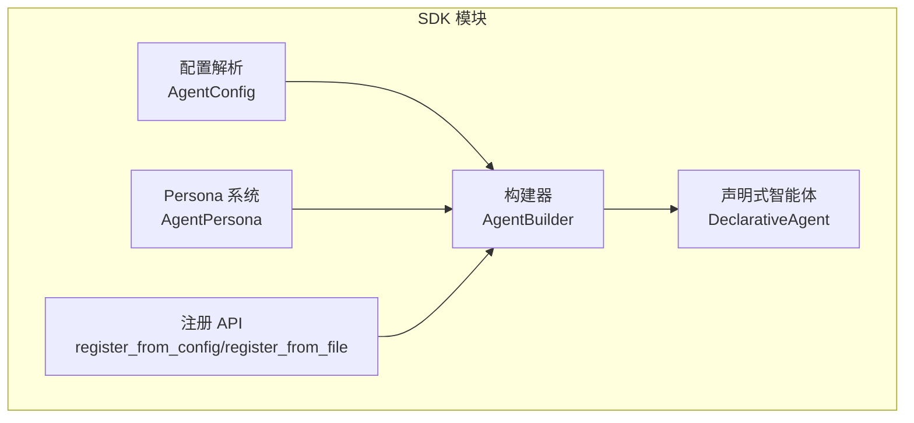
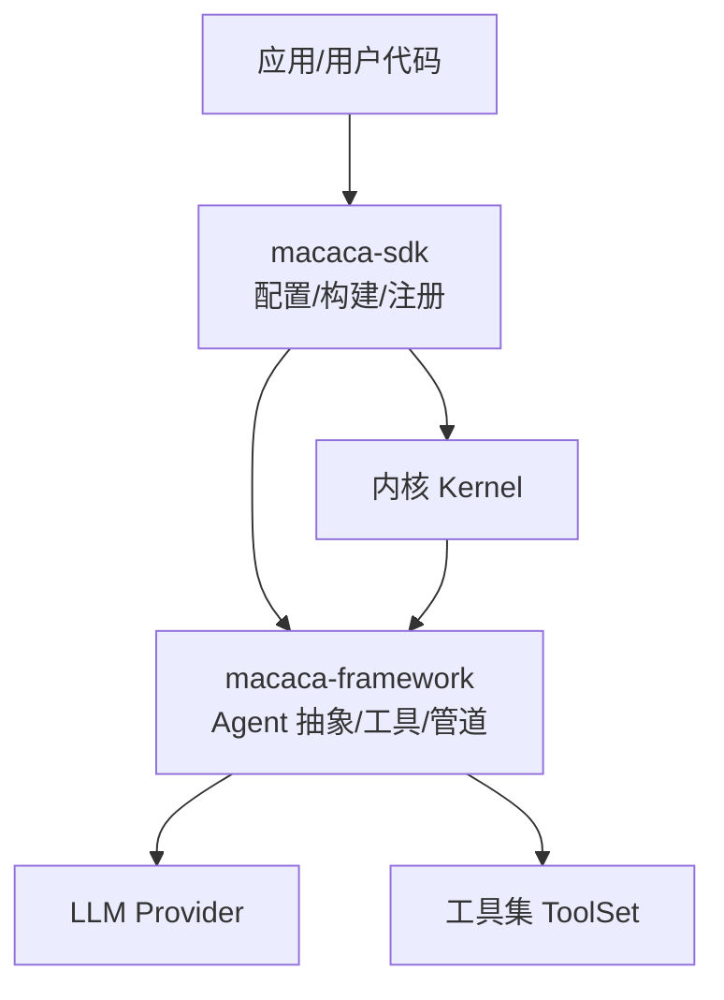
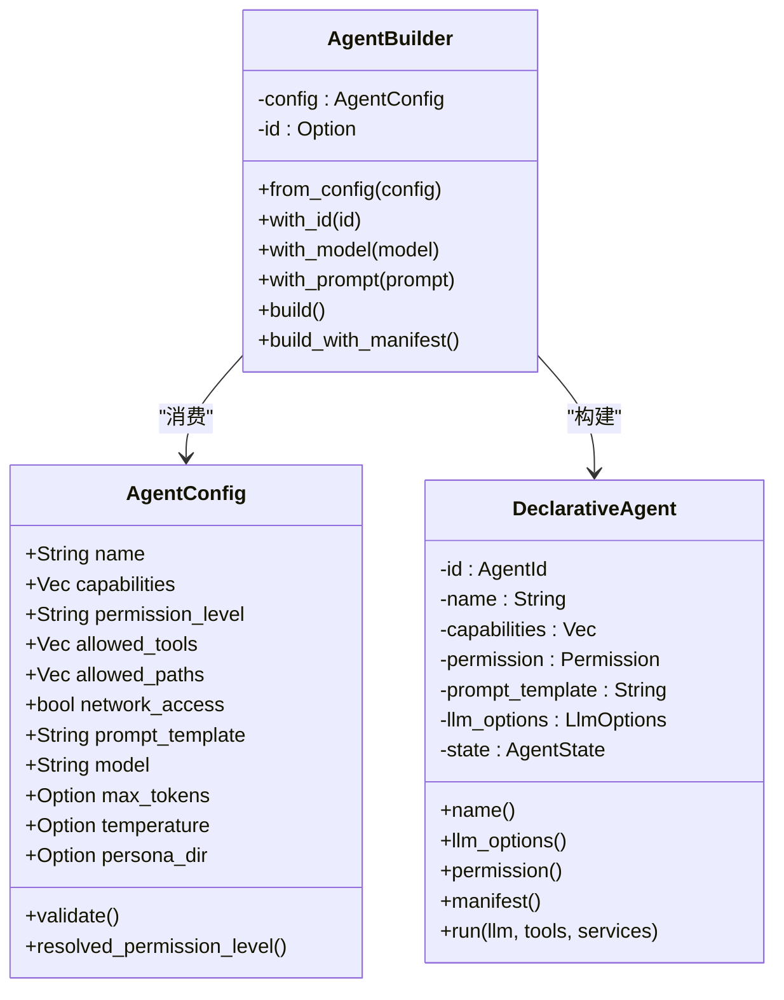
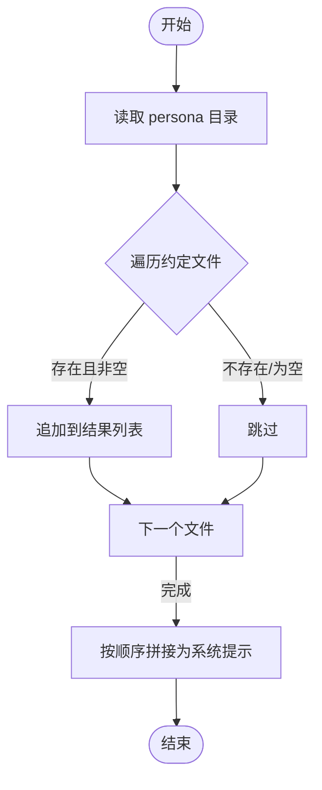
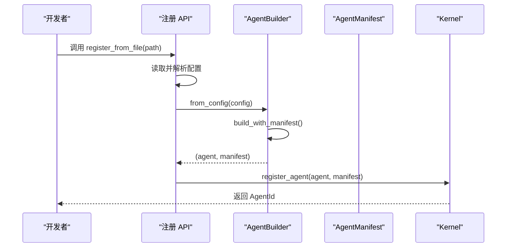
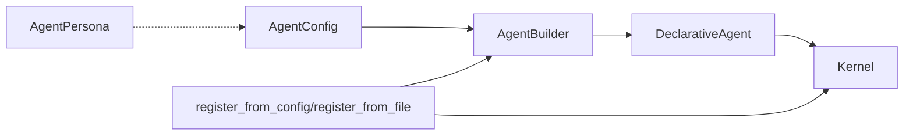

# SDK使用

<cite>
**本文档引用的文件**
- [lib.rs](file://macaca/crates/macaca-sdk/src/lib.rs)
- [builder.rs](file://macaca/crates/macaca-sdk/src/builder.rs)
- [config.rs](file://macaca/crates/macaca-sdk/src/config.rs)
- [persona.rs](file://macaca/crates/macaca-sdk/src/persona.rs)
- [registry_api.rs](file://macaca/crates/macaca-sdk/src/registry_api.rs)
- [code-gen-agent.yaml](file://macaca/examples/todo-app-demo/code-gen-agent.yaml)
- [task-planner-agent.yaml](file://macaca/examples/todo-app-demo/task-planner-agent.yaml)
- [code-review-agent.yaml](file://macaca/examples/custom-agent-yaml/code-review-agent.yaml)
- [lib.rs](file://macaca/crates/macaca-framework/src/lib.rs)
- [README.md](file://macaca/README.md)
</cite>

## 目录
1. [简介](#简介)
2. [项目结构](#项目结构)
3. [核心组件](#核心组件)
4. [架构总览](#架构总览)
5. [详细组件分析](#详细组件分析)
6. [依赖关系分析](#依赖关系分析)
7. [性能考量](#性能考量)
8. [故障排查指南](#故障排查指南)
9. [结论](#结论)
10. [附录](#附录)

## 简介
本指南面向希望在 Agent OS 中使用 SDK 快速构建与注册智能体（Agent）的开发者。内容覆盖：
- 构建器 API 的设计理念与链式调用方式
- 配置 API 的功能与参数校验
- Persona 定义与系统提示拼装
- 从简单到复杂的工作流配置示例
- 高级能力：动态配置、运行时修改、插件扩展思路
- 最佳实践与性能优化建议

SDK 提供 YAML/TOML 声明式配置解析、流畅构建器（fluent builder）、以及将 Agent 注册到内核的辅助接口。

## 项目结构
SDK 位于 Rust 工作区的 macaca-sdk 子 crate，核心模块如下：
- 配置解析：AgentConfig（YAML/TOML → 结构化配置）
- 构建器：AgentBuilder（基于配置构建 DeclarativeAgent）
- Persona：从目录加载多段 Markdown 并拼装为系统提示
- 注册 API：从配置或文件注册 Agent 到内核

图表来源
- [lib.rs:1-16](file://macaca/crates/macaca-sdk/src/lib.rs#L1-L16)
- [config.rs:1-305](file://macaca/crates/macaca-sdk/src/config.rs#L1-L305)
- [builder.rs:1-316](file://macaca/crates/macaca-sdk/src/builder.rs#L1-L316)
- [persona.rs:1-269](file://macaca/crates/macaca-sdk/src/persona.rs#L1-L269)
- [registry_api.rs:1-173](file://macaca/crates/macaca-sdk/src/registry_api.rs#L1-L173)

章节来源
- [lib.rs:1-16](file://macaca/crates/macaca-sdk/src/lib.rs#L1-L16)
- [README.md:1-29](file://macaca/README.md#L1-L29)

## 核心组件
- 配置模型（AgentConfig）：支持必填字段校验、权限级别解析、温度范围约束、模型与采样参数等。
- 构建器（AgentBuilder）：提供 with_id、with_model、with_prompt 等链式方法；build/build_with_manifest 产出 DeclarativeAgent 与 AgentManifest。
- 声明式智能体（DeclarativeAgent）：实现 Agent trait，run 时构造系统消息并调用 LLM Provider。
- Persona（AgentPersona）：按约定顺序加载 BOOTSTRAP/IDENTITY/AGENTS/SOUL/USER/TOOLS/HEARTBEAT 等 Markdown 文件，拼接为系统提示。
- 注册 API：将 Agent 注册到内核，支持从配置对象或文件路径加载。

章节来源
- [config.rs:1-305](file://macaca/crates/macaca-sdk/src/config.rs#L1-L305)
- [builder.rs:1-316](file://macaca/crates/macaca-sdk/src/builder.rs#L1-L316)
- [persona.rs:1-269](file://macaca/crates/macaca-sdk/src/persona.rs#L1-L269)
- [registry_api.rs:1-173](file://macaca/crates/macaca-sdk/src/registry_api.rs#L1-L173)

## 架构总览
SDK 与框架、内核的关系如下：

图表来源
- [lib.rs:1-32](file://macaca/crates/macaca-framework/src/lib.rs#L1-L32)
- [registry_api.rs:1-173](file://macaca/crates/macaca-sdk/src/registry_api.rs#L1-L173)
- [builder.rs:1-316](file://macaca/crates/macaca-sdk/src/builder.rs#L1-L316)

## 详细组件分析

### 配置 API（AgentConfig）
- 支持 YAML 与 TOML 解析，自动根据扩展名选择格式。
- 关键字段与默认值：
  - name：必填，不能为空
  - permission_level：默认 "user"，仅允许 "system"/"user"
  - allowed_tools/allowed_paths/network_access：权限控制
  - prompt_template：系统提示模板
  - model/max_tokens/temperature：模型与采样参数
  - persona_dir：可选，指向包含 Persona Markdown 的目录
- 校验规则：
  - name 非空
  - permission_level 限定
  - capabilities.name 非空
  - temperature 在 [0.0, 2.0] 范围内

使用要点
- 从字符串解析：from_yaml/from_toml
- 从文件解析：from_file（按扩展名自动识别）
- 校验：validate（在构建器 build 前自动调用）

章节来源
- [config.rs:1-305](file://macaca/crates/macaca-sdk/src/config.rs#L1-L305)

### 构建器 API（AgentBuilder）
- 入口：from_config
- 链式方法：
  - with_id：覆盖 AgentId（便于测试）
  - with_model：覆盖模型名
  - with_prompt：覆盖提示模板
- 构建产物：
  - build：返回 DeclarativeAgent
  - build_with_manifest：同时返回 (DeclarativeAgent, AgentManifest)
- 内部转换：
  - 权限级别解析为 PermissionLevel
  - LlmOptions 组装（model/max_tokens/temperature/stop_sequences/tools 等）

运行时行为
- run：若未设置 prompt_template，直接报错
- run：构造系统消息与用户消息，调用 LLM Provider，返回结果与 token 使用量

图表来源
- [builder.rs:1-316](file://macaca/crates/macaca-sdk/src/builder.rs#L1-L316)
- [config.rs:1-305](file://macaca/crates/macaca-sdk/src/config.rs#L1-L305)

章节来源
- [builder.rs:1-316](file://macaca/crates/macaca-sdk/src/builder.rs#L1-L316)

### Persona 系统（AgentPersona）
- 加载策略：按固定顺序扫描目录中的约定文件，忽略不存在与空白文件
- 输出：to_system_prompt 可将基础提示与各节内容拼接为最终系统提示
- 空性判断：is_empty/section_count

图表来源
- [persona.rs:1-269](file://macaca/crates/macaca-sdk/src/persona.rs#L1-L269)

章节来源
- [persona.rs:1-269](file://macaca/crates/macaca-sdk/src/persona.rs#L1-L269)

### 注册 API（Kernel 集成）
- register_from_config：从配置构建并注册
- register_from_file：从文件路径加载配置后注册（自动识别 .yaml/.yml 或 .toml）

图表来源
- [registry_api.rs:1-173](file://macaca/crates/macaca-sdk/src/registry_api.rs#L1-L173)
- [builder.rs:1-316](file://macaca/crates/macaca-sdk/src/builder.rs#L1-L316)

章节来源
- [registry_api.rs:1-173](file://macaca/crates/macaca-sdk/src/registry_api.rs#L1-L173)

## 依赖关系分析
- SDK 对框架与内核的依赖集中在注册流程与 Agent trait 实现上
- 构建器依赖配置模型与协议类型（Capability、Permission、LlmOptions、AgentState 等）
- Persona 与配置解耦，可通过配置中的 persona_dir 引入

图表来源
- [lib.rs:1-16](file://macaca/crates/macaca-sdk/src/lib.rs#L1-L16)
- [builder.rs:1-316](file://macaca/crates/macaca-sdk/src/builder.rs#L1-L316)
- [config.rs:1-305](file://macaca/crates/macaca-sdk/src/config.rs#L1-L305)
- [persona.rs:1-269](file://macaca/crates/macaca-sdk/src/persona.rs#L1-L269)
- [registry_api.rs:1-173](file://macaca/crates/macaca-sdk/src/registry_api.rs#L1-L173)

章节来源
- [lib.rs:1-16](file://macaca/crates/macaca-sdk/src/lib.rs#L1-L16)

## 性能考量
- 采样参数：合理设置 temperature 与 max_tokens，避免不必要的长输出与高随机性导致的重复计算
- Prompt 模板：保持简洁明确，减少上下文长度以降低 token 成本
- 文件 I/O：Persona 加载为异步操作，建议缓存已加载内容或在启动阶段预热
- 注册与清单：build_with_manifest 会生成 AgentManifest，适合批量注册场景复用清单

## 故障排查指南
常见错误与定位
- 配置校验失败：检查 name、permission_level、capabilities.name、temperature 范围
- 文件格式不支持：确保扩展名为 .yaml/.yml 或 .toml
- 运行时报错“无提示模板”：确认 prompt_template 已设置或通过 with_prompt 覆盖
- 注册失败：核对 Kernel 配置与 LLM Provider 是否可用

章节来源
- [config.rs:110-143](file://macaca/crates/macaca-sdk/src/config.rs#L110-L143)
- [builder.rs:153-180](file://macaca/crates/macaca-sdk/src/builder.rs#L153-L180)
- [registry_api.rs:154-171](file://macaca/crates/macaca-sdk/src/registry_api.rs#L154-L171)

## 结论
本 SDK 以声明式配置为核心，结合流畅构建器与注册 API，帮助开发者快速、安全地构建与部署智能体。配合 Persona 系统，可在不侵入业务逻辑的前提下实现角色化与行为规范化。建议在生产环境中：
- 使用 YAML/TOML 明确配置，开启严格校验
- 合理划分权限与工具范围
- 通过 Persona 统一组织角色与行为约束
- 在注册前进行本地验证与基准测试

## 附录

### 使用示例索引
- 代码生成 Agent 配置：[code-gen-agent.yaml:1-26](file://macaca/examples/todo-app-demo/code-gen-agent.yaml#L1-L26)
- 任务规划 Agent 配置：[task-planner-agent.yaml:1-22](file://macaca/examples/todo-app-demo/task-planner-agent.yaml#L1-L22)
- 代码评审 Agent 配置：[code-review-agent.yaml:1-26](file://macaca/examples/custom-agent-yaml/code-review-agent.yaml#L1-L26)

示例说明
- 三者均采用 YAML 声明式配置，包含 name、capabilities、permission_level、allowed_tools/allowed_paths、prompt_template、model、max_tokens、temperature 等字段
- 可作为最小可用 Agent 的模板，按需增删 capabilities 与工具授权

章节来源
- [code-gen-agent.yaml:1-26](file://macaca/examples/todo-app-demo/code-gen-agent.yaml#L1-L26)
- [task-planner-agent.yaml:1-22](file://macaca/examples/todo-app-demo/task-planner-agent.yaml#L1-L22)
- [code-review-agent.yaml:1-26](file://macaca/examples/custom-agent-yaml/code-review-agent.yaml#L1-L26)

### 高级能力与扩展建议
- 动态配置：在运行时根据环境变量或外部配置源更新 AgentConfig，重新构建并替换运行实例（注意状态一致性）
- 运行时修改：通过 Kernel 的生命周期钩子或会话上下文注入临时变更（需遵循权限策略）
- 插件扩展：结合工具集与驱动系统，按需扩展工具与 MCP 集成，通过 allowed_tools/allowed_paths 控制访问面

章节来源
- [lib.rs:1-32](file://macaca/crates/macaca-framework/src/lib.rs#L1-L32)
- [registry_api.rs:1-173](file://macaca/crates/macaca-sdk/src/registry_api.rs#L1-L173)