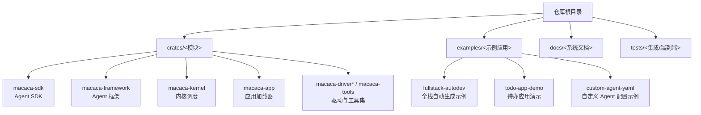
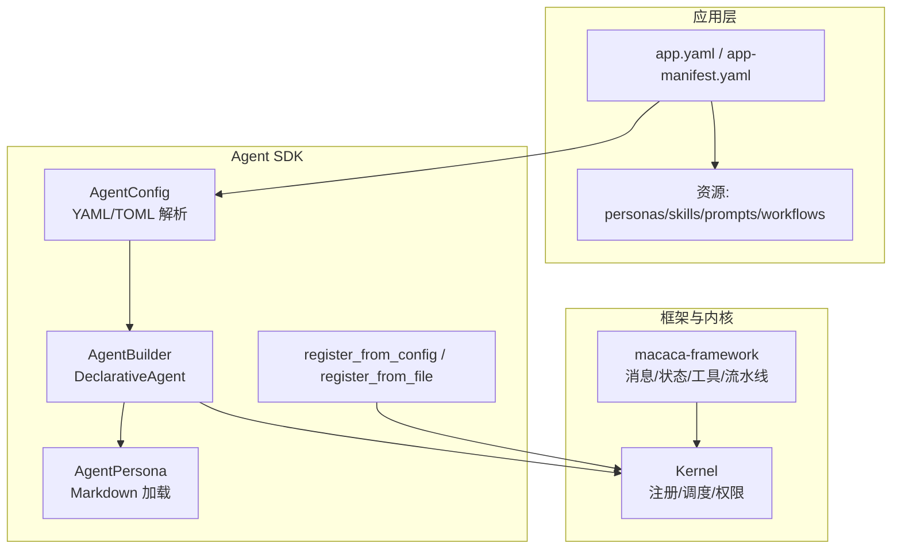
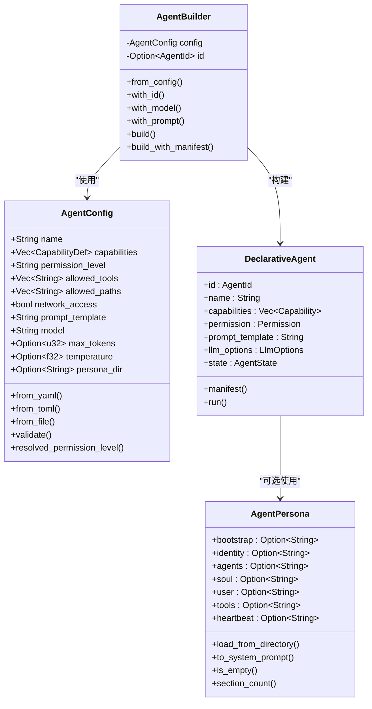
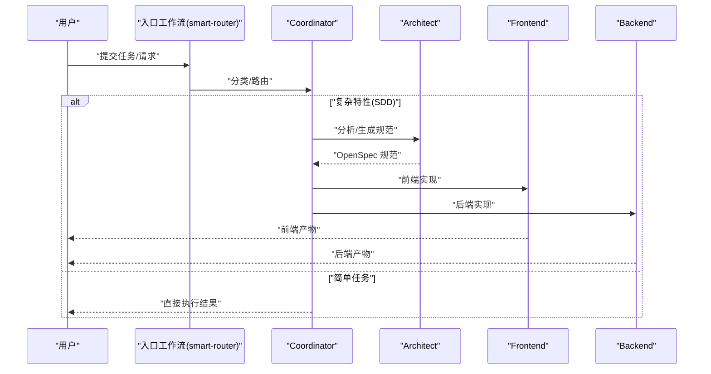
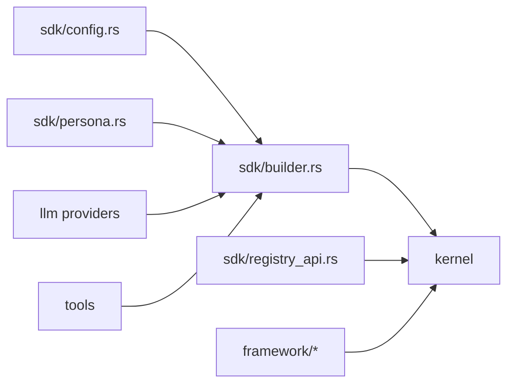

# 应用开发

<cite>
**本文档引用的文件**
- [README.md](file://macaca/README.md)
- [app.yaml](file://macaca/examples/apps/fullstack-autodev/app.yaml)
- [app-manifest.yaml](file://macaca/examples/todo-app-demo/app-manifest.yaml)
- [app-manifest.yaml](file://macaca/examples/custom-agent-yaml/app-manifest.yaml)
- [builder.rs](file://macaca/crates/macaca-sdk/src/builder.rs)
- [config.rs](file://macaca/crates/macaca-sdk/src/config.rs)
- [persona.rs](file://macaca/crates/macaca-sdk/src/persona.rs)
- [registry_api.rs](file://macaca/crates/macaca-sdk/src/registry_api.rs)
- [lib.rs](file://macaca/crates/macaca-framework/src/lib.rs)
- [Cargo.toml](file://macaca/Cargo.toml)
- [Cargo.lock](file://macaca/Cargo.lock)
- [AGENTS.md](file://openspec/AGENTS.md)
</cite>

## 目录
1. [引言](#引言)
2. [项目结构](#项目结构)
3. [核心组件](#核心组件)
4. [架构总览](#架构总览)
5. [详细组件分析](#详细组件分析)
6. [依赖关系分析](#依赖关系分析)
7. [性能考虑](#性能考虑)
8. [故障排查指南](#故障排查指南)
9. [结论](#结论)
10. [附录](#附录)

## 引言
本指南面向希望在 Macaca 生态中开发应用的工程师，系统讲解两类开发模式：L3 声明式开发与 L1 原生 Rust 开发；并覆盖应用配置管理（app.yaml 结构、Persona 定义、工作流设置）、Agent SDK 使用方法（Agent 构建器、配置 API、注册与开发工具），以及从需求分析到部署上线的完整流程。文档同时提供示例应用分析、最佳实践与常见问题解决方案。

## 项目结构
Macaca 是一个面向真实多 Agent 应用的 Agent OS，强调 7×24 自动规划、自动执行与自我唤醒。仓库采用 Rust Workspace 组织，核心模块分布在 crates 下，examples 提供示例应用与 persona/workflow 配置，docs 提供系统定义与审计文档。

章节来源
- [README.md:1-29](file://macaca/README.md#L1-L29)

## 核心组件
- Agent SDK：提供声明式 Agent 的配置解析、构建器与注册 API，支持 YAML/TOML 配置与 Persona 加载。
- Agent 框架：提供统一消息类型、ReAct 推理循环、记忆系统、工具集与流水线编排等能力。
- 应用层：通过 app.yaml/app-manifest.yaml 描述应用层别（L3/L1）与资源路径、工作流与 Agent 清单。
- 内核与调度：负责 Agent 生命周期、权限控制、任务路由与执行。

章节来源
- [lib.rs:1-32](file://macaca/crates/macaca-framework/src/lib.rs#L1-L32)

## 架构总览
下图展示应用配置、Agent SDK、框架与内核之间的交互关系，以及 L3 声明式与 L1 原生开发的分界。

图表来源
- [builder.rs:16-94](file://macaca/crates/macaca-sdk/src/builder.rs#L16-L94)
- [config.rs:8-51](file://macaca/crates/macaca-sdk/src/config.rs#L8-L51)
- [persona.rs:27-44](file://macaca/crates/macaca-sdk/src/persona.rs#L27-L44)
- [registry_api.rs:11-27](file://macaca/crates/macaca-sdk/src/registry_api.rs#L11-L27)
- [lib.rs:14-31](file://macaca/crates/macaca-framework/src/lib.rs#L14-L31)

## 详细组件分析

### 应用配置管理（app.yaml 与 app-manifest.yaml）
- 应用元数据与层别：name、version、description、layer（如 L3Declarative）、ui_type。
- LLM 配置：provider、model。
- 入口与工作流：entrypoint.type/name 指定入口工作流；workflows 定义步骤序列与依赖。
- 资源路径：personas、skills、prompts、workflows 目录映射。
- Agent 列表：agents 定义各 Agent 的能力、模型、权限、允许工具与 persona_dir。

示例应用分析
- fullstack-autodev：定义智能路由、SDD 规划、直接编码与聊天四种工作流，包含多个角色 Agent（coordinator、architect、frontend、planner、backend）。
- todo-app-demo 与 custom-agent-yaml：分别通过 app-manifest.yaml 声明应用与 Agent 清单，体现 L3 声明式组织方式。

章节来源
- [app.yaml:1-146](file://macaca/examples/apps/fullstack-autodev/app.yaml#L1-L146)
- [app-manifest.yaml:1-7](file://macaca/examples/todo-app-demo/app-manifest.yaml#L1-L7)
- [app-manifest.yaml:1-6](file://macaca/examples/custom-agent-yaml/app-manifest.yaml#L1-L6)

### Agent SDK 使用指南
- AgentConfig：支持从 YAML/TOML 解析，字段包括 name、capabilities、permission_level、allowed_tools、allowed_paths、network_access、prompt_template、model、max_tokens、temperature、persona_dir。提供 validate 与 resolved_permission_level。
- AgentBuilder：从 AgentConfig 构建 DeclarativeAgent，支持 with_id/with_model/with_prompt 等链式配置；build/build_with_manifest 生成 Agent 与清单。
- AgentPersona：按固定顺序加载 BOOTSTRAP/IDENTITY/AGENTS/SOUL/USER/TOOLS/HEARTBEAT 多段 Markdown，拼接为系统提示词。
- 注册 API：register_from_config/register_from_file 将 Agent 注册至 Kernel。

图表来源
- [config.rs:8-51](file://macaca/crates/macaca-sdk/src/config.rs#L8-L51)
- [builder.rs:16-94](file://macaca/crates/macaca-sdk/src/builder.rs#L16-L94)
- [builder.rs:96-137](file://macaca/crates/macaca-sdk/src/builder.rs#L96-L137)
- [persona.rs:27-44](file://macaca/crates/macaca-sdk/src/persona.rs#L27-L44)

章节来源
- [config.rs:71-152](file://macaca/crates/macaca-sdk/src/config.rs#L71-L152)
- [builder.rs:22-94](file://macaca/crates/macaca-sdk/src/builder.rs#L22-L94)
- [persona.rs:52-147](file://macaca/crates/macaca-sdk/src/persona.rs#L52-L147)
- [registry_api.rs:11-27](file://macaca/crates/macaca-sdk/src/registry_api.rs#L11-L27)

### 工作流与执行序列（以 fullstack-autodev 为例）

图表来源
- [app.yaml:17-57](file://macaca/examples/apps/fullstack-autodev/app.yaml#L17-L57)

章节来源
- [app.yaml:11-57](file://macaca/examples/apps/fullstack-autodev/app.yaml#L11-L57)

### Persona 定义与系统提示词生成
- 支持的文件：BOOTSTRAP/IDENTITY/AGENTS/SOUL/USER/TOOLS/HEARTBEAT，按顺序拼接为系统提示词。
- 可选 base_prompt 前缀；空内容或缺失文件会被忽略。
- 适用于 DeclarativeAgent 的 prompt_template 或作为系统提示词注入。

章节来源
- [persona.rs:16-25](file://macaca/crates/macaca-sdk/src/persona.rs#L16-L25)
- [persona.rs:120-146](file://macaca/crates/macaca-sdk/src/persona.rs#L120-L146)

### L3 声明式开发 vs L1 原生 Rust 开发
- L3 声明式（app.yaml/app-manifest.yaml）：通过配置文件描述应用、工作流与 Agent 清单，适合快速搭建多 Agent 协作应用，强调“所见即所得”的声明式组织。
- L1 原生 Rust：直接使用 macaca-framework 与 SDK 在代码中构建 Agent、流水线与会话，适合需要深度定制与高性能控制的场景。

章节来源
- [app.yaml:4](file://macaca/examples/apps/fullstack-autodev/app.yaml#L4)
- [app-manifest.yaml](file://macaca/examples/todo-app-demo/app-manifest.yaml#L3)
- [lib.rs:1-13](file://macaca/crates/macaca-framework/src/lib.rs#L1-L13)

## 依赖关系分析
- Agent SDK 依赖 macaca-proto（类型与错误）、macaca-llm（LLM 提供者接口）、macaca-tools（工具集）。
- 注册 API 依赖 Kernel（注册与生命周期管理）。
- 框架模块提供消息、状态、工具、流水线、A2A 协议等能力，支撑 Agent 执行与协作。

图表来源
- [config.rs:8-14](file://macaca/crates/macaca-sdk/src/config.rs#L8-L14)
- [builder.rs:6-14](file://macaca/crates/macaca-sdk/src/builder.rs#L6-L14)
- [registry_api.rs:5-9](file://macaca/crates/macaca-sdk/src/registry_api.rs#L5-L9)
- [lib.rs:14-31](file://macaca/crates/macaca-framework/src/lib.rs#L14-L31)

章节来源
- [Cargo.toml](file://macaca/Cargo.toml)
- [Cargo.lock](file://macaca/Cargo.lock)

## 性能考虑
- 配置校验前置：在构建 Agent 前进行 validate，避免运行期错误导致的重试与回滚成本。
- Prompt 模板与 Persona 合理拆分：将通用系统指令与角色身份分离，减少重复计算与上下文膨胀。
- 工具调用与网络访问：根据 permission_level 限制 allowed_tools 与 allowed_paths，避免不必要的 IO 与网络开销。
- 流水线编排：对高延迟工具采用异步/并行策略，结合队列与回调优化吞吐。

## 故障排查指南
- 配置解析失败：检查 YAML/TOML 文件扩展名与格式，确认 required 字段（如 name）非空。
- 权限级别非法：permission_level 必须为 system 或 user。
- 温度值越界：temperature 必须在 [0.0, 2.0] 区间。
- Agent 无提示模板：DeclarativeAgent.run 要求 prompt_template 非空。
- 注册失败：核对 Kernel 初始化参数与 LLM/工具集注入是否正确。

章节来源
- [config.rs:110-143](file://macaca/crates/macaca-sdk/src/config.rs#L110-L143)
- [builder.rs:153-180](file://macaca/crates/macaca-sdk/src/builder.rs#L153-L180)
- [registry_api.rs:78-172](file://macaca/crates/macaca-sdk/src/registry_api.rs#L78-L172)

## 结论
通过 L3 声明式与 L1 原生 Rust 两种模式，开发者可以在 Macaca 中高效地构建从简单到复杂的多 Agent 应用。配合完善的配置管理、Agent SDK 与框架能力，可以实现从需求分析到部署上线的全链路闭环。建议优先使用 L3 声明式快速验证想法，再在需要时迁移到 L1 原生开发以获得更强的定制性与性能。

## 附录

### 开发流程（从需求到上线）
- 需求分析：确定应用层别（L3/L1）、角色分工与工作流类型（路由/规划/执行/聊天）。
- 配置设计：编写 app.yaml/app-manifest.yaml，定义 agents、workflows、resources 与 llm_config。
- Agent 设计：使用 AgentConfig/AgentBuilder 定义 Agent 能力、权限与工具集；必要时加载 Persona。
- 开发与测试：在本地运行 Kernel，注册 Agent 并调试工作流；利用集成测试与端到端脚本验证。
- 部署与运维：打包应用，配置持久化与监控，按需启用网关与 Web UI。

章节来源
- [app.yaml:1-146](file://macaca/examples/apps/fullstack-autodev/app.yaml#L1-L146)
- [lib.rs:1-13](file://macaca/crates/macaca-framework/src/lib.rs#L1-L13)

### 最佳实践
- 将角色职责与工具权限解耦，通过 persona_dir 与 allowed_tools 明确 Agent 边界。
- 使用工作流依赖（depends_on）保证任务顺序与一致性。
- 对复杂特性采用 SDD（Spec-Driven Development）工作流，确保设计与实现可追溯。
- 在开发阶段使用最小可行配置，逐步增加能力与工具，便于定位问题。

### 常见问题与解答
- 问：如何选择 L3 与 L1 模式？
  答：若追求快速落地与声明式组织，优先 L3；若需要深度定制或极致性能，选择 L1。
- 问：Agent 无法注册？
  答：检查配置 validate 结果、Kernel 初始化参数与 LLM/工具集注入。
- 问：Persona 不生效？
  答：确认 persona_dir 存在且包含有效 Markdown 文件，注意文件顺序与空内容过滤。