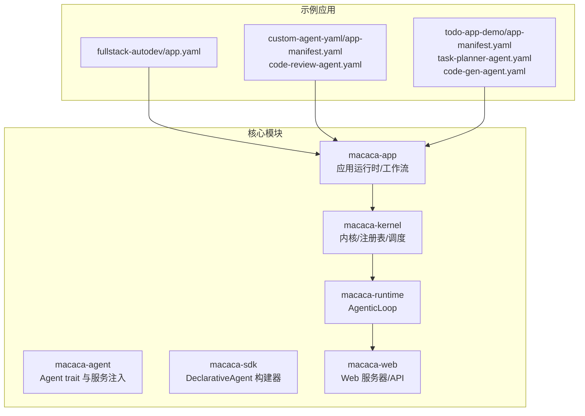
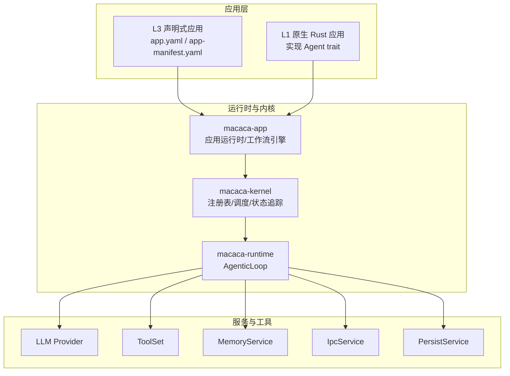
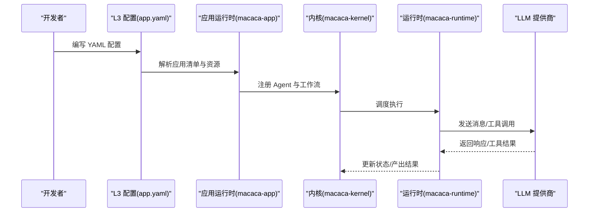
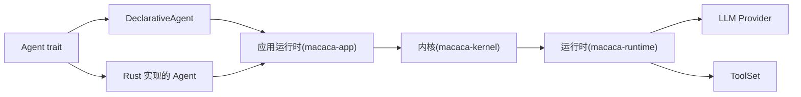

# 开发模式

<cite>
**本文引用的文件**
- [macaca/examples/apps/fullstack-autodev/app.yaml](file://macaca/examples/apps/fullstack-autodev/app.yaml)
- [macaca/examples/custom-agent-yaml/app-manifest.yaml](file://macaca/examples/custom-agent-yaml/app-manifest.yaml)
- [macaca/examples/custom-agent-yaml/code-review-agent.yaml](file://macaca/examples/custom-agent-yaml/code-review-agent.yaml)
- [macaca/examples/todo-app-demo/app-manifest.yaml](file://macaca/examples/todo-app-demo/app-manifest.yaml)
- [macaca/examples/todo-app-demo/code-gen-agent.yaml](file://macaca/examples/todo-app-demo/code-gen-agent.yaml)
- [macaca/examples/todo-app-demo/task-planner-agent.yaml](file://macaca/examples/todo-app-demo/task-planner-agent.yaml)
- [macaca/ARCHITECTURE-v2.md](file://macaca/ARCHITECTURE-v2.md)
- [macaca/README.md](file://macaca/README.md)
- [macaca/crates/macaca-agent/src/agent.rs](file://macaca/crates/macaca-agent/src/agent.rs)
- [macaca/crates/macaca-sdk/src/builder.rs](file://macaca/crates/macaca-sdk/src/builder.rs)
</cite>

## 目录
1. [简介](#简介)
2. [项目结构](#项目结构)
3. [核心组件](#核心组件)
4. [架构总览](#架构总览)
5. [详细组件分析](#详细组件分析)
6. [依赖分析](#依赖分析)
7. [性能考量](#性能考量)
8. [故障排查指南](#故障排查指南)
9. [结论](#结论)
10. [附录](#附录)

## 简介
本文件聚焦于两种开发模式的系统性对比：L3 声明式开发与 L1 原生 Rust 开发。前者通过 YAML/JSON 等声明式配置快速搭建应用，强调“配置即代码”，具备上手快、维护成本低、团队协作友好的优势；后者通过 Rust 直接实现 Agent trait，强调“逻辑即代码”，具备更高的灵活性、性能潜力与深度定制能力。本文将结合仓库中的实际示例与架构文档，给出两者的技术特征、适用场景、选择原则与实践建议。

## 项目结构
本仓库采用多 Crate 的 Rust 工作区组织，核心模块围绕“内核-运行时-应用-工具-驱动-网关”等层次划分；示例应用位于 examples 目录，包含 L3 声明式应用与 YAML 驱动的 Agent 配置。顶层 README 提供了阅读路径与关注重点，便于初学者快速定位系统定义与审计文档。

**图表来源**
- [macaca/README.md:1-29](file://macaca/README.md#L1-L29)
- [macaca/examples/apps/fullstack-autodev/app.yaml:1-146](file://macaca/examples/apps/fullstack-autodev/app.yaml#L1-L146)
- [macaca/examples/custom-agent-yaml/app-manifest.yaml:1-6](file://macaca/examples/custom-agent-yaml/app-manifest.yaml#L1-L6)
- [macaca/examples/todo-app-demo/app-manifest.yaml:1-7](file://macaca/examples/todo-app-demo/app-manifest.yaml#L1-L7)

**章节来源**
- [macaca/README.md:1-29](file://macaca/README.md#L1-L29)

## 核心组件
- L3 声明式开发（YAML 配置）
  - 应用清单与资源路径：通过 app.yaml 定义应用元信息、入口工作流、资源目录与代理人（agents）列表。
  - 应用清单聚合：app-manifest.yaml 将多个 YAML Agent 聚合为单一应用。
  - 示例：全栈自动开发应用、代码评审 Agent、任务规划与代码生成 Agent。
- L1 原生 Rust 开发
  - Agent trait：统一的 Agent 接口，定义标识、能力、状态与执行逻辑。
  - DeclarativeAgent 构建器：从 YAML/JSON 配置构建声明式 Agent，注入 LLM 与工具集。
  - 服务注入：MemoryService、IpcService、PersistService 等可选服务在运行时注入。

**章节来源**
- [macaca/examples/apps/fullstack-autodev/app.yaml:1-146](file://macaca/examples/apps/fullstack-autodev/app.yaml#L1-L146)
- [macaca/examples/custom-agent-yaml/app-manifest.yaml:1-6](file://macaca/examples/custom-agent-yaml/app-manifest.yaml#L1-L6)
- [macaca/examples/todo-app-demo/app-manifest.yaml:1-7](file://macaca/examples/todo-app-demo/app-manifest.yaml#L1-L7)
- [macaca/crates/macaca-agent/src/agent.rs:1-77](file://macaca/crates/macaca-agent/src/agent.rs#L1-L77)
- [macaca/crates/macaca-sdk/src/builder.rs:1-316](file://macaca/crates/macaca-sdk/src/builder.rs#L1-L316)

## 架构总览
下图展示了 L3 与 L1 两种开发模式在系统中的位置与交互关系。L3 通过应用运行时加载 YAML 配置，构建 DeclarativeAgent 并注册到内核；L1 则直接实现 Agent trait，由内核进行注册与调度。

**图表来源**
- [macaca/ARCHITECTURE-v2.md:494-556](file://macaca/ARCHITECTURE-v2.md#L494-L556)
- [macaca/crates/macaca-sdk/src/builder.rs:139-181](file://macaca/crates/macaca-sdk/src/builder.rs#L139-L181)
- [macaca/crates/macaca-agent/src/agent.rs:37-77](file://macaca/crates/macaca-agent/src/agent.rs#L37-L77)

## 详细组件分析

### L3 声明式开发（YAML 配置）
- 配置模型
  - 应用清单：定义应用名称、版本、描述、分层标识（layer）、UI 类型、LLM 配置、入口工作流与资源路径。
  - 代理人（Agents）：声明每个 Agent 的能力、权限、允许工具、人物设定目录等。
  - 工作流（Workflows）：定义步骤序列、依赖关系与提示词模板。
- 示例对比
  - 全栈自动开发应用：定义智能路由、SDD（规范驱动开发）与直接编码等多条工作流，配合多个人物角色。
  - 自定义 Agent 聚合：通过 app-manifest.yaml 聚合多个 YAML Agent，形成复合应用。
  - 任务规划与代码生成：分别定义任务规划与代码生成 Agent 的能力、工具与提示词模板。
- 优势
  - 配置简洁：以 YAML 表达业务意图，减少样板代码。
  - 开发效率高：快速迭代与复用，适合原型与中大型协作项目。
  - 维护便利：集中式配置便于版本管理与审计。

**章节来源**
- [macaca/examples/apps/fullstack-autodev/app.yaml:1-146](file://macaca/examples/apps/fullstack-autodev/app.yaml#L1-L146)
- [macaca/examples/custom-agent-yaml/app-manifest.yaml:1-6](file://macaca/examples/custom-agent-yaml/app-manifest.yaml#L1-L6)
- [macaca/examples/todo-app-demo/app-manifest.yaml:1-7](file://macaca/examples/todo-app-demo/app-manifest.yaml#L1-L7)
- [macaca/examples/custom-agent-yaml/code-review-agent.yaml:1-26](file://macaca/examples/custom-agent-yaml/code-review-agent.yaml#L1-L26)
- [macaca/examples/todo-app-demo/task-planner-agent.yaml:1-22](file://macaca/examples/todo-app-demo/task-planner-agent.yaml#L1-L22)
- [macaca/examples/todo-app-demo/code-gen-agent.yaml:1-26](file://macaca/examples/todo-app-demo/code-gen-agent.yaml#L1-L26)

### L1 原生 Rust 开发（Agent trait）
- 核心接口
  - Agent trait：定义 Agent 的唯一标识、能力、状态与 run 方法，run 中可组合 LLM、工具集与可选服务。
  - 服务注入：MemoryService、IpcService、PersistService 提供记忆、IPC 与持久化能力。
- DeclarativeAgent 构建器
  - 从配置构建 DeclarativeAgent，设置权限、LLM 参数与提示词模板，随后注册到内核。
- 优势
  - 灵活：可按需实现复杂业务逻辑、状态机与外部集成。
  - 性能：直接调用内核 API，减少中间层开销。
  - 深度定制：可替换 LLM 提供商、记忆后端、工具集与网关适配器。

**章节来源**
- [macaca/crates/macaca-agent/src/agent.rs:1-77](file://macaca/crates/macaca-agent/src/agent.rs#L1-L77)
- [macaca/crates/macaca-sdk/src/builder.rs:139-181](file://macaca/crates/macaca-sdk/src/builder.rs#L139-L181)

### 两种模式的实现差异（以“任务规划”为例）
- L3 声明式
  - 配置：在 app.yaml 中定义工作流步骤与依赖，在 personas/ 目录下放置人物提示词，在 skills/ 目录下放置技能。
  - 执行：应用运行时解析配置，注册 Agent，按步骤调度执行。
- L1 原生 Rust
  - 代码：实现 Agent trait，编写 run 方法，组合 LLM 与工具集，必要时注入 Memory/Ipc/Persist 服务。
  - 执行：由内核注册与调度，状态追踪与事件流推送。

**图表来源**
- [macaca/examples/apps/fullstack-autodev/app.yaml:1-146](file://macaca/examples/apps/fullstack-autodev/app.yaml#L1-L146)
- [macaca/ARCHITECTURE-v2.md:281-317](file://macaca/ARCHITECTURE-v2.md#L281-L317)

## 依赖分析
- L3 与 L1 的共同依赖
  - Agent trait 与 AgentServices：二者均依赖统一的 Agent 接口与服务注入机制。
  - LLM Provider 与 ToolSet：二者均通过 LLM Provider 与 ToolSet 执行推理与工具调用。
- L3 的额外依赖
  - 应用运行时：负责解析 YAML、加载 personas/skills/prompts/workflows 等资源。
  - 工作流引擎：按步骤与依赖关系编排 Agent 执行。
- L1 的额外依赖
  - 内核注册：直接实现 Agent 并注册到内核，获得统一的生命周期与状态管理。

**图表来源**
- [macaca/crates/macaca-agent/src/agent.rs:59-77](file://macaca/crates/macaca-agent/src/agent.rs#L59-L77)
- [macaca/crates/macaca-sdk/src/builder.rs:139-181](file://macaca/crates/macaca-sdk/src/builder.rs#L139-L181)

**章节来源**
- [macaca/crates/macaca-agent/src/agent.rs:1-77](file://macaca/crates/macaca-agent/src/agent.rs#L1-L77)
- [macaca/crates/macaca-sdk/src/builder.rs:1-316](file://macaca/crates/macaca-sdk/src/builder.rs#L1-L316)

## 性能考量
- L3 声明式
  - 优点：配置驱动，启动快、易部署；适合中大规模协作与快速试错。
  - 注意：配置解析与资源加载存在额外开销；复杂工作流可能带来调度与状态追踪的复杂度。
- L1 原生 Rust
  - 优点：逻辑直接、可内联优化；适合对性能敏感或需要深度定制的场景。
  - 注意：需要自行处理注册、调度与状态管理；开发与调试成本相对更高。
- 通用建议
  - 在原型阶段优先 L3，快速验证业务可行性；当出现性能瓶颈或定制需求时，迁移至 L1。
  - 对于高频调用与关键路径，优先考虑 L1；对于策略与流程编排，优先考虑 L3。

## 故障排查指南
- 常见问题与定位
  - Chat 绕过 Agent 系统：当前实现中，POST /api/chat 直接调用 LLM，未经过内核执行 Agent，导致状态始终为 Idle。应改为通过 Coordinator Agent 路由请求，交由内核执行并更新状态。
  - Agent 状态更新不完整：仅 execute_agent 会更新状态，Agent 内部活动（如工具调用）未细粒度上报。应在 AgenticLoop 中增加状态更新钩子或通过回调报告状态变化。
  - 工作流引擎未集成：app.yaml 中定义了工作流，但 chat 未触发工作流执行。应实现 WorkflowEngine 并在请求处理流程中集成。
- 修复方向
  - Chat 路由修正：将 /api/chat 路由到内核执行，由 Coordinator 分析意图并决定直接回复或触发工作流。
  - 状态追踪增强：在工具调用前后更新状态，确保前端 SSE 能正确反映 Agent 活动。
  - 工作流集成：在应用运行时中启用工作流引擎，按步骤调度各 Agent。

**章节来源**
- [macaca/ARCHITECTURE-v2.md:567-600](file://macaca/ARCHITECTURE-v2.md#L567-L600)

## 结论
- 选择原则
  - 优先 L3：当项目追求“快速搭建、易于维护、团队协作友好”时，优先采用声明式 YAML 配置。
  - 选择 L1：当项目需要“极致性能、深度定制、复杂业务逻辑”时，采用原生 Rust 实现。
- 实践建议
  - 原型与中试阶段使用 L3，成熟后再迁移到 L1。
  - 对于跨团队协作与产品化交付，L3 更具可维护性与可审计性。
  - 对于核心算法、高频路径与特殊集成场景，L1 更具可控性与扩展性。

## 附录
- 示例文件索引
  - 全栈自动开发应用：[app.yaml:1-146](file://macaca/examples/apps/fullstack-autodev/app.yaml#L1-L146)
  - 自定义 Agent 聚合：[app-manifest.yaml:1-6](file://macaca/examples/custom-agent-yaml/app-manifest.yaml#L1-L6)、[code-review-agent.yaml:1-26](file://macaca/examples/custom-agent-yaml/code-review-agent.yaml#L1-L26)
  - 任务规划与代码生成：[app-manifest.yaml:1-7](file://macaca/examples/todo-app-demo/app-manifest.yaml#L1-L7)、[task-planner-agent.yaml:1-22](file://macaca/examples/todo-app-demo/task-planner-agent.yaml#L1-L22)、[code-gen-agent.yaml:1-26](file://macaca/examples/todo-app-demo/code-gen-agent.yaml#L1-L26)
- 架构参考
  - 分层与多语言支持：[ARCHITECTURE-v2.md:494-556](file://macaca/ARCHITECTURE-v2.md#L494-L556)
  - Agent 接口与服务注入：[agent.rs:1-77](file://macaca/crates/macaca-agent/src/agent.rs#L1-L77)
  - DeclarativeAgent 构建器：[builder.rs:1-316](file://macaca/crates/macaca-sdk/src/builder.rs#L1-L316)