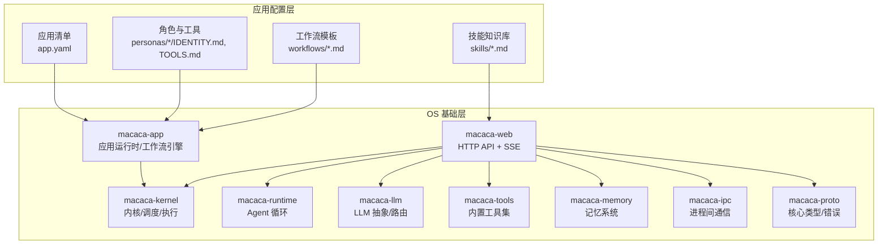
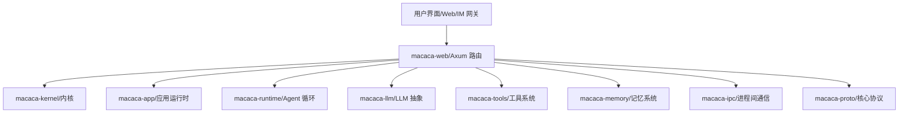
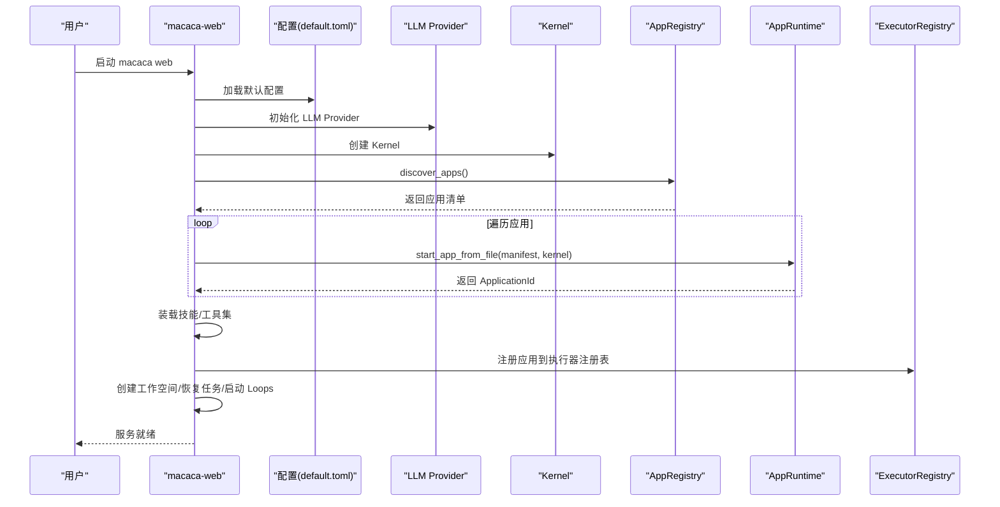
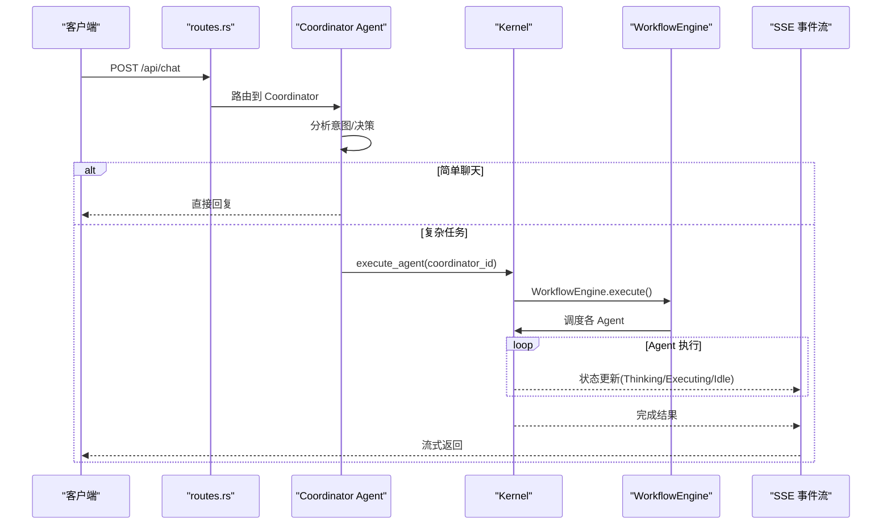
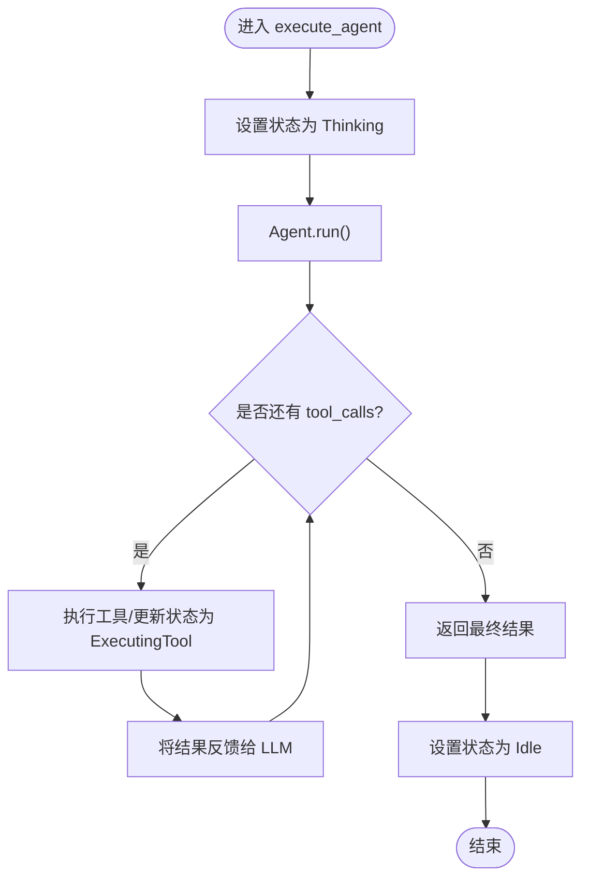
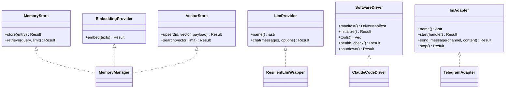
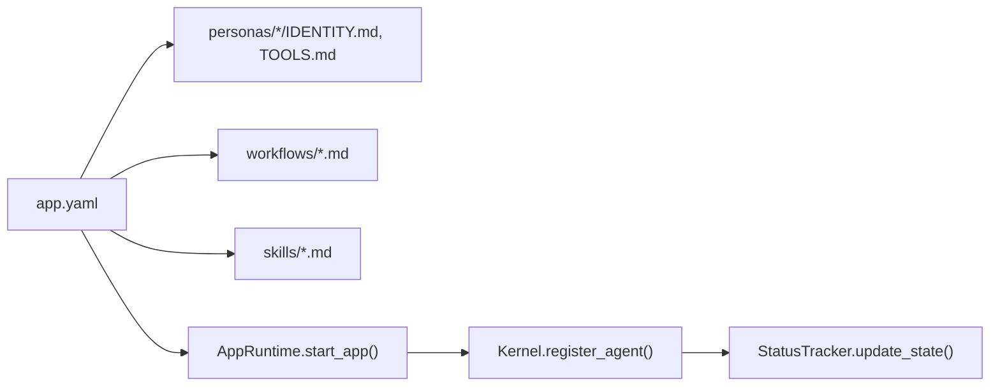

# 开发流程

<cite>
**本文档引用的文件**
- [macaca/README.md](file://macaca/README.md)
- [macaca/Cargo.toml](file://macaca/Cargo.toml)
- [macaca/ARCHITECTURE-v2.md](file://macaca/ARCHITECTURE-v2.md)
- [AGENTS.md](file://AGENTS.md)
- [CLAUDE.md](file://CLAUDE.md)
- [macaca/config/default.toml](file://macaca/config/default.toml)
- [macaca/examples/apps/fullstack-autodev/app.yaml](file://macaca/examples/apps/fullstack-autodev/app.yaml)
- [macaca/examples/apps/fullstack-autodev/personas/coordinator/IDENTITY.md](file://macaca/examples/apps/fullstack-autodev/personas/coordinator/IDENTITY.md)
- [macaca/examples/apps/fullstack-autodev/personas/coordinator/TOOLS.md](file://macaca/examples/apps/fullstack-autodev/personas/coordinator/TOOLS.md)
- [macaca/examples/apps/fullstack-autodev/workflows/chat.md](file://macaca/examples/apps/fullstack-autodev/workflows/chat.md)
- [macaca/crates/macaca-web/src/lib.rs](file://macaca/crates/macaca-web/src/lib.rs)
- [macaca/crates/macaca-web/src/routes.rs](file://macaca/crates/macaca-web/src/routes.rs)
- [macaca/crates/macaca-kernel/src/lib.rs](file://macaca/crates/macaca-kernel/src/lib.rs)
- [macaca/crates/macaca-app/src/lib.rs](file://macaca/crates/macaca-app/src/lib.rs)
- [scripts/restart-dev.sh](file://scripts/restart-dev.sh)
</cite>

## 目录
1. [简介](#简介)
2. [项目结构](#项目结构)
3. [核心组件](#核心组件)
4. [架构总览](#架构总览)
5. [详细组件分析](#详细组件分析)
6. [依赖分析](#依赖分析)
7. [性能考虑](#性能考虑)
8. [故障排查指南](#故障排查指南)
9. [结论](#结论)
10. [附录](#附录)

## 简介
本指南面向希望基于 Macaca Agent OS 平台进行应用开发的团队与个人，覆盖从需求分析到部署上线的完整流程。内容包括：项目初始化、架构设计、Agent 配置、工作流定义、测试验证、部署发布、开发调试与团队协作规范。文档强调“声明式开发优先、可插拔架构、事件驱动与状态追踪”，并提供可视化流程图帮助快速理解系统关键路径。

## 项目结构
仓库采用 Rust Workspace 组织，核心分为三层：
- OS 基础层（macaca/crates/macaca-*）：内核、运行时、任务、工具、记忆、LLM 抽象、IPC、协议等通用能力。
- 应用配置层（examples/apps/*/personas/*, skills/, workflows/）：通过 YAML/TOML/Markdown 配置 Agent 行为、技能与工作流。
- 用户配置层（config/default.toml）：端口、模型、API 密钥、日志、可观测性等运行时参数。

图表来源
- [macaca/Cargo.toml:1-90](file://macaca/Cargo.toml#L1-L90)
- [macaca/ARCHITECTURE-v2.md:16-275](file://macaca/ARCHITECTURE-v2.md#L16-L275)
- [macaca/examples/apps/fullstack-autodev/app.yaml:1-146](file://macaca/examples/apps/fullstack-autodev/app.yaml#L1-L146)

章节来源
- [macaca/README.md:1-29](file://macaca/README.md#L1-L29)
- [macaca/Cargo.toml:1-90](file://macaca/Cargo.toml#L1-L90)
- [macaca/ARCHITECTURE-v2.md:1-639](file://macaca/ARCHITECTURE-v2.md#L1-L639)

## 核心组件
- Web 服务器（macaca-web）：Axum 路由、SSE 事件流、应用注册与启动、工具集装配、会话与持久化。
- 内核（macaca-kernel）：Agent 注册、调度、执行、状态追踪、任务队列与 Fork 管理。
- 应用运行时（macaca-app）：应用清单解析、Agent 配置装载、工作流引擎。
- 运行时（macaca-runtime）：Agent 循环（AgenticLoop）、上下文窗口管理、循环检测。
- LLM 抽象（macaca-llm）：多提供商适配、重试/退避、成本与速率控制。
- 工具系统（macaca-tools）：内置工具与可执行技能工具的组合。
- 记忆系统（macaca-memory）：会话/文件/向量三层记忆与可插拔嵌入/向量存储。
- IPC（macaca-ipc）：Pub/Sub/P2P/RPC 通信后端（默认 NATS）。
- 协议（macaca-proto）：统一类型、错误与配置。

章节来源
- [macaca/crates/macaca-web/src/lib.rs:1-663](file://macaca/crates/macaca-web/src/lib.rs#L1-L663)
- [macaca/crates/macaca-kernel/src/lib.rs:1-29](file://macaca/crates/macaca-kernel/src/lib.rs#L1-L29)
- [macaca/crates/macaca-app/src/lib.rs:1-21](file://macaca/crates/macaca-app/src/lib.rs#L1-L21)
- [macaca/ARCHITECTURE-v2.md:408-492](file://macaca/ARCHITECTURE-v2.md#L408-L492)

## 架构总览
系统采用“用户交互层 → 平台服务层 → 核心内核层 → 能力扩展层 → 协议层”的分层设计，强调可插拔与事件驱动。Web 与 Gateway 作为入口，Kernel 负责调度与执行，AppRuntime 解析应用配置并注册 Agent，Runtime 提供 Agent 循环，Driver/Tools/Memory/LLM 为 Agent 提供能力。

图表来源
- [macaca/ARCHITECTURE-v2.md:16-275](file://macaca/ARCHITECTURE-v2.md#L16-L275)
- [macaca/crates/macaca-web/src/lib.rs:82-663](file://macaca/crates/macaca-web/src/lib.rs#L82-L663)

章节来源
- [macaca/ARCHITECTURE-v2.md:1-639](file://macaca/ARCHITECTURE-v2.md#L1-L639)

## 详细组件分析

### 组件一：应用启动与注册流程
应用启动流程包括：加载配置、初始化 LLM、创建内核、发现并启动应用、装载技能、构建工具集、初始化持久化与会话、注册到执行器注册表、创建工作空间并启动 Plan/Worker Loops。

图表来源
- [macaca/crates/macaca-web/src/lib.rs:82-598](file://macaca/crates/macaca-web/src/lib.rs#L82-L598)
- [macaca/config/default.toml:1-119](file://macaca/config/default.toml#L1-L119)
- [macaca/examples/apps/fullstack-autodev/app.yaml:1-146](file://macaca/examples/apps/fullstack-autodev/app.yaml#L1-L146)

章节来源
- [macaca/crates/macaca-web/src/lib.rs:82-598](file://macaca/crates/macaca-web/src/lib.rs#L82-L598)
- [macaca/ARCHITECTURE-v2.md:281-317](file://macaca/ARCHITECTURE-v2.md#L281-L317)

### 组件二：用户请求处理与工作流编排
当前实现的问题在于 /api/chat 直接调用 LLM，绕过了 Agent 系统，导致状态不更新。正确的架构应通过 Coordinator Agent 分析意图，必要时触发工作流，由 Kernel 执行 Agent 并通过 SSE 推送状态。

图表来源
- [macaca/ARCHITECTURE-v2.md:319-386](file://macaca/ARCHITECTURE-v2.md#L319-L386)
- [macaca/crates/macaca-web/src/routes.rs:1-200](file://macaca/crates/macaca-web/src/routes.rs#L1-L200)

章节来源
- [macaca/ARCHITECTURE-v2.md:319-386](file://macaca/ARCHITECTURE-v2.md#L319-L386)
- [macaca/crates/macaca-web/src/routes.rs:614-646](file://macaca/crates/macaca-web/src/routes.rs#L614-L646)

### 组件三：Agent 执行循环与状态追踪
Agent 执行循环在 AgenticLoop 中进行，包含 LLM 调用、工具调用、状态更新与循环终止条件。状态追踪通过 StatusTracker 实时更新并在 SSE 中推送。

图表来源
- [macaca/ARCHITECTURE-v2.md:361-386](file://macaca/ARCHITECTURE-v2.md#L361-L386)

章节来源
- [macaca/ARCHITECTURE-v2.md:361-386](file://macaca/ARCHITECTURE-v2.md#L361-L386)

### 组件四：可插拔架构与关键模式
- 记忆系统可插拔：MemoryStore/EmbeddingProvider/VectorStore 三接口，支持 Milvus/InMemory 等后端。
- LLM 提供商可插拔：OpenAI、Anthropic、DashScope、OpenAI 兼容等。
- Driver 可插拔：Shell/Filesystem/Claude Code/MCP 等。
- Gateway 可插拔：Telegram/Discord 等适配器。
- Agent 上下文编排：通过 AgentServices 注入 Memory/Ipc/Persist。

图表来源
- [macaca/ARCHITECTURE-v2.md:408-492](file://macaca/ARCHITECTURE-v2.md#L408-L492)

章节来源
- [macaca/ARCHITECTURE-v2.md:408-492](file://macaca/ARCHITECTURE-v2.md#L408-L492)

### 组件五：声明式应用开发（推荐）
- 应用清单（app.yaml）：定义应用层（L3Declarative）、入口（Coordinator）、工作流与资源路径。
- 角色与工具（personas/*/IDENTITY.md, TOOLS.md）：定义 Agent 的身份、能力与工具使用规则。
- 工作流（workflows/*.md）：定义步骤、依赖与提示词模板。
- 技能（skills/*.md）：可执行技能工具的知识库。

图表来源
- [macaca/examples/apps/fullstack-autodev/app.yaml:1-146](file://macaca/examples/apps/fullstack-autodev/app.yaml#L1-L146)
- [macaca/examples/apps/fullstack-autodev/personas/coordinator/IDENTITY.md:1-84](file://macaca/examples/apps/fullstack-autodev/personas/coordinator/IDENTITY.md#L1-L84)
- [macaca/examples/apps/fullstack-autodev/personas/coordinator/TOOLS.md:1-278](file://macaca/examples/apps/fullstack-autodev/personas/coordinator/TOOLS.md#L1-L278)
- [macaca/examples/apps/fullstack-autodev/workflows/chat.md:1-44](file://macaca/examples/apps/fullstack-autodev/workflows/chat.md#L1-L44)

章节来源
- [macaca/examples/apps/fullstack-autodev/app.yaml:1-146](file://macaca/examples/apps/fullstack-autodev/app.yaml#L1-L146)
- [macaca/examples/apps/fullstack-autodev/personas/coordinator/IDENTITY.md:1-84](file://macaca/examples/apps/fullstack-autodev/personas/coordinator/IDENTITY.md#L1-L84)
- [macaca/examples/apps/fullstack-autodev/personas/coordinator/TOOLS.md:1-278](file://macaca/examples/apps/fullstack-autodev/personas/coordinator/TOOLS.md#L1-L278)
- [macaca/examples/apps/fullstack-autodev/workflows/chat.md:1-44](file://macaca/examples/apps/fullstack-autodev/workflows/chat.md#L1-L44)

## 依赖分析
- 工作区成员：通过 Cargo.toml 统一管理，涵盖协议、LLM、记忆、IPC、工具、持久化、Agent、任务、应用、内核、SDK、网关、CLI、驱动、运行时、MCP、框架、集成测试等。
- 关键依赖：tokio/futures/serde/thiserror/tracing 等，确保异步运行、序列化、错误处理与可观测性。
- 运行时配置：default.toml 提供 LLM、记忆、IPC、持久化、网关、可观测性等参数。

```mermaid
graph TB
WS["Cargo.toml Workspace"] --> P["macaca-proto"]
WS --> L["macaca-llm"]
WS --> M["macaca-memory"]
WS --> I["macaca-ipc"]
WS --> T["macaca-tools"]
WS --> PE["macaca-persist"]
WS --> A["macaca-agent"]
WS --> TA["macaca-task"]
WS --> APP["macaca-app"]
WS --> K["macaca-kernel"]
WS --> S["macaca-sdk"]
WS --> G["macaca-gateway"]
WS --> CLI["macaca-cli"]
WS --> D["macaca-driver"]
WS --> R["macaca-runtime"]
WS --> MCP["macaca-mcp"]
WS --> W["macaca-web"]
WS --> F["macaca-framework"]
WS --> IT["macaca-integration-tests"]
```

图表来源
- [macaca/Cargo.toml:1-90](file://macaca/Cargo.toml#L1-L90)

章节来源
- [macaca/Cargo.toml:1-90](file://macaca/Cargo.toml#L1-L90)
- [macaca/config/default.toml:1-119](file://macaca/config/default.toml#L1-L119)

## 性能考虑
- LLM 路由与降级：ResilientLlmWrapper 支持重试、退避、预算与回退模型，减少失败与抖动。
- 速率限制与成本追踪：RateLimiter 与 CostTracker 控制请求频率与费用。
- 记忆压缩与检索：开启自动压缩与按需检索，平衡吞吐与延迟。
- 任务与执行：Fork 管理与队列调度，避免阻塞与饥饿。
- 日志与追踪：JSON 日志与 OpenTelemetry 集成，便于性能分析与问题定位。

## 故障排查指南
- 启动与端口
  - 使用一键重启脚本停止旧进程并启动前后端服务，默认端口 3001（后端）/3000（前端），日志输出至 /tmp。
- 日志与调试
  - 后端日志：/tmp/macaca-backend.log；前端调试：Chrome DevTools + Playwright。
  - 调试链路：用户输入 → Coordinator → PlanLoop/delegate_task → WorkerLoop → 执行 → 结果。
- 常见问题与检查清单
  - 模块是否已实现/导出/接入运行时？
  - 工具是否已注入且 LLM 可见？
  - Persona 引导是否正确？
  - 事件是否被消费（PlanEvent/WorkerEvent）？
- GitNexus 工具
  - 影响分析（impact）、上下文查询（context）、变更检测（detect_changes）、重命名（rename）等，确保修改安全可控。

章节来源
- [scripts/restart-dev.sh:1-80](file://scripts/restart-dev.sh#L1-L80)
- [CLAUDE.md:102-142](file://CLAUDE.md#L102-L142)
- [AGENTS.md:27-54](file://AGENTS.md#L27-L54)

## 结论
本指南提供了基于 Macaca Agent OS 的完整开发流程与最佳实践。通过声明式配置、可插拔架构与事件驱动机制，团队可以高效地设计与交付多 Agent 协作应用。建议在开发过程中坚持“配置驱动行为、分层隔离、可观测性优先、GitNexus 安全变更”的原则，确保系统稳定性与可维护性。

## 附录

### A. 开发环境搭建
- 依赖安装
  - Rust 工具链（1.75+）、Cargo、Git、NATS（可选）、Milvus（可选）。
  - Node.js/npm（前端 Next.js）。
- 配置设置
  - 在 config/default.toml 中配置 LLM 提供商、API 密钥、端口、日志与可观测性。
  - 设置环境变量（如 TELEGRAM_BOT_TOKEN、DISCORD_BOT_TOKEN）。
- 工具准备
  - Claude Code CLI（可选，用于代码执行与状态查询）。
  - 一键重启脚本 restart-dev.sh 用于本地联调。

章节来源
- [macaca/config/default.toml:1-119](file://macaca/config/default.toml#L1-L119)
- [scripts/restart-dev.sh:1-80](file://scripts/restart-dev.sh#L1-L80)

### B. 团队协作与流程管理
- OpenSpec 与变更提案：遵循 openspec/AGENTS.md 的规范进行规划与提案。
- GitNexus 使用：Impact 分析、上下文查看、变更检测、重命名与重构工具。
- 代码组织：严格分层（OS 基础/应用配置/用户配置），避免硬编码应用特定逻辑。
- 版本控制：提交前运行 impact/detect_changes，避免破坏性变更。

章节来源
- [AGENTS.md:1-141](file://AGENTS.md#L1-L141)
- [CLAUDE.md:23-41](file://CLAUDE.md#L23-L41)