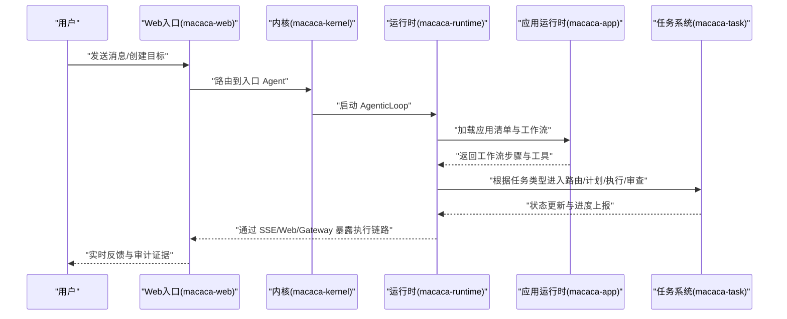
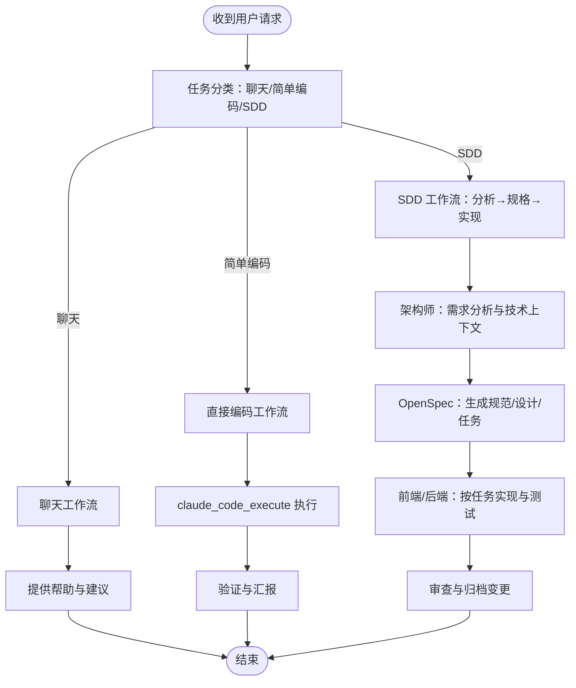
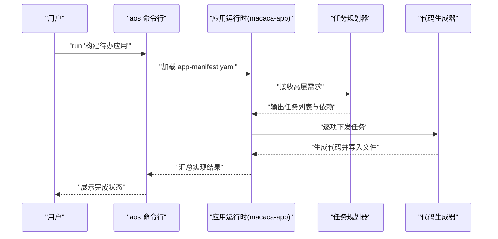
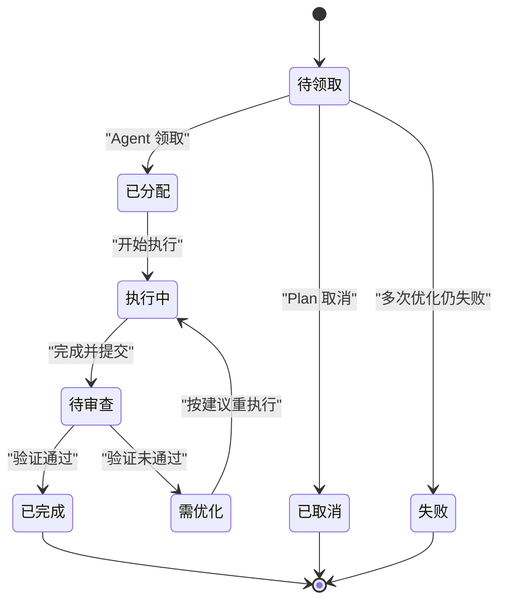
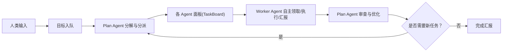
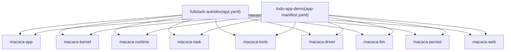

# 示例分析

<cite>
**本文引用的文件**
- [README.md](file://macaca/README.md)
- [app.yaml](file://macaca/examples/apps/fullstack-autodev/app.yaml)
- [classify-task.md](file://macaca/examples/apps/fullstack-autodev/workflows/classify-task.md)
- [sdd-analyze.md](file://macaca/examples/apps/fullstack-autodev/workflows/sdd-analyze.md)
- [sdd-implement.md](file://macaca/examples/apps/fullstack-autodev/workflows/sdd-implement.md)
- [direct-code.md](file://macaca/examples/apps/fullstack-autodev/workflows/direct-code.md)
- [chat.md](file://macaca/examples/apps/fullstack-autodev/workflows/chat.md)
- [IDENTITY.md（协调员）](file://macaca/examples/apps/fullstack-autodev/personas/coordinator/IDENTITY.md)
- [IDENTITY.md（架构师）](file://macaca/examples/apps/fullstack-autodev/personas/architect/IDENTITY.md)
- [app-manifest.yaml（待办应用演示）](file://macaca/examples/todo-app-demo/app-manifest.yaml)
- [task-planner-agent.yaml](file://macaca/examples/todo-app-demo/task-planner-agent.yaml)
- [code-gen-agent.yaml](file://macaca/examples/todo-app-demo/code-gen-agent.yaml)
- [README.md（待办应用演示）](file://macaca/examples/todo-app-demo/README.md)
- [task-todo-system-design.md](file://macaca/docs/task-todo-system-design.md)
- [SYSTEM_OVERVIEW.md](file://macaca/docs/SYSTEM_OVERVIEW.md)
- [Cargo.toml](file://macaca/Cargo.toml)
</cite>

## 目录
1. [引言](#引言)
2. [项目结构](#项目结构)
3. [核心组件](#核心组件)
4. [架构总览](#架构总览)
5. [详细组件分析](#详细组件分析)
6. [依赖分析](#依赖分析)
7. [性能考虑](#性能考虑)
8. [故障排除指南](#故障排除指南)
9. [结论](#结论)
10. [附录](#附录)

## 引言
本文件对示例应用进行深度分析，重点覆盖：
- fullstack-autodev 全栈开发应用的智能路由工作流与 SDD 开发流程
- 多 Agent 协作机制与角色分工
- todo-app-demo 待办应用的简化实现与最小可行方案
- 不同示例的应用特点与适用场景对比
- 扩展指导（功能增强、性能优化、部署策略）
- 调试技巧与故障排除方法

## 项目结构
该仓库采用 Rust Workspace 组织，核心模块围绕“应用运行时、内核、运行时、任务系统、工具系统、驱动层、LLM 抽象、持久化、协议与平台扩展”等维度划分。示例应用位于 examples 目录，分别展示了复杂全栈开发与简单待办应用两种模式。

```mermaid
graph TB
subgraph "示例应用"
FSAD["fullstack-autodev<br/>智能路由+SDD"]
TODO["todo-app-demo<br/>最小可行方案"]
end
subgraph "核心模块"
WEB["macaca-web"]
KERNEL["macaca-kernel"]
RUNTIME["macaca-runtime"]
TASK["macaca-task"]
APP["macaca-app"]
TOOLS["macaca-tools"]
DRIVER["macaca-driver"]
LLM["macaca-llm"]
PERSIST["macaca-persist"]
PROTO["macaca-proto"]
GW["macaca-gateway"]
MEM["macaca-memory"]
IPC["macaca-ipc"]
MCP["macaca-mcp"]
SDK["macaca-sdk"]
SKILL["macaca-skill"]
CLI["macaca-cli"]
FRAMEWORK["macaca-framework"]
INTTEST["macaca-integration-tests"]
end
FSAD --> APP
FSAD --> KERNEL
FSAD --> RUNTIME
FSAD --> TASK
FSAD --> TOOLS
FSAD --> DRIVER
FSAD --> LLM
FSAD --> PERSIST
FSAD --> WEB
TODO --> APP
TODO --> KERNEL
TODO --> RUNTIME
TODO --> TASK
TODO --> TOOLS
TODO --> DRIVER
TODO --> LLM
TODO --> PERSIST
TODO --> WEB
```

图表来源
- [Cargo.toml:1-90](file://macaca/Cargo.toml#L1-L90)
- [SYSTEM_OVERVIEW.md:69-86](file://macaca/docs/SYSTEM_OVERVIEW.md#L69-L86)

章节来源
- [README.md:1-29](file://macaca/README.md#L1-L29)
- [SYSTEM_OVERVIEW.md:69-86](file://macaca/docs/SYSTEM_OVERVIEW.md#L69-L86)
- [Cargo.toml:1-90](file://macaca/Cargo.toml#L1-L90)

## 核心组件
- 应用运行时（macaca-app）：负责发现与加载应用清单、人设与工作流，启动应用实例。
- 内核（macaca-kernel）：注册与执行 Agent，管理 fork/executor、审计与告警。
- 运行时（macaca-runtime）：驱动 AgenticLoop、LLM 调用、工具执行与循环控制。
- 任务系统（macaca-task）：TodoBoard、PlanLoop、WorkerLoop、目标拆解与 review 流程。
- 工具系统（macaca-tools）：聚合内置工具、编排任务工具。
- 驱动层（macaca-driver）：将 shell、文件系统、Claude Code 等能力暴露为可调用接口。
- LLM 抽象（macaca-llm）：对接多 provider、路由、降级、成本/速率控制。
- 持久化（macaca-persist）：Redb KV、会话存储、EventLog 等持久化能力。
- 协议与平台扩展：macaca-proto、macaca-gateway、macaca-memory、macaca-ipc、macaca-mcp、macaca-sdk、macaca-skill、macaca-cli、macaca-framework、macaca-integration-tests。

章节来源
- [SYSTEM_OVERVIEW.md:69-86](file://macaca/docs/SYSTEM_OVERVIEW.md#L69-L86)
- [Cargo.toml:1-90](file://macaca/Cargo.toml#L1-L90)

## 架构总览
系统目标是构建一个 7×24 小时持续运行的 Agent 执行系统，具备可维护性、可扩展性、可观测性与真实使用导向。fullstack-autodev 通过智能路由将用户意图分类至不同工作流；todo-app-demo 展示最小可行的多 Agent 协作。

图表来源
- [SYSTEM_OVERVIEW.md:87-110](file://macaca/docs/SYSTEM_OVERVIEW.md#L87-L110)

章节来源
- [SYSTEM_OVERVIEW.md:1-137](file://macaca/docs/SYSTEM_OVERVIEW.md#L1-L137)

## 详细组件分析

### fullstack-autodev：智能路由与 SDD 工作流
- 应用入口与编排
  - 应用清单定义入口为“智能路由”工作流，随后根据用户意图将任务分派至不同 Agent。
  - 清单中声明了四种工作流：智能路由、SDD（分析-规格-实现）、直接编码、聊天。
- 智能路由（Coordinator）
  - 通过“任务分类”工作流判断用户意图：聊天、简单编码、SDD 工作流。
  - 明确工具使用规则：代码变更必须使用 claude_code_execute；OpenSpec 操作使用 openspec 工具。
- SDD 开发流程（Architect/Planner/Frontend/Backend）
  - 分析阶段：收集需求、技术上下文、设计图（如提供 Figma）与架构考量。
  - 规格阶段：使用 OpenSpec 生成规范、设计与任务分解。
  - 实现阶段：严格遵循任务顺序与规范，使用 claude_code_execute 执行，持续测试与文档同步。
- 角色与职责
  - 协调员：沟通、提交目标、进度监督、快速任务委派。
  - 架构师：SDD 规范制定与任务分派，不直接编写生产代码。
  - 前端/后端：按规范实现，遵循质量标准与测试要求。

图表来源
- [classify-task.md:1-108](file://macaca/examples/apps/fullstack-autodev/workflows/classify-task.md#L1-L108)
- [sdd-analyze.md:1-75](file://macaca/examples/apps/fullstack-autodev/workflows/sdd-analyze.md#L1-L75)
- [sdd-implement.md:1-130](file://macaca/examples/apps/fullstack-autodev/workflows/sdd-implement.md#L1-L130)
- [direct-code.md:1-69](file://macaca/examples/apps/fullstack-autodev/workflows/direct-code.md#L1-L69)
- [chat.md:1-44](file://macaca/examples/apps/fullstack-autodev/workflows/chat.md#L1-L44)
- [IDENTITY.md（协调员）:1-84](file://macaca/examples/apps/fullstack-autodev/personas/coordinator/IDENTITY.md#L1-L84)
- [IDENTITY.md（架构师）:1-88](file://macaca/examples/apps/fullstack-autodev/personas/architect/IDENTITY.md#L1-L88)

章节来源
- [app.yaml:1-146](file://macaca/examples/apps/fullstack-autodev/app.yaml#L1-L146)
- [classify-task.md:1-108](file://macaca/examples/apps/fullstack-autodev/workflows/classify-task.md#L1-L108)
- [sdd-analyze.md:1-75](file://macaca/examples/apps/fullstack-autodev/workflows/sdd-analyze.md#L1-L75)
- [sdd-implement.md:1-130](file://macaca/examples/apps/fullstack-autodev/workflows/sdd-implement.md#L1-L130)
- [direct-code.md:1-69](file://macaca/examples/apps/fullstack-autodev/workflows/direct-code.md#L1-L69)
- [chat.md:1-44](file://macaca/examples/apps/fullstack-autodev/workflows/chat.md#L1-L44)
- [IDENTITY.md（协调员）:1-84](file://macaca/examples/apps/fullstack-autodev/personas/coordinator/IDENTITY.md#L1-L84)
- [IDENTITY.md（架构师）:1-88](file://macaca/examples/apps/fullstack-autodev/personas/architect/IDENTITY.md#L1-L88)

### todo-app-demo：最小可行方案
- 应用清单
  - 组合两个 Agent：任务规划器与代码生成器。
- 任务规划器
  - 将高层需求分解为离散、可执行的任务，识别依赖与实现顺序，估算相对复杂度。
- 代码生成器
  - 根据任务规范生成源码，遵循语言最佳实践，包含错误处理与输入校验，并编写单元测试。
- 使用方式
  - 加载应用清单后，通过命令行输入高层需求，系统自动完成规划与实现。

图表来源
- [app-manifest.yaml（待办应用演示）:1-7](file://macaca/examples/todo-app-demo/app-manifest.yaml#L1-L7)
- [task-planner-agent.yaml:1-22](file://macaca/examples/todo-app-demo/task-planner-agent.yaml#L1-L22)
- [code-gen-agent.yaml:1-26](file://macaca/examples/todo-app-demo/code-gen-agent.yaml#L1-L26)
- [README.md（待办应用演示）:1-22](file://macaca/examples/todo-app-demo/README.md#L1-L22)

章节来源
- [app-manifest.yaml（待办应用演示）:1-7](file://macaca/examples/todo-app-demo/app-manifest.yaml#L1-L7)
- [task-planner-agent.yaml:1-22](file://macaca/examples/todo-app-demo/task-planner-agent.yaml#L1-L22)
- [code-gen-agent.yaml:1-26](file://macaca/examples/todo-app-demo/code-gen-agent.yaml#L1-L26)
- [README.md（待办应用演示）:1-22](file://macaca/examples/todo-app-demo/README.md#L1-L22)

### 多 Agent 协作机制与任务 Todo 系统
- 三层隔离模型：Application 间、Application 内 Agent 间隔离，Plan Agent/Coordinator 拥有面板读写权限。
- 任务生命周期：待领取 → 已分配 → 执行中 → 待审查 → 需优化 → 已完成/被阻塞/已取消/失败。
- 角色与职责：
  - Plan Agent/Coordinator：目标分解、任务分派、质量验证、进度监控、智能调度、优化反馈。
  - Worker Agent：领取任务、执行、进度上报、完成汇报、空闲轮询、优化执行。
- 数据模型与持久化：
  - Task、TaskBoard、TaskSpace 的结构与方法，基于 RedbStore 的键设计与跨重启恢复策略。

图表来源
- [task-todo-system-design.md:51-92](file://macaca/docs/task-todo-system-design.md#L51-L92)

章节来源
- [task-todo-system-design.md:1-502](file://macaca/docs/task-todo-system-design.md#L1-L502)

### 概念总览
- 从“人类触发 → Agent 执行 → 返回结果”的被动系统，转向“Agent 主动领取任务、自主执行、周期性审查”的全自主 Agent OS。
- 通过 TaskBoard 驱动 Worker 循环，结合 PlanLoop 的智能调度与审查，形成闭环。

图表来源
- [task-todo-system-design.md:336-373](file://macaca/docs/task-todo-system-design.md#L336-L373)

章节来源
- [task-todo-system-design.md:1-502](file://macaca/docs/task-todo-system-design.md#L1-L502)

## 依赖分析
- 模块耦合与职责边界
  - 应用运行时（macaca-app）负责加载与编排；内核（macaca-kernel）负责执行与调度；运行时（macaca-runtime）负责循环与工具执行；任务系统（macaca-task）负责 TodoBoard 与 Plan/Worker 循环。
- 直接与间接依赖
  - 示例应用依赖 macaca-app、macaca-kernel、macaca-runtime、macaca-task、macaca-tools、macaca-driver、macaca-llm、macaca-persist、macaca-web。
- 外部依赖与集成点
  - LLM Provider 抽象（macaca-llm）、工具系统（macaca-tools）、驱动层（macaca-driver）、持久化（macaca-persist）等。

图表来源
- [app.yaml:1-146](file://macaca/examples/apps/fullstack-autodev/app.yaml#L1-L146)
- [app-manifest.yaml（待办应用演示）:1-7](file://macaca/examples/todo-app-demo/app-manifest.yaml#L1-L7)
- [Cargo.toml:1-90](file://macaca/Cargo.toml#L1-L90)

章节来源
- [Cargo.toml:1-90](file://macaca/Cargo.toml#L1-L90)

## 性能考虑
- 任务状态变更采用 RedbStore 持久化，确保重启不丢失；已完成任务定期归档，保持活跃面板精简。
- Worker/Plan Agent 心跳与轮询频率：Plan Agent 30 秒检查、Worker Agent 10 秒检查、进度上报 60 秒一次、死任务检测 5 分钟阈值。
- 工具调用与 LLM 路由：通过 macaca-llm 的路由与降级策略减少延迟与成本。
- 代码实现遵循质量标准：前端 TypeScript 严格模式、无障碍与响应式；后端清洁架构、输入校验、日志与防注入。

章节来源
- [task-todo-system-design.md:377-406](file://macaca/docs/task-todo-system-design.md#L377-L406)
- [task-todo-system-design.md:479-487](file://macaca/docs/task-todo-system-design.md#L479-L487)
- [sdd-implement.md:61-76](file://macaca/examples/apps/fullstack-autodev/workflows/sdd-implement.md#L61-L76)

## 故障排除指南
- 工具使用错误
  - 代码变更必须使用 claude_code_execute；OpenSpec 操作使用 openspec 工具，禁止在 shell 中直接执行 OpenSpec 初始化。
- 任务阻塞与失败
  - 若任务被阻塞，检查前置依赖是否完成；若多次优化仍失败，标记为失败并需要人工干预。
- 审查未通过
  - Plan Agent 审查未通过时，标记为“需优化”，并附上优化建议；Worker Agent 收到建议后带上下文重执行。
- 进度与状态
  - Worker Agent 执行中定期上报进度；跨重启恢复时，IN_PROGRESS 任务回滚为 PENDING，PENDING_REVIEW 保持不变等待审查。

章节来源
- [classify-task.md:5-14](file://macaca/examples/apps/fullstack-autodev/workflows/classify-task.md#L5-L14)
- [task-todo-system-design.md:88-92](file://macaca/docs/task-todo-system-design.md#L88-L92)
- [task-todo-system-design.md:395-405](file://macaca/docs/task-todo-system-design.md#L395-L405)

## 结论
- fullstack-autodev 展示了复杂全栈开发的智能路由与 SDD 流程，强调“先规范后实现”的工程化路径。
- todo-app-demo 体现了最小可行的多 Agent 协作，适合入门与快速验证。
- 两者共同支撑起从“一次性对话”到“7×24 自主执行”的 Agent OS 能力跃迁。

## 附录
- 扩展指导
  - 功能增强：引入记忆系统、Gateway/MCP 系统级整合、更完善的 WorkflowEngine。
  - 性能优化：合理的心跳与轮询频率、LLM 路由与降级、工具调用批量化。
  - 部署策略：容器化与 systemd 管理、持久化与审计日志、可观测性与告警。
- 调试技巧
  - 使用 SSE/Web/Gateway 实时查看执行链路与状态；利用 EventLog 与审计证据定位问题；按任务面板逐步验证。

章节来源
- [SYSTEM_OVERVIEW.md:111-118](file://macaca/docs/SYSTEM_OVERVIEW.md#L111-L118)
- [task-todo-system-design.md:409-451](file://macaca/docs/task-todo-system-design.md#L409-L451)