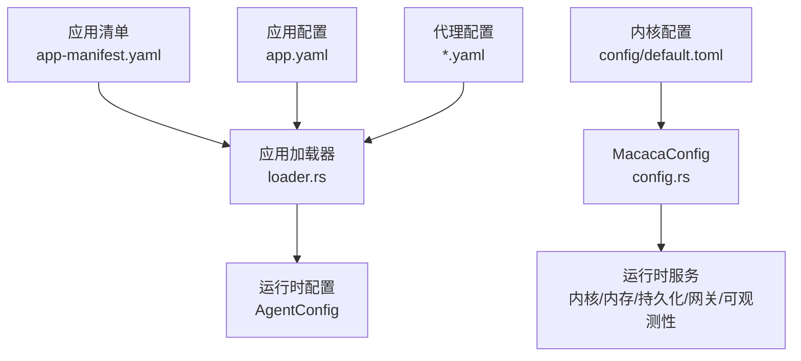
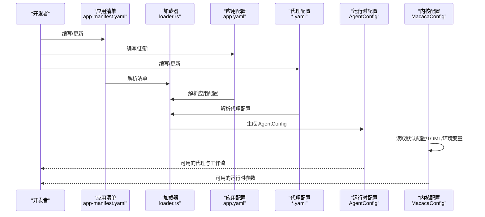
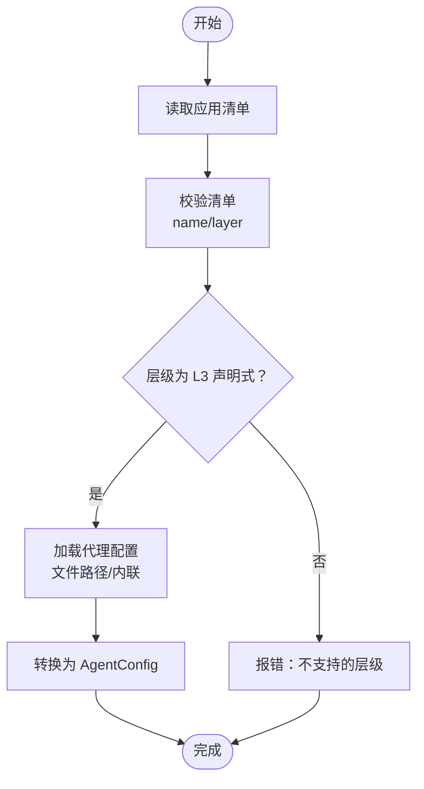
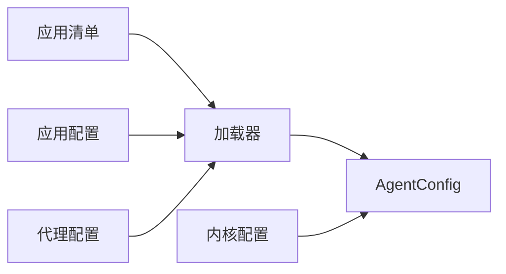

# 配置管理

<cite>
**本文引用的文件**
- [app.yaml](file://macaca/examples/apps/fullstack-autodev/app.yaml)
- [app-manifest.yaml](file://macaca/examples/custom-agent-yaml/app-manifest.yaml)
- [app-manifest.yaml](file://macaca/examples/todo-app-demo/app-manifest.yaml)
- [code-review-agent.yaml](file://macaca/examples/custom-agent-yaml/code-review-agent.yaml)
- [code-gen-agent.yaml](file://macaca/examples/todo-app-demo/code-gen-agent.yaml)
- [task-planner-agent.yaml](file://macaca/examples/todo-app-demo/task-planner-agent.yaml)
- [config.rs](file://macaca/crates/macaca-proto/src/config.rs)
- [loader.rs](file://macaca/crates/macaca-app/src/loader.rs)
- [lib.rs](file://macaca/crates/macaca-app/src/lib.rs)
</cite>

## 目录
1. [简介](#简介)
2. [项目结构](#项目结构)
3. [核心组件](#核心组件)
4. [架构总览](#架构总览)
5. [详细组件分析](#详细组件分析)
6. [依赖分析](#依赖分析)
7. [性能考虑](#性能考虑)
8. [故障排查指南](#故障排查指南)
9. [结论](#结论)
10. [附录](#附录)

## 简介
本指南围绕应用配置管理展开，系统性解析应用声明式配置（app.yaml）与代理（Agent）配置的结构、字段语义与最佳实践，并结合内核配置模型与加载器实现，给出配置验证、调试、迁移与升级的实操建议。目标是帮助读者在不深入源码的情况下，也能正确编写、校验与维护配置。

## 项目结构
- 应用层（L3 声明式）通过 app.yaml 定义应用元数据、LLM 提供商与模型、入口点、工作流、资源路径与多个 Agent 的能力、工具与权限等。
- 应用清单（app-manifest.yaml）用于声明应用名称、版本、层级与所包含的 Agent 文件或内联定义。
- 内核配置（TOML）由 macaca-proto 提供默认值与环境变量覆盖机制，支撑运行时的 LLM、内存、持久化、网关与可观测性等子系统。
- 加载器（loader.rs）负责解析 app-manifest.yaml 并将 Agent 配置转换为运行时可用的 AgentConfig。

图表来源
- [loader.rs:14-82](file://macaca/crates/macaca-app/src/loader.rs#L14-L82)
- [config.rs:329-352](file://macaca/crates/macaca-proto/src/config.rs#L329-L352)

章节来源
- [loader.rs:14-82](file://macaca/crates/macaca-app/src/loader.rs#L14-L82)
- [lib.rs:6-21](file://macaca/crates/macaca-app/src/lib.rs#L6-L21)

## 核心组件
- 应用清单（App Manifest）
  - 字段：name、version、layer、agents（文件路径或内联）、ui_type（可选）
  - 作用：声明应用元信息与包含的代理集合
- 应用配置（App YAML）
  - 字段：name、version、description、layer、ui_type、llm_config、entrypoint、workflows、resources、agents
  - 作用：定义 LLM 提供商与模型、入口点类型与名称、工作流步骤、资源目录映射、各代理的能力、提示词模板、模型、权限级别与允许工具等
- 代理配置（Agent YAML）
  - 字段：name、capabilities、permission_level、allowed_tools、allowed_paths、network_access、prompt_template、model、max_tokens、temperature、persona_dir（可选）
  - 作用：描述单个代理的角色、能力、安全边界与推理参数
- 内核配置（MacacaConfig）
  - 字段：kernel、llm、memory、ipc、persist、gateway、observability、workspace
  - 作用：提供运行时默认配置与环境变量覆盖机制，支撑 LLM 路由、速率限制、内存向量化、事件持久化、网关接入与日志追踪

章节来源
- [app-manifest.yaml:1-6](file://macaca/examples/custom-agent-yaml/app-manifest.yaml#L1-L6)
- [app-manifest.yaml:1-7](file://macaca/examples/todo-app-demo/app-manifest.yaml#L1-L7)
- [app.yaml:1-146](file://macaca/examples/apps/fullstack-autodev/app.yaml#L1-L146)
- [code-review-agent.yaml:1-26](file://macaca/examples/custom-agent-yaml/code-review-agent.yaml#L1-L26)
- [code-gen-agent.yaml:1-26](file://macaca/examples/todo-app-demo/code-gen-agent.yaml#L1-L26)
- [task-planner-agent.yaml:1-22](file://macaca/examples/todo-app-demo/task-planner-agent.yaml#L1-L22)
- [config.rs:7-327](file://macaca/crates/macaca-proto/src/config.rs#L7-L327)

## 架构总览
下图展示从配置到运行时的关键流程：应用清单与应用配置被加载器解析，生成运行时 AgentConfig；同时内核配置提供全局运行参数，二者共同驱动应用执行。

图表来源
- [loader.rs:14-82](file://macaca/crates/macaca-app/src/loader.rs#L14-L82)
- [config.rs:329-352](file://macaca/crates/macaca-proto/src/config.rs#L329-L352)

## 详细组件分析

### 应用清单（App Manifest）
- 结构要点
  - name、version、layer 必填且需符合约束
  - agents 支持文件路径或内联两种来源
  - ui_type 用于前端 UI 类型声明（如 chat）
- 校验规则
  - 名称不能为空
  - 不支持 L2 WASM 层级
- 典型用法
  - 将多个代理文件集中声明，便于统一管理与部署
  - 与 app.yaml 协同，分别承担“应用编排”和“代理细节”的职责

章节来源
- [loader.rs:32-46](file://macaca/crates/macaca-app/src/loader.rs#L32-L46)
- [app-manifest.yaml:1-6](file://macaca/examples/custom-agent-yaml/app-manifest.yaml#L1-L6)
- [app-manifest.yaml:1-7](file://macaca/examples/todo-app-demo/app-manifest.yaml#L1-L7)

### 应用配置（App YAML）
- 结构要点
  - 基本信息：name、version、description、layer、ui_type
  - LLM 配置：provider、model
  - 入口点：type（workflow）、name（工作流名）
  - 工作流：steps 列表，每个 step 指定 agent、prompt_template，并可声明依赖（depends_on）
  - 资源路径：personas、skills、prompts、workflows
  - 代理定义：每个代理包含 capabilities、prompt_template、model、permission_level、allowed_tools、persona_dir 等
- 关键字段说明
  - layer：L3Declarative 表示声明式应用
  - entrypoint.type：workflow 表示以工作流作为统一入口
  - workflows.steps.depends_on：控制步骤顺序与依赖关系
  - resources.*：映射本地资源目录，便于代理读取提示词、技能与人物设定
  - agents[].permission_level：system/user 控制代理操作范围
  - agents[].allowed_tools：限定代理可调用的工具集
- 示例参考
  - 全栈自动开发应用的多工作流编排与多代理协作

章节来源
- [app.yaml:1-146](file://macaca/examples/apps/fullstack-autodev/app.yaml#L1-L146)

### 代理配置（Agent YAML）
- 结构要点
  - name、capabilities、permission_level、allowed_tools、allowed_paths、network_access、prompt_template、model、max_tokens、temperature、persona_dir（可选）
- 权限与安全
  - permission_level：限制代理可执行的操作范围
  - allowed_tools：白名单工具集
  - allowed_paths：文件系统访问路径白名单
  - network_access：是否允许网络访问
- 推理参数
  - model、max_tokens、temperature 影响输出质量与成本
- 示例参考
  - 代码评审代理、任务规划代理、代码生成代理的最小可用配置

章节来源
- [code-review-agent.yaml:1-26](file://macaca/examples/custom-agent-yaml/code-review-agent.yaml#L1-L26)
- [task-planner-agent.yaml:1-22](file://macaca/examples/todo-app-demo/task-planner-agent.yaml#L1-L22)
- [code-gen-agent.yaml:1-26](file://macaca/examples/todo-app-demo/code-gen-agent.yaml#L1-L26)

### 内核配置（MacacaConfig）
- 结构要点
  - kernel：最大代理数、心跳间隔、代理超时
  - llm：默认提供商、默认模型、请求最大 token 数、每分钟速率限制、提供商密钥与基础地址
  - memory：会话 TTL、文件存储路径、向量化与嵌入配置、压缩策略
  - ipc：消息总线 NATS 连接与重连策略
  - persist：持久化引擎与数据目录、快照间隔
  - gateway：Telegram/Discord 机器人开关与令牌环境变量、命令前缀
  - observability：日志级别、链路追踪开关、OTLP 端点、文件日志配置
  - workspace：工作区根目录
- 加载与覆盖
  - 默认从 config/default.toml 加载，支持环境变量覆盖（AOS_前缀 + 双下划线分隔）
- 默认值与兼容性
  - 提供大量合理默认值，便于快速启动与迁移

章节来源
- [config.rs:329-352](file://macaca/crates/macaca-proto/src/config.rs#L329-L352)
- [config.rs:257-327](file://macaca/crates/macaca-proto/src/config.rs#L257-L327)

### 加载器与运行时装配
- 加载器职责
  - 解析 app-manifest.yaml，校验 name 与 layer 约束
  - 解析 app.yaml 与各代理 YAML，生成 AgentConfig
  - 支持 L1 原生（空列表）、L3 声明式（文件路径或内联）两种模式
- 关键流程
  - 读取清单与 YAML
  - 校验与规范化
  - 转换为运行时配置

图表来源
- [loader.rs:14-82](file://macaca/crates/macaca-app/src/loader.rs#L14-L82)

章节来源
- [loader.rs:14-82](file://macaca/crates/macaca-app/src/loader.rs#L14-L82)

## 依赖分析
- 组件耦合
  - 应用清单与应用配置共同决定代理集合与入口点
  - 代理配置影响工具与权限边界，进而影响工作流执行
  - 内核配置为运行时提供全局参数，与应用配置相互独立但共同生效
- 外部依赖
  - LLM 提供商与模型配置受内核 llm 子系统影响
  - IPC 与网关配置影响分布式与外部通信
- 潜在循环
  - 配置层之间无直接循环依赖，遵循“清单→应用→代理→运行时”的单向装配

图表来源
- [loader.rs:54-81](file://macaca/crates/macaca-app/src/loader.rs#L54-L81)
- [config.rs:329-352](file://macaca/crates/macaca-proto/src/config.rs#L329-L352)

章节来源
- [loader.rs:54-81](file://macaca/crates/macaca-app/src/loader.rs#L54-L81)
- [config.rs:329-352](file://macaca/crates/macaca-proto/src/config.rs#L329-L352)

## 性能考虑
- LLM 请求与速率限制
  - 合理设置 llm.rate_limit_rpm 与 max_tokens_per_request，避免触发限流或超长请求
- 记忆与向量化
  - memory.session_ttl_seconds 与 vector.collection_name 影响检索效率与存储占用
- 持久化与快照
  - persist.snapshot_interval_seconds 影响恢复速度与磁盘 IO
- 日志与追踪
  - observability.log_level 与 tracing_enabled 影响可观测性开销

## 故障排查指南
- 配置语法检查
  - 使用 YAML 语法校验工具检查 app.yaml、app-manifest.yaml、代理 YAML 是否存在缩进、键重复等问题
- 参数有效性验证
  - 清单校验：确保 name 非空，layer 为 L3Declarative
  - LLM 密钥解析：若使用环境变量名，请确认对应环境变量已导出
  - 工具与路径白名单：确保 allowed_tools 与 allowed_paths 与实际需求一致
- 常见错误与解决
  - “WASM 应用暂不支持”：将 layer 改为 L3Declarative
  - “name 必须非空”：为应用或代理补全 name
  - “未设置环境变量”：为 LLM 或网关令牌提供正确的环境变量
- 调试方法
  - 启用文件日志与链路追踪，定位加载与执行阶段问题
  - 逐步注释掉复杂工作流步骤，缩小问题范围
  - 对比默认内核配置，确认自定义项是否与默认行为冲突

章节来源
- [loader.rs:32-46](file://macaca/crates/macaca-app/src/loader.rs#L32-L46)
- [config.rs:64-96](file://macaca/crates/macaca-proto/src/config.rs#L64-L96)

## 结论
通过将应用清单、应用配置与代理配置三者清晰分离，并配合内核配置的默认值与环境变量覆盖机制，可以实现高可维护性的声明式应用编排。建议在团队内建立统一的命名规范、目录组织与版本管理策略，以保障配置的可追溯与可迁移性。

## 附录

### 配置模板与最佳实践
- 命名规范
  - 应用与代理 name 使用小写加中划线或下划线，避免特殊字符
  - 文件名与目录名保持一致，便于资源路径映射
- 组织结构
  - 将 personas、skills、prompts、workflows 分类存放，与 app.yaml 中 resources.* 对应
  - 每个代理单独一个 YAML，必要时在 app-manifest.yaml 中集中声明
- 版本管理策略
  - 使用语义化版本（semver），变更重大时提升主版本
  - 在 app-manifest.yaml 中记录当前版本，便于回滚与审计
- 迁移与升级
  - 新增代理时先在 app-manifest.yaml 声明，再在 app.yaml 中完善入口点与工作流
  - 更新 LLM 提供商时优先调整内核配置中的 llm.providers，再在代理层做最小改动
  - 通过环境变量覆盖内核配置，避免频繁修改 TOML 文件

### 字段对照与参考路径
- 应用清单字段
  - name、version、layer、agents、ui_type
  - 参考：[app-manifest.yaml:1-6](file://macaca/examples/custom-agent-yaml/app-manifest.yaml#L1-L6)
- 应用配置字段
  - name、version、description、layer、ui_type、llm_config、entrypoint、workflows、resources、agents
  - 参考：[app.yaml:1-146](file://macaca/examples/apps/fullstack-autodev/app.yaml#L1-L146)
- 代理配置字段
  - name、capabilities、permission_level、allowed_tools、allowed_paths、network_access、prompt_template、model、max_tokens、temperature、persona_dir
  - 参考：[code-review-agent.yaml:1-26](file://macaca/examples/custom-agent-yaml/code-review-agent.yaml#L1-L26)、[task-planner-agent.yaml:1-22](file://macaca/examples/todo-app-demo/task-planner-agent.yaml#L1-L22)、[code-gen-agent.yaml:1-26](file://macaca/examples/todo-app-demo/code-gen-agent.yaml#L1-L26)
- 内核配置字段
  - kernel、llm、memory、ipc、persist、gateway、observability、workspace
  - 参考：[config.rs:329-352](file://macaca/crates/macaca-proto/src/config.rs#L329-L352)