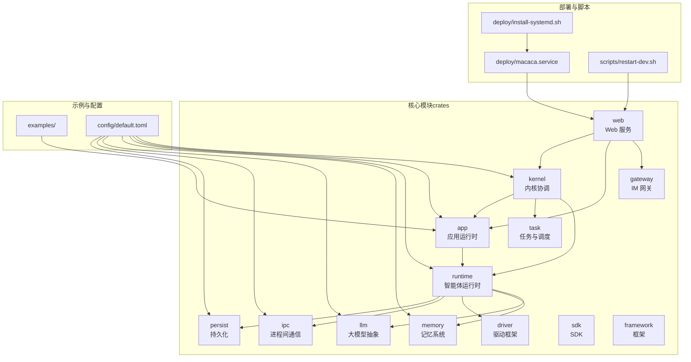
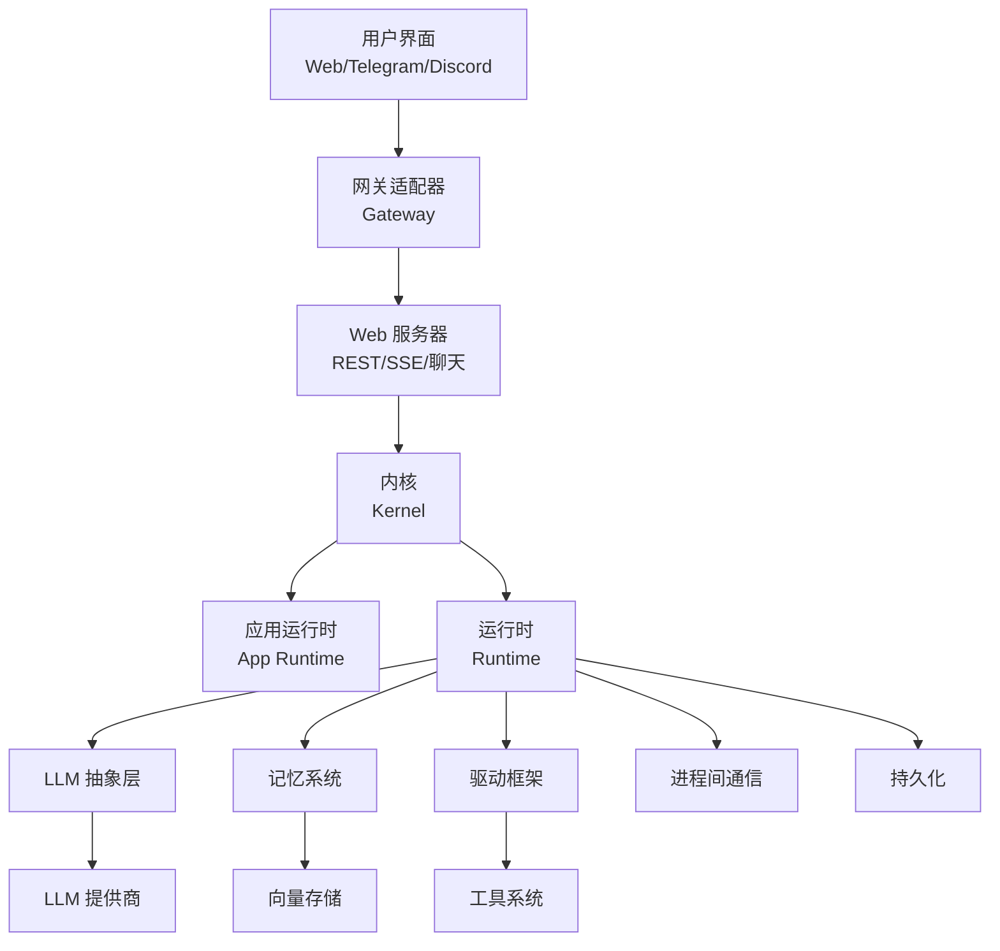
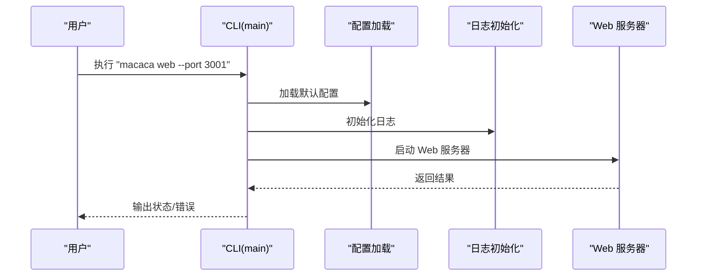
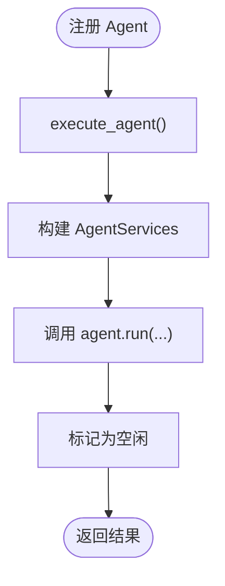

# 快速开始

<cite>
**本文引用的文件**
- [macaca/README.md](file://macaca/README.md)
- [Cargo.toml](file://macaca/Cargo.toml)
- [config/default.toml](file://macaca/config/default.toml)
- [crates/macaca-cli/src/main.rs](file://macaca/crates/macaca-cli/src/main.rs)
- [crates/macaca-kernel/src/kernel.rs](file://macaca/crates/macaca-kernel/src/kernel.rs)
- [crates/macaca-proto/src/config.rs](file://macaca/crates/macaca-proto/src/config.rs)
- [deploy/install-systemd.sh](file://macaca/deploy/install-systemd.sh)
- [deploy/macaca.service](file://macaca/deploy/macaca.service)
- [examples/todo-app-demo/README.md](file://macaca/examples/todo-app-demo/README.md)
- [examples/todo-app-demo/app-manifest.yaml](file://macaca/examples/todo-app-demo/app-manifest.yaml)
- [examples/todo-app-demo/task-planner-agent.yaml](file://macaca/examples/todo-app-demo/task-planner-agent.yaml)
- [examples/todo-app-demo/code-gen-agent.yaml](file://macaca/examples/todo-app-demo/code-gen-agent.yaml)
- [scripts/restart-dev.sh](file://macaca/scripts/restart-dev.sh)
</cite>

## 目录
1. [简介](#简介)
2. [项目结构](#项目结构)
3. [核心组件](#核心组件)
4. [架构总览](#架构总览)
5. [详细组件分析](#详细组件分析)
6. [依赖分析](#依赖分析)
7. [性能考虑](#性能考虑)
8. [故障排除指南](#故障排除指南)
9. [结论](#结论)
10. [附录](#附录)

## 简介
本指南面向首次接触 Macaca Agent OS 的用户，提供从系统要求、依赖安装、环境配置到基本使用的完整路径。Macaca 是一个面向真实多 Agent 应用的“Agent 操作系统”，负责发现与运行 Application、调度 Agent、聚合 Driver/Tool 能力，并通过 Web/Gateway/持久化层将任务执行链路、状态与审计证据暴露出来。其目标是构建一个 7×24 小时自动规划、自动执行、自我唤醒、尽量少依赖人工干预的主动执行系统。

- 适合初学者：提供命令行示例与配置文件示例，逐步引导安装与启动。
- 适合有经验的开发者：提供配置项详解、默认值说明、常见问题排查与系统架构概览。

## 项目结构
仓库采用 Rust Workspace 组织，核心模块分布在 crates/ 下，包含 kernel、runtime、task、tools、app、driver、gateway、web、memory、llm、ipc、persist、proto、sdk、skill、framework、integration-tests 等。examples/ 提供示例应用与 persona/workflow 配置；config/ 提供默认运行配置；deploy/ 提供 systemd 安装脚本与服务文件；scripts/ 提供开发与运维脚本。

图表来源
- [Cargo.toml:1-25](file://macaca/Cargo.toml#L1-L25)
- [config/default.toml:1-119](file://macaca/config/default.toml#L1-L119)
- [deploy/macaca.service:1-38](file://macaca/deploy/macaca.service#L1-L38)
- [deploy/install-systemd.sh:1-60](file://macaca/deploy/install-systemd.sh#L1-L60)
- [scripts/restart-dev.sh:1-80](file://macaca/scripts/restart-dev.sh#L1-L80)

章节来源
- [macaca/README.md:20-29](file://macaca/README.md#L20-L29)
- [Cargo.toml:1-25](file://macaca/Cargo.toml#L1-L25)

## 核心组件
- CLI 工具：提供 run、agents、status、version、web 等子命令，加载默认配置并初始化日志。
- 内核（Kernel）：统一注册、调度与执行 Agent，维护状态跟踪与活动记录。
- 配置系统：以 TOML 为主，支持 LLM 提供商、内存、IPC、持久化、网关、可观测性等模块化配置。
- 默认配置：提供开箱即用的默认值，便于快速启动与演示。

章节来源
- [crates/macaca-cli/src/main.rs:14-31](file://macaca/crates/macaca-cli/src/main.rs#L14-L31)
- [crates/macaca-kernel/src/kernel.rs:15-22](file://macaca/crates/macaca-kernel/src/kernel.rs#L15-L22)
- [crates/macaca-proto/src/config.rs:7-18](file://macaca/crates/macaca-proto/src/config.rs#L7-L18)
- [config/default.toml:1-119](file://macaca/config/default.toml#L1-L119)

## 架构总览
下图展示了用户交互层（Web/IM）、平台服务层（Web 服务器、网关）、核心内核层（Kernel/App/Runtime）、能力扩展层（Driver/Tools/Memory/LLM/IPC/Persist）之间的关系与数据流。

图表来源
- [ARCHITECTURE-v2.md:16-200](file://macaca/ARCHITECTURE-v2.md#L16-L200)

章节来源
- [ARCHITECTURE-v2.md:16-200](file://macaca/ARCHITECTURE-v2.md#L16-L200)

## 详细组件分析

### CLI 与启动流程
- CLI 子命令
  - run：启动内核与网关适配器
  - agents：列出已注册 Agent
  - status：查看系统状态
  - version：打印版本信息
  - web：启动 Web UI 服务器，默认端口 3001
- 启动序列
  - 加载默认配置
  - 初始化日志（文件输出与级别）
  - 根据子命令执行对应功能
  - web 子命令在启用 systemd 功能时，发送就绪与看门狗心跳通知

图表来源
- [crates/macaca-cli/src/main.rs:33-79](file://macaca/crates/macaca-cli/src/main.rs#L33-L79)

章节来源
- [crates/macaca-cli/src/main.rs:14-31](file://macaca/crates/macaca-cli/src/main.rs#L14-L31)
- [crates/macaca-cli/src/main.rs:33-79](file://macaca/crates/macaca-cli/src/main.rs#L33-L79)

### 内核与 Agent 执行
- Kernel 负责注册 Agent、维护状态、调度执行、查询状态。
- 执行流程：构建 AgentServices（注入占位），调用 agent.run(...)，更新状态为“思考/空闲”。

图表来源
- [crates/macaca-kernel/src/kernel.rs:62-84](file://macaca/crates/macaca-kernel/src/kernel.rs#L62-L84)

章节来源
- [crates/macaca-kernel/src/kernel.rs:40-136](file://macaca/crates/macaca-kernel/src/kernel.rs#L40-L136)

### 配置系统与默认值
- 配置结构：kernel、llm、memory、ipc、persist、gateway、observability、workspace。
- 默认配置覆盖范围：内核并发、心跳、超时；LLM 提供商与速率限制；内存会话 TTL、向量存储、嵌入模型；IPC NATS 连接；持久化引擎与快照间隔；网关开关与 Telegram/Discord 配置；可观测性日志级别与文件落盘。

章节来源
- [crates/macaca-proto/src/config.rs:7-18](file://macaca/crates/macaca-proto/src/config.rs#L7-L18)
- [config/default.toml:1-119](file://macaca/config/default.toml#L1-L119)

### 示例应用：Todo App Demo
- 包含两个 Agent：task-planner-agent.yaml（任务规划）、code-gen-agent.yaml（代码生成）。
- 应用清单 app-manifest.yaml 组合两个 Agent。
- 使用方式：加载应用清单，提交需求，由 Planner 分解任务，Code Gen 实现每个任务。

章节来源
- [examples/todo-app-demo/README.md:14-22](file://macaca/examples/todo-app-demo/README.md#L14-L22)
- [examples/todo-app-demo/app-manifest.yaml:1-7](file://macaca/examples/todo-app-demo/app-manifest.yaml#L1-L7)
- [examples/todo-app-demo/task-planner-agent.yaml:1-22](file://macaca/examples/todo-app-demo/task-planner-agent.yaml#L1-L22)
- [examples/todo-app-demo/code-gen-agent.yaml:1-26](file://macaca/examples/todo-app-demo/code-gen-agent.yaml#L1-L26)

## 依赖分析
- 系统要求与依赖
  - Rust 版本：1.75+
  - 异步运行时：Tokio（full）
  - 序列化：Serde、bincode
  - 错误处理：thiserror、anyhow
  - 日志与追踪：tracing、tracing-subscriber、tracing-opentelemetry、tracing-appender
  - 配置：config、toml
  - CLI：clap
  - UUID、时间：uuid、chrono
- 工作区成员：包含 20+ crates，覆盖内核、运行时、工具、应用、驱动、网关、Web、内存、LLM、IPC、持久化、SDK、技能、框架、集成测试等。

章节来源
- [Cargo.toml:27-69](file://macaca/Cargo.toml#L27-L69)
- [Cargo.toml:1-25](file://macaca/Cargo.toml#L1-L25)

## 性能考虑
- 内核并发与超时：通过 kernel.max_agents、agent_timeout_ms 控制并发与超时，避免资源耗尽。
- LLM 速率限制：llm.rate_limit_rpm 与 provider 层的键解析策略，保障稳定调用。
- 内存压缩：memory.compression.enabled 与阈值策略，减少上下文膨胀。
- 观测性：开启日志文件输出与 JSON 格式，便于性能分析与问题定位。

章节来源
- [config/default.toml:1-119](file://macaca/config/default.toml#L1-L119)

## 故障排除指南
- 端口冲突
  - 现象：启动失败或端口被占用
  - 处理：使用开发脚本一键清理端口占用并重启前后端
  - 参考：[scripts/restart-dev.sh:21-80](file://macaca/scripts/restart-dev.sh#L21-L80)
- systemd 服务未启动
  - 现象：systemctl start macaca 失败
  - 处理：执行安装脚本，确认服务文件与环境变量已正确复制与替换
  - 参考：[deploy/install-systemd.sh:34-60](file://macaca/deploy/install-systemd.sh#L34-L60)，[deploy/macaca.service:1-38](file://macaca/deploy/macaca.service#L1-L38)
- LLM 密钥未配置
  - 现象：LLM 调用报错或空密钥
  - 处理：在配置中填写 api_key 或使用全大写环境变量名；注意 api_key_plan 优先于 api_key
  - 参考：[crates/macaca-proto/src/config.rs:64-96](file://macaca/crates/macaca-proto/src/config.rs#L64-L96)，[config/default.toml:11-52](file://macaca/config/default.toml#L11-L52)
- NATS 连接失败
  - 现象：IPC 通信异常
  - 处理：检查 ipc.nats_url 与网络连通性；必要时启用自动启动
  - 参考：[config/default.toml:79-84](file://macaca/config/default.toml#L79-L84)
- 日志定位
  - 使用日志文件配置与 journalctl 查看 systemd 日志
  - 参考：[config/default.toml:106-119](file://macaca/config/default.toml#L106-L119)，[deploy/install-systemd.sh:50-60](file://macaca/deploy/install-systemd.sh#L50-L60)

章节来源
- [scripts/restart-dev.sh:21-80](file://macaca/scripts/restart-dev.sh#L21-L80)
- [deploy/install-systemd.sh:34-60](file://macaca/deploy/install-systemd.sh#L34-L60)
- [deploy/macaca.service:1-38](file://macaca/deploy/macaca.service#L1-L38)
- [crates/macaca-proto/src/config.rs:64-96](file://macaca/crates/macaca-proto/src/config.rs#L64-L96)
- [config/default.toml:79-84](file://macaca/config/default.toml#L79-L84)
- [config/default.toml:106-119](file://macaca/config/default.toml#L106-L119)

## 结论
通过本快速开始指南，您已经完成了 Macaca Agent OS 的系统要求确认、依赖安装、环境配置与基础使用。建议在本地验证 CLI 启动、Web UI 访问与示例应用加载后，逐步调整配置项（如 LLM 提供商、内存与持久化参数），并结合 systemd 部署到生产环境。遇到问题时，优先检查日志与端口占用，其次核对配置文件中的密钥与网络连通性。

## 附录

### 系统要求与安装步骤
- 系统要求
  - Rust 版本：1.75+
  - 操作系统：Linux/macOS（Windows 未在默认脚本中覆盖）
- 安装依赖
  - Rust 工具链（cargo、rustc）
  - 可选：NATS 服务（用于 IPC）、Milvus/向量存储（用于记忆系统）
- 安装步骤
  - 克隆仓库并进入 macaca 目录
  - 使用 cargo 构建与运行 CLI
  - 可选：使用 systemd 安装脚本部署为系统服务

章节来源
- [Cargo.toml:27-32](file://macaca/Cargo.toml#L27-L32)
- [deploy/install-systemd.sh:1-60](file://macaca/deploy/install-systemd.sh#L1-L60)

### 常用命令与示例
- 启动 Web 服务（默认端口 3001）
  - 命令：macaca web --port 3001
  - 参考：[crates/macaca-cli/src/main.rs:25-31](file://macaca/crates/macaca-cli/src/main.rs#L25-L31)
- 启动开发脚本（一键重启前后端）
  - 命令：./scripts/restart-dev.sh
  - 参考：[scripts/restart-dev.sh:1-80](file://macaca/scripts/restart-dev.sh#L1-L80)
- 加载示例应用并运行
  - 命令：
    - aos app load app-manifest.yaml
    - aos run "Build a todo app with add, remove, and list functionality"
  - 参考：[examples/todo-app-demo/README.md:16-22](file://macaca/examples/todo-app-demo/README.md#L16-L22)

章节来源
- [crates/macaca-cli/src/main.rs:25-31](file://macaca/crates/macaca-cli/src/main.rs#L25-L31)
- [scripts/restart-dev.sh:56-80](file://macaca/scripts/restart-dev.sh#L56-L80)
- [examples/todo-app-demo/README.md:16-22](file://macaca/examples/todo-app-demo/README.md#L16-L22)

### 配置选项与默认值说明
- kernel
  - max_agents：最大并发 Agent 数
  - heartbeat_interval_ms：心跳间隔
  - agent_timeout_ms：Agent 执行超时
- llm
  - default_provider：默认 LLM 提供商
  - max_tokens_per_request：单次请求最大 token
  - rate_limit_rpm：每分钟速率限制
  - providers.*：各提供商的 api_key、base_url、default_model
- memory
  - session_ttl_seconds：会话 TTL
  - file_store_path：文件存储路径
  - auto_retrieve_on：自动检索触发时机
  - vector.*：向量存储后端、URL、集合名
  - embedding.*：嵌入模型提供商、模型、维度、API Key
  - compression.*：压缩开关、阈值、策略
- ipc
  - nats_url：NATS 地址
  - nats_auto_start：自动启动
  - reconnect_max_attempts、reconnect_delay_ms：重连策略
- persist
  - engine：持久化引擎（如 redb）
  - data_dir：数据目录
  - snapshot_interval_seconds：快照间隔
- gateway
  - enabled：是否启用网关
  - telegram/discord：各自 enabled、bot_token_env、command_prefix/allowed_user_ids
- observability
  - log_level：日志级别
  - tracing_enabled：是否启用追踪
  - otlp_endpoint：OTLP 端点
  - log_file.*：文件日志开关、目录、前缀、格式、保留天数、压缩

章节来源
- [config/default.toml:1-119](file://macaca/config/default.toml#L1-L119)
- [crates/macaca-proto/src/config.rs:31-200](file://macaca/crates/macaca-proto/src/config.rs#L31-L200)