# MCP协议

<cite>
**本文引用的文件**
- [Cargo.toml](file://macaca/Cargo.toml)
- [lib.rs](file://macaca/crates/macaca-mcp/src/lib.rs)
- [client.rs](file://macaca/crates/macaca-mcp/src/client.rs)
- [adapter.rs](file://macaca/crates/macaca-mcp/src/adapter.rs)
- [driver.rs](file://macaca/crates/macaca-mcp/src/driver.rs)
- [mcp.rs](file://macaca/crates/macaca-framework/src/mcp.rs)
- [mcp_runtime.rs](file://macaca/crates/macaca-web/src/mcp_runtime.rs)
- [skill_mcp.rs](file://macaca/crates/macaca-web/src/skill_mcp.rs)
- [framework_toolkit.rs](file://macaca/crates/macaca-web/src/framework_toolkit.rs)
- [state.rs](file://macaca/crates/macaca-web/src/state.rs)
- [lib.rs](file://macaca/crates/macaca-runtime-host/src/lib.rs)
- [mcp_runtime.rs](file://macaca/crates/macaca-runtime-host/src/mcp_runtime.rs)
- [compat.rs](file://macaca/crates/macaca-runtime-host/src/compat.rs)
- [env_bridge.rs](file://macaca/crates/macaca-runtime-host/src/env_bridge.rs)
- [compat_mappings.toml](file://macaca/crates/macaca-runtime-host/resources/compat_mappings.toml)
- [design.md](file://openspec/changes/add-agent-os-mcp-runtime/design.md)
- [proposal.md](file://openspec/changes/add-agent-os-mcp-runtime/proposal.md)
- [agent-os-mcp-framework-plan.md](file://macaca/docs/agent-os-mcp-framework-plan.md)
</cite>

## 更新摘要
**变更内容**
- 更新以反映新的Agent OS MCP Runtime架构：从技能级MCP运行时迁移到系统级MCP运行时
- 新增macaca-runtime-host crate提供统一的MCP服务器管理、生命周期控制和环境桥接功能
- 增强兼容性映射和并发隔离策略支持
- 更新MCP协议实现以支持系统级架构和环境变量桥接

## 目录
1. [简介](#简介)
2. [项目结构](#项目结构)
3. [核心组件](#核心组件)
4. [架构总览](#架构总览)
5. [详细组件分析](#详细组件分析)
6. [系统级MCP运行时架构](#系统级mcp运行时架构)
7. [生命周期管理与状态监控](#生命周期管理与状态监控)
8. [兼容性映射与环境桥接](#兼容性映射与环境桥接)
9. [依赖关系分析](#依赖关系分析)
10. [性能考量](#性能考量)
11. [故障排除指南](#故障排除指南)
12. [结论](#结论)
13. [附录](#附录)

## 简介
本指南面向希望在Agent OS中实现与MCP（Model Context Protocol）兼容的客户端与驱动器的开发者。文档覆盖以下内容：
- MCP协议要点：消息格式、请求/响应模式、状态管理
- MCP客户端实现：连接建立、消息发送、响应处理
- MCP驱动器开发：协议适配器、消息路由、工具注册与错误处理
- **新增**：Agent OS级MCP运行时架构：系统级MCP服务器管理、生命周期控制和状态监控
- **新增**：macaca-runtime-host crate：统一的MCP运行时主机，提供兼容性映射和环境桥接
- 具体实现示例：认证机制、超时处理、重连策略
- 调试方法、性能监控与故障排除

**更新** 本版本重点反映了从技能级MCP运行时迁移到系统级MCP运行时的重大架构变更，强调MCP服务作为Agent OS基础设施的地位，并引入了新的macaca-runtime-host crate来提供统一的运行时管理。

本仓库提供了四层MCP相关实现：
- **macaca-runtime-host**：统一的Agent OS运行时主机，提供MCP运行时管理、兼容性映射和环境桥接
- **macaca-framework**：完整的MCP协议层，支持多种传输协议和生命周期模式
- **macaca-web**：Agent OS级MCP运行时管理器，提供系统级服务器注册和生命周期控制
- **macaca-mcp**：轻量级客户端、适配器与驱动器，作为系统级架构的补充

## 项目结构
该工作区采用多crate的Rust工作区组织方式，MCP相关能力分布在四个主要层次：

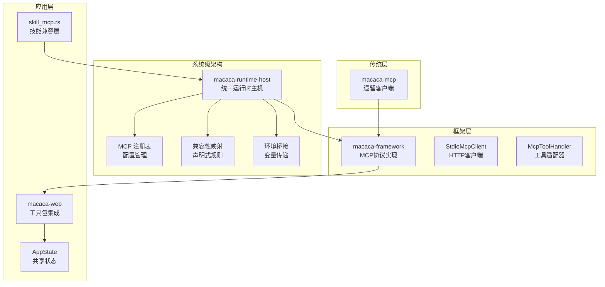

**图表来源**
- [lib.rs:1-24](file://macaca/crates/macaca-runtime-host/src/lib.rs#L1-L24)
- [mcp_runtime.rs:229-421](file://macaca/crates/macaca-web/src/mcp_runtime.rs#L229-L421)
- [framework_toolkit.rs:54-187](file://macaca/crates/macaca-web/src/framework_toolkit.rs#L54-L187)
- [state.rs:128-153](file://macaca/crates/macaca-web/src/state.rs#L128-L153)

**章节来源**
- [Cargo.toml:1-25](file://macaca/Cargo.toml#L1-L25)

## 核心组件
- **系统级MCP运行时主机（macaca-runtime-host）**
  - 统一的Agent OS运行时主机，提供MCP运行时管理、兼容性映射和环境桥接
  - 支持多级生命周期作用域：Global、App、Session、AgentSession、Call
  - 声明式兼容性映射，支持技能包到MCP服务器的自动转换
  - 环境变量桥接，安全地传递敏感配置到MCP服务器
- **MCP传输与工具元数据**
  - 传输类型：Stdio（子进程）、SSE（HTTP Server-Sent Events）、Streamable HTTP
  - 工具信息：名称、描述、输入Schema
  - 工具结果：文本、图片、资源块，支持错误标记
- **MCP客户端**
  - 支持多种传输协议和生命周期模式
  - 列出工具、调用工具、连接管理
  - 统一的内容转换和错误处理
- **MCP适配器**
  - 将MCP工具包装为Agent OS原生Tool
  - 执行时转发到MCP客户端，聚合文本内容返回
- **MCP驱动器**
  - 作为软件驱动，初始化时连接服务器、发现工具、更新清单能力
  - 提供健康检查与关闭流程

**章节来源**
- [lib.rs:1-24](file://macaca/crates/macaca-runtime-host/src/lib.rs#L1-L24)
- [mcp_runtime.rs:41-79](file://macaca/crates/macaca-web/src/mcp_runtime.rs#L41-L79)
- [mcp.rs:58-143](file://macaca/crates/macaca-framework/src/mcp.rs#L58-L143)
- [adapter.rs:14-90](file://macaca/crates/macaca-mcp/src/adapter.rs#L14-L90)
- [driver.rs:20-118](file://macaca/crates/macaca-mcp/src/driver.rs#L20-L118)

## 架构总览
下图展示了新的Agent OS级MCP架构：统一的运行时主机提供MCP运行时管理、兼容性映射和环境桥接，框架层提供协议实现，应用层通过工具包集成MCP工具。

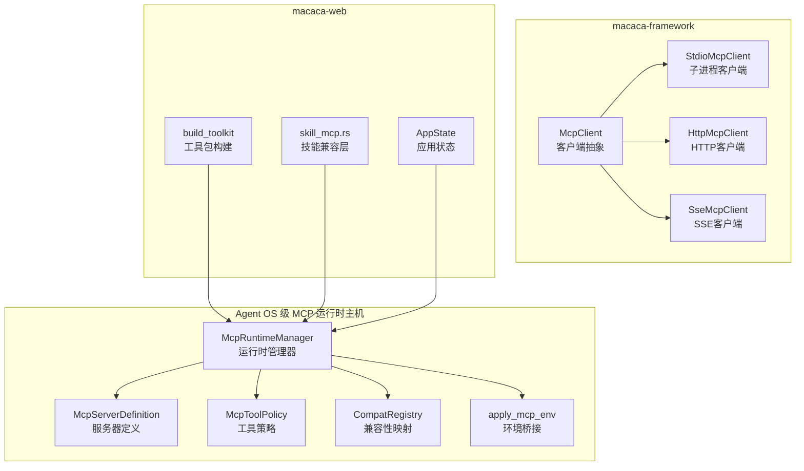

**图表来源**
- [lib.rs:1-24](file://macaca/crates/macaca-runtime-host/src/lib.rs#L1-L24)
- [mcp_runtime.rs:229-421](file://macaca/crates/macaca-web/src/mcp_runtime.rs#L229-L421)
- [mcp.rs:170-183](file://macaca/crates/macaca-framework/src/mcp.rs#L170-L183)
- [framework_toolkit.rs:54-187](file://macaca/crates/macaca-web/src/framework_toolkit.rs#L54-L187)

## 详细组件分析

### 组件A：统一MCP运行时主机（macaca-runtime-host）
- **功能职责**
  - 统一的Agent OS运行时主机，提供MCP运行时管理、兼容性映射和环境桥接
  - 支持多级生命周期作用域：Global、App、Session、AgentSession、Call
  - 声明式兼容性映射，支持技能包到MCP服务器的自动转换
  - 环境变量桥接，安全地传递敏感配置到MCP服务器
  - 并发隔离策略，确保MCP服务器的安全隔离
- **关键类型**
  - McpRuntimeManager：运行时管理器，负责实例生命周期
  - CompatRegistry：兼容性映射注册表，支持声明式规则
  - ConcurrencyIsolationPolicy：并发隔离策略，防止资源冲突
  - McpServerDefinition：服务器定义，包含传输配置、生命周期模式
- **生命周期管理**
  - acquire_runtime_key：获取运行时键，管理实例引用计数
  - release_runtime_key：释放运行时键，触发关闭回调
  - cleanup_*：清理会话、应用、全局实例和空闲实例

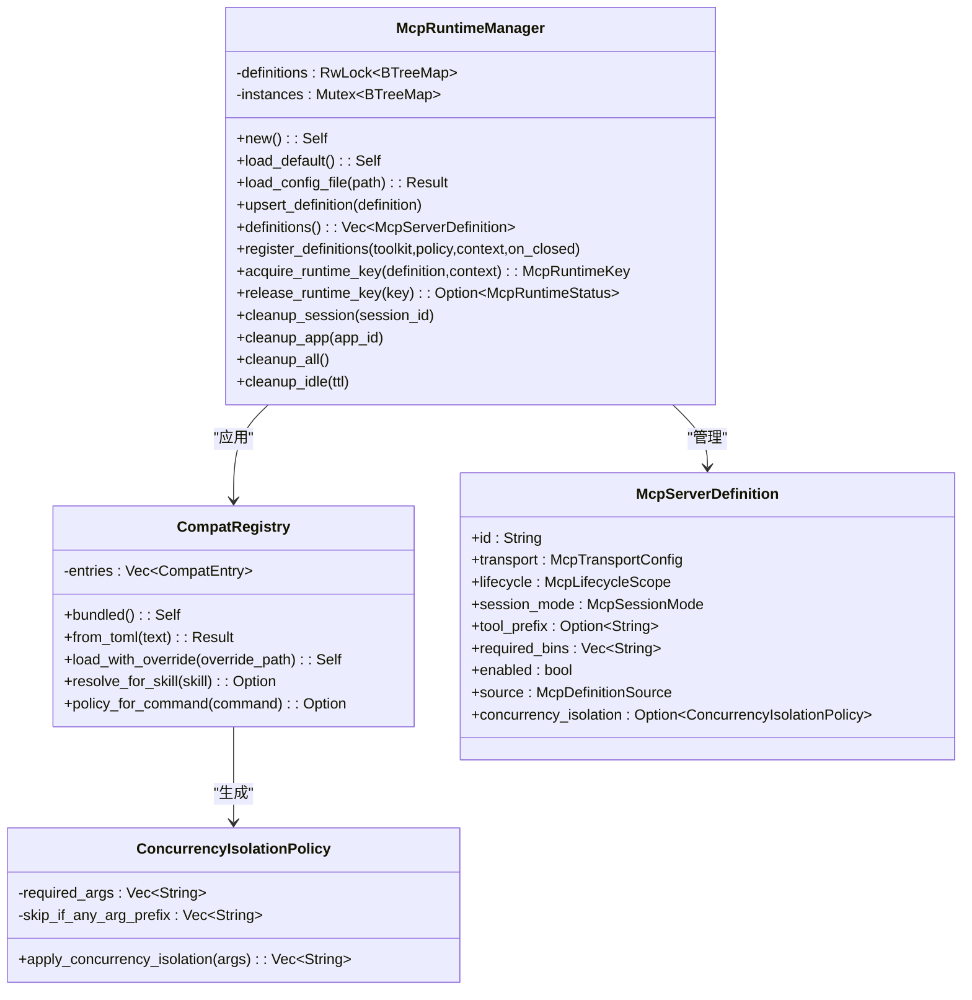

**图表来源**
- [lib.rs:1-24](file://macaca/crates/macaca-runtime-host/src/lib.rs#L1-L24)
- [mcp_runtime.rs:284-476](file://macaca/crates/macaca-runtime-host/src/mcp_runtime.rs#L284-L476)
- [compat.rs:100-162](file://macaca/crates/macaca-runtime-host/src/compat.rs#L100-L162)

**章节来源**
- [lib.rs:1-24](file://macaca/crates/macaca-runtime-host/src/lib.rs#L1-L24)
- [mcp_runtime.rs:284-476](file://macaca/crates/macaca-runtime-host/src/mcp_runtime.rs#L284-L476)

### 组件B：MCP客户端（macaca-framework）
- **功能职责**
  - 支持多种传输协议：Stdio、SSE、Streamable HTTP
  - 支持生命周期模式：Stateful、Stateless
  - 列出工具、调用工具、连接管理
  - 统一的内容转换和错误处理
- **关键类型**
  - McpTransportConfig：传输配置枚举
  - McpSessionMode：会话模式枚举
  - McpToolRegistrationOptions：工具注册选项
  - McpCallResult：工具调用结果
- **生命周期**
  - connect → list_tools → call_tool → close
  - Stateful模式复用会话，Stateless模式每次调用建立新连接

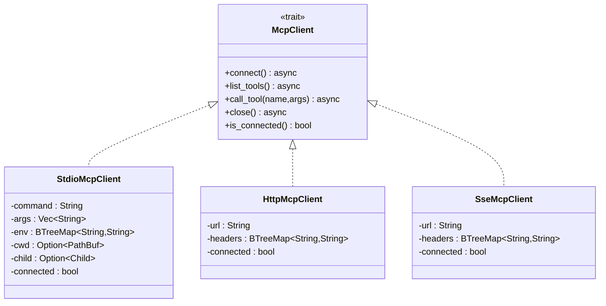

**图表来源**
- [mcp.rs:170-183](file://macaca/crates/macaca-framework/src/mcp.rs#L170-L183)
- [mcp.rs:189-200](file://macaca/crates/macaca-framework/src/mcp.rs#L189-L200)

**章节来源**
- [mcp.rs:58-143](file://macaca/crates/macaca-framework/src/mcp.rs#L58-L143)

### 组件C：MCP适配器（macaca-mcp）
- **功能职责**
  - 将MCP工具包装为Agent OS Tool接口
  - 从共享客户端读取工具结果，聚合文本内容
  - 处理错误：将MCP错误映射为Agent错误
- **关键流程**
  - execute → 读取客户端 → 解析结果 → 返回统一格式

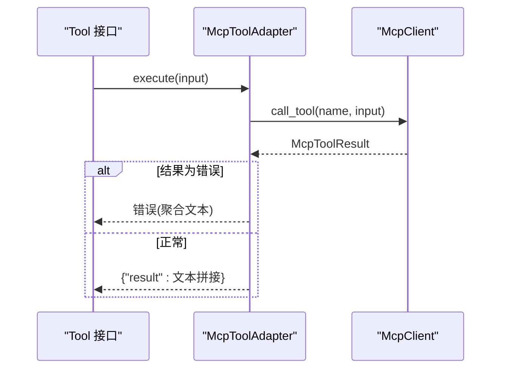

**图表来源**
- [adapter.rs:30-78](file://macaca/crates/macaca-mcp/src/adapter.rs#L30-L78)
- [client.rs:140-171](file://macaca/crates/macaca-mcp/src/client.rs#L140-L171)

**章节来源**
- [adapter.rs:14-90](file://macaca/crates/macaca-mcp/src/adapter.rs#L14-L90)

### 组件D：MCP驱动器（macaca-mcp）
- **功能职责**
  - 初始化：连接MCP服务器、发现工具、更新清单能力
  - 运行期：健康检查、工具列表重建（适配器缓存策略）
  - 关闭：断开连接、清理工具
- **关键点**
  - 使用Arc<RwLock<McpClient>>共享客户端
  - tools()方法在当前实现中返回适配器列表（需要异步创建）

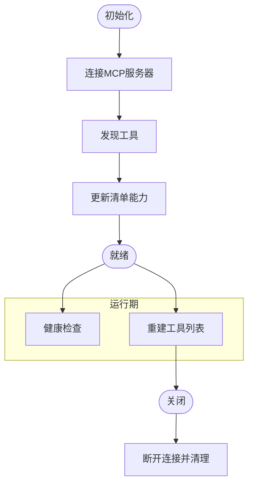

**图表来源**
- [driver.rs:51-118](file://macaca/crates/macaca-mcp/src/driver.rs#L51-L118)

**章节来源**
- [driver.rs:20-118](file://macaca/crates/macaca-mcp/src/driver.rs#L20-L118)

### 组件E：技能兼容层（macaca-web）
- **功能职责**
  - 从可见AgentSkill快照解析MCP服务器
  - 支持playwright-mcp兼容注册
  - 将工具注入traced framework toolkit
  - 提供技能级MCP服务器的状态报告
- **关键流程**
  - load_or_build_skill_snapshot → definitions_from_skill_snapshot → register_definitions

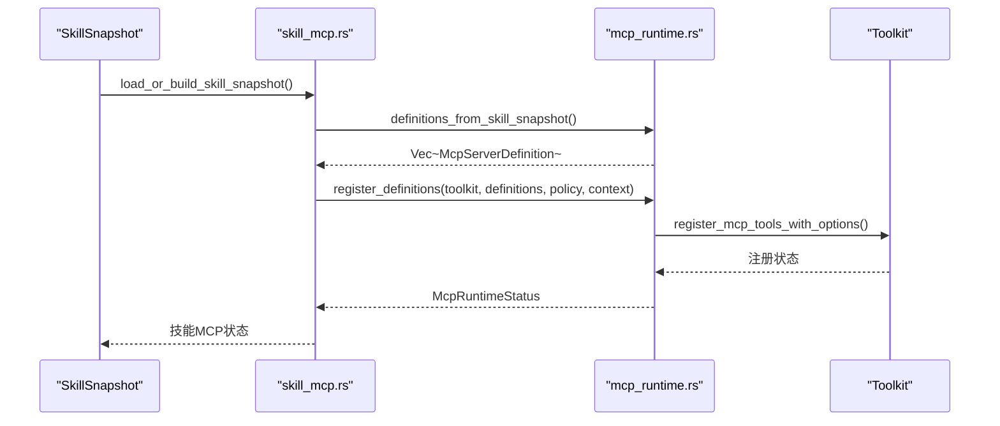

**图表来源**
- [skill_mcp.rs:51-74](file://macaca/crates/macaca-web/src/skill_mcp.rs#L51-L74)
- [mcp_runtime.rs:291-322](file://macaca/crates/macaca-web/src/mcp_runtime.rs#L291-L322)

**章节来源**
- [skill_mcp.rs:51-74](file://macaca/crates/macaca-web/src/skill_mcp.rs#L51-L74)

## 系统级MCP运行时架构

### 生命周期作用域设计
Agent OS级MCP运行时支持五种生命周期作用域，每种都有特定的使用场景和隔离级别：

- **Global**：整个后端的单个实例，适合无用户状态的服务
- **App**：每个应用程序一个实例，适合需要应用级隔离的服务
- **Session**：每个会话一个实例，适合需要会话状态的服务
- **AgentSession**：每个会话+代理组合一个实例，适合需要精细隔离的服务
- **Call**：每次调用临时连接，适合无状态HTTP服务

### 服务器定义和配置
McpServerDefinition包含完整的服务器配置信息：

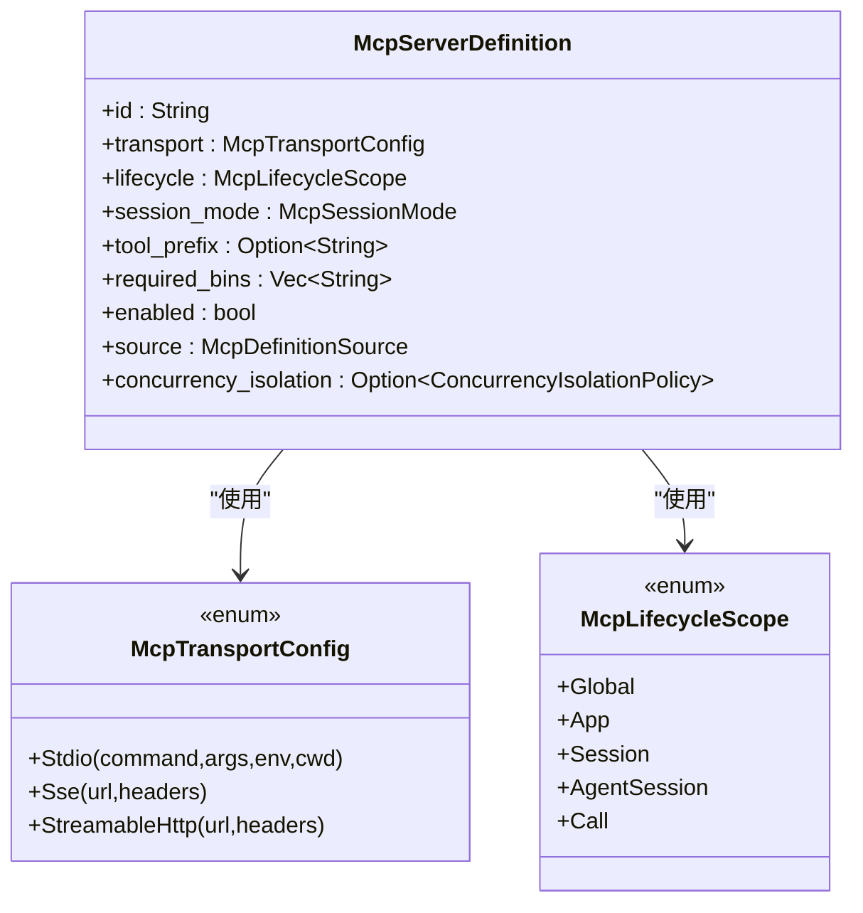

**图表来源**
- [mcp_runtime.rs:88-131](file://macaca/crates/macaca-runtime-host/src/mcp_runtime.rs#L88-L131)
- [mcp_runtime.rs:24-46](file://macaca/crates/macaca-runtime-host/src/mcp_runtime.rs#L24-L46)

### 策略控制和可见性管理
McpToolPolicy提供细粒度的服务器和工具可见性控制：

- **allow_servers/deny_servers**：控制哪些MCP服务器可见
- **allow_tools/deny_tools**：控制哪些具体工具可见
- **自动策略应用**：运行时根据策略过滤不可见的服务器和工具

**章节来源**
- [mcp_runtime.rs:213-242](file://macaca/crates/macaca-runtime-host/src/mcp_runtime.rs#L213-L242)

## 生命周期管理与状态监控

### 实例生命周期管理
McpRuntimeManager负责MCP实例的完整生命周期：

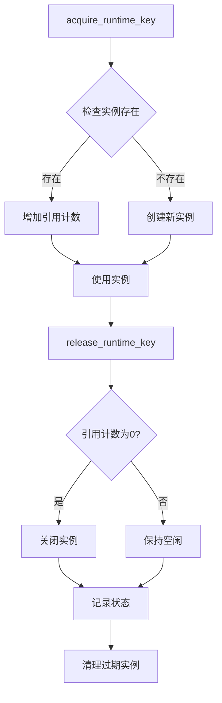

**图表来源**
- [mcp_runtime.rs:379-421](file://macaca/crates/macaca-runtime-host/src/mcp_runtime.rs#L379-L421)

### 健康检查和状态报告
系统提供多层次的健康检查机制：

- **依赖检查**：验证必需二进制文件是否存在
- **连接测试**：尝试连接MCP服务器并执行工具列表
- **状态聚合**：将检查结果转换为标准化的McpRuntimeStatus
- **事件日志**：记录所有生命周期事件到EventLog和SSE流

### 清理策略
支持多种清理策略以确保资源正确释放：

- **会话清理**：清理特定会话的所有实例
- **应用清理**：清理特定应用的所有实例  
- **全局清理**：清理所有实例
- **空闲清理**：清理超过TTL时间的空闲实例

**章节来源**
- [mcp_runtime.rs:427-476](file://macaca/crates/macaca-runtime-host/src/mcp_runtime.rs#L427-L476)

## 兼容性映射与环境桥接

### 声明式兼容性映射
macaca-runtime-host提供声明式的技能到MCP服务器映射：

- **兼容性注册表**：支持内置和自定义映射
- **命令匹配**：基于技能安装规范的自动匹配
- **并发隔离**：自动注入必要的隔离参数
- **策略应用**：支持声明式并发隔离策略

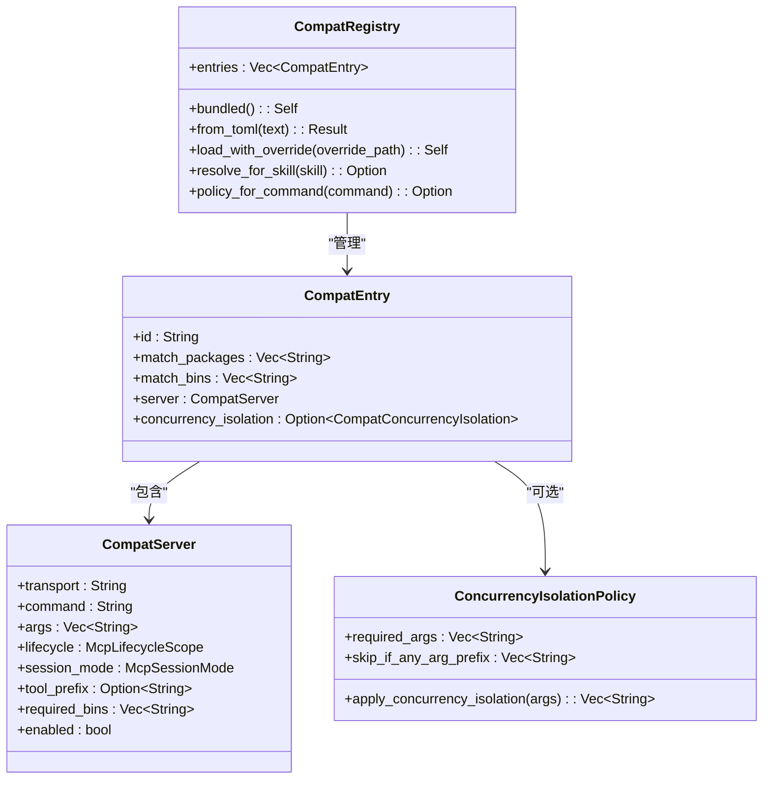

**图表来源**
- [compat.rs:100-213](file://macaca/crates/macaca-runtime-host/src/compat.rs#L100-L213)

### 环境变量桥接
安全地将配置传递给MCP服务器：

- **值语义分类**：字面量、环境变量转发、占位符跳过
- **占位符检测**：自动识别和跳过占位符值
- **环境变量验证**：确保转发的环境变量存在
- **大小写处理**：自动转换为大写环境变量名

**章节来源**
- [env_bridge.rs:27-127](file://macaca/crates/macaca-runtime-host/src/env_bridge.rs#L27-L127)

## 依赖关系分析
- **模块耦合**
  - macaca-runtime-host：提供统一的Agent OS运行时主机，包含MCP运行时管理、兼容性映射和环境桥接
  - macaca-framework：提供真实的MCP协议实现，支持多种传输协议
  - macaca-web：提供Agent OS级运行时管理，负责生命周期控制和策略应用
  - macaca-mcp：提供轻量级客户端和适配器，作为系统级架构的补充
  - 技能兼容层：保持向后兼容，从技能快照解析MCP服务器
- **外部依赖**
  - 序列化：serde/serde_json
  - 异步：tokio、async-trait、futures
  - 错误处理：thiserror/anyhow
  - 日志：tracing/tracing-subscriber

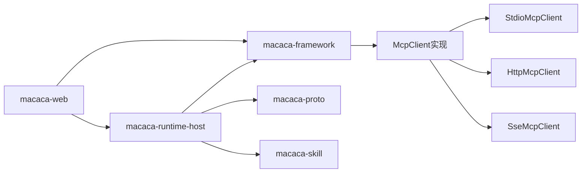

**图表来源**
- [Cargo.toml:33-90](file://macaca/Cargo.toml#L33-L90)
- [Cargo.toml:13-37](file://macaca/crates/macaca-web/Cargo.toml#L13-L37)
- [Cargo.toml:7-20](file://macaca/crates/macaca-runtime-host/Cargo.toml#L7-L20)

**章节来源**
- [Cargo.toml:33-90](file://macaca/Cargo.toml#L33-L90)
- [Cargo.toml:13-37](file://macaca/crates/macaca-web/Cargo.toml#L13-L37)
- [Cargo.toml:7-20](file://macaca/crates/macaca-runtime-host/Cargo.toml#L7-L20)

## 性能考量
- **I/O模型**
  - macaca-framework：支持多种传输协议，Stdio基于Tokio子进程，HTTP基于异步网络
  - macaca-runtime-host：运行时管理器使用Arc<RwLock<T>>共享状态，避免重复连接
  - macaca-web：运行时管理器使用Arc<RwLock<T>>共享状态，避免重复连接
  - macaca-mcp：当前为内存态stub，无实际I/O开销
- **并发与锁**
  - 运行时管理器通过Arc<RwLock<T>>共享客户端，避免重复连接
  - 适配器execute为只读访问，无需写锁
- **实例复用**
  - Stateful模式复用连接，减少连接建立开销
  - 生命周期作用域控制实例共享程度
- **策略过滤**
  - 运行时应用策略过滤，减少不必要的工具注册
  - 空间换时间的策略，提高查询效率
- **兼容性映射优化**
  - 声明式映射减少运行时分支判断
  - 缓存兼容性策略提高查找效率

## 故障排除指南
- **常见错误与定位**
  - 未连接：检查connect是否成功、is_connected状态
  - 工具不存在：确认list_tools结果与调用名称一致
  - I/O错误：Stdio客户端在连接失败或EOF时抛出相应错误
  - 依赖缺失：运行时检查required_bins，报告缺失的二进制文件
  - 策略拒绝：检查McpToolPolicy配置，确认服务器和工具可见性
  - 兼容性映射失败：检查CompatRegistry配置和技能安装规范
  - 环境变量问题：检查apply_mcp_env的返回结果和日志
- **调试建议**
  - 启用tracing日志，观察连接、工具列举与调用过程
  - 对于Stdio客户端，检查子进程启动参数与协议版本
  - 监控运行时状态变化，观察生命周期事件
  - 使用状态API检查MCP服务器的健康状况
  - 检查兼容性映射是否正确应用
  - 验证环境变量桥接是否成功
- **重连策略**
  - 驱动器shutdown后可重新initialize以重建连接
  - 运行时管理器自动处理实例清理和重新创建
  - SSE客户端断线后可重试连接并重新列举工具
  - 兼容性映射失败时可尝试重新加载映射表
- **性能监控**
  - 记录工具调用耗时与错误率
  - 监控子进程存活状态与输出缓冲情况
  - 跟踪实例引用计数和生命周期事件
  - 监控策略过滤效果和工具注册成功率
  - 跟踪兼容性映射命中率和环境变量应用成功率

**章节来源**
- [client.rs:115-171](file://macaca/crates/macaca-mcp/src/client.rs#L115-L171)
- [driver.rs:113-117](file://macaca/crates/macaca-mcp/src/driver.rs#L113-L117)
- [mcp_runtime.rs:485-546](file://macaca/crates/macaca-web/src/mcp_runtime.rs#L485-L546)

## 结论
本指南梳理了Agent OS中MCP能力的完整架构演进。从技能级MCP运行时迁移到系统级MCP运行时，实现了以下关键改进：

- **统一基础设施**：MCP服务作为Agent OS基础设施，所有应用程序都可以按策略使用
- **生命周期控制**：支持多级生命周期作用域，确保状态型MCP服务的正确隔离
- **策略管理**：提供细粒度的服务器和工具可见性控制
- **兼容性映射**：声明式技能到MCP服务器的自动转换，消除硬编码分支
- **环境桥接**：安全地传递敏感配置到MCP服务器，支持多种值语义
- **并发隔离**：自动注入隔离参数，防止MCP服务器间的资源冲突
- **可观测性**：完整的生命周期事件记录和状态监控
- **向后兼容**：技能兼容层保持现有功能，逐步迁移至系统级架构

结合这五个层次的实现，开发者可以：
- 将第三方MCP工具作为系统级服务统一管理
- 在本地或远程部署MCP服务，支持多种传输协议
- 通过策略控制实现安全的工具发现与调用
- 利用生命周期管理确保状态型服务的正确隔离
- 使用兼容性映射简化技能集成
- 通过环境桥接安全地传递配置信息

## 附录

### A. MCP协议要点与状态管理
- **消息格式**
  - JSON-RPC 2.0：请求含id/method/params；响应含id/result/error
  - 通知：无id，不期望响应
- **请求/响应模式**
  - initialize：客户端向服务器表明协议版本与能力
  - notifications/initialized：客户端完成初始化通知
  - tools/list：获取可用工具列表
  - tools/call：调用指定工具，返回content/isError/_meta
- **状态管理**
  - 连接状态：connected标志位
  - 工具缓存：list_tools结果可缓存，避免重复查询
  - 错误传播：客户端错误映射为上层错误类型
  - **新增**：系统级状态管理，支持生命周期事件和状态监控

**章节来源**
- [mcp.rs:123-190](file://macaca/crates/macaca-framework/src/mcp.rs#L123-L190)
- [mcp.rs:194-296](file://macaca/crates/macaca-framework/src/mcp.rs#L194-L296)

### B. 客户端与驱动器实现示例（路径指引）
- **建立连接**
  - macaca-mcp：参考 [client.rs:107-119](file://macaca/crates/macaca-mcp/src/client.rs#L107-L119)
  - macaca-framework：参考 [mcp.rs:194-231](file://macaca/crates/macaca-framework/src/mcp.rs#L194-L231)
- **列举工具**
  - macaca-mcp：参考 [client.rs:129-138](file://macaca/crates/macaca-mcp/src/client.rs#L129-L138)
  - macaca-framework：参考 [mcp.rs:233-243](file://macaca/crates/macaca-framework/src/mcp.rs#L233-L243)
- **调用工具**
  - macaca-mcp：参考 [client.rs:140-171](file://macaca/crates/macaca-mcp/src/client.rs#L140-L171)
  - macaca-framework：参考 [mcp.rs:277-296](file://macaca/crates/macaca-framework/src/mcp.rs#L277-L296)
- **驱动器生命周期**
  - 初始化/健康检查/关闭：参考 [driver.rs:51-118](file://macaca/crates/macaca-mcp/src/driver.rs#L51-L118)
- **系统级运行时管理**
  - 实例获取/释放/清理：参考 [mcp_runtime.rs:379-476](file://macaca/crates/macaca-web/src/mcp_runtime.rs#L379-L476)

### C. 认证机制、超时与重连
- **认证机制**
  - 当前实现未内置认证字段；如需认证，可在initialize参数中扩展
  - **新增**：传输层支持HTTP头部认证，适用于SSE和Streamable HTTP
- **超时处理**
  - 可在Stdio客户端中引入超时控制（例如对read_response增加超时）
  - **新增**：McpTimeouts结构体支持连接、工具列表、工具调用的独立超时配置
- **重连策略**
  - 驱动器shutdown后重新initialize；SSE客户端断线后可重试连接
  - **新增**：运行时管理器自动处理实例清理和重新创建

**章节来源**
- [mcp.rs:215-227](file://macaca/crates/macaca-framework/src/mcp.rs#L215-L227)
- [mcp_runtime.rs:96-112](file://macaca/crates/macaca-web/src/mcp_runtime.rs#L96-L112)

### D. 系统级架构迁移指南
- **迁移步骤**
  1. 将技能级MCP服务器定义迁移到Agent OS级注册表
  2. 更新应用配置，使用策略而非硬编码MCP服务器
  3. 迁移技能兼容层到系统级运行时
  4. 更新工具包构建逻辑，集成系统级MCP工具
  5. 配置兼容性映射和环境变量桥接
- **兼容性保证**
  - 保持现有playwright-mcp行为
  - 提供渐进式迁移路径
  - 保留技能级MCP作为发现源

**章节来源**
- [design.md:169-215](file://openspec/changes/add-agent-os-mcp-runtime/design.md#L169-L215)
- [proposal.md:22-50](file://openspec/changes/add-agent-os-mcp-runtime/proposal.md#L22-L50)

### E. 兼容性映射配置示例
- **内置映射**
  - Playwright：自动注入`--headless --isolated`参数
  - Figma：通过npx包装器启动
- **自定义映射**
  - 支持覆盖内置映射
  - 支持声明式并发隔离策略
  - 基于包名和二进制文件匹配

**章节来源**
- [compat_mappings.toml:43-75](file://macaca/crates/macaca-runtime-host/resources/compat_mappings.toml#L43-L75)
- [compat.rs:106-144](file://macaca/crates/macaca-runtime-host/src/compat.rs#L106-L144)