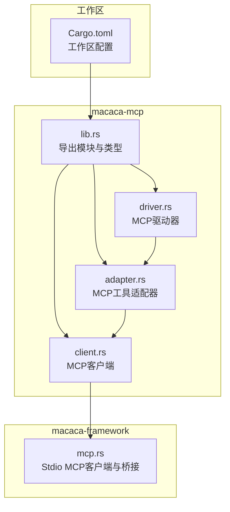
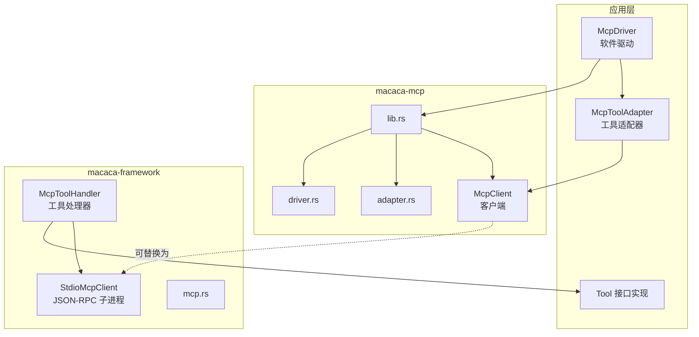
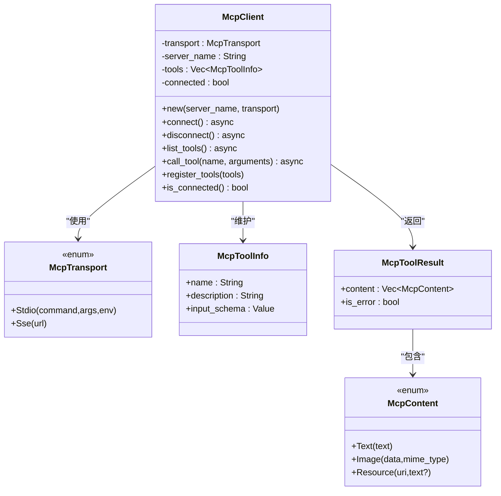
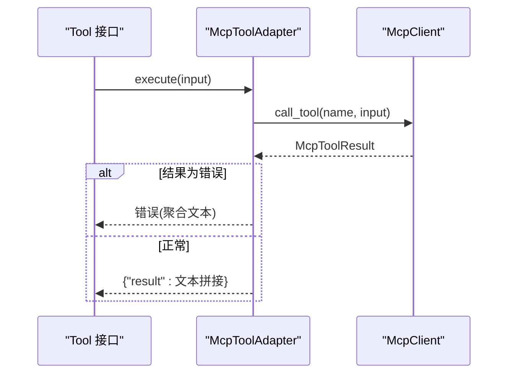
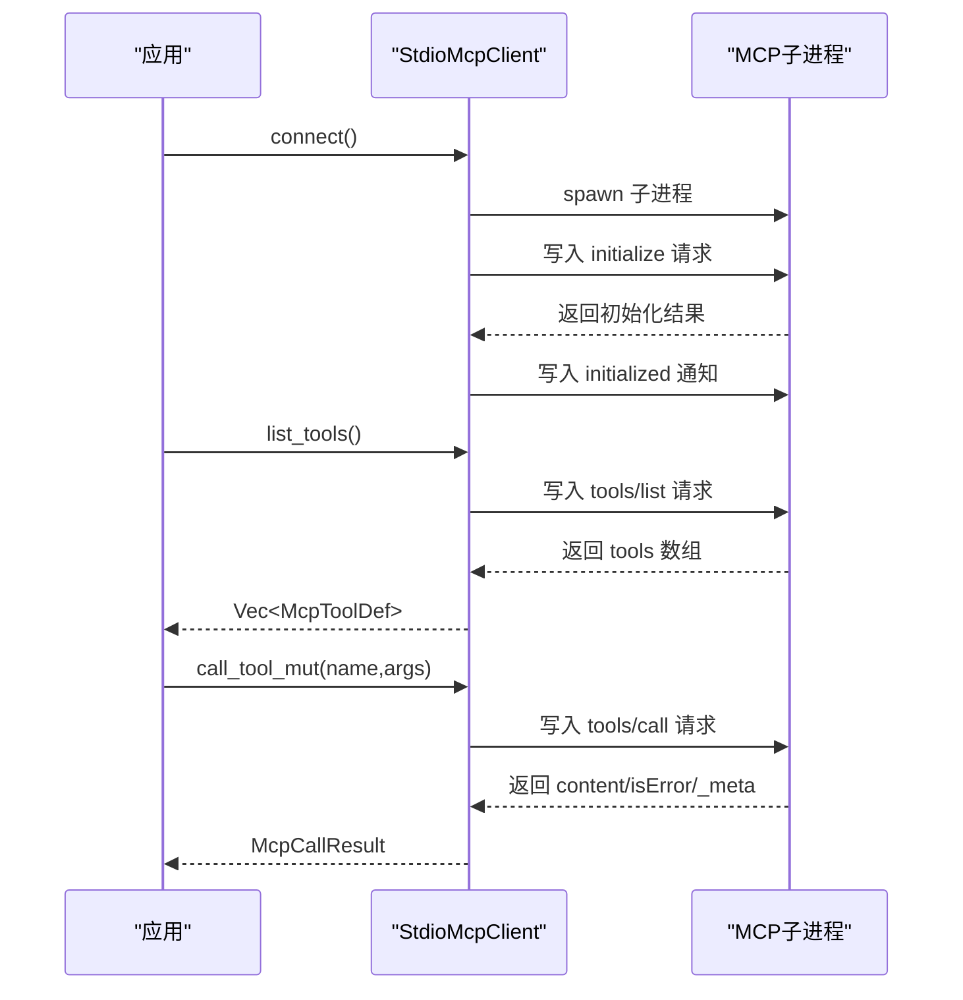
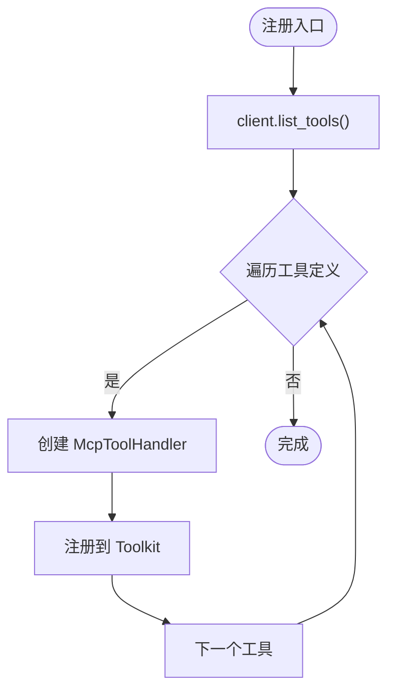
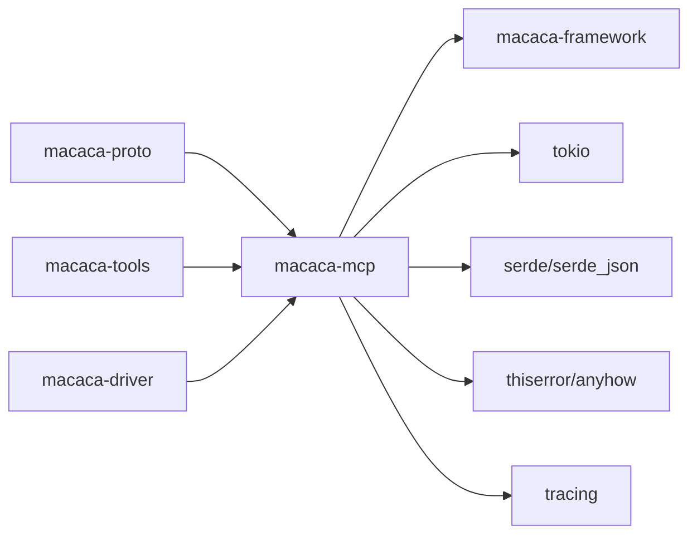

# MCP协议

<cite>
**本文引用的文件**
- [Cargo.toml](file://macaca/Cargo.toml)
- [lib.rs](file://macaca/crates/macaca-mcp/src/lib.rs)
- [client.rs](file://macaca/crates/macaca-mcp/src/client.rs)
- [adapter.rs](file://macaca/crates/macaca-mcp/src/adapter.rs)
- [driver.rs](file://macaca/crates/macaca-mcp/src/driver.rs)
- [mcp.rs](file://macaca/crates/macaca-framework/src/mcp.rs)
</cite>

## 目录
1. [简介](#简介)
2. [项目结构](#项目结构)
3. [核心组件](#核心组件)
4. [架构总览](#架构总览)
5. [详细组件分析](#详细组件分析)
6. [依赖关系分析](#依赖关系分析)
7. [性能考量](#性能考量)
8. [故障排除指南](#故障排除指南)
9. [结论](#结论)
10. [附录](#附录)

## 简介
本指南面向希望在Agent OS中实现与MCP（Model Context Protocol）兼容的客户端与驱动器的开发者。文档覆盖以下内容：
- MCP协议要点：消息格式、请求/响应模式、状态管理
- MCP客户端实现：连接建立、消息发送、响应处理
- MCP驱动器开发：协议适配器、消息路由、工具注册与错误处理
- 具体实现示例：认证机制、超时处理、重连策略
- 调试方法、性能监控与故障排除

本仓库提供了两套MCP相关实现：
- macaca-mcp：轻量级客户端、适配器与驱动器，用于将MCP工具暴露为Agent OS原生工具
- macaca-framework：更完整的Stdio MCP客户端（JSON-RPC over 子进程），以及将MCP工具桥接到Toolkit系统的适配层

## 项目结构
该工作区采用多crate的Rust工作区组织方式，MCP相关能力分布在多个crate中：
- macaca-mcp：MCP客户端、适配器、驱动器
- macaca-framework：MCP客户端（Stdio）、工具桥接、类型定义
- 其他相关crate：macaca-proto、macaca-tools、macaca-driver等

图表来源
- [Cargo.toml:1-25](file://macaca/Cargo.toml#L1-L25)
- [lib.rs:1-13](file://macaca/crates/macaca-mcp/src/lib.rs#L1-L13)
- [client.rs:1-242](file://macaca/crates/macaca-mcp/src/client.rs#L1-L242)
- [adapter.rs:1-158](file://macaca/crates/macaca-mcp/src/adapter.rs#L1-L158)
- [driver.rs:1-176](file://macaca/crates/macaca-mcp/src/driver.rs#L1-L176)
- [mcp.rs:1-749](file://macaca/crates/macaca-framework/src/mcp.rs#L1-L749)

章节来源
- [Cargo.toml:1-25](file://macaca/Cargo.toml#L1-L25)

## 核心组件
- MCP传输与工具元数据
  - 传输类型：Stdio（子进程）、SSE（HTTP Server-Sent Events）
  - 工具信息：名称、描述、输入Schema
  - 工具结果：文本、图片、资源块，支持错误标记
- MCP客户端
  - 连接/断开、列出工具、调用工具
  - 当前为简化实现（stub），后续可接入真实I/O
- MCP适配器
  - 将MCP工具包装为Agent OS原生Tool
  - 执行时转发到MCP客户端，聚合文本内容返回
- MCP驱动器
  - 作为软件驱动，初始化时连接服务器、发现工具、更新清单能力
  - 提供健康检查与关闭流程

章节来源
- [client.rs:13-177](file://macaca/crates/macaca-mcp/src/client.rs#L13-L177)
- [adapter.rs:14-90](file://macaca/crates/macaca-mcp/src/adapter.rs#L14-L90)
- [driver.rs:20-118](file://macaca/crates/macaca-mcp/src/driver.rs#L20-L118)

## 架构总览
下图展示了macaca-mcp与macaca-framework中MCP能力的协作关系：驱动器通过适配器使用客户端；框架侧提供Stdio MCP客户端与工具桥接。

图表来源
- [lib.rs:6-12](file://macaca/crates/macaca-mcp/src/lib.rs#L6-L12)
- [driver.rs:30-78](file://macaca/crates/macaca-mcp/src/driver.rs#L30-L78)
- [adapter.rs:14-90](file://macaca/crates/macaca-mcp/src/adapter.rs#L14-L90)
- [mcp.rs:71-84](file://macaca/crates/macaca-framework/src/mcp.rs#L71-L84)

## 详细组件分析

### 组件A：MCP客户端（macaca-mcp）
- 功能职责
  - 支持Stdio与SSE两种传输
  - 列出工具、调用工具（当前为stub）
  - 维护连接状态与工具列表
- 关键类型
  - McpTransport：Stdio/SSE
  - McpToolInfo：工具元数据
  - McpToolResult/McpContent：结果与内容块
- 生命周期
  - connect → list_tools → call_tool → disconnect
- 错误处理
  - 未连接时报错
  - 未知工具报错
  - stub执行返回文本结果

图表来源
- [client.rs:13-177](file://macaca/crates/macaca-mcp/src/client.rs#L13-L177)

章节来源
- [client.rs:68-177](file://macaca/crates/macaca-mcp/src/client.rs#L68-L177)

### 组件B：MCP适配器（macaca-mcp）
- 功能职责
  - 将MCP工具包装为Agent OS Tool接口
  - 从共享客户端读取工具结果，聚合文本内容
  - 处理错误：将MCP错误映射为Agent错误
- 关键流程
  - execute → 读取客户端 → 解析结果 → 返回统一格式

图表来源
- [adapter.rs:30-78](file://macaca/crates/macaca-mcp/src/adapter.rs#L30-L78)
- [client.rs:140-171](file://macaca/crates/macaca-mcp/src/client.rs#L140-L171)

章节来源
- [adapter.rs:14-90](file://macaca/crates/macaca-mcp/src/adapter.rs#L14-L90)

### 组件C：MCP驱动器（macaca-mcp）
- 功能职责
  - 初始化：连接MCP服务器、发现工具、更新清单能力
  - 运行期：健康检查、工具列表重建（适配器缓存策略）
  - 关闭：断开连接、清理工具
- 关键点
  - 使用Arc<RwLock<McpClient>>共享客户端
  - tools()方法在当前实现中返回适配器列表（需要异步创建）

图表来源
- [driver.rs:51-118](file://macaca/crates/macaca-mcp/src/driver.rs#L51-L118)

章节来源
- [driver.rs:20-118](file://macaca/crates/macaca-mcp/src/driver.rs#L20-L118)

### 组件D：Stdio MCP客户端（macaca-framework）
- 功能职责
  - 通过子进程与MCP服务器进行JSON-RPC通信
  - 实现initialize/notifications/initialized协议握手
  - 支持tools/list与tools/call
- 关键流程
  - connect → 发送initialize → 发送initialized通知
  - list_tools → 解析tools数组
  - call_tool_mut → 发送tools/call并解析结果

图表来源
- [mcp.rs:194-296](file://macaca/crates/macaca-framework/src/mcp.rs#L194-L296)

章节来源
- [mcp.rs:71-296](file://macaca/crates/macaca-framework/src/mcp.rs#L71-L296)

### 组件E：工具桥接与注册（macaca-framework）
- 功能职责
  - 将MCP工具包装为ToolHandler，注册到Toolkit
  - register_mcp_tools：批量注册并按组名分组
- 关键点
  - 通过Arc<RwLock<dyn McpClient>>共享客户端
  - 执行时将MCP错误转换为ToolError

图表来源
- [mcp.rs:395-415](file://macaca/crates/macaca-framework/src/mcp.rs#L395-L415)

章节来源
- [mcp.rs:341-415](file://macaca/crates/macaca-framework/src/mcp.rs#L341-L415)

## 依赖关系分析
- 模块耦合
  - macaca-mcp内部：lib.rs导出client/adapter/driver，形成清晰边界
  - 驱动器依赖适配器与客户端；适配器依赖客户端
  - 框架侧Stdio客户端可替代macaca-mcp中的简化客户端
- 外部依赖
  - 序列化：serde/serde_json
  - 异步：tokio、async-trait、futures
  - 错误处理：thiserror/anyhow
  - 日志：tracing/tracing-subscriber

图表来源
- [Cargo.toml:33-52](file://macaca/Cargo.toml#L33-L52)
- [lib.rs:10-12](file://macaca/crates/macaca-mcp/src/lib.rs#L10-L12)

章节来源
- [Cargo.toml:33-90](file://macaca/Cargo.toml#L33-L90)

## 性能考量
- I/O模型
  - macaca-mcp：当前为内存态stub，无实际I/O开销
  - macaca-framework：Stdio基于Tokio子进程与缓冲读写，适合本地MCP服务
- 并发与锁
  - 驱动器与适配器通过Arc<RwLock<T>>共享客户端，避免重复连接
  - 适配器execute为只读访问，无需写锁
- 结果聚合
  - 适配器将多块文本合并为单一字符串，减少上层处理复杂度
- 可扩展性
  - SSE传输可在macaca-mcp中扩展，以支持远程MCP服务
  - 框架侧Stdio客户端已实现initialize/notifications/initialized握手，便于集成标准MCP服务器

## 故障排除指南
- 常见错误与定位
  - 未连接：检查connect是否成功、is_connected状态
  - 工具不存在：确认list_tools结果与调用名称一致
  - I/O错误：Stdio客户端在连接失败或EOF时抛出相应错误
- 调试建议
  - 启用tracing日志，观察连接、工具列举与调用过程
  - 对于Stdio客户端，检查子进程启动参数与协议版本
- 重连策略
  - 驱动器shutdown后可重新initialize以重建连接
  - 对于SSE客户端，可在断开后重试连接并重新列举工具
- 性能监控
  - 记录工具调用耗时与错误率
  - 监控子进程存活状态与输出缓冲情况

章节来源
- [client.rs:115-171](file://macaca/crates/macaca-mcp/src/client.rs#L115-L171)
- [driver.rs:113-117](file://macaca/crates/macaca-mcp/src/driver.rs#L113-L117)
- [mcp.rs:25-44](file://macaca/crates/macaca-framework/src/mcp.rs#L25-L44)

## 结论
本指南梳理了Agent OS中MCP能力的实现现状与扩展方向。macaca-mcp提供了简洁的客户端、适配器与驱动器骨架，便于快速集成MCP工具；macaca-framework则给出了基于Stdio的完整JSON-RPC实现与工具桥接方案。结合这两套实现，开发者可以：
- 快速将第三方MCP工具接入Agent OS
- 在本地或远程部署MCP服务
- 通过适配器与驱动器实现统一的工具发现与调用体验

## 附录

### A. MCP协议要点与状态管理
- 消息格式
  - JSON-RPC 2.0：请求含id/method/params；响应含id/result/error
  - 通知：无id，不期望响应
- 请求/响应模式
  - initialize：客户端向服务器表明协议版本与能力
  - notifications/initialized：客户端完成初始化通知
  - tools/list：获取可用工具列表
  - tools/call：调用指定工具，返回content/isError/_meta
- 状态管理
  - 连接状态：connected标志位
  - 工具缓存：list_tools结果可缓存，避免重复查询
  - 错误传播：客户端错误映射为上层错误类型

章节来源
- [mcp.rs:123-190](file://macaca/crates/macaca-framework/src/mcp.rs#L123-L190)
- [mcp.rs:194-296](file://macaca/crates/macaca-framework/src/mcp.rs#L194-L296)

### B. 客户端与驱动器实现示例（路径指引）
- 建立连接
  - macaca-mcp：参考 [client.rs:107-119](file://macaca/crates/macaca-mcp/src/client.rs#L107-L119)
  - macaca-framework：参考 [mcp.rs:194-231](file://macaca/crates/macaca-framework/src/mcp.rs#L194-L231)
- 列举工具
  - macaca-mcp：参考 [client.rs:129-138](file://macaca/crates/macaca-mcp/src/client.rs#L129-L138)
  - macaca-framework：参考 [mcp.rs:233-243](file://macaca/crates/macaca-framework/src/mcp.rs#L233-L243)
- 调用工具
  - macaca-mcp：参考 [client.rs:140-171](file://macaca/crates/macaca-mcp/src/client.rs#L140-L171)
  - macaca-framework：参考 [mcp.rs:277-296](file://macaca/crates/macaca-framework/src/mcp.rs#L277-L296)
- 驱动器生命周期
  - 初始化/健康检查/关闭：参考 [driver.rs:51-118](file://macaca/crates/macaca-mcp/src/driver.rs#L51-L118)

### C. 认证机制、超时与重连
- 认证机制
  - 当前实现未内置认证字段；如需认证，可在initialize参数中扩展
- 超时处理
  - 可在Stdio客户端中引入超时控制（例如对read_response增加超时）
- 重连策略
  - 驱动器shutdown后重新initialize；SSE客户端断线后可重试连接

章节来源
- [mcp.rs:215-227](file://macaca/crates/macaca-framework/src/mcp.rs#L215-L227)