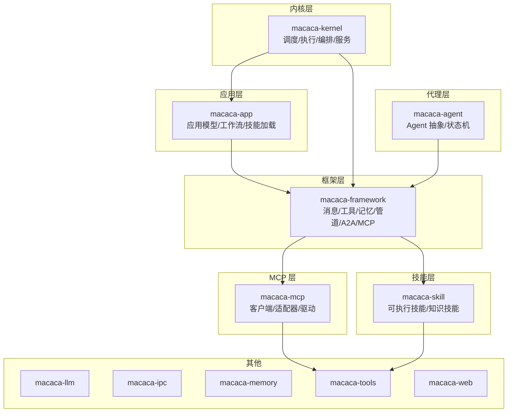
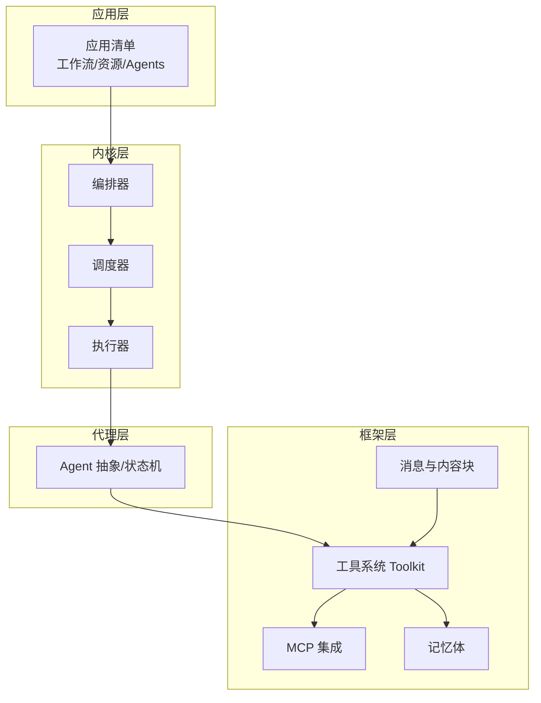
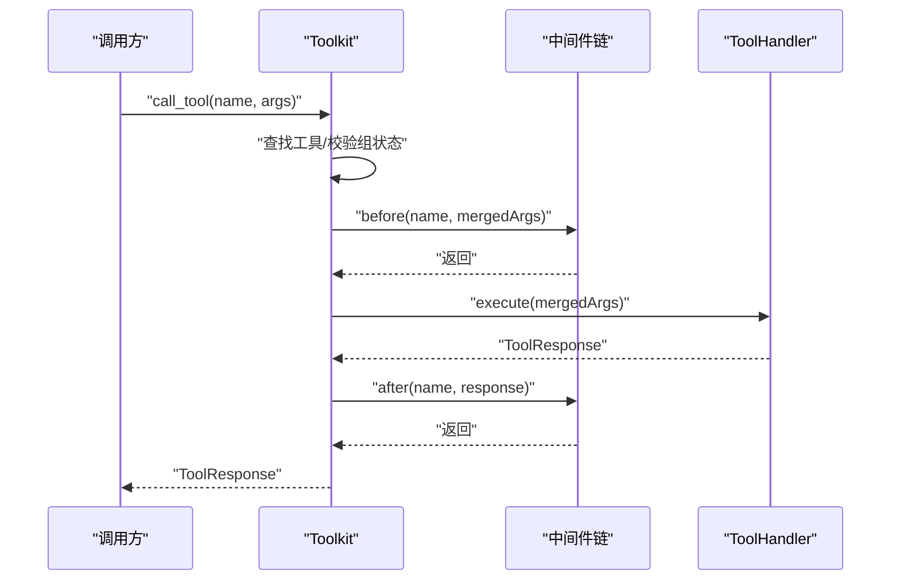
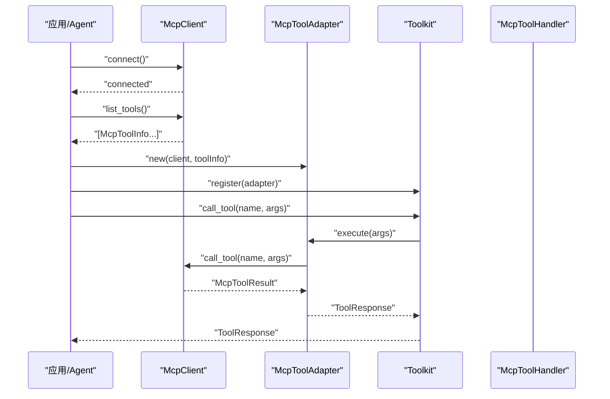
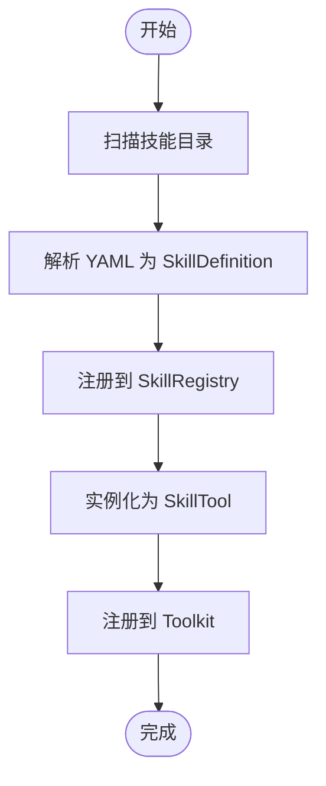
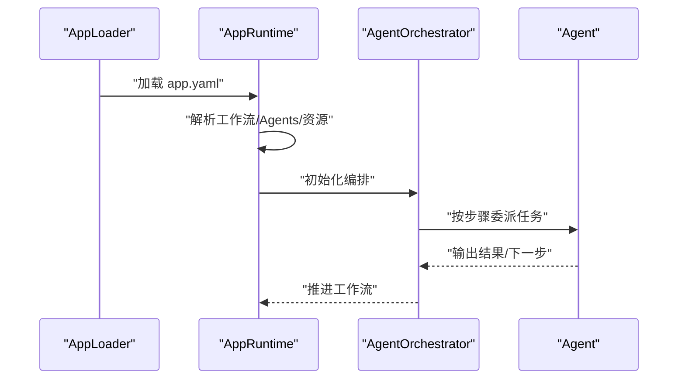
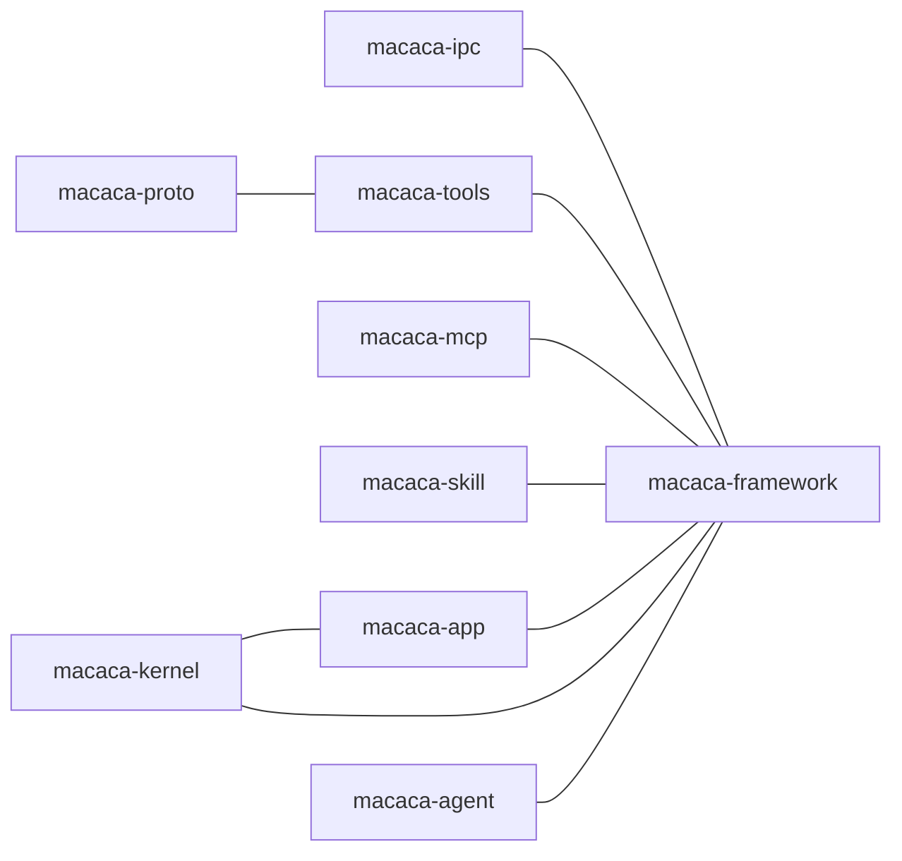

# 扩展开发

<cite>
**本文档引用的文件**
- [macaca/README.md](file://macaca/README.md)
- [macaca/Cargo.toml](file://macaca/Cargo.toml)
- [macaca/crates/macaca-framework/src/lib.rs](file://macaca/crates/macaca-framework/src/lib.rs)
- [macaca/crates/macaca-framework/src/mcp.rs](file://macaca/crates/macaca-framework/src/mcp.rs)
- [macaca/crates/macaca-framework/src/tool.rs](file://macaca/crates/macaca-framework/src/tool.rs)
- [macaca/crates/macaca-mcp/src/lib.rs](file://macaca/crates/macaca-mcp/src/lib.rs)
- [macaca/crates/macaca-mcp/src/client.rs](file://macaca/crates/macaca-mcp/src/client.rs)
- [macaca/crates/macaca-mcp/src/adapter.rs](file://macaca/crates/macaca-mcp/src/adapter.rs)
- [macaca/crates/macaca-skill/src/lib.rs](file://macaca/crates/macaca-skill/src/lib.rs)
- [macaca/crates/macaca-skill/src/definition.rs](file://macaca/crates/macaca-skill/src/definition.rs)
- [macaca/crates/macaca-skill/src/registry.rs](file://macaca/crates/macaca-skill/src/registry.rs)
- [macaca/crates/macaca-agent/src/lib.rs](file://macaca/crates/macaca-agent/src/lib.rs)
- [macaca/crates/macaca-app/src/lib.rs](file://macaca/crates/macaca-app/src/lib.rs)
- [macaca/crates/macaca-kernel/src/lib.rs](file://macaca/crates/macaca-kernel/src/lib.rs)
- [macaca/examples/apps/fullstack-autodev/app.yaml](file://macaca/examples/apps/fullstack-autodev/app.yaml)
</cite>

## 目录
1. [简介](#简介)
2. [项目结构](#项目结构)
3. [核心组件](#核心组件)
4. [架构总览](#架构总览)
5. [详细组件分析](#详细组件分析)
6. [依赖关系分析](#依赖关系分析)
7. [性能考虑](#性能考虑)
8. [故障排查指南](#故障排查指南)
9. [结论](#结论)
10. [附录](#附录)

## 简介
本指南面向希望在 Agent OS 上进行扩展开发的工程师，覆盖以下主题：
- 自定义组件的开发、注册与集成方法
- MCP（Model Context Protocol）实现与使用，包括协议规范、消息格式与交互模式
- 技能系统开发，包括 Agent 技能定义、技能注册与动态加载机制
- 第三方服务集成指南，包括 API 适配、数据转换与错误处理
- 扩展开发最佳实践、测试方法与发布流程

## 项目结构
仓库采用 Rust 工作区组织，核心模块按职责分层：
- 框架层：提供统一的消息类型、工具系统、记忆体、管道编排等能力
- MCP 层：提供 MCP 客户端、适配器与驱动，连接外部工具生态
- 技能层：提供可执行技能与知识型技能（agentskills.io）管理
- 应用层：声明式应用模型，支持 L1/L2/L3 层次的应用加载与运行
- 内核层：调度、执行、编排与服务桥接
- 示例与文档：示例应用、Persona/Workflow 配置与系统文档

图表来源
- [macaca/Cargo.toml:1-90](file://macaca/Cargo.toml#L1-L90)
- [macaca/crates/macaca-framework/src/lib.rs:1-32](file://macaca/crates/macaca-framework/src/lib.rs#L1-L32)
- [macaca/crates/macaca-mcp/src/lib.rs:1-13](file://macaca/crates/macaca-mcp/src/lib.rs#L1-L13)
- [macaca/crates/macaca-skill/src/lib.rs:1-35](file://macaca/crates/macaca-skill/src/lib.rs#L1-L35)
- [macaca/crates/macaca-app/src/lib.rs:1-21](file://macaca/crates/macaca-app/src/lib.rs#L1-L21)
- [macaca/crates/macaca-kernel/src/lib.rs:1-29](file://macaca/crates/macaca-kernel/src/lib.rs#L1-L29)

章节来源
- [macaca/README.md:1-29](file://macaca/README.md#L1-L29)
- [macaca/Cargo.toml:1-90](file://macaca/Cargo.toml#L1-L90)

## 核心组件
- 工具系统（Toolkit）：统一的工具注册、中间件链、分组激活/停用与调用流程
- MCP 支持：MCP 客户端抽象、Stdio/SSE 传输、工具适配器与批量注册
- 技能系统：可执行技能（YAML 声明）、技能注册表、知识技能（agentskills.io）
- 应用模型：声明式应用清单、工作流引擎、技能加载器
- 内核与调度：任务执行队列、路由、执行器、编排器与服务桥接

章节来源
- [macaca/crates/macaca-framework/src/tool.rs:1-402](file://macaca/crates/macaca-framework/src/tool.rs#L1-L402)
- [macaca/crates/macaca-framework/src/mcp.rs:1-749](file://macaca/crates/macaca-framework/src/mcp.rs#L1-L749)
- [macaca/crates/macaca-mcp/src/client.rs:1-242](file://macaca/crates/macaca-mcp/src/client.rs#L1-L242)
- [macaca/crates/macaca-mcp/src/adapter.rs:1-158](file://macaca/crates/macaca-mcp/src/adapter.rs#L1-L158)
- [macaca/crates/macaca-skill/src/definition.rs:1-141](file://macaca/crates/macaca-skill/src/definition.rs#L1-L141)
- [macaca/crates/macaca-skill/src/registry.rs:1-267](file://macaca/crates/macaca-skill/src/registry.rs#L1-L267)
- [macaca/crates/macaca-app/src/lib.rs:1-21](file://macaca/crates/macaca-app/src/lib.rs#L1-L21)
- [macaca/crates/macaca-kernel/src/lib.rs:1-29](file://macaca/crates/macaca-kernel/src/lib.rs#L1-L29)

## 架构总览
Agent OS 以“框架-应用-内核-代理”分层协作：
- 框架层提供统一的工具、消息、记忆与 MCP 集成
- 应用层以声明式方式描述 Agent 组织、工作流与资源路径
- 内核层负责任务调度、执行与编排
- 代理层封装具体 Agent 行为与生命周期

图表来源
- [macaca/crates/macaca-app/src/lib.rs:1-21](file://macaca/crates/macaca-app/src/lib.rs#L1-L21)
- [macaca/crates/macaca-framework/src/tool.rs:1-402](file://macaca/crates/macaca-framework/src/tool.rs#L1-L402)
- [macaca/crates/macaca-framework/src/mcp.rs:1-749](file://macaca/crates/macaca-framework/src/mcp.rs#L1-L749)
- [macaca/crates/macaca-kernel/src/lib.rs:1-29](file://macaca/crates/macaca-kernel/src/lib.rs#L1-L29)
- [macaca/crates/macaca-agent/src/lib.rs:1-15](file://macaca/crates/macaca-agent/src/lib.rs#L1-L15)

## 详细组件分析

### 工具系统（Toolkit）与中间件
- 设计要点
  - 工具处理器（ToolHandler）：统一的异步执行接口、名称、描述与参数 Schema
  - 工具响应（ToolResponse）：内容块、元数据、流式标记与中断标记
  - 工具组（ToolGroup）：按组激活/停用，内置 basic 组不可停用
  - 中间件（ToolMiddleware）：before/after 钩子，支持日志、限流、参数注入等横切逻辑
  - 调用流程：参数合并 → 中间件 before → 执行处理器 → 中间件 after → 返回响应
- 关键流程（工具调用）

图表来源
- [macaca/crates/macaca-framework/src/tool.rs:181-402](file://macaca/crates/macaca-framework/src/tool.rs#L181-L402)

章节来源
- [macaca/crates/macaca-framework/src/tool.rs:1-402](file://macaca/crates/macaca-framework/src/tool.rs#L1-L402)

### MCP 实现与使用
- 协议与消息
  - 传输：Stdio（子进程 JSON-RPC over stdin/stdout）与 SSE（HTTP Server-Sent Events）
  - 工具定义：名称、描述、输入 Schema
  - 工具结果：内容块（文本/图片/资源）与 isError 标记
- 客户端与适配器
  - McpClient：连接、列出工具、调用工具（当前为桩实现，用于演示与集成）
  - McpToolAdapter：将 MCP 工具适配为 Toolkit 工具
  - 注册：批量将 MCP 工具注册到 Toolkit
- 关键流程（MCP 工具调用）

图表来源
- [macaca/crates/macaca-mcp/src/client.rs:68-177](file://macaca/crates/macaca-mcp/src/client.rs#L68-L177)
- [macaca/crates/macaca-mcp/src/adapter.rs:14-90](file://macaca/crates/macaca-mcp/src/adapter.rs#L14-L90)
- [macaca/crates/macaca-framework/src/mcp.rs:395-415](file://macaca/crates/macaca-framework/src/mcp.rs#L395-L415)

章节来源
- [macaca/crates/macaca-mcp/src/lib.rs:1-13](file://macaca/crates/macaca-mcp/src/lib.rs#L1-L13)
- [macaca/crates/macaca-mcp/src/client.rs:1-242](file://macaca/crates/macaca-mcp/src/client.rs#L1-L242)
- [macaca/crates/macaca-mcp/src/adapter.rs:1-158](file://macaca/crates/macaca-mcp/src/adapter.rs#L1-L158)
- [macaca/crates/macaca-framework/src/mcp.rs:1-749](file://macaca/crates/macaca-framework/src/mcp.rs#L1-L749)

### 技能系统（Executable Skills 与 Agent Skills）
- 可执行技能（YAML）
  - 定义：名称、描述、版本、入口点（shell/mcp/script）与参数 Schema
  - 注册表：从目录加载 YAML 文件，注册为 SkillDefinition，实例化为 SkillTool
- 知识技能（agentskills.io）
  - 存储于 ~/.macaca/skills/，由 Catalog/Provisioner 管理，支持目录式发现与资源提供
- 关键流程（技能加载与工具化）

图表来源
- [macaca/crates/macaca-skill/src/registry.rs:49-117](file://macaca/crates/macaca-skill/src/registry.rs#L49-L117)
- [macaca/crates/macaca-skill/src/definition.rs:14-64](file://macaca/crates/macaca-skill/src/definition.rs#L14-L64)

章节来源
- [macaca/crates/macaca-skill/src/lib.rs:1-35](file://macaca/crates/macaca-skill/src/lib.rs#L1-L35)
- [macaca/crates/macaca-skill/src/definition.rs:1-141](file://macaca/crates/macaca-skill/src/definition.rs#L1-L141)
- [macaca/crates/macaca-skill/src/registry.rs:1-267](file://macaca/crates/macaca-skill/src/registry.rs#L1-L267)

### 应用与工作流（声明式应用模型）
- 应用清单（app.yaml）
  - 应用元信息、LLM 配置、入口工作流、资源路径（personas/skills/prompts/workflows）
  - Agents 定义：能力、提示词模板、模型、权限级别、允许工具集
  - 工作流：步骤序列、依赖关系、Agent 分派
- 关键流程（应用启动与工作流执行）

图表来源
- [macaca/crates/macaca-app/src/lib.rs:14-20](file://macaca/crates/macaca-app/src/lib.rs#L14-L20)
- [macaca/examples/apps/fullstack-autodev/app.yaml:1-146](file://macaca/examples/apps/fullstack-autodev/app.yaml#L1-L146)

章节来源
- [macaca/crates/macaca-app/src/lib.rs:1-21](file://macaca/crates/macaca-app/src/lib.rs#L1-L21)
- [macaca/examples/apps/fullstack-autodev/app.yaml:1-146](file://macaca/examples/apps/fullstack-autodev/app.yaml#L1-L146)

### 代理与内核（Agent 与 Kernel）
- Agent 抽象：Agent trait、基础实现、状态机与优雅关闭
- 内核：任务调度、执行队列、路由、执行器、编排器与服务桥接（内存/Ipc/Persist）

章节来源
- [macaca/crates/macaca-agent/src/lib.rs:1-15](file://macaca/crates/macaca-agent/src/lib.rs#L1-L15)
- [macaca/crates/macaca-kernel/src/lib.rs:1-29](file://macaca/crates/macaca-kernel/src/lib.rs#L1-L29)

## 依赖关系分析
- 工作区成员与依赖
  - 框架层依赖消息、工具、Proto、IPC 等基础能力
  - MCP 层依赖框架的消息与工具系统
  - 技能层依赖 Proto、Tools
  - 应用层依赖框架与技能
  - 内核层依赖应用、框架与服务桥接
- 模块耦合
  - 工具系统是核心，被框架、MCP、技能广泛复用
  - MCP 作为外部生态接入点，通过适配器与工具系统解耦
  - 应用层通过声明式配置与内核/框架交互

图表来源
- [macaca/Cargo.toml:33-90](file://macaca/Cargo.toml#L33-L90)

章节来源
- [macaca/Cargo.toml:1-90](file://macaca/Cargo.toml#L1-L90)

## 性能考虑
- 工具调用链
  - 中间件数量与复杂度直接影响延迟；建议按需启用组与中间件
  - 参数 Schema 校验与预处理应轻量，避免阻塞
- MCP 交互
  - 使用共享客户端与适配器，减少重复握手与连接开销
  - 结果聚合与内容块序列化应避免不必要的拷贝
- 记忆体与缓存
  - 合理设置缓存策略与失效时间，避免过期数据占用内存
- 并发与调度
  - 内核执行队列与路由策略应平衡吞吐与延迟

## 故障排查指南
- 工具相关
  - 工具未找到：检查工具名与注册状态，确认组处于激活状态
  - 权限拒绝：检查工具所属组是否被停用
  - 参数无效：核对 JSON Schema 与传入参数
- MCP 相关
  - 未连接：确保已 connect，检查传输配置（Stdio/SSE）
  - 工具不存在：确认服务器已列出该工具或手动注册
  - 错误响应：查看 is_error 标记与内容块中的错误文本
- 技能相关
  - YAML 解析失败：检查语法与字段完整性
  - 目录不存在：确认技能目录路径正确
- 应用与工作流
  - Agent 权限不足：检查 permission_level 与 allowed_tools
  - 工作流依赖冲突：检查 steps 的 depends_on 顺序

章节来源
- [macaca/crates/macaca-framework/src/tool.rs:82-122](file://macaca/crates/macaca-framework/src/tool.rs#L82-L122)
- [macaca/crates/macaca-mcp/src/client.rs:129-177](file://macaca/crates/macaca-mcp/src/client.rs#L129-L177)
- [macaca/crates/macaca-skill/src/registry.rs:54-99](file://macaca/crates/macaca-skill/src/registry.rs#L54-L99)
- [macaca/examples/apps/fullstack-autodev/app.yaml:65-146](file://macaca/examples/apps/fullstack-autodev/app.yaml#L65-L146)

## 结论
本指南梳理了 Agent OS 的扩展开发路径：以工具系统为核心，通过 MCP 与技能系统对接外部生态，借助声明式应用模型与内核调度实现可维护、可扩展的多 Agent 执行系统。遵循本文档的最佳实践与测试方法，可高效构建高质量扩展。

## 附录

### 扩展开发最佳实践
- 自定义组件
  - 实现 ToolHandler 接口，提供清晰的 name/description/schema
  - 使用中间件处理横切逻辑（日志、限流、鉴权），避免在处理器中重复实现
  - 将工具注册到合适的组，按需启用/停用
- MCP 集成
  - 优先使用适配器将 MCP 工具注册到 Toolkit，保持统一调用体验
  - 对外暴露稳定的输入 Schema，便于 LLM 调用
- 技能系统
  - 可执行技能使用 YAML 明确声明入口点与参数
  - 知识技能遵循 agentskills.io 规范，提供清晰的目录结构与资源
- 第三方服务集成
  - 通过适配器/工具包装第三方 API，统一错误处理与数据转换
  - 在工具响应中附带元数据（如 token 数、耗时），便于监控与优化
- 测试与发布
  - 单元测试覆盖工具调用、中间件链、MCP 客户端行为
  - 集成测试验证应用清单、工作流与 Agent 生命周期
  - 发布前确保依赖版本一致、文档与示例同步更新