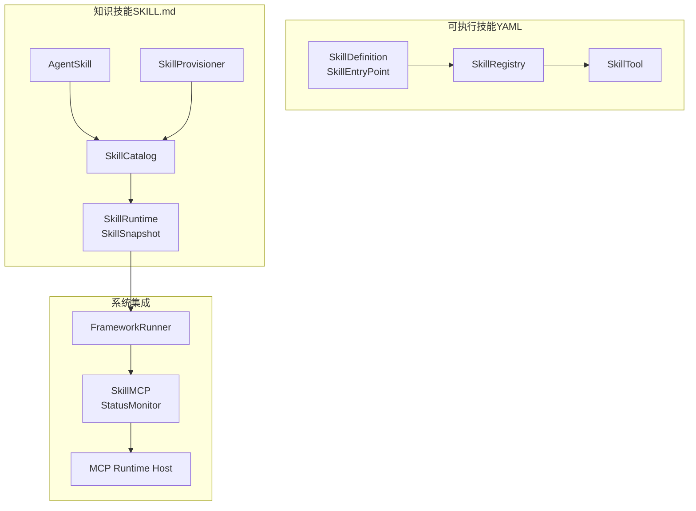
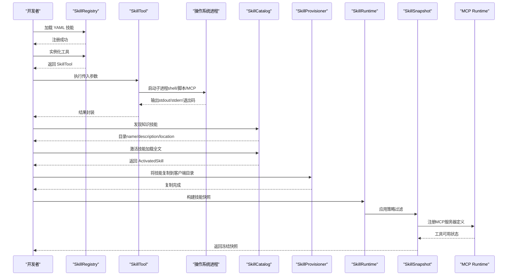
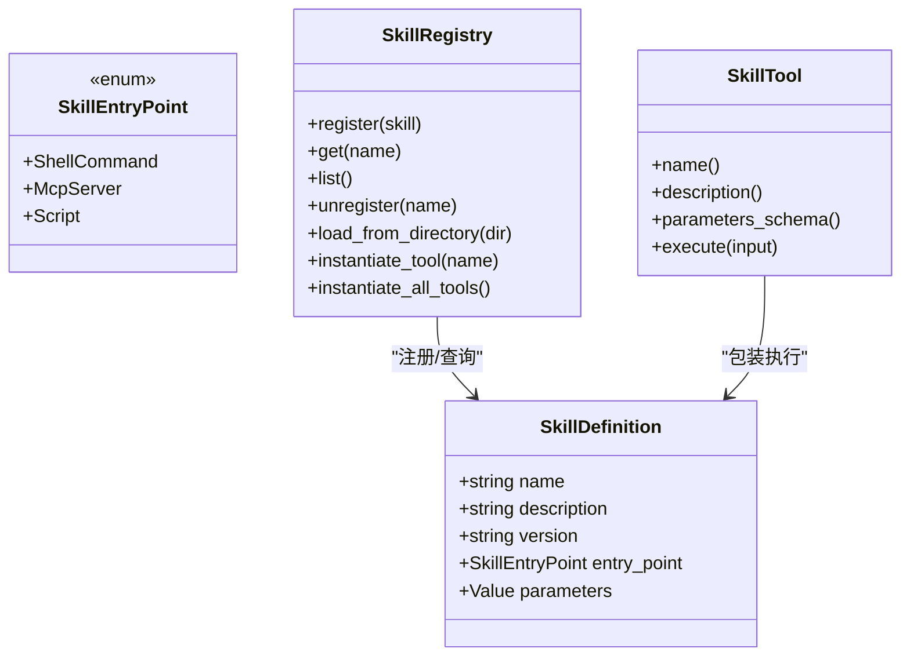
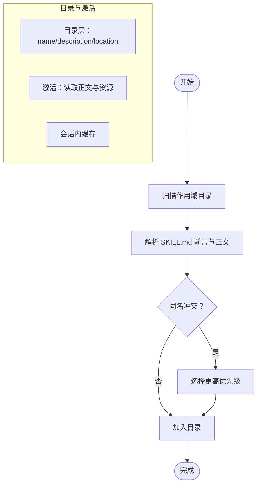
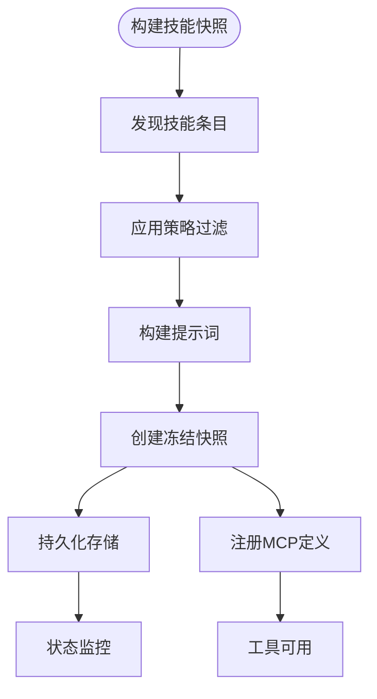
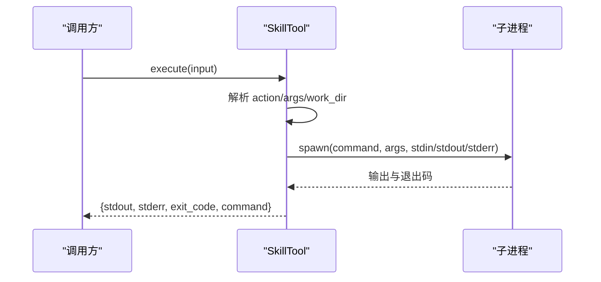
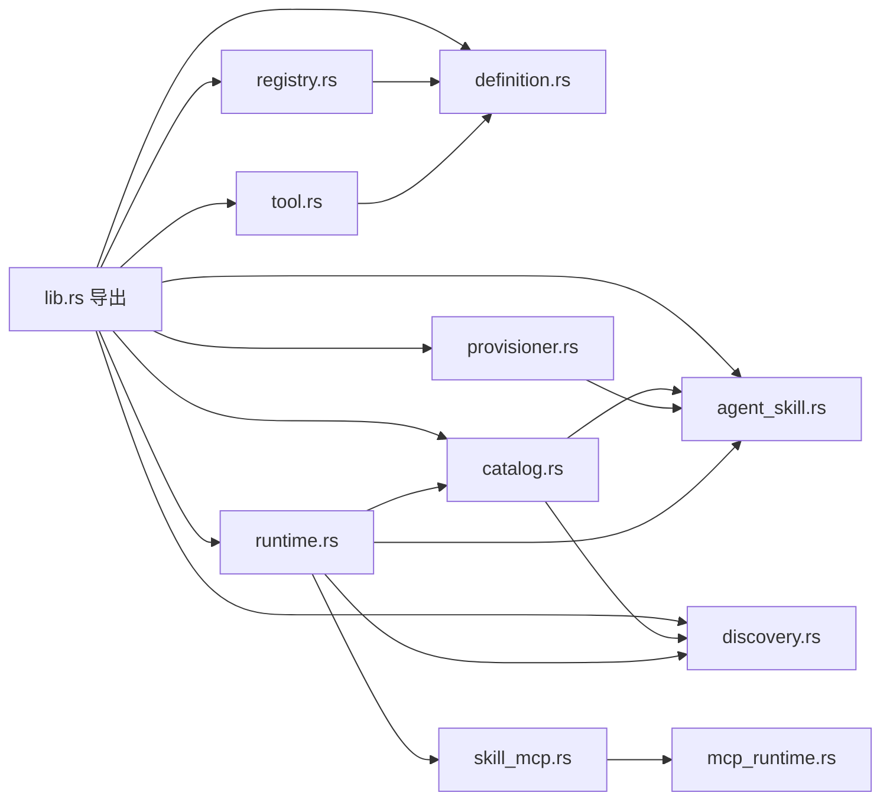

# 技能系统

<cite>
**本文引用的文件**
- [runtime.rs](file://macaca/crates/macaca-skill/src/runtime.rs)
- [lib.rs](file://macaca/crates/macaca-skill/src/lib.rs)
- [agent_skill.rs](file://macaca/crates/macaca-skill/src/agent_skill.rs)
- [discovery.rs](file://macaca/crates/macaca-skill/src/discovery.rs)
- [catalog.rs](file://macaca/crates/macaca-skill/src/catalog.rs)
- [registry.rs](file://macaca/crates/macaca-skill/src/registry.rs)
- [tool.rs](file://macaca/crates/macaca-skill/src/tool.rs)
- [provisioner.rs](file://macaca/crates/macaca-skill/src/provisioner.rs)
- [agent-skills-runtime.md](file://macaca/docs/agent-skills-runtime.md)
- [routes.rs](file://macaca/crates/macaca-web/src/routes.rs)
- [skill_mcp.rs](file://macaca/crates/macaca-web/src/skill_mcp.rs)
- [framework_runner.rs](file://macaca/crates/macaca-web/src/framework_runner.rs)
- [mcp_runtime.rs](file://macaca/crates/macaca-web/src/mcp_runtime.rs)
- [framework_toolkit.rs](file://macaca/crates/macaca-web/src/framework_toolkit.rs)
- [SKILL.md（golang）](file://macaca/examples/apps/fullstack-autodev/skills/golang/SKILL.md)
- [SKILL.md（openspec）](file://macaca/examples/apps/fullstack-autodev/skills/openspec/SKILL.md)
- [SKILL.md（shadcn-ui）](file://macaca/examples/apps/fullstack-autodev/skills/shadcn-ui/SKILL.md)
- [SKILL.md（figma-mcp）](file://macaca/examples/apps/fullstack-autodev/skills/figma-mcp/SKILL.md)
- [figma-mcp.yaml](file://macaca/examples/apps/fullstack-autodev/skills/figma-mcp.yaml)
- [openspec.yaml](file://macaca/examples/apps/fullstack-autodev/skills/openspec.yaml)
</cite>

## 更新摘要
**所做更改**
- 新增Figma MCP集成示例，展示MCP服务器在知识技能中的应用
- 更新系统级技能运行时架构，强化快照管理、策略控制和MCP集成
- 增强MCP服务器状态监控和工具注册机制
- 完善技能发现、过滤和观察性功能
- 新增会话级快照持久化和版本管理

## 目录
1. [简介](#简介)
2. [项目结构](#项目结构)
3. [核心组件](#核心组件)
4. [架构总览](#架构总览)
5. [详细组件分析](#详细组件分析)
6. [依赖关系分析](#依赖关系分析)
7. [性能考量](#性能考量)
8. [故障排查指南](#故障排查指南)
9. [结论](#结论)
10. [附录](#附录)

## 简介
本指南面向开发者，系统化讲解 Agent OS 的技能系统：如何定义与实现两类技能（可执行技能与知识技能），如何进行注册、动态加载、版本管理与依赖解析，以及如何实现技能发现与分类。文档还提供开发自定义技能的完整流程、测试方法、性能评估与安全注意事项，并总结扩展性设计与最佳实践。

**更新** 新架构从技能级运行时迁移到系统级技能运行时，支持技能快照管理、策略控制、MCP服务器集成和状态监控，特别强化了与新的MCP架构的深度集成。

## 项目结构
技能系统位于 macaca/crates/macaca-skill 模块中，采用"按职责分层"的组织方式：
- 定义层：可执行技能的定义与入口点（YAML）
- 注册层：可执行技能的注册表与工具包装
- 发现层：知识技能的扫描与优先级解析
- 目录层：知识技能的分级目录（三级披露）
- 提供层：将中央技能仓库复制到客户端特定目录
- 运行时层：系统级技能运行时，支持快照管理、策略控制和 MCP 集成
- 示例层：演示知识技能与可执行技能的实际用法，包括Figma MCP集成

**图表来源**
- [runtime.rs:110-150](file://macaca/crates/macaca-skill/src/runtime.rs#L110-L150)
- [lib.rs:39-42](file://macaca/crates/macaca-skill/src/lib.rs#L39-L42)
- [agent-skills-runtime.md:53-55](file://macaca/docs/agent-skills-runtime.md#L53-L55)

**章节来源**
- [lib.rs:1-43](file://macaca/crates/macaca-skill/src/lib.rs#L1-L43)

## 核心组件
- 可执行技能定义与入口点：支持 shell 命令、MCP 服务器、脚本三种入口类型；通过 YAML 文件声明，包含名称、描述、版本、参数模式等元数据。
- 可执行技能注册表：从目录批量加载 YAML，注册为技能条目，并可实例化为工具对象。
- 工具包装：将技能定义转换为统一的工具接口，负责参数校验、命令执行、超时控制与结果封装。
- 知识技能：以 SKILL.md 为根的目录结构，包含 YAML 前言与 Markdown 内容；支持三级披露：目录（轻量元信息）、激活（全文指令）、资源（脚本/资产）。
- 技能发现：按作用域优先级扫描多个目录，解决同名冲突，支持项目级、用户级与中央存储。
- 技能目录：维护已发现的知识技能，提供目录渲染、激活与缓存。
- 技能提供器：将中央技能仓库复制到客户端特定目录，便于兼容 Claude Code、Cursor 等。
- **新增** 系统级技能运行时：支持技能快照管理、策略控制、MCP 服务器集成和状态监控。
- **新增** 技能策略：支持允许列表、拒绝列表、环境变量覆盖和配置标志控制。
- **新增** Figma MCP集成：通过figma-developer-mcp服务器提供设计上下文提取能力。

**章节来源**
- [runtime.rs:29-73](file://macaca/crates/macaca-skill/src/runtime.rs#L29-L73)
- [agent_skill.rs:18-58](file://macaca/crates/macaca-skill/src/agent_skill.rs#L18-L58)
- [discovery.rs:33-46](file://macaca/crates/macaca-skill/src/discovery.rs#L33-L46)

## 架构总览
下图展示了两类技能在系统中的交互路径：可执行技能通过注册表与工具包装参与执行；知识技能通过发现、目录与提供器形成闭环，并通过系统级运行时进行快照管理和策略控制。新增的MCP集成使得知识技能能够提供可执行工具能力。

**图表来源**
- [runtime.rs:114-149](file://macaca/crates/macaca-skill/src/runtime.rs#L114-L149)
- [framework_runner.rs:486-543](file://macaca/crates/macaca-web/src/framework_runner.rs#L486-L543)
- [skill_mcp.rs:52-76](file://macaca/crates/macaca-web/src/skill_mcp.rs#L52-L76)

## 详细组件分析

### 可执行技能：定义与注册
- 定义模型
  - 名称、描述、版本、入口点、参数模式（JSON Schema）。版本默认 0.1.0，参数模式默认空对象。
  - 入口点类型：
    - shell：命令与参数列表
    - mcp：指向 MCP 服务器（通过 npx 等运行）
    - script：指定脚本路径与解释器
- 注册与实例化
  - 从目录扫描 *.yaml/*.yml，解析为 SkillDefinition 并注册。
  - 通过注册表实例化为 SkillTool，作为统一工具接口使用。
- 执行逻辑
  - 对 shell 与 script：构建参数（支持 action 与 args），设置工作目录，超时控制（默认 120 秒），捕获输出与退出码。
  - 对 mcp：直接报错提示应由 McpDriver 加载，避免误用。

**图表来源**
- [definition.rs:41-64](file://macaca/crates/macaca-skill/src/definition.rs#L41-L64)
- [definition.rs:14-38](file://macaca/crates/macaca-skill/src/definition.rs#L14-L38)
- [registry.rs:11-117](file://macaca/crates/macaca-skill/src/registry.rs#L11-L117)
- [tool.rs:12-58](file://macaca/crates/macaca-skill/src/tool.rs#L12-L58)

**章节来源**
- [definition.rs:10-64](file://macaca/crates/macaca-skill/src/definition.rs#L10-L64)
- [registry.rs:49-117](file://macaca/crates/macaca-skill/src/registry.rs#L49-L117)
- [tool.rs:41-123](file://macaca/crates/macaca-skill/src/tool.rs#L41-L123)

### 知识技能：发现、目录与提供
- 发现机制
  - 支持多作用域扫描：项目级（客户端特定与跨客户端）、用户级（客户端特定与跨客户端）、Agent OS 中央存储、额外目录。
  - 同名冲突按优先级（数值越小优先级越高）覆盖；跳过常见目录（如 .git、node_modules 等）。
- 目录与激活
  - 目录层仅加载轻量元信息（name/description/location），适合注入系统提示或工具描述。
  - 激活时读取 SKILL.md 正文与资源清单，支持缓存避免重复 IO。
- 提供机制
  - 将中央技能仓库中的技能目录复制到客户端特定目录，保留子目录与资源文件。
  - 支持按客户端名称批量或单个提供。

**图表来源**
- [discovery.rs:66-137](file://macaca/crates/macaca-skill/src/discovery.rs#L66-L137)
- [agent_skill.rs:35-103](file://macaca/crates/macaca-skill/src/agent_skill.rs#L35-L103)
- [catalog.rs:40-185](file://macaca/crates/macaca-skill/src/catalog.rs#L40-L185)
- [provisioner.rs:140-228](file://macaca/crates/macaca-skill/src/provisioner.rs#L140-L228)

**章节来源**
- [discovery.rs:55-226](file://macaca/crates/macaca-skill/src/discovery.rs#L55-L226)
- [agent_skill.rs:35-103](file://macaca/crates/macaca-skill/src/agent_skill.rs#L35-L103)
- [catalog.rs:40-185](file://macaca/crates/macaca-skill/src/catalog.rs#L40-L185)
- [provisioner.rs:54-250](file://macaca/crates/macaca-skill/src/provisioner.rs#L54-L250)

### 系统级技能运行时：快照管理与策略控制
- **新增** 快照管理
  - SkillSnapshot 冻结技能目录，包含可见技能、过滤原因、截断标记和紧凑模式。
  - 支持版本控制和持久化存储，便于会话重试和审计。
  - 会话级快照存储在框架会话存储中，支持resume/retry/review流程。
- **新增** 策略控制
  - SkillPolicy 支持允许列表和拒绝列表，基于技能名称和 key 进行匹配。
  - 环境变量覆盖和配置标志控制，支持动态策略调整。
- **新增** 过滤机制
  - 基于元数据的智能过滤：操作系统匹配、二进制依赖检查、环境变量验证、配置标志验证。
  - 提供详细的过滤诊断信息，便于问题排查。
- **新增** MCP 服务器集成
  - 自动探测技能中的 MCP 服务器配置，生成运行时定义。
  - 统一的 MCP 生命周期管理，支持状态监控和工具注册。
  - 通过兼容注册表解析MCP服务器，支持并发隔离和工具前缀。

**图表来源**
- [runtime.rs:114-149](file://macaca/crates/macaca-skill/src/runtime.rs#L114-L149)
- [runtime.rs:310-393](file://macaca/crates/macaca-skill/src/runtime.rs#L310-L393)
- [skill_mcp.rs:78-115](file://macaca/crates/macaca-web/src/skill_mcp.rs#L78-L115)

**章节来源**
- [runtime.rs:75-108](file://macaca/crates/macaca-skill/src/runtime.rs#L75-L108)
- [runtime.rs:29-73](file://macaca/crates/macaca-skill/src/runtime.rs#L29-L73)
- [runtime.rs:310-393](file://macaca/crates/macaca-skill/src/runtime.rs#L310-L393)

### 执行流程（可执行技能）

**图表来源**
- [tool.rs:41-123](file://macaca/crates/macaca-skill/src/tool.rs#L41-L123)

**章节来源**
- [tool.rs:41-123](file://macaca/crates/macaca-skill/src/tool.rs#L41-L123)

### Figma MCP集成：新增MCP服务器示例
- **新增** Figma MCP技能
  - 使用figma-developer-mcp服务器提供设计上下文提取能力
  - 支持文件元数据、节点树、样式、组件结构的提取
  - 通过FIGMA_API_KEY环境变量进行身份验证
  - 提供get_figma_data和download_figma_images两个主要工具
- **新增** MCP服务器配置
  - 在SKILL.md的metadata部分声明mcpServers配置
  - 支持stdio传输协议和工具前缀
  - 自动解析MCP服务器定义并注册到运行时
- **新增** 环境依赖管理
  - requires字段声明二进制依赖（npx）
  - requires.env声明必需环境变量（FIGMA_API_KEY）
  - install字段提供安装规范

**章节来源**
- [SKILL.md（figma-mcp）:1-68](file://macaca/examples/apps/fullstack-autodev/skills/figma-mcp/SKILL.md#L1-L68)
- [agent_skill.rs:462-484](file://macaca/crates/macaca-skill/src/agent_skill.rs#L462-L484)

## 依赖关系分析
- 模块导出
  - lib.rs 统一导出两类技能相关的核心类型与接口，便于上层使用。
- 关键依赖
  - serde/serde_json：用于序列化/反序列化定义与参数模式
  - tokio/fs/process：异步文件系统与子进程执行
  - tracing：日志与告警
  - macaca_proto/macaca_tools：错误类型与工具接口契约
  - **新增** macaca_web：系统集成交互，提供快照管理和 MCP 服务器状态监控
  - **新增** macaca_runtime_host：MCP运行时主机，提供MCP服务器生命周期管理

**图表来源**
- [lib.rs:17-43](file://macaca/crates/macaca-skill/src/lib.rs#L17-L43)
- [runtime.rs:10-11](file://macaca/crates/macaca-skill/src/runtime.rs#L10-L11)

**章节来源**
- [lib.rs:17-43](file://macaca/crates/macaca-skill/src/lib.rs#L17-L43)

## 性能考量
- 可执行技能
  - 子进程启动与 I/O：建议限制参数规模，避免超长命令行；必要时将大输入写入临时文件并通过 stdin 传递。
  - 超时控制：默认 120 秒，可根据任务复杂度调整；对可能阻塞的任务设置更短超时并返回明确错误。
  - 缓存与并发：对频繁调用的工具，结合上层缓存策略减少重复执行。
- 知识技能
  - 目录层成本极低（仅元信息），适合注入系统提示；激活与资源加载按需触发，避免一次性读取全部内容。
  - 提供器复制：批量复制时注意磁盘 IO，建议在后台线程执行并记录进度。
- **新增** 系统级运行时
  - 快照缓存：技能快照在会话内缓存，避免重复构建；支持持久化存储便于重试和审计。
  - 过滤优化：基于元数据的快速过滤，减少不必要的 IO 操作。
  - MCP 服务器预热：提前探测和启动 MCP 服务器，提升响应速度。
  - 会话级存储：快照存储在框架会话存储中，支持高效的数据访问。
- **新增** MCP集成性能
  - 兼容注册表缓存：避免重复解析MCP服务器配置。
  - 工具前缀优化：统一的工具命名空间减少冲突。
  - 并发隔离：支持MCP服务器的并发控制和资源隔离。
- I/O 与扫描
  - 发现扫描限制最大目录数与跳过常见目录，防止性能退化；对大仓库建议使用额外扫描目录（extra_dirs）隔离范围。

## 故障排查指南
- 可执行技能
  - 命令失败：检查命令是否存在、权限是否足够、工作目录是否正确；查看 stderr 与退出码。
  - 参数不合法：确认 parameters_schema 与调用输入一致；必要时在上层做参数预校验。
  - MCP 技能误用：SkillTool 不支持 MCP，应改由 McpDriver 加载。
- 知识技能
  - 发现失败：确认 SKILL.md 前言格式正确、包含 name 字段；检查目录权限与大小写。
  - 激活异常：确认 SKILL.md 存在且可读；检查资源目录结构。
  - 提供失败：确认中央仓库存在对应技能目录；检查目标客户端目录权限。
- **新增** 系统级运行时
  - 快照构建失败：检查技能文件完整性、元数据格式和权限设置。
  - 策略过滤问题：验证允许列表和拒绝列表配置，检查环境变量和配置标志。
  - MCP 服务器状态：监控服务器启动状态、依赖项检查和工具暴露情况。
- **新增** MCP集成故障排查
  - Figma API密钥：检查FIGMA_API_KEY环境变量设置，确保MCP服务器能够正常启动。
  - 二进制依赖：确认npx命令可用，MCP服务器可执行文件存在。
  - 工具注册失败：检查MCP服务器定义解析和工具前缀配置。
  - 并发隔离：验证MCP服务器的并发控制策略和资源隔离设置。
- 日志与告警
  - 使用 tracing 记录警告与错误，定位解析失败、扫描上限、同名覆盖等场景。
  - MCP状态监控：通过SkillMcpStatusState跟踪服务器状态变化。

**章节来源**
- [runtime.rs:340-393](file://macaca/crates/macaca-skill/src/runtime.rs#L340-L393)
- [skill_mcp.rs:76-113](file://macaca/crates/macaca-web/src/skill_mcp.rs#L76-L113)

## 结论
该技能系统通过清晰的分层设计实现了两类技能的统一管理：可执行技能以 YAML 为中心，具备灵活的入口点与强大的工具包装；知识技能遵循 agentskills.io 规范，提供三级披露与客户端适配能力。**新增的系统级运行时架构**进一步增强了技能管理能力，支持快照管理、策略控制、MCP 服务器集成和状态监控，为复杂工程提供了更加稳健和可扩展的技能管理解决方案。特别是新增的Figma MCP集成示例，展示了如何将外部MCP服务器无缝集成到技能系统中，为AI代理提供了强大的设计上下文提取能力。

## 附录

### 开发自定义技能（可执行技能）
- 创建 YAML 文件（例如 openspec.yaml），定义：
  - 名称、描述、版本
  - 入口点类型与参数（shell/script/mcp）
  - 参数模式（JSON Schema，含必填字段与枚举）
- 将 YAML 放置在可被 SkillRegistry 扫描的目录中
- 通过注册表加载并实例化为工具，按需执行

参考示例：
- [openspec.yaml:1-34](file://macaca/examples/apps/fullstack-autodev/skills/openspec.yaml#L1-L34)
- [figma-mcp.yaml:1-7](file://macaca/examples/apps/fullstack-autodev/skills/figma-mcp.yaml#L1-L7)

**章节来源**
- [openspec.yaml:1-34](file://macaca/examples/apps/fullstack-autodev/skills/openspec.yaml#L1-L34)
- [figma-mcp.yaml:1-7](file://macaca/examples/apps/fullstack-autodev/skills/figma-mcp.yaml#L1-L7)
- [registry.rs:49-99](file://macaca/crates/macaca-skill/src/registry.rs#L49-L99)

### 开发自定义技能（知识技能）
- 新建目录（例如 golang），在其中放置 SKILL.md，前言包含 name 与 description
- 在 SKILL.md 中编写指令正文与资源（脚本、配置等）
- 使用 SkillCatalog 发现并加载；需要时激活以获取全文与资源清单
- **新增** MCP服务器配置：在metadata部分添加mcpServers配置，声明MCP服务器定义

参考示例：
- [SKILL.md（golang）:1-183](file://macaca/examples/apps/fullstack-autodev/skills/golang/SKILL.md#L1-L183)
- [SKILL.md（openspec）:1-176](file://macaca/examples/apps/fullstack-autodev/skills/openspec/SKILL.md#L1-L176)
- [SKILL.md（shadcn-ui）:1-240](file://macaca/examples/apps/fullstack-autodev/skills/shadcn-ui/SKILL.md#L1-L240)
- [SKILL.md（figma-mcp）:1-68](file://macaca/examples/apps/fullstack-autodev/skills/figma-mcp/SKILL.md#L1-L68)

**章节来源**
- [agent_skill.rs:35-103](file://macaca/crates/macaca-skill/src/agent_skill.rs#L35-L103)
- [catalog.rs:60-151](file://macaca/crates/macaca-skill/src/catalog.rs#L60-L151)

### 技能注册机制与版本管理
- 可执行技能
  - 通过目录扫描注册；同名冲突按优先级覆盖；版本字段用于语义化标识。
- 知识技能
  - 通过发现扫描注册；同名冲突按优先级覆盖；目录即版本边界（不同目录视为不同版本或来源）。
- **新增** 系统级运行时
  - 技能快照版本控制，支持持久化存储和会话重试。
  - 策略配置版本管理，支持动态更新和回滚。
  - 会话级快照存储，支持resume/retry/review流程。
- 依赖解析
  - 可执行技能：入口点声明外部依赖（命令、解释器、MCP 服务）；上层需确保环境可用。
  - 知识技能：资源清单随技能目录提供，按需加载。
  - **新增** MCP服务器：通过兼容注册表解析，支持并发隔离和工具前缀。

**章节来源**
- [registry.rs:49-99](file://macaca/crates/macaca-skill/src/registry.rs#L49-L99)
- [discovery.rs:66-137](file://macaca/crates/macaca-skill/src/discovery.rs#L66-L137)
- [runtime.rs:100-108](file://macaca/crates/macaca-skill/src/runtime.rs#L100-L108)

### 技能发现系统（自动发现与手动注册）
- 自动发现
  - 按优先级扫描项目级、用户级与中央存储；支持额外目录；跳过常见目录。
- 手动注册
  - 可直接向 SkillCatalog 或 SkillRegistry 注册已知技能。
- **新增** 系统级运行时
  - 支持策略驱动的发现，根据允许列表和拒绝列表过滤技能。
  - 提供详细的发现诊断信息和性能指标。
  - 会话级快照缓存，避免重复构建。
- 技能分类
  - 可通过目录层级与命名约定进行逻辑分类；也可在 YAML/前言中添加标签字段（需扩展）。

**章节来源**
- [discovery.rs:55-137](file://macaca/crates/macaca-skill/src/discovery.rs#L55-L137)
- [catalog.rs:73-81](file://macaca/crates/macaca-skill/src/catalog.rs#L73-L81)
- [runtime.rs:310-393](file://macaca/crates/macaca-skill/src/runtime.rs#L310-L393)

### 执行逻辑与错误处理
- 可执行技能
  - 参数解析：支持 action、args、work_dir；超时控制与退出码封装。
  - 错误处理：命令不存在、spawn 失败、超时、MCP 入口误用等。
- 知识技能
  - 前言解析：缺失/格式错误、name 为空等。
  - 激活与资源：IO 错误、资源遍历异常等。
- **新增** 系统级运行时
  - 快照构建：发现失败、过滤失败、提示词构建失败等。
  - 策略应用：策略解析错误、环境变量缺失、配置标志不匹配等。
  - MCP 集成：服务器启动失败、工具注册失败、状态监控异常等。
  - **新增** Figma MCP：API密钥缺失、服务器不可用、工具列表失败等。
- **新增** MCP运行时错误
  - 依赖缺失：MCP服务器命令不存在或不可执行。
  - 并发隔离：隔离策略配置错误或资源竞争。
  - 工具前缀：工具命名冲突或前缀解析失败。

**章节来源**
- [tool.rs:41-123](file://macaca/crates/macaca-skill/src/tool.rs#L41-L123)
- [agent_skill.rs:140-190](file://macaca/crates/macaca-skill/src/agent_skill.rs#L140-L190)
- [runtime.rs:340-393](file://macaca/crates/macaca-skill/src/runtime.rs#L340-L393)

### 测试方法与性能评估
- 单元测试
  - YAML 解析往返、参数模式校验、目录扫描、激活与资源列表、提供器复制等。
- 集成测试
  - 通过临时目录模拟真实场景，验证发现、覆盖、同名冲突、资源复制等。
- **新增** 系统级运行时测试
  - 快照构建测试：验证策略过滤、提示词生成、快照持久化。
  - 策略控制测试：验证允许列表、拒绝列表、环境变量覆盖。
  - MCP 服务器测试：验证服务器探测、状态监控、工具注册。
  - **新增** Figma MCP测试：验证API密钥配置、服务器启动、工具可用性。
- 性能评估
  - 计时子进程执行耗时、统计目录扫描数量与耗时、评估目录层与激活层的 token 成本。
  - **新增** 快照缓存性能：评估快照构建时间、缓存命中率、持久化开销。
  - **新增** MCP集成性能：评估服务器启动时间、工具注册延迟、并发处理能力。
- **新增** 观测性测试
  - 技能状态API测试：验证可见技能、过滤技能及其原因的返回。
  - MCP状态监控：验证服务器状态报告和事件推送。
  - 会话级快照：验证快照版本控制和持久化存储。

**章节来源**
- [definition.rs:67-141](file://macaca/crates/macaca-skill/src/definition.rs#L67-L141)
- [registry.rs:125-267](file://macaca/crates/macaca-skill/src/registry.rs#L125-L267)
- [agent_skill.rs:202-304](file://macaca/crates/macaca-skill/src/agent_skill.rs#L202-L304)
- [discovery.rs:234-376](file://macaca/crates/macaca-skill/src/discovery.rs#L234-L376)
- [catalog.rs:193-283](file://macaca/crates/macaca-skill/src/catalog.rs#L193-L283)
- [provisioner.rs:291-469](file://macaca/crates/macaca-skill/src/provisioner.rs#L291-L469)
- [runtime.rs:532-646](file://macaca/crates/macaca-skill/src/runtime.rs#L532-L646)

### 安全考虑
- 可执行技能
  - 严格限制命令与参数来源，避免命令注入；对敏感操作增加二次确认。
  - 控制工作目录，避免越权访问；对长时间运行任务设置合理超时。
- 知识技能
  - 仅加载受信任来源的 SKILL.md；对资源路径进行白名单校验。
- **新增** 系统级运行时
  - 快照数据保护：敏感信息不渲染到提示词，环境变量和配置标志加密存储。
  - 策略安全：策略配置验证，防止恶意配置影响系统安全。
  - MCP 服务器隔离：统一的服务器生命周期管理，防止资源泄露。
- **新增** MCP集成安全
  - 环境变量保护：敏感环境变量（如API密钥）不渲染到提示词。
  - 依赖验证：MCP服务器命令存在性检查，防止未授权访问。
  - 工具前缀：统一的工具命名空间防止工具冲突。
  - 并发隔离：MCP服务器的资源隔离和访问控制。
- 提供器
  - 复制前校验源与目标路径合法性；避免覆盖关键系统文件。

**章节来源**
- [tool.rs:41-123](file://macaca/crates/macaca-skill/src/tool.rs#L41-L123)
- [provisioner.rs:140-228](file://macaca/crates/macaca-skill/src/provisioner.rs#L140-L228)
- [runtime.rs:340-393](file://macaca/crates/macaca-skill/src/runtime.rs#L340-L393)

### 扩展性设计与最佳实践
- 扩展性
  - 新增入口点类型：在 SkillEntryPoint 中扩展枚举并在 Tool 中实现执行分支。
  - 新增发现规则：在 discovery 中扩展扫描策略与过滤条件。
  - 新增客户端：在 provisioner 中注册客户端配置。
  - **新增** 新增运行时功能：扩展 SkillRuntimeOptions 和过滤条件。
  - **新增** 新增MCP服务器：通过兼容注册表支持新的MCP服务器类型。
- 最佳实践
  - YAML/前言格式标准化；参数模式最小化但完备。
  - 目录结构清晰，资源与脚本集中管理。
  - 分层设计：定义、注册、目录、提供解耦，便于替换与测试。
  - **新增** 策略驱动：使用 SkillPolicy 管理技能可见性和访问控制。
  - **新增** 快照管理：利用 SkillSnapshot 进行会话级别的技能状态管理。
  - **新增** MCP 集成：通过元数据配置 MCP 服务器，实现统一的工具管理。
  - **新增** Figma集成：提供完整的API密钥管理和服务器配置示例。
- **新增** MCP运行时最佳实践
  - 使用兼容注册表统一管理MCP服务器配置。
  - 实现并发隔离策略，确保MCP服务器的资源安全。
  - 提供工具前缀避免命名冲突。
  - 实施状态监控和事件日志记录。

**章节来源**
- [definition.rs:14-38](file://macaca/crates/macaca-skill/src/definition.rs#L14-L38)
- [discovery.rs:55-137](file://macaca/crates/macaca-skill/src/discovery.rs#L55-L137)
- [provisioner.rs:54-115](file://macaca/crates/macaca-skill/src/provisioner.rs#L54-L115)
- [runtime.rs:29-73](file://macaca/crates/macaca-skill/src/runtime.rs#L29-L73)

### 系统级运行时集成
- **新增** 技能状态 API
  - 提供 `/api/apps/{app_id}/skills` 端点，支持按代理人的技能状态查询。
  - 返回可见技能、过滤技能及其原因，便于监控和调试。
  - **新增** MCP服务器状态：包含服务器命令、参数、状态和暴露工具列表。
- **新增** MCP 服务器状态监控
  - 统一的 MCP 服务器状态报告，包括就绪、失败、依赖缺失等状态。
  - 支持 SSE 事件推送，实现实时状态更新。
  - **新增** 事件日志：记录MCP服务器生命周期事件和工具注册状态。
- **新增** 会话级快照管理
  - 技能快照在框架会话存储中持久化，支持会话重试和审计。
  - 快照版本控制，便于追踪技能变更历史。
  - **新增** 快照模块化：按agent_name组织快照存储，支持多代理并行。
- **新增** MCP运行时集成
  - **新增** 通过mcp_runtime.rs重新导出，支持非HTTP宿主使用。
  - **新增** framework_toolkit中集成技能MCP定义注册。
  - **新增** 会话级MCP状态跟踪和事件记录。

**章节来源**
- [routes.rs:591-630](file://macaca/crates/macaca-web/src/routes.rs#L591-L630)
- [skill_mcp.rs:76-113](file://macaca/crates/macaca-web/src/skill_mcp.rs#L76-L113)
- [framework_runner.rs:486-543](file://macaca/crates/macaca-web/src/framework_runner.rs#L486-L543)
- [mcp_runtime.rs:1-8](file://macaca/crates/macaca-web/src/mcp_runtime.rs#L1-L8)
- [framework_toolkit.rs:152-187](file://macaca/crates/macaca-web/src/framework_toolkit.rs#L152-L187)