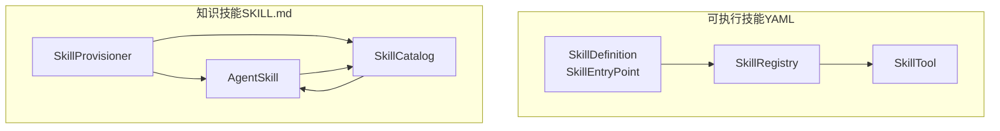
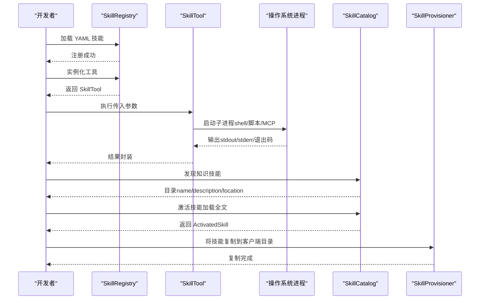
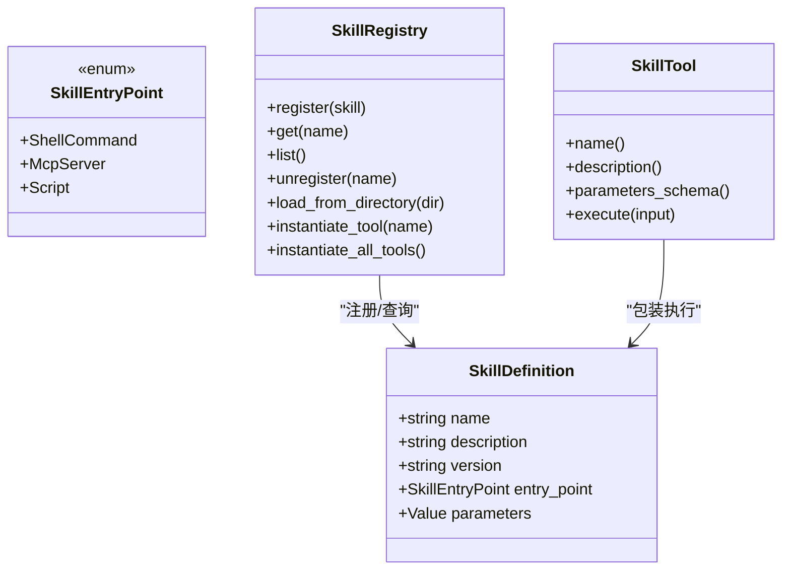
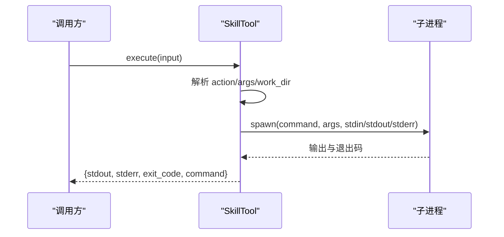
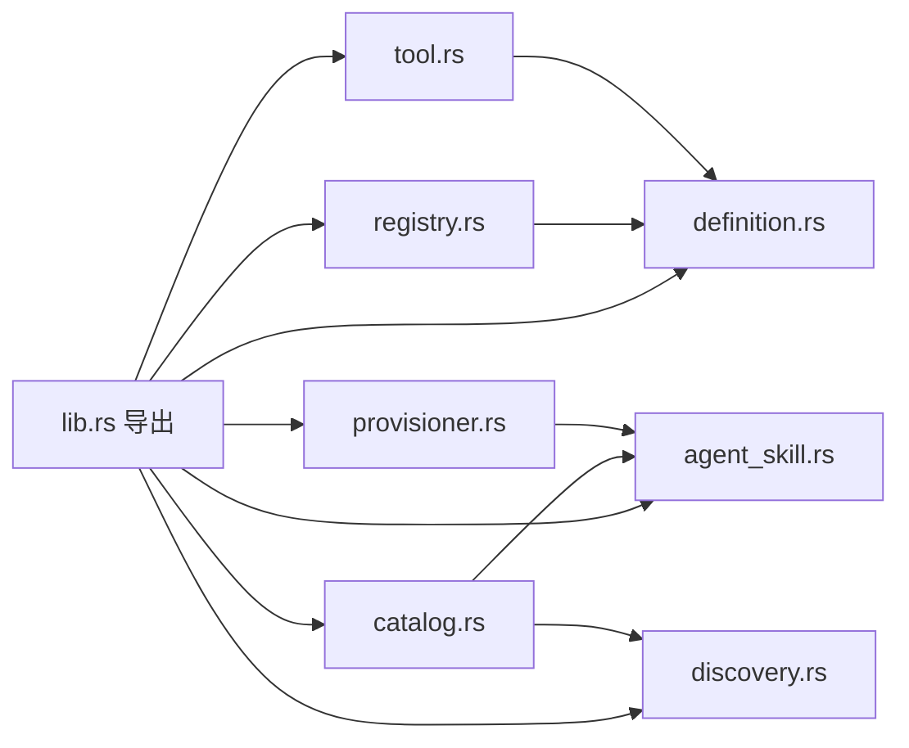

# 技能系统

<cite>
**本文引用的文件**
- [lib.rs](file://macaca/crates/macaca-skill/src/lib.rs)
- [definition.rs](file://macaca/crates/macaca-skill/src/definition.rs)
- [discovery.rs](file://macaca/crates/macaca-skill/src/discovery.rs)
- [registry.rs](file://macaca/crates/macaca-skill/src/registry.rs)
- [tool.rs](file://macaca/crates/macaca-skill/src/tool.rs)
- [agent_skill.rs](file://macaca/crates/macaca-skill/src/agent_skill.rs)
- [catalog.rs](file://macaca/crates/macaca-skill/src/catalog.rs)
- [provisioner.rs](file://macaca/crates/macaca-skill/src/provisioner.rs)
- [SKILL.md（golang）](file://macaca/examples/apps/fullstack-autodev/skills/golang/SKILL.md)
- [SKILL.md（openspec）](file://macaca/examples/apps/fullstack-autodev/skills/openspec/SKILL.md)
- [SKILL.md（shadcn-ui）](file://macaca/examples/apps/fullstack-autodev/skills/shadcn-ui/SKILL.md)
- [figma-mcp.yaml](file://macaca/examples/apps/fullstack-autodev/skills/figma-mcp.yaml)
- [openspec.yaml](file://macaca/examples/apps/fullstack-autodev/skills/openspec.yaml)
</cite>

## 目录
1. [简介](#简介)
2. [项目结构](#项目结构)
3. [核心组件](#核心组件)
4. [架构总览](#架构总览)
5. [详细组件分析](#详细组件分析)
6. [依赖关系分析](#依赖关系分析)
7. [性能考量](#性能考量)
8. [故障排查指南](#故障排查指南)
9. [结论](#结论)
10. [附录](#附录)

## 简介
本指南面向开发者，系统化讲解 Agent OS 的技能系统：如何定义与实现两类技能（可执行技能与知识技能），如何进行注册、动态加载、版本管理与依赖解析，以及如何实现技能发现与分类。文档还提供开发自定义技能的完整流程、测试方法、性能评估与安全注意事项，并总结扩展性设计与最佳实践。

## 项目结构
技能系统位于 macaca/crates/macaca-skill 模块中，采用“按职责分层”的组织方式：
- 定义层：可执行技能的定义与入口点（YAML）
- 注册层：可执行技能的注册表与工具包装
- 发现层：知识技能的扫描与优先级解析
- 目录层：知识技能的分级目录（三级披露）
- 提供层：将中央技能仓库复制到客户端特定目录
- 示例层：演示知识技能与可执行技能的实际用法

**图表来源**
- [definition.rs:10-64](file://macaca/crates/macaca-skill/src/definition.rs#L10-L64)
- [registry.rs:11-117](file://macaca/crates/macaca-skill/src/registry.rs#L11-L117)
- [tool.rs:12-58](file://macaca/crates/macaca-skill/src/tool.rs#L12-L58)
- [agent_skill.rs:17-103](file://macaca/crates/macaca-skill/src/agent_skill.rs#L17-L103)
- [catalog.rs:40-185](file://macaca/crates/macaca-skill/src/catalog.rs#L40-L185)
- [provisioner.rs:54-250](file://macaca/crates/macaca-skill/src/provisioner.rs#L54-L250)

**章节来源**
- [lib.rs:1-35](file://macaca/crates/macaca-skill/src/lib.rs#L1-L35)

## 核心组件
- 可执行技能定义与入口点：支持 shell 命令、MCP 服务器、脚本三种入口类型；通过 YAML 文件声明，包含名称、描述、版本、参数模式等元数据。
- 可执行技能注册表：从目录批量加载 YAML，注册为技能条目，并可实例化为工具对象。
- 工具包装：将技能定义转换为统一的工具接口，负责参数校验、命令执行、超时控制与结果封装。
- 知识技能：以 SKILL.md 为根的目录结构，包含 YAML 前言与 Markdown 内容；支持三级披露：目录（轻量元信息）、激活（全文指令）、资源（脚本/资产）。
- 技能发现：按作用域优先级扫描多个目录，解决同名冲突，支持项目级、用户级与中央存储。
- 技能目录：维护已发现的知识技能，提供目录渲染、激活与缓存。
- 技能提供器：将中央技能仓库复制到客户端特定目录，便于兼容 Claude Code、Cursor 等。

**章节来源**
- [definition.rs:10-64](file://macaca/crates/macaca-skill/src/definition.rs#L10-L64)
- [registry.rs:11-117](file://macaca/crates/macaca-skill/src/registry.rs#L11-L117)
- [tool.rs:12-58](file://macaca/crates/macaca-skill/src/tool.rs#L12-L58)
- [agent_skill.rs:17-103](file://macaca/crates/macaca-skill/src/agent_skill.rs#L17-L103)
- [discovery.rs:55-137](file://macaca/crates/macaca-skill/src/discovery.rs#L55-L137)
- [catalog.rs:40-185](file://macaca/crates/macaca-skill/src/catalog.rs#L40-L185)
- [provisioner.rs:54-250](file://macaca/crates/macaca-skill/src/provisioner.rs#L54-L250)

## 架构总览
下图展示了两类技能在系统中的交互路径：可执行技能通过注册表与工具包装参与执行；知识技能通过发现、目录与提供器形成闭环。

**图表来源**
- [registry.rs:54-117](file://macaca/crates/macaca-skill/src/registry.rs#L54-L117)
- [tool.rs:41-123](file://macaca/crates/macaca-skill/src/tool.rs#L41-L123)
- [catalog.rs:60-151](file://macaca/crates/macaca-skill/src/catalog.rs#L60-L151)
- [provisioner.rs:140-228](file://macaca/crates/macaca-skill/src/provisioner.rs#L140-L228)

## 详细组件分析

### 可执行技能：定义与注册
- 定义模型
  - 名称、描述、版本、入口点、参数模式（JSON Schema）。版本默认 0.1.0，参数模式默认空对象。
  - 入口点类型：
    - shell：命令与参数列表
    - mcp：指向 MCP 服务器（通过 npx 等运行）
    - script：指定脚本路径与解释器
- 注册与实例化
  - 从目录扫描 *.yaml/*.yml，解析为 SkillDefinition 并注册。
  - 通过注册表实例化为 SkillTool，作为统一工具接口使用。
- 执行逻辑
  - 对 shell 与 script：构建参数（支持 action 与 args），设置工作目录，超时控制（默认 120 秒），捕获输出与退出码。
  - 对 mcp：直接报错提示应由 McpDriver 加载，避免误用。

**图表来源**
- [definition.rs:41-64](file://macaca/crates/macaca-skill/src/definition.rs#L41-L64)
- [definition.rs:14-38](file://macaca/crates/macaca-skill/src/definition.rs#L14-L38)
- [registry.rs:11-117](file://macaca/crates/macaca-skill/src/registry.rs#L11-L117)
- [tool.rs:12-58](file://macaca/crates/macaca-skill/src/tool.rs#L12-L58)

**章节来源**
- [definition.rs:10-64](file://macaca/crates/macaca-skill/src/definition.rs#L10-L64)
- [registry.rs:49-117](file://macaca/crates/macaca-skill/src/registry.rs#L49-L117)
- [tool.rs:41-123](file://macaca/crates/macaca-skill/src/tool.rs#L41-L123)

### 知识技能：发现、目录与提供
- 发现机制
  - 支持多作用域扫描：项目级（客户端特定与跨客户端）、用户级（客户端特定与跨客户端）、Agent OS 中央存储、额外目录。
  - 同名冲突按优先级（数值越小优先级越高）覆盖；跳过常见目录（如 .git、node_modules 等）。
- 目录与激活
  - 目录层仅加载轻量元信息（name/description/location），适合注入系统提示或工具描述。
  - 激活时读取 SKILL.md 正文与资源清单，支持缓存避免重复 IO。
- 提供机制
  - 将中央技能仓库中的技能目录复制到客户端特定目录，保留子目录与资源文件。
  - 支持按客户端名称批量或单个提供。

**图表来源**
- [discovery.rs:66-137](file://macaca/crates/macaca-skill/src/discovery.rs#L66-L137)
- [agent_skill.rs:35-103](file://macaca/crates/macaca-skill/src/agent_skill.rs#L35-L103)
- [catalog.rs:40-185](file://macaca/crates/macaca-skill/src/catalog.rs#L40-L185)
- [provisioner.rs:140-228](file://macaca/crates/macaca-skill/src/provisioner.rs#L140-L228)

**章节来源**
- [discovery.rs:55-226](file://macaca/crates/macaca-skill/src/discovery.rs#L55-L226)
- [agent_skill.rs:35-103](file://macaca/crates/macaca-skill/src/agent_skill.rs#L35-L103)
- [catalog.rs:40-185](file://macaca/crates/macaca-skill/src/catalog.rs#L40-L185)
- [provisioner.rs:54-250](file://macaca/crates/macaca-skill/src/provisioner.rs#L54-L250)

### 执行流程（可执行技能）

**图表来源**
- [tool.rs:41-123](file://macaca/crates/macaca-skill/src/tool.rs#L41-L123)

**章节来源**
- [tool.rs:41-123](file://macaca/crates/macaca-skill/src/tool.rs#L41-L123)

## 依赖关系分析
- 模块导出
  - lib.rs 统一导出两类技能相关的核心类型与接口，便于上层使用。
- 关键依赖
  - serde/serde_json：用于序列化/反序列化定义与参数模式
  - tokio/fs/process：异步文件系统与子进程执行
  - tracing：日志与告警
  - macaca_proto/macaca_tools：错误类型与工具接口契约

**图表来源**
- [lib.rs:17-35](file://macaca/crates/macaca-skill/src/lib.rs#L17-L35)
- [definition.rs:10-11](file://macaca/crates/macaca-skill/src/definition.rs#L10-L11)
- [registry.rs:3-9](file://macaca/crates/macaca-skill/src/registry.rs#L3-L9)
- [tool.rs:3-8](file://macaca/crates/macaca-skill/src/tool.rs#L3-L8)
- [agent_skill.rs:11-15](file://macaca/crates/macaca-skill/src/agent_skill.rs#L11-L15)
- [catalog.rs:11-17](file://macaca/crates/macaca-skill/src/catalog.rs#L11-L17)
- [discovery.rs:8-11](file://macaca/crates/macaca-skill/src/discovery.rs#L8-L11)
- [provisioner.rs:8-11](file://macaca/crates/macaca-skill/src/provisioner.rs#L8-L11)

**章节来源**
- [lib.rs:17-35](file://macaca/crates/macaca-skill/src/lib.rs#L17-L35)

## 性能考量
- 可执行技能
  - 子进程启动与 I/O：建议限制参数规模，避免超长命令行；必要时将大输入写入临时文件并通过 stdin 传递。
  - 超时控制：默认 120 秒，可根据任务复杂度调整；对可能阻塞的任务设置更短超时并返回明确错误。
  - 缓存与并发：对频繁调用的工具，结合上层缓存策略减少重复执行。
- 知识技能
  - 目录层成本极低（仅元信息），适合注入系统提示；激活与资源加载按需触发，避免一次性读取全部内容。
  - 提供器复制：批量复制时注意磁盘 IO，建议在后台线程执行并记录进度。
- I/O 与扫描
  - 发现扫描限制最大目录数与跳过常见目录，防止性能退化；对大仓库建议使用额外扫描目录（extra_dirs）隔离范围。

[本节为通用指导，无需具体文件分析]

## 故障排查指南
- 可执行技能
  - 命令失败：检查命令是否存在、权限是否足够、工作目录是否正确；查看 stderr 与退出码。
  - 参数不合法：确认 parameters_schema 与调用输入一致；必要时在上层做参数预校验。
  - MCP 技能误用：SkillTool 不支持 MCP，应改由 McpDriver 加载。
- 知识技能
  - 发现失败：确认 SKILL.md 前言格式正确、包含 name 字段；检查目录权限与大小写。
  - 激活异常：确认 SKILL.md 存在且可读；检查资源目录结构。
  - 提供失败：确认中央仓库存在对应技能目录；检查目标客户端目录权限。
- 日志与告警
  - 使用 tracing 记录警告与错误，定位解析失败、扫描上限、同名覆盖等场景。

**章节来源**
- [tool.rs:41-123](file://macaca/crates/macaca-skill/src/tool.rs#L41-L123)
- [agent_skill.rs:140-190](file://macaca/crates/macaca-skill/src/agent_skill.rs#L140-L190)
- [discovery.rs:140-188](file://macaca/crates/macaca-skill/src/discovery.rs#L140-L188)
- [provisioner.rs:140-228](file://macaca/crates/macaca-skill/src/provisioner.rs#L140-L228)

## 结论
该技能系统通过清晰的分层设计实现了两类技能的统一管理：可执行技能以 YAML 为中心，具备灵活的入口点与强大的工具包装；知识技能遵循 agentskills.io 规范，提供三级披露与客户端适配能力。系统在发现、注册、目录与提供方面均提供了稳健的实现与扩展点，适合在复杂工程中落地应用。

[本节为总结，无需具体文件分析]

## 附录

### 开发自定义技能（可执行技能）
- 创建 YAML 文件（例如 openspec.yaml），定义：
  - 名称、描述、版本
  - 入口点类型与参数（shell/script/mcp）
  - 参数模式（JSON Schema，含必填字段与枚举）
- 将 YAML 放置在可被 SkillRegistry 扫描的目录中
- 通过注册表加载并实例化为工具，按需执行

参考示例：
- [openspec.yaml:1-34](file://macaca/examples/apps/fullstack-autodev/skills/openspec.yaml#L1-L34)
- [figma-mcp.yaml:1-7](file://macaca/examples/apps/fullstack-autodev/skills/figma-mcp.yaml#L1-L7)

**章节来源**
- [openspec.yaml:1-34](file://macaca/examples/apps/fullstack-autodev/skills/openspec.yaml#L1-L34)
- [figma-mcp.yaml:1-7](file://macaca/examples/apps/fullstack-autodev/skills/figma-mcp.yaml#L1-L7)
- [registry.rs:49-99](file://macaca/crates/macaca-skill/src/registry.rs#L49-L99)

### 开发自定义技能（知识技能）
- 新建目录（例如 golang），在其中放置 SKILL.md，前言包含 name 与 description
- 在 SKILL.md 中编写指令正文与资源（脚本、配置等）
- 使用 SkillCatalog 发现并加载；需要时激活以获取全文与资源清单

参考示例：
- [SKILL.md（golang）:1-183](file://macaca/examples/apps/fullstack-autodev/skills/golang/SKILL.md#L1-L183)
- [SKILL.md（openspec）:1-176](file://macaca/examples/apps/fullstack-autodev/skills/openspec/SKILL.md#L1-L176)
- [SKILL.md（shadcn-ui）:1-240](file://macaca/examples/apps/fullstack-autodev/skills/shadcn-ui/SKILL.md#L1-L240)

**章节来源**
- [agent_skill.rs:35-103](file://macaca/crates/macaca-skill/src/agent_skill.rs#L35-L103)
- [catalog.rs:60-151](file://macaca/crates/macaca-skill/src/catalog.rs#L60-L151)

### 技能注册机制与版本管理
- 可执行技能
  - 通过目录扫描注册；同名冲突按优先级覆盖；版本字段用于语义化标识。
- 知识技能
  - 通过发现扫描注册；同名冲突按优先级覆盖；目录即版本边界（不同目录视为不同版本或来源）。
- 依赖解析
  - 可执行技能：入口点声明外部依赖（命令、解释器、MCP 服务）；上层需确保环境可用。
  - 知识技能：资源清单随技能目录提供，按需加载。

**章节来源**
- [registry.rs:49-99](file://macaca/crates/macaca-skill/src/registry.rs#L49-L99)
- [discovery.rs:66-137](file://macaca/crates/macaca-skill/src/discovery.rs#L66-L137)
- [provisioner.rs:140-228](file://macaca/crates/macaca-skill/src/provisioner.rs#L140-L228)

### 技能发现系统（自动发现与手动注册）
- 自动发现
  - 按优先级扫描项目级、用户级与中央存储；支持额外目录；跳过常见目录。
- 手动注册
  - 可直接向 SkillCatalog 或 SkillRegistry 注册已知技能。
- 技能分类
  - 可通过目录层级与命名约定进行逻辑分类；也可在 YAML/前言中添加标签字段（需扩展）。

**章节来源**
- [discovery.rs:55-137](file://macaca/crates/macaca-skill/src/discovery.rs#L55-L137)
- [catalog.rs:73-81](file://macaca/crates/macaca-skill/src/catalog.rs#L73-L81)

### 执行逻辑与错误处理
- 可执行技能
  - 参数解析：支持 action、args、work_dir；超时控制与退出码封装。
  - 错误处理：命令不存在、spawn 失败、超时、MCP 入口误用等。
- 知识技能
  - 前言解析：缺失/格式错误、name 为空等。
  - 激活与资源：IO 错误、资源遍历异常等。

**章节来源**
- [tool.rs:41-123](file://macaca/crates/macaca-skill/src/tool.rs#L41-L123)
- [agent_skill.rs:140-190](file://macaca/crates/macaca-skill/src/agent_skill.rs#L140-L190)

### 测试方法与性能评估
- 单元测试
  - YAML 解析往返、参数模式校验、目录扫描、激活与资源列表、提供器复制等。
- 集成测试
  - 通过临时目录模拟真实场景，验证发现、覆盖、同名冲突、资源复制等。
- 性能评估
  - 计时子进程执行耗时、统计目录扫描数量与耗时、评估目录层与激活层的 token 成本。

**章节来源**
- [definition.rs:67-141](file://macaca/crates/macaca-skill/src/definition.rs#L67-L141)
- [registry.rs:125-267](file://macaca/crates/macaca-skill/src/registry.rs#L125-L267)
- [agent_skill.rs:202-304](file://macaca/crates/macaca-skill/src/agent_skill.rs#L202-L304)
- [discovery.rs:234-376](file://macaca/crates/macaca-skill/src/discovery.rs#L234-L376)
- [catalog.rs:193-283](file://macaca/crates/macaca-skill/src/catalog.rs#L193-L283)
- [provisioner.rs:291-469](file://macaca/crates/macaca-skill/src/provisioner.rs#L291-L469)

### 安全考虑
- 可执行技能
  - 严格限制命令与参数来源，避免命令注入；对敏感操作增加二次确认。
  - 控制工作目录，避免越权访问；对长时间运行任务设置合理超时。
- 知识技能
  - 仅加载受信任来源的 SKILL.md；对资源路径进行白名单校验。
- 提供器
  - 复制前校验源与目标路径合法性；避免覆盖关键系统文件。

**章节来源**
- [tool.rs:41-123](file://macaca/crates/macaca-skill/src/tool.rs#L41-L123)
- [provisioner.rs:140-228](file://macaca/crates/macaca-skill/src/provisioner.rs#L140-L228)

### 扩展性设计与最佳实践
- 扩展性
  - 新增入口点类型：在 SkillEntryPoint 中扩展枚举并在 Tool 中实现执行分支。
  - 新增发现规则：在 discovery 中扩展扫描策略与过滤条件。
  - 新增客户端：在 provisioner 中注册客户端配置。
- 最佳实践
  - YAML/前言格式标准化；参数模式最小化但完备。
  - 目录结构清晰，资源与脚本集中管理。
  - 分层设计：定义、注册、目录、提供解耦，便于替换与测试。

**章节来源**
- [definition.rs:14-38](file://macaca/crates/macaca-skill/src/definition.rs#L14-L38)
- [discovery.rs:55-137](file://macaca/crates/macaca-skill/src/discovery.rs#L55-L137)
- [provisioner.rs:54-115](file://macaca/crates/macaca-skill/src/provisioner.rs#L54-L115)