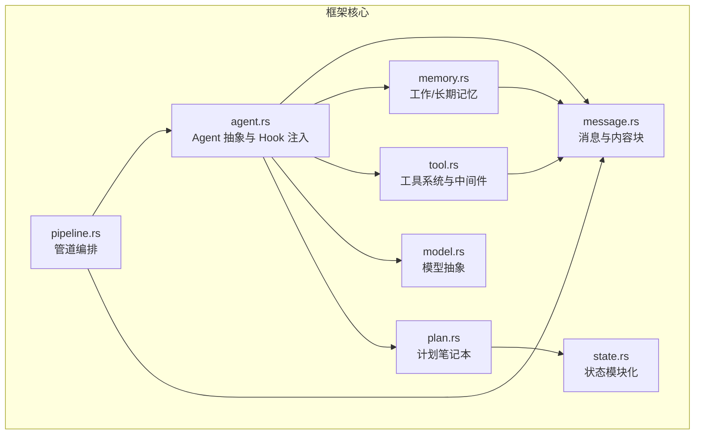
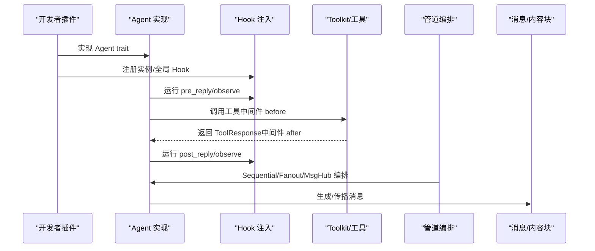
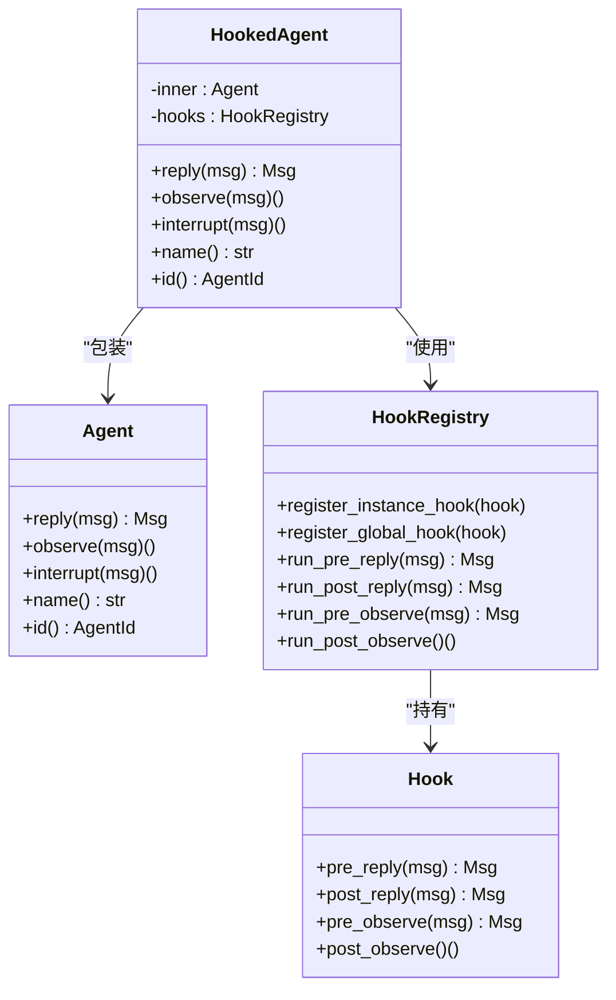
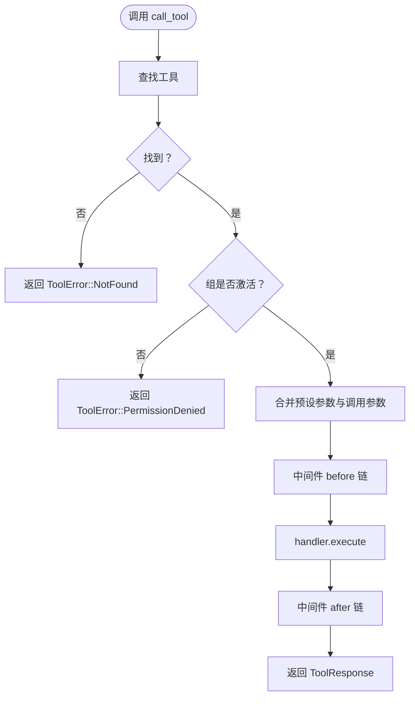
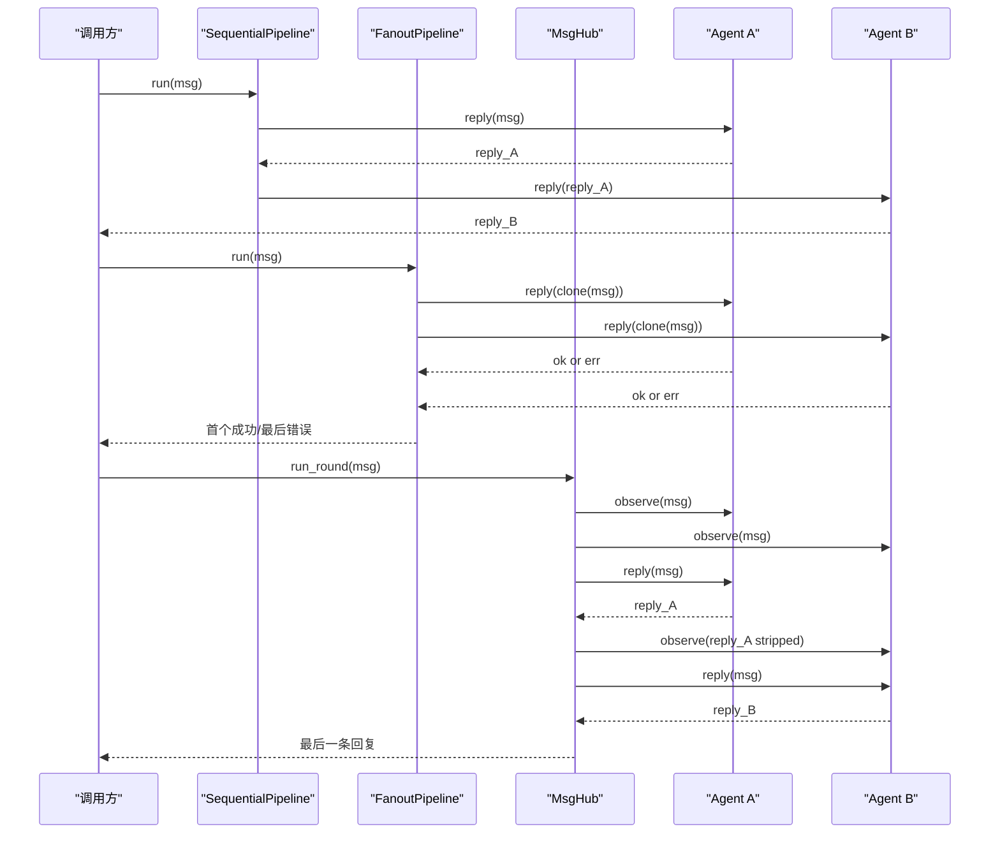
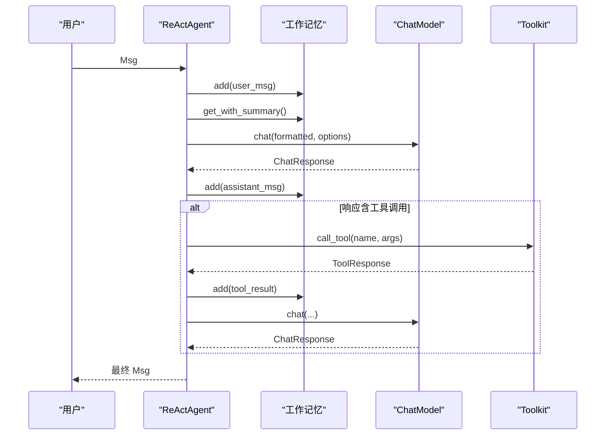
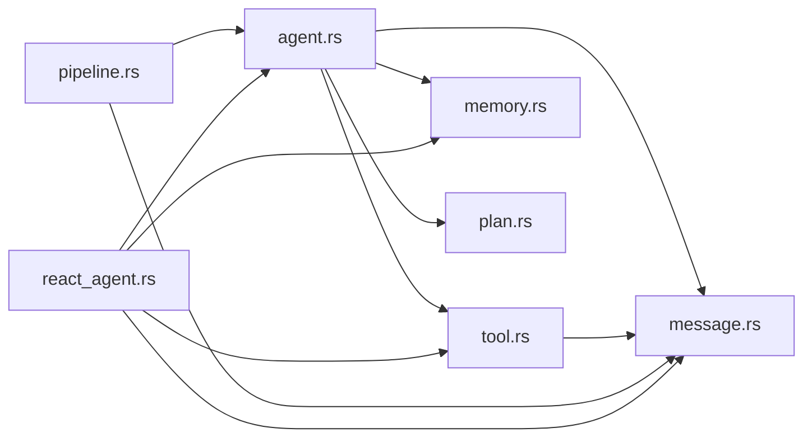

# 插件开发

<cite>
**本文引用的文件**
- [lib.rs](file://macaca/crates/macaca-framework/src/lib.rs)
- [agent.rs](file://macaca/crates/macaca-framework/src/agent.rs)
- [tool.rs](file://macaca/crates/macaca-framework/src/tool.rs)
- [pipeline.rs](file://macaca/crates/macaca-framework/src/pipeline.rs)
- [state.rs](file://macaca/crates/macaca-framework/src/state.rs)
- [react_agent.rs](file://macaca/crates/macaca-framework/src/react_agent.rs)
- [message.rs](file://macaca/crates/macaca-framework/src/message.rs)
- [model.rs](file://macaca/crates/macaca-framework/src/model.rs)
- [memory.rs](file://macaca/crates/macaca-framework/src/memory.rs)
- [plan.rs](file://macaca/crates/macaca-framework/src/plan.rs)
</cite>

## 目录
1. [简介](#简介)
2. [项目结构](#项目结构)
3. [核心组件](#核心组件)
4. [架构总览](#架构总览)
5. [详细组件分析](#详细组件分析)
6. [依赖关系分析](#依赖关系分析)
7. [性能考虑](#性能考虑)
8. [故障排查指南](#故障排查指南)
9. [结论](#结论)
10. [附录：示例与最佳实践](#附录示例与最佳实践)

## 简介
本指南面向希望在 Agent 框架中开发“插件”的工程师，系统讲解以下主题：
- Agent 抽象与 Hook 注入机制
- 工具系统（工具接口、注册、中间件）
- 管道编排（Sequential、Fanout、MsgHub）
- 插件生命周期管理与状态持久化
- 自定义插件开发步骤、配置管理与错误处理
- 测试方法、调试技巧与性能优化建议

目标是帮助你从零开始实现一个可复用、可测试、可扩展的插件模块，并将其安全地集成到 Agent 的消息流、工具链与多智能体编排中。

## 项目结构
该框架以模块化方式组织，核心模块如下：
- agent：Agent 抽象、Hook 注入、静态全局 Hook
- tool：工具接口、工具组、中间件、工具注册与执行
- pipeline：管道编排（顺序、并行分流、消息枢纽）
- message：统一消息类型与内容块
- model：模型抽象与响应
- memory：工作记忆与长期记忆
- plan：计划笔记本（子任务分解与进度跟踪）
- state：状态模块化序列化
- react_agent：ReAct 循环（推理-行动-观察）

图表来源
- [lib.rs:1-32](file://macaca/crates/macaca-framework/src/lib.rs#L1-L32)
- [agent.rs:1-673](file://macaca/crates/macaca-framework/src/agent.rs#L1-L673)
- [tool.rs:1-996](file://macaca/crates/macaca-framework/src/tool.rs#L1-L996)
- [pipeline.rs:1-722](file://macaca/crates/macaca-framework/src/pipeline.rs#L1-L722)
- [message.rs:1-622](file://macaca/crates/macaca-framework/src/message.rs#L1-L622)
- [model.rs:1-270](file://macaca/crates/macaca-framework/src/model.rs#L1-L270)
- [memory.rs:1-1275](file://macaca/crates/macaca-framework/src/memory.rs#L1-L1275)
- [plan.rs:1-911](file://macaca/crates/macaca-framework/src/plan.rs#L1-L911)
- [state.rs:1-257](file://macaca/crates/macaca-framework/src/state.rs#L1-L257)

章节来源
- [lib.rs:1-32](file://macaca/crates/macaca-framework/src/lib.rs#L1-L32)

## 核心组件
- Agent 抽象与 Hook 注入
  - Agent trait 定义了 reply/observe/interrupt/name/id 等核心能力
  - Hook trait 提供 pre/post 四个钩子点，支持实例级与全局级 Hook
  - HookedAgent 透明包装器，按序运行实例→全局→静态全局的 Hook 链
  - 全局静态 Hook 通过进程级注册表自动应用于所有 HookedAgent 实例
- 工具系统
  - ToolHandler：每个工具必须实现 execute/name/description/schema
  - ToolMiddleware：跨切面逻辑（日志、限流、参数注入等），before/after 钩子
  - Toolkit：集中式注册中心，支持工具组、预设参数、中间件链、定义导出
- 管道编排
  - SequentialPipeline：串行流水线，前一 Agent 输出作为下一输入
  - FanoutPipeline：广播到多个 Agent，支持并发或顺序模式，返回首个成功结果
  - MsgHub：多智能体圆桌会议，每轮先 observe 初始消息，再依次 reply，并将非私有内容广播给其他参与者
- 状态模块化
  - StateModule：组件状态序列化/反序列化接口，支持复合状态字典
  - 用于 Agent 内部的 WorkingMemory、Toolkit、PlanNotebook 等的持久化

章节来源
- [agent.rs:38-67](file://macaca/crates/macaca-framework/src/agent.rs#L38-L67)
- [agent.rs:77-97](file://macaca/crates/macaca-framework/src/agent.rs#L77-L97)
- [agent.rs:100-172](file://macaca/crates/macaca-framework/src/agent.rs#L100-L172)
- [agent.rs:241-310](file://macaca/crates/macaca-framework/src/agent.rs#L241-L310)
- [tool.rs:110-122](file://macaca/crates/macaca-framework/src/tool.rs#L110-L122)
- [tool.rs:133-143](file://macaca/crates/macaca-framework/src/tool.rs#L133-L143)
- [tool.rs:197-402](file://macaca/crates/macaca-framework/src/tool.rs#L197-L402)
- [pipeline.rs:22-25](file://macaca/crates/macaca-framework/src/pipeline.rs#L22-L25)
- [pipeline.rs:34-54](file://macaca/crates/macaca-framework/src/pipeline.rs#L34-L54)
- [pipeline.rs:67-122](file://macaca/crates/macaca-framework/src/pipeline.rs#L67-L122)
- [pipeline.rs:137-202](file://macaca/crates/macaca-framework/src/pipeline.rs#L137-L202)
- [state.rs:47-69](file://macaca/crates/macaca-framework/src/state.rs#L47-L69)
- [state.rs:103-122](file://macaca/crates/macaca-framework/src/state.rs#L103-L122)

## 架构总览
下图展示了插件开发的关键交互路径：Agent 通过 Hook 注入扩展行为；工具通过 Toolkit 统一注册与中间件链；管道将多个 Agent 组合为复杂流程；消息与内容块贯穿全链路。

图表来源
- [agent.rs:268-310](file://macaca/crates/macaca-framework/src/agent.rs#L268-L310)
- [tool.rs:318-371](file://macaca/crates/macaca-framework/src/tool.rs#L318-L371)
- [pipeline.rs:46-54](file://macaca/crates/macaca-framework/src/pipeline.rs#L46-L54)
- [message.rs:238-335](file://macaca/crates/macaca-framework/src/message.rs#L238-L335)

## 详细组件分析

### Agent 抽象与 Hook 注入
- 设计要点
  - Agent trait 最小可用接口：reply/observe/interrupt/name/id
  - Hook trait 提供 pre/post 对 reply/observe 的前后拦截
  - HookedAgent 包装任意 Agent，按“实例→全局→静态全局”顺序执行 Hook
  - 全局静态 Hook 通过进程级锁态向量注册，影响所有 HookedAgent
- 生命周期
  - 实例 Hook：仅对当前 HookedAgent 生效
  - 全局 Hook：对同一 HookRegistry 共享的 HookedAgent 生效
  - 静态全局 Hook：进程级生效，适合类级别（元类）效果
- 错误传播
  - Hook 返回错误会直接中断后续链路
  - HookedAgent 在 pre/post 阶段均可能抛错，需谨慎设计

图表来源
- [agent.rs:38-67](file://macaca/crates/macaca-framework/src/agent.rs#L38-L67)
- [agent.rs:77-97](file://macaca/crates/macaca-framework/src/agent.rs#L77-L97)
- [agent.rs:100-172](file://macaca/crates/macaca-framework/src/agent.rs#L100-L172)
- [agent.rs:241-310](file://macaca/crates/macaca-framework/src/agent.rs#L241-L310)

章节来源
- [agent.rs:38-67](file://macaca/crates/macaca-framework/src/agent.rs#L38-L67)
- [agent.rs:77-97](file://macaca/crates/macaca-framework/src/agent.rs#L77-L97)
- [agent.rs:100-172](file://macaca/crates/macaca-framework/src/agent.rs#L100-L172)
- [agent.rs:182-231](file://macaca/crates/macaca-framework/src/agent.rs#L182-L231)
- [agent.rs:241-310](file://macaca/crates/macaca-framework/src/agent.rs#L241-L310)

### 工具系统：接口、注册与中间件
- 工具接口
  - ToolHandler：execute(name/description/schema) + Send + Sync
  - ToolResponse：内容块、元数据、流式标记
  - ToolError：工具查找/参数/执行/权限/超时等错误
- 工具组与预设参数
  - ToolGroup：命名分组，支持激活/停用
  - RegisteredTool：工具+组+预设参数（调用参数优先级更高）
- 中间件链
  - ToolMiddleware：before/after，可注入默认参数、统计、限流、审计
  - 执行顺序：合并预设参数 → 中间件 before → handler.execute → 中间件 after
- 定义导出
  - Toolkit::get_definitions 导出当前激活组的工具定义（JSON Schema）

图表来源
- [tool.rs:318-371](file://macaca/crates/macaca-framework/src/tool.rs#L318-L371)
- [tool.rs:197-402](file://macaca/crates/macaca-framework/src/tool.rs#L197-L402)

章节来源
- [tool.rs:110-122](file://macaca/crates/macaca-framework/src/tool.rs#L110-L122)
- [tool.rs:133-143](file://macaca/crates/macaca-framework/src/tool.rs#L133-L143)
- [tool.rs:197-402](file://macaca/crates/macaca-framework/src/tool.rs#L197-L402)
- [tool.rs:414-443](file://macaca/crates/macaca-framework/src/tool.rs#L414-L443)

### 管道编排：Sequential、Fanout、MsgHub
- SequentialPipeline
  - 顺序执行：前一 Agent 输出作为下一输入
  - 空列表直接返回原消息
- FanoutPipeline
  - 广播同一消息到多个 Agent
  - 并发模式使用 join_all；顺序模式逐一执行
  - run 返回首个成功结果，否则返回最后错误
- MsgHub
  - 多智能体圆桌：每轮先广播初始消息，再依次 reply
  - 广播前剥离 ThinkingBlock，保护隐私
  - 支持 run_round/run_rounds

图表来源
- [pipeline.rs:46-54](file://macaca/crates/macaca-framework/src/pipeline.rs#L46-L54)
- [pipeline.rs:105-122](file://macaca/crates/macaca-framework/src/pipeline.rs#L105-L122)
- [pipeline.rs:151-202](file://macaca/crates/macaca-framework/src/pipeline.rs#L151-L202)

章节来源
- [pipeline.rs:22-25](file://macaca/crates/macaca-framework/src/pipeline.rs#L22-L25)
- [pipeline.rs:34-54](file://macaca/crates/macaca-framework/src/pipeline.rs#L34-L54)
- [pipeline.rs:67-122](file://macaca/crates/macaca-framework/src/pipeline.rs#L67-L122)
- [pipeline.rs:137-202](file://macaca/crates/macaca-framework/src/pipeline.rs#L137-L202)

### ReActAgent：插件与工具的典型使用者
- ReActAgent 将消息写入工作记忆，调用模型，根据工具调用执行工具，最终返回文本回复
- 支持最大迭代次数、取消令牌、内存压缩
- 与工具系统深度集成：通过 Toolkit 获取工具定义、执行 ToolResponse

图表来源
- [react_agent.rs:213-285](file://macaca/crates/macaca-framework/src/react_agent.rs#L213-L285)
- [react_agent.rs:117-206](file://macaca/crates/macaca-framework/src/react_agent.rs#L117-L206)
- [tool.rs:318-371](file://macaca/crates/macaca-framework/src/tool.rs#L318-L371)

章节来源
- [react_agent.rs:26-50](file://macaca/crates/macaca-framework/src/react_agent.rs#L26-L50)
- [react_agent.rs:117-206](file://macaca/crates/macaca-framework/src/react_agent.rs#L117-L206)
- [react_agent.rs:213-285](file://macaca/crates/macaca-framework/src/react_agent.rs#L213-L285)

### 消息与内容块：插件数据契约
- Msg：统一消息载体，支持文本与内容块混合
- ContentBlock：Text/Thinking/ToolUse/ToolResult/Image/Audio/Video
- MsgContent：文本或内容块数组，支持提取文本、工具调用、剥离 Thinking
- 思维块在广播时被剥离，确保隐私

章节来源
- [message.rs:20-107](file://macaca/crates/macaca-framework/src/message.rs#L20-L107)
- [message.rs:118-195](file://macaca/crates/macaca-framework/src/message.rs#L118-L195)
- [message.rs:238-335](file://macaca/crates/macaca-framework/src/message.rs#L238-L335)

### 记忆与状态：插件生命周期管理
- WorkingMemory：标签过滤、删除、标记更新、摘要合并
- InMemoryWorkingMemory：默认实现，支持序列化
- PlanNotebook：计划与子任务生命周期管理，Hint 引导
- StateModule：组件状态序列化/反序列化，支持复合状态

章节来源
- [memory.rs:45-84](file://macaca/crates/macaca-framework/src/memory.rs#L45-L84)
- [memory.rs:113-177](file://macaca/crates/macaca-framework/src/memory.rs#L113-L177)
- [plan.rs:297-437](file://macaca/crates/macaca-framework/src/plan.rs#L297-L437)
- [state.rs:47-69](file://macaca/crates/macaca-framework/src/state.rs#L47-L69)
- [state.rs:103-122](file://macaca/crates/macaca-framework/src/state.rs#L103-L122)

## 依赖关系分析
- 模块内聚与耦合
  - agent 与 tool、memory、plan、message 高度耦合，形成核心闭环
  - pipeline 依赖 agent 与 message，独立性强
  - model 与 formatter 解耦，便于替换不同提供商
- 关键依赖链
  - ReActAgent → memory → model/formatter → tool → message
  - Hook 注入贯穿 Agent 层，不改变上层 API
  - Toolkit 与中间件链解耦于具体工具实现

图表来源
- [agent.rs:38-67](file://macaca/crates/macaca-framework/src/agent.rs#L38-L67)
- [tool.rs:110-122](file://macaca/crates/macaca-framework/src/tool.rs#L110-L122)
- [pipeline.rs:22-25](file://macaca/crates/macaca-framework/src/pipeline.rs#L22-L25)
- [react_agent.rs:26-50](file://macaca/crates/macaca-framework/src/react_agent.rs#L26-L50)

章节来源
- [lib.rs:14-32](file://macaca/crates/macaca-framework/src/lib.rs#L14-L32)

## 性能考虑
- 工具调用
  - 使用中间件进行限流与缓存，避免频繁外部调用
  - 合理设置预设参数，减少重复构造
- 管道执行
  - Fanout 并发模式提升吞吐，但注意资源竞争与错误聚合
  - Sequential 顺序执行保证确定性，适合强依赖场景
- 记忆与压缩
  - 启用 WorkingMemory 压缩阈值，降低上下文窗口成本
  - 合理 keep_recent，保留关键上下文
- Hook 与中间件
  - 避免在 Hook 中做重 IO；必要时异步化
  - 中间件链越短越好，避免链式开销叠加

## 故障排查指南
- Hook 注入问题
  - 确认 Hook 注册顺序与作用域（实例/全局/静态全局）
  - 若 Hook 抛错，检查 pre/post 是否正确传递 Msg
- 工具调用失败
  - 检查工具组激活状态与工具定义导出
  - 中间件 before/after 是否修改了参数或响应
- 管道异常
  - Fanout 无成功结果：查看各 Agent 的错误类型与返回
  - MsgHub 广播泄露：确认 ThinkingBlock 是否被剥离
- 记忆与状态
  - 序列化失败：核对 StateModule 的字段完整性与版本兼容
  - 压缩未生效：检查触发阈值与保留条数

章节来源
- [agent.rs:182-231](file://macaca/crates/macaca-framework/src/agent.rs#L182-L231)
- [tool.rs:318-371](file://macaca/crates/macaca-framework/src/tool.rs#L318-L371)
- [pipeline.rs:105-122](file://macaca/crates/macaca-framework/src/pipeline.rs#L105-L122)
- [memory.rs:489-575](file://macaca/crates/macaca-framework/src/memory.rs#L489-L575)
- [state.rs:103-122](file://macaca/crates/macaca-framework/src/state.rs#L103-L122)

## 结论
本指南从 Agent 抽象、Hook 注入、工具系统与管道编排四个维度，给出了插件开发的完整蓝图。通过统一的消息契约、模块化的工具与中间件、以及可组合的管道，你可以快速构建可测试、可扩展且高性能的插件模块，并将其无缝融入 ReActAgent 的推理-行动循环与多智能体协作场景中。

## 附录：示例与最佳实践

### 如何创建自定义插件（Agent）
- 步骤
  - 实现 Agent trait：至少完成 reply/observe/name/id
  - 可选：实现 interrupt 以支持中断
  - 使用 HookedAgent 包装你的 Agent，注册实例/全局 Hook
  - 将 Agent 注册到管道（Sequential/Fanout/MsgHub）中
- 示例参考路径
  - [agent.rs:38-67](file://macaca/crates/macaca-framework/src/agent.rs#L38-L67)
  - [agent.rs:241-310](file://macaca/crates/macaca-framework/src/agent.rs#L241-L310)

### 如何创建自定义工具（ToolHandler）
- 步骤
  - 实现 ToolHandler：execute/name/description/schema
  - 可选：实现 ToolMiddleware 注入横切逻辑
  - 通过 Toolkit.register 注册，必要时设置组与预设参数
- 示例参考路径
  - [tool.rs:110-122](file://macaca/crates/macaca-framework/src/tool.rs#L110-L122)
  - [tool.rs:197-402](file://macaca/crates/macaca-framework/src/tool.rs#L197-L402)

### 如何编写中间件（ToolMiddleware）
- 步骤
  - 实现 ToolMiddleware：before/after
  - 使用 Toolkit.add_middleware 加入中间件链
  - 注意参数优先级：调用参数覆盖预设参数
- 示例参考路径
  - [tool.rs:133-143](file://macaca/crates/macaca-framework/src/tool.rs#L133-L143)
  - [tool.rs:318-371](file://macaca/crates/macaca-framework/src/tool.rs#L318-L371)

### 如何实现管道编排
- 步骤
  - Sequential：按顺序串联多个 Agent
  - Fanout：广播到多个 Agent，选择首个成功或并行等待
  - MsgHub：多智能体圆桌，每轮广播非私有内容
- 示例参考路径
  - [pipeline.rs:34-54](file://macaca/crates/macaca-framework/src/pipeline.rs#L34-L54)
  - [pipeline.rs:67-122](file://macaca/crates/macaca-framework/src/pipeline.rs#L67-L122)
  - [pipeline.rs:137-202](file://macaca/crates/macaca-framework/src/pipeline.rs#L137-L202)

### 配置管理与错误处理
- 配置
  - ReActAgent.with_toolkit/with_memory/with_max_iters/with_compression
  - 工具组激活/停用：Toolkit.set_group_active
- 错误处理
  - AgentError：LLM/工具/中断/迭代上限/其他
  - ToolError：未找到/参数无效/执行失败/权限不足/超时
- 示例参考路径
  - [react_agent.rs:52-112](file://macaca/crates/macaca-framework/src/react_agent.rs#L52-L112)
  - [agent.rs:15-27](file://macaca/crates/macaca-framework/src/agent.rs#L15-L27)
  - [tool.rs:84-99](file://macaca/crates/macaca-framework/src/tool.rs#L84-L99)

### 测试方法与调试技巧
- 单元测试
  - 使用 HookedAgent 包装测试 Agent，验证 Hook 顺序与错误传播
  - 使用 Toolkit.register 与 call_tool 验证中间件链
  - 使用 Sequential/Fanout/MsgHub 的测试用例验证编排行为
- 调试技巧
  - 在 Hook 中打印消息名与内容，追踪消息流转
  - 使用 Msg.stripped_for_broadcast 验证 ThinkingBlock 剥离
  - 通过 cancel_token 触发中断，验证清理逻辑
- 示例参考路径
  - [agent.rs:315-672](file://macaca/crates/macaca-framework/src/agent.rs#L315-L672)
  - [tool.rs:449-800](file://macaca/crates/macaca-framework/src/tool.rs#L449-L800)
  - [pipeline.rs:209-722](file://macaca/crates/macaca-framework/src/pipeline.rs#L209-L722)
  - [react_agent.rs:309-800](file://macaca/crates/macaca-framework/src/react_agent.rs#L309-L800)