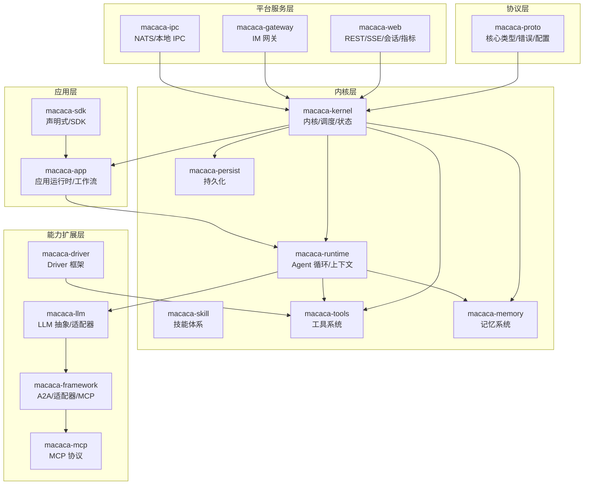
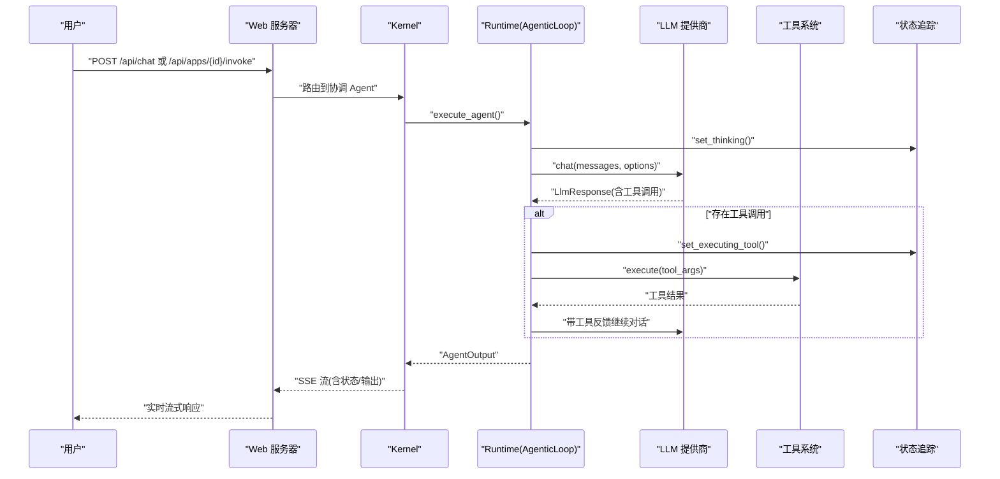
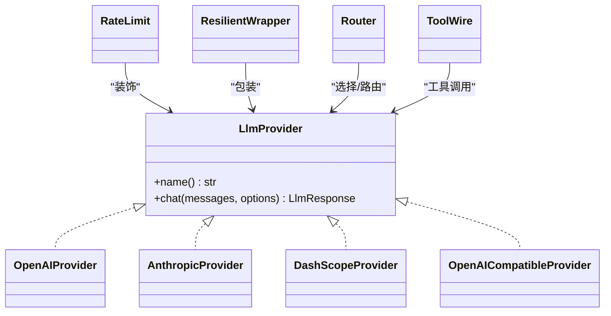
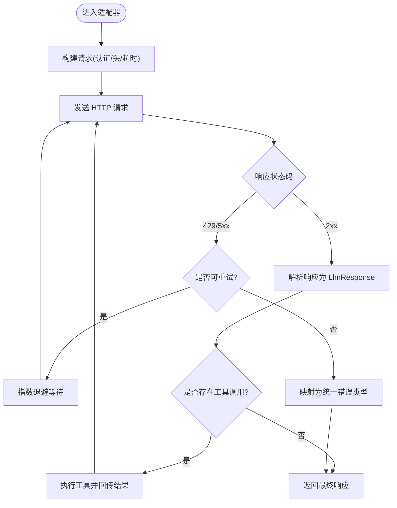
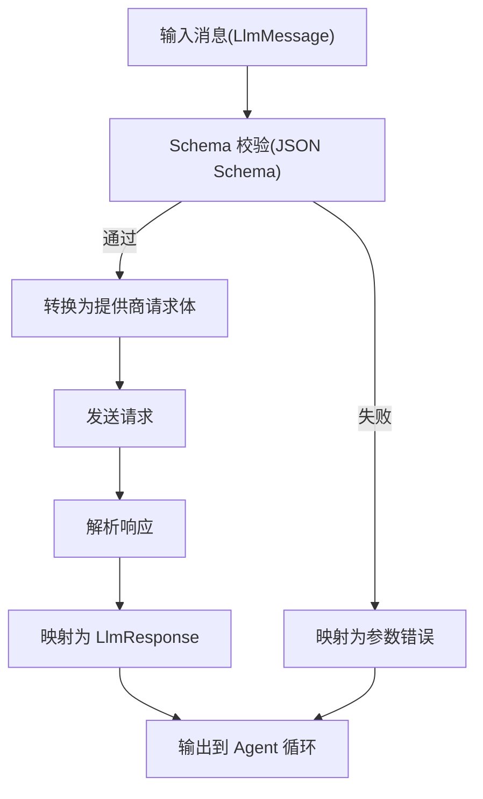
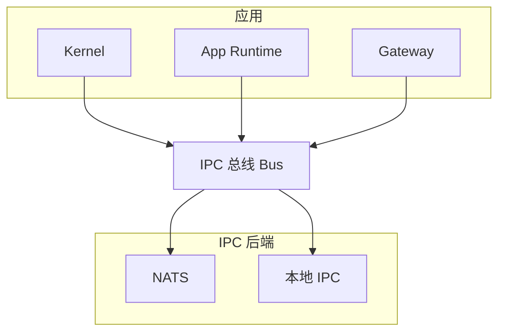
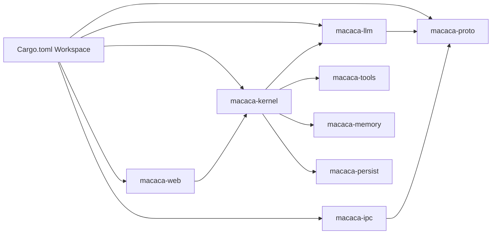

# 第三方集成

<cite>
**本文引用的文件**
- [Cargo.toml](file://macaca/Cargo.toml)
- [架构文档 v2](file://macaca/ARCHITECTURE-v2.md)
- [LLM 抽象层](file://macaca/crates/macaca-llm/src/lib.rs)
- [LLM 提供商抽象](file://macaca/crates/macaca-llm/src/provider.rs)
- [OpenAI 适配器](file://macaca/crates/macaca-llm/src/openai.rs)
- [Anthropic 适配器](file://macaca/crates/macaca-llm/src/anthropic.rs)
- [DashScope 适配器](file://macaca/crates/macaca-llm/src/dashscope.rs)
- [OpenAI 兼容适配器](file://macaca/crates/macaca-llm/src/openai_compatible.rs)
- [LLM 速率限制](file://macaca/crates/macaca-llm/src/rate_limit.rs)
- [LLM 容错封装](file://macaca/crates/macaca-llm/src/resilient.rs)
- [LLM 路由器](file://macaca/crates/macaca-llm/src/router.rs)
- [LLM 工具 Wire](file://macaca/crates/macaca-llm/src/tool_wire.rs)
- [进程间通信总线](file://macaca/crates/macaca-ipc/src/lib.rs)
- [NATS 集成](file://macaca/crates/macaca-ipc/src/nats.rs)
- [本地 IPC](file://macaca/crates/macaca-ipc/src/local.rs)
- [IPC 总线](file://macaca/crates/macaca-ipc/src/bus.rs)
- [Web 路由](file://macaca/crates/macaca-web/src/routes.rs)
- [Web Metrics](file://macaca/crates/macaca-web/src/metrics.rs)
- [Web 状态](file://macaca/crates/macaca-web/src/state.rs)
- [Web 会话](file://macaca/crates/macaca-web/src/session.rs)
- [Web 事件持久化](file://macaca/crates/macaca-web/src/event_persistence.rs)
- [Web SSE](file://macaca/crates/macaca-web/src/sse.rs)
- [Kernel 核心](file://macaca/crates/macaca-kernel/src/kernel.rs)
- [Kernel 状态追踪](file://macaca/crates/macaca-kernel/src/status.rs)
- [Kernel 调度器](file://macaca/crates/macaca-kernel/src/scheduler.rs)
- [Kernel 服务注册](file://macaca/crates/macaca-kernel/src/registry.rs)
- [Agent 运行时](file://macaca/crates/macaca-runtime/src/agentic_loop.rs)
- [Agent 上下文窗口](file://macaca/crates/macaca-runtime/src/context_window.rs)
- [Agent 权限](file://macaca/crates/macaca-runtime/src/permission.rs)
- [Agent 技能](file://macaca/crates/macaca-skill/src/lib.rs)
- [Agent 技能注册表](file://macaca/crates/macaca-skill/src/registry.rs)
- [Agent 技能定义](file://macaca/crates/macaca-skill/src/definition.rs)
- [Agent 技能发现](file://macaca/crates/macaca-skill/src/discovery.rs)
- [Agent 技能工具](file://macaca/crates/macaca-skill/src/tool.rs)
- [工具系统](file://macaca/crates/macaca-tools/src/lib.rs)
- [工具定义](file://macaca/crates/macaca-tools/src/tool.rs)
- [工具编排](file://macaca/crates/macaca-tools/src/orchestration.rs)
- [工具内置](file://macaca/crates/macaca-tools/src/builtin.rs)
- [记忆嵌入](file://macaca/crates/macaca-memory/src/embedding.rs)
- [记忆文件存储](file://macaca/crates/macaca-memory/src/file.rs)
- [记忆隔离存储](file://macaca/crates/macaca-memory/src/isolated.rs)
- [记忆管理器](file://macaca/crates/macaca-memory/src/manager.rs)
- [记忆会话](file://macaca/crates/macaca-memory/src/session.rs)
- [记忆向量](file://macaca/crates/macaca-memory/src/vector.rs)
- [持久化检查点](file://macaca/crates/macaca-persist/src/checkpoint.rs)
- [持久化事件日志](file://macaca/crates/macaca-persist/src/event_log.rs)
- [持久化存储](file://macaca/crates/macaca-persist/src/store.rs)
- [持久化 Redb 存储](file://macaca/crates/macaca-persist/src/redb_store.rs)
- [协议类型](file://macaca/crates/macaca-proto/src/types.rs)
- [协议错误](file://macaca/crates/macaca-proto/src/error.rs)
- [协议配置](file://macaca/crates/macaca-proto/src/config.rs)
- [协议编排](file://macaca/crates/macaca-proto/src/orchestration.rs)
- [框架 A2A](file://macaca/crates/macaca-framework/src/a2a.rs)
- [框架适配器](file://macaca/crates/macaca-framework/src/adapter.rs)
- [框架代理](file://macaca/crates/macaca-framework/src/agent.rs)
- [框架格式化器](file://macaca/crates/macaca-framework/src/formatter.rs)
- [框架 MCP](file://macaca/crates/macaca-framework/src/mcp.rs)
- [框架消息](file://macaca/crates/macaca-framework/src/message.rs)
- [框架模型](file://macaca/crates/macaca-framework/src/model.rs)
- [框架管道](file://macaca/crates/macaca-framework/src/pipeline.rs)
- [框架计划](file://macaca/crates/macaca-framework/src/plan.rs)
- [框架 React Agent](file://macaca/crates/macaca-framework/src/react_agent.rs)
- [框架会话](file://macaca/crates/macaca-framework/src/session.rs)
- [框架状态](file://macaca/crates/macaca-framework/src/state.rs)
- [框架工具](file://macaca/crates/macaca-framework/src/tool.rs)
- [MCP 适配器](file://macaca/crates/macaca-mcp/src/adapter.rs)
- [MCP 客户端](file://macaca/crates/macaca-mcp/src/client.rs)
- [MCP 驱动](file://macaca/crates/macaca-mcp/src/driver.rs)
- [MCP 协议](file://macaca/crates/macaca-mcp/src/lib.rs)
- [网关适配器](file://macaca/crates/macaca-gateway/src/adapter.rs)
- [网关管理器](file://macaca/crates/macaca-gateway/src/gateway.rs)
- [网关 Discord](file://macaca/crates/macaca-gateway/src/discord.rs)
- [网关 Telegram](file://macaca/crates/macaca-gateway/src/telegram.rs)
- [示例应用 fullstack-autodev](file://macaca/examples/apps/fullstack-autodev/app.yaml)
- [示例应用 personas](file://macaca/examples/apps/fullstack-autodev/personas/)
- [示例应用技能](file://macaca/examples/apps/fullstack-autodev/skills/)
- [示例应用工作流](file://macaca/examples/apps/fullstack-autodev/workflows/)
- [集成测试脚本](file://macaca/scripts/benchmark.py)
- [集成测试 Live LLM](file://macaca/crates/macaca-integration-tests/tests/live_llm_test.rs)
- [集成测试 Gateway 管道](file://macaca/crates/macaca-integration-tests/tests/gateway_pipeline.rs)
- [集成测试 Kernel 生命周期](file://macaca/crates/macaca-integration-tests/tests/kernel_lifecycle.rs)
- [集成测试 Scripted LLM](file://macaca/crates/macaca-integration-tests/tests/scripted_llm.rs)
- [集成测试任务生命周期](file://macaca/crates/macaca-integration-tests/tests/task_lifecycle.rs)
- [集成测试 App 声明式](file://macaca/crates/macaca-integration-tests/tests/app_declarative.rs)
- [集成测试 Fullstack Autodev](file://macaca/crates/macaca-integration-tests/tests/fullstack_autodev.rs)
- [集成测试脚本](file://macaca/crates/macaca-integration-tests/src/lib.rs)
</cite>

## 目录
1. [简介](#简介)
2. [项目结构](#项目结构)
3. [核心组件](#核心组件)
4. [架构总览](#架构总览)
5. [详细组件分析](#详细组件分析)
6. [依赖分析](#依赖分析)
7. [性能考虑](#性能考虑)
8. [故障排查指南](#故障排查指南)
9. [结论](#结论)
10. [附录](#附录)

## 简介
本指南面向需要在 Macaca OS 中集成第三方服务（尤其是大语言模型提供商 OpenAI、Anthropic、DashScope 等）的工程师与架构师。内容覆盖：
- API 适配器开发：HTTP 客户端封装、请求重试、响应解析
- 数据转换机制：格式转换、数据验证、错误映射
- 进程间通信：NATS 消息总线、本地 IPC、网络通信
- 常见 LLM 提供商集成示例与最佳实践
- 集成测试方法、监控指标与故障恢复策略
- 安全考虑、性能优化与版本兼容性处理

## 项目结构
Macaca OS 采用多 crate 的工作区组织，围绕“协议层—内核层—应用层—用户界面层”的分层设计，LLM、IPC、工具、记忆、网关等模块以可插拔方式组合。

图表来源
- [Cargo.toml:1-90](file://macaca/Cargo.toml#L1-L90)
- [架构文档 v2:16-275](file://macaca/ARCHITECTURE-v2.md#L16-L275)

章节来源
- [Cargo.toml:1-90](file://macaca/Cargo.toml#L1-L90)
- [架构文档 v2:1-639](file://macaca/ARCHITECTURE-v2.md#L1-L639)

## 核心组件
- LLM 抽象层：统一 LLM 提供商接口，支持 OpenAI、Anthropic、DashScope、OpenAI 兼容等适配器，内置速率限制、容错与工具调用支持。
- 进程间通信：NATS 作为默认后端的消息总线，支持发布/订阅、点对点与请求/应答；提供本地 IPC 通道。
- 工具系统：将外部能力（文件、Shell、Web 搜索等）抽象为工具，支持聚合与编排。
- 记忆系统：三层记忆架构（会话/文件/向量），可插拔嵌入与向量存储。
- 网关：IM 网关适配器（Telegram/Discord 等），事件驱动的工作流。
- Web 层：REST API、SSE 流、会话与指标，用于前端交互与状态推送。
- 框架与 MCP：A2A、适配器、MCP 协议桥接，便于对接第三方能力。

章节来源
- [架构文档 v2:176-212](file://macaca/ARCHITECTURE-v2.md#L176-L212)
- [LLM 抽象层](file://macaca/crates/macaca-llm/src/lib.rs)
- [进程间通信总线](file://macaca/crates/macaca-ipc/src/lib.rs)
- [工具系统](file://macaca/crates/macaca-tools/src/lib.rs)
- [记忆管理器](file://macaca/crates/macaca-memory/src/manager.rs)
- [网关管理器](file://macaca/crates/macaca-gateway/src/gateway.rs)
- [Web 路由](file://macaca/crates/macaca-web/src/routes.rs)

## 架构总览
下图展示了从用户请求到 LLM 响应与工具执行的端到端流程，以及 Agent 状态追踪与 SSE 推送。

图表来源
- [架构文档 v2:319-386](file://macaca/ARCHITECTURE-v2.md#L319-L386)
- [Web 路由](file://macaca/crates/macaca-web/src/routes.rs)
- [Kernel 核心](file://macaca/crates/macaca-kernel/src/kernel.rs)
- [Agent 运行时](file://macaca/crates/macaca-runtime/src/agentic_loop.rs)
- [Kernel 状态追踪](file://macaca/crates/macaca-kernel/src/status.rs)

## 详细组件分析

### LLM 抽象与适配器
- 抽象接口：统一 chat 方法，屏蔽不同提供商差异。
- 适配器实现：OpenAI、Anthropic、DashScope、OpenAI 兼容。
- 辅助能力：速率限制、容错封装、路由器（多提供商负载均衡）、工具调用 wire。

图表来源
- [LLM 提供商抽象](file://macaca/crates/macaca-llm/src/provider.rs)
- [OpenAI 适配器](file://macaca/crates/macaca-llm/src/openai.rs)
- [Anthropic 适配器](file://macaca/crates/macaca-llm/src/anthropic.rs)
- [DashScope 适配器](file://macaca/crates/macaca-llm/src/dashscope.rs)
- [OpenAI 兼容适配器](file://macaca/crates/macaca-llm/src/openai_compatible.rs)
- [LLM 速率限制](file://macaca/crates/macaca-llm/src/rate_limit.rs)
- [LLM 容错封装](file://macaca/crates/macaca-llm/src/resilient.rs)
- [LLM 路由器](file://macaca/crates/macaca-llm/src/router.rs)
- [LLM 工具 Wire](file://macaca/crates/macaca-llm/src/tool_wire.rs)

章节来源
- [LLM 抽象层](file://macaca/crates/macaca-llm/src/lib.rs)
- [LLM 提供商抽象](file://macaca/crates/macaca-llm/src/provider.rs)
- [OpenAI 适配器](file://macaca/crates/macaca-llm/src/openai.rs)
- [Anthropic 适配器](file://macaca/crates/macaca-llm/src/anthropic.rs)
- [DashScope 适配器](file://macaca/crates/macaca-llm/src/dashscope.rs)
- [OpenAI 兼容适配器](file://macaca/crates/macaca-llm/src/openai_compatible.rs)
- [LLM 速率限制](file://macaca/crates/macaca-llm/src/rate_limit.rs)
- [LLM 容错封装](file://macaca/crates/macaca-llm/src/resilient.rs)
- [LLM 路由器](file://macaca/crates/macaca-llm/src/router.rs)
- [LLM 工具 Wire](file://macaca/crates/macaca-llm/src/tool_wire.rs)

### API 适配器开发要点（HTTP 客户端封装、重试与响应解析）
- HTTP 客户端封装：统一请求构建、认证头注入、超时与重试策略配置。
- 请求重试：指数退避、幂等请求重试、区分可重试错误（网络/限流/5xx）。
- 响应解析：结构化响应映射到 LlmResponse，错误映射到统一错误类型。
- 工具调用：解析 tool_calls，调用工具系统，回传工具结果。

图表来源
- [OpenAI 适配器](file://macaca/crates/macaca-llm/src/openai.rs)
- [Anthropic 适配器](file://macaca/crates/macaca-llm/src/anthropic.rs)
- [DashScope 适配器](file://macaca/crates/macaca-llm/src/dashscope.rs)
- [OpenAI 兼容适配器](file://macaca/crates/macaca-llm/src/openai_compatible.rs)
- [LLM 容错封装](file://macaca/crates/macaca-llm/src/resilient.rs)
- [LLM 速率限制](file://macaca/crates/macaca-llm/src/rate_limit.rs)

### 数据转换与验证（格式转换、数据验证、错误映射）
- 格式转换：将 LLM 输出映射为内部消息结构，工具调用参数校验。
- 数据验证：输入消息 schema 校验、工具参数 JSON Schema 校验。
- 错误映射：将 HTTP/网络/业务错误映射为统一的 LlmError，便于上层处理。

图表来源
- [LLM 提供商抽象](file://macaca/crates/macaca-llm/src/provider.rs)
- [协议类型](file://macaca/crates/macaca-proto/src/types.rs)
- [协议错误](file://macaca/crates/macaca-proto/src/error.rs)

### 进程间通信集成（NATS、本地 IPC、网络通信）
- NATS 总线：默认消息总线，支持主题发布/订阅、请求/应答。
- 本地 IPC：跨进程本地通信，适合同机高吞吐场景。
- 网络通信：HTTP/WebSocket 作为网关与外部系统的桥梁。

图表来源
- [进程间通信总线](file://macaca/crates/macaca-ipc/src/lib.rs)
- [NATS 集成](file://macaca/crates/macaca-ipc/src/nats.rs)
- [本地 IPC](file://macaca/crates/macaca-ipc/src/local.rs)
- [IPC 总线](file://macaca/crates/macaca-ipc/src/bus.rs)

### 常见第三方服务集成示例（OpenAI、Anthropic、DashScope）
- OpenAI：GPT-4/GPT-3.5，支持工具调用与成本追踪。
- Anthropic：Claude 系列，支持消息与工具调用。
- DashScope：通义千问系列，支持工具调用与多模态（按提供商能力）。
- OpenAI 兼容：DeepSeek/Ollama 等，统一走 OpenAI 兼容适配器。

章节来源
- [架构文档 v2:181-185](file://macaca/ARCHITECTURE-v2.md#L181-L185)
- [OpenAI 适配器](file://macaca/crates/macaca-llm/src/openai.rs)
- [Anthropic 适配器](file://macaca/crates/macaca-llm/src/anthropic.rs)
- [DashScope 适配器](file://macaca/crates/macaca-llm/src/dashscope.rs)
- [OpenAI 兼容适配器](file://macaca/crates/macaca-llm/src/openai_compatible.rs)

### 集成测试方法
- 单元/集成测试：覆盖 LLM 适配器、IPC、工具系统、网关管道。
- 脚本化测试：benchmark.py 用于性能基准。
- Live LLM 测试：真实提供商连通性与功能验证。
- Kernel 生命周期：验证 Agent 注册/执行/状态更新。
- Fullstack Autodev 示例：端到端工作流验证。

章节来源
- [集成测试 Live LLM](file://macaca/crates/macaca-integration-tests/tests/live_llm_test.rs)
- [集成测试 Gateway 管道](file://macaca/crates/macaca-integration-tests/tests/gateway_pipeline.rs)
- [集成测试 Kernel 生命周期](file://macaca/crates/macaca-integration-tests/tests/kernel_lifecycle.rs)
- [集成测试 Scripted LLM](file://macaca/crates/macaca-integration-tests/tests/scripted_llm.rs)
- [集成测试任务生命周期](file://macaca/crates/macaca-integration-tests/tests/task_lifecycle.rs)
- [集成测试 App 声明式](file://macaca/crates/macaca-integration-tests/tests/app_declarative.rs)
- [集成测试 Fullstack Autodev](file://macaca/crates/macaca-integration-tests/tests/fullstack_autodev.rs)
- [集成测试脚本](file://macaca/scripts/benchmark.py)

### 监控指标与故障恢复
- 指标：Web 层暴露指标，记录请求延迟、错误率、LLM 调用量与成本。
- 故障恢复：重试与退避、熔断（可结合速率限制）、降级（备用提供商/缓存）。
- 日志与追踪：统一 tracing，支持 JSON 输出与 OpenTelemetry 集成。

章节来源
- [Web Metrics](file://macaca/crates/macaca-web/src/metrics.rs)
- [LLM 速率限制](file://macaca/crates/macaca-llm/src/rate_limit.rs)
- [LLM 容错封装](file://macaca/crates/macaca-llm/src/resilient.rs)

### 安全考虑、性能优化与版本兼容
- 安全：密钥管理、HTTPS、最小权限、输入校验与输出过滤。
- 性能：连接池、批量请求、缓存（会话/嵌入）、异步并发、背压与限流。
- 兼容：OpenAI 兼容适配器统一接口；版本升级时保持消息结构稳定与向后兼容。

章节来源
- [OpenAI 兼容适配器](file://macaca/crates/macaca-llm/src/openai_compatible.rs)
- [协议类型](file://macaca/crates/macaca-proto/src/types.rs)

## 依赖分析
- 工作区依赖：统一使用 tokio、serde、tracing、thiserror 等生态库。
- 组件耦合：LLM 适配器依赖协议层类型；IPC 与 Kernel 解耦；Web 层通过 Kernel 暴露状态。
- 外部依赖：NATS、HTTP 客户端、序列化库、时间与 UUID 工具。

图表来源
- [Cargo.toml:1-90](file://macaca/Cargo.toml#L1-L90)

章节来源
- [Cargo.toml:33-90](file://macaca/Cargo.toml#L33-L90)

## 性能考虑
- 异步与并发：基于 tokio 的异步运行时，合理设置并发上限与背压。
- 连接复用：HTTP 客户端连接池、NATS 连接池。
- 缓存策略：会话级短期记忆、向量检索缓存、嵌入结果缓存。
- 限流与退避：速率限制与指数退避，避免触发第三方限流。
- 指标观测：SSE 推送状态与指标，便于前端与运维观测。

## 故障排查指南
- Chat 不经 Agent：确认路由到协调 Agent，而非直接调用 LLM。
- 状态不更新：确保在 AgenticLoop 中更新状态，或通过回调通知状态追踪。
- 工具执行失败：检查工具参数 JSON Schema、工具实现与权限。
- NATS 连接异常：检查 NATS 地址、认证与网络连通性。
- LLM 错误映射：查看统一错误类型，定位具体提供商错误码与消息。

章节来源
- [架构文档 v2:567-600](file://macaca/ARCHITECTURE-v2.md#L567-L600)
- [Kernel 状态追踪](file://macaca/crates/macaca-kernel/src/status.rs)
- [Web SSE](file://macaca/crates/macaca-web/src/sse.rs)
- [协议错误](file://macaca/crates/macaca-proto/src/error.rs)

## 结论
通过可插拔的 LLM 抽象层、统一的 IPC 总线与工具系统，Macaca OS 能够高效集成多家第三方服务。遵循本文的适配器开发规范、数据转换与错误映射策略、通信与监控最佳实践，可在保证安全性与性能的前提下，快速扩展新的提供商与能力。

## 附录
- 示例应用：fullstack-autodev 展示了声明式应用、技能与工作流的组合使用。
- 驱动与 MCP：可通过 Driver 框架与 MCP 协议桥接更多外部能力。

章节来源
- [示例应用 fullstack-autodev](file://macaca/examples/apps/fullstack-autodev/app.yaml)
- [示例应用 personas](file://macaca/examples/apps/fullstack-autodev/personas/)
- [示例应用技能](file://macaca/examples/apps/fullstack-autodev/skills/)
- [示例应用工作流](file://macaca/examples/apps/fullstack-autodev/workflows/)
- [框架 MCP](file://macaca/crates/macaca-framework/src/mcp.rs)
- [MCP 协议](file://macaca/crates/macaca-mcp/src/lib.rs)