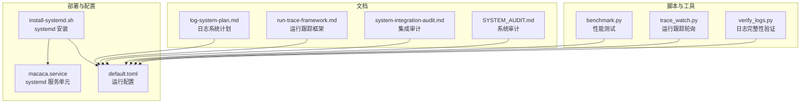
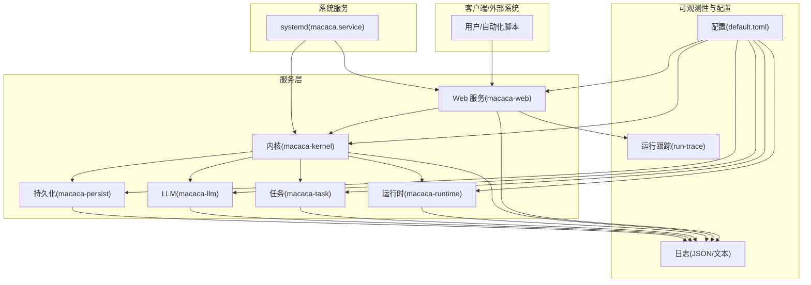
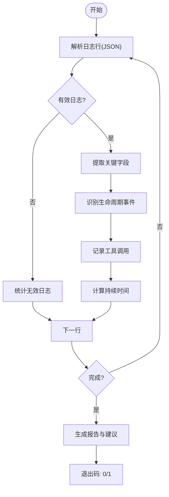
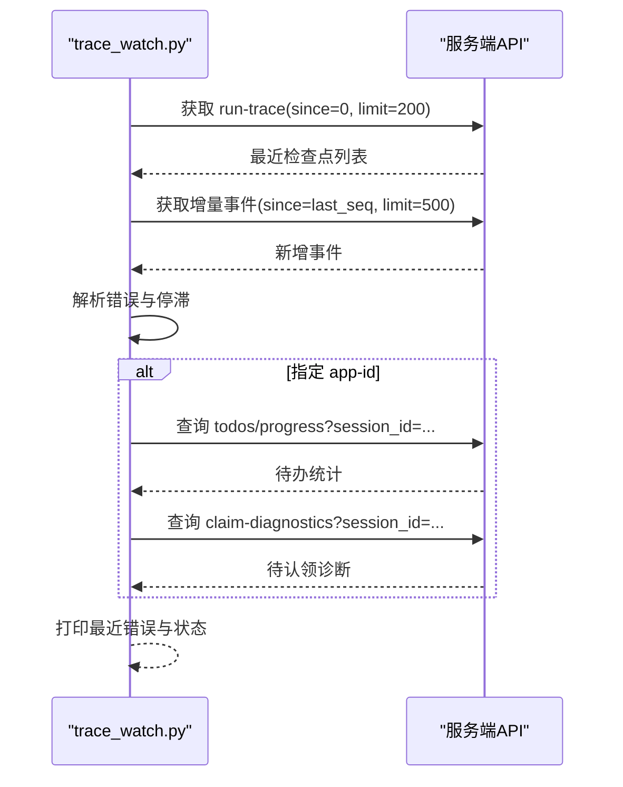
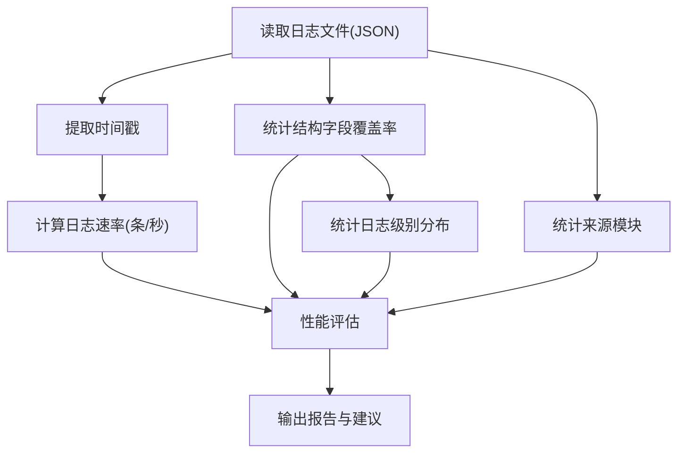
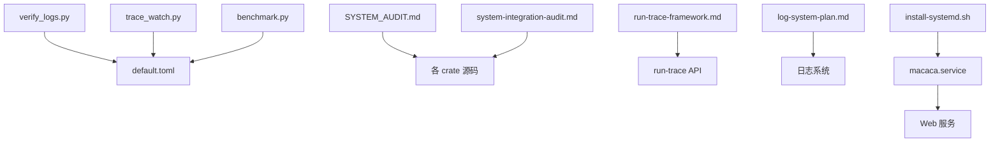

# 故障排除

<cite>
**本文引用的文件**
- [verify_logs.py](file://macaca/scripts/verify_logs.py)
- [trace_watch.py](file://macaca/scripts/trace_watch.py)
- [benchmark.py](file://macaca/scripts/benchmark.py)
- [SYSTEM_AUDIT.md](file://macaca/docs/SYSTEM_AUDIT.md)
- [system-integration-audit.md](file://macaca/docs/system-integration-audit.md)
- [run-trace-framework.md](file://macaca/docs/run-trace-framework.md)
- [log-system-plan.md](file://macaca/docs/log-system-plan.md)
- [install-systemd.sh](file://macaca/deploy/install-systemd.sh)
- [macaca.service](file://macaca/deploy/macaca.service)
- [default.toml](file://macaca/config/default.toml)
</cite>

## 目录
1. [简介](#简介)
2. [项目结构](#项目结构)
3. [核心组件](#核心组件)
4. [架构总览](#架构总览)
5. [详细组件分析](#详细组件分析)
6. [依赖分析](#依赖分析)
7. [性能考虑](#性能考虑)
8. [故障排除指南](#故障排除指南)
9. [结论](#结论)
10. [附录](#附录)

## 简介
本指南面向运维与开发人员，提供 Macaca Agent OS 的系统化故障排除方法。内容涵盖安装与系统服务问题、配置错误、运行时异常、日志分析与性能排查、调试工具使用（verify_logs.py、trace_watch.py、benchmark.py）、系统审计与集成问题排查流程，以及错误代码与修复步骤。目标是帮助用户快速定位并解决问题。

## 项目结构
- 调试与审计脚本位于 macaca/scripts 下，包括日志完整性验证、运行跟踪轮询、性能测试等。
- 文档位于 macaca/docs，包含系统审计、集成审计、运行跟踪框架与日志系统计划。
- 部署与系统服务位于 macaca/deploy，包含 systemd 安装脚本与服务单元文件。
- 配置位于 macaca/config/default.toml，包含 LLM、内存、IPC、持久化、网关与可观测性等配置段。

图表来源
- [verify_logs.py](file://macaca/scripts/verify_logs.py)
- [trace_watch.py](file://macaca/scripts/trace_watch.py)
- [benchmark.py](file://macaca/scripts/benchmark.py)
- [SYSTEM_AUDIT.md](file://macaca/docs/SYSTEM_AUDIT.md)
- [system-integration-audit.md](file://macaca/docs/system-integration-audit.md)
- [run-trace-framework.md](file://macaca/docs/run-trace-framework.md)
- [log-system-plan.md](file://macaca/docs/log-system-plan.md)
- [install-systemd.sh](file://macaca/deploy/install-systemd.sh)
- [macaca.service](file://macaca/deploy/macaca.service)
- [default.toml](file://macaca/config/default.toml)

章节来源
- [default.toml](file://macaca/config/default.toml)
- [install-systemd.sh](file://macaca/deploy/install-systemd.sh)
- [macaca.service](file://macaca/deploy/macaca.service)

## 核心组件
- 日志完整性验证工具：用于检查任务生命周期完整性、Fork 事件完整性、工具调用完整性与关键字段缺失情况，并输出报告与建议。
- 运行跟踪轮询工具：轮询 run-trace 与增量事件，检测停滞、超时、待办失败等异常，支持 deadline 与 stall 限制。
- 性能测试工具：分析日志结构完整性、日志速率与来源模块分布，评估日志系统对吞吐的影响。
- 系统审计与集成审计：识别架构风险、重复与冗余、未接入模块，给出修复建议与优先级。
- 运行跟踪框架：定义 run_trace 的 phase、组件与 API，支撑快速定位卡点。
- 日志系统计划：定义日志级别、文件配置、滚动与格式，支撑生产级日志持久化与审计。
- systemd 部署：提供安装、启停、状态查看与日志跟随命令，保障服务稳定运行。

章节来源
- [verify_logs.py](file://macaca/scripts/verify_logs.py)
- [trace_watch.py](file://macaca/scripts/trace_watch.py)
- [benchmark.py](file://macaca/scripts/benchmark.py)
- [SYSTEM_AUDIT.md](file://macaca/docs/SYSTEM_AUDIT.md)
- [system-integration-audit.md](file://macaca/docs/system-integration-audit.md)
- [run-trace-framework.md](file://macaca/docs/run-trace-framework.md)
- [log-system-plan.md](file://macaca/docs/log-system-plan.md)
- [install-systemd.sh](file://macaca/deploy/install-systemd.sh)
- [macaca.service](file://macaca/deploy/macaca.service)

## 架构总览
下图展示故障排除相关组件与系统关键路径的关系，包括日志、运行跟踪、配置与服务层。

图表来源
- [run-trace-framework.md](file://macaca/docs/run-trace-framework.md)
- [default.toml](file://macaca/config/default.toml)
- [macaca.service](file://macaca/deploy/macaca.service)

## 详细组件分析

### 日志完整性验证工具（verify_logs.py）
- 功能要点
  - 解析 JSON 日志行，统计总数、有效/无效日志。
  - 提取 task_id/fork_id/trace_id/app_id/agent_name 等关键字段。
  - 识别任务生命周期事件：创建、开始、完成/失败、Fork 创建/挂起/恢复。
  - 统计工具调用次数与错误信息，计算任务持续时间。
  - 生成摘要、任务生命周期分析、缺失事件清单、详细任务列表与结论。
- 使用场景
  - 安装后首次运行无日志：检查日志文件路径与权限。
  - 任务未完成：检查缺失事件与错误列表，定位生命周期断点。
  - Fork 异常：检查 Fork 事件是否完整（创建→挂起→恢复）。
- 常见问题与修复
  - 无效 JSON：检查日志格式配置与编码，确保 JSON 可解析。
  - 缺失 trace_id/task_id/fork_id：在日志记录处补充追踪字段。
  - 生命周期不完整：检查 Hook 事件发送/接收与 Fork 恢复机制。
- 退出码
  - 0：验证通过；非 0：存在不完整生命周期或错误。

图表来源
- [verify_logs.py](file://macaca/scripts/verify_logs.py)

章节来源
- [verify_logs.py](file://macaca/scripts/verify_logs.py)

### 运行跟踪轮询工具（trace_watch.py）
- 功能要点
  - 轮询 run-trace 与增量事件，打印最近检查点与错误。
  - 支持 deadline-seconds 与 stall-seconds 限制，检测超时与停滞。
  - 可选 app-id 下查询 todos/progress 与 claim-diagnostics，定位待办卡点。
  - 支持一次性模式与自定义轮询间隔。
- 使用场景
  - 任务长时间无进展：设置 stall-seconds 检测停滞。
  - 超时退出：设置 deadline-seconds 防止无限等待。
  - 待办失败：开启 exit-on-todo-failed 在失败时直接退出。
- 常见问题与修复
  - API 请求失败：检查 MACACA_API 环境变量与网络连通性。
  - 无新事件：确认 run-trace 是否正常写入与事件广播。
  - claim-diagnostics 400：确保传入正确的 session_id。
- 退出码
  - 0：成功；1：请求失败且一次性模式；2：超过 deadline；3：停滞；4：待办失败。

图表来源
- [trace_watch.py](file://macaca/scripts/trace_watch.py)
- [run-trace-framework.md](file://macaca/docs/run-trace-framework.md)

章节来源
- [trace_watch.py](file://macaca/scripts/trace_watch.py)
- [run-trace-framework.md](file://macaca/docs/run-trace-framework.md)

### 性能测试工具（benchmark.py）
- 功能要点
  - 解析日志时间戳，计算日志生成速率。
  - 统计结构完整性（timestamp/level/target/fields 覆盖率）。
  - 分析日志级别分布与来源模块，评估日志系统对性能影响。
- 使用场景
  - 日志过多导致性能下降：评估日志速率与结构完整性。
  - 需要验证日志系统对吞吐影响：< 5% 性能下降为目标。
- 建议
  - 为关键路径补充 trace_id/task_id/fork_id 字段，提升可观测性。
  - 控制日志级别与采样，避免过度日志写入。

图表来源
- [benchmark.py](file://macaca/scripts/benchmark.py)

章节来源
- [benchmark.py](file://macaca/scripts/benchmark.py)

### 系统审计与集成审计
- 系统审计（SYSTEM_AUDIT.md）
  - 识别架构风险：如 routes.rs 巨大文件、AppState 过度聚合、硬编码“coordinator”等。
  - 重复与冗余：TaskId/DelegatedTask 重复定义、AgenticLoop 多实现重复、TaskQueue 与 ExecutionQueue 功能重叠。
  - 未接入模块：memory/ipc/mcp/gateway 等模块未接入运行时。
  - 重构建议：拆分 routes.rs、消除硬编码、合并重复类型、精简 AppState、提取共享逻辑、接入未使用模块。
- 集成审计（system-integration-audit.md）
  - 关键缺口：ResilientLlmWrapper 未接入、create_goal 非 LLM 工具、WorkerLoop 未接入运行时。
  - 安全与可观测性：check_tool_with_args 未调用、AuditLogger/AlertManager/Metrics 未接入、GoalEvaluator 未接入。
  - 修复建议：接入 ResilientLlmWrapper、新增 CreateGoalTool、替换权限检查、接入审计/告警/指标、接入 WorkerLoop、修复 update_progress。

章节来源
- [SYSTEM_AUDIT.md](file://macaca/docs/SYSTEM_AUDIT.md)
- [system-integration-audit.md](file://macaca/docs/system-integration-audit.md)

### 运行跟踪框架
- 目标：在不替代现有 EventLog 的前提下，增加稀疏结构化检查点，辅助快速定位卡点。
- 数据模型：run_trace 事件写入 EventLog，负载包含 phase/component/status/message/task_id/goal_id 等。
- 标准 phase：覆盖聊天入口、工作流、委派、计划/审查、目标创建、Worker 执行等关键阶段。
- API：/api/sessions/{id}/run-trace?since=&limit=；Prometheus 指标 run_trace_events_total{phase,status}。
- 与应用配置配合：在文件读取工作流中使用应用 bundle 绝对路径，避免相对路径解析问题。

章节来源
- [run-trace-framework.md](file://macaca/docs/run-trace-framework.md)

### 日志系统计划
- 配置结构：新增 LogConfig/LogFileConfig，支持启用/目录/前缀/格式等。
- 配置示例：在 default.toml 中添加 [observability.log_file] 段，启用文件日志、设置目录、前缀与格式。
- 初始化逻辑：创建目录、按日期滚动、非阻塞写入、多输出层（控制台+文件）。
- 文件命名与滚动：{prefix}-{YYYY-MM-DD}.log，按日期滚动。
- 格式：JSON 文件与控制台可读格式。

章节来源
- [log-system-plan.md](file://macaca/docs/log-system-plan.md)
- [default.toml](file://macaca/config/default.toml)

### systemd 部署与服务管理
- 安装脚本：install-systemd.sh 创建用户与目录、复制服务文件、更新 ExecStart 路径、重载并启用服务。
- 服务单元：macaca.service 定义 Type=notify、重启策略、资源限制、安全加固、用户与工作目录。
- 常用命令：启动/停止/状态、journalctl 跟随日志、查看配置与数据目录。

章节来源
- [install-systemd.sh](file://macaca/deploy/install-systemd.sh)
- [macaca.service](file://macaca/deploy/macaca.service)

## 依赖分析
- 脚本依赖
  - verify_logs.py：纯 Python 标准库，无外部依赖。
  - trace_watch.py：Python 标准库 urllib，依赖服务端 API。
  - benchmark.py：Python 标准库，依赖日志文件。
- 文档与配置
  - SYSTEM_AUDIT.md 与 system-integration-audit.md 为审计与重构指导，影响代码组织与模块接入。
  - run-trace-framework.md 与 log-system-plan.md 为可观测性与日志规范，影响日志记录与 API 使用。
  - default.toml 为运行时配置中心，影响 LLM、内存、IPC、持久化、网关与可观测性行为。

图表来源
- [verify_logs.py](file://macaca/scripts/verify_logs.py)
- [trace_watch.py](file://macaca/scripts/trace_watch.py)
- [benchmark.py](file://macaca/scripts/benchmark.py)
- [SYSTEM_AUDIT.md](file://macaca/docs/SYSTEM_AUDIT.md)
- [system-integration-audit.md](file://macaca/docs/system-integration-audit.md)
- [run-trace-framework.md](file://macaca/docs/run-trace-framework.md)
- [log-system-plan.md](file://macaca/docs/log-system-plan.md)
- [default.toml](file://macaca/config/default.toml)
- [macaca.service](file://macaca/deploy/macaca.service)
- [install-systemd.sh](file://macaca/deploy/install-systemd.sh)

## 性能考虑
- 日志系统对性能的影响：通过 benchmark.py 评估日志速率与结构完整性，建议在关键路径补充 trace_id/task_id/fork_id 字段，控制日志级别与采样，避免过度写入。
- 运行跟踪 API：合理设置 since/limit，避免一次性拉取过多事件；结合 stall-seconds 与 deadline-seconds 防止长时间无响应。
- 系统服务稳定性：利用 systemd 的 WatchdogSec、重启策略与资源限制，确保服务健康运行。

章节来源
- [benchmark.py](file://macaca/scripts/benchmark.py)
- [run-trace-framework.md](file://macaca/docs/run-trace-framework.md)
- [macaca.service](file://macaca/deploy/macaca.service)

## 故障排除指南

### 1. 安装与系统服务问题
- 症状
  - 服务无法启动或频繁重启。
  - journalctl 查看不到日志或日志级别过低。
- 排查步骤
  - 使用 install-systemd.sh 安装并启用服务，确认 ExecStart 路径与工作目录。
  - 检查 /etc/systemd/system/macaca.service 与 /etc/macaca/env 配置。
  - 使用 journalctl -u macaca -f 实时查看日志。
  - 设置 RUST_LOG=debug/info/warn 等级别进行调试。
- 修复建议
  - 如路径不匹配，使用 install-systemd.sh 更新服务文件中的 ExecStart。
  - 确保 /var/lib/macaca 与 /etc/macaca 目录存在且权限正确。
  - 配置 MemoryMax/LimitNOFILE 等资源限制满足运行需求。

章节来源
- [install-systemd.sh](file://macaca/deploy/install-systemd.sh)
- [macaca.service](file://macaca/deploy/macaca.service)
- [default.toml](file://macaca/config/default.toml)

### 2. 配置错误
- 症状
  - LLM 调用失败或模型不可用。
  - IPC 连接失败或 NATS 无法连接。
  - 网关（Telegram/Discord）无法接收消息。
- 排查步骤
  - 检查 [llm] 与 [llm.providers.*] 段，确认 API Key 与 Base URL。
  - 检查 [ipc] 段，确认 NATS 地址与自动启动参数。
  - 检查 [gateway] 与子段，确认 bot token 环境变量与允许用户列表。
  - 检查 [observability.log_file] 段，确认文件日志启用、目录与前缀。
- 修复建议
  - 将敏感信息放入环境变量并在配置中引用对应环境变量名。
  - 确保网络连通性与端口开放。
  - 如使用 OpenRouter/Ollama 等兼容接口，调整 base_url 与默认模型。

章节来源
- [default.toml](file://macaca/config/default.toml)

### 3. 运行时异常与停滞
- 症状
  - 任务长时间无进展或停滞。
  - 超时退出或出现 DEADLINE 警告。
  - 待办失败导致流程中断。
- 排查步骤
  - 使用 trace_watch.py 轮询 run-trace 与增量事件，观察最新检查点与错误。
  - 设置 --deadline-seconds 与 --stall-seconds，定位超时与停滞。
  - 在指定 --app-id 下查询 todos/progress 与 claim-diagnostics，定位待办卡点。
- 修复建议
  - 检查 Planner Review/Gates/依赖完成状态，确保任务链路畅通。
  - 优化 LLM 调用与重试策略，减少失败概率。
  - 接入 WorkerLoop，使任务可被 Worker 自主拉取执行。

章节来源
- [trace_watch.py](file://macaca/scripts/trace_watch.py)
- [run-trace-framework.md](file://macaca/docs/run-trace-framework.md)
- [system-integration-audit.md](file://macaca/docs/system-integration-audit.md)

### 4. 日志分析与审计
- 症状
  - 日志缺失关键字段（trace_id/task_id/fork_id）。
  - 日志格式错误或 JSON 解析失败。
  - 任务生命周期不完整或 Fork 事件缺失。
- 排查步骤
  - 使用 verify_logs.py 分析日志完整性，检查任务生命周期与 Fork 事件。
  - 使用 benchmark.py 评估日志速率与结构完整性，识别潜在性能问题。
  - 检查 default.toml 中 [observability.log_file] 配置，确认文件日志启用与格式。
- 修复建议
  - 在日志记录处补充 trace_id/task_id/fork_id 等追踪字段。
  - 调整日志级别与采样，避免过度日志写入。
  - 接入 ResilientLlmWrapper/AuditLogger/AlertManager/Metrics，完善可观测性。

章节来源
- [verify_logs.py](file://macaca/scripts/verify_logs.py)
- [benchmark.py](file://macaca/scripts/benchmark.py)
- [log-system-plan.md](file://macaca/docs/log-system-plan.md)
- [default.toml](file://macaca/config/default.toml)
- [system-integration-audit.md](file://macaca/docs/system-integration-audit.md)

### 5. 系统审计与集成问题
- 症状
  - 路由文件过大、状态对象臃肿、硬编码“coordinator”。
  - 重复类型与队列系统重叠，维护成本高。
  - 未接入模块（memory/ipc/mcp/gateway）影响功能完整性。
- 排查步骤
  - 阅读 SYSTEM_AUDIT.md 与 system-integration-audit.md，对照当前实现与设计缺口。
  - 识别重复类型与冗余模块，制定合并与清理计划。
  - 评估未接入模块的接入优先级与影响面。
- 修复建议
  - 拆分巨构文件、消除硬编码、合并重复类型、精简 AppState。
  - 接入未使用模块，完善系统能力与可观测性。
  - 逐步引入 ResilientLlmWrapper、CreateGoalTool、WorkerLoop 等关键能力。

章节来源
- [SYSTEM_AUDIT.md](file://macaca/docs/SYSTEM_AUDIT.md)
- [system-integration-audit.md](file://macaca/docs/system-integration-audit.md)

### 6. 错误代码与退出码
- verify_logs.py
  - 0：验证通过（无不完整生命周期与错误）。
  - 1：存在不完整生命周期或错误。
- trace_watch.py
  - 0：成功。
  - 1：请求失败且一次性模式。
  - 2：超过 deadline。
  - 3：停滞（latest_seq 长时间不变）。
  - 4：待办失败（progress.failed > 0）。
- benchmark.py
  - 作为分析工具，不直接退出码；建议结合日志结构完整性评分与 JSON 正确率评估。

章节来源
- [verify_logs.py](file://macaca/scripts/verify_logs.py)
- [trace_watch.py](file://macaca/scripts/trace_watch.py)
- [benchmark.py](file://macaca/scripts/benchmark.py)

### 7. 预防措施
- 配置管理
  - 将敏感信息放入环境变量，避免硬编码。
  - 使用 default.toml 的 [observability.log_file] 统一日志配置。
- 代码与架构
  - 拆分巨构文件、消除硬编码、合并重复类型、精简 AppState。
  - 接入 ResilientLlmWrapper、AuditLogger/AlertManager/Metrics、WorkerLoop。
- 运维与监控
  - 使用 systemd WatchdogSec 与资源限制保障服务稳定性。
  - 定期运行 verify_logs.py 与 benchmark.py，保持日志系统健康。

章节来源
- [default.toml](file://macaca/config/default.toml)
- [SYSTEM_AUDIT.md](file://macaca/docs/SYSTEM_AUDIT.md)
- [system-integration-audit.md](file://macaca/docs/system-integration-audit.md)
- [macaca.service](file://macaca/deploy/macaca.service)

## 结论
通过系统化的故障排除流程与工具组合，可以快速定位并解决安装、配置、运行时与性能问题。建议优先使用 trace_watch.py 快速定位卡点，verify_logs.py 检查日志完整性，benchmark.py 评估性能影响，并结合 SYSTEM_AUDIT.md 与 system-integration-audit.md 的建议进行架构与集成改进。同时，借助 systemd 与 default.toml 的配置，确保服务稳定与可观测性。

## 附录
- 常用命令
  - 启动/停止/状态：systemctl start/stop/status macaca
  - 跟随日志：journalctl -u macaca -f
  - 安装服务：install-systemd.sh
- 关键配置段
  - [llm]、[llm.providers.*]、[ipc]、[gateway]、[observability.log_file]、[kernel]、[memory]、[persist]、[workspace]