# 事件驱动架构

<cite>
**本文档引用的文件**
- [lib.rs](file://macaca/crates/macaca-framework/src/lib.rs)
- [message.rs](file://macaca/crates/macaca-framework/src/message.rs)
- [state.rs](file://macaca/crates/macaca-framework/src/state.rs)
- [tool.rs](file://macaca/crates/macaca-framework/src/tool.rs)
- [plan.rs](file://macaca/crates/macaca-framework/src/plan.rs)
- [pipeline.rs](file://macaca/crates/macaca-framework/src/pipeline.rs)
- [react_agent.rs](file://macaca/crates/macaca-framework/src/react_agent.rs)
- [session.rs](file://macaca/crates/macaca-framework/src/session.rs)
- [a2a.rs](file://macaca/crates/macaca-framework/src/a2a.rs)
- [agent.rs](file://macaca/crates/macaca-framework/src/agent.rs)
- [kernel.rs](file://macaca/crates/macaca-kernel/src/kernel.rs)
- [scheduler.rs](file://macaca/crates/macaca-kernel/src/scheduler.rs)
- [services.rs](file://macaca/crates/macaca-kernel/src/services.rs)
- [event-log-redesign.md](file://macaca/docs/event-log-redesign.md)
- [task-routing-design.md](file://macaca/docs/task-routing-design.md)
</cite>

## 目录
1. [引言](#引言)
2. [项目结构](#项目结构)
3. [核心组件](#核心组件)
4. [架构总览](#架构总览)
5. [详细组件分析](#详细组件分析)
6. [依赖关系分析](#依赖关系分析)
7. [性能考量](#性能考量)
8. [故障排查指南](#故障排查指南)
9. [结论](#结论)
10. [附录](#附录)

## 引言
本文件面向 Macaca Agent 操作系统，系统化阐述其事件驱动架构与异步处理模式。文档聚焦以下主题：
- 事件类型定义与消息模型
- 事件发布/订阅与路由机制
- 事件处理器与事件生命周期管理
- Agent 协作、状态同步与工作流编排
- 事件持久化与重放能力
- 最佳实践与性能优化策略
- 调试技巧与常见问题定位

## 项目结构
Macaca 采用多 Crate 的模块化组织，事件驱动相关的核心位于 macaca-framework 与 macaca-kernel：
- macaca-framework：统一消息模型、Agent 抽象、工具系统、计划笔记本、会话持久化、A2A 协议等
- macaca-kernel：内核调度、服务适配、注册表与状态跟踪

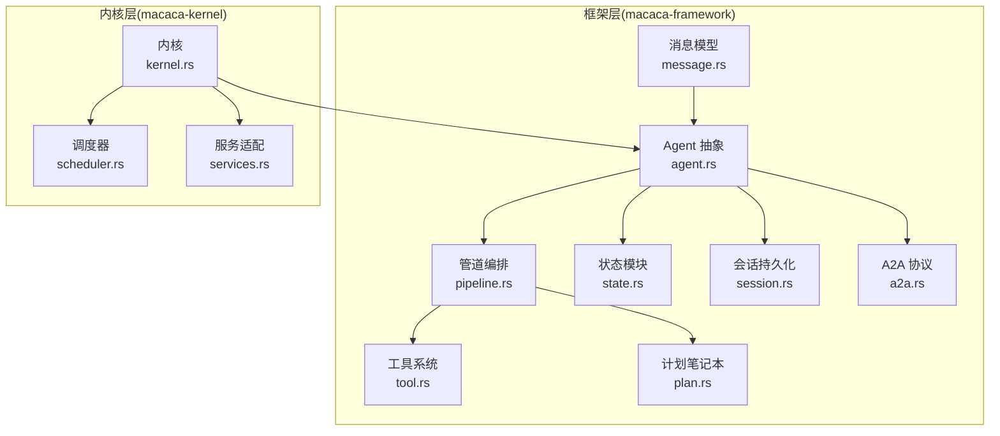

图表来源
- [lib.rs:1-32](file://macaca/crates/macaca-framework/src/lib.rs#L1-L32)
- [kernel.rs:1-136](file://macaca/crates/macaca-kernel/src/kernel.rs#L1-L136)
- [scheduler.rs:1-85](file://macaca/crates/macaca-kernel/src/scheduler.rs#L1-L85)
- [services.rs:1-95](file://macaca/crates/macaca-kernel/src/services.rs#L1-L95)

章节来源
- [lib.rs:1-32](file://macaca/crates/macaca-framework/src/lib.rs#L1-L32)

## 核心组件
- 消息模型与事件载体：统一的 Msg 与 ContentBlock，承载文本、工具调用/结果、图像等多模态内容
- Agent 抽象与钩子：统一的 Agent trait，支持 pre/post 钩子与中断机制
- 管道编排：顺序、扇出、消息枢纽三种模式，支撑多 Agent 协作
- 工具系统：工具注册、中间件链、组激活控制
- 计划笔记本：子任务状态机与提示生成，驱动工作流推进
- 会话与状态：会话持久化接口与内存会话存储，状态模块化序列化
- A2A 协议：跨 Agent 通信的卡片、消息、任务与文件格式
- 内核与调度：Agent 注册、执行、状态跟踪与调度选择

章节来源
- [message.rs:1-622](file://macaca/crates/macaca-framework/src/message.rs#L1-L622)
- [agent.rs:1-310](file://macaca/crates/macaca-framework/src/agent.rs#L1-L310)
- [pipeline.rs:1-202](file://macaca/crates/macaca-framework/src/pipeline.rs#L1-L202)
- [tool.rs:1-402](file://macaca/crates/macaca-framework/src/tool.rs#L1-L402)
- [plan.rs:1-481](file://macaca/crates/macaca-framework/src/plan.rs#L1-L481)
- [session.rs:1-121](file://macaca/crates/macaca-framework/src/session.rs#L1-L121)
- [a2a.rs:1-362](file://macaca/crates/macaca-framework/src/a2a.rs#L1-L362)
- [kernel.rs:1-136](file://macaca/crates/macaca-kernel/src/kernel.rs#L1-L136)

## 架构总览
事件驱动在 Macaca 中体现为“事件产生 → 事件路由 → 事件处理 → 状态持久化”的闭环。事件可来自用户输入、工具执行、计划推进、执行器事件、A2A 消息等。内核负责注册与调度，管道负责编排，Agent 负责响应与观察，服务适配器桥接 IPC、内存与持久化。

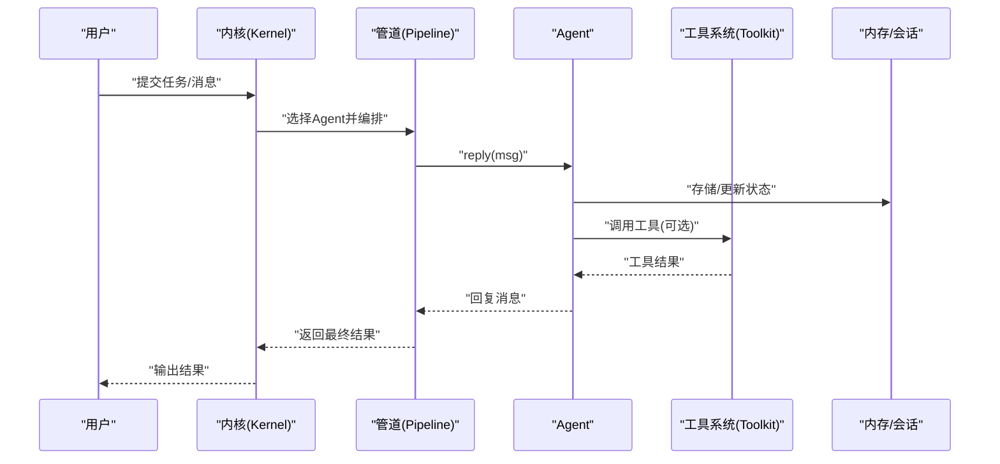

图表来源
- [kernel.rs:60-84](file://macaca/crates/macaca-kernel/src/kernel.rs#L60-L84)
- [pipeline.rs:46-54](file://macaca/crates/macaca-framework/src/pipeline.rs#L46-L54)
- [agent.rs:37-67](file://macaca/crates/macaca-framework/src/agent.rs#L37-L67)
- [tool.rs:314-371](file://macaca/crates/macaca-framework/src/tool.rs#L314-L371)
- [session.rs:101-121](file://macaca/crates/macaca-framework/src/session.rs#L101-L121)

## 详细组件分析

### 事件类型与消息模型
- Msg：统一的消息载体，包含 id、发送者、内容、角色、时间戳、元数据等
- ContentBlock：内容块枚举，支持文本、思考、工具调用/结果、图像/音频/视频
- MsgContent：内容容器，支持纯文本或内容块数组
- 角色 Role：User、Assistant、System、Tool
- 设计要点：消息可序列化，支持 strip_thinking 广播，便于跨 Agent 安全传递

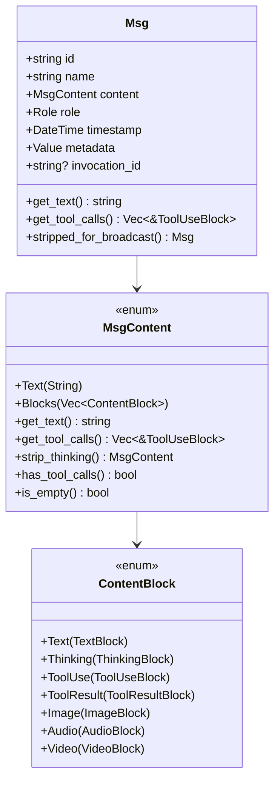

图表来源
- [message.rs:20-335](file://macaca/crates/macaca-framework/src/message.rs#L20-L335)

章节来源
- [message.rs:1-622](file://macaca/crates/macaca-framework/src/message.rs#L1-L622)

### 事件发布/订阅与路由
- 发布：Agent 的 reply/observe、工具执行、计划推进、执行器事件、A2A 消息等均可视为事件产生
- 订阅：内核注册表与调度器选择合适 Agent；管道编排多 Agent 交互；服务适配器桥接 IPC
- 路由：SimpleScheduler 基于任务描述与 Agent 能力匹配；MsgHub/Sequential/Fanout 控制消息流向

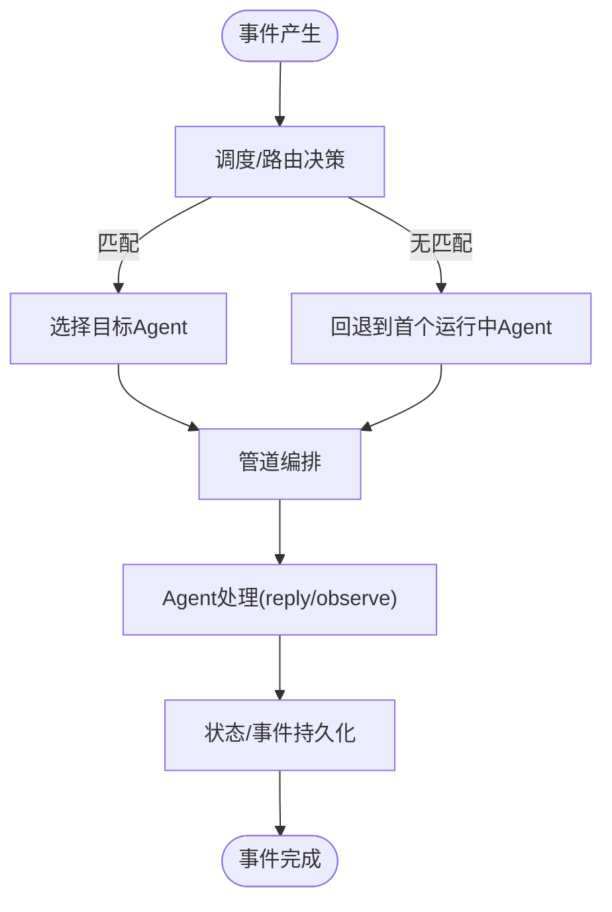

图表来源
- [scheduler.rs:32-84](file://macaca/crates/macaca-kernel/src/scheduler.rs#L32-L84)
- [pipeline.rs:141-202](file://macaca/crates/macaca-framework/src/pipeline.rs#L141-L202)
- [kernel.rs:40-60](file://macaca/crates/macaca-kernel/src/kernel.rs#L40-L60)

章节来源
- [scheduler.rs:1-85](file://macaca/crates/macaca-kernel/src/scheduler.rs#L1-L85)
- [pipeline.rs:1-202](file://macaca/crates/macaca-framework/src/pipeline.rs#L1-L202)
- [kernel.rs:1-136](file://macaca/crates/macaca-kernel/src/kernel.rs#L1-L136)

### 事件处理器与生命周期
- ReActAgent：推理-行动循环，结合工具调用与记忆，支持最大迭代次数与中断
- HookedAgent：在 Agent 周围注入 pre/post 钩子，支持实例级与全局静态钩子
- 事件生命周期：产生 → 广播/观察 → 处理 → 持久化 → 状态更新 → 结果返回

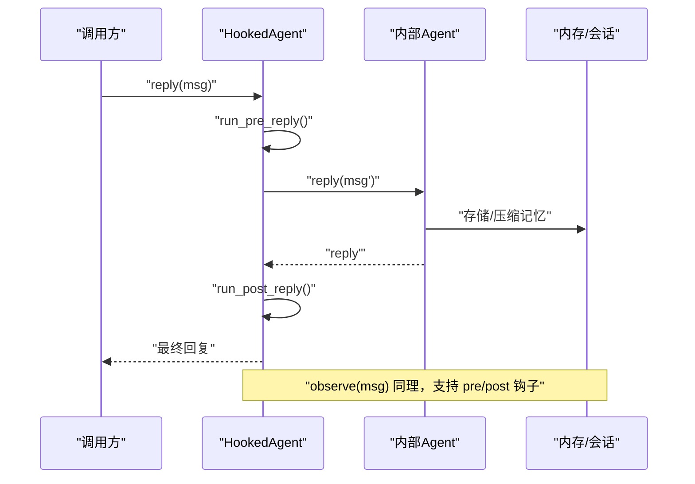

图表来源
- [react_agent.rs:212-285](file://macaca/crates/macaca-framework/src/react_agent.rs#L212-L285)
- [agent.rs:268-309](file://macaca/crates/macaca-framework/src/agent.rs#L268-L309)

章节来源
- [react_agent.rs:1-304](file://macaca/crates/macaca-framework/src/react_agent.rs#L1-L304)
- [agent.rs:1-310](file://macaca/crates/macaca-framework/src/agent.rs#L1-L310)

### 计划与工作流编排
- PlanNotebook：当前计划与历史计划管理，子任务状态机（Todo/InProgress/Done/Abandoned）
- Hint 机制：为 Agent 提供下一步行动提示，驱动循环推进
- 与管道配合：MsgHub/Sequential/Fanout 用于多 Agent 协作与广播

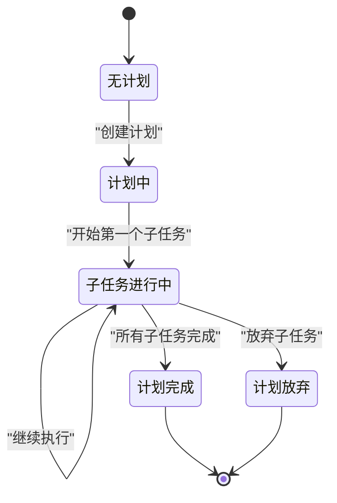

图表来源
- [plan.rs:201-291](file://macaca/crates/macaca-framework/src/plan.rs#L201-L291)

章节来源
- [plan.rs:1-481](file://macaca/crates/macaca-framework/src/plan.rs#L1-L481)
- [pipeline.rs:124-202](file://macaca/crates/macaca-framework/src/pipeline.rs#L124-L202)

### 工具系统与中间件
- 工具注册与组激活：支持预设参数合并、中间件 before/after 链
- 执行顺序：预设参数合并 → 中间件 before → 工具执行 → 中间件 after
- 错误处理：工具错误转换为 ToolResult，反馈至 LLM

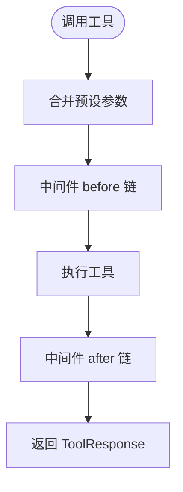

图表来源
- [tool.rs:314-371](file://macaca/crates/macaca-framework/src/tool.rs#L314-L371)

章节来源
- [tool.rs:1-402](file://macaca/crates/macaca-framework/src/tool.rs#L1-L402)

### 会话与状态持久化
- SessionStore：统一的会话存储接口，支持保存/加载/删除/列举
- InMemorySessionStore：分片锁提升并发性能
- StateModule：组件状态序列化/反序列化，支持复合状态字典

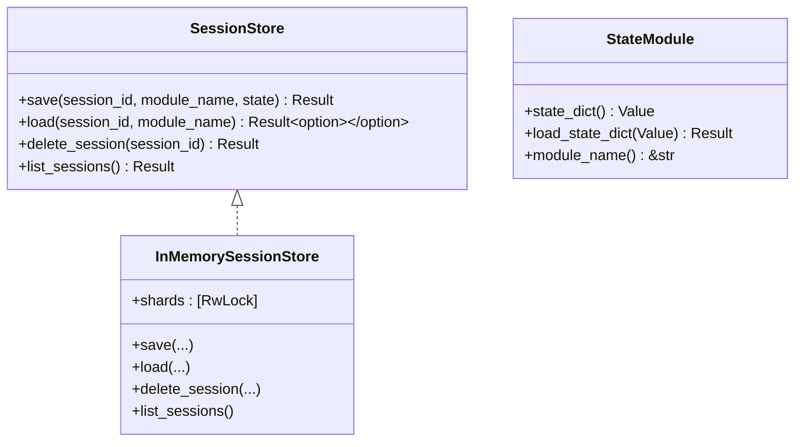

图表来源
- [session.rs:18-95](file://macaca/crates/macaca-framework/src/session.rs#L18-L95)
- [state.rs:13-69](file://macaca/crates/macaca-framework/src/state.rs#L13-L69)

章节来源
- [session.rs:1-121](file://macaca/crates/macaca-framework/src/session.rs#L1-L121)
- [state.rs:1-123](file://macaca/crates/macaca-framework/src/state.rs#L1-L123)

### A2A 协议与跨 Agent 通信
- AgentCard：服务发现，能力标志、默认输入/输出模式、技能清单
- A2AMessage/A2ATask/A2AArtifact：跨 Agent 通信的消息、任务与产物
- A2AFormatter：内部 Msg 与 A2A 类型双向转换，strip_thinking 与文件映射
- FileCardResolver：本地文件解析 AgentCard

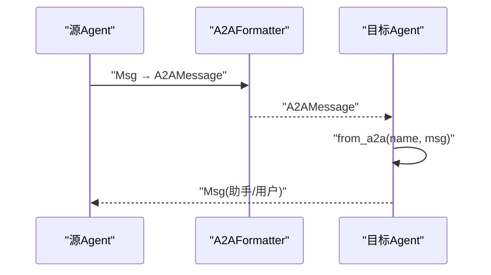

图表来源
- [a2a.rs:214-362](file://macaca/crates/macaca-framework/src/a2a.rs#L214-L362)

章节来源
- [a2a.rs:1-362](file://macaca/crates/macaca-framework/src/a2a.rs#L1-L362)

### 内核与服务适配
- Kernel：注册 Agent、执行 Agent、状态跟踪、调度访问
- Scheduler：基于能力名称匹配与回退策略选择 Agent
- 服务适配：Memory/Ipc/Persist 服务适配器，隔离键空间

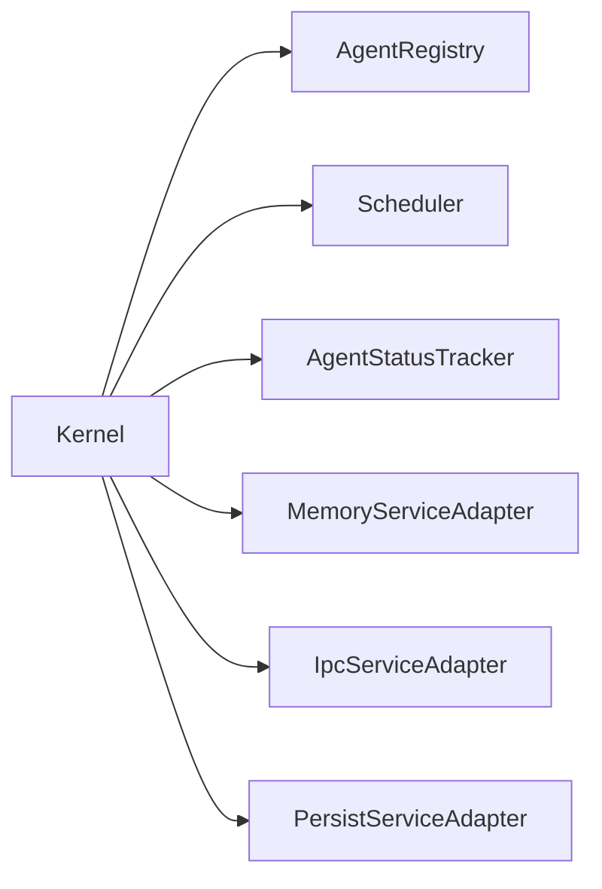

图表来源
- [kernel.rs:15-136](file://macaca/crates/macaca-kernel/src/kernel.rs#L15-L136)
- [scheduler.rs:11-84](file://macaca/crates/macaca-kernel/src/scheduler.rs#L11-L84)
- [services.rs:17-94](file://macaca/crates/macaca-kernel/src/services.rs#L17-L94)

章节来源
- [kernel.rs:1-136](file://macaca/crates/macaca-kernel/src/kernel.rs#L1-L136)
- [scheduler.rs:1-85](file://macaca/crates/macaca-kernel/src/scheduler.rs#L1-L85)
- [services.rs:1-95](file://macaca/crates/macaca-kernel/src/services.rs#L1-L95)

## 依赖关系分析
- 模块耦合：Framework 层提供抽象与实现，Kernel 层负责编排与调度，二者通过协议与 trait 解耦
- 组件内聚：Agent、Pipeline、Tool、Plan、Session、A2A 各自职责清晰，通过消息与接口交互
- 外部依赖：IPC Bus、持久化存储、LLM 提供者、工具集合等通过适配器注入

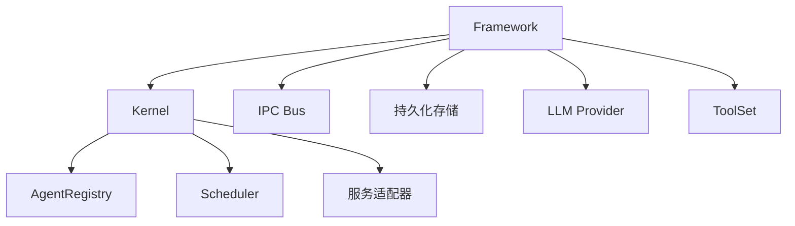

图表来源
- [kernel.rs:1-136](file://macaca/crates/macaca-kernel/src/kernel.rs#L1-L136)
- [services.rs:1-95](file://macaca/crates/macaca-kernel/src/services.rs#L1-L95)

章节来源
- [kernel.rs:1-136](file://macaca/crates/macaca-kernel/src/kernel.rs#L1-L136)
- [services.rs:1-95](file://macaca/crates/macaca-kernel/src/services.rs#L1-L95)

## 性能考量
- 并发与锁：InMemorySessionStore 使用分片锁降低竞争；Agent 内存访问使用互斥锁保护
- 工具执行：中间件链顺序执行，建议将昂贵操作置于链尾或异步执行
- 记忆压缩：ReActAgent 支持自动压缩，减少上下文开销
- 管道并发：FanoutPipeline 支持并行执行，提高吞吐
- 持久化：EventLog 设计采用追加写与通知机制，避免竞态与全量覆盖

章节来源
- [session.rs:33-95](file://macaca/crates/macaca-framework/src/session.rs#L33-L95)
- [tool.rs:314-371](file://macaca/crates/macaca-framework/src/tool.rs#L314-L371)
- [react_agent.rs:99-103](file://macaca/crates/macaca-framework/src/react_agent.rs#L99-L103)
- [pipeline.rs:72-102](file://macaca/crates/macaca-framework/src/pipeline.rs#L72-L102)
- [event-log-redesign.md:161-223](file://macaca/docs/event-log-redesign.md#L161-L223)

## 故障排查指南
- 事件丢失与竞态
  - 现象：SSE lag、刷新丢失、双写竞态、全量覆盖写
  - 处理：采用 EventLog 单一写入点，按会话序列号追加，SSE 仅做通知
- 工具调用失败
  - 现象：工具不存在、权限拒绝、超时
  - 处理：检查工具注册与组激活状态，确认中间件链配置
- Agent 未被选中
  - 现象：任务无人执行
  - 处理：确认 Agent 状态为 Running，能力名称与任务描述匹配
- 计划状态异常
  - 现象：子任务无法推进
  - 处理：检查状态机约束与 Hint 输出，确保单次 InProgress 约束满足
- A2A 协议错误
  - 现象：消息转换失败、字段缺失
  - 处理：校验 Data part 的 kind 字段与必需字段，确保 strip_thinking 后广播

章节来源
- [event-log-redesign.md:107-158](file://macaca/docs/event-log-redesign.md#L107-L158)
- [tool.rs:314-343](file://macaca/crates/macaca-framework/src/tool.rs#L314-L343)
- [scheduler.rs:32-84](file://macaca/crates/macaca-kernel/src/scheduler.rs#L32-L84)
- [plan.rs:194-229](file://macaca/crates/macaca-framework/src/plan.rs#L194-L229)
- [a2a.rs:368-389](file://macaca/crates/macaca-framework/src/a2a.rs#L368-L389)

## 结论
Macaca 的事件驱动架构以统一消息模型为核心，通过 Agent、管道、工具、计划与内核的协同，实现了从简单委托到复杂项目的无缝编排。借助 EventLog 的持久化与通知机制，系统在保证零数据丢失的同时，提升了可观测性与可重放性。建议在生产环境中优先采用 EventLog 追加写与 SSE 通知模式，并结合工具中间件与钩子系统实现可观测与可扩展的事件处理流水线。

## 附录
- 任务路由设计：基于 LLM 的即时委托与项目级任务自动分流，避免额外分类器与二次调用
- 事件持久化重设计：从 SSE 优先转向事件日志优先，消除竞态与丢失风险

章节来源
- [task-routing-design.md:1-199](file://macaca/docs/task-routing-design.md#L1-L199)
- [event-log-redesign.md:1-351](file://macaca/docs/event-log-redesign.md#L1-L351)