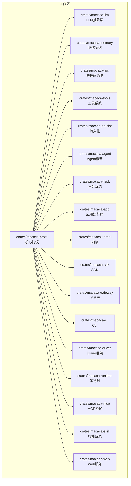
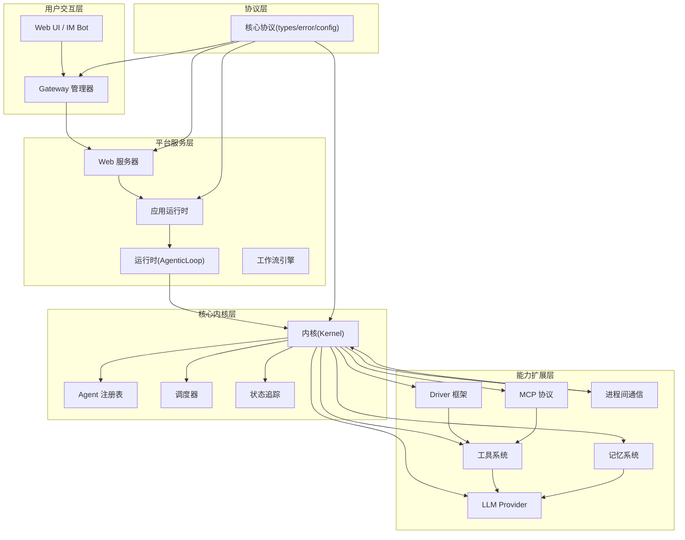
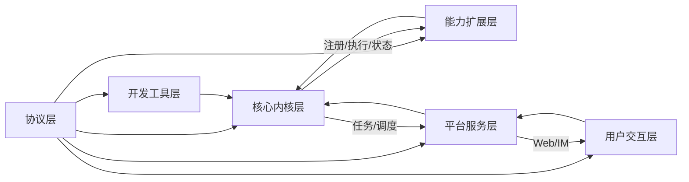

# 分层架构设计

<cite>
**本文档引用的文件**
- [Cargo.toml](file://macaca/Cargo.toml)
- [ARCHITECTURE-v2.md](file://macaca/ARCHITECTURE-v2.md)
- [README.md](file://macaca/README.md)
- [lib.rs](file://macaca/crates/macaca-agent/src/lib.rs)
- [agent.rs](file://macaca/crates/macaca-agent/src/agent.rs)
- [lib.rs](file://macaca/crates/macaca-app/src/lib.rs)
- [runtime.rs](file://macaca/crates/macaca-app/src/runtime.rs)
- [workflow.rs](file://macaca/crates/macaca-app/src/workflow.rs)
- [lib.rs](file://macaca/crates/macaca-kernel/src/lib.rs)
- [kernel.rs](file://macaca/crates/macaca-kernel/src/kernel.rs)
- [status.rs](file://macaca/crates/macaca-kernel/src/status.rs)
- [lib.rs](file://macaca/crates/macaca-runtime/src/lib.rs)
- [agentic_loop.rs](file://macaca/crates/macaca-runtime/src/agentic_loop.rs)
- [lib.rs](file://macaca/crates/macaca-sdk/src/lib.rs)
- [builder.rs](file://macaca/crates/macaca-sdk/src/builder.rs)
- [lib.rs](file://macaca/crates/macaca-cli/src/lib.rs)
- [lib.rs](file://macaca/crates/macaca-driver/src/lib.rs)
- [driver.rs](file://macaca/crates/macaca-driver/src/driver.rs)
- [builtin/mod.rs](file://macaca/crates/macaca-driver/src/builtin/mod.rs)
- [filesystem_driver.rs](file://macaca/crates/macaca-driver/src/builtin/filesystem_driver.rs)
- [shell_driver.rs](file://macaca/crates/macaca-driver/src/builtin/shell_driver.rs)
- [lib.rs](file://macaca/crates/macaca-tools/src/lib.rs)
- [tool.rs](file://macaca/crates/macaca-tools/src/tool.rs)
- [orchestration.rs](file://macaca/crates/macaca-tools/src/orchestration.rs)
- [lib.rs](file://macaca/crates/macaca-memory/src/lib.rs)
- [manager.rs](file://macaca/crates/macaca-memory/src/manager.rs)
- [embedding.rs](file://macaca/crates/macaca-memory/src/embedding.rs)
- [vector.rs](file://macaca/crates/macaca-memory/src/vector.rs)
- [lib.rs](file://macaca/crates/macaca-llm/src/lib.rs)
- [provider.rs](file://macaca/crates/macaca-llm/src/provider.rs)
- [openai.rs](file://macaca/crates/macaca-llm/src/openai.rs)
- [anthropic.rs](file://macaca/crates/macaca-llm/src/anthropic.rs)
- [lib.rs](file://macaca/crates/macaca-ipc/src/lib.rs)
- [bus.rs](file://macaca/crates/macaca-ipc/src/bus.rs)
- [local.rs](file://macaca/crates/macaca-ipc/src/local.rs)
- [nats.rs](file://macaca/crates/macaca-ipc/src/nats.rs)
- [lib.rs](file://macaca/crates/macaca-mcp/src/lib.rs)
- [client.rs](file://macaca/crates/macaca-mcp/src/client.rs)
- [adapter.rs](file://macaca/crates/macaca-mcp/src/adapter.rs)
- [driver.rs](file://macaca/crates/macaca-mcp/src/driver.rs)
- [lib.rs](file://macaca/crates/macaca-gateway/src/lib.rs)
- [gateway.rs](file://macaca/crates/macaca-gateway/src/gateway.rs)
- [telegram.rs](file://macaca/crates/macaca-gateway/src/telegram.rs)
- [discord.rs](file://macaca/crates/macaca-gateway/src/discord.rs)
- [lib.rs](file://macaca/crates/macaca-web/src/lib.rs)
- [routes.rs](file://macaca/crates/macaca-web/src/routes.rs)
- [state.rs](file://macaca/crates/macaca-web/src/state.rs)
- [session.rs](file://macaca/crates/macaca-web/src/session.rs)
- [chat_orchestrator.rs](file://macaca/crates/macaca-web/src/chat_orchestrator.rs)
- [default.toml](file://macaca/config/default.toml)
</cite>

## 目录
1. [简介](#简介)
2. [项目结构](#项目结构)
3. [核心组件](#核心组件)
4. [架构总览](#架构总览)
5. [详细组件分析](#详细组件分析)
6. [依赖分析](#依赖分析)
7. [性能考虑](#性能考虑)
8. [故障排查指南](#故障排查指南)
9. [结论](#结论)
10. [附录](#附录)

## 简介
本文件为 Macaca Agent 操作系统的分层架构设计文档，基于仓库中的架构草稿与实现进行系统性梳理。Macaca OS 是一个面向真实多 Agent 应用的“Agent 操作系统”，其目标是实现 7×24 小时自动规划、自动执行、自我唤醒的主动执行系统，而非一次性对话式助手。

该系统采用七层架构设计，自下而上分别为：
- 协议层（Protocol Layer）
- 开发工具层（Developer Tools Layer）
- 能力扩展层（Capability Layer）
- 核心内核层（Core Kernel Layer）
- 平台服务层（Platform Services Layer）
- 用户交互层（User Interfaces Layer）

每层职责边界清晰，层间通过明确定义的接口与契约进行交互，具备良好的可插拔性与可演进性。文档同时总结了当前实现的问题与修复方向，并给出演进路线与最佳实践建议。

## 项目结构
仓库采用 Rust Workspace 组织，核心模块分布在 crates 目录下，按功能域划分清晰。顶层 Cargo.toml 定义了工作区成员与公共依赖，确保各 crate 之间的统一与协同。

图表来源
- [Cargo.toml:1-25](file://macaca/Cargo.toml#L1-L25)

章节来源
- [Cargo.toml:1-90](file://macaca/Cargo.toml#L1-L90)
- [README.md:13-29](file://macaca/README.md#L13-L29)

## 核心组件
本节对七层架构中的关键组件进行概述，重点说明各层的核心职责、典型实现与交互关系。

- 协议层（Protocol Layer）
  - 职责：定义跨层通信的统一数据模型、错误类型与配置项，确保各层之间契约稳定。
  - 代表实现：macaca-proto，提供 AgentId、TaskId、AgentState、LlmMessage、GatewayEvent 等核心类型与错误处理。
  - 关键路径：[types.rs](file://macaca/crates/macaca-proto/src/types.rs)

- 开发工具层（Developer Tools Layer）
  - 职责：提供开发者友好的构建与调试工具，支持声明式与原生开发方式。
  - 代表实现：macaca-sdk（AgentBuilder、AgentConfig、AgentPersona）、macaca-cli（命令行工具）。
  - 关键路径：[builder.rs](file://macaca/crates/macaca-sdk/src/builder.rs)、[lib.rs](file://macaca/crates/macaca-cli/src/lib.rs)

- 能力扩展层（Capability Layer）
  - 职责：抽象外部系统的能力接口，通过 Driver/Tool 将任意软件能力转化为 Agent 可用的工具集。
  - 代表实现：macaca-driver（SoftwareDriver Trait、内置 Shell/Filesystem 驱动）、macaca-tools（Tool Trait、ToolSet 聚合）、macaca-memory（记忆系统三层架构）、macaca-llm（LLM Provider 抽象）、macaca-mcp（MCP 协议适配）。
  - 关键路径：[driver.rs](file://macaca/crates/macaca-driver/src/driver.rs)、[tool.rs](file://macaca/crates/macaca-tools/src/tool.rs)、[manager.rs](file://macaca/crates/macaca-memory/src/manager.rs)、[provider.rs](file://macaca/crates/macaca-llm/src/provider.rs)、[client.rs](file://macaca/crates/macaca-mcp/src/client.rs)

- 核心内核层（Core Kernel Layer）
  - 职责：全局协调与编排，负责 Agent 注册、生命周期管理、任务调度与状态追踪。
  - 代表实现：macaca-kernel（Kernel、AgentRegistry、Scheduler、StatusTracker）。
  - 关键路径：[kernel.rs](file://macaca/crates/macaca-kernel/src/kernel.rs)、[status.rs](file://macaca/crates/macaca-kernel/src/status.rs)

- 平台服务层（Platform Services Layer）
  - 职责：提供运行时服务与基础设施，包括应用运行时、工作流引擎、Web 服务、IM 网关等。
  - 代表实现：macaca-app（AppRuntime、WorkflowEngine）、macaca-runtime（AgenticLoop）、macaca-web（REST API、SSE、会话存储）、macaca-gateway（Telegram/Discord 适配器）。
  - 关键路径：[runtime.rs](file://macaca/crates/macaca-app/src/runtime.rs)、[workflow.rs](file://macaca/crates/macaca-app/src/workflow.rs)、[agentic_loop.rs](file://macaca/crates/macaca-runtime/src/agentic_loop.rs)、[routes.rs](file://macaca/crates/macaca-web/src/routes.rs)、[gateway.rs](file://macaca/crates/macaca-gateway/src/gateway.rs)

- 用户交互层（User Interfaces Layer）
  - 职责：提供多种用户接入方式，包括 Web UI、IM Bot（Telegram、Discord 等），并通过 SSE 实时推送状态。
  - 代表实现：macaca-web（Next.js Web 服务器）、macaca-gateway（IM 网关管理器）。
  - 关键路径：[lib.rs](file://macaca/crates/macaca-web/src/lib.rs)、[telegram.rs](file://macaca/crates/macaca-gateway/src/telegram.rs)、[discord.rs](file://macaca/crates/macaca-gateway/src/discord.rs)

章节来源
- [ARCHITECTURE-v2.md:257-275](file://macaca/ARCHITECTURE-v2.md#L257-L275)
- [ARCHITECTURE-v2.md:216-254](file://macaca/ARCHITECTURE-v2.md#L216-L254)
- [ARCHITECTURE-v2.md:113-213](file://macaca/ARCHITECTURE-v2.md#L113-L213)
- [ARCHITECTURE-v2.md:55-110](file://macaca/ARCHITECTURE-v2.md#L55-L110)
- [ARCHITECTURE-v2.md:31-52](file://macaca/ARCHITECTURE-v2.md#L31-L52)

## 架构总览
下图展示了七层架构的总体关系与数据流向，强调从用户交互到内核执行再到能力扩展的完整链路。

图表来源
- [ARCHITECTURE-v2.md:18-275](file://macaca/ARCHITECTURE-v2.md#L18-L275)

## 详细组件分析

### 协议层（Protocol Layer）
- 职责边界
  - 定义跨层通用的数据结构、枚举与错误类型，确保各层契约稳定且可演进。
  - 提供配置项与默认值，作为上层行为的约束与参考。
- 组件构成
  - 核心类型：AgentId、TaskId、AgentState、Task、LlmMessage、GatewayEvent 等。
  - 错误体系：MacacaError，统一异常处理与传播。
  - 配置：KernelConfig、LlmConfig 等。
- 数据流向
  - 下游层（如 App/Runtime/Web/Gateway）在处理业务时，严格遵循协议层定义的类型与规则，避免自定义扩展导致的耦合。
- 优势与约束
  - 优势：类型安全、契约明确、便于测试与模拟；约束：新增字段需向后兼容，变更需谨慎评估影响面。
- 代码示例路径
  - [types.rs](file://macaca/crates/macaca-proto/src/types.rs)
  - [error.rs](file://macaca/crates/macaca-proto/src/error.rs)
  - [config.rs](file://macaca/crates/macaca-proto/src/config.rs)

章节来源
- [ARCHITECTURE-v2.md:257-275](file://macaca/ARCHITECTURE-v2.md#L257-L275)

### 开发工具层（Developer Tools Layer）
- 职责边界
  - 为开发者提供声明式与原生开发两种路径，降低接入门槛并提升可维护性。
  - 提供 CLI 工具，支撑本地开发、调试与运维。
- 组件构成
  - SDK：AgentBuilder、AgentConfig、AgentPersona，支持从 YAML/TOML 配置注册 Agent。
  - CLI：macaca run/web/agents/status/version 等常用命令。
- 交互关系
  - SDK 通过 Kernel API 注册 Agent；CLI 启动内核与网关，串联平台服务层。
- 优势与约束
  - 优势：声明式开发（L3）易维护、可版本化；原生开发（L1）灵活可控；约束：需保持 SDK 与内核契约稳定。
- 代码示例路径
  - [builder.rs](file://macaca/crates/macaca-sdk/src/builder.rs)
  - [lib.rs](file://macaca/crates/macaca-cli/src/lib.rs)

章节来源
- [ARCHITECTURE-v2.md:216-254](file://macaca/ARCHITECTURE-v2.md#L216-L254)

### 能力扩展层（Capability Layer）
- 职责边界
  - 将外部系统能力抽象为统一的 Tool 接口，屏蔽底层差异，使 Agent 可以组合使用多种能力。
- 组件构成
  - Driver 框架：SoftwareDriver Trait，支持 CLI、REST、UI 自动化、文件/IPC、MCP 等类型。
  - 工具系统：Tool Trait、ToolSet 聚合，内置 file_read、file_write、shell、web_search 等工具。
  - 记忆系统：Session/File/Vector 三层架构，支持可插拔嵌入与向量存储。
  - LLM Provider：抽象 OpenAI、Anthropic、DashScope 等多家提供商，统一工具调用与成本追踪。
  - MCP 协议：将 MCP 工具转换为 Macaca Tool，支持 stdio 与 SSE 传输。
  - IPC：Pub/Sub、P2P、Request/Reply 三种通信模式，NATS 为默认后端。
- 交互关系
  - Agent 通过 ToolSet 获取可用工具；工具执行可能依赖记忆与 LLM；Driver 作为工具来源。
- 优势与约束
  - 优势：能力复用、可插拔替换、统一错误与日志；约束：Driver/Tool 的健康检查与资源回收需完善。
- 代码示例路径
  - [driver.rs](file://macaca/crates/macaca-driver/src/driver.rs)
  - [tool.rs](file://macaca/crates/macaca-tools/src/tool.rs)
  - [manager.rs](file://macaca/crates/macaca-memory/src/manager.rs)
  - [provider.rs](file://macaca/crates/macaca-llm/src/provider.rs)
  - [client.rs](file://macaca/crates/macaca-mcp/src/client.rs)
  - [bus.rs](file://macaca/crates/macaca-ipc/src/bus.rs)

章节来源
- [ARCHITECTURE-v2.md:113-213](file://macaca/ARCHITECTURE-v2.md#L113-L213)

### 核心内核层（Core Kernel Layer）
- 职责边界
  - 全局协调：注册 Agent、管理生命周期、分配任务、追踪状态；提供统一的执行入口与编排能力。
- 组件构成
  - Kernel：中央协调器，提供 register_agent、execute_agent 等关键方法。
  - AgentRegistry：存储 Agent 与其元数据，管理生命周期。
  - Scheduler：任务分配与负载均衡。
  - StatusTracker：运行时状态与活动追踪，支持 SSE 推送。
- 交互关系
  - Runtime 通过 Kernel 执行 Agent；Kernel 与 Driver/Tools/Memory/LLM 等协作完成任务。
- 优势与约束
  - 优势：集中控制、可观测性强；约束：需保证高可用与一致性，避免成为瓶颈。
- 代码示例路径
  - [kernel.rs](file://macaca/crates/macaca-kernel/src/kernel.rs)
  - [status.rs](file://macaca/crates/macaca-kernel/src/status.rs)

章节来源
- [ARCHITECTURE-v2.md:55-110](file://macaca/ARCHITECTURE-v2.md#L55-L110)

### 平台服务层（Platform Services Layer）
- 职责边界
  - 提供应用运行时、Web 服务、IM 网关与会话管理等平台能力，支撑用户交互与任务编排。
- 组件构成
  - AppRuntime：应用发现、配置加载、生命周期管理、工作流引擎。
  - Runtime：AgenticLoop 核心循环，支持工具调用与反馈回路。
  - Web：REST API、SSE 流、会话存储（redb），提供 Web UI 基础设施。
  - Gateway：IM 网关管理器，支持 Telegram、Discord 等适配器。
- 交互关系
  - Web 与 Gateway 将用户请求路由至 AppRuntime/Kernel；SSE 推送状态变化；会话存储持久化状态。
- 优势与约束
  - 优势：多接入点、实时反馈、可扩展；约束：需处理并发与一致性，保障事件顺序与幂等。
- 代码示例路径
  - [runtime.rs](file://macaca/crates/macaca-app/src/runtime.rs)
  - [workflow.rs](file://macaca/crates/macaca-app/src/workflow.rs)
  - [agentic_loop.rs](file://macaca/crates/macaca-runtime/src/agentic_loop.rs)
  - [routes.rs](file://macaca/crates/macaca-web/src/routes.rs)
  - [gateway.rs](file://macaca/crates/macaca-gateway/src/gateway.rs)

章节来源
- [ARCHITECTURE-v2.md:31-52](file://macaca/ARCHITECTURE-v2.md#L31-L52)

### 用户交互层（User Interfaces Layer）
- 职责边界
  - 提供 Web UI 与 IM Bot 接入，统一用户入口与状态展示。
- 组件构成
  - Web UI：Next.js 前端，结合 SSE 实时展示 Agent 状态与执行进度。
  - IM Bot：Gateway 适配 Telegram、Discord 等，接收用户指令并转发至内核。
- 交互关系
  - 用户通过 Web 或 IM 发起请求，经由 Gateway/Web 进入平台服务层，最终由 Kernel 调度 Agent 执行。
- 优势与约束
  - 优势：多入口一致体验；约束：需保证事件去重与状态一致性。
- 代码示例路径
  - [lib.rs](file://macaca/crates/macaca-web/src/lib.rs)
  - [telegram.rs](file://macaca/crates/macaca-gateway/src/telegram.rs)
  - [discord.rs](file://macaca/crates/macaca-gateway/src/discord.rs)

章节来源
- [ARCHITECTURE-v2.md:18-28](file://macaca/ARCHITECTURE-v2.md#L18-L28)

## 依赖分析
下图展示各层之间的依赖关系与数据流向，突出内核作为中枢协调者的地位以及平台服务层对用户交互层的支撑。

图表来源
- [ARCHITECTURE-v2.md:18-275](file://macaca/ARCHITECTURE-v2.md#L18-L275)

章节来源
- [ARCHITECTURE-v2.md:18-275](file://macaca/ARCHITECTURE-v2.md#L18-L275)

## 性能考虑
- 可插拔组件的性能权衡
  - 记忆系统：Session/File/Vector 三层架构在延迟与准确性之间提供平衡，建议根据场景选择合适的向量存储与嵌入模型。
  - LLM Provider：工具调用与速率限制需结合实际提供商策略，避免超限与退避。
  - Driver/Tool：异步执行与超时控制至关重要，建议为每个工具设置合理的超时与重试策略。
- 内核与运行时
  - AgenticLoop 的最大迭代次数与工具超时应结合业务复杂度调整，避免长时间阻塞。
  - 状态追踪与 SSE 推送需注意频率控制，防止前端压力过大。
- 平台服务
  - Web 与 Gateway 的并发处理能力需与内核调度能力相匹配，避免队列积压。
  - 会话存储（redb）的写放大与查询优化需持续监控与调优。

## 故障排查指南
- Chat 请求绕过 Agent 系统
  - 症状：Agent 状态始终显示 IDLE。
  - 原因：Web 层直接调用 LLM，未经过 Kernel 的 Agent 执行。
  - 修复：将 Chat 路由改为通过 Coordinator Agent 处理，使用 AgenticLoop 执行 Agent 并更新状态。
  - 参考路径：[routes.rs](file://macaca/crates/macaca-web/src/routes.rs)、[agentic_loop.rs](file://macaca/crates/macaca-runtime/src/agentic_loop.rs)
- Agent 状态更新不完整
  - 症状：仅 execute_agent 会更新状态，Agent 内部活动无细粒度状态。
  - 修复：在 AgenticLoop 中增加状态更新钩子，或通过回调函数让 Agent 报告状态变化。
  - 参考路径：[status.rs](file://macaca/crates/macaca-kernel/src/status.rs)、[agentic_loop.rs](file://macaca/crates/macaca-runtime/src/agentic_loop.rs)
- Workflow 引擎未集成
  - 症状：app.yaml 中定义了 workflow，但 Chat 未使用。
  - 修复：实现 WorkflowEngine，将 Chat 请求触发 workflow 执行，每个步骤对应 Agent 执行。
  - 参考路径：[workflow.rs](file://macaca/crates/macaca-app/src/workflow.rs)、[runtime.rs](file://macaca/crates/macaca-app/src/runtime.rs)

章节来源
- [ARCHITECTURE-v2.md:567-600](file://macaca/ARCHITECTURE-v2.md#L567-L600)

## 结论
Macaca OS 的七层架构设计清晰地划分了职责边界，实现了从协议到用户交互的全栈覆盖。通过可插拔的 Driver/Tool/Llm/Memory 等组件，系统具备强大的扩展能力；通过 Kernel 的集中编排与状态追踪，系统具备良好的可观测性与一致性。当前阶段的关键挑战在于修复 Chat 流程以正确使用 Agent 系统、完善状态追踪的细粒度更新以及集成 Workflow 引擎。随着这些改进的落地，系统将更接近“7×24 小时自动规划、自动执行、自我唤醒”的目标。

## 附录
- 架构演进历史与未来规划
  - 当前版本以“非官方深度参考”形式存在，后续将与“系统定义文档”解耦，形成稳定的架构契约与演进路线。
  - 未来规划包括：完善工作流引擎、增强状态追踪、引入 WASM 应用支持、优化性能与可扩展性。
- 关键文件索引
  - 协议层：[types.rs](file://macaca/crates/macaca-proto/src/types.rs)
  - 开发工具层：[builder.rs](file://macaca/crates/macaca-sdk/src/builder.rs)、[lib.rs](file://macaca/crates/macaca-cli/src/lib.rs)
  - 能力扩展层：[driver.rs](file://macaca/crates/macaca-driver/src/driver.rs)、[tool.rs](file://macaca/crates/macaca-tools/src/tool.rs)、[manager.rs](file://macaca/crates/macaca-memory/src/manager.rs)、[provider.rs](file://macaca/crates/macaca-llm/src/provider.rs)、[client.rs](file://macaca/crates/macaca-mcp/src/client.rs)、[bus.rs](file://macaca/crates/macaca-ipc/src/bus.rs)
  - 核心内核层：[kernel.rs](file://macaca/crates/macaca-kernel/src/kernel.rs)、[status.rs](file://macaca/crates/macaca-kernel/src/status.rs)
  - 平台服务层：[runtime.rs](file://macaca/crates/macaca-app/src/runtime.rs)、[workflow.rs](file://macaca/crates/macaca-app/src/workflow.rs)、[agentic_loop.rs](file://macaca/crates/macaca-runtime/src/agentic_loop.rs)、[routes.rs](file://macaca/crates/macaca-web/src/routes.rs)、[gateway.rs](file://macaca/crates/macaca-gateway/src/gateway.rs)
  - 用户交互层：[lib.rs](file://macaca/crates/macaca-web/src/lib.rs)、[telegram.rs](file://macaca/crates/macaca-gateway/src/telegram.rs)、[discord.rs](file://macaca/crates/macaca-gateway/src/discord.rs)