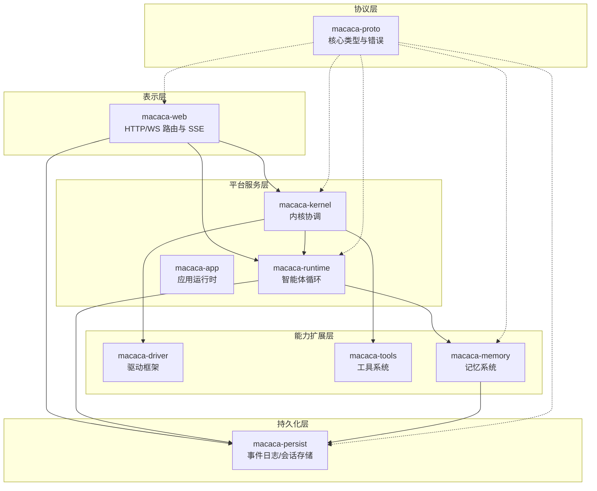
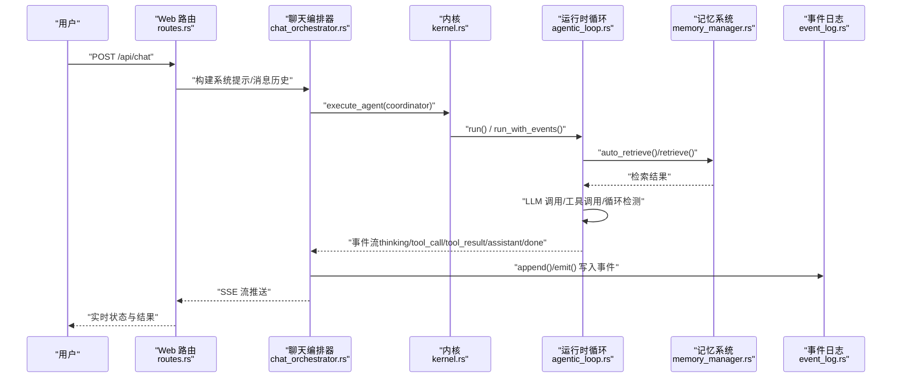
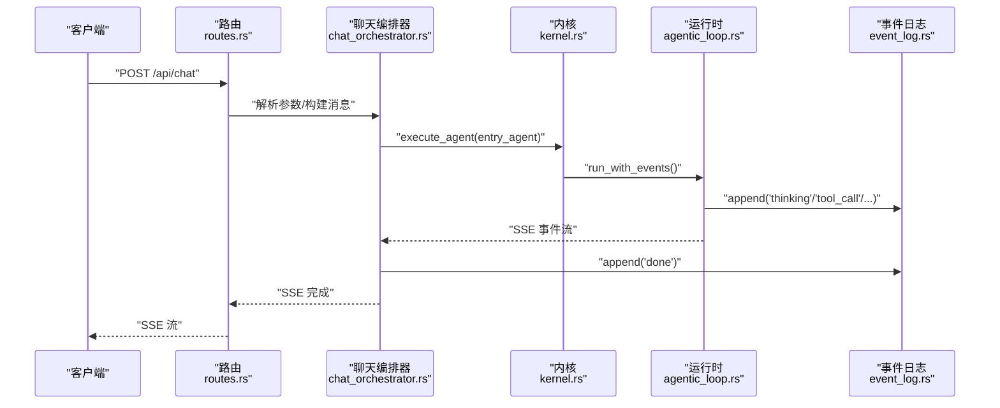
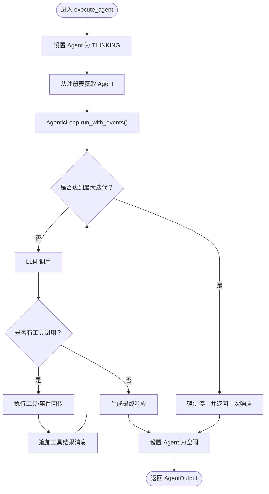
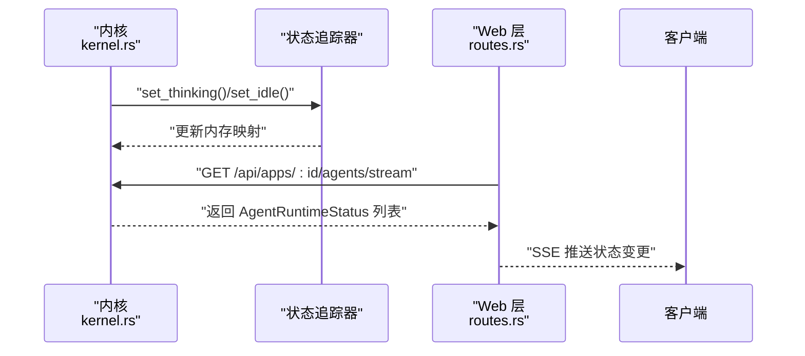
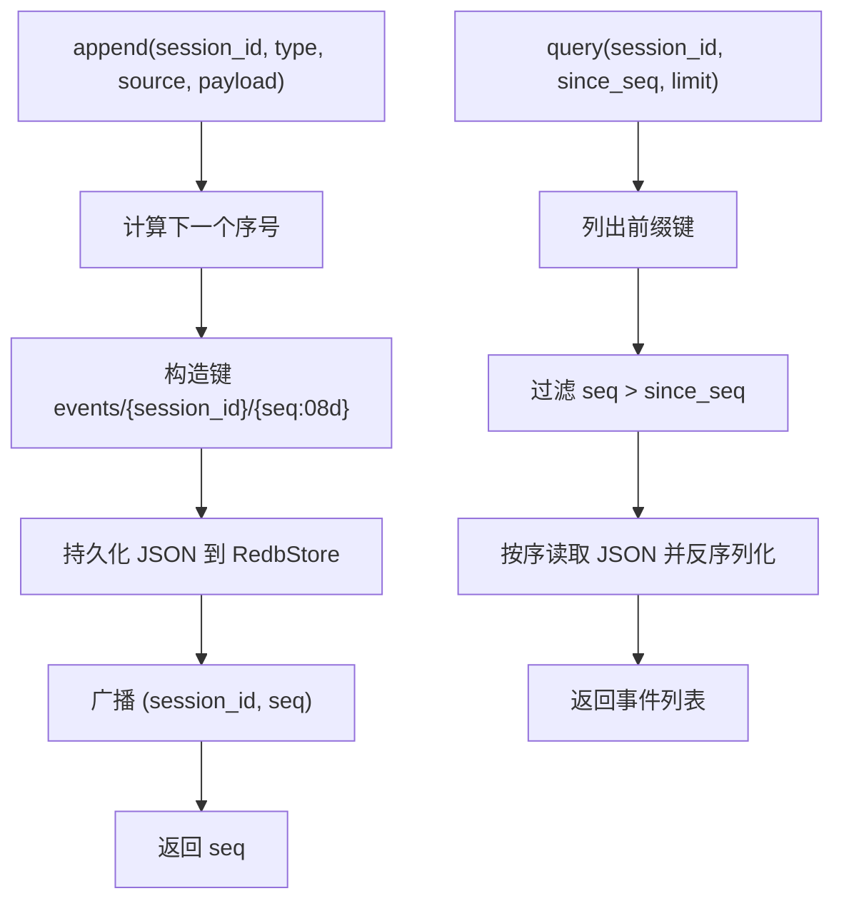
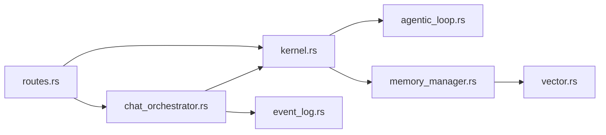

# 数据流分析

<cite>
**本文档引用的文件**
- [ARCHITECTURE-v2.md](file://macaca/ARCHITECTURE-v2.md)
- [Cargo.toml](file://macaca/Cargo.toml)
- [routes.rs](file://macaca/crates/macaca-web/src/routes.rs)
- [chat_orchestrator.rs](file://macaca/crates/macaca-web/src/chat_orchestrator.rs)
- [kernel.rs](file://macaca/crates/macaca-kernel/src/kernel.rs)
- [agentic_loop.rs](file://macaca/crates/macaca-runtime/src/agentic_loop.rs)
- [manager.rs](file://macaca/crates/macaca-memory/src/manager.rs)
- [vector.rs](file://macaca/crates/macaca-memory/src/vector.rs)
- [event_log.rs](file://macaca/crates/macaca-persist/src/event_log.rs)
- [types.rs](file://macaca/crates/macaca-proto/src/types.rs)
</cite>

## 目录
1. [简介](#简介)
2. [项目结构](#项目结构)
3. [核心组件](#核心组件)
4. [架构总览](#架构总览)
5. [详细组件分析](#详细组件分析)
6. [依赖关系分析](#依赖关系分析)
7. [性能考虑](#性能考虑)
8. [故障排查指南](#故障排查指南)
9. [结论](#结论)
10. [附录](#附录)

## 简介
本文件针对 Macaca Agent 操作系统的数据流进行系统性分析，覆盖用户请求处理、Agent 执行、状态更新与事件日志等关键路径。重点阐述数据在各层之间的转换与传递机制，数据格式标准化与序列化策略，以及会话数据、长期存储与向量检索的数据管理方式。同时提供数据流可视化图表与性能瓶颈分析，并总结数据安全与隐私保护要点。

## 项目结构
Macaca 采用多 Crate 的 Rust 工作区组织，核心模块按职责分层：
- 表示层：macaca-web（HTTP/WS 路由、SSE、会话与事件持久化）
- 平台服务层：macaca-kernel（内核协调）、macaca-runtime（智能体循环）、macaca-app（应用运行时）
- 能力扩展层：macaca-driver（驱动框架）、macaca-tools（工具系统）、macaca-memory（记忆系统）
- 协议层：macaca-proto（核心类型与错误）
- 持久化层：macaca-persist（事件日志、会话存储）

**图表来源**
- [Cargo.toml:1-25](file://macaca/Cargo.toml#L1-L25)
- [ARCHITECTURE-v2.md:16-275](file://macaca/ARCHITECTURE-v2.md#L16-L275)

**章节来源**
- [Cargo.toml:1-25](file://macaca/Cargo.toml#L1-L25)
- [ARCHITECTURE-v2.md:16-275](file://macaca/ARCHITECTURE-v2.md#L16-L275)

## 核心组件
- 核心类型与协议：统一的标识符（AgentId、TaskId、ApplicationId 等）、消息格式（LlmMessage、ToolCall）、状态模型（AgentState、AgentActivity）、事件条目（EventEntry）等，确保跨模块数据一致性。
- Web 层：提供 REST API 与 SSE，负责会话管理、事件持久化与实时状态广播。
- 内核：注册与执行 Agent，维护状态追踪，协调 LLM 与工具集。
- 运行时：实现 ReAct 风格的智能体循环，支持工具调用、上下文窗口管理、循环检测与权限校验。
- 记忆系统：会话层（短期）、文件层（长期）、向量层（语义检索），统一存储与检索。
- 持久化：事件日志（只追加）、会话存储（RedbStore）。

**章节来源**
- [types.rs:1-800](file://macaca/crates/macaca-proto/src/types.rs#L1-L800)
- [routes.rs:1-791](file://macaca/crates/macaca-web/src/routes.rs#L1-L791)
- [kernel.rs:1-256](file://macaca/crates/macaca-kernel/src/kernel.rs#L1-L256)
- [agentic_loop.rs:1-800](file://macaca/crates/macaca-runtime/src/agentic_loop.rs#L1-L800)
- [manager.rs:1-222](file://macaca/crates/macaca-memory/src/manager.rs#L1-L222)
- [event_log.rs:1-276](file://macaca/crates/macaca-persist/src/event_log.rs#L1-L276)

## 架构总览
下图展示从用户请求到 Agent 执行、状态更新与事件日志的关键数据流路径。

**图表来源**
- [routes.rs:268-400](file://macaca/crates/macaca-web/src/routes.rs#L268-L400)
- [chat_orchestrator.rs:268-800](file://macaca/crates/macaca-web/src/chat_orchestrator.rs#L268-L800)
- [kernel.rs:66-84](file://macaca/crates/macaca-kernel/src/kernel.rs#L66-L84)
- [agentic_loop.rs:214-348](file://macaca/crates/macaca-runtime/src/agentic_loop.rs#L214-L348)
- [manager.rs:74-119](file://macaca/crates/macaca-memory/src/manager.rs#L74-L119)
- [event_log.rs:93-122](file://macaca/crates/macaca-persist/src/event_log.rs#L93-L122)

## 详细组件分析

### 用户请求处理流程
- Web 层接收请求后，解析 app_id、prompt、session_id 等参数，构建系统提示与消息历史。
- 选择入口 Agent（优先 manifest.entry_agent > 首个工作流步骤 > 首个声明 Agent），准备 persona 与工作区信息。
- 启动聊天编排器，创建 SSE 通道与取消标志，订阅执行器事件，收集代理轨迹。
- 调用内核执行入口 Agent，运行时循环处理 LLM 与工具调用，期间写入事件日志。
- 最终汇总 token 使用、迭代次数与工具使用情况，持久化会话并返回 SSE 结束事件。

**图表来源**
- [routes.rs:268-400](file://macaca/crates/macaca-web/src/routes.rs#L268-L400)
- [chat_orchestrator.rs:268-800](file://macaca/crates/macaca-web/src/chat_orchestrator.rs#L268-L800)
- [kernel.rs:66-84](file://macaca/crates/macaca-kernel/src/kernel.rs#L66-L84)
- [agentic_loop.rs:284-348](file://macaca/crates/macaca-runtime/src/agentic_loop.rs#L284-L348)
- [event_log.rs:93-122](file://macaca/crates/macaca-persist/src/event_log.rs#L93-L122)

**章节来源**
- [routes.rs:268-400](file://macaca/crates/macaca-web/src/routes.rs#L268-L400)
- [chat_orchestrator.rs:268-800](file://macaca/crates/macaca-web/src/chat_orchestrator.rs#L268-L800)

### Agent 执行流程
- 内核标记 Agent 为思考状态，获取注册表中的 Agent 实例并调用其 run 方法。
- 运行时循环注入工具定义，按迭代上限执行 LLM 调用与工具调用，事件通过通道回传。
- 循环内置循环检测与上下文窗口管理，支持暂停/恢复与委托任务合并。
- 执行完成后重置为空闲状态，输出最终结果与累计 token 使用。

**图表来源**
- [kernel.rs:66-84](file://macaca/crates/macaca-kernel/src/kernel.rs#L66-L84)
- [agentic_loop.rs:214-348](file://macaca/crates/macaca-runtime/src/agentic_loop.rs#L214-L348)

**章节来源**
- [kernel.rs:66-84](file://macaca/crates/macaca-kernel/src/kernel.rs#L66-L84)
- [agentic_loop.rs:214-348](file://macaca/crates/macaca-runtime/src/agentic_loop.rs#L214-L348)

### 状态更新流程
- 内核在执行前后分别设置 Agent 的活动状态（思考/空闲），并维护运行时状态映射。
- Web 层通过 SSE 轮询拉取状态列表，前端据此更新面板显示。
- 状态结构包含 AgentId、名称、生命周期状态、当前活动、更新时间与当前任务描述。

**图表来源**
- [kernel.rs:71-81](file://macaca/crates/macaca-kernel/src/kernel.rs#L71-L81)
- [routes.rs:267-341](file://macaca/crates/macaca-web/src/routes.rs#L267-L341)
- [types.rs:248-262](file://macaca/crates/macaca-proto/src/types.rs#L248-L262)

**章节来源**
- [kernel.rs:71-81](file://macaca/crates/macaca-kernel/src/kernel.rs#L71-L81)
- [routes.rs:267-341](file://macaca/crates/macaca-web/src/routes.rs#L267-L341)
- [types.rs:248-262](file://macaca/crates/macaca-proto/src/types.rs#L248-L262)

### 事件日志流程
- 事件日志采用只追加设计，每个会话拥有独立单调递增序列号，键空间为 events/{session_id}/{seq:08d}。
- 写入时立即落盘并广播通知，查询支持从指定序号起按限制数量返回。
- Web 层在聊天编排器中写入各类事件（思考、工具调用、工具结果、助手文本、完成、错误等），用于前端实时展示与审计。

**图表来源**
- [event_log.rs:93-157](file://macaca/crates/macaca-persist/src/event_log.rs#L93-L157)

**章节来源**
- [event_log.rs:93-157](file://macaca/crates/macaca-persist/src/event_log.rs#L93-L157)
- [chat_orchestrator.rs:527-791](file://macaca/crates/macaca-web/src/chat_orchestrator.rs#L527-L791)

### 数据格式标准化与序列化策略
- 核心类型统一使用 serde_json 进行序列化，UUID 作为唯一标识符，时间字段采用 chrono::Utc。
- LLM 消息与工具调用遵循标准格式，便于跨模块传递与外部 LLM 提供商兼容。
- 事件日志与会话存储均以 JSON Blob 形式持久化，保证可审计与可重建。

**章节来源**
- [types.rs:643-704](file://macaca/crates/macaca-proto/src/types.rs#L643-L704)
- [event_log.rs:104-111](file://macaca/crates/macaca-persist/src/event_log.rs#L104-L111)

### 数据持久化与缓存策略
- 会话数据：Web 层在执行前即写入初始会话状态，确保浏览器刷新后也能看到运行中会话；随后在执行完成后更新为完成状态并持久化。
- 长期存储：文件层持久化记忆条目，支持跨会话保留；向量层通过嵌入与 Milvus/内存向量库实现语义检索。
- 缓存：Web 层维护会话内存缓存与 SSE 广播通道，减少重复查询与前端轮询开销。

**章节来源**
- [chat_orchestrator.rs:455-700](file://macaca/crates/macaca-web/src/chat_orchestrator.rs#L455-L700)
- [manager.rs:40-71](file://macaca/crates/macaca-memory/src/manager.rs#L40-L71)
- [vector.rs:106-205](file://macaca/crates/macaca-memory/src/vector.rs#L106-L205)

### 向量检索的数据管理
- 记忆管理器并发写入会话与文件层，异步执行嵌入并将向量与负载写入向量存储。
- 检索阶段并行查询会话/文件层，再查询向量层并去重，最后按创建时间排序截断。
- Milvus 向量存储支持 REST API 插入、搜索与删除，内存向量存储用于测试与小规模场景。

**章节来源**
- [manager.rs:74-119](file://macaca/crates/macaca-memory/src/manager.rs#L74-L119)
- [vector.rs:106-205](file://macaca/crates/macaca-memory/src/vector.rs#L106-L205)

## 依赖关系分析
- Web 层依赖内核与运行时，通过 SSE 与事件日志实现前端交互与审计。
- 内核依赖注册表、调度器与状态追踪器，协调 Agent 生命周期。
- 运行时依赖 LLM 提供商与工具集，结合记忆系统与持久化层完成端到端执行。
- 记忆系统与向量存储解耦，可通过配置切换不同实现。

**图表来源**
- [routes.rs:1-791](file://macaca/crates/macaca-web/src/routes.rs#L1-L791)
- [kernel.rs:1-256](file://macaca/crates/macaca-kernel/src/kernel.rs#L1-L256)
- [agentic_loop.rs:1-800](file://macaca/crates/macaca-runtime/src/agentic_loop.rs#L1-L800)
- [manager.rs:1-222](file://macaca/crates/macaca-memory/src/manager.rs#L1-L222)
- [vector.rs:1-338](file://macaca/crates/macaca-memory/src/vector.rs#L1-L338)
- [event_log.rs:1-276](file://macaca/crates/macaca-persist/src/event_log.rs#L1-L276)

**章节来源**
- [routes.rs:1-791](file://macaca/crates/macaca-web/src/routes.rs#L1-L791)
- [kernel.rs:1-256](file://macaca/crates/macaca-kernel/src/kernel.rs#L1-L256)
- [agentic_loop.rs:1-800](file://macaca/crates/macaca-runtime/src/agentic_loop.rs#L1-L800)
- [manager.rs:1-222](file://macaca/crates/macaca-memory/src/manager.rs#L1-L222)
- [vector.rs:1-338](file://macaca/crates/macaca-memory/src/vector.rs#L1-L338)
- [event_log.rs:1-276](file://macaca/crates/macaca-persist/src/event_log.rs#L1-L276)

## 性能考虑
- SSE 广播与事件日志写入：采用广播通道与立即落盘策略，确保前端低延迟感知与高可靠性；建议在高并发场景下评估事件频率与序列号缓存命中率。
- 记忆检索：会话/文件层并行查询与向量层异步嵌入，建议对高频查询建立索引与缓存热点；向量搜索限制返回数量以控制网络与解析开销。
- 运行时循环：迭代上限与工具超时可配置，避免长尾任务占用资源；上下文窗口裁剪减少 LLM 输入成本。
- 向量存储：Milvus 需要网络与数据库可用性保障；内存向量存储适合小规模测试，生产环境建议使用分布式向量库。

[本节为通用指导，无需特定文件引用]

## 故障排查指南
- LLM 错误诊断：根据错误字符串特征（网络、认证、限流、无效请求、服务器错误、超时）给出针对性建议。
- 事件日志查询：通过 since_seq 与 limit 参数实现增量拉取，避免全量扫描；确认会话隔离与键空间命名规范。
- 会话状态异常：检查内核状态追踪是否正确更新，确认 SSE 轮询间隔与前端重连机制。
- 工具执行失败：查看工具调用事件与 TraceEvent 流，结合权限检查与超时配置定位问题。

**章节来源**
- [chat_orchestrator.rs:38-103](file://macaca/crates/macaca-web/src/chat_orchestrator.rs#L38-L103)
- [event_log.rs:124-157](file://macaca/crates/macaca-persist/src/event_log.rs#L124-L157)

## 结论
Macaca OS 的数据流设计以协议层统一类型、Web 层事件驱动、内核与运行时协同为核心，配合记忆系统与事件日志形成闭环。通过只追加事件日志与 SSE 实时广播，系统实现了可观测、可审计与可交互的 Agent 执行链路。建议在实际部署中关注事件频率、向量检索性能与工具超时配置，以获得更稳定的用户体验。

[本节为总结性内容，无需特定文件引用]

## 附录
- 数据安全与隐私保护要点：
  - 事件日志与会话存储采用 JSON Blob 持久化，建议对敏感信息进行脱敏或加密存储。
  - 工具调用与 LLM 请求需严格控制权限范围，避免越权访问文件系统或网络。
  - SSE 通道与事件广播应结合鉴权与访问控制，防止未授权订阅。
  - 向量检索涉及嵌入与外部向量库，需确保网络传输安全与密钥管理。

[本节为通用指导，无需特定文件引用]