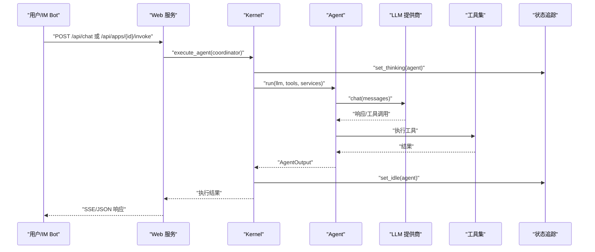
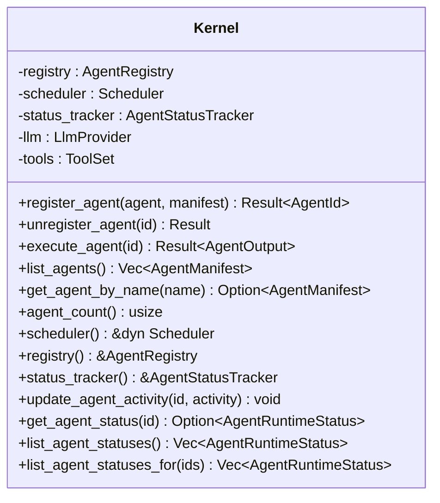
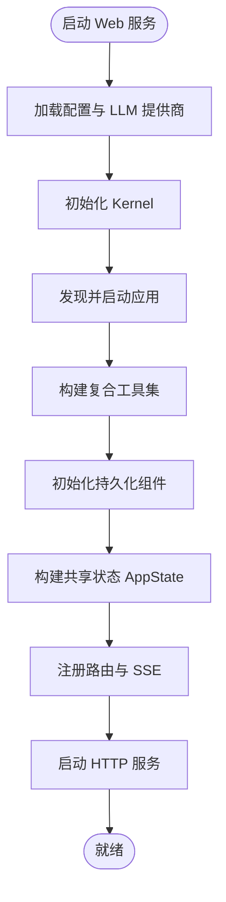
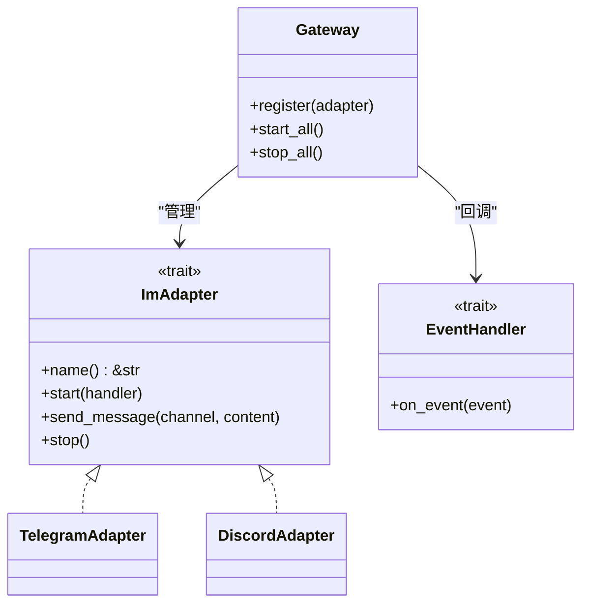
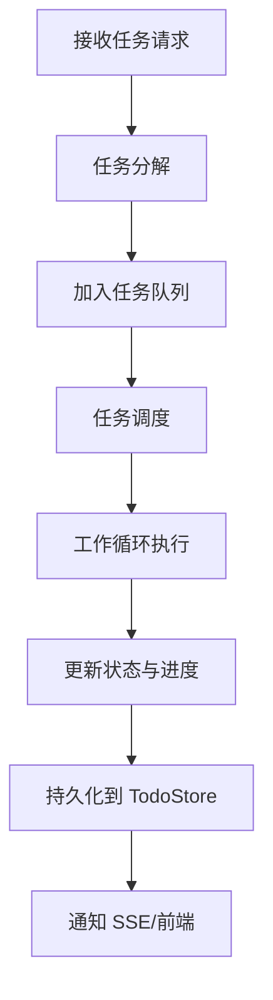
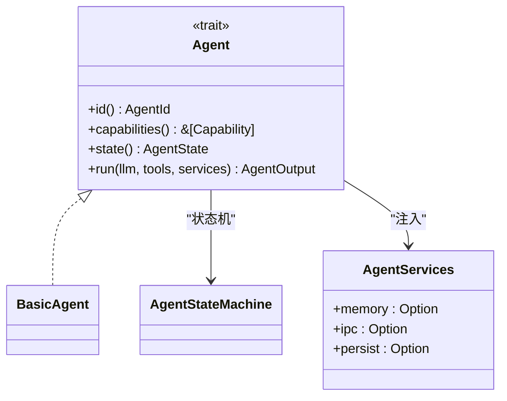
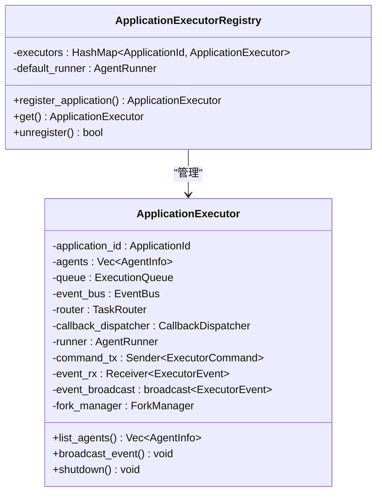
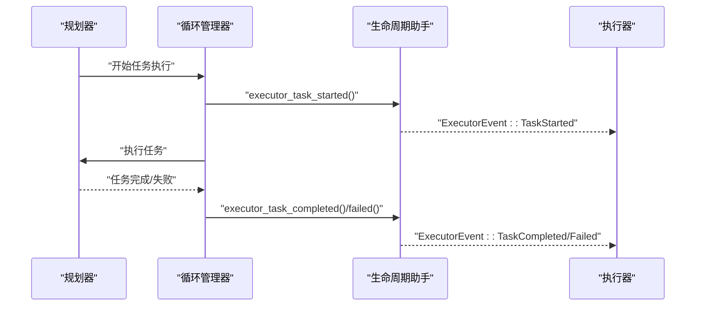
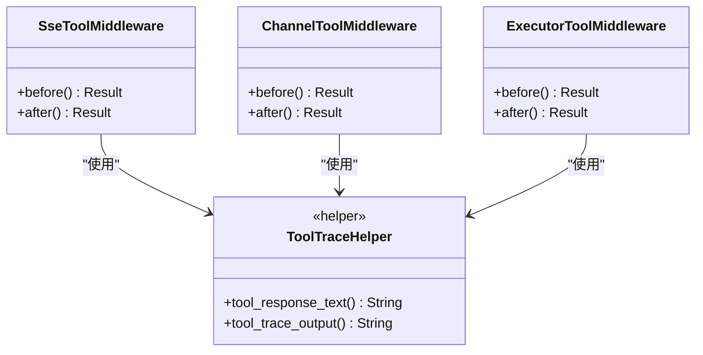
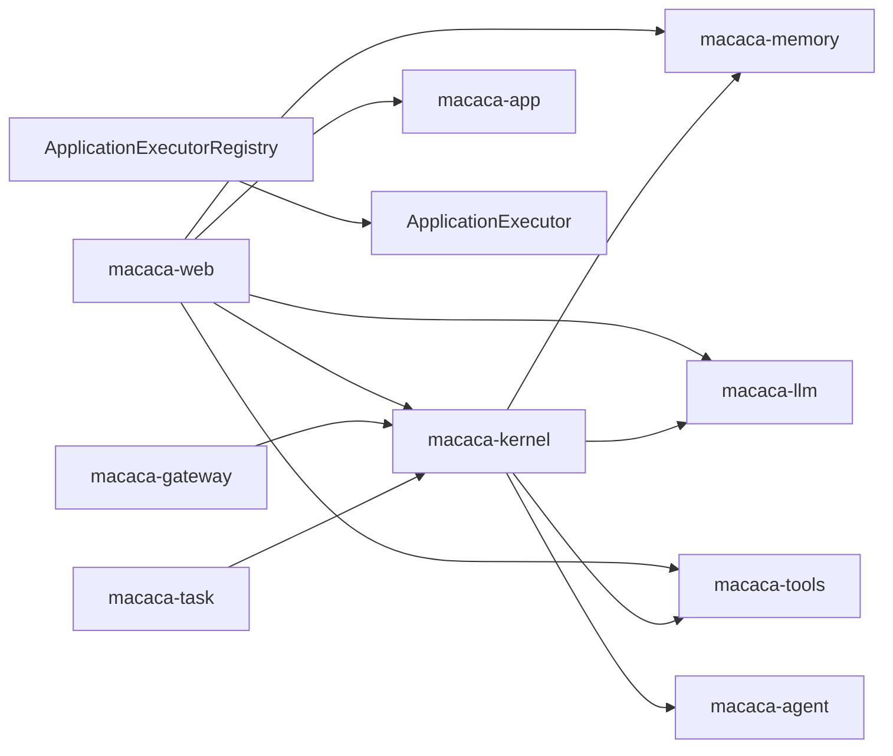

# 核心架构

<cite>
**本文档引用的文件**   
- [Cargo.toml](file://macaca/Cargo.toml)
- [ARCHITECTURE-v2.md](file://macaca/ARCHITECTURE-v2.md)
- [README.md](file://macaca/README.md)
- [lib.rs](file://macaca/crates/macaca-agent/src/lib.rs)
- [kernel.rs](file://macaca/crates/macaca-kernel/src/kernel.rs)
- [lib.rs](file://macaca/crates/macaca-web/src/lib.rs)
- [lib.rs](file://macaca/crates/macaca-gateway/src/lib.rs)
- [lib.rs](file://macaca/crates/macaca-task/src/lib.rs)
- [loop_manager.rs](file://macaca/crates/macaca-web/src/loop_manager.rs)
- [framework_runner.rs](file://macaca/crates/macaca-web/src/framework_runner.rs)
- [app_executor.rs](file://macaca/crates/macaca-kernel/src/executor/app_executor.rs)
- [spec.md](file://openspec/changes/refactor-executor-event-lifecycle-helpers/specs/framework-trace-middleware/spec.md)
- [tasks.md](file://openspec/changes/refactor-executor-event-lifecycle-helpers/tasks.md)
</cite>

## 更新摘要
**所做更改**   
- 更新了执行器系统重新设计的相关章节，反映了事件生命周期助手重构的实现细节
- 新增了框架追踪中间件重构的详细说明，包括工具调用事件的统一处理
- 完善了 ApplicationExecutorRegistry 的架构说明，强调了应用级执行器隔离
- 更新了事件驱动架构图，体现了新的生命周期事件处理机制

## 目录
1. [简介](#简介)
2. [项目结构](#项目结构)
3. [核心组件](#核心组件)
4. [架构总览](#架构总览)
5. [详细组件分析](#详细组件分析)
6. [依赖分析](#依赖分析)
7. [性能考量](#性能考量)
8. [故障排查指南](#故障排查指南)
9. [结论](#结论)
10. [附录](#附录)

## 简介
本文件为 Macaca Agent 操作系统的核心架构文档，聚焦分层架构设计与事件驱动机制，覆盖 Kernel 内核、Web 服务层、IM 网关层、任务管理层等关键层级的职责与交互关系。文档同时阐述异步处理与状态管理、组件依赖与数据流向、Agent 生命周期与权限控制、系统边界与设计约束，并给出架构决策的技术背景与权衡。

**更新** 本次更新重点关注执行器系统的重新设计和事件生命周期助手的重构，这些变更显著提升了系统的可维护性和事件处理的一致性。

## 项目结构
仓库采用 Rust Workspace 组织，按功能域拆分为多个 crate，形成清晰的分层与职责边界：
- 协议与类型层：macaca-proto
- 能力抽象层：macaca-llm、macaca-memory、macaca-tools、macaca-ipc、macaca-mcp
- 执行与编排层：macaca-kernel、macaca-app、macaca-runtime、macaca-task
- 接入与扩展层：macaca-web、macaca-gateway、macaca-driver、macaca-driver-claude-code
- 开发与工具层：macaca-sdk、macaca-cli
- 示例与集成：examples、tests、infra

```mermaid
graph TB
subgraph "接入与展示层"
WEB["macaca-web<br/>HTTP/WS/Web UI"]
GW["macaca-gateway<br/>IM 网关"]
end
subgraph "核心内核层"
KERNEL["macaca-kernel<br/>Kernel/调度/状态"]
APP["macaca-app<br/>应用运行时/工作流"]
RUNTIME["macaca-runtime<br/>Agentic 循环"]
TASK["macaca-task<br/>任务/计划/工单"]
END
subgraph "能力抽象层"
LLM["macaca-llm<br/>LLM 抽象/提供商"]
MEM["macaca-memory<br/>记忆系统"]
TOOLS["macaca-tools<br/>工具系统"]
IPC["macaca-ipc<br/>进程间通信"]
MCP["macaca-mcp<br/>MCP 协议"]
END
subgraph "驱动与扩展层"
DRIVER["macaca-driver<br/>驱动框架"]
DCLAUDIE["macaca-driver-claude-code<br/>Claude Code 驱动"]
END
subgraph "协议与工具层"
PROTO["macaca-proto<br/>核心类型/错误"]
SDK["macaca-sdk<br/>Agent SDK"]
CLI["macaca-cli<br/>命令行工具"]
END
WEB --> KERNEL
GW --> KERNEL
KERNEL --> APP
KERNEL --> RUNTIME
KERNEL --> TASK
APP --> RUNTIME
RUNTIME --> LLM
RUNTIME --> TOOLS
RUNTIME --> MEM
KERNEL --> LLM
KERNEL --> TOOLS
KERNEL --> MEM
KERNEL --> IPC
DRIVER --> TOOLS
DCLAUDIE --> DRIVER
SDK --> APP
CLI --> KERNEL
```

**图表来源**
- [Cargo.toml:1-25](file://macaca/Cargo.toml#L1-L25)
- [lib.rs:30-44](file://macaca/crates/macaca-web/src/lib.rs#L30-L44)
- [lib.rs:1-28](file://macaca/crates/macaca-gateway/src/lib.rs#L1-L28)
- [kernel.rs:16-22](file://macaca/crates/macaca-kernel/src/kernel.rs#L16-L22)

**章节来源**
- [Cargo.toml:1-25](file://macaca/Cargo.toml#L1-L25)
- [README.md:20-29](file://macaca/README.md#L20-L29)

## 核心组件
- Kernel 内核：统一编排 Agent、LLM、工具与服务，提供注册、执行、状态追踪与调度能力。
- Web 服务层：Axum 路由与 SSE 流，提供 REST API、会话与事件流、指标与工作区管理。
- IM 网关层：可插拔 IM 适配器（Telegram/Discord），将外部事件转换为系统事件并交由内核处理。
- 任务管理层：任务分解、计划循环、工作循环、待办看板与持久化，支撑持续执行与协作。
- **执行器系统**：ApplicationExecutor 提供应用级隔离的执行环境，支持 Fork-Join 工作流和事件广播。

**更新** 新增了执行器系统的详细说明，强调了应用级隔离和事件广播机制的重要性。

**章节来源**
- [kernel.rs:16-136](file://macaca/crates/macaca-kernel/src/kernel.rs#L16-L136)
- [lib.rs:608-647](file://macaca/crates/macaca-web/src/lib.rs#L608-L647)
- [lib.rs:1-28](file://macaca/crates/macaca-gateway/src/lib.rs#L1-L28)
- [lib.rs:1-22](file://macaca/crates/macaca-task/src/lib.rs#L1-L22)
- [app_executor.rs:87-151](file://macaca/crates/macaca-kernel/src/executor/app_executor.rs#L87-L151)

## 架构总览
系统采用事件驱动与分层解耦的设计：
- 事件驱动：IM 网关与 Web 层产生事件（如 TaskRequest、UserReply、Command），经由 Kernel 的状态追踪与调度，驱动 Agent 执行；执行过程中的状态变更通过 SSE 推送至前端。
- 分层解耦：上层仅依赖协议与抽象层，内核通过注入式服务（LLM、工具、记忆、持久化）实现可插拔。
- 生命周期：Agent 注册后进入 Running 状态，执行时更新为 Thinking/ExecutingTool 等活动状态，完成后回到 Idle；Kernel 提供状态查询与列表能力。
- 权限控制：Agent 清单包含权限字段，用于限制工具使用、路径访问与网络访问。
- **事件生命周期管理**：通过统一的生命周期助手函数确保事件构造的一致性和可维护性。

**更新** 新增了事件生命周期管理的说明，体现了重构后的事件处理一致性。



**图表来源**
- [kernel.rs:66-84](file://macaca/crates/macaca-kernel/src/kernel.rs#L66-L84)
- [lib.rs:629-631](file://macaca/crates/macaca-web/src/lib.rs#L629-L631)

**章节来源**
- [ARCHITECTURE-v2.md:319-387](file://macaca/ARCHITECTURE-v2.md#L319-L387)

## 详细组件分析

### Kernel 内核
- 职责
  - Agent 注册与生命周期管理：注册、注销、计数、清单查询。
  - 执行编排：构建 AgentServices，调用 Agent.run 并在前后设置状态。
  - 状态追踪：提供活动与状态更新、查询与列表。
  - 调度器接口：对外暴露调度器引用，便于上层策略扩展。
- 数据结构与复杂度
  - 注册表：基于并发映射，注册/查询近似 O(1)。
  - 状态追踪：内存 HashMap 存储 AgentRuntimeStatus，更新为 O(1)。
- 错误处理
  - 未找到 Agent 返回特定错误类型，便于上层区分。
- 性能与优化
  - 使用 Arc 共享 LLM 与工具集，减少拷贝开销。
  - 状态更新与执行分离，避免阻塞执行路径。



**图表来源**
- [kernel.rs:16-136](file://macaca/crates/macaca-kernel/src/kernel.rs#L16-L136)

**章节来源**
- [kernel.rs:24-136](file://macaca/crates/macaca-kernel/src/kernel.rs#L24-L136)

### Web 服务层
- 职责
  - 配置加载与 LLM 提供商初始化（含弹性重试、速率限制、成本跟踪）。
  - 应用发现与启动：扫描标准目录，加载 app.yaml，注册 Agent 并更新状态。
  - 工具集构建：内置工具 + 技能工具 + Claude Code 驱动工具。
  - 会话与事件：持久化会话、事件日志、运行轨迹、审计与告警。
  - 路由与 SSE：REST API、SSE 事件流、指标、工作区管理。
- 数据流
  - 启动时构建 Kernel、AppRuntime、ToolSet、持久化组件，注入到共享状态。
  - 路由处理器通过共享状态访问 Kernel 与执行器注册表，实现任务委托与结果查询。
- 设计要点
  - 使用 Arc 与 RwLock 管理共享状态，保证并发安全。
  - 通过 ApplicationExecutorRegistry 支持应用级任务编排与 Fork-Join。

**更新** 新增了 ApplicationExecutorRegistry 的详细说明，强调了应用级隔离的重要性。



**图表来源**
- [lib.rs:82-662](file://macaca/crates/macaca-web/src/lib.rs#L82-L662)

**章节来源**
- [lib.rs:82-662](file://macaca/crates/macaca-web/src/lib.rs#L82-L662)

### IM 网关层
- 职责
  - 适配多种即时通讯平台（Telegram、Discord 等），统一事件模型。
  - Gateway 管理适配器生命周期，EventHandler 将外部事件转换为系统事件。
- 可插拔性
  - 每个平台实现 ImAdapter，支持独立启动/停止与消息发送。
- 事件类型
  - TaskRequest、StatusQuery、UserReply、Command 等，交由内核与应用层处理。



**图表来源**
- [lib.rs:1-28](file://macaca/crates/macaca-gateway/src/lib.rs#L1-L28)

**章节来源**
- [lib.rs:1-28](file://macaca/crates/macaca-gateway/src/lib.rs#L1-L28)

### 任务管理层
- 职责
  - 任务分解与调度：支持简单分解与 LLM 驱动分解。
  - 计划循环与工作循环：周期性唤醒、事件驱动推进、优先级与负载均衡。
  - 待办看板与持久化：TodoStore、TaskBoard、进度统计与诊断。
  - 任务跟踪：TaskTracker 提供任务状态与结果查询。
- 关键构件
  - PlanLoop/WorkerLoop：计划与执行循环，配合 Waker 与事件。
  - TaskQueue/TaskScheduler：队列与调度策略。
  - TodoStore/TodoBoard：任务持久化与可视化。



**图表来源**
- [lib.rs:1-22](file://macaca/crates/macaca-task/src/lib.rs#L1-L22)

**章节来源**
- [lib.rs:1-22](file://macaca/crates/macaca-task/src/lib.rs#L1-L22)

### Agent 与运行时
- Agent 抽象
  - Agent Trait 定义标识、能力、状态与执行入口。
  - AgentServices 注入记忆、IPC、持久化等服务，支持扩展。
- 运行时
  - AgenticLoop：LLM 调用 → 工具调用 → 反馈 → 循环，直至完成。
  - 状态更新：在关键阶段设置活动状态，确保前端可观测。



**图表来源**
- [lib.rs:1-15](file://macaca/crates/macaca-agent/src/lib.rs#L1-L15)

**章节来源**
- [lib.rs:1-15](file://macaca/crates/macaca-agent/src/lib.rs#L1-L15)

### 执行器系统重构
- **ApplicationExecutorRegistry**：应用级执行器注册表，管理所有隔离的应用执行器实例
- **ApplicationExecutor**：单个应用的完整执行环境，包含任务队列、事件总线、路由器等组件
- **事件生命周期助手**：重构后的生命周期事件构造函数，确保事件行为的一致性
- **追踪中间件重构**：统一工具调用事件的处理逻辑，支持 SSE、通道和执行器事件

**更新** 新增了执行器系统重构的详细说明，重点介绍了 ApplicationExecutorRegistry 和事件生命周期助手的改进。



**图表来源**
- [app_executor.rs:1037-1107](file://macaca/crates/macaca-kernel/src/executor/app_executor.rs#L1037-L1107)
- [app_executor.rs:100-151](file://macaca/crates/macaca-kernel/src/executor/app_executor.rs#L100-L151)

**章节来源**
- [app_executor.rs:1037-1107](file://macaca/crates/macaca-kernel/src/executor/app_executor.rs#L1037-L1107)
- [app_executor.rs:100-151](file://macaca/crates/macaca-kernel/src/executor/app_executor.rs#L100-L151)

### 事件生命周期助手重构
- **统一事件构造**：在 loop_manager.rs 中新增私有 helper 函数，统一构造 ExecutorEvent
- **生命周期事件**：TaskStarted、TaskCompleted、TaskFailed 事件的构造逻辑
- **行为一致性**：确保重构后事件名称、字段值和控制流位置保持不变
- **测试验证**：添加单元测试确保 TaskResult 字段和错误事件字段保持不变

**更新** 新增了事件生命周期助手重构的具体实现细节和测试验证要求。



**图表来源**
- [loop_manager.rs:158-195](file://macaca/crates/macaca-web/src/loop_manager.rs#L158-L195)

**章节来源**
- [loop_manager.rs:158-195](file://macaca/crates/macaca-web/src/loop_manager.rs#L158-L195)
- [spec.md:3-32](file://openspec/changes/refactor-executor-event-lifecycle-helpers/specs/framework-trace-middleware/spec.md#L3-L32)

### 追踪中间件重构
- **工具调用事件统一**：SseToolMiddleware、ChannelToolMiddleware、ExecutorToolMiddleware 的重构
- **UTF-8 安全截断**：统一的工具输出截断逻辑，确保字符边界安全
- **事件格式保持**：确保工具调用事件的名称、字段和截断行为保持不变
- **本地重构**：重构限制在本地 helper 提取，不影响编排语义

**更新** 新增了追踪中间件重构的详细说明，强调了事件格式一致性和本地重构的重要性。



**图表来源**
- [framework_runner.rs:400-414](file://macaca/crates/macaca-web/src/framework_runner.rs#L400-L414)
- [framework_runner.rs:507-569](file://macaca/crates/macaca-web/src/framework_runner.rs#L507-L569)
- [framework_runner.rs:677-706](file://macaca/crates/macaca-web/src/framework_runner.rs#L677-L706)

**章节来源**
- [framework_runner.rs:400-414](file://macaca/crates/macaca-web/src/framework_runner.rs#L400-L414)
- [framework_runner.rs:507-569](file://macaca/crates/macaca-web/src/framework_runner.rs#L507-L569)
- [framework_runner.rs:677-706](file://macaca/crates/macaca-web/src/framework_runner.rs#L677-L706)
- [spec.md:23-31](file://openspec/changes/refactor-executor-event-lifecycle-helpers/specs/framework-trace-middleware/spec.md#L23-L31)

## 依赖分析
- 组件耦合
  - Web 层依赖 Kernel、AppRuntime、工具集与持久化；通过共享状态解耦具体实现。
  - Kernel 依赖 Agent、LLM、工具、状态追踪与调度器；通过 Trait 抽象实现可插拔。
  - 网关层与任务层对 Kernel 低耦合，通过事件与 API 交互。
  - **执行器系统**：ApplicationExecutorRegistry 管理 ApplicationExecutor 实例，提供应用级隔离。
- 外部依赖
  - Axum、Tokio、Serde、UUID、Chrono、Tracing 等通用库。
  - LLM 提供商（OpenAI、Anthropic、DashScope、兼容实现）。
  - IPC 后端（NATS 默认）与向量存储（Milvus 等）可替换。

**更新** 新增了执行器系统依赖关系的说明，强调了应用级隔离的设计理念。



**图表来源**
- [Cargo.toml:3-25](file://macaca/Cargo.toml#L3-L25)
- [lib.rs:30-44](file://macaca/crates/macaca-web/src/lib.rs#L30-L44)
- [app_executor.rs:1037-1107](file://macaca/crates/macaca-kernel/src/executor/app_executor.rs#L1037-L1107)

**章节来源**
- [Cargo.toml:3-25](file://macaca/Cargo.toml#L3-L25)

## 性能考量
- 异步与并发
  - 基于 Tokio 的异步运行时，SSE 与事件流采用无阻塞推送。
  - 共享状态使用 Arc 与 RwLock，避免频繁拷贝与锁竞争。
- LLM 与工具调用
  - ResilientLlmWrapper 提供重试与回退策略，RateLimiter 控制速率，CostTracker 追踪成本。
  - 工具执行超时与最大迭代限制，防止长尾阻塞。
- 状态追踪
  - 内存状态结构简单，更新为 O(1)，SSE 检测变更后增量推送，降低带宽压力。
- I/O 与持久化
  - RedbStore 与事件日志支持高效写入与审计，建议合理分区与压缩策略。
- **执行器性能优化**
  - ApplicationExecutor 使用广播通道进行事件广播，支持高并发订阅。
  - ForkManager 提供 Fork-Join 工作流，支持复杂的任务编排。

**更新** 新增了执行器系统的性能优化说明，强调了广播通道和 Fork-Join 工作流的优势。

## 故障排查指南
- Chat 绕过 Agent 系统
  - 症状：Agent 状态始终显示 Idle。
  - 原因：/api/chat 直接调用 LLM，未经 Kernel 执行。
  - 修复：将 Chat 路由转交 Coordinator Agent，使用 AgenticLoop 执行并更新状态。
- 状态更新不完整
  - 症状：Agent 内部调用 LLM/工具时未上报状态。
  - 修复：在 AgenticLoop 中增加状态钩子或回调，通知状态追踪。
- Workflow 引擎未集成
  - 症状：app.yaml 定义的工作流未被调用。
  - 修复：实现 WorkflowEngine，在 Chat/事件触发时执行步骤编排。
- **执行器事件丢失**
  - 症状：SSE 事件流中断或事件缺失。
  - 原因：事件广播通道阻塞或执行器未正确广播事件。
  - 修复：检查 ApplicationExecutor 的 event_broadcast 通道容量，确保事件正确转发。
- **生命周期事件不一致**
  - 症状：任务状态事件名称或字段发生变化。
  - 原因：事件构造逻辑未通过统一的生命周期助手函数。
  - 修复：使用 executor_task_started、executor_task_completed、executor_task_failed 等 helper 函数。

**更新** 新增了执行器事件和生命周期事件相关的故障排查指南。

**章节来源**
- [ARCHITECTURE-v2.md:567-639](file://macaca/ARCHITECTURE-v2.md#L567-L639)

## 结论
Macaca OS 通过清晰的分层与可插拔架构，实现了从 Web/IM 接入到底层 Kernel 的全链路编排。事件驱动与状态追踪保障了可观测性与可维护性，而可替换的记忆、LLM、驱动与网关为系统提供了强大的扩展能力。

**更新** 本次重大重构显著提升了系统的可维护性和事件处理的一致性。执行器系统的重新设计实现了应用级隔离，事件生命周期助手的重构确保了事件行为的稳定性，追踪中间件的统一处理提升了系统的可靠性。

当前主要问题集中在 Chat 流程未正确走 Agent 系统，建议尽快修复以实现完整的生命周期与状态闭环。执行器系统的应用级隔离和事件广播机制为未来的功能扩展奠定了坚实基础。

## 附录
- 系统边界与设计约束
  - 边界：Web/IM 作为入口，Kernel 为核心编排中心，能力层通过抽象与适配器对接外部系统。
  - 约束：Agent 权限模型、速率限制、成本预算、事件幂等与重放。
  - **执行器边界**：ApplicationExecutor 提供应用级隔离，确保任务委托只在同应用内执行。
- 架构决策背景
  - 采用事件驱动与状态机，提升系统自治与可观察性。
  - 通过 Application Executor Registry 支持应用级任务编排与 Fork-Join。
  - 使用可插拔记忆与 LLM 抽象，适应多供应商与多场景需求。
  - **事件一致性原则**：重构必须保持现有事件行为不变，确保前端兼容性。
  - **本地重构原则**：重构限制在本地 helper 提取，不影响整体编排语义。

**更新** 新增了执行器系统的边界说明和重构原则，强调了事件一致性和本地重构的重要性。