# 组件交互关系

<cite>
**本文引用的文件**
- [Cargo.toml](file://macaca/Cargo.toml)
- [ARCHITECTURE-v2.md](file://macaca/ARCHITECTURE-v2.md)
- [README.md](file://macaca/README.md)
- [lib.rs](file://macaca/crates/macaca-agent/src/lib.rs)
- [kernel.rs](file://macaca/crates/macaca-kernel/src/kernel.rs)
- [lib.rs](file://macaca/crates/macaca-web/src/lib.rs)
- [lib.rs](file://macaca/crates/macaca-gateway/src/lib.rs)
- [lib.rs](file://macaca/crates/macaca-memory/src/lib.rs)
- [lib.rs](file://macaca/crates/macaca-app/src/lib.rs)
- [lib.rs](file://macaca/crates/macaca-runtime/src/lib.rs)
- [lib.rs](file://macaca/crates/macaca-tools/src/lib.rs)
- [lib.rs](file://macaca/crates/macaca-llm/src/lib.rs)
- [lib.rs](file://macaca/crates/macaca-ipc/src/lib.rs)
</cite>

## 目录
1. [简介](#简介)
2. [项目结构](#项目结构)
3. [核心组件](#核心组件)
4. [架构总览](#架构总览)
5. [详细组件分析](#详细组件分析)
6. [依赖分析](#依赖分析)
7. [性能考虑](#性能考虑)
8. [故障排查指南](#故障排查指南)
9. [结论](#结论)
10. [附录](#附录)

## 简介
本文件面向系统集成与二次开发者，系统性梳理 Macaca Agent 操作系统的核心组件及其交互关系，重点覆盖 Kernel 内核、Web 服务、IM 网关、任务管理、记忆系统等模块的依赖与协作模式；文档化组件间的通信协议与数据交换格式；解释组件解耦与依赖注入的实现方式；提供组件交互的时序图与架构图；并给出生命周期管理与错误处理机制的说明。

## 项目结构
仓库采用 Rust Workspace 组织，按功能域拆分为多个 crate，形成清晰的分层与职责边界：
- 协议与基础类型：macaca-proto
- LLM 抽象与路由：macaca-llm
- 记忆系统（三层可插拔）：macaca-memory
- 进程间通信：macaca-ipc
- 工具系统：macaca-tools
- 持久化：macaca-persist
- Agent 基础设施：macaca-agent
- 任务与工作流：macaca-task
- 应用运行时与声明式应用：macaca-app
- 内核与调度：macaca-kernel
- SDK 与声明式开发：macaca-sdk
- 网关适配层：macaca-gateway
- CLI：macaca-cli
- 驱动框架：macaca-driver
- 运行时（智能体循环）：macaca-runtime
- MCP 协议适配：macaca-mcp
- Web 服务：macaca-web
- 框架与通用能力：macaca-framework
- 集成测试：macaca-integration-tests

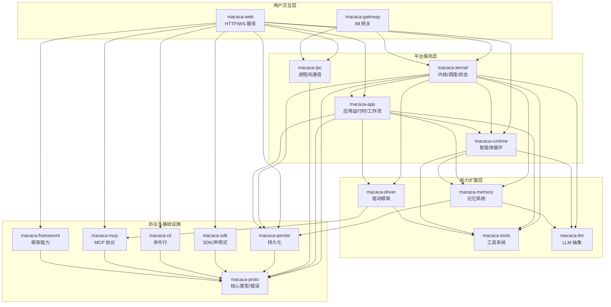

图表来源
- [Cargo.toml:1-90](file://macaca/Cargo.toml#L1-L90)
- [ARCHITECTURE-v2.md:16-275](file://macaca/ARCHITECTURE-v2.md#L16-L275)

章节来源
- [Cargo.toml:1-90](file://macaca/Cargo.toml#L1-L90)
- [README.md:1-29](file://macaca/README.md#L1-L29)

## 核心组件
- Kernel 内核：统一编排 Agent、LLM、工具与服务，提供注册、执行、状态追踪与调度接口。
- Web 服务：Axum HTTP 服务，提供 REST API、SSE、会话与任务相关接口。
- IM 网关：可插拔 IM 适配层，对接 Telegram/Discord 等平台，事件路由至内核。
- 应用运行时与工作流：支持 L1/L2/L3 应用层，声明式应用通过 app.yaml 配置，工作流引擎编排多 Agent 协作。
- 记忆系统：三层可插拔记忆（会话/文件/向量），支持嵌入与向量检索。
- 工具系统：内置工具与可执行技能工具，统一抽象 Tool/ToolSet。
- LLM 抽象：统一 Provider 接口，支持 OpenAI、Anthropic、DashScope 及 OpenAI 兼容。
- 进程间通信：本地广播与 NATS 两种传输，统一 MessageSender/MessageReceiver 接口。
- Agent 基础设施：Agent Trait、服务注入、状态机与优雅关停。
- 持久化：会话、事件日志、检查点等持久化能力。
- SDK/CLI/MCP/框架：声明式开发、命令行工具、MCP 协议适配与框架通用能力。

章节来源
- [ARCHITECTURE-v2.md:16-275](file://macaca/ARCHITECTURE-v2.md#L16-L275)
- [lib.rs:1-136](file://macaca/crates/macaca-kernel/src/kernel.rs#L1-L136)
- [lib.rs:82-662](file://macaca/crates/macaca-web/src/lib.rs#L82-L662)
- [lib.rs:1-28](file://macaca/crates/macaca-gateway/src/lib.rs#L1-L28)
- [lib.rs:1-21](file://macaca/crates/macaca-app/src/lib.rs#L1-L21)
- [lib.rs:1-18](file://macaca/crates/macaca-memory/src/lib.rs#L1-L18)
- [lib.rs:1-20](file://macaca/crates/macaca-tools/src/lib.rs#L1-L20)
- [lib.rs:1-52](file://macaca/crates/macaca-llm/src/lib.rs#L1-L52)
- [lib.rs:1-17](file://macaca/crates/macaca-ipc/src/lib.rs#L1-L17)
- [lib.rs:1-15](file://macaca/crates/macaca-agent/src/lib.rs#L1-L15)

## 架构总览
系统采用“分层+可插拔”的架构设计：
- 表面层：Web 与 IM 网关作为用户入口，统一接入 Kernel。
- 平台服务层：Kernel 为核心协调者，App/Runtime/IPC 聚合能力。
- 能力扩展层：Driver/Tools/Memory/LLM 皆可替换，满足不同场景需求。
- 协议层：Proto 定义核心类型与错误，确保跨模块契约稳定。

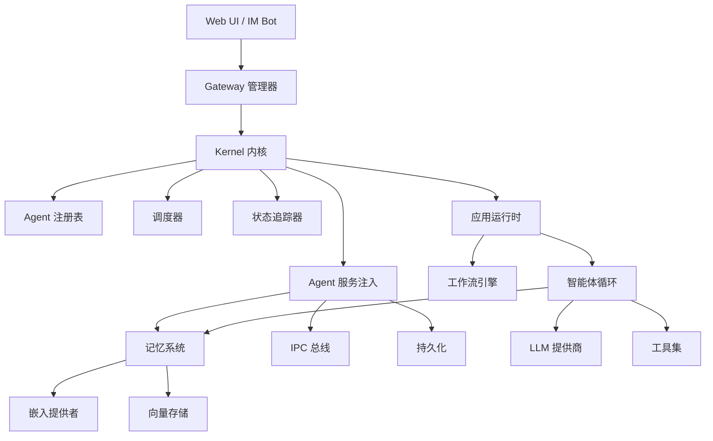

图表来源
- [ARCHITECTURE-v2.md:16-275](file://macaca/ARCHITECTURE-v2.md#L16-L275)
- [lib.rs:15-136](file://macaca/crates/macaca-kernel/src/kernel.rs#L15-L136)
- [lib.rs:82-662](file://macaca/crates/macaca-web/src/lib.rs#L82-L662)

## 详细组件分析

### Kernel 内核
- 职责：注册/注销 Agent、执行 Agent、状态追踪、调度器访问、LLM/工具注入。
- 依赖注入：通过 AgentServices 注入 Memory/Ipc/Persist 服务（空实现为占位，Phase 4+ 扩展）。
- 状态管理：集中维护 Agent 状态与活动，支持 SSE 推送。
- 错误处理：统一返回 MacacaError，便于上层捕获与降级。

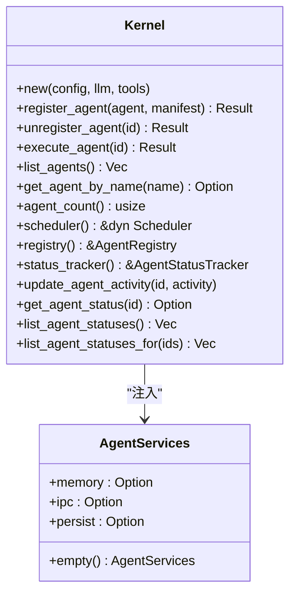

图表来源
- [kernel.rs:15-136](file://macaca/crates/macaca-kernel/src/kernel.rs#L15-L136)
- [lib.rs:11-14](file://macaca/crates/macaca-agent/src/lib.rs#L11-L14)

章节来源
- [kernel.rs:24-136](file://macaca/crates/macaca-kernel/src/kernel.rs#L24-L136)
- [lib.rs:11-14](file://macaca/crates/macaca-agent/src/lib.rs#L11-L14)

### Web 服务
- 启动流程：加载配置、初始化 LLM Provider、构建 Kernel、发现并启动应用、组合工具集、初始化持久化与审计、构建共享状态、注册路由。
- 路由与 SSE：提供应用、会话、任务、目标、计划等 API，支持 SSE 推送状态变更。
- 工具集组合：内置工具 + 技能工具 + Claude Code 驱动工具，动态生成 CompositeToolSet。
- 任务委托与结果查询：通过 ApplicationExecutorRegistry 实现 Fork-Join 委派与结果查询。

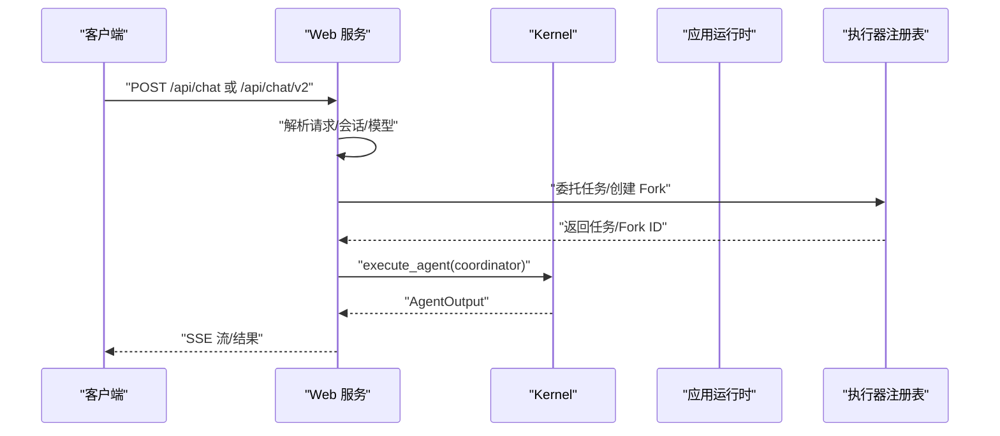

图表来源
- [lib.rs:82-662](file://macaca/crates/macaca-web/src/lib.rs#L82-L662)
- [kernel.rs:62-84](file://macaca/crates/macaca-kernel/src/kernel.rs#L62-L84)

章节来源
- [lib.rs:82-662](file://macaca/crates/macaca-web/src/lib.rs#L82-L662)

### IM 网关
- 架构：Gateway 管理多个 ImAdapter（Telegram/Discord），事件通过 EventHandler 路由至内核。
- 事件类型：TaskRequest、StatusQuery、UserReply、Command 等。
- 可插拔：新增平台只需实现 ImAdapter trait。

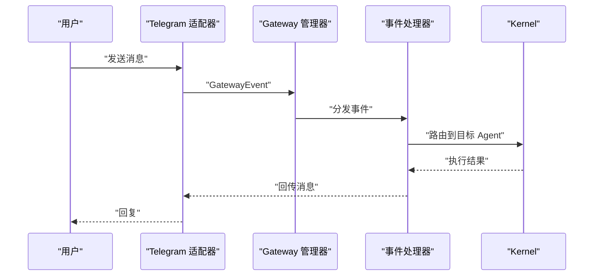

图表来源
- [lib.rs:1-28](file://macaca/crates/macaca-gateway/src/lib.rs#L1-L28)
- [ARCHITECTURE-v2.md:42-51](file://macaca/ARCHITECTURE-v2.md#L42-L51)

章节来源
- [lib.rs:1-28](file://macaca/crates/macaca-gateway/src/lib.rs#L1-L28)
- [ARCHITECTURE-v2.md:42-51](file://macaca/ARCHITECTURE-v2.md#L42-L51)

### 应用运行时与工作流
- 应用层：支持 L1（原生）、L2（WASM，计划中）、L3（声明式 YAML）。
- 工作流：WorkflowEngine 按步骤编排 Agent，支持依赖关系与条件分支。
- 协调器：Coordinator Agent 分析意图，简单聊天直接回复，复杂任务触发工作流。

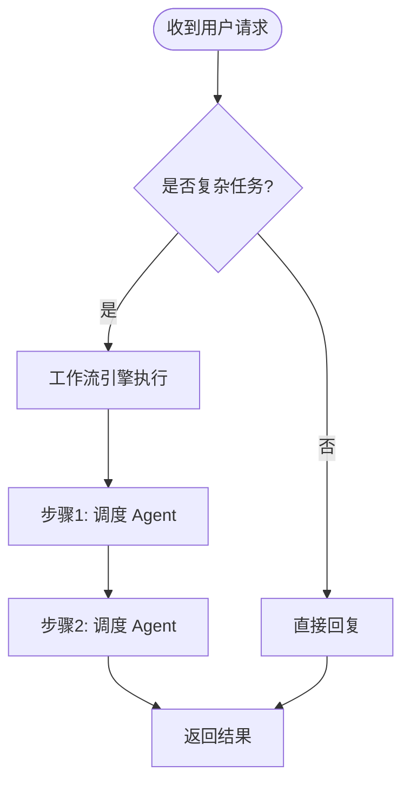

图表来源
- [ARCHITECTURE-v2.md:319-386](file://macaca/ARCHITECTURE-v2.md#L319-L386)
- [lib.rs:19-19](file://macaca/crates/macaca-app/src/lib.rs#L19-L19)

章节来源
- [ARCHITECTURE-v2.md:281-386](file://macaca/ARCHITECTURE-v2.md#L281-L386)
- [lib.rs:1-21](file://macaca/crates/macaca-app/src/lib.rs#L1-L21)

### 记忆系统
- 三层架构：Session Layer（短期会话记忆）、File Layer（长期结构化存储）、Vector Layer（向量检索）。
- 可插拔：MemoryManager 支持替换 EmbeddingProvider 与 VectorStore。
- 自动检索：auto_retrieve(TaskContext) 返回相关记忆条目。

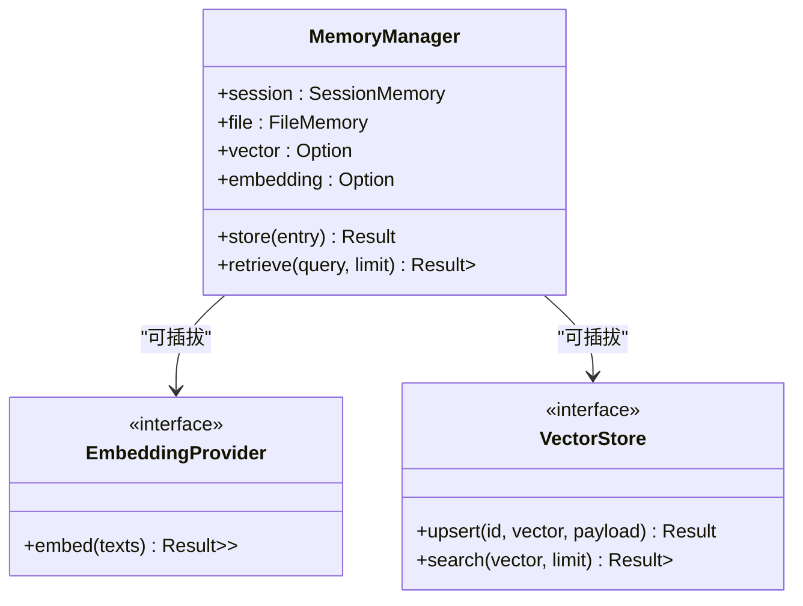

图表来源
- [lib.rs:11-17](file://macaca/crates/macaca-memory/src/lib.rs#L11-L17)
- [ARCHITECTURE-v2.md:410-435](file://macaca/ARCHITECTURE-v2.md#L410-L435)

章节来源
- [lib.rs:1-18](file://macaca/crates/macaca-memory/src/lib.rs#L1-L18)
- [ARCHITECTURE-v2.md:410-435](file://macaca/ARCHITECTURE-v2.md#L410-L435)

### 工具系统与驱动框架
- 工具抽象：Tool/ToolSet，内置文件读写、Shell、技能工具等。
- 驱动抽象：SoftwareDriver trait，支持 CLI、REST、UI 自动化、文件 IPC、MCP 协议等。
- 集成：Web 服务动态加载技能工具与 Claude Code 驱动工具，统一注入 Kernel。

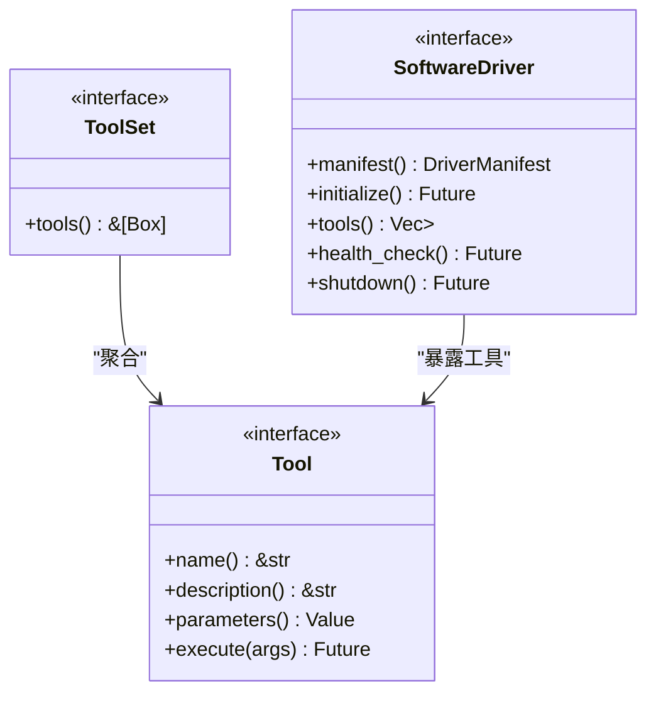

图表来源
- [lib.rs:8-19](file://macaca/crates/macaca-tools/src/lib.rs#L8-L19)
- [ARCHITECTURE-v2.md:118-139](file://macaca/ARCHITECTURE-v2.md#L118-L139)

章节来源
- [lib.rs:1-20](file://macaca/crates/macaca-tools/src/lib.rs#L1-L20)
- [ARCHITECTURE-v2.md:118-139](file://macaca/ARCHITECTURE-v2.md#L118-L139)

### LLM 抽象与路由
- Provider 接口：统一 chat/messages/options。
- 路由与弹性：LlmRouter 按模型名规则路由；ResilientLlmWrapper 提供重试、退避、成本跟踪与速率限制。
- 兼容：OpenAI 兼容 API（DeepSeek、Ollama、vLLM 等）。

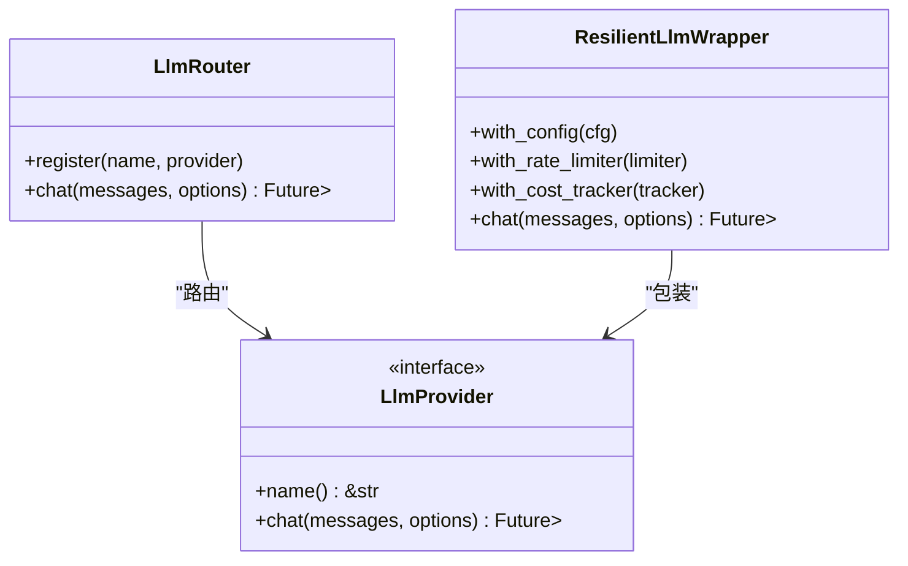

图表来源
- [lib.rs:42-52](file://macaca/crates/macaca-llm/src/lib.rs#L42-L52)
- [lib.rs:1-52](file://macaca/crates/macaca-llm/src/lib.rs#L1-L52)

章节来源
- [lib.rs:1-52](file://macaca/crates/macaca-llm/src/lib.rs#L1-L52)

### 进程间通信
- 传输：local（广播）与 nats（跨进程）。
- 接口：MessageSender/MessageReceiver，统一消息发送/接收。
- 应用：Agent 间事件/状态/结果广播与查询。

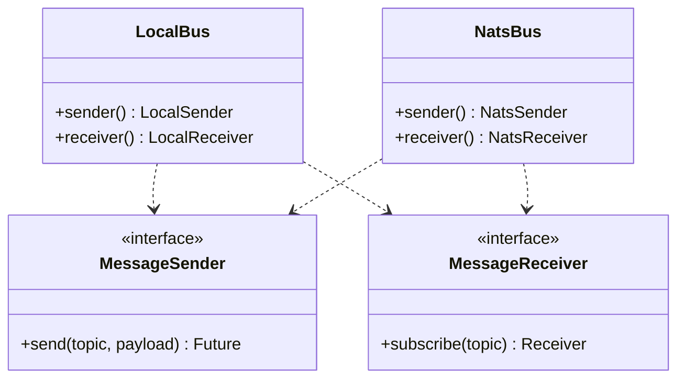

图表来源
- [lib.rs:14-17](file://macaca/crates/macaca-ipc/src/lib.rs#L14-L17)
- [lib.rs:1-17](file://macaca/crates/macaca-ipc/src/lib.rs#L1-L17)

章节来源
- [lib.rs:1-17](file://macaca/crates/macaca-ipc/src/lib.rs#L1-L17)

### Agent 基础设施与生命周期
- Agent Trait：定义 id/capabilities/state/run。
- 服务注入：AgentServices（Memory/Ipc/Persist）在 Phase 4+ 扩展。
- 状态机：AgentStateMachine 管理 Agent 生命周期状态。
- 优雅关停：ShutdownHandle 提供关停信号与资源回收。

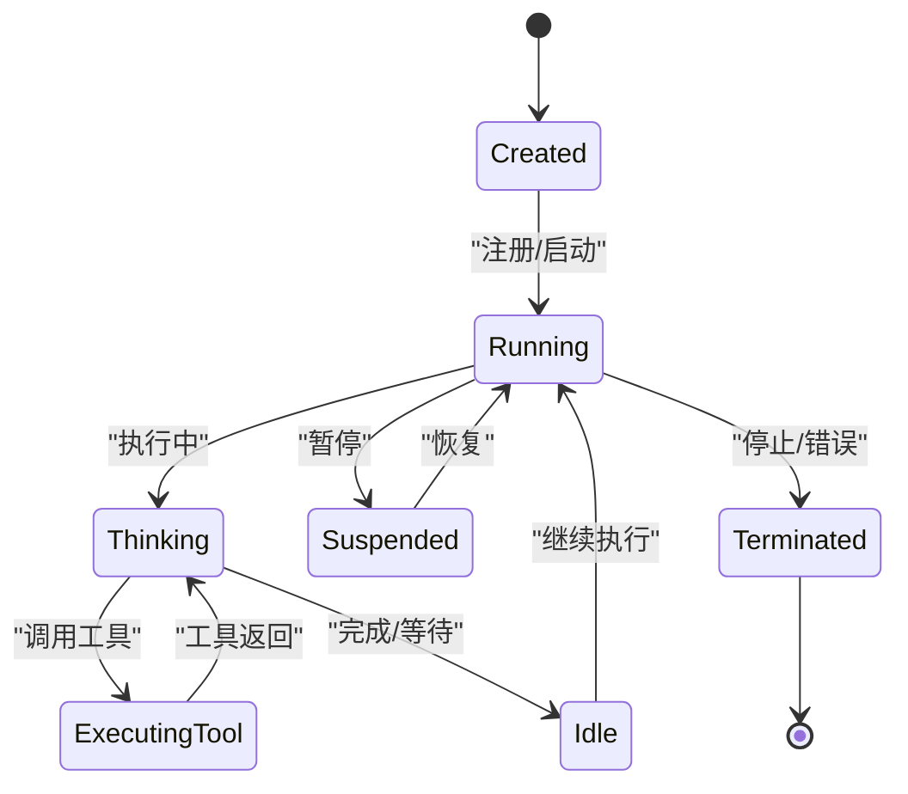

图表来源
- [ARCHITECTURE-v2.md:68-73](file://macaca/ARCHITECTURE-v2.md#L68-L73)
- [lib.rs:11-14](file://macaca/crates/macaca-agent/src/lib.rs#L11-L14)

章节来源
- [lib.rs:1-15](file://macaca/crates/macaca-agent/src/lib.rs#L1-L15)
- [ARCHITECTURE-v2.md:68-73](file://macaca/ARCHITECTURE-v2.md#L68-L73)

## 依赖分析
- 组件耦合与内聚：Kernel 作为高扇出中心，通过抽象接口（LLM/Tools/Memory/IPC/Persist）与能力层解耦。
- 直接依赖：Web 依赖 Kernel/App/Runtime/IPC/Persist；Gateway 依赖 Kernel；App/Runtime 依赖 Kernel；Memory/LLM/Tools/Driver 皆可独立替换。
- 外部依赖：Axum、Tokio、NATS、Serde、Tracing、Redb 等。
- 潜在循环依赖：当前设计通过抽象接口避免直接循环，需注意工具/驱动对 Kernel 的间接依赖（如委托工具）应通过回调/注册表解耦。

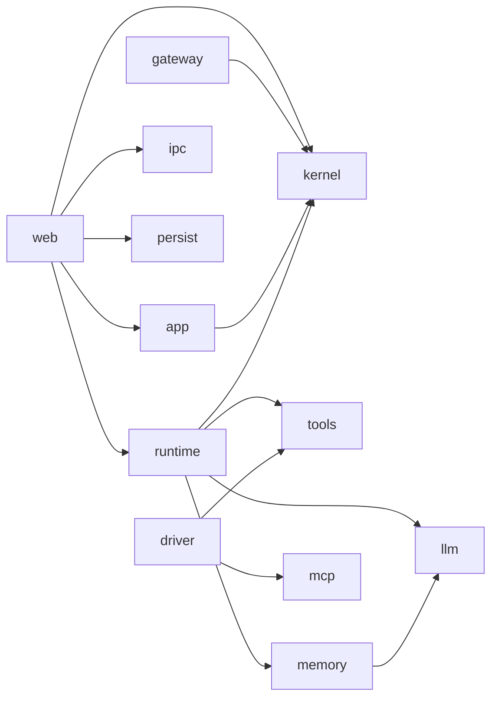

图表来源
- [Cargo.toml:3-25](file://macaca/Cargo.toml#L3-L25)
- [lib.rs:30-44](file://macaca/crates/macaca-web/src/lib.rs#L30-L44)

章节来源
- [Cargo.toml:3-25](file://macaca/Cargo.toml#L3-L25)

## 性能考虑
- 并发与异步：Tokio 运行时、异步 LLM/工具调用、广播/WS 推送。
- 缓存与检索：记忆系统向量化检索与嵌入缓存；工具执行结果缓存（视具体实现）。
- 速率限制与弹性：ResilientLlmWrapper 与 RateLimiter 控制 QPS 与重试策略。
- 资源隔离：WASM 应用（计划中）与沙箱执行（计划中）提升隔离性。
- I/O 优化：Redb 持久化、NATS 传输减少跨进程延迟。

## 故障排查指南
- Chat 绕过 Agent 系统：当前实现直接调用 LLM，导致状态始终 Idle。应改为通过 Coordinator Agent 与 Kernel 执行，启用状态追踪与工作流。
- 状态更新不完整：Agent 内部调用 LLM/工具时未通知状态追踪器。应在 AgenticLoop 中增加状态更新钩子或回调。
- 工作流引擎未集成：app.yaml 中定义的工作流未被 Chat 流程使用。需实现 WorkflowEngine 并在 Chat 触发。
- 任务委托失败：DelegateTaskTool 依赖 ApplicationExecutorRegistry，需确保在启动阶段完成注册与初始化。
- LLM 弹性与成本：检查 ResilientLlmWrapper 配置、速率限制与成本追踪，必要时调整重试与退避策略。

章节来源
- [ARCHITECTURE-v2.md:567-600](file://macaca/ARCHITECTURE-v2.md#L567-L600)
- [lib.rs:224-336](file://macaca/crates/macaca-web/src/lib.rs#L224-L336)

## 结论
Macaca OS 通过清晰的分层与可插拔设计，实现了从用户交互到智能体执行的全链路闭环。Kernel 作为中枢协调者，结合 App/Runtime/IPC/Memory/LLM/Tools 等能力层，支撑多 Agent 协作与持续执行。当前主要问题集中在 Chat 流程绕过 Agent 系统与工作流集成不足，建议尽快修复以实现完整的状态追踪与编排能力，从而满足生产级的系统集成与二次开发需求。

## 附录
- 关键文件索引（来自架构文档）：
  - Proto：crates/macaca-proto/src/types.rs
  - Kernel：crates/macaca-kernel/src/kernel.rs
  - Agent：crates/macaca-agent/src/agent.rs
  - App：crates/macaca-app/src/runtime.rs
  - App：crates/macaca-app/src/workflow.rs
  - Runtime：crates/macaca-runtime/src/agentic_loop.rs
  - Web：crates/macaca-web/src/routes.rs
  - Web：crates/macaca-web/src/state.rs
  - SDK：crates/macaca-sdk/src/builder.rs
  - Driver：crates/macaca-driver/src/driver.rs
  - Memory：crates/macaca-memory/src/manager.rs
  - Gateway：crates/macaca-gateway/src/gateway.rs
  - Tools：crates/macaca-tools/src/lib.rs
  - LLM：crates/macaca-llm/src/provider.rs

章节来源
- [ARCHITECTURE-v2.md:603-622](file://macaca/ARCHITECTURE-v2.md#L603-L622)