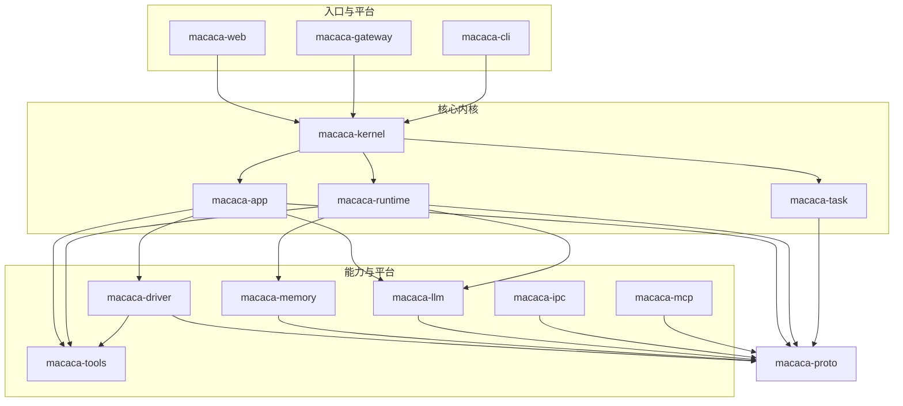
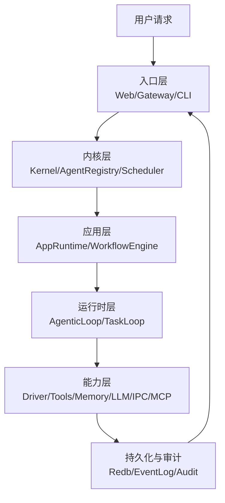
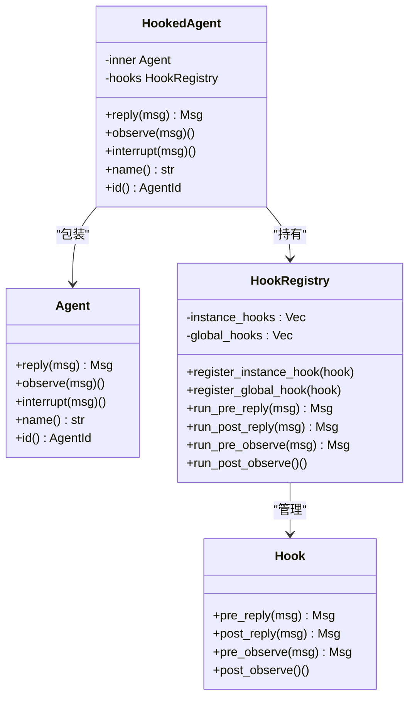
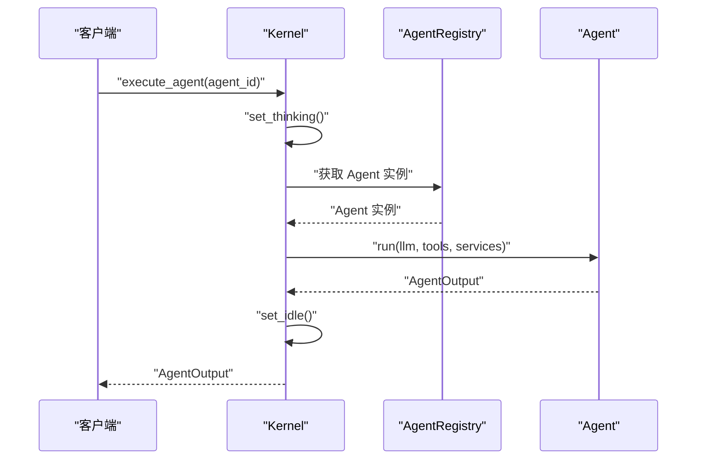
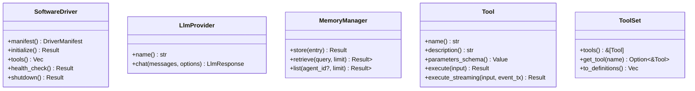
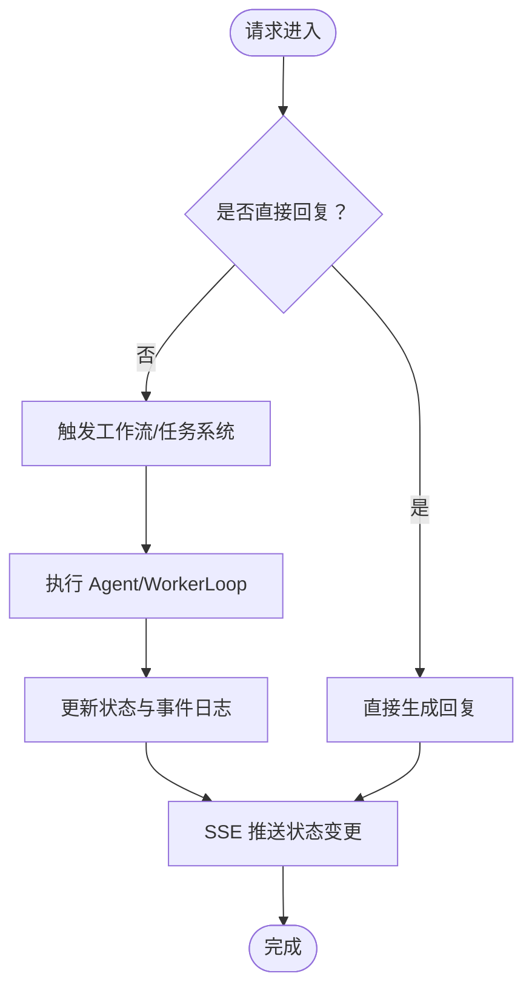
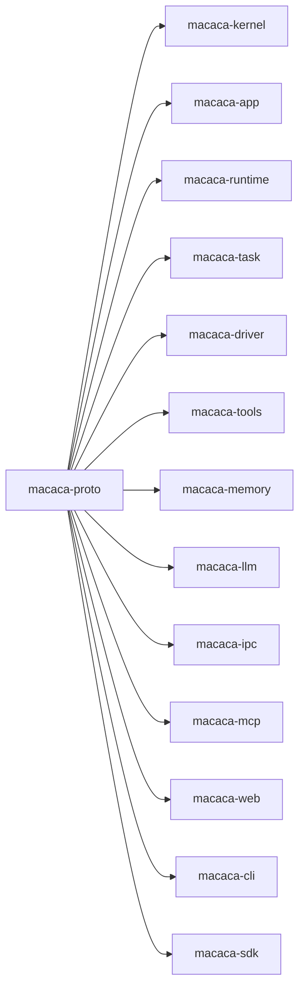

# 设计原则与约束

<cite>
**本文引用的文件**
- [Cargo.toml](file://macaca/Cargo.toml)
- [ARCHITECTURE-v2.md](file://macaca/ARCHITECTURE-v2.md)
- [README.md](file://macaca/README.md)
- [SYSTEM_OVERVIEW.md](file://macaca/docs/SYSTEM_OVERVIEW.md)
- [SYSTEM_AUDIT.md](file://macaca/docs/SYSTEM_AUDIT.md)
- [lib.rs](file://macaca/crates/macaca-agent/src/lib.rs)
- [agent.rs](file://macaca/crates/macaca-agent/src/agent.rs)
- [lib.rs](file://macaca/crates/macaca-framework/src/lib.rs)
- [agent.rs](file://macaca/crates/macaca-framework/src/agent.rs)
- [kernel.rs](file://macaca/crates/macaca-kernel/src/kernel.rs)
- [driver.rs](file://macaca/crates/macaca-driver/src/driver.rs)
- [manager.rs](file://macaca/crates/macaca-memory/src/manager.rs)
- [provider.rs](file://macaca/crates/macaca-llm/src/provider.rs)
- [tool.rs](file://macaca/crates/macaca-tools/src/tool.rs)
- [types.rs](file://macaca/crates/macaca-proto/src/types.rs)
</cite>

## 目录
1. [简介](#简介)
2. [项目结构](#项目结构)
3. [核心组件](#核心组件)
4. [架构总览](#架构总览)
5. [详细组件分析](#详细组件分析)
6. [依赖分析](#依赖分析)
7. [性能考量](#性能考量)
8. [故障排查指南](#故障排查指南)
9. [结论](#结论)
10. [附录](#附录)

## 简介
本文件面向 Macaca Agent 操作系统，系统性阐述其设计原则、约束条件与实现边界，重点覆盖可插拔架构、事件驱动、分层解耦等核心思想，并结合当前实现审计，给出可操作的重构策略与演进建议。Macaca 的目标是构建一个 7×24 小时持续运行、可扩展、可观测、可审计的 Agent OS，避免“一次性对话式助手”的局限，转而形成“用户请求—协调/拆解—执行—审查/恢复—持久化”的闭环。

## 项目结构
仓库采用 Rust Workspace 组织，按功能域划分 crate，形成清晰的分层与边界：
- 协议与共享类型：macaca-proto
- 核心内核：macaca-kernel
- 应用运行时：macaca-app
- Agent 运行时：macaca-runtime
- 任务系统：macaca-task
- 工具系统：macaca-tools
- 驱动框架：macaca-driver
- 记忆系统：macaca-memory
- LLM 抽象：macaca-llm
- 进程间通信：macaca-ipc
- MCP 协议：macaca-mcp
- 网关：macaca-gateway
- Web 入口：macaca-web
- CLI：macaca-cli
- SDK：macaca-sdk
- 集成测试：macaca-integration-tests

图表来源
- [Cargo.toml:1-25](file://macaca/Cargo.toml#L1-L25)
- [ARCHITECTURE-v2.md:16-275](file://macaca/ARCHITECTURE-v2.md#L16-L275)

章节来源
- [Cargo.toml:1-25](file://macaca/Cargo.toml#L1-L25)
- [README.md:1-29](file://macaca/README.md#L1-L29)

## 核心组件
- Agent 抽象与服务注入：Agent trait、AgentServices，支持 Memory/Ipc/Persist 三类可选服务注入，便于在运行时按需装配。
- Kernel 中央编排：注册/执行 Agent、状态追踪、调度器接入，统一对外暴露执行入口。
- 可插拔能力层：Driver、LLM Provider、Memory、IPC、MCP 等均以 Trait 抽象，支持替换与扩展。
- 事件驱动与可观测：状态追踪、事件日志、SSE 流输出，贯穿执行链路。
- 分层解耦：协议层（proto）、运行时层（runtime/app/task）、平台层（driver/tools/memory/llm/ipc/mcp/gateway/web/cli/sdk），职责边界清晰。

章节来源
- [agent.rs:35-76](file://macaca/crates/macaca-agent/src/agent.rs#L35-L76)
- [kernel.rs:16-136](file://macaca/crates/macaca-kernel/src/kernel.rs#L16-L136)
- [driver.rs:34-61](file://macaca/crates/macaca-driver/src/driver.rs#L34-L61)
- [provider.rs:7-19](file://macaca/crates/macaca-llm/src/provider.rs#L7-L19)
- [manager.rs:15-71](file://macaca/crates/macaca-memory/src/manager.rs#L15-L71)
- [tool.rs:22-65](file://macaca/crates/macaca-tools/src/tool.rs#L22-L65)
- [types.rs:154-298](file://macaca/crates/macaca-proto/src/types.rs#L154-L298)

## 架构总览
Macaca OS 的总体目标是“Agent 操作系统”，类比 Linux 的进程管理与应用运行，Macaca 管理 Agent、运行 Application、暴露 Agent 能力接口。系统强调：
- 可维护性：避免巨型文件、God Object、重复类型与硬编码
- 自主性/主动性：7×24 小时围绕目标自动规划、执行、自我唤醒
- 可扩展性：Application、Driver、Gateway、LLM Provider、记忆层均可插拔
- 可观测性：端到端执行链路可追踪
- 可配置性：入口 Agent、编排与工作流尽量由配置驱动
- 执行一致性：即时委派与目标级执行保留一致的任务/状态/审计语义
- 真实使用导向：面向真实任务与真实使用体验

图表来源
- [SYSTEM_OVERVIEW.md:38-68](file://macaca/docs/SYSTEM_OVERVIEW.md#L38-L68)
- [ARCHITECTURE-v2.md:16-275](file://macaca/ARCHITECTURE-v2.md#L16-L275)

章节来源
- [SYSTEM_OVERVIEW.md:38-68](file://macaca/docs/SYSTEM_OVERVIEW.md#L38-L68)
- [ARCHITECTURE-v2.md:16-275](file://macaca/ARCHITECTURE-v2.md#L16-L275)

## 详细组件分析

### 设计原则与约束
- 边界模块职责（Principle 1）：路由层不应吞掉业务编排；状态容器不应成为上帝对象；单文件不应承载跨层职责。审计发现 routes.rs 近 5000 行、AppState 27 字段，违反该原则。
- 配置驱动的入口与编排（Principle 2）：入口 Agent、编排入口与工作流应尽量由 app manifest/config 决定，而非硬编码“coordinator”。当前存在大量硬编码。
- 端到端可观测（Principle 3）：从用户请求进入系统，到 Agent 调度、工具调用、任务拆解、状态更新、事件/审计写入，整条链路都应可追踪。当前 Chat 绕过 Agent 系统导致状态异常。
- 共享协议与任务原语（Principle 4）：跨 crate 的核心类型、任务原语与执行语义应尽量共享，避免重复定义与实现。
- 可插拔能力与平台表面（Principle 5）：Driver、Gateway、记忆、MCP、LLM Provider 等应作为能力面存在，可接入、替换、扩展，而非固定在单一路径。

章节来源
- [SYSTEM_OVERVIEW.md:51-68](file://macaca/docs/SYSTEM_OVERVIEW.md#L51-L68)
- [SYSTEM_AUDIT.md:124-155](file://macaca/docs/SYSTEM_AUDIT.md#L124-L155)

### Agent 抽象与 Hook 系统
- Agent trait：统一的 Agent 接口，支持 run 方法与能力声明。
- HookedAgent：在不侵入实现的前提下，通过实例/全局/静态钩子对 reply/observe 进行前后拦截，支持 FIFO 顺序与错误传播。
- 服务注入：AgentServices 支持 Memory/Ipc/Persist 三类可选服务，便于在运行时按需装配。

图表来源
- [agent.rs:31-67](file://macaca/crates/macaca-framework/src/agent.rs#L31-L67)
- [agent.rs:237-309](file://macaca/crates/macaca-framework/src/agent.rs#L237-L309)
- [agent.rs:99-166](file://macaca/crates/macaca-framework/src/agent.rs#L99-L166)

章节来源
- [lib.rs:1-32](file://macaca/crates/macaca-framework/src/lib.rs#L1-L32)
- [agent.rs:31-310](file://macaca/crates/macaca-framework/src/agent.rs#L31-L310)

### Kernel 中央编排与状态追踪
- 职责：注册/注销 Agent、执行 Agent、状态追踪、调度器接入。
- 执行流程：execute_agent 调用前设置“思考”状态，执行完成后设置“空闲”，并返回 AgentOutput。
- 状态追踪：提供 list_agent_statuses 等接口，支撑前端 SSE 与状态面板。

图表来源
- [kernel.rs:62-84](file://macaca/crates/macaca-kernel/src/kernel.rs#L62-L84)

章节来源
- [kernel.rs:16-136](file://macaca/crates/macaca-kernel/src/kernel.rs#L16-L136)

### 可插拔能力层
- Driver 框架：SoftwareDriver Trait，支持 CLI、REST、UI 自动化、文件/IPC、MCP 等多种 DriverType，统一暴露为 Tool 集合。
- LLM Provider：LlmProvider Trait，屏蔽多厂商差异，支持路由、降级、成本/速率控制。
- Memory：MemoryManager 组合 Session/File/Vector 三层，支持自动检索与去重。
- Tools：Tool/ToolSet 抽象，支持参数 Schema 与流式事件。

图表来源
- [driver.rs:34-61](file://macaca/crates/macaca-driver/src/driver.rs#L34-L61)
- [provider.rs:7-19](file://macaca/crates/macaca-llm/src/provider.rs#L7-L19)
- [manager.rs:15-71](file://macaca/crates/macaca-memory/src/manager.rs#L15-L71)
- [tool.rs:22-65](file://macaca/crates/macaca-tools/src/tool.rs#L22-L65)

章节来源
- [driver.rs:34-61](file://macaca/crates/macaca-driver/src/driver.rs#L34-L61)
- [provider.rs:7-19](file://macaca/crates/macaca-llm/src/provider.rs#L7-L19)
- [manager.rs:15-135](file://macaca/crates/macaca-memory/src/manager.rs#L15-L135)
- [tool.rs:22-65](file://macaca/crates/macaca-tools/src/tool.rs#L22-L65)

### 事件驱动与可观测性
- Agent 状态：AgentState（Created/Running/Suspended/Terminated）与 AgentActivity（Idle/Working/Thinking/Error）组合为 AgentRuntimeStatus，支持前端 SSE 实时推送。
- 事件日志：EventLog 记录执行过程中的关键事件（thinking、tool_call、assistant、done、error 等），用于审计与回放。
- 执行一致性：即时委派与目标级执行应保留一致的任务/状态/审计语义，当前 Chat 流程未遵循此语义。

图表来源
- [types.rs:156-262](file://macaca/crates/macaca-proto/src/types.rs#L156-L262)
- [ARCHITECTURE-v2.md:319-386](file://macaca/ARCHITECTURE-v2.md#L319-L386)

章节来源
- [types.rs:156-262](file://macaca/crates/macaca-proto/src/types.rs#L156-L262)
- [ARCHITECTURE-v2.md:319-386](file://macaca/ARCHITECTURE-v2.md#L319-L386)

### 分层解耦与模块边界
- 协议层（macaca-proto）：统一核心类型、错误、配置与编排协议，避免重复定义。
- 运行时层（macaca-app/macaca-runtime/macaca-task）：应用发现与加载、Agent 执行循环、任务板与工作流。
- 平台层（macaca-driver/macaca-tools/macaca-memory/macaca-llm/macaca-ipc/macaca-mcp/macaca-gateway）：可插拔能力面，按需接入与替换。
- 入口层（macaca-web/macaca-cli/macaca-sdk）：提供 HTTP/SSE/Web、CLI、SDK 等多种入口。

章节来源
- [SYSTEM_OVERVIEW.md:69-86](file://macaca/docs/SYSTEM_OVERVIEW.md#L69-L86)
- [ARCHITECTURE-v2.md:16-275](file://macaca/ARCHITECTURE-v2.md#L16-L275)

## 依赖分析
- 组件耦合：Kernel 依赖 AgentRegistry、Scheduler、AgentServices、LLM、ToolSet；App/Runtime/Task 通过 Kernel 协调；Driver/Tools/Memory/LLM/IPC/MCP 通过 Trait 与协议层解耦。
- 直接与间接依赖：协议层被广泛 re-export 与使用；运行时层依赖协议层与能力层；入口层依赖内核与运行时。
- 潜在循环依赖：当前结构以协议层为中心辐射，未见明显循环依赖迹象。

图表来源
- [Cargo.toml:1-25](file://macaca/Cargo.toml#L1-L25)
- [ARCHITECTURE-v2.md:16-275](file://macaca/ARCHITECTURE-v2.md#L16-L275)

章节来源
- [Cargo.toml:1-25](file://macaca/Cargo.toml#L1-L25)

## 性能考量
- 并发与异步：Tokio 全栈异步运行时，工具执行与向量检索采用并发 join，提升吞吐。
- 状态与事件：SSE 推送与事件日志写入应避免阻塞主线程，建议使用背压与批量化策略。
- LLM 调用：提供速率限制与成本估算，避免突发流量导致费用与延迟激增。
- 记忆检索：向量检索失败时回退至文件层，保证可用性与一致性。

章节来源
- [manager.rs:43-113](file://macaca/crates/macaca-memory/src/manager.rs#L43-L113)
- [provider.rs:7-19](file://macaca/crates/macaca-llm/src/provider.rs#L7-L19)

## 故障排查指南
- Chat 绕过 Agent 系统：症状为状态始终显示 Idle。修复方案为将 Chat 路由改为通过 Coordinator Agent 处理，使用 AgenticLoop 执行，确保状态更新与事件日志。
- Agent 状态更新不完整：仅 execute_agent 会更新状态，内部活动未细粒度上报。建议在 AgenticLoop 中增加状态更新钩子或回调。
- Workflow 引擎未集成：app.yaml 中定义了 workflow，但 chat 未使用。需实现并集成 WorkflowEngine，使每个 workflow 步骤对应 Agent 执行。
- 巨型文件与硬编码：routes.rs 5000+ 行、AppState God Object、30+ “coordinator” 硬编码。建议拆分路由、精简 AppState、从配置读取入口 Agent 名称。

章节来源
- [ARCHITECTURE-v2.md:567-600](file://macaca/ARCHITECTURE-v2.md#L567-L600)
- [SYSTEM_AUDIT.md:124-230](file://macaca/docs/SYSTEM_AUDIT.md#L124-L230)

## 结论
Macaca OS 的设计原则与约束清晰地指向“可维护性、自主性、可扩展性、可观测性、可配置性、执行一致性与真实使用导向”。当前实现已具备端到端执行骨架，但在 Chat 流程、模块边界与可插拔能力接入方面仍存在改进空间。建议优先推进路由拆分、消除硬编码、合并重复类型、接入记忆/IPC/MCP/Gateway 等能力层，并在 Agent 执行路径中统一可观测语义，以达成系统目标。

## 附录
- 架构演进指导：以 SYSTEM_OVERVIEW.md 的原则为锚点，逐步收敛当前实现与目标之间的差距；优先处理 P0 风险（巨型文件、硬编码），再处理 P1/P2 风险。
- 重构策略：拆分 routes.rs、精简 AppState、提取共享 AgenticLoop 逻辑、统一 TaskId/DelegatedTask 等重复类型；在 agent_runner 中注入记忆检索，在 PlanEvent/WorkerEvent 上使用 IPC，集成 MCP 到工具加载管线，条件启动 Gateway。

章节来源
- [SYSTEM_OVERVIEW.md:119-137](file://macaca/docs/SYSTEM_OVERVIEW.md#L119-L137)
- [SYSTEM_AUDIT.md:158-230](file://macaca/docs/SYSTEM_AUDIT.md#L158-L230)