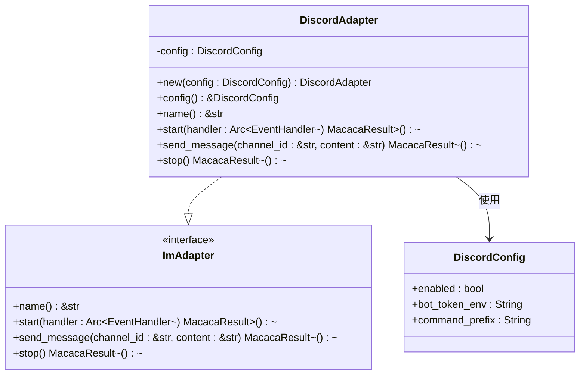
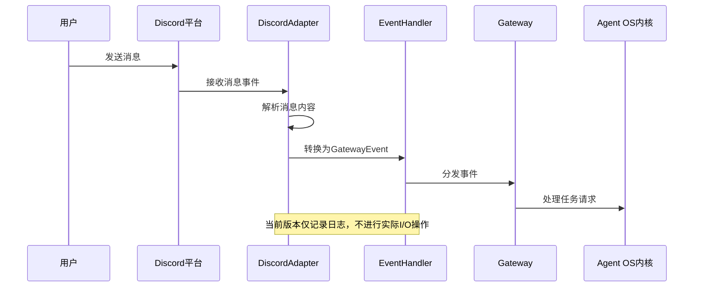
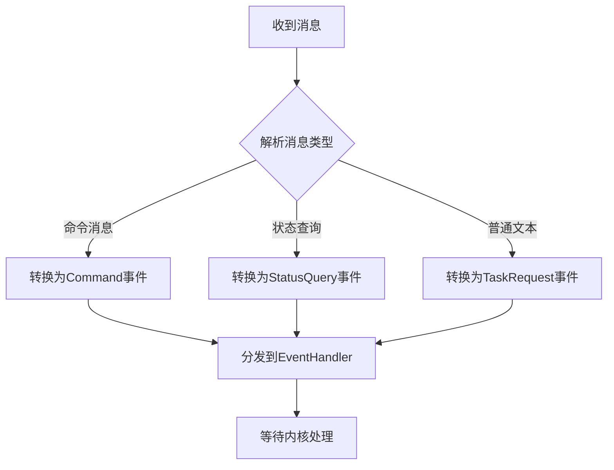
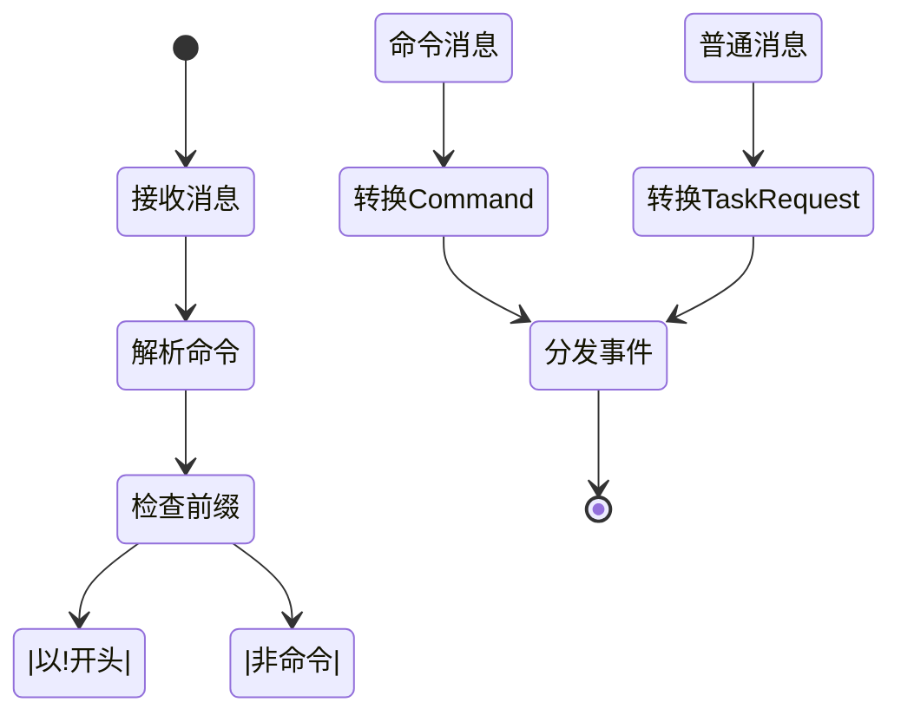
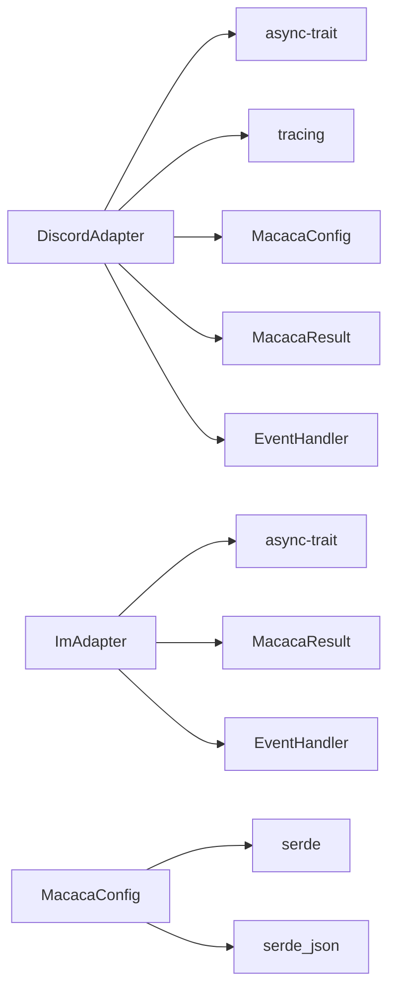
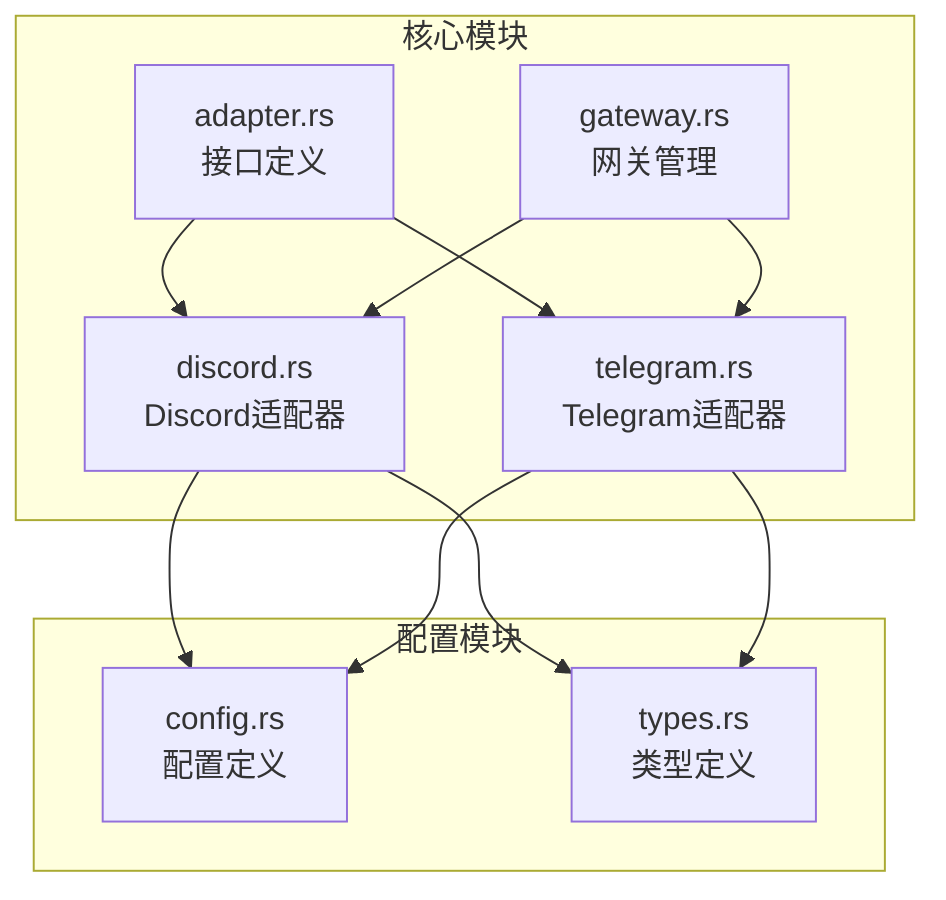

# Discord适配器

<cite>
**本文档引用的文件**
- [discord.rs](file://macaca/crates/macaca-gateway/src/discord.rs)
- [lib.rs](file://macaca/crates/macaca-gateway/src/lib.rs)
- [config.rs](file://macaca/crates/macaca-proto/src/config.rs)
- [adapter.rs](file://macaca/crates/macaca-gateway/src/adapter.rs)
- [gateway.rs](file://macaca/crates/macaca-gateway/src/gateway.rs)
- [types.rs](file://macaca/crates/macaca-proto/src/types.rs)
- [default.toml](file://macaca/config/default.toml)
- [telegram.rs](file://macaca/crates/macaca-gateway/src/telegram.rs)
- [gateway_pipeline.rs](file://macaca/crates/macaca-integration-tests/tests/gateway_pipeline.rs)
</cite>

## 目录
1. [简介](#简介)
2. [项目结构](#项目结构)
3. [核心组件](#核心组件)
4. [架构概览](#架构概览)
5. [详细组件分析](#详细组件分析)
6. [依赖关系分析](#依赖关系分析)
7. [性能考虑](#性能考虑)
8. [故障排除指南](#故障排除指南)
9. [结论](#结论)
10. [附录](#附录)

## 简介

Discord适配器是Agent OS网关层中的一个插件化即时通讯适配器，用于连接Discord平台并将其消息转换为统一的Gateway事件格式。当前实现是一个占位符实现，尚未集成真实的Discord API，但已经建立了完整的框架结构，为后续集成serenity SDK做好了准备。

该适配器实现了IM适配器接口，支持消息发送、事件处理和生命周期管理，并与Telegram适配器采用相同的架构模式。通过配置系统，用户可以启用或禁用Discord适配器，并设置相应的参数。

## 项目结构

Discord适配器位于macaca-gateway crate中，与Telegram适配器共享相同的架构模式：

```mermaid
graph TB
subgraph "macaca-gateway crate"
A[adapter.rs<br/>IM适配器接口]
B[gateway.rs<br/>网关管理器]
C[telegram.rs<br/>Telegram适配器]
D[discord.rs<br/>Discord适配器(占位符)]
E[lib.rs<br/>模块导出]
end
subgraph "macaca-proto crate"
F[config.rs<br/>配置定义]
G[types.rs<br/>事件类型定义]
end
subgraph "配置文件"
H[default.toml<br/>默认配置]
end
A --> B
B --> C
B --> D
C --> F
D --> F
C --> G
D --> G
E --> A
E --> B
E --> C
E --> D
```

**图表来源**
- [lib.rs:1-28](file://macaca/crates/macaca-gateway/src/lib.rs#L1-L28)
- [adapter.rs:1-35](file://macaca/crates/macaca-gateway/src/adapter.rs#L1-L35)
- [gateway.rs:1-62](file://macaca/crates/macaca-gateway/src/gateway.rs#L1-L62)

**章节来源**
- [lib.rs:1-28](file://macaca/crates/macaca-gateway/src/lib.rs#L1-L28)
- [discord.rs:1-108](file://macaca/crates/macaca-gateway/src/discord.rs#L1-L108)

## 核心组件

### DiscordAdapter结构

DiscordAdapter是Discord适配器的主要实现，当前版本作为占位符存在：



**图表来源**
- [discord.rs:20-64](file://macaca/crates/macaca-gateway/src/discord.rs#L20-L64)
- [config.rs:198-202](file://macaca/crates/macaca-proto/src/config.rs#L198-L202)
- [adapter.rs:14-27](file://macaca/crates/macaca-gateway/src/adapter.rs#L14-L27)

### 配置系统

Discord适配器使用统一的配置系统，支持环境变量覆盖：

| 配置项 | 类型 | 默认值 | 描述 |
|--------|------|--------|------|
| gateway.discord.enabled | bool | true | 是否启用Discord适配器 |
| gateway.discord.bot_token_env | string | "DISCORD_BOT_TOKEN" | Discord机器人令牌的环境变量名 |
| gateway.discord.command_prefix | string | "!" | 命令前缀字符 |

**章节来源**
- [config.rs:184-202](file://macaca/crates/macaca-proto/src/config.rs#L184-L202)
- [default.toml:101-104](file://macaca/config/default.toml#L101-L104)

## 架构概览

Discord适配器遵循插件化架构设计，与Telegram适配器共享相同的接口契约：



**图表来源**
- [discord.rs:42-63](file://macaca/crates/macaca-gateway/src/discord.rs#L42-L63)
- [gateway.rs:44-61](file://macaca/crates/macaca-gateway/src/gateway.rs#L44-L61)

## 详细组件分析

### DiscordAdapter实现分析

当前的DiscordAdapter实现具有以下特点：

#### 生命周期管理
- **启动过程**: 记录配置信息但不建立实际连接
- **停止过程**: 执行清理但无实际资源释放
- **错误处理**: 通过日志记录而非抛出异常

#### 消息处理流程


**图表来源**
- [discord.rs:42-63](file://macaca/crates/macaca-gateway/src/discord.rs#L42-L63)

#### 配置访问方法
适配器提供了便捷的方法来访问底层配置：

```rust
let adapter = DiscordAdapter::new(discord_config);
let config = adapter.config();
println!("Bot Token环境变量: {}", config.bot_token_env);
println!("命令前缀: {}", config.command_prefix);
```

**章节来源**
- [discord.rs:24-34](file://macaca/crates/macaca-gateway/src/discord.rs#L24-L34)
- [discord.rs:42-63](file://macaca/crates/macaca-gateway/src/discord.rs#L42-L63)

### 与Telegram适配器的对比

| 特性 | Discord适配器(占位符) | Telegram适配器 |
|------|---------------------|---------------|
| 连接方式 | 无实际连接 | HTTP长轮询 |
| 消息解析 | 日志记录 | JSON解析 |
| 发送消息 | 日志记录 | Bot API调用 |
| 错误处理 | 忽略 | 详细错误报告 |
| 配置读取 | 环境变量 | 环境变量 |

**章节来源**
- [telegram.rs:109-208](file://macaca/crates/macaca-gateway/src/telegram.rs#L109-L208)
- [discord.rs:42-63](file://macaca/crates/macaca-gateway/src/discord.rs#L42-L63)

### 事件处理机制

Discord适配器将Discord消息转换为统一的Gateway事件格式：



**图表来源**
- [types.rs:571-594](file://macaca/crates/macaca-proto/src/types.rs#L571-L594)

**章节来源**
- [types.rs:571-594](file://macaca/crates/macaca-proto/src/types.rs#L571-L594)

## 依赖关系分析

### 外部依赖

Discord适配器的依赖关系相对简单：



**图表来源**
- [discord.rs:7-15](file://macaca/crates/macaca-gateway/src/discord.rs#L7-L15)
- [adapter.rs:3-8](file://macaca/crates/macaca-gateway/src/adapter.rs#L3-L8)

### 内部模块依赖



**图表来源**
- [lib.rs:19-27](file://macaca/crates/macaca-gateway/src/lib.rs#L19-L27)

**章节来源**
- [lib.rs:19-27](file://macaca/crates/macaca-gateway/src/lib.rs#L19-L27)

## 性能考虑

### 当前实现的性能特征

由于Discord适配器目前是占位符实现，其性能特征主要体现在：

1. **内存占用**: 仅存储配置信息，无额外状态
2. **CPU开销**: 无实际计算，仅日志记录
3. **网络延迟**: 无网络I/O，延迟为零
4. **并发处理**: 支持异步处理，但无实际工作负载

### 未来优化方向

当集成真实Discord API后，可能的性能优化包括：

- **连接池管理**: 复用HTTP连接减少握手开销
- **消息批处理**: 合并多个小消息提高传输效率
- **缓存策略**: 缓存频道和用户信息减少API调用
- **背压控制**: 实现消息队列防止过载

## 故障排除指南

### 常见问题诊断

#### 适配器未启动
检查配置文件中的Discord部分：
```toml
[gateway.discord]
enabled = true
bot_token_env = "DISCORD_BOT_TOKEN"
command_prefix = "!"
```

#### 环境变量未设置
确保设置了正确的环境变量：
```bash
export DISCORD_BOT_TOKEN="your-bot-token-here"
```

#### 事件未被处理
检查事件处理器是否正确注册：
```rust
let handler: Arc<dyn EventHandler> = Arc::new(DefaultEventHandler);
let mut gateway = Gateway::new(handler);
gateway.register_adapter(Box::new(DiscordAdapter::new(config)));
```

**章节来源**
- [gateway_pipeline.rs:67-79](file://macaca/crates/macaca-integration-tests/tests/gateway_pipeline.rs#L67-L79)

### 日志分析

当前实现会记录关键操作的日志：
- 适配器启动信息
- 消息发送尝试
- 适配器停止信息

这些日志有助于调试适配器生命周期问题。

## 结论

Discord适配器当前作为一个功能完整的占位符实现，建立了坚实的架构基础。虽然尚未集成真实的Discord API，但其设计充分考虑了未来的扩展需求。

### 主要成就
1. **完整的接口实现**: 符合ImAdapter契约的所有方法
2. **统一的配置系统**: 与Telegram适配器共享配置格式
3. **清晰的架构分离**: 适配器与事件处理逻辑完全解耦
4. **完善的测试覆盖**: 包含单元测试和集成测试

### 未来发展方向
1. **集成serenity SDK**: 实现真实的Discord API连接
2. **消息格式支持**: 添加对嵌入消息、文件上传等功能的支持
3. **权限管理**: 实现Discord服务器权限验证机制
4. **实时事件监听**: 支持WebSocket连接进行实时消息接收

## 附录

### 配置示例

完整的Discord适配器配置示例：

```toml
[gateway]
enabled = true

[gateway.discord]
enabled = true
bot_token_env = "DISCORD_BOT_TOKEN"
command_prefix = "!"
```

### 环境变量设置

```bash
# 设置Discord机器人令牌
export DISCORD_BOT_TOKEN="MTI3NzQ1MzIwOTg3NDU2MzQ1NjU0MzIwOTg3NDU"

# 设置日志级别
export AOS_OBSERVABILITY__LOG_LEVEL="debug"

# 启用追踪
export AOS_OBSERVABILITY__TRACING_ENABLED=true
```

### 部署步骤

1. **获取Discord机器人令牌**
   - 在Discord开发者门户创建应用
   - 添加Bot权限并复制令牌
   - 将令牌设置为环境变量

2. **配置应用程序**
   - 更新配置文件中的bot_token_env
   - 设置适当的command_prefix
   - 启用适配器

3. **启动服务**
   ```bash
   cargo run
   ```

4. **验证连接**
   - 查看启动日志确认适配器已加载
   - 测试消息发送功能
   - 监控事件处理情况

**章节来源**
- [default.toml:101-104](file://macaca/config/default.toml#L101-L104)
- [config.rs:329-352](file://macaca/crates/macaca-proto/src/config.rs#L329-L352)