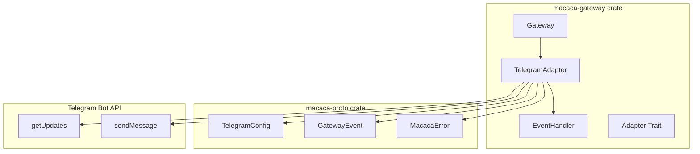
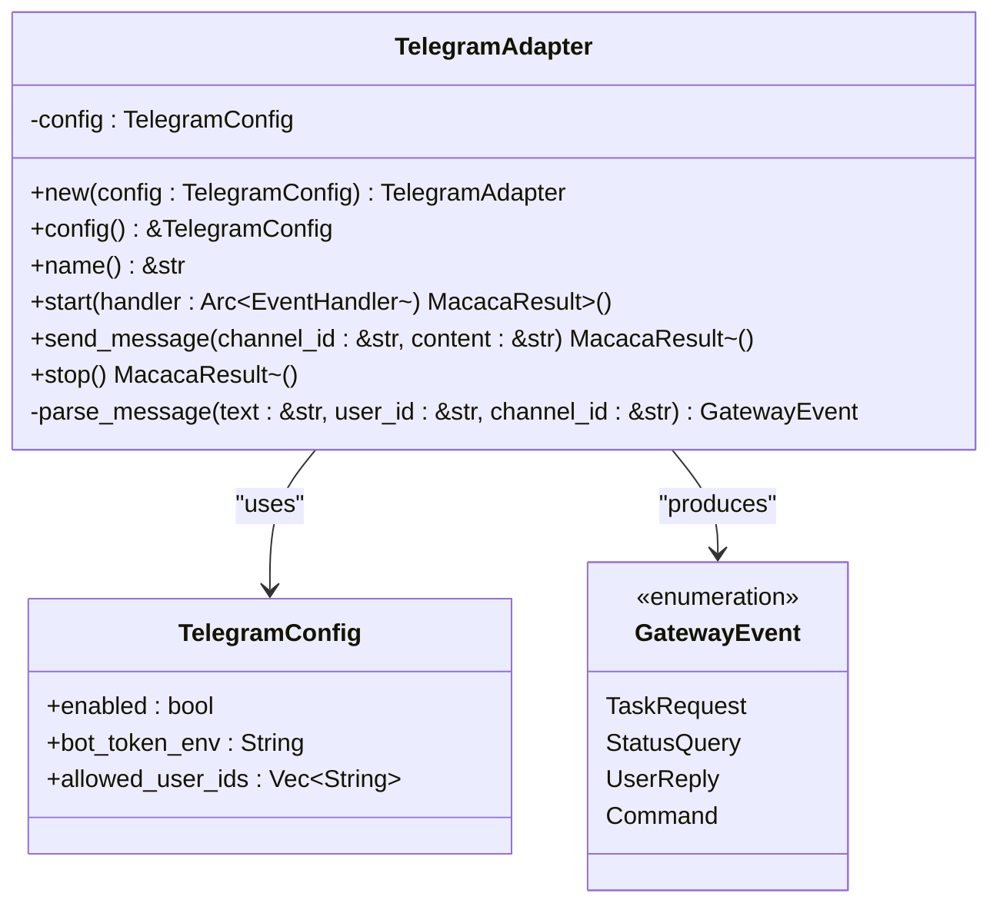
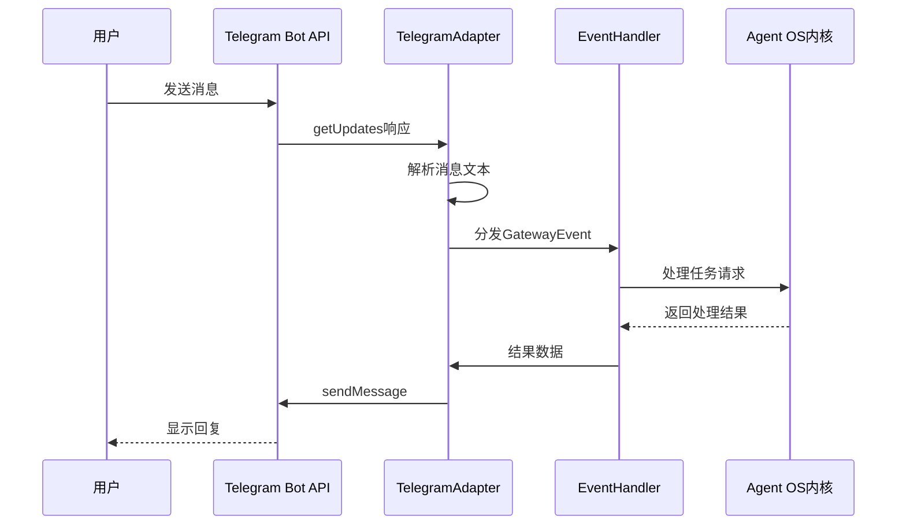
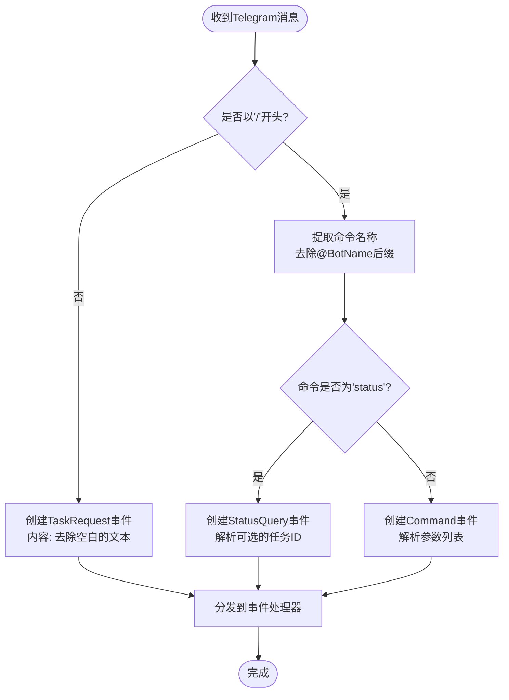
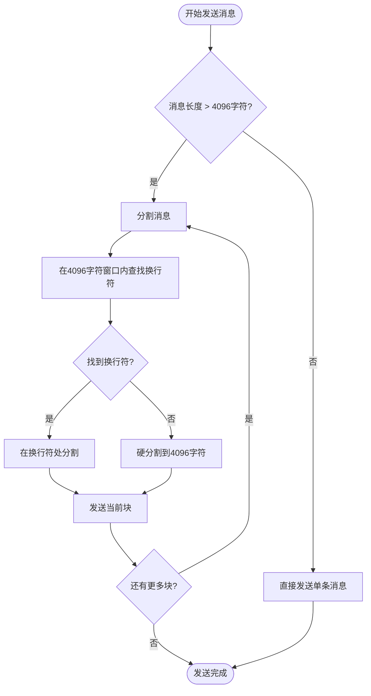
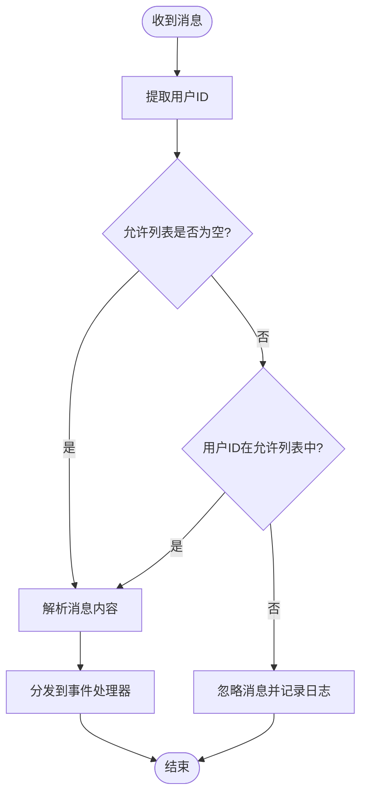
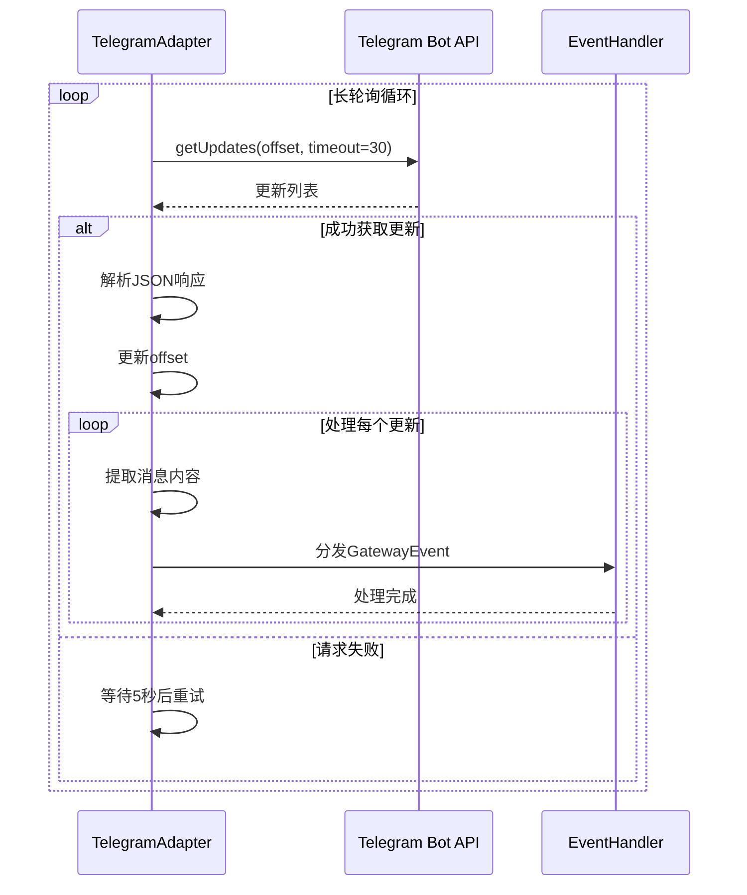
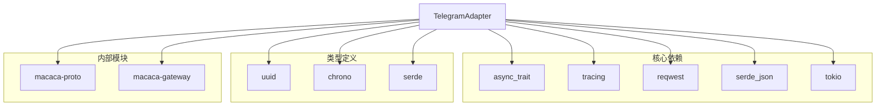

# Telegram适配器

<cite>
**本文档引用的文件**
- [telegram.rs](file://macaca/crates/macaca-gateway/src/telegram.rs)
- [lib.rs](file://macaca/crates/macaca-gateway/src/lib.rs)
- [adapter.rs](file://macaca/crates/macaca-gateway/src/adapter.rs)
- [gateway.rs](file://macaca/crates/macaca-gateway/src/gateway.rs)
- [config.rs](file://macaca/crates/macaca-proto/src/config.rs)
- [types.rs](file://macaca/crates/macaca-proto/src/types.rs)
- [error.rs](file://macaca/crates/macaca-proto/src/error.rs)
- [default.toml](file://macaca/config/default.toml)
- [install-systemd.sh](file://macaca/deploy/install-systemd.sh)
- [macaca.service](file://macaca/deploy/macaca.service)
</cite>

## 目录
1. [简介](#简介)
2. [项目结构](#项目结构)
3. [核心组件](#核心组件)
4. [架构概览](#架构概览)
5. [详细组件分析](#详细组件分析)
6. [依赖关系分析](#依赖关系分析)
7. [性能考虑](#性能考虑)
8. [故障排除指南](#故障排除指南)
9. [结论](#结论)
10. [附录](#附录)

## 简介

Telegram适配器是Agent OS项目中的一个关键组件，负责通过Telegram Bot API与Telegram平台进行交互。该适配器实现了长轮询机制，持续监听来自Telegram的消息更新，并将解析后的事件分发给事件处理器。同时，它还提供了消息发送功能，支持自动消息分割以适应Telegram的4096字符限制。

Telegram适配器采用模块化设计，遵循插件化架构，可以与其他即时通讯平台适配器（如Discord）并行运行。它使用异步编程模型，基于Tokio运行时执行并发操作，并通过tracing日志系统提供详细的运行时信息。

## 项目结构

Telegram适配器位于macaca-gateway crate中，与整个Agent OS系统的架构紧密集成：



**图表来源**
- [telegram.rs:1-494](file://macaca/crates/macaca-gateway/src/telegram.rs#L1-L494)
- [lib.rs:1-28](file://macaca/crates/macaca-gateway/src/lib.rs#L1-L28)

**章节来源**
- [lib.rs:1-28](file://macaca/crates/macaca-gateway/src/lib.rs#L1-L28)
- [telegram.rs:1-494](file://macaca/crates/macaca-gateway/src/telegram.rs#L1-L494)

## 核心组件

### TelegramAdapter结构体

TelegramAdapter是适配器的核心实现，负责与Telegram Bot API的交互：



**图表来源**
- [telegram.rs:30-95](file://macaca/crates/macaca-gateway/src/telegram.rs#L30-L95)
- [config.rs:190-195](file://macaca/crates/macaca-proto/src/config.rs#L190-L195)
- [types.rs:570-594](file://macaca/crates/macaca-proto/src/types.rs#L570-L594)

### 事件处理流程

Telegram适配器实现了ImAdapter trait，提供统一的接口用于消息接收和发送：

**章节来源**
- [adapter.rs:9-27](file://macaca/crates/macaca-gateway/src/adapter.rs#L9-L27)
- [telegram.rs:97-258](file://macaca/crates/macaca-gateway/src/telegram.rs#L97-L258)

## 架构概览

Telegram适配器在整个Agent OS架构中扮演着网关的角色，连接外部IM平台与内部系统：



**图表来源**
- [telegram.rs:109-208](file://macaca/crates/macaca-gateway/src/telegram.rs#L109-L208)
- [gateway.rs:43-61](file://macaca/crates/macaca-gateway/src/gateway.rs#L43-L61)

### 配置管理

适配器使用集中式配置管理系统，支持环境变量覆盖：

**章节来源**
- [config.rs:183-195](file://macaca/crates/macaca-proto/src/config.rs#L183-L195)
- [default.toml:96-99](file://macaca/config/default.toml#L96-L99)

## 详细组件分析

### 消息解析机制

Telegram适配器实现了智能的消息解析逻辑，能够识别不同类型的命令和普通消息：



**图表来源**
- [telegram.rs:50-94](file://macaca/crates/macaca-gateway/src/telegram.rs#L50-L94)

#### 特殊命令处理

适配器支持以下特殊命令：
- `/status [task_id]`: 查询任务状态
- `/command [args...]`: 执行通用命令
- 普通文本: 创建任务请求

**章节来源**
- [telegram.rs:45-94](file://macaca/crates/macaca-gateway/src/telegram.rs#L45-L94)

### 消息发送机制

发送机制实现了自动消息分割功能，确保长消息能够正确传输：



**图表来源**
- [telegram.rs:214-249](file://macaca/crates/macaca-gateway/src/telegram.rs#L214-L249)
- [telegram.rs:267-293](file://macaca/crates/macaca-gateway/src/telegram.rs#L267-L293)

#### 发送配置

消息发送使用HTML解析模式，支持：
- 普通文本: HTML解析模式
- 代码块: Markdown解析模式（由调用方决定）
- 自动分割: 最大4096字符

**章节来源**
- [telegram.rs:210-249](file://macaca/crates/macaca-gateway/src/telegram.rs#L210-L249)

### 用户身份验证和权限管理

适配器实现了基于用户ID的访问控制机制：



**图表来源**
- [telegram.rs:193-203](file://macaca/crates/macaca-gateway/src/telegram.rs#L193-L203)

#### 权限控制特性

- 支持白名单机制，仅允许指定用户ID的消息
- 当允许列表为空时，接受所有用户的消息
- 使用字符串匹配而非类型转换，避免用户ID格式错误

**章节来源**
- [telegram.rs:193-197](file://macaca/crates/macaca-gateway/src/telegram.rs#L193-L197)

### 长轮询实现

适配器使用Telegram Bot API的长轮询机制，实现近实时的消息监听：



**图表来源**
- [telegram.rs:131-205](file://macaca/crates/macaca-gateway/src/telegram.rs#L131-L205)

#### 轮询参数

- 超时时间: 30秒
- 偏移量: 基于update_id自动维护
- 错误处理: 5秒退避重试

**章节来源**
- [telegram.rs:134-162](file://macaca/crates/macaca-gateway/src/telegram.rs#L134-L162)

## 依赖关系分析

### 外部依赖

Telegram适配器依赖以下关键库：



**图表来源**
- [telegram.rs:9-18](file://macaca/crates/macaca-gateway/src/telegram.rs#L9-L18)

### 内部模块依赖

适配器与Agent OS系统的其他模块紧密集成：

**章节来源**
- [lib.rs:19-27](file://macaca/crates/macaca-gateway/src/lib.rs#L19-L27)

## 性能考虑

### 并发处理

Telegram适配器采用异步并发模型，每个适配器实例在独立的Tokio任务中运行：

- 使用`tokio::spawn`创建后台任务
- 异步HTTP请求处理
- 非阻塞的消息解析和分发

### 资源管理

- 连接池复用: 使用单个Reqwest客户端实例
- 内存管理: 自动消息分割减少内存占用
- 错误恢复: 指数退避重试机制

### 监控和日志

- 使用tracing框架提供结构化日志
- 关键操作包含详细上下文信息
- 错误级别区分便于问题诊断

## 故障排除指南

### 常见问题及解决方案

#### Bot令牌配置问题

**问题**: 适配器无法启动或不接收消息
**原因**: TELEGRAM_BOT_TOKEN环境变量未设置
**解决方案**: 
1. 在环境文件中设置正确的Bot令牌
2. 确保环境变量名与配置一致
3. 重启服务使配置生效

#### 用户权限问题

**问题**: 消息被忽略或不响应
**原因**: 发送者不在允许列表中
**解决方案**:
1. 获取用户的Telegram用户ID
2. 将用户ID添加到allowed_user_ids配置
3. 重新启动适配器

#### 消息长度限制

**问题**: 长消息发送失败或截断
**原因**: 超过Telegram 4096字符限制
**解决方案**:
1. 适配器已自动处理消息分割
2. 检查网络连接稳定性
3. 监控发送日志确认所有块都已发送

#### 网络连接问题

**问题**: getUpdates请求失败
**解决方案**:
1. 检查网络连通性
2. 验证代理设置（如果使用）
3. 查看tracing日志中的错误详情

**章节来源**
- [telegram.rs:110-119](file://macaca/crates/macaca-gateway/src/telegram.rs#L110-L119)
- [telegram.rs:138-154](file://macaca/crates/macaca-gateway/src/telegram.rs#L138-L154)

### 日志分析

适配器提供详细的日志信息，有助于问题诊断：

- 启动和停止事件
- 消息接收和发送统计
- 错误和异常情况
- 配置加载信息

**章节来源**
- [telegram.rs:125-129](file://macaca/crates/macaca-gateway/src/telegram.rs#L125-L129)

## 结论

Telegram适配器是一个功能完整、设计良好的组件，成功实现了与Telegram Bot API的集成。其主要优势包括：

1. **可靠性**: 实现了完善的错误处理和重试机制
2. **安全性**: 支持用户ID白名单控制
3. **可扩展性**: 插件化架构支持多平台集成
4. **可观测性**: 详细的日志和监控支持
5. **性能**: 异步并发处理和资源优化

该适配器为Agent OS提供了稳定的Telegram集成能力，支持从简单的聊天机器人到复杂的企业级应用的各种场景。

## 附录

### 配置选项详解

| 配置项 | 类型 | 默认值 | 描述 |
|--------|------|--------|------|
| `gateway.telegram.enabled` | bool | true | 是否启用Telegram适配器 |
| `gateway.telegram.bot_token_env` | string | "TELEGRAM_BOT_TOKEN" | Bot令牌环境变量名 |
| `gateway.telegram.allowed_user_ids` | array[string] | [] | 允许使用的用户ID列表 |

**章节来源**
- [config.rs:183-195](file://macaca/crates/macaca-proto/src/config.rs#L183-L195)
- [default.toml:96-99](file://macaca/config/default.toml#L96-L99)

### 环境变量设置

推荐的环境变量配置：

```bash
# Telegram Bot配置
TELEGRAM_BOT_TOKEN=your_telegram_bot_token_here

# 日志配置
RUST_LOG=info

# 其他可能需要的环境变量
OPENAI_API_KEY=your_openai_key
DASHSCOPE_API_KEY=your_dashscope_key
```

**章节来源**
- [install-systemd.sh:25-31](file://macaca/deploy/install-systemd.sh#L25-L31)

### 部署指南

#### systemd服务配置

1. 安装systemd服务脚本：
```bash
./deploy/install-systemd.sh
```

2. 配置服务文件：
```bash
# 编辑 /etc/systemd/system/macaca.service
# 设置正确的可执行文件路径
```

3. 启动服务：
```bash
sudo systemctl enable macaca
sudo systemctl start macaca
```

#### 安全考虑

- 使用专用用户运行服务
- 限制文件系统访问权限
- 配置适当的资源限制
- 启用进程监控和自动重启

**章节来源**
- [install-systemd.sh:1-59](file://macaca/deploy/install-systemd.sh#L1-L59)
- [macaca.service:1-37](file://macaca/deploy/macaca.service#L1-L37)