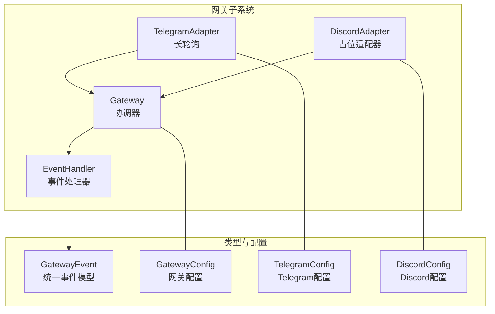
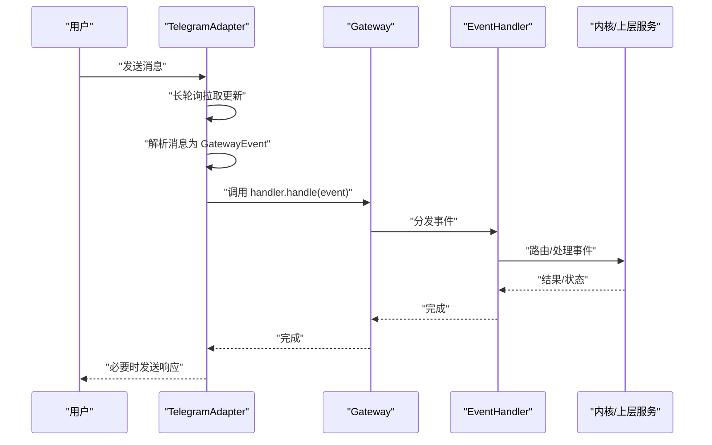
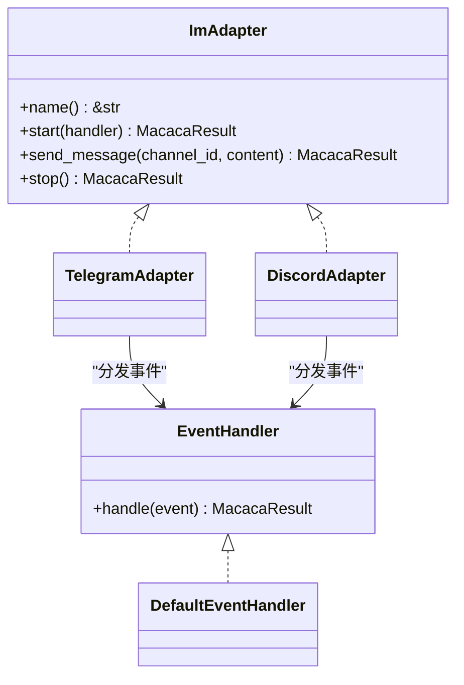
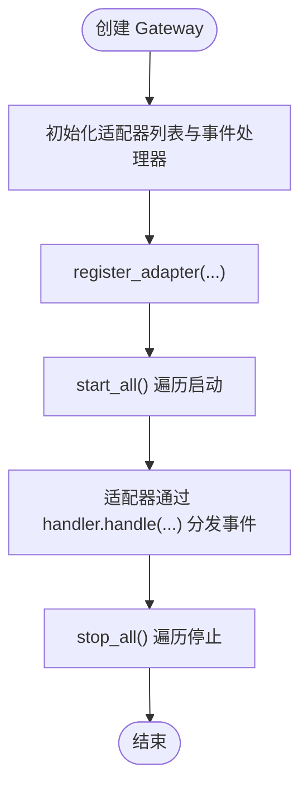
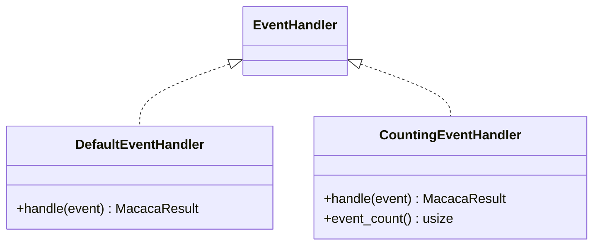
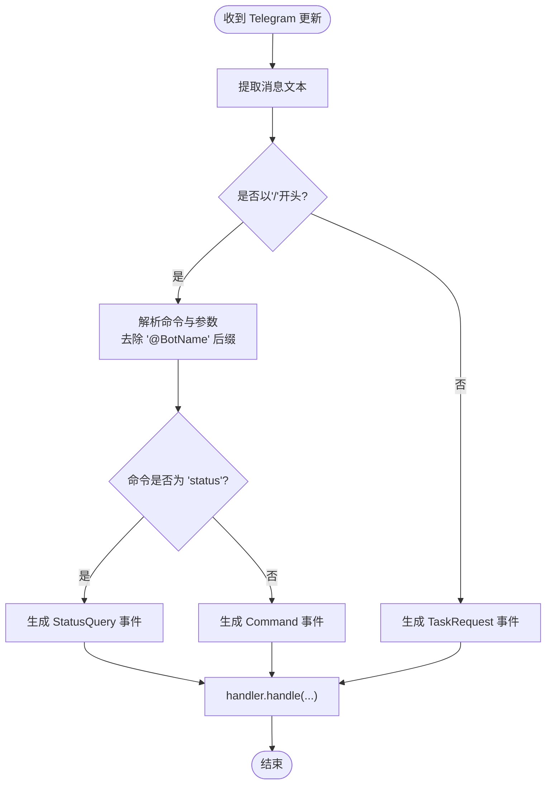
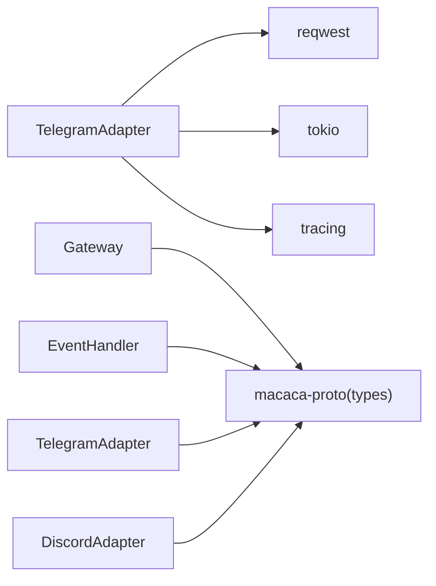

# 网关架构设计

<cite>
**本文引用的文件**
- [lib.rs](file://macaca/crates/macaca-gateway/src/lib.rs)
- [adapter.rs](file://macaca/crates/macaca-gateway/src/adapter.rs)
- [gateway.rs](file://macaca/crates/macaca-gateway/src/gateway.rs)
- [telegram.rs](file://macaca/crates/macaca-gateway/src/telegram.rs)
- [discord.rs](file://macaca/crates/macaca-gateway/src/discord.rs)
- [types.rs](file://macaca/crates/macaca-proto/src/types.rs)
- [config.rs](file://macaca/crates/macaca-proto/src/config.rs)
- [Cargo.toml](file://macaca/crates/macaca-gateway/Cargo.toml)
- [gateway_pipeline.rs](file://macaca/crates/macaca-integration-tests/tests/gateway_pipeline.rs)
- [lib.rs](file://macaca/crates/macaca-integration-tests/src/lib.rs)
- [Cargo.toml](file://macaca/Cargo.toml)
</cite>

## 目录
1. [引言](#引言)
2. [项目结构](#项目结构)
3. [核心组件](#核心组件)
4. [架构总览](#架构总览)
5. [详细组件分析](#详细组件分析)
6. [依赖分析](#依赖分析)
7. [性能考虑](#性能考虑)
8. [故障排查指南](#故障排查指南)
9. [结论](#结论)
10. [附录](#附录)

## 引言
本文件系统性阐述 Agent OS 中“网关”（Gateway）的架构设计与实现，重点覆盖以下方面：
- 整体架构模式：以插件化适配器为核心，通过统一的事件模型对接多即时通讯平台（IM）。
- 接口设计：ImAdapter 抽象与 EventHandler 事件处理器的职责边界与协作方式。
- 协调器实现：Gateway 如何注册、启动、停止多个适配器，并将事件分发给统一的事件处理器。
- 插件化架构：如何扩展支持 Telegram、Discord 等平台，以及未来扩展其他平台的路径。
- 事件处理流程：从消息接收、解析到转发的完整链路，含错误处理与可观测性。
- 架构决策与设计权衡：可扩展性、容错、性能与开发效率之间的取舍。

## 项目结构
网关位于独立的 crate 中，采用“适配器 + 协调器 + 事件处理器”的分层组织：
- 适配器层：TelegramAdapter、DiscordAdapter 实现 ImAdapter 接口，负责具体平台的消息收发与协议解析。
- 协调器层：Gateway 聚合多个适配器，统一生命周期管理与事件分发。
- 事件层：定义 GatewayEvent 统一事件模型，EventHandler 处理器抽象用于接收与路由事件。
- 类型与配置：macaca-proto 提供 GatewayEvent、TaskId 等类型；GatewayConfig、TelegramConfig、DiscordConfig 提供运行时配置。

图表来源
- [lib.rs:1-28](file://macaca/crates/macaca-gateway/src/lib.rs#L1-L28)
- [adapter.rs:1-35](file://macaca/crates/macaca-gateway/src/adapter.rs#L1-L35)
- [gateway.rs:1-62](file://macaca/crates/macaca-gateway/src/gateway.rs#L1-L62)
- [telegram.rs:1-494](file://macaca/crates/macaca-gateway/src/telegram.rs#L1-L494)
- [discord.rs:1-108](file://macaca/crates/macaca-gateway/src/discord.rs#L1-L108)
- [types.rs:568-615](file://macaca/crates/macaca-proto/src/types.rs#L568-L615)
- [config.rs:183-202](file://macaca/crates/macaca-proto/src/config.rs#L183-L202)

章节来源
- [lib.rs:1-28](file://macaca/crates/macaca-gateway/src/lib.rs#L1-L28)
- [Cargo.toml:1-16](file://macaca/crates/macaca-gateway/Cargo.toml#L1-L16)

## 核心组件
- ImAdapter 抽象：定义适配器的最小能力集（名称、启动、发送消息、停止），确保不同 IM 平台以一致方式接入。
- EventHandler 抽象：定义事件处理器接口，统一接收 GatewayEvent 并进行后续处理（如任务创建、状态查询、用户回复、命令执行等）。
- Gateway 协调器：集中管理适配器集合，负责注册、启动/停止生命周期管理，并将事件分发给统一的事件处理器。
- 适配器实现：
  - TelegramAdapter：基于 Telegram Bot API 的长轮询实现，解析消息为 GatewayEvent，支持消息拆分与发送。
  - DiscordAdapter：当前为占位实现，预留配置结构，便于后续集成 Discord SDK。
- 事件模型：GatewayEvent 定义了四种事件类型，覆盖任务请求、状态查询、用户回复与命令，保证跨平台一致性。

章节来源
- [adapter.rs:9-35](file://macaca/crates/macaca-gateway/src/adapter.rs#L9-L35)
- [gateway.rs:13-62](file://macaca/crates/macaca-gateway/src/gateway.rs#L13-L62)
- [telegram.rs:25-95](file://macaca/crates/macaca-gateway/src/telegram.rs#L25-L95)
- [discord.rs:17-34](file://macaca/crates/macaca-gateway/src/discord.rs#L17-L34)
- [types.rs:568-594](file://macaca/crates/macaca-proto/src/types.rs#L568-L594)

## 架构总览
下图展示了从 IM 平台到内核的端到端数据流：平台消息经由适配器解析为统一事件，再由 Gateway 分发至 EventHandler，最终交由内核或上层服务处理。

图表来源
- [telegram.rs:109-208](file://macaca/crates/macaca-gateway/src/telegram.rs#L109-L208)
- [gateway.rs:44-51](file://macaca/crates/macaca-gateway/src/gateway.rs#L44-L51)
- [adapter.rs:29-34](file://macaca/crates/macaca-gateway/src/adapter.rs#L29-L34)
- [types.rs:568-594](file://macaca/crates/macaca-proto/src/types.rs#L568-L594)

## 详细组件分析

### 组件A：ImAdapter 接口设计
- 设计要点
  - 名称标识：每个适配器提供稳定的人类可读名称，便于日志与运维识别。
  - 生命周期：start 接受 EventHandler 引用，使适配器在运行期能直接向处理器投递事件；stop 支持优雅退出。
  - 发送能力：send_message 以平台通用语义发送文本消息，便于上层统一调用。
- 扩展性
  - 新平台只需实现 ImAdapter，即可无缝接入 Gateway，无需修改协调器与事件处理器逻辑。
- 错误处理
  - 适配器内部捕获网络与解析异常，记录日志并返回统一错误类型，避免崩溃传播。

图表来源
- [adapter.rs:9-35](file://macaca/crates/macaca-gateway/src/adapter.rs#L9-L35)
- [telegram.rs:97-101](file://macaca/crates/macaca-gateway/src/telegram.rs#L97-L101)
- [discord.rs:36-40](file://macaca/crates/macaca-gateway/src/discord.rs#L36-L40)
- [gateway.rs:68-111](file://macaca/crates/macaca-gateway/src/gateway.rs#L68-L111)

章节来源
- [adapter.rs:9-35](file://macaca/crates/macaca-gateway/src/adapter.rs#L9-L35)

### 组件B：Gateway 协调器实现
- 职责
  - 注册与聚合：维护适配器列表，提供注册、统计与批量启停能力。
  - 启动流程：遍历适配器，传入共享的 EventHandler 引用，启动各自后台任务。
  - 停止流程：遍历适配器，触发优雅停止，确保资源释放。
- 可观测性
  - 关键生命周期事件均输出结构化日志，便于监控与排障。
- 测试验证
  - 集成测试覆盖空网关、双适配器注册、批量启停与事件计数。

图表来源
- [gateway.rs:23-62](file://macaca/crates/macaca-gateway/src/gateway.rs#L23-L62)

章节来源
- [gateway.rs:13-62](file://macaca/crates/macaca-gateway/src/gateway.rs#L13-L62)
- [gateway_pipeline.rs:67-79](file://macaca/crates/macaca-integration-tests/tests/gateway_pipeline.rs#L67-L79)

### 组件C：EventHandler 事件处理器
- 默认实现 DefaultEventHandler
  - 记录接收到的各类 GatewayEvent，便于开发调试与审计。
  - 生产环境建议替换为将事件路由到内核或工作流引擎的实现。
- 自定义实现
  - 可通过实现 EventHandler 接口，将事件转换为任务、状态查询、用户回复或命令执行等业务动作。

图表来源
- [gateway.rs:64-111](file://macaca/crates/macaca-gateway/src/gateway.rs#L64-L111)
- [gateway_pipeline.rs:19-41](file://macaca/crates/macaca-integration-tests/tests/gateway_pipeline.rs#L19-L41)

章节来源
- [gateway.rs:64-111](file://macaca/crates/macaca-gateway/src/gateway.rs#L64-L111)
- [gateway_pipeline.rs:82-129](file://macaca/crates/macaca-integration-tests/tests/gateway_pipeline.rs#L82-L129)

### 组件D：TelegramAdapter 消息解析与发送
- 解析规则
  - 以“/”开头的视为命令，支持带参数与“@BotName”后缀去除；“/status [task_id]”解析为状态查询事件；其余纯文本解析为任务请求事件。
  - 用户 ID 与频道 ID 来自 Telegram API 返回的上下文。
- 发送策略
  - 使用 HTML parse_mode 发送普通文本，Markdown 用于代码块。
  - 超过 4096 字符限制时，按换行优先拆分，避免破坏格式。
- 错误处理
  - 环境变量缺失时仅告警不阻塞；网络请求失败自动重试；JSON 解析失败记录错误并继续循环。
- 安全控制
  - 支持白名单用户过滤，未在允许列表中的消息会被忽略。

图表来源
- [telegram.rs:45-95](file://macaca/crates/macaca-gateway/src/telegram.rs#L45-L95)
- [telegram.rs:164-203](file://macaca/crates/macaca-gateway/src/telegram.rs#L164-L203)

章节来源
- [telegram.rs:45-95](file://macaca/crates/macaca-gateway/src/telegram.rs#L45-L95)
- [telegram.rs:109-208](file://macaca/crates/macaca-gateway/src/telegram.rs#L109-L208)
- [telegram.rs:214-258](file://macaca/crates/macaca-gateway/src/telegram.rs#L214-L258)

### 组件E：DiscordAdapter 占位实现
- 当前行为
  - 作为结构占位，保留 DiscordConfig 配置字段，日志记录启动/停止/发送调用，但不进行真实网络 I/O。
- 扩展路径
  - 通过引入 Discord SDK，在 start/send_message 中实现真实连接与消息收发，保持与 ImAdapter 接口一致。

章节来源
- [discord.rs:17-64](file://macaca/crates/macaca-gateway/src/discord.rs#L17-L64)

### 组件F：事件模型与统一类型
- GatewayEvent
  - 包含任务请求、状态查询、用户回复、命令四类事件，统一携带 user_id、channel_id 等上下文信息。
- 类型复用
  - 使用 TaskId 等类型，确保事件与内核任务系统的一致性。

章节来源
- [types.rs:568-594](file://macaca/crates/macaca-proto/src/types.rs#L568-L594)
- [types.rs:28-47](file://macaca/crates/macaca-proto/src/types.rs#L28-L47)

### 组件G：配置与运行时
- GatewayConfig
  - 控制网关开关与各平台配置项（启用、令牌环境变量、命令前缀、允许用户列表等）。
- 配置加载
  - 支持从默认路径加载 TOML 文件，并通过环境变量覆盖，便于容器化与多环境部署。

章节来源
- [config.rs:183-202](file://macaca/crates/macaca-proto/src/config.rs#L183-L202)
- [config.rs:329-352](file://macaca/crates/macaca-proto/src/config.rs#L329-L352)

## 依赖分析
- 内部依赖
  - macaca-gateway 依赖 macaca-proto 提供统一事件类型与配置结构。
  - TelegramAdapter 依赖 reqwest 进行 HTTP 请求，tokio 异步运行时与 tracing 日志。
- 外部依赖
  - async-trait、uuid、serde_json 等标准生态库。
- 工作区组织
  - 顶层 Cargo.toml 将 macaca-gateway 作为成员 crate，便于跨 crate 集成测试与统一构建。

图表来源
- [Cargo.toml:6-16](file://macaca/crates/macaca-gateway/Cargo.toml#L6-L16)
- [telegram.rs:1-18](file://macaca/crates/macaca-gateway/src/telegram.rs#L1-L18)
- [gateway.rs:1-11](file://macaca/crates/macaca-gateway/src/gateway.rs#L1-L11)

章节来源
- [Cargo.toml:1-16](file://macaca/crates/macaca-gateway/Cargo.toml#L1-L16)
- [Cargo.toml:1-25](file://macaca/Cargo.toml#L1-L25)

## 性能考虑
- 长轮询与并发
  - TelegramAdapter 使用长轮询与后台任务，避免阻塞主线程；建议在高并发场景下为每个适配器独立任务，减少相互影响。
- 消息拆分
  - 发送侧按换行拆分，避免超长消息导致失败；解析侧严格处理空文本与前后空白，减少无效事件。
- 错误退避
  - 网络请求失败时短暂休眠并重试，降低对上游 API 的压力。
- 可观测性
  - 结构化日志与事件计数器有助于定位热点与瓶颈。

## 故障排查指南
- 常见问题
  - 令牌环境变量未设置：适配器启动/发送会记录警告并跳过实际 I/O，检查配置与环境变量。
  - 未在允许用户列表：来自非白名单用户的消息将被忽略，确认 allowed_user_ids 设置。
  - JSON 解析失败：Telegram API 返回结构异常时会记录错误并继续轮询，检查网络与代理。
- 排查步骤
  - 查看适配器启动日志，确认已注册与启动成功。
  - 在 EventHandler 中增加计数器或日志，验证事件到达数量与类型。
  - 使用集成测试样例快速验证 Gateway 生命周期与事件分发。

章节来源
- [telegram.rs:110-119](file://macaca/crates/macaca-gateway/src/telegram.rs#L110-L119)
- [telegram.rs:147-154](file://macaca/crates/macaca-gateway/src/telegram.rs#L147-L154)
- [gateway_pipeline.rs:82-129](file://macaca/crates/macaca-integration-tests/tests/gateway_pipeline.rs#L82-L129)

## 结论
该网关架构通过清晰的接口抽象与统一事件模型，实现了对多 IM 平台的插件化接入。Gateway 协调器承担生命周期与分发职责，EventHandler 则面向业务扩展，既满足开发阶段的可观测性需求，也为生产环境的事件路由与内核集成预留了充分空间。未来可在 DiscordAdapter 中集成真实 SDK，并按需扩展更多平台适配器，保持一致的扩展体验。

## 附录
- 集成测试参考
  - 覆盖适配器注册、批量启停、事件计数与发送消息等关键路径，便于回归验证。

章节来源
- [gateway_pipeline.rs:67-190](file://macaca/crates/macaca-integration-tests/tests/gateway_pipeline.rs#L67-L190)
- [lib.rs:1-5](file://macaca/crates/macaca-integration-tests/src/lib.rs#L1-L5)