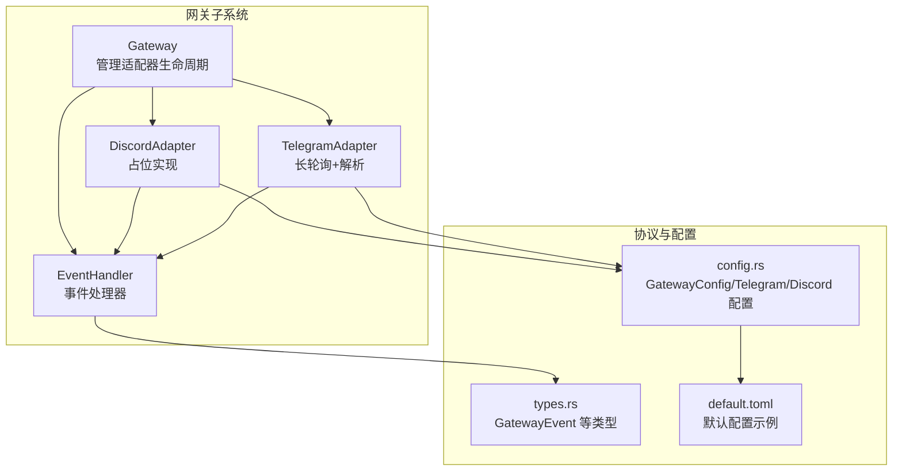
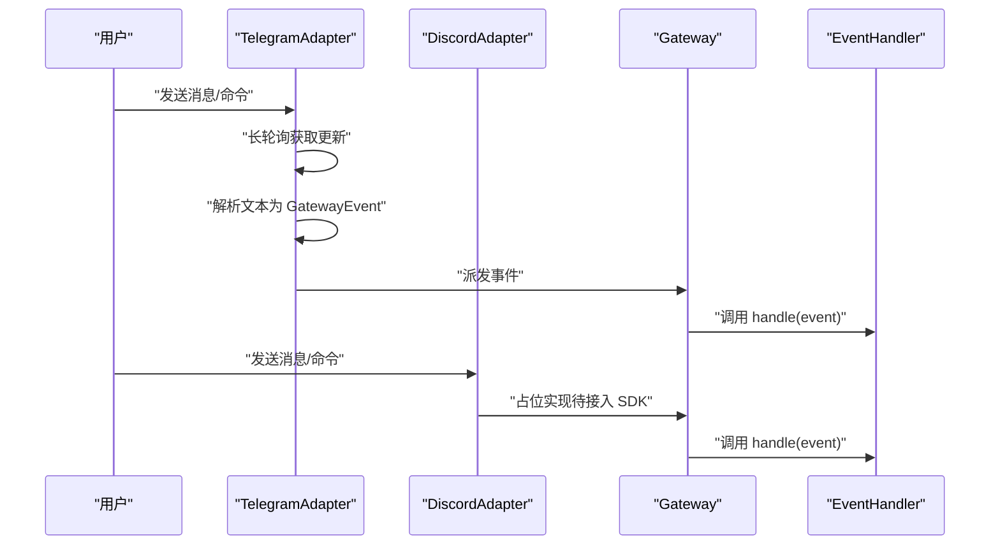
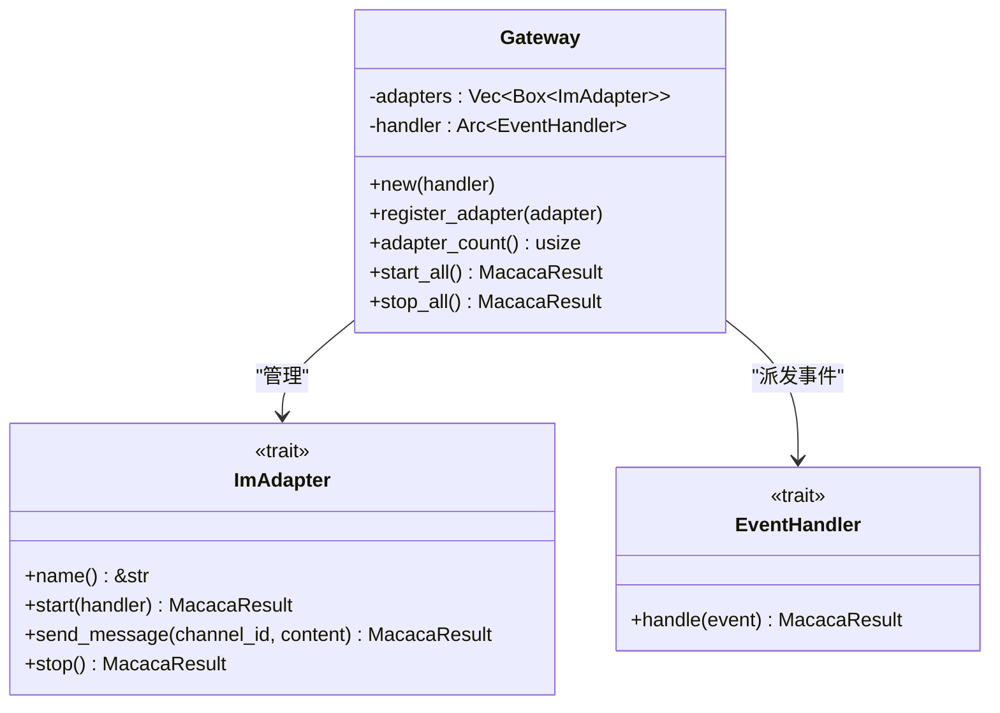
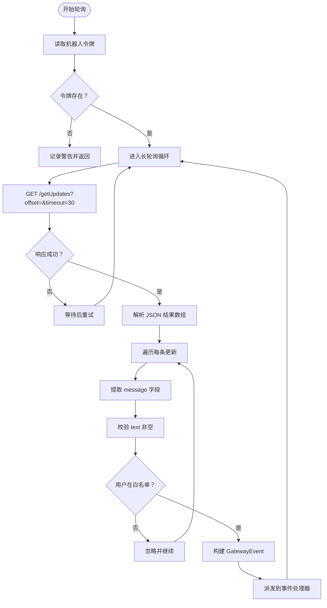
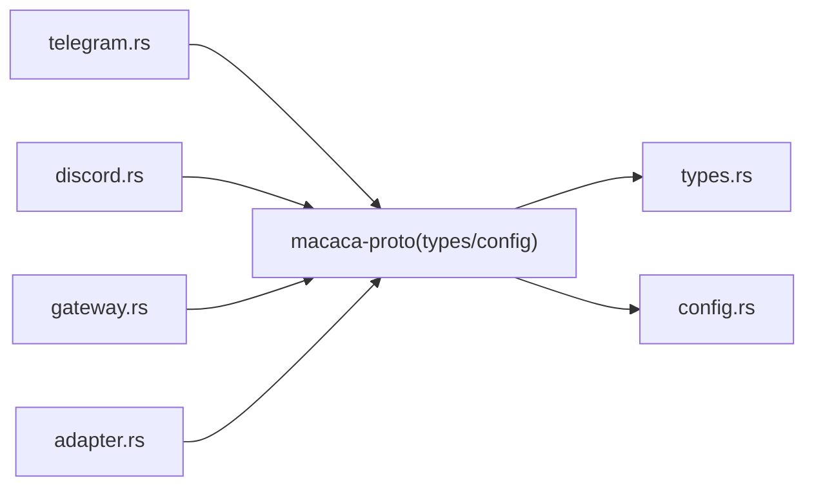

# 网关系统

<cite>
**本文引用的文件**
- [lib.rs](file://macaca/crates/macaca-gateway/src/lib.rs)
- [adapter.rs](file://macaca/crates/macaca-gateway/src/adapter.rs)
- [gateway.rs](file://macaca/crates/macaca-gateway/src/gateway.rs)
- [telegram.rs](file://macaca/crates/macaca-gateway/src/telegram.rs)
- [discord.rs](file://macaca/crates/macaca-gateway/src/discord.rs)
- [types.rs](file://macaca/crates/macaca-proto/src/types.rs)
- [config.rs](file://macaca/crates/macaca-proto/src/config.rs)
- [default.toml](file://macaca/config/default.toml)
- [Cargo.toml](file://macaca/crates/macaca-gateway/Cargo.toml)
- [gateway_pipeline.rs](file://macaca/crates/macaca-integration-tests/tests/gateway_pipeline.rs)
</cite>

## 目录
1. [简介](#简介)
2. [项目结构](#项目结构)
3. [核心组件](#核心组件)
4. [架构总览](#架构总览)
5. [组件详解](#组件详解)
6. [依赖关系分析](#依赖关系分析)
7. [性能与可靠性](#性能与可靠性)
8. [故障排除指南](#故障排除指南)
9. [结论](#结论)
10. [附录](#附录)

## 简介
本文件系统性地文档化“网关系统”，解释其在 Agent OS 中的角色：作为即时通讯（IM）平台的适配层，将用户输入统一转换为标准事件并分发给上层内核或工作流引擎。当前已实现 Telegram 适配器，Discord 适配器为占位实现，便于后续接入真实 SDK。本文面向开发者与运维人员，覆盖架构设计、数据流、适配器实现细节、自定义适配器开发指南、最佳实践、配置示例、部署建议与故障排除。

## 项目结构
网关系统位于 macaca/crates/macaca-gateway，采用模块化组织：
- adapter.rs 定义适配器与事件处理器的核心 trait
- gateway.rs 提供网关管理器，负责注册、启动/停止多个适配器，并将事件派发给统一的事件处理器
- telegram.rs 实现 Telegram Bot API 的长轮询与消息解析
- discord.rs 当前为 Discord 占位实现，预留后续接入真实 SDK 的扩展点
- lib.rs 汇总导出公共类型与适配器
- types.rs 定义跨模块共享的数据模型与事件类型
- config.rs 定义配置结构，包括网关、Telegram、Discord 的配置项
- default.toml 提供默认配置示例
- Cargo.toml 声明依赖（如 reqwest、tokio、async-trait、tracing 等）

图表来源
- [lib.rs:1-28](file://macaca/crates/macaca-gateway/src/lib.rs#L1-L28)
- [adapter.rs:1-35](file://macaca/crates/macaca-gateway/src/adapter.rs#L1-L35)
- [gateway.rs:1-62](file://macaca/crates/macaca-gateway/src/gateway.rs#L1-L62)
- [telegram.rs:1-494](file://macaca/crates/macaca-gateway/src/telegram.rs#L1-L494)
- [discord.rs:1-108](file://macaca/crates/macaca-gateway/src/discord.rs#L1-L108)
- [types.rs:568-594](file://macaca/crates/macaca-proto/src/types.rs#L568-L594)
- [config.rs:183-202](file://macaca/crates/macaca-proto/src/config.rs#L183-L202)
- [default.toml:93-104](file://macaca/config/default.toml#L93-L104)

章节来源
- [lib.rs:1-28](file://macaca/crates/macaca-gateway/src/lib.rs#L1-L28)
- [Cargo.toml:1-16](file://macaca/crates/macaca-gateway/Cargo.toml#L1-L16)

## 核心组件
- 适配器接口（ImAdapter）
  - 负责连接具体 IM 平台，从平台拉取消息或事件，解析为统一的 GatewayEvent，并通过事件处理器派发
  - 关键方法：name、start、send_message、stop
- 事件处理器（EventHandler）
  - 接收 GatewayEvent，执行业务逻辑（例如转交内核创建任务、查询状态、回传结果等）
  - 默认实现为记录日志的占位处理器
- 网关（Gateway）
  - 维护适配器列表与事件处理器，统一启动/停止所有适配器，并将事件派发给处理器
- 事件类型（GatewayEvent）
  - 标准化事件：任务请求、状态查询、用户回复、命令
- 配置（GatewayConfig/TelgramConfig/DiscordConfig）
  - 控制是否启用网关及各平台参数（如令牌环境变量、白名单、命令前缀等）

章节来源
- [adapter.rs:9-35](file://macaca/crates/macaca-gateway/src/adapter.rs#L9-L35)
- [gateway.rs:13-62](file://macaca/crates/macaca-gateway/src/gateway.rs#L13-L62)
- [types.rs:570-594](file://macaca/crates/macaca-proto/src/types.rs#L570-L594)
- [config.rs:183-202](file://macaca/crates/macaca-proto/src/config.rs#L183-L202)

## 架构总览
下图展示从 IM 平台到事件处理器的整体流程，以及 Telegram 与 Discord 适配器的差异：

图表来源
- [telegram.rs:109-208](file://macaca/crates/macaca-gateway/src/telegram.rs#L109-L208)
- [discord.rs:36-64](file://macaca/crates/macaca-gateway/src/discord.rs#L36-L64)
- [gateway.rs:44-61](file://macaca/crates/macaca-gateway/src/gateway.rs#L44-L61)
- [adapter.rs:29-34](file://macaca/crates/macaca-gateway/src/adapter.rs#L29-L34)

## 组件详解

### 网关管理器（Gateway）
- 职责
  - 注册多个 IM 适配器
  - 启动/停止所有适配器
  - 将事件派发给统一的事件处理器
- 生命周期
  - start_all：遍历适配器，传入事件处理器引用并启动
  - stop_all：逐个停止适配器
- 日志与可观测性
  - 使用 tracing 记录启动/停止与事件派发情况

图表来源
- [gateway.rs:18-62](file://macaca/crates/macaca-gateway/src/gateway.rs#L18-L62)
- [adapter.rs:14-34](file://macaca/crates/macaca-gateway/src/adapter.rs#L14-L34)

章节来源
- [gateway.rs:18-62](file://macaca/crates/macaca-gateway/src/gateway.rs#L18-L62)

### 事件处理器（EventHandler）与默认实现
- 默认处理器（DefaultEventHandler）
  - 接收 GatewayEvent 并记录日志
  - 生产环境中应替换为将事件转发至内核或工作流的实现
- 自定义处理器
  - 可统计事件数量、转发到内核、触发任务创建或状态查询等

章节来源
- [gateway.rs:68-111](file://macaca/crates/macaca-gateway/src/gateway.rs#L68-L111)

### 适配器接口（ImAdapter）
- 规范
  - name：返回适配器名称（如 "telegram"、"discord"）
  - start：启动适配器，接收事件处理器引用
  - send_message：向指定频道发送文本消息
  - stop：优雅停止
- 设计要点
  - 异步 trait，支持并发与非阻塞 I/O
  - 通过 Arc 共享事件处理器，避免重复克隆

章节来源
- [adapter.rs:14-27](file://macaca/crates/macaca-gateway/src/adapter.rs#L14-L27)

### Telegram 适配器（TelegramAdapter）
- 连接方式
  - 使用 Bot API 的长轮询（getUpdates），30 秒超时
  - 从环境变量读取机器人令牌，未设置时记录警告但不抛错
- 消息解析
  - 支持命令与普通文本两类
  - 命令前缀“/”，支持带 @BotName 的群聊命令
  - /status 命令可选携带任务 ID（UUID 解析）
- 白名单控制
  - 若配置了允许用户 ID 列表，则仅处理列表内的用户消息
- 发送消息
  - 使用 sendMessage，HTML 解析模式用于纯文本，Markdown 用于代码块
  - 超过平台限制长度的消息自动按换行拆分
- 错误处理
  - 请求失败与 JSON 解析失败会重试
  - 事件处理错误记录日志
- 生命周期
  - start 在后台任务中运行轮询循环
  - stop 为占位实现（进程退出时任务被丢弃）

图表来源
- [telegram.rs:109-208](file://macaca/crates/macaca-gateway/src/telegram.rs#L109-L208)
- [telegram.rs:45-94](file://macaca/crates/macaca-gateway/src/telegram.rs#L45-L94)

章节来源
- [telegram.rs:25-258](file://macaca/crates/macaca-gateway/src/telegram.rs#L25-L258)

### Discord 适配器（DiscordAdapter）
- 当前状态
  - 占位实现，不接入真实 SDK
  - 所有方法均记录日志，不执行实际网络 I/O
- 扩展路径
  - 未来接入 serenity 或其他 SDK，实现 start/send_message/stop
  - 复用现有配置结构（DiscordConfig）

章节来源
- [discord.rs:17-64](file://macaca/crates/macaca-gateway/src/discord.rs#L17-L64)

### 事件类型（GatewayEvent）
- 任务请求（TaskRequest）
  - 用户在频道中发送普通文本，表示发起任务
- 状态查询（StatusQuery）
  - /status 命令，可选携带任务 ID
- 用户回复（UserReply）
  - 用户对特定上下文的回复
- 命令（Command）
  - 以“/”开头的命令，包含命令名与参数列表

章节来源
- [types.rs:570-594](file://macaca/crates/macaca-proto/src/types.rs#L570-L594)

### 配置与默认值
- 网关配置（GatewayConfig）
  - enabled：是否启用网关
  - telegram：可选配置
  - discord：可选配置
- Telegram 配置（TelegramConfig）
  - enabled：是否启用
  - bot_token_env：令牌环境变量名
  - allowed_user_ids：允许的用户 ID 列表
- Discord 配置（DiscordConfig）
  - enabled：是否启用
  - bot_token_env：令牌环境变量名
  - command_prefix：命令前缀
- 默认配置文件（default.toml）
  - 提供示例与默认值，便于快速启动

章节来源
- [config.rs:183-202](file://macaca/crates/macaca-proto/src/config.rs#L183-L202)
- [default.toml:93-104](file://macaca/config/default.toml#L93-L104)

## 依赖关系分析
- 内部依赖
  - macaca-gateway 依赖 macaca-proto（types、config、error）
  - 适配器通过事件处理器与网关解耦
- 外部依赖
  - reqwest：HTTP 客户端（Telegram）
  - tokio：异步运行时
  - async-trait、tracing、uuid、serde_json 等

图表来源
- [telegram.rs:14-18](file://macaca/crates/macaca-gateway/src/telegram.rs#L14-L18)
- [discord.rs:12-15](file://macaca/crates/macaca-gateway/src/discord.rs#L12-L15)
- [gateway.rs:8-11](file://macaca/crates/macaca-gateway/src/gateway.rs#L8-L11)
- [adapter.rs:3-7](file://macaca/crates/macaca-gateway/src/adapter.rs#L3-L7)

章节来源
- [Cargo.toml:6-16](file://macaca/crates/macaca-gateway/Cargo.toml#L6-L16)

## 性能与可靠性
- 长轮询与背压
  - Telegram 使用 30 秒超时，降低瞬时压力；解析失败与网络异常会短暂休眠后重试
- 消息拆分
  - 超长文本按换行拆分，避免平台限制导致失败
- 并发与资源
  - 适配器通过独立 tokio 任务运行，避免阻塞
- 可观测性
  - 使用 tracing 记录关键事件，便于监控与排障

章节来源
- [telegram.rs:131-208](file://macaca/crates/macaca-gateway/src/telegram.rs#L131-L208)
- [telegram.rs:267-293](file://macaca/crates/macaca-gateway/src/telegram.rs#L267-L293)

## 故障排除指南
- Telegram 无法接收消息
  - 检查机器人令牌环境变量是否正确设置
  - 确认 allowed_user_ids 是否限制了你的用户 ID
  - 查看日志中的 getUpdates 请求与 JSON 解析错误
- Telegram 无法发送消息
  - 检查令牌环境变量
  - 超长文本会被自动拆分，确认是否出现发送失败错误
- Discord 占位实现无响应
  - 当前未接入真实 SDK，需按扩展路径实现
- 事件未到达处理器
  - 确认 Gateway 已注册适配器并启动
  - 检查事件处理器实现是否正确

章节来源
- [telegram.rs:110-119](file://macaca/crates/macaca-gateway/src/telegram.rs#L110-L119)
- [telegram.rs:193-197](file://macaca/crates/macaca-gateway/src/telegram.rs#L193-L197)
- [telegram.rs:214-249](file://macaca/crates/macaca-gateway/src/telegram.rs#L214-L249)
- [gateway.rs:44-61](file://macaca/crates/macaca-gateway/src/gateway.rs#L44-L61)

## 结论
网关系统通过统一的适配器接口与事件模型，将不同 IM 平台的消息标准化并集中派发。Telegram 适配器已具备生产可用能力，Discord 适配器为后续扩展预留空间。结合配置与可观测性，系统可在多平台环境下稳定运行，并为自定义适配器提供清晰的扩展路径。

## 附录

### 自定义网关适配器开发指南
- 必要步骤
  - 实现 ImAdapter trait：name/start/send_message/stop
  - 在 start 中接入平台 API，将原始事件解析为 GatewayEvent
  - 通过 Arc<EventHandler> 将事件派发给处理器
- 接口规范
  - 异步方法，支持并发
  - 使用 tracing 记录关键事件
- 事件处理
  - 在生产中将事件转发至内核或工作流，而非仅记录日志
- 错误恢复
  - 对网络请求与解析失败进行重试与降级处理
- 多平台一致性
  - 统一使用 GatewayEvent，确保用户 ID、频道 ID、内容等字段一致

章节来源
- [adapter.rs:14-27](file://macaca/crates/macaca-gateway/src/adapter.rs#L14-L27)
- [types.rs:570-594](file://macaca/crates/macaca-proto/src/types.rs#L570-L594)

### IM 平台集成最佳实践
- 消息格式标准化
  - 统一使用 GatewayEvent，避免平台差异带来的解析复杂度
- 用户状态管理
  - 通过用户 ID 与频道 ID 维持会话连续性
- 多平台一致性
  - 命令前缀与解析规则在各平台保持一致
- 安全与鉴权
  - 使用环境变量存储令牌，必要时加入白名单与权限控制

章节来源
- [config.rs:190-202](file://macaca/crates/macaca-proto/src/config.rs#L190-L202)
- [telegram.rs:45-94](file://macaca/crates/macaca-gateway/src/telegram.rs#L45-L94)

### 配置示例与部署建议
- 配置示例
  - 参考 default.toml 中的 [gateway]、[gateway.telegram]、[gateway.discord] 段落
- 部署建议
  - 将令牌存放在安全的环境变量中
  - 使用 systemd 或容器编排工具管理进程生命周期
  - 开启 tracing 与日志文件输出，便于问题定位

章节来源
- [default.toml:93-104](file://macaca/config/default.toml#L93-L104)
- [config.rs:329-352](file://macaca/crates/macaca-proto/src/config.rs#L329-L352)

### 测试与验证
- 单元测试
  - 包含适配器元数据、消息解析、消息拆分、生命周期等测试
- 集成测试
  - 覆盖适配器注册、启动/停止与事件处理流程

章节来源
- [telegram.rs:297-494](file://macaca/crates/macaca-gateway/src/telegram.rs#L297-L494)
- [gateway_pipeline.rs:1-53](file://macaca/crates/macaca-integration-tests/tests/gateway_pipeline.rs#L1-L53)