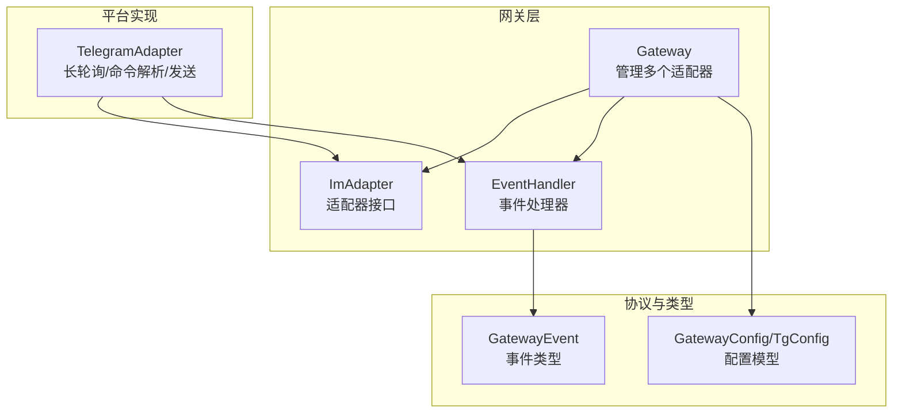
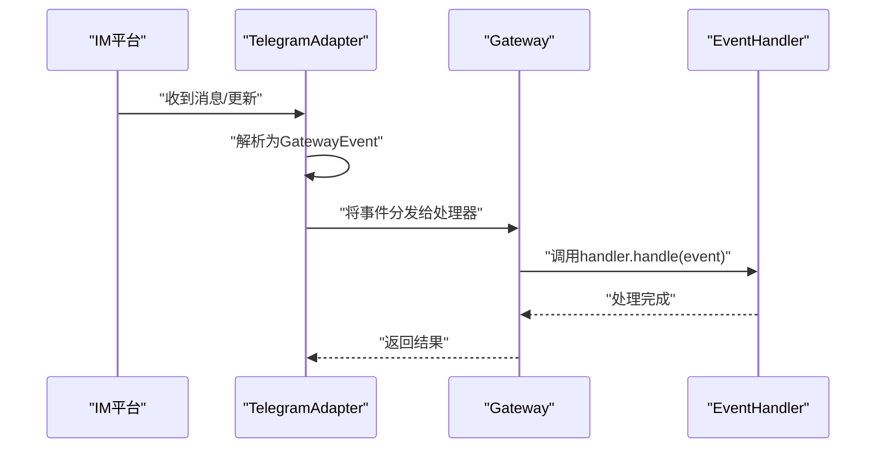
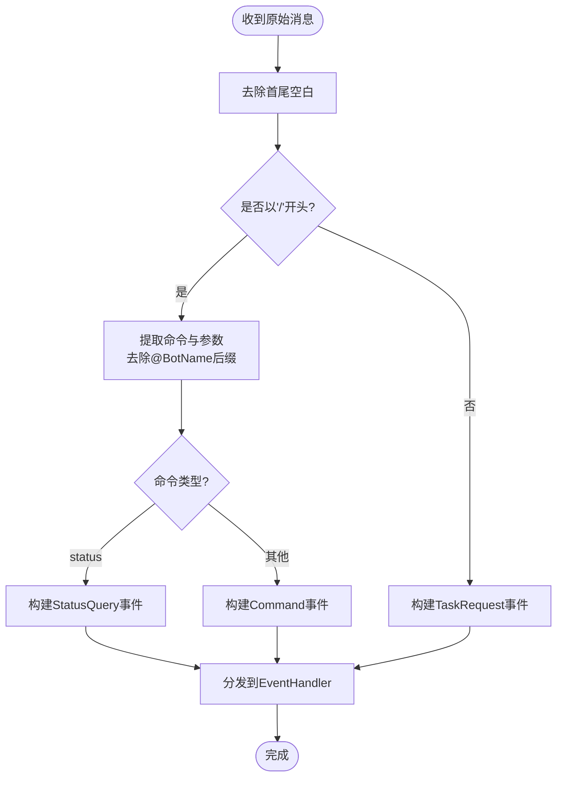
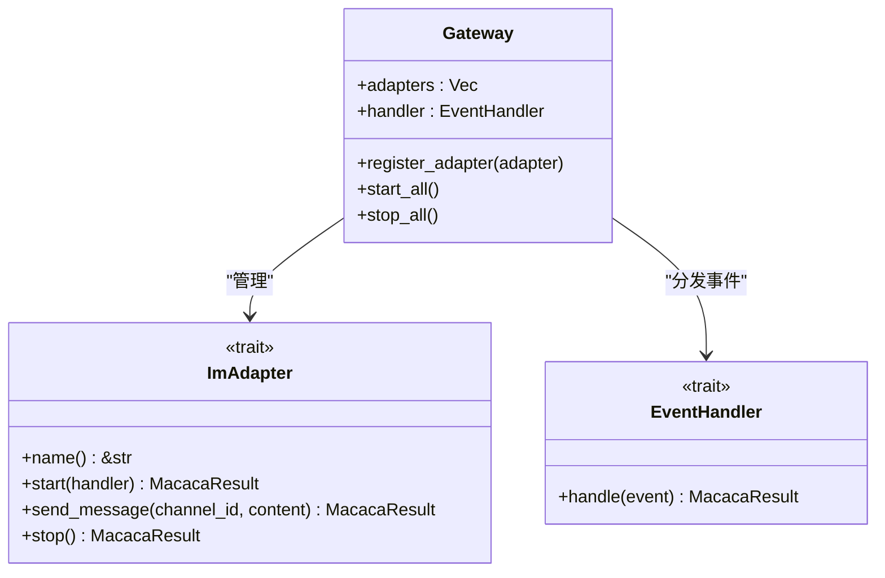
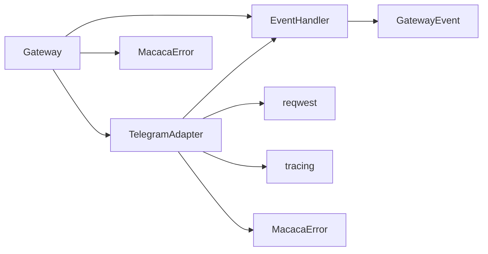

# 自定义适配器开发

<cite>
**本文档引用的文件**
- [adapter.rs](file://macaca/crates/macaca-gateway/src/adapter.rs)
- [gateway.rs](file://macaca/crates/macaca-gateway/src/gateway.rs)
- [telegram.rs](file://macaca/crates/macaca-gateway/src/telegram.rs)
- [lib.rs](file://macaca/crates/macaca-gateway/src/lib.rs)
- [types.rs](file://macaca/crates/macaca-proto/src/types.rs)
- [error.rs](file://macaca/crates/macaca-proto/src/error.rs)
- [config.rs](file://macaca/crates/macaca-proto/src/config.rs)
- [adapter.rs](file://macaca/crates/macaca-framework/src/adapter.rs)
- [adapter.rs](file://macaca/crates/macaca-mcp/src/adapter.rs)
- [gateway_pipeline.rs](file://macaca/crates/macaca-integration-tests/tests/gateway_pipeline.rs)
</cite>

## 目录
1. [简介](#简介)
2. [项目结构](#项目结构)
3. [核心组件](#核心组件)
4. [架构总览](#架构总览)
5. [详细组件分析](#详细组件分析)
6. [依赖关系分析](#依赖关系分析)
7. [性能考量](#性能考量)
8. [故障排查指南](#故障排查指南)
9. [结论](#结论)
10. [附录](#附录)

## 简介
本指南面向希望在 Agent OS 中开发自定义即时消息（IM）适配器的工程师。文档围绕 ImAdapter 接口规范、事件处理模式、开发流程、模板与最佳实践展开，并结合现有 Telegram 适配器与 Gateway 管理器的实际实现进行深入解析，帮助你从零开始完成适配器的实现、注册与集成。

## 项目结构
- 适配器核心位于 macaca-gateway 子系统，提供 ImAdapter trait、EventHandler trait 以及 Gateway 管理器。
- 事件类型定义于 macaca-proto，统一了 GatewayEvent 的结构与语义。
- 配置模型位于 macaca-proto 的 config.rs，包含 GatewayConfig、TelegramConfig 等。
- 示例与参考实现：TelegramAdapter 展示了长轮询拉取消息、命令解析与消息发送；Gateway 提供适配器注册与生命周期管理。

**图表来源**
- [gateway.rs:18-62](file://macaca/crates/macaca-gateway/src/gateway.rs#L18-L62)
- [adapter.rs:9-27](file://macaca/crates/macaca-gateway/src/adapter.rs#L9-L27)
- [telegram.rs:30-95](file://macaca/crates/macaca-gateway/src/telegram.rs#L30-L95)
- [types.rs:568-594](file://macaca/crates/macaca-proto/src/types.rs#L568-L594)
- [config.rs:183-202](file://macaca/crates/macaca-proto/src/config.rs#L183-L202)

**章节来源**
- [lib.rs:1-27](file://macaca/crates/macaca-gateway/src/lib.rs#L1-L27)
- [gateway.rs:1-62](file://macaca/crates/macaca-gateway/src/gateway.rs#L1-L62)
- [adapter.rs:1-34](file://macaca/crates/macaca-gateway/src/adapter.rs#L1-L34)
- [telegram.rs:1-95](file://macaca/crates/macaca-gateway/src/telegram.rs#L1-L95)
- [types.rs:568-594](file://macaca/crates/macaca-proto/src/types.rs#L568-L594)
- [config.rs:183-202](file://macaca/crates/macaca-proto/src/config.rs#L183-L202)

## 核心组件
- ImAdapter 接口：定义适配器的生命周期与消息收发能力，要求实现 name、start、send_message、stop 四个方法。
- EventHandler 接口：接收 GatewayEvent 并进行业务处理。
- Gateway 管理器：负责注册适配器、统一启动/停止所有适配器实例。
- GatewayEvent：统一的消息/命令/状态查询等事件载体。
- 配置模型：GatewayConfig、TelegramConfig 等，用于启用适配器与设置令牌、白名单等。

关键职责与契约
- ImAdapter::start(handler)：在后台任务中持续监听平台事件，将解析后的 GatewayEvent 通过 handler.handle 分发。
- ImAdapter::send_message(channel_id, content)：将文本内容发送至指定频道，必要时进行长度拆分与格式化。
- ImAdapter::stop()：优雅停止适配器（当前 Telegram 实现为占位，建议引入共享的停止信号）。
- EventHandler::handle(event)：处理事件，通常转发给内核或应用运行时以创建任务、查询状态等。

**章节来源**
- [adapter.rs:9-27](file://macaca/crates/macaca-gateway/src/adapter.rs#L9-L27)
- [gateway.rs:23-61](file://macaca/crates/macaca-gateway/src/gateway.rs#L23-L61)
- [types.rs:568-594](file://macaca/crates/macaca-proto/src/types.rs#L568-L594)
- [config.rs:183-202](file://macaca/crates/macaca-proto/src/config.rs#L183-L202)

## 架构总览
下图展示了从 IM 平台到内核的事件流转路径，Gateway 作为中枢协调多个适配器。

**图表来源**
- [telegram.rs:109-208](file://macaca/crates/macaca-gateway/src/telegram.rs#L109-L208)
- [gateway.rs:43-61](file://macaca/crates/macaca-gateway/src/gateway.rs#L43-L61)
- [adapter.rs:29-34](file://macaca/crates/macaca-gateway/src/adapter.rs#L29-L34)

## 详细组件分析

### ImAdapter 接口规范与实现要点
- 必需方法
  - name()：返回适配器名称（例如 "telegram"），用于日志与注册标识。
  - start(handler)：启动后台监听循环，将解析后的 GatewayEvent 交由 handler 处理。
  - send_message(channel_id, content)：发送文本消息，注意长度限制与自动拆分。
  - stop()：优雅停止适配器（当前 Telegram 实现为占位，建议引入共享停止信号）。
- 可选扩展
  - 配置注入：通过构造函数接收平台特定配置（如 TelegramConfig）。
  - 白名单/鉴权：在 start 中校验用户权限后才分发事件。
  - 重连与退避：在网络异常时进行指数退避重试。
  - 资源池：复用 HTTP 客户端、连接池等，避免频繁创建销毁。

实现参考
- TelegramAdapter 展示了长轮询、命令解析、消息拆分与发送、环境变量读取与错误日志等实践。

**章节来源**
- [adapter.rs:9-27](file://macaca/crates/macaca-gateway/src/adapter.rs#L9-L27)
- [telegram.rs:30-95](file://macaca/crates/macaca-gateway/src/telegram.rs#L30-L95)
- [telegram.rs:97-258](file://macaca/crates/macaca-gateway/src/telegram.rs#L97-L258)

### 事件处理模式
- 事件类型
  - TaskRequest：普通文本请求，携带 user_id、channel_id、content。
  - StatusQuery：状态查询，携带可选 task_id。
  - Command：命令请求，携带 command 与 args。
  - UserReply：用户回复（如上下文关联）。
- 解析与路由
  - TelegramAdapter::parse_message 将原始文本解析为 GatewayEvent，支持 /status、/command 等指令。
  - Gateway 将事件统一分发给 EventHandler::handle，由业务层决定如何创建任务或返回状态。
- 响应生成
  - 通过 ImAdapter::send_message 将结果发送回平台，必要时进行分段发送。

**图表来源**
- [telegram.rs:45-95](file://macaca/crates/macaca-gateway/src/telegram.rs#L45-L95)
- [types.rs:568-594](file://macaca/crates/macaca-proto/src/types.rs#L568-L594)

**章节来源**
- [telegram.rs:45-95](file://macaca/crates/macaca-gateway/src/telegram.rs#L45-L95)
- [types.rs:568-594](file://macaca/crates/macaca-proto/src/types.rs#L568-L594)

### Gateway 管理器与注册集成
- 注册适配器：Gateway::register_adapter 将实现了 ImAdapter 的实例加入列表。
- 启动/停止：Gateway::start_all 依次调用每个适配器的 start(handler)，stop_all 调用 stop。
- 默认处理器：DefaultEventHandler 提供日志输出的占位实现，生产环境应替换为将事件转发到内核的处理器。

**图表来源**
- [gateway.rs:18-62](file://macaca/crates/macaca-gateway/src/gateway.rs#L18-L62)
- [adapter.rs:9-34](file://macaca/crates/macaca-gateway/src/adapter.rs#L9-L34)

**章节来源**
- [gateway.rs:23-61](file://macaca/crates/macaca-gateway/src/gateway.rs#L23-L61)
- [lib.rs:19-27](file://macaca/crates/macaca-gateway/src/lib.rs#L19-L27)

### 适配器模板与最佳实践
- 模板骨架
  - 实现 ImAdapter：定义 name/start/send_message/stop。
  - 事件解析：将平台消息映射为 GatewayEvent。
  - 配置注入：通过构造函数接收平台配置（如 TelegramConfig）。
  - 错误处理：使用 MacacaError 返回统一错误类型。
  - 资源管理：复用客户端、连接池；在 stop 中释放资源。
- 最佳实践
  - 长轮询/推送选择：长轮询适合简单场景；推送/SDK 更稳定。
  - 白名单与鉴权：在 start 中校验用户 ID，避免未授权消息。
  - 消息拆分：超过平台限制时按换行拆分，保证格式不被破坏。
  - 重连与退避：网络失败时指数退避，避免雪崩。
  - 日志与可观测性：记录关键事件与错误，便于调试与审计。
  - 单元测试：对消息解析、拆分、配置加载等进行断言。

参考实现
- TelegramAdapter::split_message 展示了按换行拆分的策略。
- TelegramAdapter::start 展示了长轮询、错误恢复与环境变量读取。

**章节来源**
- [telegram.rs:262-293](file://macaca/crates/macaca-gateway/src/telegram.rs#L262-L293)
- [telegram.rs:109-208](file://macaca/crates/macaca-gateway/src/telegram.rs#L109-L208)
- [config.rs:190-202](file://macaca/crates/macaca-proto/src/config.rs#L190-L202)

### 错误处理与统一错误类型
- 错误类型：MacacaError 提供 Agent、Task、Memory、Ipc、Llm、Persist、Config、Gateway、PermissionDenied、NotFound、Timeout、BudgetExceeded、Serialization 等分类。
- 使用建议：适配器内部捕获平台错误后转换为 MacacaError::Gateway 或相应子类，保持上层一致处理。

**章节来源**
- [error.rs:3-49](file://macaca/crates/macaca-proto/src/error.rs#L3-L49)

### 配置与注册流程
- 配置模型：GatewayConfig 包含 telegram/discord 字段；TelegramConfig 包含 bot_token_env、allowed_user_ids。
- 注册流程：创建 EventHandler → 创建 Gateway(handler) → register_adapter(...) → start_all()。
- 集成测试：gateway_pipeline.rs 展示了如何注册多个适配器并验证事件处理计数。

**章节来源**
- [config.rs:183-202](file://macaca/crates/macaca-proto/src/config.rs#L183-L202)
- [gateway.rs:32-61](file://macaca/crates/macaca-gateway/src/gateway.rs#L32-L61)
- [gateway_pipeline.rs:1-53](file://macaca/crates/macaca-integration-tests/tests/gateway_pipeline.rs#L1-L53)

## 依赖关系分析
- 适配器依赖
  - ImAdapter 依赖 EventHandler 进行事件分发。
  - Gateway 依赖 Vec<Box<dyn ImAdapter>> 管理多个适配器。
  - 事件类型来自 macaca-proto 的 types.rs。
  - 配置来自 macaca-proto 的 config.rs。
- 外部依赖
  - TelegramAdapter 使用 reqwest 进行 HTTP 请求。
  - 日志使用 tracing。
  - 错误类型使用 thiserror。

**图表来源**
- [telegram.rs:109-208](file://macaca/crates/macaca-gateway/src/telegram.rs#L109-L208)
- [gateway.rs:18-62](file://macaca/crates/macaca-gateway/src/gateway.rs#L18-L62)
- [types.rs:568-594](file://macaca/crates/macaca-proto/src/types.rs#L568-L594)
- [error.rs:3-49](file://macaca/crates/macaca-proto/src/error.rs#L3-L49)

**章节来源**
- [telegram.rs:109-208](file://macaca/crates/macaca-gateway/src/telegram.rs#L109-L208)
- [gateway.rs:18-62](file://macaca/crates/macaca-gateway/src/gateway.rs#L18-L62)
- [types.rs:568-594](file://macaca/crates/macaca-proto/src/types.rs#L568-L594)
- [error.rs:3-49](file://macaca/crates/macaca-proto/src/error.rs#L3-L49)

## 性能考量
- I/O 与并发
  - 长轮询采用 tokio::spawn 后台任务，避免阻塞主线程。
  - 建议使用连接池与复用客户端，减少握手开销。
- 消息拆分
  - 按换行拆分可减少截断，提升可读性。
- 速率与退避
  - 网络错误时采用指数退避，避免频繁重试导致平台限流。
- 日志与指标
  - 使用 tracing 输出结构化日志，配合 run_trace 与 metrics 进行性能观测。

[本节为通用指导，无需具体文件分析]

## 故障排查指南
- 常见问题
  - 未设置 bot_token_env：start 会记录警告并返回，不会抛错。
  - 未配置 allowed_user_ids：忽略未授权用户消息。
  - 发送失败：send_message 会记录错误并返回 MacacaError::Gateway。
- 调试技巧
  - 使用集成测试验证事件处理计数与生命周期。
  - 通过 run_trace 与 metrics 观察事件序列与耗时。
  - 使用脚本监控 trace_watch，检测停滞与异常。

**章节来源**
- [telegram.rs:110-119](file://macaca/crates/macaca-gateway/src/telegram.rs#L110-L119)
- [telegram.rs:193-197](file://macaca/crates/macaca-gateway/src/telegram.rs#L193-L197)
- [telegram.rs:235-241](file://macaca/crates/macaca-gateway/src/telegram.rs#L235-L241)
- [gateway_pipeline.rs:1-53](file://macaca/crates/macaca-integration-tests/tests/gateway_pipeline.rs#L1-L53)

## 结论
通过遵循 ImAdapter 接口规范与 Gateway 管理器的注册流程，你可以快速实现新的 IM 适配器。结合 TelegramAdapter 的实现模式与最佳实践，能够高效完成消息解析、事件分发、错误处理与资源管理。在生产环境中，建议完善重连机制、白名单鉴权与可观测性指标，确保稳定性与可维护性。

[本节为总结，无需具体文件分析]

## 附录
- 相关实现参考
  - 框架适配器：LlmProviderAdapter、ToolSetBridge 等展示了如何桥接现有 LLM 与工具系统。
  - MCP 工具适配：McpToolAdapter 将外部 MCP 工具转换为本地 Tool。
  - 事件类型：GatewayEvent 的完整定义与用途。

**章节来源**
- [adapter.rs:18-102](file://macaca/crates/macaca-framework/src/adapter.rs#L18-L102)
- [adapter.rs:14-90](file://macaca/crates/macaca-mcp/src/adapter.rs#L14-L90)
- [types.rs:568-594](file://macaca/crates/macaca-proto/src/types.rs#L568-L594)