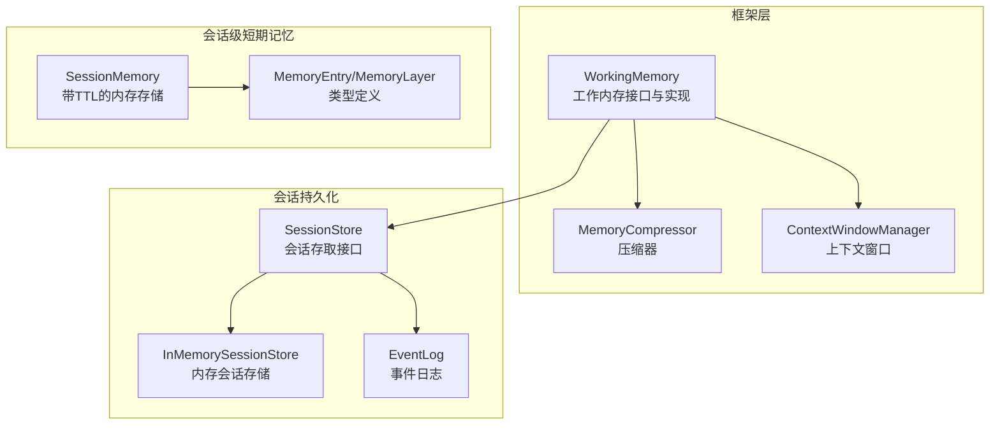
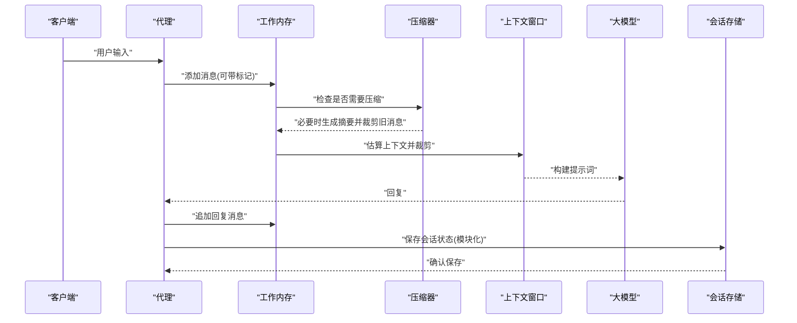
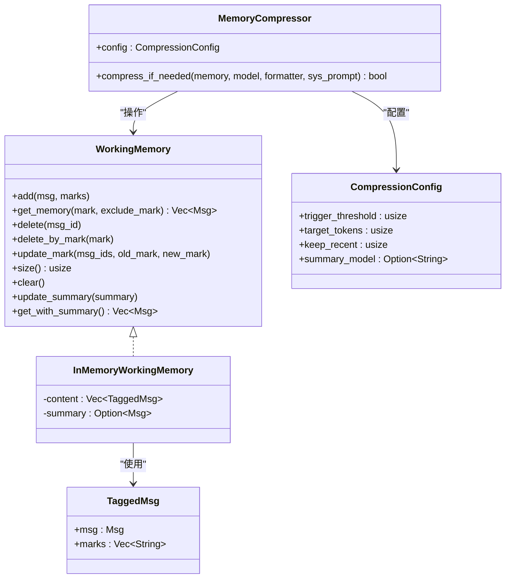
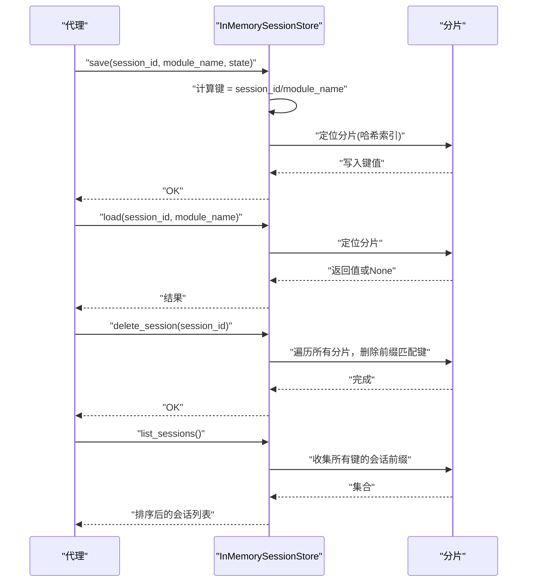
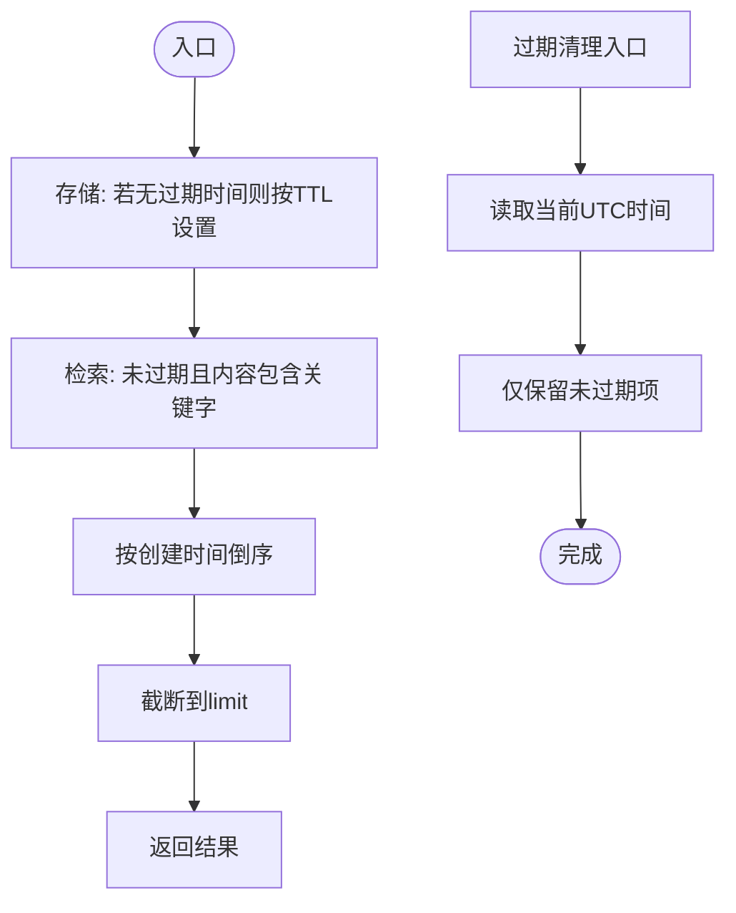
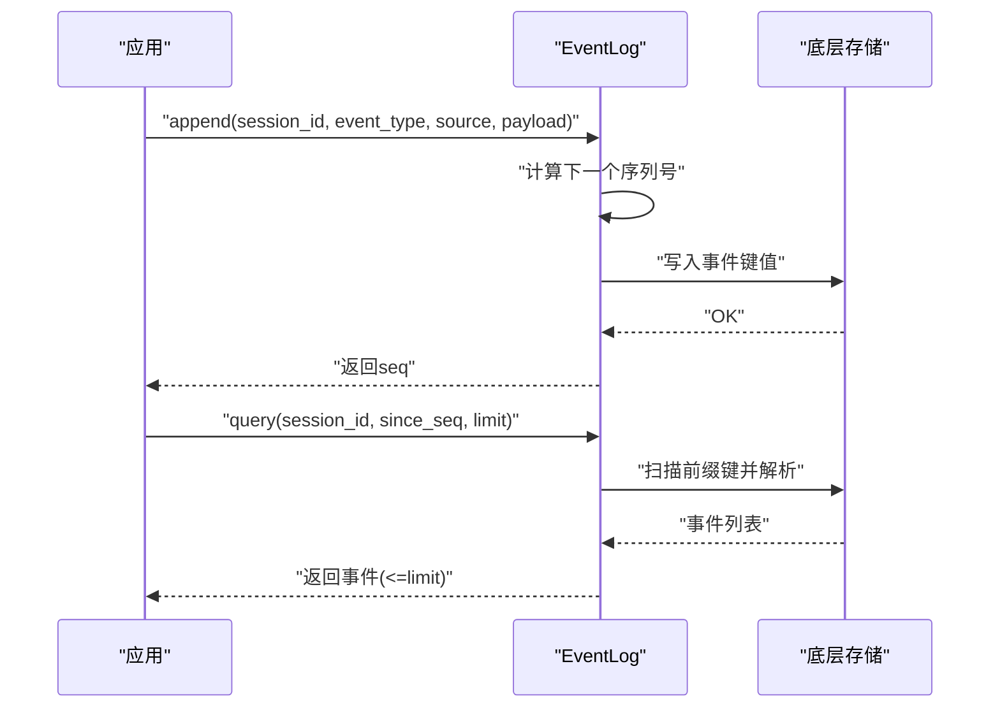
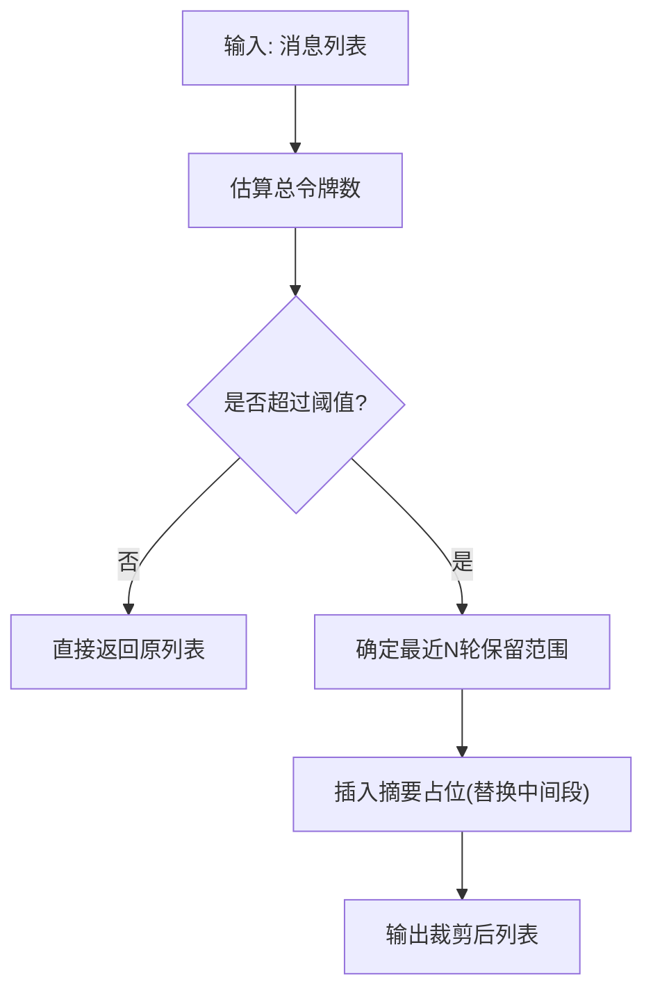
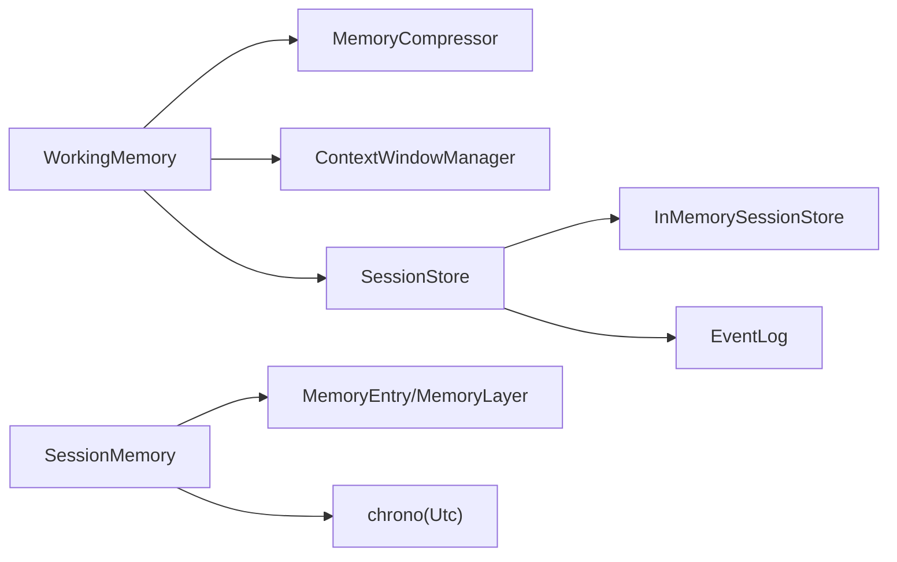
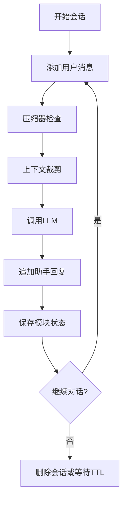

# 会话记忆

<cite>
**本文引用的文件**
- [macaca-framework/src/memory.rs](file://macaca/crates/macaca-framework/src/memory.rs)
- [macaca-framework/src/session.rs](file://macaca/crates/macaca-framework/src/session.rs)
- [macaca-memory/src/session.rs](file://macaca/crates/macaca-memory/src/session.rs)
- [macaca-proto/src/types.rs](file://macaca/crates/macaca-proto/src/types.rs)
- [macaca-persist/src/event_log.rs](file://macaca/crates/macaca-persist/src/event_log.rs)
- [macaca-runtime/src/context_window.rs](file://macaca/crates/macaca-runtime/src/context_window.rs)
- [macaca-framework/tests/integration_tests.rs](file://macaca/crates/macaca-framework/tests/integration_tests.rs)
</cite>

## 目录
1. [简介](#简介)
2. [项目结构](#项目结构)
3. [核心组件](#核心组件)
4. [架构总览](#架构总览)
5. [详细组件分析](#详细组件分析)
6. [依赖关系分析](#依赖关系分析)
7. [性能考量](#性能考量)
8. [故障排查指南](#故障排查指南)
9. [结论](#结论)
10. [附录：配置与最佳实践](#附录配置与最佳实践)

## 简介
本文件系统性阐述 Agent OS 中“会话记忆”的设计与实现，涵盖短期记忆（工作内存）与会话持久化两大维度。短期记忆负责在单次会话内维护对话历史、上下文压缩与标记过滤；会话持久化负责跨轮次、跨进程保存与恢复会话状态。文档同时给出数据结构、时序流程、配置参数与最佳实践，帮助开发者正确使用与扩展。

## 项目结构
围绕会话记忆的关键模块分布如下：
- 工作内存（短期记忆）
  - 接口与默认实现：macaca-framework/src/memory.rs
  - 压缩与上下文管理：同文件中的压缩器与令牌估算
- 会话持久化
  - 会话存取接口与内存实现：macaca-framework/src/session.rs
  - 事件日志（会话级事件序列）：macaca-persist/src/event_log.rs
- 会话级短期记忆（可选）
  - 内存型带 TTL 的会话记忆：macaca-memory/src/session.rs
  - 类型定义（含 MemoryEntry/MemoryLayer 等）：macaca-proto/src/types.rs
- 上下文窗口管理
  - 避免超出模型上下文上限：macaca-runtime/src/context_window.rs

图表来源
- [macaca-framework/src/memory.rs:34-177](file://macaca/crates/macaca-framework/src/memory.rs#L34-L177)
- [macaca-framework/src/session.rs:17-95](file://macaca/crates/macaca-framework/src/session.rs#L17-L95)
- [macaca-persist/src/event_log.rs:77-157](file://macaca/crates/macaca-persist/src/event_log.rs#L77-L157)
- [macaca-memory/src/session.rs:18-135](file://macaca/crates/macaca-memory/src/session.rs#L18-L135)
- [macaca-proto/src/types.rs:529-547](file://macaca/crates/macaca-proto/src/types.rs#L529-L547)
- [macaca-runtime/src/context_window.rs:29-123](file://macaca/crates/macaca-runtime/src/context_window.rs#L29-L123)

章节来源
- [macaca-framework/src/memory.rs:1-1275](file://macaca/crates/macaca-framework/src/memory.rs#L1-L1275)
- [macaca-framework/src/session.rs:1-340](file://macaca/crates/macaca-framework/src/session.rs#L1-L340)
- [macaca-memory/src/session.rs:1-228](file://macaca/crates/macaca-memory/src/session.rs#L1-L228)
- [macaca-proto/src/types.rs:529-547](file://macaca/crates/macaca-proto/src/types.rs#L529-L547)
- [macaca-persist/src/event_log.rs:77-157](file://macaca/crates/macaca-persist/src/event_log.rs#L77-L157)
- [macaca-runtime/src/context_window.rs:1-251](file://macaca/crates/macaca-runtime/src/context_window.rs#L1-L251)

## 核心组件
- WorkingMemory（工作内存）
  - 负责单会话内的消息存储、按标记筛选、删除、重标记、摘要更新与整体导出
  - 默认实现 InMemoryWorkingMemory 使用 Vec<TaggedMsg> 存储，支持标记过滤与摘要前置
- MemoryCompressor（压缩器）
  - 当消息总量超过阈值时，自动将旧消息压缩为摘要，并保留最近若干条未压缩消息
- SessionStore（会话存取）
  - 提供按 session_id + 模块名 的状态持久化与加载能力
  - InMemorySessionStore 采用分片哈希提升并发性能
- SessionMemory（会话级短期记忆）
  - 面向“会话级”短期记忆（非对话历史），支持 TTL 过期与检索
- EventLog（事件日志）
  - 以会话为单位记录有序事件，支持查询与通知
- ContextWindowManager（上下文窗口）
  - 在调用 LLM 前估算并裁剪历史，确保不超过模型上下文上限

章节来源
- [macaca-framework/src/memory.rs:34-177](file://macaca/crates/macaca-framework/src/memory.rs#L34-L177)
- [macaca-framework/src/memory.rs:470-575](file://macaca/crates/macaca-framework/src/memory.rs#L470-L575)
- [macaca-framework/src/session.rs:17-95](file://macaca/crates/macaca-framework/src/session.rs#L17-L95)
- [macaca-memory/src/session.rs:18-135](file://macaca/crates/macaca-memory/src/session.rs#L18-L135)
- [macaca-persist/src/event_log.rs:77-157](file://macaca/crates/macaca-persist/src/event_log.rs#L77-L157)
- [macaca-runtime/src/context_window.rs:29-123](file://macaca/crates/macaca-runtime/src/context_window.rs#L29-L123)

## 架构总览
会话记忆贯穿“短期记忆（工作内存）—上下文窗口—长程记忆（可选）—会话持久化”的链路。短期记忆负责当前会话的对话历史与上下文；压缩器与上下文窗口保障 LLM 输入规模可控；会话持久化负责跨轮次状态保存；事件日志提供会话级事件序列化能力；会话级短期记忆用于临时性、带过期的会话片段存储。

图表来源
- [macaca-framework/src/memory.rs:470-575](file://macaca/crates/macaca-framework/src/memory.rs#L470-L575)
- [macaca-runtime/src/context_window.rs:29-123](file://macaca/crates/macaca-runtime/src/context_window.rs#L29-L123)
- [macaca-framework/src/session.rs:101-121](file://macaca/crates/macaca-framework/src/session.rs#L101-L121)

## 详细组件分析

### 组件A：工作内存（WorkingMemory）
- 数据结构
  - TaggedMsg：消息 + 标记列表，支持按标记筛选、删除与重标记
  - InMemoryWorkingMemory：基于 Vec<TaggedMsg>，支持摘要（summary）前置输出
- 关键操作
  - 添加消息、按标记筛选、按 ID 删除、按标记批量删除、重标记、清空、大小统计、摘要更新、导出（含摘要）
- 压缩与上下文
  - 压缩器根据触发阈值与目标令牌数进行摘要生成与旧消息裁剪
  - 上下文窗口管理器在调用 LLM 前估算并裁剪历史，保留系统消息与最近若干轮对话

图表来源
- [macaca-framework/src/memory.rs:34-177](file://macaca/crates/macaca-framework/src/memory.rs#L34-L177)
- [macaca-framework/src/memory.rs:254-284](file://macaca/crates/macaca-framework/src/memory.rs#L254-L284)
- [macaca-framework/src/memory.rs:470-575](file://macaca/crates/macaca-framework/src/memory.rs#L470-L575)

章节来源
- [macaca-framework/src/memory.rs:34-177](file://macaca/crates/macaca-framework/src/memory.rs#L34-L177)
- [macaca-framework/src/memory.rs:254-284](file://macaca/crates/macaca-framework/src/memory.rs#L254-L284)
- [macaca-framework/src/memory.rs:470-575](file://macaca/crates/macaca-framework/src/memory.rs#L470-L575)

### 组件B：会话持久化（SessionStore）
- 设计要点
  - 以 session_id + 模块名为键，持久化各模块状态（如工作内存、计划器等）
  - InMemorySessionStore 采用固定数量分片，按键哈希选择分片，降低锁竞争
  - 支持保存、加载、删除会话、列出所有会话
- 流程
  - 保存：将模块状态序列化为 JSON 并写入对应分片
  - 加载：按键读取并反序列化到模块
  - 删除会话：遍历所有分片，移除以该会话前缀开头的所有键
  - 列表：汇总所有分片键的会话前缀去重并排序

图表来源
- [macaca-framework/src/session.rs:33-95](file://macaca/crates/macaca-framework/src/session.rs#L33-L95)

章节来源
- [macaca-framework/src/session.rs:17-95](file://macaca/crates/macaca-framework/src/session.rs#L17-L95)

### 组件C：会话级短期记忆（SessionMemory）
- 设计要点
  - 面向“会话级短期记忆”，非对话历史，适合临时片段、中间结果等
  - 每条记录带 TTL 自动过期，后台定时清理过期项
  - 支持按内容子串检索、按创建时间排序、限制返回数量、按 AgentId 过滤
- 关键流程
  - 存储：若未设置过期时间则按 TTL 设置
  - 检索：按内容包含匹配 + 未过期过滤 + 时间倒序 + 截断
  - 列表：未过期 + 可选 AgentId 过滤 + 时间倒序 + 截断
  - 过期：后台周期性清理或手动立即清理

图表来源
- [macaca-memory/src/session.rs:63-135](file://macaca/crates/macaca-memory/src/session.rs#L63-L135)

章节来源
- [macaca-memory/src/session.rs:18-135](file://macaca/crates/macaca-memory/src/session.rs#L18-L135)
- [macaca-proto/src/types.rs:529-547](file://macaca/crates/macaca-proto/src/types.rs#L529-L547)

### 组件D：事件日志（EventLog）
- 设计要点
  - 以会话为单位持久化事件，事件有序且可查询
  - 提供下一个序列号分配、追加事件（立即持久化）、查询指定起始序列号之后的事件
  - 事件包含类型、来源、负载与时间戳
- 适用场景
  - 会话事件追踪、UI 实时流式展示、审计与回放

图表来源
- [macaca-persist/src/event_log.rs:77-157](file://macaca/crates/macaca-persist/src/event_log.rs#L77-L157)
- [macaca-proto/src/types.rs:781-801](file://macaca/crates/macaca-proto/src/types.rs#L781-L801)

章节来源
- [macaca-persist/src/event_log.rs:77-157](file://macaca/crates/macaca-persist/src/event_log.rs#L77-L157)
- [macaca-proto/src/types.rs:781-801](file://macaca/crates/macaca-proto/src/types.rs#L781-L801)

### 组件E：上下文窗口管理（ContextWindowManager）
- 设计要点
  - 估算消息总令牌数（考虑 ASCII/CJK 不同权重与元数据开销）
  - 当接近阈值时，裁剪中间段落为摘要占位，保留系统消息与最近若干轮对话
- 参数
  - 最大令牌数、触发阈值比例、保留最近轮数

图表来源
- [macaca-runtime/src/context_window.rs:29-123](file://macaca/crates/macaca-runtime/src/context_window.rs#L29-L123)

章节来源
- [macaca-runtime/src/context_window.rs:1-251](file://macaca/crates/macaca-runtime/src/context_window.rs#L1-L251)

## 依赖关系分析
- WorkingMemory 与 MemoryCompressor 的耦合度低，通过 trait 解耦，便于替换不同压缩策略
- SessionStore 与具体模块解耦，通过模块名作为命名空间，避免状态冲突
- EventLog 与底层存储解耦，通过统一的键值接口抽象
- SessionMemory 依赖类型定义（MemoryEntry/MemoryLayer）与时间库（chrono）

图表来源
- [macaca-framework/src/memory.rs:34-177](file://macaca/crates/macaca-framework/src/memory.rs#L34-L177)
- [macaca-framework/src/session.rs:17-95](file://macaca/crates/macaca-framework/src/session.rs#L17-L95)
- [macaca-memory/src/session.rs:18-135](file://macaca/crates/macaca-memory/src/session.rs#L18-L135)
- [macaca-proto/src/types.rs:529-547](file://macaca/crates/macaca-proto/src/types.rs#L529-L547)

章节来源
- [macaca-framework/src/memory.rs:1-1275](file://macaca/crates/macaca-framework/src/memory.rs#L1-L1275)
- [macaca-framework/src/session.rs:1-340](file://macaca/crates/macaca-framework/src/session.rs#L1-L340)
- [macaca-memory/src/session.rs:1-228](file://macaca/crates/macaca-memory/src/session.rs#L1-L228)
- [macaca-proto/src/types.rs:529-547](file://macaca/crates/macaca-proto/src/types.rs#L529-L547)

## 性能考量
- 分片并发
  - InMemorySessionStore 使用固定分片数与简单哈希，显著降低热点键竞争
- 压缩与上下文裁剪
  - 压缩器仅在达到阈值时触发，避免频繁压缩
  - 上下文窗口裁剪在调用 LLM 前执行，减少无效计算
- 内存型短期记忆
  - SessionMemory 采用后台定时清理，适合高吞吐场景；注意合理设置 TTL 与查询 limit

章节来源
- [macaca-framework/src/session.rs:30-59](file://macaca/crates/macaca-framework/src/session.rs#L30-L59)
- [macaca-framework/src/memory.rs:470-575](file://macaca/crates/macaca-framework/src/memory.rs#L470-L575)
- [macaca-runtime/src/context_window.rs:29-123](file://macaca/crates/macaca-runtime/src/context_window.rs#L29-L123)
- [macaca-memory/src/session.rs:30-48](file://macaca/crates/macaca-memory/src/session.rs#L30-L48)

## 故障排查指南
- 会话无法恢复
  - 检查模块名是否一致、保存/加载顺序是否正确
  - 使用列出会话功能核对是否存在目标会话
- 压缩未生效
  - 确认消息总数是否超过触发阈值；检查 keep_recent 是否过大导致裁剪量不足
- 上下文超限
  - 调整最大令牌数或触发阈值；适当减少保留最近轮数
- 会话级短期记忆过期异常
  - 确认 TTL 设置是否合理；必要时手动触发清理

章节来源
- [macaca-framework/src/session.rs:101-121](file://macaca/crates/macaca-framework/src/session.rs#L101-L121)
- [macaca-framework/src/memory.rs:470-575](file://macaca/crates/macaca-framework/src/memory.rs#L470-L575)
- [macaca-runtime/src/context_window.rs:17-27](file://macaca/crates/macaca-runtime/src/context_window.rs#L17-L27)
- [macaca-memory/src/session.rs:53-60](file://macaca/crates/macaca-memory/src/session.rs#L53-L60)

## 结论
Agent OS 的会话记忆体系通过“工作内存 + 压缩 + 上下文裁剪 + 会话持久化 + 事件日志 + 会话级短期记忆”的组合，实现了从短期对话到跨轮次状态的完整闭环。该设计在保证上下文质量的同时兼顾性能与可扩展性，适合在多轮对话与复杂任务编排场景中稳定运行。

## 附录：配置与最佳实践

### 会话记忆数据结构与字段
- WorkingMemory
  - 消息：Msg（含角色、文本、工具调用等）
  - 标记：Vec<String>，用于筛选、删除与生命周期管理
  - 摘要：Option<Msg>，用于压缩后的历史摘要前置
- MemoryEntry（会话级短期记忆）
  - 字段：id、layer、content、metadata、agent_id、created_at、expires_at
  - 层级：Session/File/Vector 等

章节来源
- [macaca-framework/src/memory.rs:18-84](file://macaca/crates/macaca-framework/src/memory.rs#L18-L84)
- [macaca-proto/src/types.rs:529-547](file://macaca/crates/macaca-proto/src/types.rs#L529-L547)

### 会话创建、扩展与销毁流程
- 创建
  - 初始化工作内存与会话存储
  - 可选：初始化会话级短期记忆（SessionMemory）
- 扩展
  - 用户输入 → 添加消息 → 压缩器检查 → 上下文裁剪 → LLM 推理 → 追加回复
  - 定期保存模块状态到会话存储
- 销毁
  - 显式删除会话（删除所有模块键）
  - 或等待会话级短期记忆 TTL 过期自动清理

图表来源
- [macaca-framework/src/memory.rs:470-575](file://macaca/crates/macaca-framework/src/memory.rs#L470-L575)
- [macaca-framework/src/session.rs:101-121](file://macaca/crates/macaca-framework/src/session.rs#L101-L121)

### 会话合并与清理策略
- 合并
  - 将多个会话的状态模块分别保存，再按需加载到同一工作区（需业务逻辑协调）
- 清理
  - 会话级短期记忆：后台定时清理过期项；也可手动触发
  - 会话存储：删除会话时遍历所有分片清理

章节来源
- [macaca-memory/src/session.rs:30-48](file://macaca/crates/macaca-memory/src/session.rs#L30-L48)
- [macaca-framework/src/session.rs:72-80](file://macaca/crates/macaca-framework/src/session.rs#L72-L80)

### 配置参数
- 压缩器（CompressionConfig）
  - 触发阈值（trigger_threshold）：超过此令牌数才触发压缩
  - 目标令牌（target_tokens）：压缩后目标大小
  - 保留最近（keep_recent）：始终保留的最新消息数量
  - 摘要模型（summary_model）：摘要生成使用的模型名称
- 上下文窗口（ContextWindowConfig）
  - 最大令牌（max_tokens）：模型上下文上限
  - 触发阈值（trim_threshold）：达到上限比例时触发裁剪
  - 保留最近（preserve_recent）：裁剪后保留的最近消息对数
- 会话级短期记忆（SessionMemory）
  - TTL：每条记录的过期时间
  - 查询限制：retrieve/list 的 limit 参数

章节来源
- [macaca-framework/src/memory.rs:254-284](file://macaca/crates/macaca-framework/src/memory.rs#L254-L284)
- [macaca-runtime/src/context_window.rs:8-27](file://macaca/crates/macaca-runtime/src/context_window.rs#L8-L27)
- [macaca-memory/src/session.rs:24-51](file://macaca/crates/macaca-memory/src/session.rs#L24-L51)

### 实际使用示例与最佳实践
- 示例：会话状态保存与恢复
  - 使用会话存储保存工作内存状态，随后加载到新实例
  - 参考集成测试中的保存/加载与会话列表验证
- 最佳实践
  - 对重要对话使用标记（如“重要”、“草稿”）以便后续筛选与清理
  - 合理设置压缩阈值与保留最近数量，平衡上下文完整性与成本
  - 对于长会话，启用事件日志以便审计与回放
  - 会话级短期记忆适用于临时片段，避免与对话历史混淆

章节来源
- [macaca-framework/tests/integration_tests.rs:217-256](file://macaca/crates/macaca-framework/tests/integration_tests.rs#L217-L256)
- [macaca-framework/src/session.rs:101-121](file://macaca/crates/macaca-framework/src/session.rs#L101-L121)