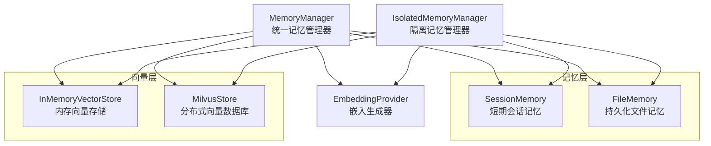
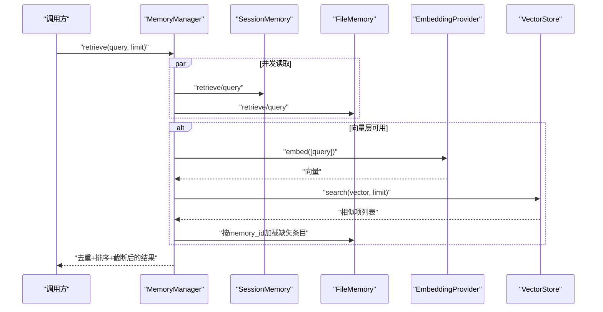
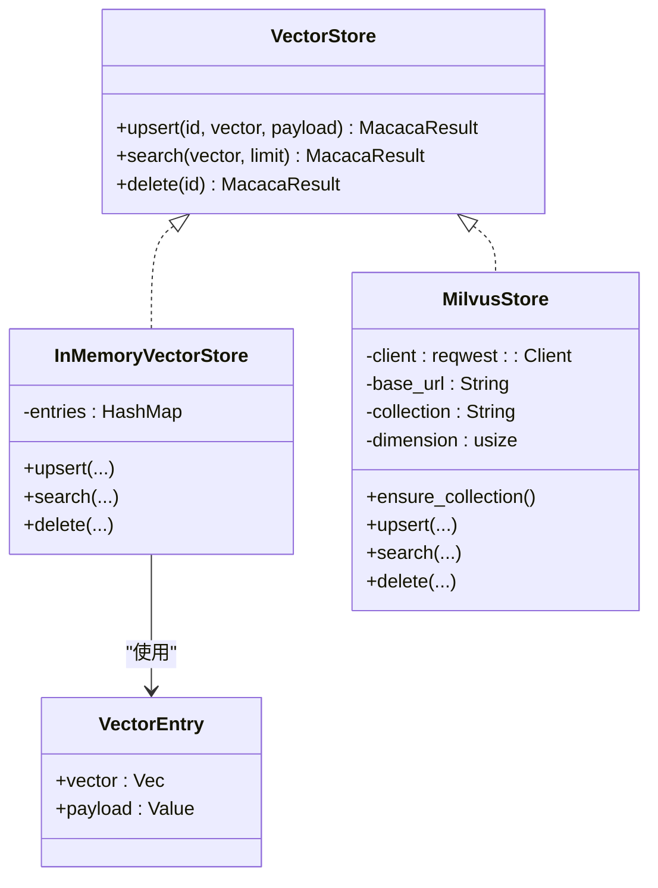
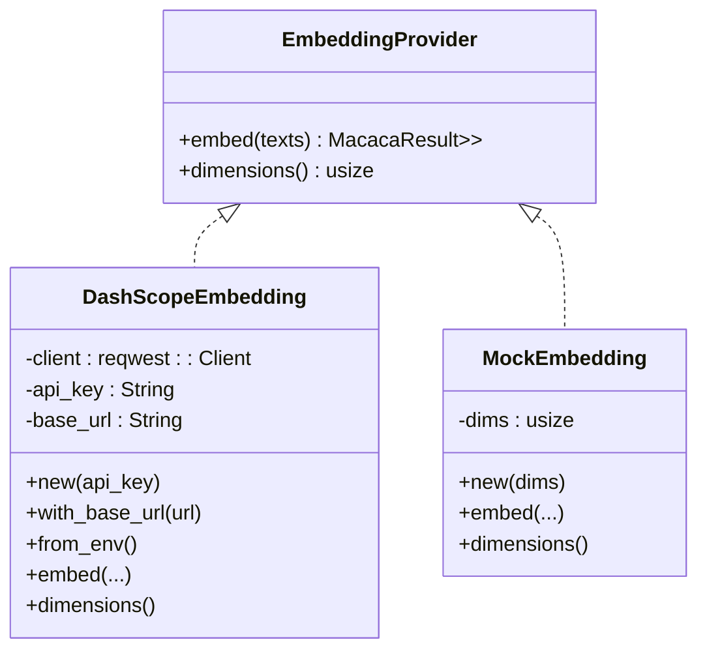
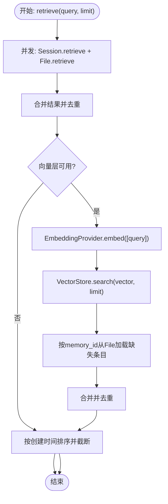
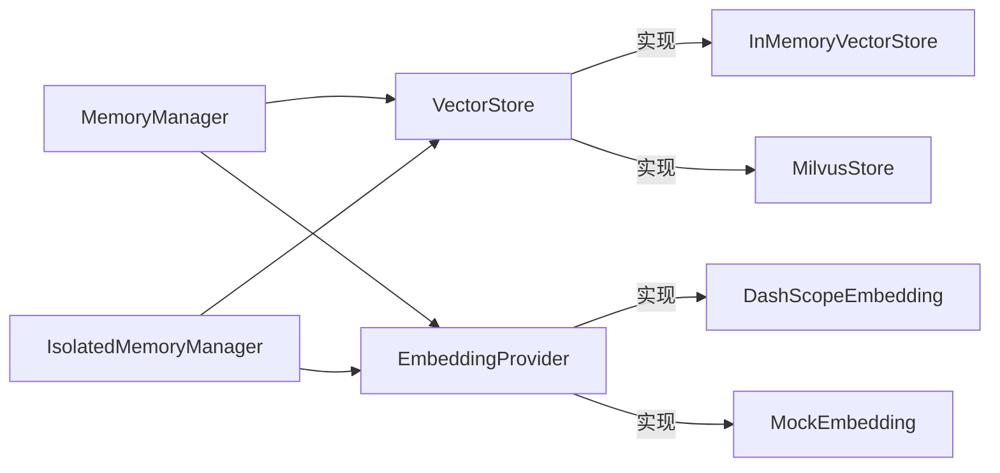

# 向量检索

<cite>
**本文引用的文件**   
- [vector.rs](file://macaca/crates/macaca-memory/src/vector.rs)
- [store.rs](file://macaca/crates/macaca-memory/src/store.rs)
- [embedding.rs](file://macaca/crates/macaca-memory/src/embedding.rs)
- [manager.rs](file://macaca/crates/macaca-memory/src/manager.rs)
- [session.rs](file://macaca/crates/macaca-memory/src/session.rs)
- [file.rs](file://macaca/crates/macaca-memory/src/file.rs)
- [isolated.rs](file://macaca/crates/macaca-memory/src/isolated.rs)
- [lib.rs](file://macaca/crates/macaca-memory/src/lib.rs)
- [default.toml](file://macaca/config/default.toml)
</cite>

## 目录
1. [简介](#简介)
2. [项目结构](#项目结构)
3. [核心组件](#核心组件)
4. [架构总览](#架构总览)
5. [详细组件分析](#详细组件分析)
6. [依赖关系分析](#依赖关系分析)
7. [性能考虑](#性能考虑)
8. [故障排查指南](#故障排查指南)
9. [结论](#结论)
10. [附录](#附录)

## 简介
本文件系统性地文档化了向量检索在记忆系统中的核心作用与实现，涵盖以下主题：
- 语义搜索、相似度匹配与智能检索的工作原理
- 向量存储实现：内存版 InMemoryVectorStore 与分布式 MilvusStore 的差异与适用场景
- 嵌入生成器：DashScopeEmbedding 与 MockEmbedding 的使用方法与配置要点
- 查询流程：从文本到向量、相似度计算与结果排序的完整链路
- 性能优化：索引建立、批量处理与缓存策略建议

该系统采用三层记忆层（会话、文件、向量）组合，通过统一的管理器对外提供检索能力，并支持按应用与代理隔离的独立命名空间。

## 项目结构
向量检索子系统位于 macaca-memory crate 中，核心模块如下：
- store.rs：定义通用的记忆与向量接口、查询上下文与搜索结果模型
- embedding.rs：嵌入生成器接口与 DashScopeEmbedding、MockEmbedding 实现
- vector.rs：向量存储接口与 InMemoryVectorStore、MilvusStore 实现
- session.rs：基于内存的短期记忆层（带 TTL 清理）
- file.rs：基于文件的持久化记忆层
- manager.rs：多层记忆聚合与自动检索的统一入口
- isolated.rs：按应用与代理隔离的独立记忆管理器
- lib.rs：对外导出类型别名与公共 API

图表来源
- [manager.rs:15-125](file://macaca/crates/macaca-memory/src/manager.rs#L15-L125)
- [isolated.rs:20-205](file://macaca/crates/macaca-memory/src/isolated.rs#L20-L205)
- [vector.rs:214-276](file://macaca/crates/macaca-memory/src/vector.rs#L214-L276)
- [embedding.rs:45-162](file://macaca/crates/macaca-memory/src/embedding.rs#L45-L162)
- [session.rs:18-135](file://macaca/crates/macaca-memory/src/session.rs#L18-L135)
- [file.rs:11-113](file://macaca/crates/macaca-memory/src/file.rs#L11-L113)

章节来源
- [lib.rs:1-18](file://macaca/crates/macaca-memory/src/lib.rs#L1-L18)

## 核心组件
- 接口与模型
  - MemoryStore：统一的记忆存储接口，支持存储、检索、获取、删除、列表
  - MemoryRetriever：自动检索接口，根据任务上下文构建查询
  - EmbeddingProvider：嵌入生成接口，负责将文本转为向量
  - VectorStore：向量存储接口，支持 upsert、search、delete
  - MemoryQueryContext：检索上下文，包含任务描述、历史片段等
  - VectorSearchResult：向量检索返回项，包含 id、分数与载荷

- 存储与检索流程
  - 存储：同时写入 SessionMemory 与 FileMemory；可选地调用 EmbeddingProvider 生成向量并写入 VectorStore
  - 检索：并发读取 SessionMemory 与 FileMemory；可选地对查询词进行嵌入，向 VectorStore 查询相似向量，合并去重后按时间排序并截断

章节来源
- [store.rs:5-52](file://macaca/crates/macaca-memory/src/store.rs#L5-L52)
- [manager.rs:38-119](file://macaca/crates/macaca-memory/src/manager.rs#L38-L119)

## 架构总览
下图展示了从外部请求到最终结果返回的端到端流程，包括嵌入生成、向量检索与结果合并。

图表来源
- [manager.rs:74-119](file://macaca/crates/macaca-memory/src/manager.rs#L74-L119)
- [embedding.rs:79-125](file://macaca/crates/macaca-memory/src/embedding.rs#L79-L125)
- [vector.rs:138-181](file://macaca/crates/macaca-memory/src/vector.rs#L138-L181)

## 详细组件分析

### 向量存储：InMemoryVectorStore 与 MilvusStore
- InMemoryVectorStore
  - 特点：基于内存的暴力检索，使用余弦相似度；适合测试与小规模数据
  - 能力：upsert、search（按相似度排序并截断）、delete
  - 复杂度：search 为 O(n·d)，n 为条目数，d 为向量维度
- MilvusStore
  - 特点：通过 REST API 与 Milvus 交互；支持集合创建、插入、搜索、删除
  - 能力：ensure_collection、upsert、search、delete
  - 集成：与配置中的 milvus_url、collection_name 对应

图表来源
- [vector.rs:46-276](file://macaca/crates/macaca-memory/src/vector.rs#L46-L276)
- [store.rs:45-51](file://macaca/crates/macaca-memory/src/store.rs#L45-L51)

章节来源
- [vector.rs:207-276](file://macaca/crates/macaca-memory/src/vector.rs#L207-L276)

### 嵌入生成器：DashScopeEmbedding 与 MockEmbedding
- DashScopeEmbedding
  - 用途：调用 DashScope 文本嵌入服务，生成固定维度向量
  - 配置：可通过环境变量或显式参数设置 API Key 与基础 URL
  - 错误处理：对 HTTP 状态码与解析错误进行封装
- MockEmbedding
  - 用途：用于测试的确定性嵌入生成器，维度可配置
  - 行为：按输入顺序生成单位向量，便于验证检索流程

图表来源
- [embedding.rs:39-162](file://macaca/crates/macaca-memory/src/embedding.rs#L39-L162)
- [store.rs:38-43](file://macaca/crates/macaca-memory/src/store.rs#L38-L43)

章节来源
- [embedding.rs:45-162](file://macaca/crates/macaca-memory/src/embedding.rs#L45-L162)

### 统一记忆管理器：MemoryManager
- 功能
  - 并发写入 SessionMemory 与 FileMemory
  - 可选：对内容进行嵌入并写入 VectorStore
  - 检索时并发读取 Session 与 File，并可选加入 VectorStore 结果
  - 去重、按创建时间排序、限制数量
- 自动检索
  - 依据 MemoryQueryContext 的 description 与最近历史片段合成查询词

图表来源
- [manager.rs:74-119](file://macaca/crates/macaca-memory/src/manager.rs#L74-L119)
- [embedding.rs:79-125](file://macaca/crates/macaca-memory/src/embedding.rs#L79-L125)
- [vector.rs:138-181](file://macaca/crates/macaca-memory/src/vector.rs#L138-L181)

章节来源
- [manager.rs:15-125](file://macaca/crates/macaca-memory/src/manager.rs#L15-L125)

### 隔离记忆管理器：IsolatedMemoryManager
- 作用域
  - 文件路径按应用与代理隔离：{base}/{app_id}/{agent_id}/
  - 向量层（Milvus）通过数据库与集合实现多租户隔离
- 能力
  - 存储时强制设置 agent_id
  - 检索时在 Session 层按 agent_id 过滤，在 File 层按目录隔离，在 VectorStore 层按集合隔离
  - 支持按 ID 获取与删除，内部协调各层

章节来源
- [isolated.rs:20-205](file://macaca/crates/macaca-memory/src/isolated.rs#L20-L205)

### 记忆层实现概览
- SessionMemory
  - 内存存储 + TTL 定期清理；支持按 agent_id 过滤
- FileMemory
  - 文件持久化；每个条目一个 JSON 文件；支持按 agent_id 过滤

章节来源
- [session.rs:18-135](file://macaca/crates/macaca-memory/src/session.rs#L18-L135)
- [file.rs:11-113](file://macaca/crates/macaca-memory/src/file.rs#L11-L113)

## 依赖关系分析
- 组件耦合
  - MemoryManager 与 IsolatedMemoryManager 依赖 VectorStore 与 EmbeddingProvider 抽象，便于替换具体实现
  - VectorStore 与 EmbeddingProvider 通过 trait 解耦，便于扩展新提供商或存储后端
- 外部依赖
  - reqwest 用于 HTTP 请求（Milvus REST、DashScope）
  - serde/serde_json 用于序列化/反序列化
  - tokio/RwLock 用于异步并发控制

图表来源
- [manager.rs:15-125](file://macaca/crates/macaca-memory/src/manager.rs#L15-L125)
- [isolated.rs:20-205](file://macaca/crates/macaca-memory/src/isolated.rs#L20-L205)
- [vector.rs:60-205](file://macaca/crates/macaca-memory/src/vector.rs#L60-L205)
- [embedding.rs:45-162](file://macaca/crates/macaca-memory/src/embedding.rs#L45-L162)

## 性能考虑
- 索引与相似度
  - InMemoryVectorStore 使用余弦相似度，适合中小规模数据；大规模场景建议 MilvusStore
  - MilvusStore 通过集合与向量字段索引提升检索效率，需结合业务维度与数据量规划集合与字段
- 批量处理
  - 存储与检索阶段可并发执行（如 Session 与 File 的并发读取），减少整体延迟
  - 嵌入生成可对多个文本批量调用（EmbeddingProvider.embed 支持 Vec<String>）
- 缓存机制
  - SessionMemory 提供短期缓存与 TTL 清理，适合高频访问的近期记忆
  - FileMemory 作为持久化层，适合跨实例复用
  - 向量层缓存建议由 Milvus 或上层应用实现（例如热点查询结果缓存）
- 配置参考
  - 向量后端与集合名称、嵌入提供商与维度等在配置中集中管理

章节来源
- [default.toml:62-72](file://macaca/config/default.toml#L62-L72)
- [manager.rs:44-47](file://macaca/crates/macaca-memory/src/manager.rs#L44-L47)
- [embedding.rs:122-124](file://macaca/crates/macaca-memory/src/embedding.rs#L122-L124)

## 故障排查指南
- 常见问题定位
  - 向量存储失败：检查 MilvusStore 的 ensure_collection 是否成功、URL 与集合名是否正确
  - 嵌入失败：确认 DashScopeEmbedding 的 API Key 与基础 URL 设置，关注 HTTP 状态码与响应体
  - 检索无结果：确认 Session/File 是否写入成功、VectorStore 是否 upsert 成功、查询词是否被正确嵌入
- 日志与调试
  - 关键路径包含 debug 日志（如 vector upsert/search 失败、embed 失败等），可结合日志定位
- 隔离性验证
  - 使用 IsolatedMemoryManager 在不同代理间进行数据隔离测试，确保文件目录与集合隔离生效

章节来源
- [vector.rs:78-103](file://macaca/crates/macaca-memory/src/vector.rs#L78-L103)
- [embedding.rs:81-120](file://macaca/crates/macaca-memory/src/embedding.rs#L81-L120)
- [manager.rs:61-67](file://macaca/crates/macaca-memory/src/manager.rs#L61-L67)
- [isolated.rs:99-101](file://macaca/crates/macaca-memory/src/isolated.rs#L99-L101)

## 结论
该向量检索系统以抽象接口为核心，将嵌入生成、向量存储与多层记忆整合为统一的检索能力。通过 MemoryManager 与 IsolatedMemoryManager，系统既满足通用场景下的快速集成，又支持高隔离性的多代理部署。在生产环境中，建议优先采用 MilvusStore 与 DashScopeEmbedding，并结合批量处理与缓存策略以获得更优的性能与稳定性。

## 附录
- 配置要点
  - 向量层：backend、milvus_url、collection_name
  - 嵌入层：provider、model、api_key、dimensions、base_url
- 使用建议
  - 开发与测试：使用 InMemoryVectorStore 与 MockEmbedding
  - 生产：使用 MilvusStore 与 DashScopeEmbedding，合理规划集合与索引
  - 数据隔离：使用 IsolatedMemoryManager，确保应用与代理维度的数据隔离

章节来源
- [default.toml:57-72](file://macaca/config/default.toml#L57-L72)
- [lib.rs:11-17](file://macaca/crates/macaca-memory/src/lib.rs#L11-L17)