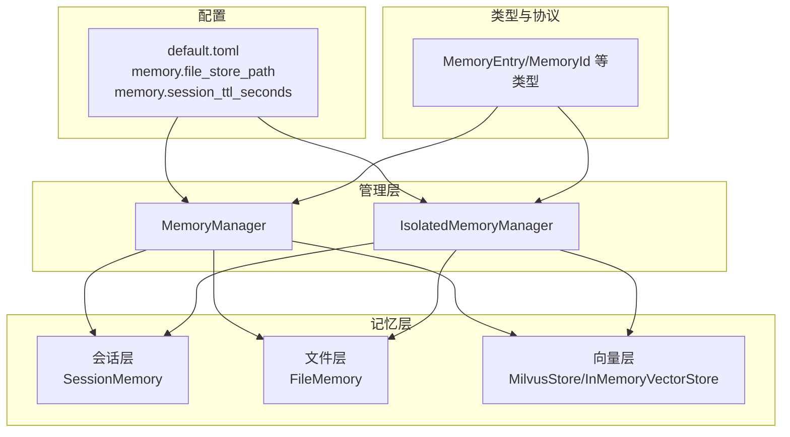
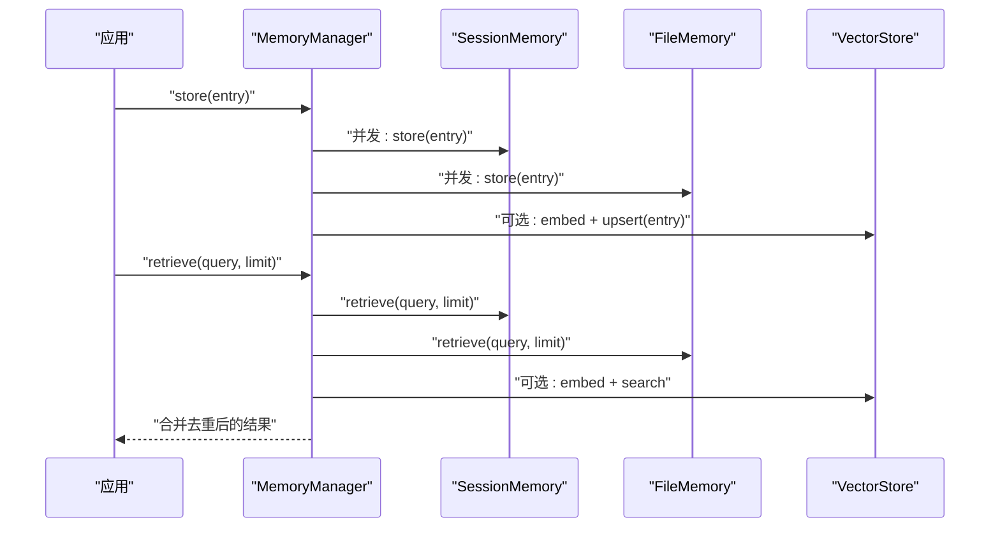
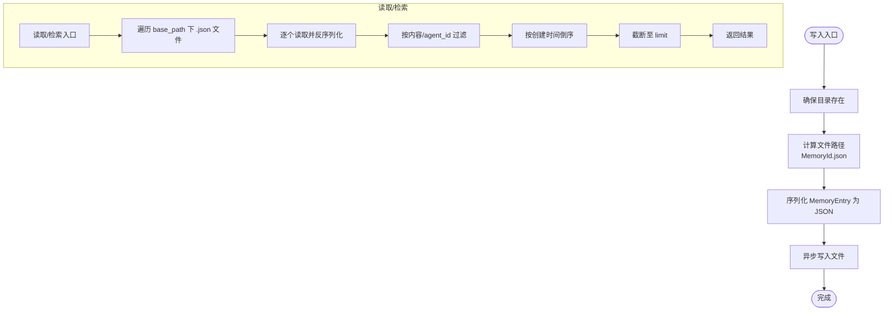
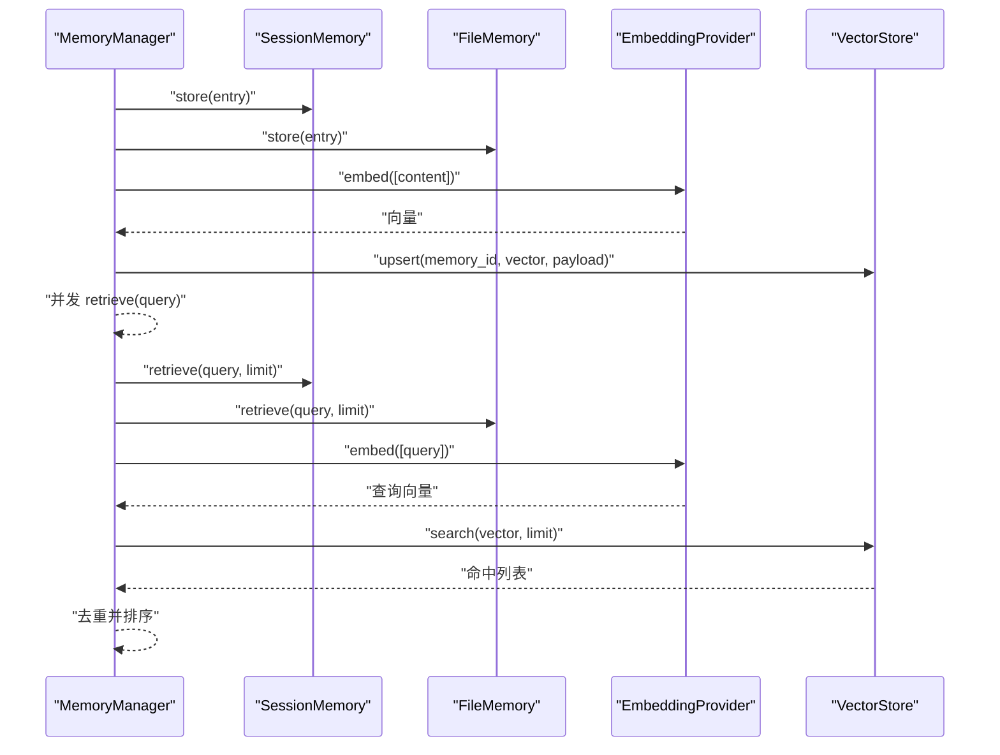
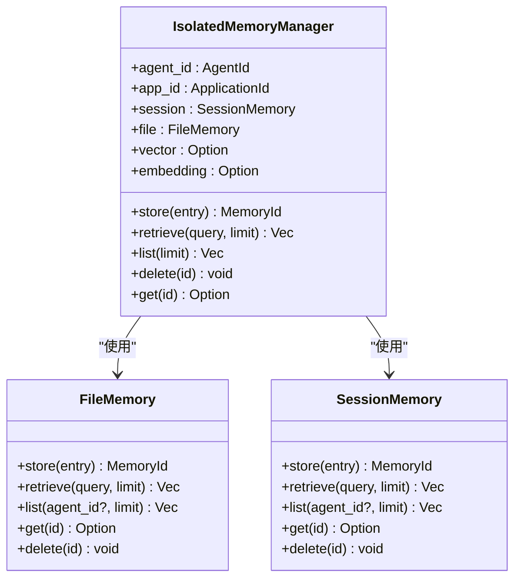
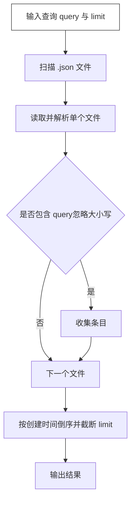
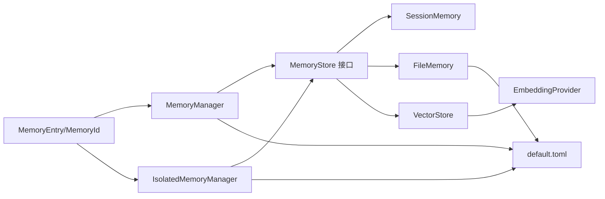

# 文件存储

<cite>
**本文引用的文件**
- [file.rs](file://macaca/crates/macaca-memory/src/file.rs)
- [store.rs](file://macaca/crates/macaca-memory/src/store.rs)
- [lib.rs](file://macaca/crates/macaca-memory/src/lib.rs)
- [manager.rs](file://macaca/crates/macaca-memory/src/manager.rs)
- [isolated.rs](file://macaca/crates/macaca-memory/src/isolated.rs)
- [session.rs](file://macaca/crates/macaca-memory/src/session.rs)
- [vector.rs](file://macaca/crates/macaca-memory/src/vector.rs)
- [embedding.rs](file://macaca/crates/macaca-memory/src/embedding.rs)
- [types.rs](file://macaca/crates/macaca-proto/src/types.rs)
- [default.toml](file://macaca/config/default.toml)
- [redb_store.rs](file://macaca/crates/macaca-persist/src/redb_store.rs)
- [store.rs](file://macaca/crates/macaca-persist/src/store.rs)
</cite>

## 目录
1. [简介](#简介)
2. [项目结构](#项目结构)
3. [核心组件](#核心组件)
4. [架构总览](#架构总览)
5. [详细组件分析](#详细组件分析)
6. [依赖关系分析](#依赖关系分析)
7. [性能考量](#性能考量)
8. [故障排查指南](#故障排查指南)
9. [结论](#结论)
10. [附录](#附录)

## 简介
本文件存储系统是“智能体操作系统”（Agent OS）三层记忆体系的一部分，负责将记忆条目以文件形式持久化到磁盘，并与会话层（内存）和向量层（Milvus）协同工作，实现长期记忆保存、内容检索与元数据管理。文件存储采用 JSON 文本格式，每个记忆条目对应一个独立文件，文件名由记忆 ID 构成，便于直接通过 ID 定位与读取。

## 项目结构
文件存储位于 macaca-memory 子模块中，围绕统一的 MemoryStore 接口构建，配合 MemoryManager 和 IsolatedMemoryManager 提供跨层检索与隔离能力。同时，配置文件 default.toml 中定义了文件存储路径、会话 TTL、向量后端与嵌入维度等关键参数。

**图表来源**
- [manager.rs:16-36](file://macaca/crates/macaca-memory/src/manager.rs#L16-L36)
- [isolated.rs:24-61](file://macaca/crates/macaca-memory/src/isolated.rs#L24-L61)
- [file.rs:13-20](file://macaca/crates/macaca-memory/src/file.rs#L13-L20)
- [session.rs:19-51](file://macaca/crates/macaca-memory/src/session.rs#L19-L51)
- [vector.rs:61-76](file://macaca/crates/macaca-memory/src/vector.rs#L61-L76)
- [default.toml:57-72](file://macaca/config/default.toml#L57-L72)

**章节来源**
- [lib.rs:1-18](file://macaca/crates/macaca-memory/src/lib.rs#L1-L18)
- [default.toml:57-72](file://macaca/config/default.toml#L57-L72)

## 核心组件
- FileMemory：基于文件系统的持久化存储，按 MemoryId 命名文件，内容为 JSON 序列化后的 MemoryEntry。
- MemoryStore：统一的记忆存取接口，定义 store/retrieve/get/delete/list 等方法。
- MemoryManager：组合会话层、文件层与可选向量层，提供跨层存储与检索。
- IsolatedMemoryManager：按应用与代理隔离的文件存储，目录结构为 {base}/{app_id}/{agent_id}/，确保数据隔离。
- SessionMemory：内存层，带 TTL 的临时存储，用于高频访问与短期记忆。
- VectorStore/DashScopeEmbedding：向量层与嵌入提供者，用于相似度检索与语义搜索。

**章节来源**
- [file.rs:11-113](file://macaca/crates/macaca-memory/src/file.rs#L11-L113)
- [store.rs:22-30](file://macaca/crates/macaca-memory/src/store.rs#L22-L30)
- [manager.rs:16-125](file://macaca/crates/macaca-memory/src/manager.rs#L16-L125)
- [isolated.rs:21-205](file://macaca/crates/macaca-memory/src/isolated.rs#L21-L205)
- [session.rs:18-135](file://macaca/crates/macaca-memory/src/session.rs#L18-L135)
- [vector.rs:61-205](file://macaca/crates/macaca-memory/src/vector.rs#L61-L205)
- [embedding.rs:47-125](file://macaca/crates/macaca-memory/src/embedding.rs#L47-L125)

## 架构总览
文件存储在三层记忆体系中的职责如下：
- 长期记忆保存：FileMemory 将 MemoryEntry 写入磁盘，文件名为 MemoryId.json，实现跨进程/重启持久化。
- 文件内容检索：FileMemory 支持按内容子串检索与列表查询；MemoryManager/IsolatedMemoryManager 在检索时合并多层结果并去重。
- 元数据管理：MemoryEntry 包含 content、metadata、agent_id、created_at、expires_at 等字段，文件层以 JSON 形式完整保留。

**图表来源**
- [manager.rs:40-119](file://macaca/crates/macaca-memory/src/manager.rs#L40-L119)
- [file.rs:58-113](file://macaca/crates/macaca-memory/src/file.rs#L58-L113)
- [session.rs:80-97](file://macaca/crates/macaca-memory/src/session.rs#L80-L97)
- [vector.rs:107-181](file://macaca/crates/macaca-memory/src/vector.rs#L107-L181)

## 详细组件分析

### FileMemory 组件分析
- 数据组织结构
  - 文件命名：每个 MemoryEntry 对应一个文件，文件名为 MemoryId 的字符串形式 + .json。
  - 存储位置：由构造函数传入的 base_path 决定；IsolatedMemoryManager 进一步在 base_path 下按 app_id/agent_id 分级创建目录。
  - 内容格式：JSON 序列化 MemoryEntry，包含 content、metadata、agent_id、created_at、expires_at 等字段。
- 写入流程
  - 确保目录存在 → 生成文件路径 → JSON 序列化 → 异步写入文件。
- 读取/检索/删除
  - get：按 MemoryId 查找文件，解析 JSON 返回条目或 None。
  - retrieve：扫描 base_path 下所有 .json 文件，过滤匹配内容并按创建时间倒序，限制数量。
  - list：可按 agent_id 过滤，返回最新条目列表。
  - delete：删除对应文件，忽略不存在错误。
- 并发与一致性
  - 单文件写入为原子性（一次性写入），但跨层一致性由 MemoryManager/IsolatedMemoryManager 通过并发写入与去重策略保障。

**图表来源**
- [file.rs:22-54](file://macaca/crates/macaca-memory/src/file.rs#L22-L54)
- [file.rs:58-113](file://macaca/crates/macaca-memory/src/file.rs#L58-L113)

**章节来源**
- [file.rs:11-113](file://macaca/crates/macaca-memory/src/file.rs#L11-L113)
- [isolated.rs:33-61](file://macaca/crates/macaca-memory/src/isolated.rs#L33-L61)

### MemoryManager 组件分析
- 职责
  - 同步将条目写入 SessionMemory 与 FileMemory。
  - 可选地使用嵌入提供者将内容向量化并写入 VectorStore。
  - 检索时并发查询 SessionMemory 与 FileMemory，再合并向量层结果并去重。
- 关键点
  - 使用 tokio::join 并发执行多层写入与查询，提升吞吐。
  - 通过 HashMap 以 MemoryId 去重，保证同一内容不重复出现。
  - 向量层命中后尝试从 FileMemory 按 ID 加载缺失条目，确保返回完整内容。

**图表来源**
- [manager.rs:40-119](file://macaca/crates/macaca-memory/src/manager.rs#L40-L119)
- [embedding.rs:79-125](file://macaca/crates/macaca-memory/src/embedding.rs#L79-L125)
- [vector.rs:107-181](file://macaca/crates/macaca-memory/src/vector.rs#L107-L181)

**章节来源**
- [manager.rs:16-125](file://macaca/crates/macaca-memory/src/manager.rs#L16-L125)

### IsolatedMemoryManager 组件分析
- 隔离机制
  - 目录隔离：文件存储在 {base}/{app_id}/{agent_id}/，不同代理无法互相访问彼此的文件。
  - 向量隔离：建议使用 Milvus 多租户命名（应用→数据库，代理→集合），避免跨代理检索。
  - 内存隔离：SessionMemory 通过 agent_id 字段过滤，确保只返回当前代理的记忆。
- 存储与检索
  - 存储：强制设置 entry.agent_id 为当前代理 ID，随后并发写入 SessionMemory 与 FileMemory，并可选写入向量层。
  - 检索：先从 SessionMemory（已按 agent_id 过滤）与 FileMemory（目录隔离）检索，再合并向量层命中项，最后去重与排序。
  - 列表与删除：列表仅针对文件层（目录隔离），删除同步清理三类层。

**图表来源**
- [isolated.rs:24-205](file://macaca/crates/macaca-memory/src/isolated.rs#L24-L205)
- [file.rs:58-113](file://macaca/crates/macaca-memory/src/file.rs#L58-L113)
- [session.rs:64-135](file://macaca/crates/macaca-memory/src/session.rs#L64-L135)

**章节来源**
- [isolated.rs:21-205](file://macaca/crates/macaca-memory/src/isolated.rs#L21-L205)

### MemoryStore 接口与检索算法
- 接口定义
  - store/retrieve/get/delete/list：统一的异步接口，支持并发与错误传播。
- 检索算法
  - FileMemory：线性扫描 base_path 下 .json 文件，逐个解析并过滤，最终排序与截断。
  - MemoryManager/IsolatedMemoryManager：并发查询多层，使用 HashMap 去重，按 created_at 倒序，限制数量。
- 搜索优化建议
  - 当前文件层为纯文本子串匹配，复杂度 O(N×M)，N 为文件数，M 为平均内容长度。
  - 优化方向：引入倒排索引、全文搜索引擎或向量检索作为补充，减少全量扫描。

**图表来源**
- [file.rs:68-79](file://macaca/crates/macaca-memory/src/file.rs#L68-L79)

**章节来源**
- [store.rs:22-30](file://macaca/crates/macaca-memory/src/store.rs#L22-L30)
- [file.rs:68-79](file://macaca/crates/macaca-memory/src/file.rs#L68-L79)
- [manager.rs:74-119](file://macaca/crates/macaca-memory/src/manager.rs#L74-L119)
- [session.rs:80-97](file://macaca/crates/macaca-memory/src/session.rs#L80-L97)

## 依赖关系分析
- 组件耦合
  - MemoryManager/IsolatedMemoryManager 依赖 MemoryStore 接口，解耦具体实现（Session/File/Vector）。
  - FileMemory 依赖 serde_json 进行序列化/反序列化，依赖 tokio::fs 进行异步文件操作。
  - 向量层依赖 EmbeddingProvider 输出固定维度向量，再写入 VectorStore。
- 外部依赖
  - 配置：default.toml 提供文件存储路径、会话 TTL、向量后端与嵌入参数。
  - 类型：MemoryEntry/MemoryId 等来自 macaca-proto，统一标识与时间戳。

**图表来源**
- [manager.rs:16-36](file://macaca/crates/macaca-memory/src/manager.rs#L16-L36)
- [isolated.rs:24-61](file://macaca/crates/macaca-memory/src/isolated.rs#L24-L61)
- [file.rs:1-10](file://macaca/crates/macaca-memory/src/file.rs#L1-L10)
- [embedding.rs:79-125](file://macaca/crates/macaca-memory/src/embedding.rs#L79-L125)
- [default.toml:57-72](file://macaca/config/default.toml#L57-L72)
- [types.rs:72-84](file://macaca/crates/macaca-proto/src/types.rs#L72-L84)

**章节来源**
- [lib.rs:1-18](file://macaca/crates/macaca-memory/src/lib.rs#L1-L18)
- [default.toml:57-72](file://macaca/config/default.toml#L57-L72)

## 性能考量
- 文件层扫描成本
  - 线性扫描所有 .json 文件，适合小规模数据；大规模场景建议引入索引或搜索引擎。
- 并发优化
  - MemoryManager/IsolatedMemoryManager 在写入与检索中广泛使用 tokio::join 并发，显著降低延迟。
- 内存层 TTL
  - SessionMemory 自动清理过期条目，减少无效扫描与内存占用。
- 向量检索
  - 向量层可提供高效相似度检索，但需注意嵌入维度与 Milvus 集合配置。

[本节为通用性能讨论，无需列出具体文件来源]

## 故障排查指南
- 文件读取失败
  - 现象：get 返回 None 或报错。
  - 排查：确认文件是否存在、权限是否正确、JSON 是否有效。
- 检索无结果
  - 现象：retrieve 返回空列表。
  - 排查：检查查询词大小写转换逻辑、文件内容是否包含目标子串、limit 是否过小。
- 目录权限问题
  - 现象：store 报错或文件未创建。
  - 排查：确保 base_path 及其子目录具备写权限；IsolatedMemoryManager 的 app_id/agent_id 目录需正确创建。
- 向量层异常
  - 现象：embed 或 upsert/search 报错。
  - 排查：检查嵌入提供者 API Key 与网络连通性、Milvus 集合是否创建、维度是否匹配。

**章节来源**
- [file.rs:81-100](file://macaca/crates/macaca-memory/src/file.rs#L81-L100)
- [embedding.rs:79-125](file://macaca/crates/macaca-memory/src/embedding.rs#L79-L125)
- [vector.rs:107-205](file://macaca/crates/macaca-memory/src/vector.rs#L107-L205)

## 结论
文件存储在三层记忆体系中承担长期持久化的职责，通过简单可靠的 JSON 文件模型与并发优化，实现了高可用的记忆写入与检索。结合会话层与向量层，系统在性能与功能之间取得平衡。对于大规模场景，建议引入索引或搜索引擎以优化检索性能，并完善压缩与归档策略。

[本节为总结性内容，无需列出具体文件来源]

## 附录

### 配置选项
- 文件存储路径
  - memory.file_store_path：文件层根目录，默认值见配置文件。
- 会话层 TTL
  - memory.session_ttl_seconds：会话层条目过期时间（秒）。
- 向量层
  - memory.vector.backend：向量后端（如 milvus）。
  - memory.vector.milvus_url：Milvus 地址。
  - memory.vector.collection_name：集合名称。
- 嵌入层
  - memory.embedding.provider：嵌入提供者（如 dashscope）。
  - memory.embedding.model：嵌入模型名称。
  - memory.embedding.api_key：API 密钥。
  - memory.embedding.dimensions：嵌入维度。
- 压缩策略
  - memory.compression.enabled：是否启用压缩。
  - memory.compression.threshold_entries：触发压缩的条目阈值。
  - memory.compression.strategy：压缩策略（示例：LLM 摘要）。

**章节来源**
- [default.toml:57-78](file://macaca/config/default.toml#L57-L78)

### 数据模型与字段
- MemoryEntry 关键字段
  - id：MemoryId（UUID）。
  - layer：记忆层标识（如 File/Session）。
  - content：记忆内容文本。
  - metadata：任意 JSON 元数据。
  - agent_id：所属代理 ID（可选）。
  - created_at：创建时间（UTC）。
  - expires_at：过期时间（可选）。

**章节来源**
- [types.rs:72-84](file://macaca/crates/macaca-proto/src/types.rs#L72-L84)

### 相关持久化组件
- redb 键值存储
  - 提供通用的键值持久化接口，可用于事件日志、快照等场景。
- 适用场景
  - 与文件存储互补：文件存储负责人类可读的记忆条目，redb 适合结构化元数据与状态。

**章节来源**
- [redb_store.rs:1-116](file://macaca/crates/macaca-persist/src/redb_store.rs#L1-L116)
- [store.rs:1-12](file://macaca/crates/macaca-persist/src/store.rs#L1-L12)