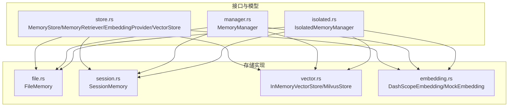
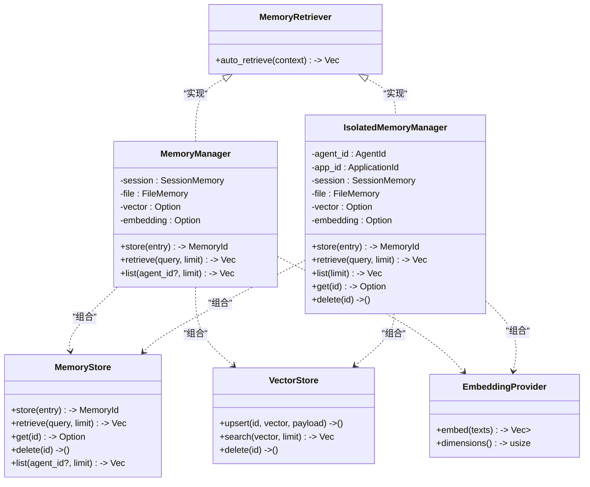
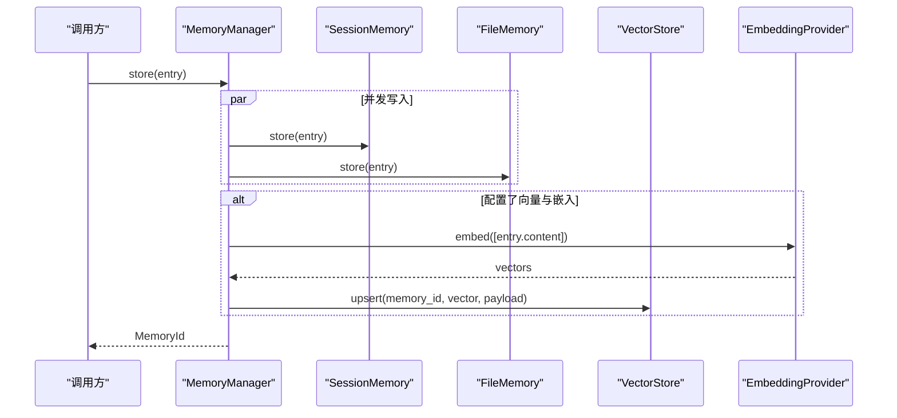
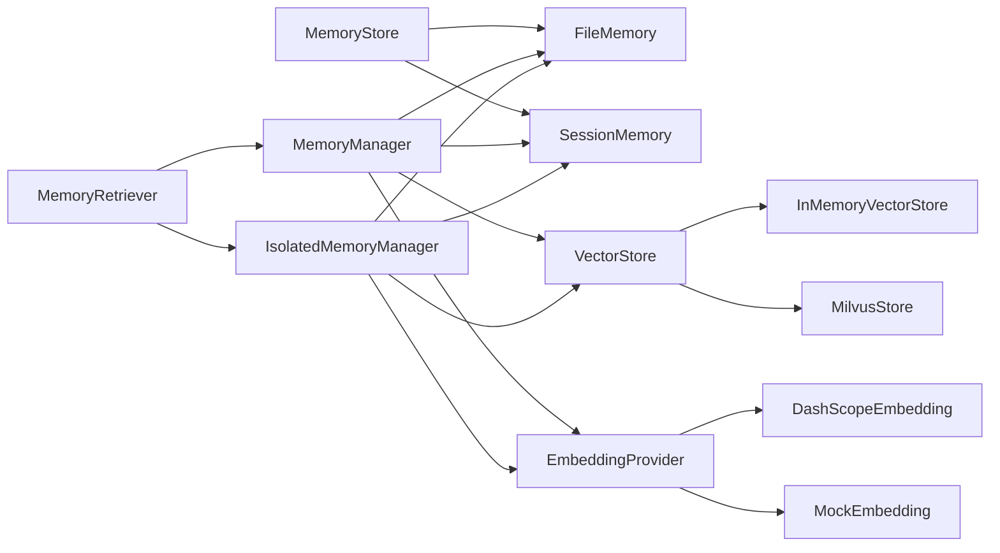

# 记忆存储接口

<cite>
**本文引用的文件**
- [lib.rs](file://macaca/crates/macaca-memory/src/lib.rs)
- [store.rs](file://macaca/crates/macaca-memory/src/store.rs)
- [embedding.rs](file://macaca/crates/macaca-memory/src/embedding.rs)
- [vector.rs](file://macaca/crates/macaca-memory/src/vector.rs)
- [file.rs](file://macaca/crates/macaca-memory/src/file.rs)
- [session.rs](file://macaca/crates/macaca-memory/src/session.rs)
- [manager.rs](file://macaca/crates/macaca-memory/src/manager.rs)
- [isolated.rs](file://macaca/crates/macaca-memory/src/isolated.rs)
</cite>

## 目录
1. [简介](#简介)
2. [项目结构](#项目结构)
3. [核心组件](#核心组件)
4. [架构总览](#架构总览)
5. [详细组件分析](#详细组件分析)
6. [依赖关系分析](#依赖关系分析)
7. [性能考量](#性能考量)
8. [故障排查指南](#故障排查指南)
9. [结论](#结论)
10. [附录：接口与实现参考](#附录接口与实现参考)

## 简介
本文件系统性地文档化记忆存储接口体系，围绕 MemoryStore、MemoryRetriever 和 EmbeddingProvider 三大核心接口，阐述其设计理念、方法签名与返回规范，并展示如何通过统一抽象实现对文件存储、向量存储与内存存储的统一访问。同时提供自定义存储后端的开发指南、最佳实践以及常见错误处理策略。

## 项目结构
macaca-memory crate 提供三层记忆层（会话、文件、向量）与统一管理器，支持按应用与代理隔离的独立记忆空间。核心模块如下：
- 接口定义与数据模型：store.rs
- 嵌入服务：embedding.rs
- 向量存储：vector.rs
- 文件存储：file.rs
- 内存存储（会话）：session.rs
- 统一管理器：manager.rs
- 隔离式管理器：isolated.rs
- 公共导出入口：lib.rs

图表来源
- [lib.rs:11-17](file://macaca/crates/macaca-memory/src/lib.rs#L11-L17)
- [store.rs:22-51](file://macaca/crates/macaca-memory/src/store.rs#L22-L51)
- [embedding.rs:45-125](file://macaca/crates/macaca-memory/src/embedding.rs#L45-L125)
- [vector.rs:61-205](file://macaca/crates/macaca-memory/src/vector.rs#L61-L205)
- [file.rs:11-113](file://macaca/crates/macaca-memory/src/file.rs#L11-L113)
- [session.rs:18-135](file://macaca/crates/macaca-memory/src/session.rs#L18-L135)
- [manager.rs:15-125](file://macaca/crates/macaca-memory/src/manager.rs#L15-L125)
- [isolated.rs:20-205](file://macaca/crates/macaca-memory/src/isolated.rs#L20-L205)

章节来源
- [lib.rs:1-18](file://macaca/crates/macaca-memory/src/lib.rs#L1-L18)

## 核心组件
本节聚焦三大核心接口及其职责边界与方法语义。

- MemoryStore：抽象通用的记忆条目存储与检索能力，支持存储、检索、获取、删除与列表。
- MemoryRetriever：面向任务上下文的自动检索能力，将描述与历史拼接为查询词。
- EmbeddingProvider：文本嵌入生成器，输出固定维度向量并暴露维度信息。
- VectorStore：向量相似度检索与写入，支持 upsert、search、delete。

方法签名与返回规范（以路径代替具体代码）：
- MemoryStore
  - 存储：[store.rs:24-29](file://macaca/crates/macaca-memory/src/store.rs#L24-L29)
  - 检索：[store.rs:24-29](file://macaca/crates/macaca-memory/src/store.rs#L24-L29)
  - 获取：[store.rs:24-29](file://macaca/crates/macaca-memory/src/store.rs#L24-L29)
  - 删除：[store.rs:24-29](file://macaca/crates/macaca-memory/src/store.rs#L24-L29)
  - 列表：[store.rs:24-29](file://macaca/crates/macaca-memory/src/store.rs#L24-L29)
- MemoryRetriever
  - 自动检索：[store.rs:33-36](file://macaca/crates/macaca-memory/src/store.rs#L33-L36)
- EmbeddingProvider
  - 嵌入：[store.rs:38-43](file://macaca/crates/macaca-memory/src/store.rs#L38-L43)
- VectorStore
  - 写入：[store.rs:45-51](file://macaca/crates/macaca-memory/src/store.rs#L45-L51)
  - 搜索：[store.rs:45-51](file://macaca/crates/macaca-memory/src/store.rs#L45-L51)
  - 删除：[store.rs:45-51](file://macaca/crates/macaca-memory/src/store.rs#L45-L51)

章节来源
- [store.rs:5-51](file://macaca/crates/macaca-memory/src/store.rs#L5-L51)

## 架构总览
统一抽象将不同存储后端整合为一致的调用面，MemoryManager/IsolatedMemoryManager 负责协调多层存储与可选的向量层，提供并发写入、跨层去重与自动检索能力。

图表来源
- [store.rs:22-51](file://macaca/crates/macaca-memory/src/store.rs#L22-L51)
- [manager.rs:15-135](file://macaca/crates/macaca-memory/src/manager.rs#L15-L135)
- [isolated.rs:20-221](file://macaca/crates/macaca-memory/src/isolated.rs#L20-L221)

## 详细组件分析

### MemoryStore 接口与实现
- 设计理念
  - 统一 CRUD 与列表能力，屏蔽底层存储差异。
  - 支持可选的 agent_id 过滤与时间戳排序。
- 方法语义
  - store/retrieve/get/delete/list：见“核心组件”小节的路径引用。
- 实现对比
  - FileMemory：基于文件系统持久化，按 JSON 文件存储；检索为内容子串匹配并按创建时间倒序，限制数量。
  - SessionMemory：基于内存的带 TTL 的会话存储，后台定时清理过期项；检索时过滤过期与 agent_id。
- 使用建议
  - 对于需要持久化的场景优先选择 FileMemory。
  - 对于短期上下文与临时状态，使用 SessionMemory。
  - 在高并发写入场景下，结合 MemoryManager 并发写入多层。

章节来源
- [file.rs:57-113](file://macaca/crates/macaca-memory/src/file.rs#L57-L113)
- [session.rs:63-135](file://macaca/crates/macaca-memory/src/session.rs#L63-L135)

### MemoryRetriever 接口与实现
- 设计理念
  - 将任务描述与近期历史拼接为复合查询，提升检索相关性。
- 实现要点
  - MemoryManager/auto_retrieve：取最近若干历史片段拼接到描述上，再调用 retrieve。
  - IsolatedMemoryManager/auto_retrieve：行为一致，但检索范围受代理隔离约束。
- 使用建议
  - 在任务规划或 RAG 场景中，优先使用 auto_retrieve 以获得更贴合上下文的结果。

章节来源
- [manager.rs:127-135](file://macaca/crates/macaca-memory/src/manager.rs#L127-L135)
- [isolated.rs:207-221](file://macaca/crates/macaca-memory/src/isolated.rs#L207-L221)

### EmbeddingProvider 接口与实现
- 设计理念
  - 将文本转换为固定维度向量，用于向量相似度检索。
- 实现对比
  - DashScopeEmbedding：对接 DashScope 文本嵌入服务，支持自定义基础 URL，从环境变量读取密钥。
  - MockEmbedding：测试用嵌入器，返回确定性的伪向量，便于单元测试。
- 使用建议
  - 生产环境使用 DashScopeEmbedding 并正确配置环境变量。
  - 测试与离线场景使用 MockEmbedding。

章节来源
- [embedding.rs:45-125](file://macaca/crates/macaca-memory/src/embedding.rs#L45-L125)
- [embedding.rs:127-162](file://macaca/crates/macaca-memory/src/embedding.rs#L127-L162)

### VectorStore 接口与实现
- 设计理念
  - 提供 upsert/search/delete 能力，payload 可携带元数据（如 memory_id、agent_id、layer 等）。
- 实现对比
  - InMemoryVectorStore：内存暴力搜索，使用余弦相似度，适合测试与小规模数据。
  - MilvusStore：通过 REST API 与 Milvus 交互，支持集合创建、插入、搜索与删除。
- 使用建议
  - 开发与测试阶段使用 InMemoryVectorStore。
  - 生产环境使用 MilvusStore，并确保集合存在且维度匹配。

章节来源
- [vector.rs:45-205](file://macaca/crates/macaca-memory/src/vector.rs#L45-L205)

### MemoryManager 与 IsolatedMemoryManager
- MemoryManager
  - 并发写入 session 与 file 层；可选地对内容进行嵌入并写入 vector 层。
  - 检索时并发查询 session 与 file，再可选地查询 vector 层，最后去重并按创建时间排序。
- IsolatedMemoryManager
  - 强隔离：文件层按应用与代理分目录；会话层强制标记 agent_id；向量层由外部保证集合隔离。
  - 提供 get/delete 等操作，严格限制跨代理访问。
- 使用建议
  - 多代理或多应用场景优先使用 IsolatedMemoryManager。
  - 需要全局检索时使用 MemoryManager。

图表来源
- [manager.rs:40-71](file://macaca/crates/macaca-memory/src/manager.rs#L40-L71)
- [embedding.rs:79-125](file://macaca/crates/macaca-memory/src/embedding.rs#L79-L125)
- [vector.rs:107-136](file://macaca/crates/macaca-memory/src/vector.rs#L107-L136)

章节来源
- [manager.rs:15-125](file://macaca/crates/macaca-memory/src/manager.rs#L15-L125)
- [isolated.rs:20-205](file://macaca/crates/macaca-memory/src/isolated.rs#L20-L205)

## 依赖关系分析
- 接口到实现
  - MemoryStore：FileMemory、SessionMemory
  - VectorStore：InMemoryVectorStore、MilvusStore
  - EmbeddingProvider：DashScopeEmbedding、MockEmbedding
  - MemoryRetriever：MemoryManager、IsolatedMemoryManager
- 管理器耦合
  - MemoryManager/IsolatedMemoryManager 组合三类实现，形成“多层存储 + 可选向量”的统一入口。
- 外部依赖
  - reqwest 用于 HTTP 请求（嵌入与 Milvus）。
  - tokio::sync::RwLock 用于并发安全。
  - tracing 用于调试日志。

图表来源
- [lib.rs:11-17](file://macaca/crates/macaca-memory/src/lib.rs#L11-L17)
- [store.rs:22-51](file://macaca/crates/macaca-memory/src/store.rs#L22-L51)
- [embedding.rs:45-162](file://macaca/crates/macaca-memory/src/embedding.rs#L45-L162)
- [vector.rs:61-205](file://macaca/crates/macaca-memory/src/vector.rs#L61-L205)
- [file.rs:11-113](file://macaca/crates/macaca-memory/src/file.rs#L11-L113)
- [session.rs:18-135](file://macaca/crates/macaca-memory/src/session.rs#L18-L135)
- [manager.rs:15-135](file://macaca/crates/macaca-memory/src/manager.rs#L15-L135)
- [isolated.rs:20-221](file://macaca/crates/macaca-memory/src/isolated.rs#L20-L221)

## 性能考量
- 并发与去重
  - MemoryManager/IsolatedMemoryManager 在检索时并发查询多层，并通过内存哈希表去重，减少重复结果。
- 检索策略
  - FileMemory/SessionMemory 采用内容子串匹配与时间排序，适合关键词检索。
  - VectorStore 采用向量相似度检索，适合语义检索；MilvusStore 需要合理设置集合维度与索引。
- 写入路径
  - MemoryManager 并发写入 session 与 file，避免阻塞；向量 upsert 在嵌入成功后异步执行，失败不影响主流程。
- 内存与磁盘
  - SessionMemory 有 TTL 清理机制，避免无限增长；FileMemory 适合持久化大体量数据。

## 故障排查指南
- 常见错误类型
  - IO 错误：文件读写失败、目录不存在等（FileMemory）。
  - HTTP 错误：嵌入服务请求失败或 Milvus REST 接口异常。
  - 解析错误：JSON 解析失败或响应体格式不正确。
  - 环境变量缺失：DashScopeEmbedding 需要正确的 API Key。
- 定位与处理
  - 检查日志：管理器在嵌入或向量 upsert 失败时会记录 debug 日志，有助于定位问题。
  - 验证环境：确认 DASHSCOPE_API_KEY 已设置，Milvus REST 地址与集合可用。
  - 数据一致性：确保 payload 中包含 memory_id，以便向量命中回填 file 层。
- 建议的检查清单
  - 文件层：确认 base_path 可写，JSON 文件格式正确。
  - 向量层：确认维度一致、集合已创建、网络可达。
  - 嵌入层：确认 API Key 正确、网络连通、响应解析正常。

章节来源
- [embedding.rs:72-77](file://macaca/crates/macaca-memory/src/embedding.rs#L72-L77)
- [embedding.rs:92-120](file://macaca/crates/macaca-memory/src/embedding.rs#L92-L120)
- [vector.rs:78-104](file://macaca/crates/macaca-memory/src/vector.rs#L78-L104)
- [vector.rs:107-136](file://macaca/crates/macaca-memory/src/vector.rs#L107-L136)
- [vector.rs:138-164](file://macaca/crates/macaca-memory/src/vector.rs#L138-L164)
- [vector.rs:183-204](file://macaca/crates/macaca-memory/src/vector.rs#L183-L204)
- [manager.rs:51-68](file://macaca/crates/macaca-memory/src/manager.rs#L51-L68)
- [manager.rs:87-113](file://macaca/crates/macaca-memory/src/manager.rs#L87-L113)
- [isolated.rs:88-106](file://macaca/crates/macaca-memory/src/isolated.rs#L88-L106)
- [isolated.rs:136-163](file://macaca/crates/macaca-memory/src/isolated.rs#L136-L163)

## 结论
通过 MemoryStore、MemoryRetriever 与 EmbeddingProvider 的统一抽象，macaca-memory 实现了对文件、内存与向量存储的一致访问。MemoryManager/IsolatedMemoryManager 在多层存储之上提供了并发、去重与自动检索能力，并通过隔离设计保障多代理场景下的数据安全。生产部署建议结合 Milvus 与 DashScope，开发阶段使用内存向量与模拟嵌入器以加速迭代。

## 附录：接口与实现参考
- 接口与数据模型
  - [store.rs:5-51](file://macaca/crates/macaca-memory/src/store.rs#L5-L51)
- 嵌入实现
  - [embedding.rs:45-162](file://macaca/crates/macaca-memory/src/embedding.rs#L45-L162)
- 向量实现
  - [vector.rs:61-205](file://macaca/crates/macaca-memory/src/vector.rs#L61-L205)
- 文件实现
  - [file.rs:11-113](file://macaca/crates/macaca-memory/src/file.rs#L11-L113)
- 会话实现
  - [session.rs:18-135](file://macaca/crates/macaca-memory/src/session.rs#L18-L135)
- 管理器
  - [manager.rs:15-135](file://macaca/crates/macaca-memory/src/manager.rs#L15-L135)
  - [isolated.rs:20-221](file://macaca/crates/macaca-memory/src/isolated.rs#L20-L221)