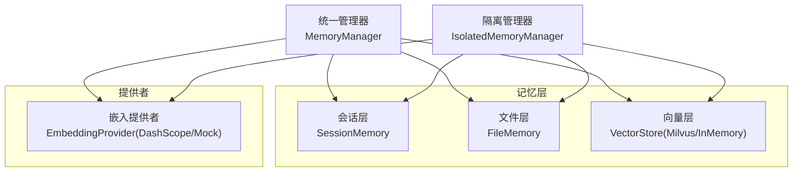
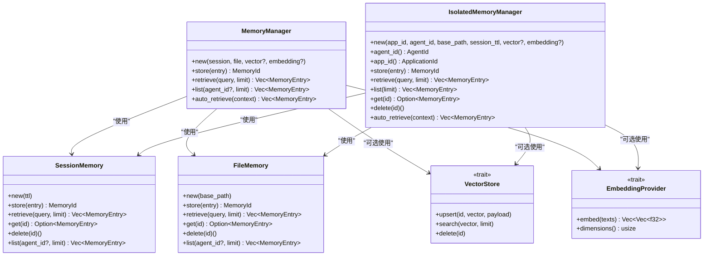
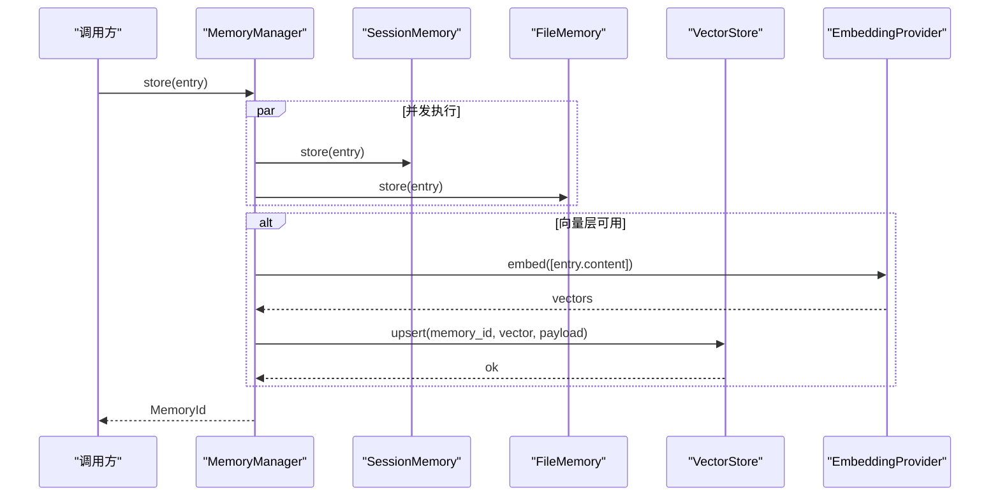
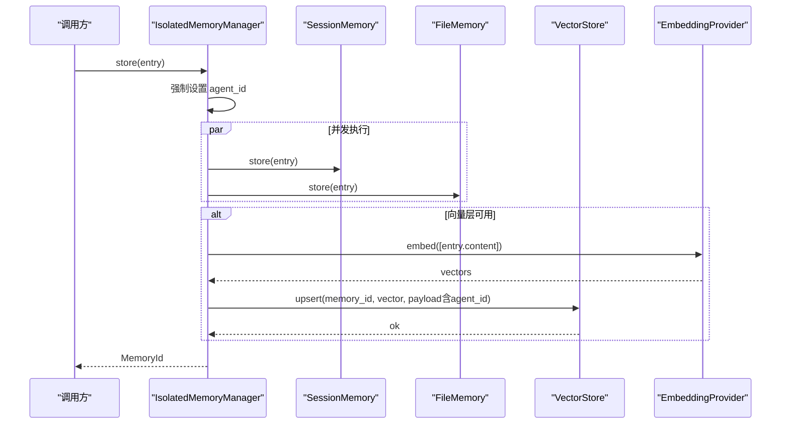
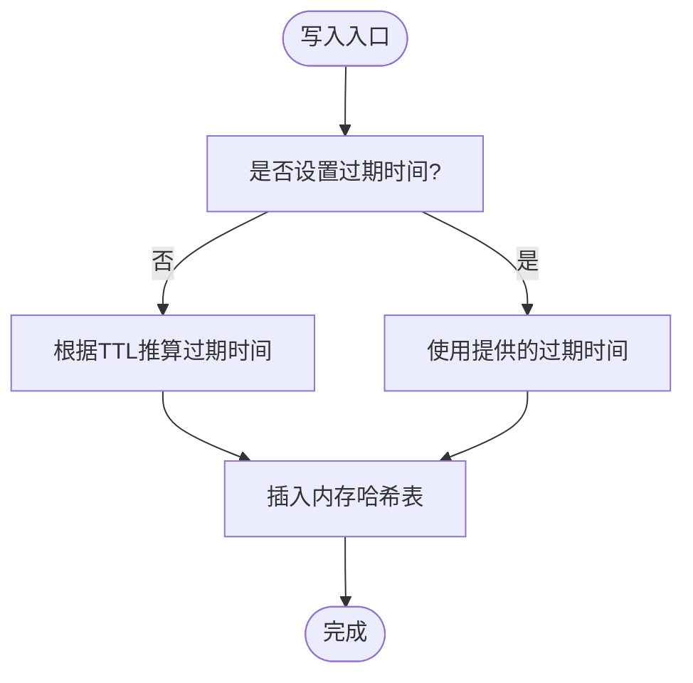
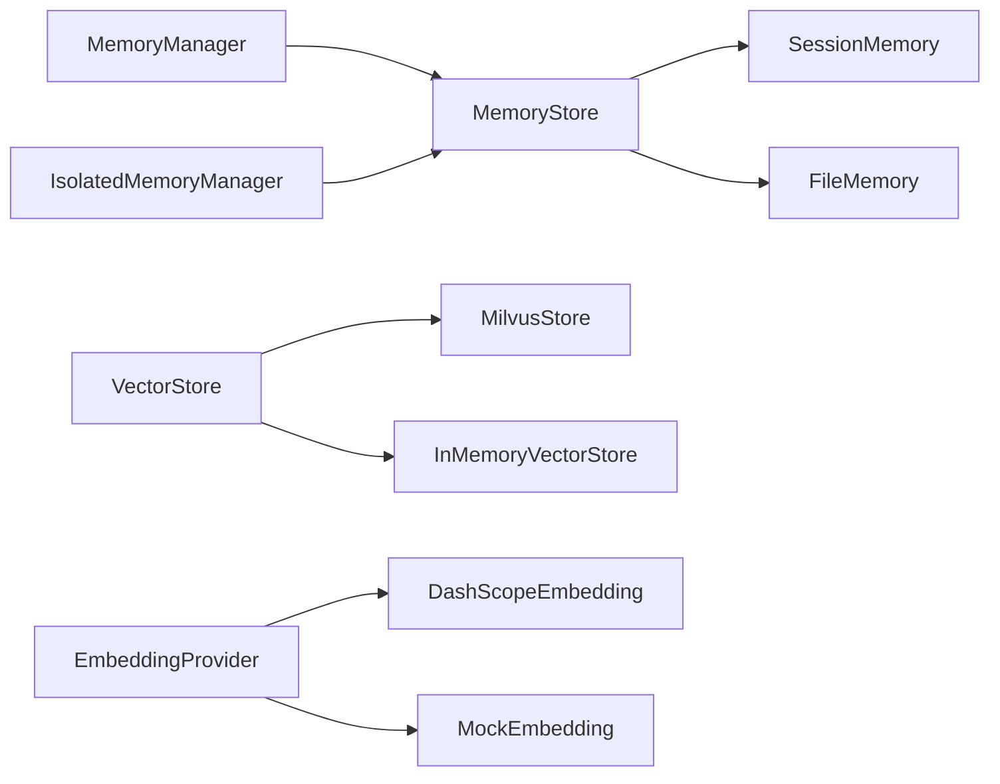

# 记忆管理器

<cite>
**本文引用的文件**
- [lib.rs](file://macaca/crates/macaca-memory/src/lib.rs)
- [manager.rs](file://macaca/crates/macaca-memory/src/manager.rs)
- [isolated.rs](file://macaca/crates/macaca-memory/src/isolated.rs)
- [store.rs](file://macaca/crates/macaca-memory/src/store.rs)
- [session.rs](file://macaca/crates/macaca-memory/src/session.rs)
- [file.rs](file://macaca/crates/macaca-memory/src/file.rs)
- [vector.rs](file://macaca/crates/macaca-memory/src/vector.rs)
- [embedding.rs](file://macaca/crates/macaca-memory/src/embedding.rs)
</cite>

## 目录
1. [简介](#简介)
2. [项目结构](#项目结构)
3. [核心组件](#核心组件)
4. [架构总览](#架构总览)
5. [详细组件分析](#详细组件分析)
6. [依赖关系分析](#依赖关系分析)
7. [性能考量](#性能考量)
8. [故障排查指南](#故障排查指南)
9. [结论](#结论)
10. [附录](#附录)

## 简介
本文件系统性地文档化记忆管理器（MemoryManager）与隔离记忆管理器（IsolatedMemoryManager），涵盖三层记忆体系（会话层、文件层、向量层）的统一管理、生命周期控制与资源分配；解释隔离设计在沙盒环境中的记忆隔离与权限控制；并给出初始化流程、配置选项与性能优化策略。同时，文档化记忆条目的创建、更新、删除操作实现，并提供内存使用监控、垃圾回收机制与容量限制的配置方法。

## 项目结构
macaca-memory crate 提供了统一的记忆管理能力，核心模块如下：
- store.rs：定义记忆存储接口、检索接口、嵌入提供者与向量存储接口，以及查询上下文结构。
- session.rs：会话层内存存储，支持 TTL 过期与并发安全。
- file.rs：文件层持久化存储，按记忆 ID 写入 JSON 文件。
- vector.rs：向量存储实现，包含 Milvus REST 客户端与内存向量存储。
- embedding.rs：嵌入提供者实现，支持 DashScope 与 Mock 嵌入。
- manager.rs：统一记忆管理器，协调三层数字化存储与检索。
- isolated.rs：隔离记忆管理器，按应用与代理维度进行严格隔离。
- lib.rs：导出公共类型与别名。

图表来源
- [manager.rs:15-222](file://macaca/crates/macaca-memory/src/manager.rs#L15-L222)
- [isolated.rs:20-205](file://macaca/crates/macaca-memory/src/isolated.rs#L20-L205)
- [store.rs:22-52](file://macaca/crates/macaca-memory/src/store.rs#L22-L52)
- [vector.rs:61-205](file://macaca/crates/macaca-memory/src/vector.rs#L61-L205)
- [embedding.rs:47-162](file://macaca/crates/macaca-memory/src/embedding.rs#L47-L162)

章节来源
- [lib.rs:1-18](file://macaca/crates/macaca-memory/src/lib.rs#L1-L18)

## 核心组件
- 统一记忆管理器（MemoryManager）
  - 职责：将记忆条目写入会话层与文件层；可选地对内容进行嵌入并写入向量层；检索时从三层数组合并去重并排序。
  - 关键方法：store、retrieve、list、auto_retrieve。
  - 并发策略：写入时会话与文件层并行；检索时会话与文件层并行，向量层异步嵌入后搜索。
- 隔离记忆管理器（IsolatedMemoryManager）
  - 职责：为特定应用与代理生成隔离的内存空间，强制条目归属该代理，禁止跨代理访问；文件层通过目录结构隔离；向量层通过集合命名隔离。
  - 关键方法：store、retrieve、list、get、delete。
  - 隔离策略：构造函数中为文件层设置基于 app_id 与 agent_id 的子目录；向量层通过命名约定确保集合隔离；检索时对会话层按代理过滤。
- 存储接口与检索接口
  - MemoryStore：store、retrieve、get、delete、list。
  - MemoryRetriever：auto_retrieve。
  - EmbeddingProvider：embed、dimensions。
  - VectorStore：upsert、search、delete。
- 会话层（SessionMemory）
  - 特性：内存存储、TTL 过期、后台定时清理过期项、并发安全。
  - 生命周期：未显式设置过期时间时，按构造时的 TTL 推算过期时间。
- 文件层（FileMemory）
  - 特性：以 JSON 文件持久化，按记忆 ID 命名；支持按代理过滤列表。
- 向量层（VectorStore）
  - 实现：MilvusStore（REST API）、InMemoryVectorStore（测试用暴力匹配）。
  - 操作：upsert（插入/更新）、search（相似度检索）、delete。
- 嵌入提供者（EmbeddingProvider）
  - 实现：DashScopeEmbedding（外部服务）、MockEmbedding（测试用确定性向量）。
  - 维度：提供向量维度信息用于向量存储初始化。

章节来源
- [manager.rs:15-222](file://macaca/crates/macaca-memory/src/manager.rs#L15-L222)
- [isolated.rs:20-205](file://macaca/crates/macaca-memory/src/isolated.rs#L20-L205)
- [store.rs:22-52](file://macaca/crates/macaca-memory/src/store.rs#L22-L52)
- [session.rs:18-135](file://macaca/crates/macaca-memory/src/session.rs#L18-L135)
- [file.rs:11-113](file://macaca/crates/macaca-memory/src/file.rs#L11-L113)
- [vector.rs:61-276](file://macaca/crates/macaca-memory/src/vector.rs#L61-L276)
- [embedding.rs:47-162](file://macaca/crates/macaca-memory/src/embedding.rs#L47-L162)

## 架构总览
统一管理器与隔离管理器均遵循“三层数字化存储”的统一接口，通过嵌入提供者与向量存储实现语义检索。隔离管理器在文件与向量两层引入多租户隔离策略，确保不同代理无法互相读取或写入彼此的记忆。

图表来源
- [manager.rs:15-222](file://macaca/crates/macaca-memory/src/manager.rs#L15-L222)
- [isolated.rs:20-205](file://macaca/crates/macaca-memory/src/isolated.rs#L20-L205)
- [session.rs:18-135](file://macaca/crates/macaca-memory/src/session.rs#L18-L135)
- [file.rs:11-113](file://macaca/crates/macaca-memory/src/file.rs#L11-L113)
- [vector.rs:47-205](file://macaca/crates/macaca-memory/src/vector.rs#L47-L205)
- [embedding.rs:39-162](file://macaca/crates/macaca-memory/src/embedding.rs#L39-L162)

## 详细组件分析

### 统一记忆管理器（MemoryManager）
- 初始化与配置
  - 支持传入会话层、文件层实例，以及可选的向量层与嵌入提供者。
  - 测试别名 TestMemoryManager 使用内存向量存储与 Mock 嵌入。
- 记忆条目创建（store）
  - 并发写入会话层与文件层；若启用向量层与嵌入提供者，则对内容进行嵌入并将向量与负载写入向量层。
  - 负载包含记忆 ID、内容与层级等元数据。
- 记忆检索（retrieve）
  - 并发检索会话层与文件层结果，去重后合并。
  - 若启用向量层与嵌入提供者，先对查询词嵌入，再在向量层检索命中项，尝试从文件层加载缺失的记忆条目。
  - 最终按创建时间倒序并截断到 limit。
- 列表（list）
  - 仅从文件层返回持久化记忆条目，支持按代理过滤。
- 自动检索（auto_retrieve）
  - 基于任务描述与最近历史构建复合查询，调用 retrieve 执行检索。

图表来源
- [manager.rs:40-71](file://macaca/crates/macaca-memory/src/manager.rs#L40-L71)
- [embedding.rs:80-125](file://macaca/crates/macaca-memory/src/embedding.rs#L80-L125)
- [vector.rs:107-136](file://macaca/crates/macaca-memory/src/vector.rs#L107-L136)

章节来源
- [manager.rs:15-222](file://macaca/crates/macaca-memory/src/manager.rs#L15-L222)
- [lib.rs:11-17](file://macaca/crates/macaca-memory/src/lib.rs#L11-L17)

### 隔离记忆管理器（IsolatedMemoryManager）
- 设计理念
  - 严格隔离：每个代理仅能访问其自身的记忆。
  - 文件隔离：文件层按 app_id 与 agent_id 创建子目录，确保跨代理不可见。
  - 向量隔离：通过集合命名约定（如 agent_{uuid}）实现多租户隔离。
- 初始化与配置
  - 构造函数接收 app_id、agent_id、基础路径、会话 TTL、向量层与嵌入提供者。
  - 文件层路径为 {base}/{app_id}/{agent_id}/。
- 记忆条目创建（store）
  - 强制将条目的 agent_id 设置为当前管理器的代理 ID，防止跨代理污染。
  - 并发写入会话层与文件层；若启用向量层与嵌入提供者，则在向量层 upsert 时携带 agent_id。
- 记忆检索（retrieve）
  - 会话层检索前先按代理过滤；文件层已由目录隔离；向量层已由集合隔离。
  - 合并去重后按创建时间倒序并截断。
- 获取与删除
  - get：优先从文件层获取；若不存在则从会话层获取并校验代理 ID。
  - delete：并发删除会话与文件层，并在向量层删除对应向量。
- 自动检索（auto_retrieve）
  - 与统一管理器一致，基于任务描述与历史片段构建查询。

图表来源
- [isolated.rs:74-109](file://macaca/crates/macaca-memory/src/isolated.rs#L74-L109)
- [embedding.rs:80-125](file://macaca/crates/macaca-memory/src/embedding.rs#L80-L125)
- [vector.rs:107-136](file://macaca/crates/macaca-memory/src/vector.rs#L107-L136)

章节来源
- [isolated.rs:20-205](file://macaca/crates/macaca-memory/src/isolated.rs#L20-L205)
- [lib.rs:13-14](file://macaca/crates/macaca-memory/src/lib.rs#L13-L14)

### 会话层（SessionMemory）
- 生命周期控制
  - TTL 过期：未设置过期时间的条目按构造时的 TTL 推算过期时间。
  - 后台定时清理：每 30 秒扫描一次，移除过期条目。
- 检索与过滤
  - 支持大小写不敏感的子串匹配；可按代理 ID 过滤；按创建时间倒序并截断。
- 并发安全
  - 使用 RwLock 保护内部 HashMap，读写分离，提升并发性能。

图表来源
- [session.rs:65-78](file://macaca/crates/macaca-memory/src/session.rs#L65-L78)

章节来源
- [session.rs:18-135](file://macaca/crates/macaca-memory/src/session.rs#L18-L135)

### 文件层（FileMemory）
- 存储模型
  - 每个记忆条目以 JSON 文件形式保存，文件名为记忆 ID。
  - 目录结构扁平，但隔离管理器通过子目录实现逻辑隔离。
- 检索与过滤
  - 全量加载目录下所有 JSON 文件，解析失败的文件会被忽略；支持大小写不敏感的子串匹配与代理过滤。
- 并发与容错
  - 写入与删除均处理文件不存在的情况；读取失败时记录调试日志。

章节来源
- [file.rs:11-113](file://macaca/crates/macaca-memory/src/file.rs#L11-L113)

### 向量层（VectorStore）
- MilvusStore
  - 通过 REST API 实现 upsert、search、delete；自动确保集合存在。
  - upsert 时将 id 与向量注入 payload，search 返回包含 payload 的命中项。
- InMemoryVectorStore
  - 内存暴力匹配，使用余弦相似度；适合测试与小规模场景。

章节来源
- [vector.rs:61-205](file://macaca/crates/macaca-memory/src/vector.rs#L61-L205)

### 嵌入提供者（EmbeddingProvider）
- DashScopeEmbedding
  - 通过 DashScope 文本嵌入服务生成向量；需设置 DASHSCOPE_API_KEY 环境变量。
- MockEmbedding
  - 生成固定维度的确定性向量，便于测试。

章节来源
- [embedding.rs:47-162](file://macaca/crates/macaca-memory/src/embedding.rs#L47-L162)

## 依赖关系分析
- 统一与隔离管理器均依赖 MemoryStore、EmbeddingProvider、VectorStore 接口，解耦具体实现。
- 会话层与文件层直接实现 MemoryStore；向量层实现 VectorStore；嵌入提供者实现 EmbeddingProvider。
- 隔离管理器在文件与向量两层引入多租户隔离，避免跨代理访问。

图表来源
- [manager.rs:15-222](file://macaca/crates/macaca-memory/src/manager.rs#L15-L222)
- [isolated.rs:20-205](file://macaca/crates/macaca-memory/src/isolated.rs#L20-L205)
- [store.rs:22-52](file://macaca/crates/macaca-memory/src/store.rs#L22-L52)
- [vector.rs:61-205](file://macaca/crates/macaca-memory/src/vector.rs#L61-L205)
- [embedding.rs:47-162](file://macaca/crates/macaca-memory/src/embedding.rs#L47-L162)

## 性能考量
- 并发写入与检索
  - 统一与隔离管理器在写入与检索阶段广泛采用 tokio::join 并发执行，减少整体延迟。
- 向量检索优化
  - 在检索时对查询词进行嵌入，再在向量层进行相似度检索；MilvusStore 通过 REST API 检索，建议在生产环境配置合适的集合与索引参数。
- 会话层 TTL 清理
  - 后台定时清理过期条目，降低内存占用；可通过缩短清理间隔或合理设置 TTL 控制峰值内存。
- 文件层全量加载
  - 文件层在检索时会遍历目录加载所有 JSON；当条目数量较大时，建议结合向量层检索以减少磁盘 IO。
- 嵌入提供者选择
  - 生产环境建议使用 DashScopeEmbedding 并缓存嵌入结果；测试环境使用 MockEmbedding 以提升速度。

[本节为通用性能指导，无需列出章节来源]

## 故障排查指南
- 向量 upsert 失败
  - 观察日志中 memory_manager 或 isolated_memory 的向量 upsert 失败信息；检查向量维度与集合是否正确创建。
- 向量检索失败
  - 检查嵌入提供者是否正常工作；确认 MilvusStore 的 base_url 与 collection 名称正确。
- 会话层过期未生效
  - 确认 TTL 是否设置；等待后台清理任务触发或手动调用 evict_expired。
- 文件层读取异常
  - 检查文件是否存在且可读；确认 JSON 解析无误；注意文件权限与磁盘空间。
- 隔离失效（跨代理可见）
  - 确认隔离管理器的文件目录结构是否正确；向量层集合命名是否按 app_id 与 agent_id 正确隔离。

章节来源
- [manager.rs:62-67](file://macaca/crates/macaca-memory/src/manager.rs#L62-L67)
- [manager.rs:107-112](file://macaca/crates/macaca-memory/src/manager.rs#L107-L112)
- [isolated.rs:99-105](file://macaca/crates/macaca-memory/src/isolated.rs#L99-L105)
- [isolated.rs:157-162](file://macaca/crates/macaca-memory/src/isolated.rs#L157-L162)
- [session.rs:32-48](file://macaca/crates/macaca-memory/src/session.rs#L32-L48)
- [file.rs:83-90](file://macaca/crates/macaca-memory/src/file.rs#L83-L90)

## 结论
记忆管理器通过统一接口整合会话、文件与向量三层存储，既满足快速检索与持久化需求，又在隔离管理器中实现了严格的代理级隔离。通过并发写入与检索、TTL 过期清理、向量层相似度检索与多租户命名约定，系统在功能与安全性之间取得平衡。生产部署建议结合向量层与嵌入缓存，合理配置 TTL 与集合参数，以获得更优的性能与稳定性。

[本节为总结性内容，无需列出章节来源]

## 附录
- 初始化流程与配置要点
  - 统一管理器：传入 SessionMemory、FileMemory 实例，以及可选的 VectorStore 与 EmbeddingProvider；测试可使用 TestMemoryManager。
  - 隔离管理器：传入 app_id、agent_id、基础路径、会话 TTL、VectorStore 与 EmbeddingProvider；文件层自动按 app_id 与 agent_id 创建子目录；向量层集合按命名约定隔离。
- 记忆条目生命周期
  - 会话层：受 TTL 控制，后台定期清理；支持即时清理。
  - 文件层：持久化存储，重启后仍可读取。
  - 向量层：upsert 更新，delete 删除。
- 容量限制与监控
  - 文件层：受磁盘容量限制；可通过定期清理旧文件或迁移至更大磁盘扩展。
  - 向量层：MilvusStore 受集群容量与索引配置影响；建议监控集合大小与查询延迟。
  - 会话层：受内存与 TTL 影响；可通过缩短 TTL 或增加清理频率控制峰值内存。

[本节为通用配置与监控建议，无需列出章节来源]