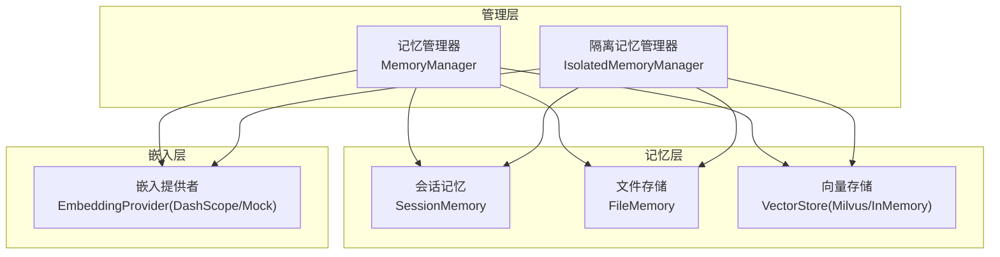
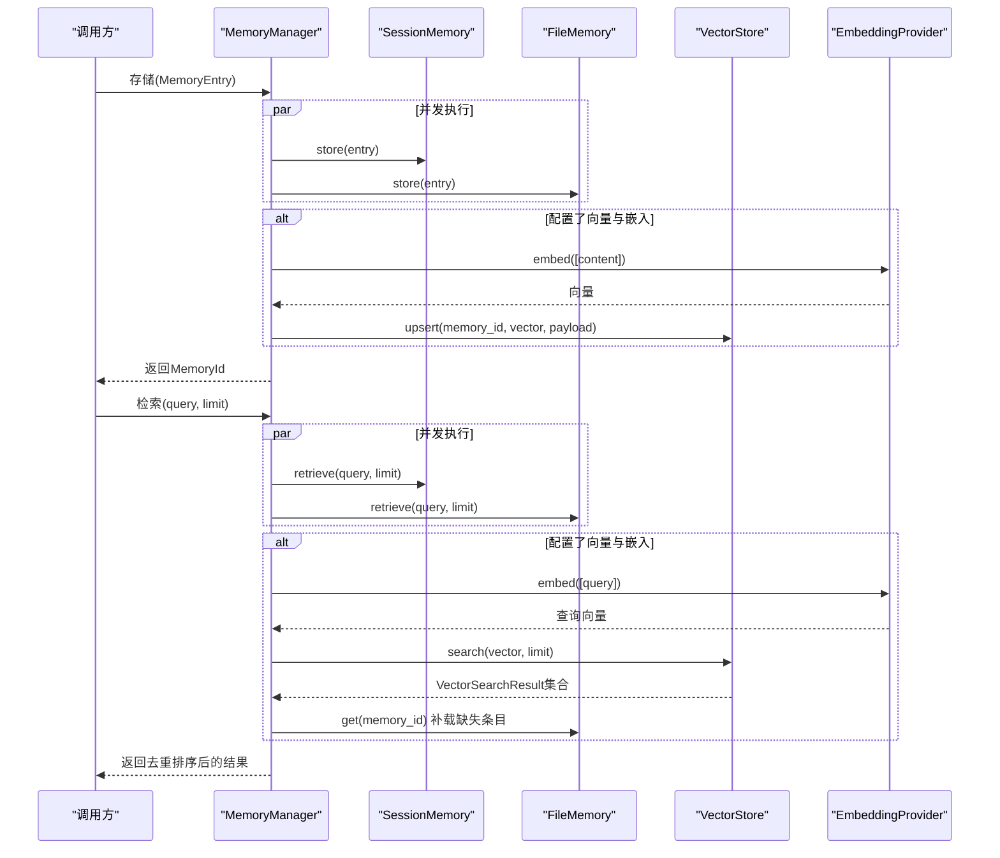
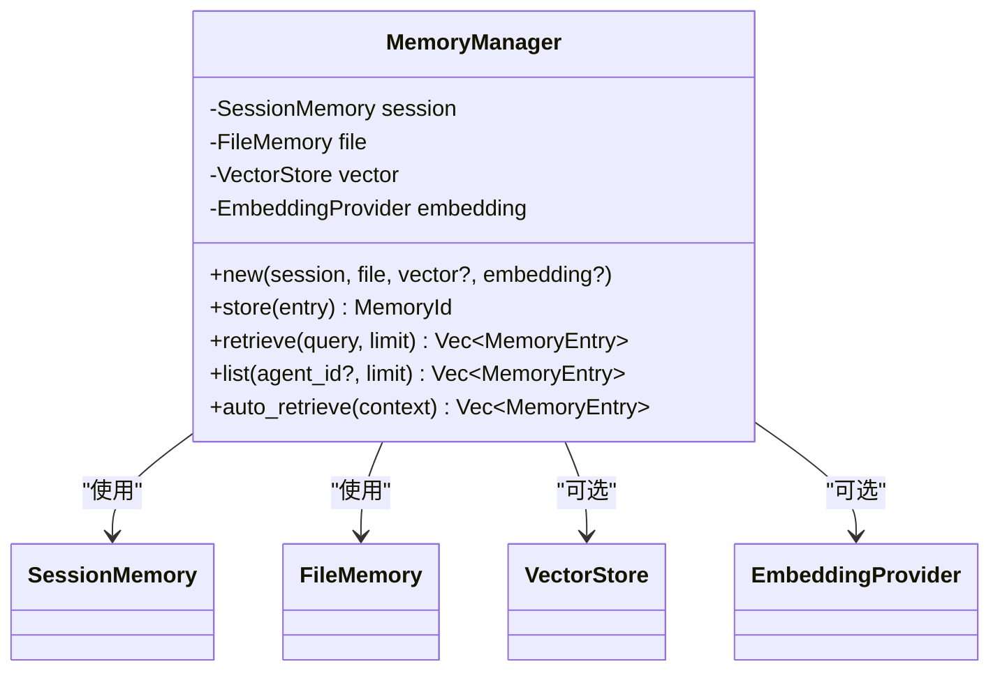
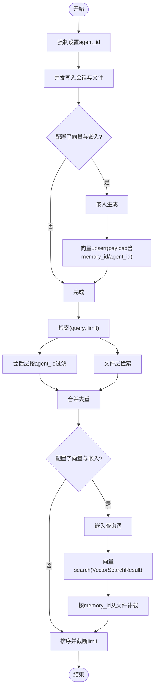
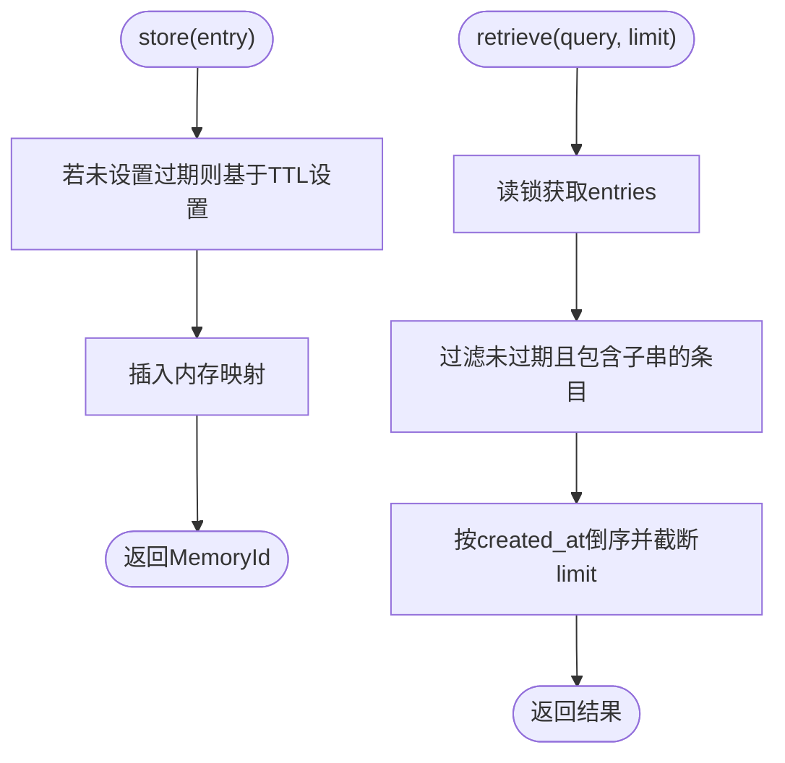
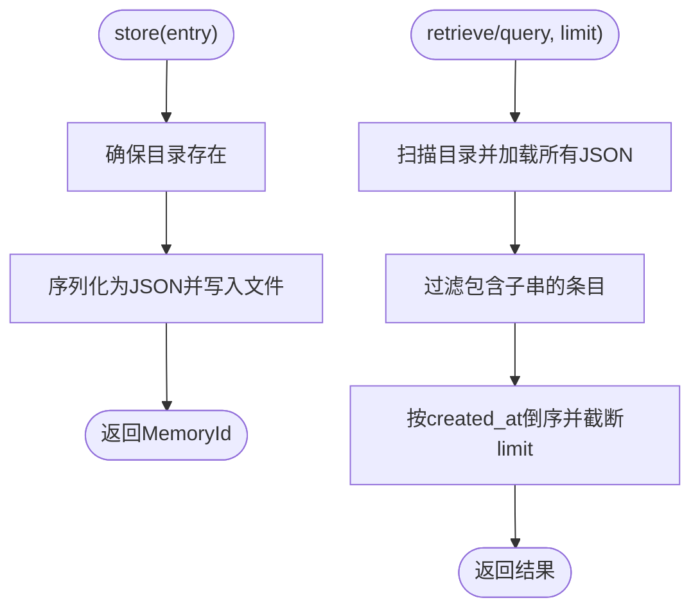
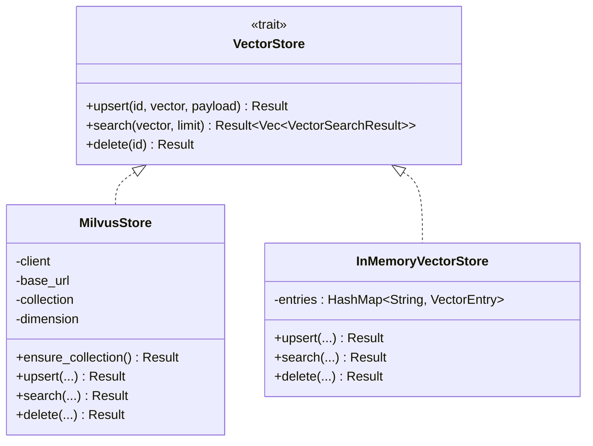
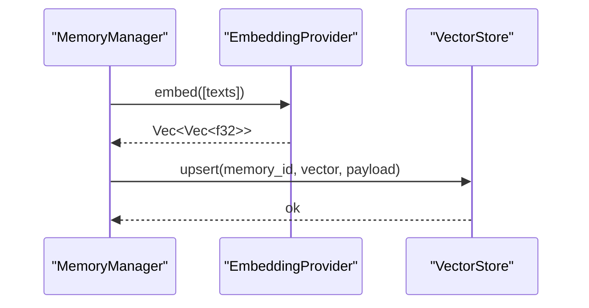
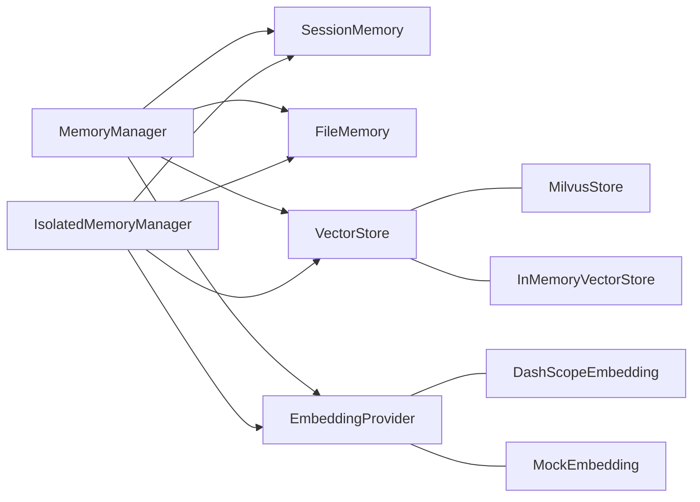

# 记忆系统

<cite>
**本文档引用的文件**
- [lib.rs](file://macaca/crates/macaca-memory/src/lib.rs)
- [manager.rs](file://macaca/crates/macaca-memory/src/manager.rs)
- [session.rs](file://macaca/crates/macaca-memory/src/session.rs)
- [file.rs](file://macaca/crates/macaca-memory/src/file.rs)
- [vector.rs](file://macaca/crates/macaca-memory/src/vector.rs)
- [embedding.rs](file://macaca/crates/macaca-memory/src/embedding.rs)
- [isolated.rs](file://macaca/crates/macaca-memory/src/isolated.rs)
- [store.rs](file://macaca/crates/macaca-memory/src/store.rs)
- [Cargo.toml](file://macaca/crates/macaca-memory/Cargo.toml)
- [default.toml](file://macaca/config/default.toml)
</cite>

## 更新摘要
**变更内容**
- 更新了向量检索和存储接口的实现细节
- 改进了VectorSearchResult结构体的标准化处理
- 增强了隔离式记忆管理器的功能和错误处理
- 优化了嵌入生成和向量存储的接口设计

## 目录
1. [简介](#简介)
2. [项目结构](#项目结构)
3. [核心组件](#核心组件)
4. [架构总览](#架构总览)
5. [详细组件分析](#详细组件分析)
6. [依赖关系分析](#依赖关系分析)
7. [性能考虑](#性能考虑)
8. [故障排除指南](#故障排除指南)
9. [结论](#结论)
10. [附录](#附录)

## 简介
本文件系统性地文档化了三层记忆架构：会话记忆、文件存储与向量检索。该系统通过统一的记忆管理器协调各层，实现数据在内存、持久化文件与向量数据库之间的协同工作。文档涵盖：
- 三层架构的设计理念与数据流
- 记忆管理器的实现细节（并发存储、检索去重、自动检索）
- 向量存储与检索（嵌入生成、相似度计算、Milvus集成）
- 文件存储系统（文件组织、索引与访问控制）
- 配置选项、性能调优与容量规划建议

## 项目结构
macaca-memory crate 提供了完整的三层记忆实现，核心模块如下：
- store.rs：定义通用接口（MemoryStore、MemoryRetriever、EmbeddingProvider、VectorStore）
- session.rs：会话内存层（带TTL过期与并发读写）
- file.rs：文件持久化层（JSON文件存储，按ID命名）
- vector.rs：向量存储层（Milvus REST与内存实现）
- embedding.rs：嵌入提供者（DashScope与Mock）
- manager.rs：统一记忆管理器（协调三层层）
- isolated.rs：隔离式记忆管理器（按应用/代理隔离）
- lib.rs：对外导出入口

**图表来源**
- [lib.rs:1-18](file://macaca/crates/macaca-memory/src/lib.rs#L1-L18)
- [manager.rs:15-21](file://macaca/crates/macaca-memory/src/manager.rs#L15-L21)
- [isolated.rs:20-31](file://macaca/crates/macaca-memory/src/isolated.rs#L20-L31)
- [store.rs:22-51](file://macaca/crates/macaca-memory/src/store.rs#L22-L51)

**章节来源**
- [lib.rs:1-18](file://macaca/crates/macaca-memory/src/lib.rs#L1-L18)
- [Cargo.toml:1-20](file://macaca/crates/macaca-memory/Cargo.toml#L1-L20)

## 核心组件
- MemoryStore 接口：定义 store、retrieve、get、delete、list 的异步操作契约
- MemoryRetriever 接口：提供基于任务上下文的自动检索能力
- EmbeddingProvider 接口：文本到向量的转换与维度声明
- VectorStore 接口：向量的 upsert、search、delete 操作，返回标准化的VectorSearchResult
- SessionMemory：基于内存的短期记忆，支持TTL过期与后台清理
- FileMemory：基于文件系统的长期记忆，按ID命名JSON文件
- VectorStore 实现：Milvus REST API与内存向量存储，统一返回VectorSearchResult
- MemoryManager：统一协调三层层，支持并发存储与检索
- IsolatedMemoryManager：按应用/代理隔离的内存管理器，提供更强的隔离性和错误处理

**章节来源**
- [store.rs:22-51](file://macaca/crates/macaca-memory/src/store.rs#L22-L51)
- [session.rs:18-61](file://macaca/crates/macaca-memory/src/session.rs#L18-L61)
- [file.rs:11-55](file://macaca/crates/macaca-memory/src/file.rs#L11-L55)
- [vector.rs:60-205](file://macaca/crates/macaca-memory/src/vector.rs#L60-L205)
- [embedding.rs:45-162](file://macaca/crates/macaca-memory/src/embedding.rs#L45-L162)
- [manager.rs:15-21](file://macaca/crates/macaca-memory/src/manager.rs#L15-L21)
- [isolated.rs:20-31](file://macaca/crates/macaca-memory/src/isolated.rs#L20-L31)

## 架构总览
三层记忆架构的数据流与控制流如下：

**图表来源**
- [manager.rs:40-119](file://macaca/crates/macaca-memory/src/manager.rs#L40-L119)
- [embedding.rs:80-125](file://macaca/crates/macaca-memory/src/embedding.rs#L80-L125)
- [vector.rs:107-205](file://macaca/crates/macaca-memory/src/vector.rs#L107-L205)
- [session.rs:63-135](file://macaca/crates/macaca-memory/src/session.rs#L63-L135)
- [file.rs:57-113](file://macaca/crates/macaca-memory/src/file.rs#L57-L113)

## 详细组件分析

### 记忆管理器（MemoryManager）
- 并发存储：会话与文件层并行写入，提升吞吐
- 可选向量写入：若配置嵌入与向量存储，则对内容进行嵌入并写入向量库
- 检索合并：会话与文件层检索结果按MemoryId去重，再合并向量层命中项
- 自动检索：根据任务描述与历史片段构建复合查询，调用retrieve

**图表来源**
- [manager.rs:15-21](file://macaca/crates/macaca-memory/src/manager.rs#L15-L21)
- [manager.rs:127-135](file://macaca/crates/macaca-memory/src/manager.rs#L127-L135)

**章节来源**
- [manager.rs:23-71](file://macaca/crates/macaca-memory/src/manager.rs#L23-L71)
- [manager.rs:74-119](file://macaca/crates/macaca-memory/src/manager.rs#L74-L119)
- [manager.rs:127-135](file://macaca/crates/macaca-memory/src/manager.rs#L127-L135)

### 隔离式记忆管理器（IsolatedMemoryManager）
- 应用级与代理级隔离：文件路径按应用/代理分层，向量集合按代理命名
- 强制代理归属：存储时强制设置entry.agent_id，防止跨代理污染
- 联合检索：会话层按agent_id过滤，文件层目录隔离，向量层集合隔离
- 增强错误处理：在向量操作中添加详细的调试日志

**图表来源**
- [isolated.rs:74-109](file://macaca/crates/macaca-memory/src/isolated.rs#L74-L109)
- [isolated.rs:112-169](file://macaca/crates/macaca-memory/src/isolated.rs#L112-L169)
- [embedding.rs:80-125](file://macaca/crates/macaca-memory/src/embedding.rs#L80-L125)
- [vector.rs:138-181](file://macaca/crates/macaca-memory/src/vector.rs#L138-L181)

**章节来源**
- [isolated.rs:33-61](file://macaca/crates/macaca-memory/src/isolated.rs#L33-L61)
- [isolated.rs:74-109](file://macaca/crates/macaca-memory/src/isolated.rs#L74-L109)
- [isolated.rs:112-169](file://macaca/crates/macaca-memory/src/isolated.rs#L112-L169)
- [isolated.rs:229-248](file://macaca/crates/macaca-memory/src/isolated.rs#L229-L248)

### 会话记忆（SessionMemory）
- 内存结构：Arc<RwLock<HashMap<MemoryId, MemoryEntry>>>
- TTL过期：后台定时清理过期条目，支持立即触发
- 检索策略：大小写不敏感子串匹配，按创建时间倒序，限制数量
- 列表过滤：可按agent_id过滤，结合TTL有效性

**图表来源**
- [session.rs:65-78](file://macaca/crates/macaca-memory/src/session.rs#L65-L78)
- [session.rs:80-97](file://macaca/crates/macaca-memory/src/session.rs#L80-L97)

**章节来源**
- [session.rs:18-61](file://macaca/crates/macaca-memory/src/session.rs#L18-L61)
- [session.rs:63-135](file://macaca/crates/macaca-memory/src/session.rs#L63-L135)

### 文件存储（FileMemory）
- 文件组织：每个MemoryEntry以JSON格式保存为"{base_path}/{memory_id}.json"
- 加载策略：启动时扫描目录，忽略解析失败或读取失败的文件
- 检索策略：加载所有条目后进行大小写不敏感子串匹配，排序并截断
- 访问控制：通过目录层级实现天然隔离（配合隔离管理器）

**图表来源**
- [file.rs:59-66](file://macaca/crates/macaca-memory/src/file.rs#L59-L66)
- [file.rs:68-79](file://macaca/crates/macaca-memory/src/file.rs#L68-L79)

**章节来源**
- [file.rs:11-55](file://macaca/crates/macaca-memory/src/file.rs#L11-L55)
- [file.rs:57-113](file://macaca/crates/macaca-memory/src/file.rs#L57-L113)

### 向量存储与检索（VectorStore）
- MilvusStore：通过REST API实现upsert/search/delete，自动确保集合存在，返回标准化的VectorSearchResult
- InMemoryVectorStore：内存向量库，使用余弦相似度暴力搜索，返回VectorSearchResult
- Payload设计：包含memory_id、content、layer等元信息，便于回查

**图表来源**
- [vector.rs:46-51](file://macaca/crates/macaca-memory/src/vector.rs#L46-L51)
- [vector.rs:106-205](file://macaca/crates/macaca-memory/src/vector.rs#L106-L205)
- [vector.rs:214-276](file://macaca/crates/macaca-memory/src/vector.rs#L214-L276)

**章节来源**
- [vector.rs:60-104](file://macaca/crates/macaca-memory/src/vector.rs#L60-L104)
- [vector.rs:106-205](file://macaca/crates/macaca-memory/src/vector.rs#L106-L205)
- [vector.rs:214-276](file://macaca/crates/macaca-memory/src/vector.rs#L214-L276)

### 嵌入生成（EmbeddingProvider）
- DashScopeEmbedding：调用DashScope服务，支持自定义base_url与环境变量
- MockEmbedding：测试用，返回确定性的高维向量
- 维度固定：默认1024维，便于向量库初始化

**图表来源**
- [embedding.rs:80-125](file://macaca/crates/macaca-memory/src/embedding.rs#L80-L125)
- [manager.rs:52-68](file://macaca/crates/macaca-memory/src/manager.rs#L52-L68)

**章节来源**
- [embedding.rs:45-162](file://macaca/crates/macaca-memory/src/embedding.rs#L45-L162)

## 依赖关系分析
- 外部依赖：reqwest用于HTTP请求（DashScope与Milvus），uuid用于ID解析
- 内部依赖：各层均实现MemoryStore接口，向量层实现VectorStore接口，嵌入层实现EmbeddingProvider接口
- 管理器耦合：MemoryManager与IsolatedMemoryManager组合多层实现，保持低耦合高内聚

**图表来源**
- [manager.rs:15-21](file://macaca/crates/macaca-memory/src/manager.rs#L15-L21)
- [isolated.rs:20-31](file://macaca/crates/macaca-memory/src/isolated.rs#L20-L31)
- [vector.rs:60-205](file://macaca/crates/macaca-memory/src/vector.rs#L60-L205)
- [embedding.rs:45-162](file://macaca/crates/macaca-memory/src/embedding.rs#L45-L162)

**章节来源**
- [Cargo.toml:6-15](file://macaca/crates/macaca-memory/Cargo.toml#L6-L15)

## 性能考虑
- 并发与批处理
  - 存储阶段：会话与文件层并行写入，减少RTT与IO等待
  - 检索阶段：会话与文件层并行检索，随后合并去重
- 内存与磁盘权衡
  - SessionMemory适合高频短生命周期数据，TTL避免无限增长
  - FileMemory提供持久化与跨实例一致性，适合长期数据
- 向量检索优化
  - MilvusStore通过REST接口批量upsert/search，payload中携带memory_id便于回查
  - InMemoryVectorStore采用余弦相似度，适合小规模测试场景
- 嵌入成本控制
  - 建议在必要时才启用向量层，避免频繁嵌入调用
  - 对于DashScope等外部服务，注意API配额与延迟

## 故障排除指南
- 向量存储失败
  - MilvusStore：检查base_url、collection名称与权限；关注HTTP状态码与响应体
  - 建议：先调用ensure_collection确保集合存在
- 嵌入服务异常
  - DashScopeEmbedding：确认DASHSCOPE_API_KEY环境变量；检查网络连通性与模型维度
- 文件读写错误
  - FileMemory：确认base_path可写；检查JSON解析失败的条目
- 会话过期问题
  - SessionMemory：确认TTL设置与后台清理任务是否正常运行

**章节来源**
- [vector.rs:78-104](file://macaca/crates/macaca-memory/src/vector.rs#L78-L104)
- [embedding.rs:72-77](file://macaca/crates/macaca-memory/src/embedding.rs#L72-L77)
- [file.rs:33-54](file://macaca/crates/macaca-memory/src/file.rs#L33-L54)
- [session.rs:30-48](file://macaca/crates/macaca-memory/src/session.rs#L30-L48)

## 结论
该三层记忆系统通过MemoryManager与IsolatedMemoryManager实现了会话、文件与向量的有机整合，具备良好的扩展性与隔离能力。通过合理的并发策略、TTL与持久化设计，能够在性能与可靠性之间取得平衡。建议在生产环境中结合配置文件中的参数进行容量与性能调优。

## 附录

### 配置选项与参数
- 会话层
  - session_ttl_seconds：会话记忆TTL（秒）
- 文件存储
  - file_store_path：文件存储根目录
- 向量层
  - backend：向量存储后端（milvus）
  - milvus_url：Milvus REST地址
  - collection_name：集合名称
- 嵌入层
  - provider：嵌入提供者（dashscope）
  - model：模型名称（如text-embedding-v4）
  - api_key：API密钥（环境变量名）
  - dimensions：向量维度（默认1024）
  - base_url：服务基础URL
- 自动检索
  - auto_retrieve_on：触发自动检索的时机（如task_start）

**章节来源**
- [default.toml:57-72](file://macaca/config/default.toml#L57-L72)

### 容量规划建议
- 会话层
  - 根据对话轮数与消息长度估算TTL与内存占用，避免过长TTL导致内存膨胀
- 文件层
  - 控制单个文件大小与条目数量，定期归档旧数据
- 向量层
  - Milvus集合需与维度匹配；合理设置limit与批量upsert大小
  - 对高频查询内容可考虑预嵌入与缓存策略

### VectorSearchResult结构体详解
VectorSearchResult是向量检索的标准输出格式，包含以下字段：
- id：向量记录的唯一标识符
- score：与查询向量的相似度分数
- payload：附加的元数据信息，包含memory_id、content、layer等

这个标准化结构体确保了所有向量存储实现的一致性，简化了上层逻辑的处理复杂度。

**章节来源**
- [store.rs:14-20](file://macaca/crates/macaca-memory/src/store.rs#L14-L20)
- [vector.rs:186-191](file://macaca/crates/macaca-memory/src/vector.rs#L186-L191)
- [vector.rs:285](file://macaca/crates/macaca-memory/src/vector.rs#L285)