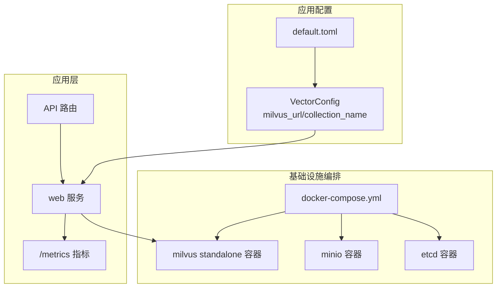
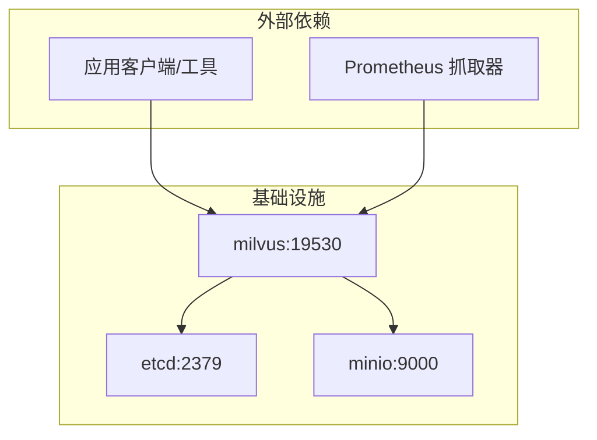
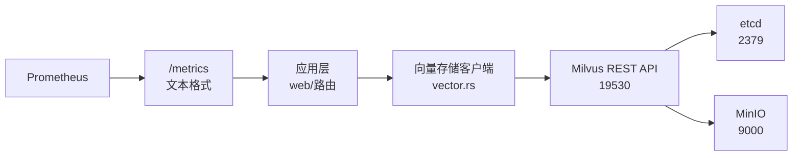
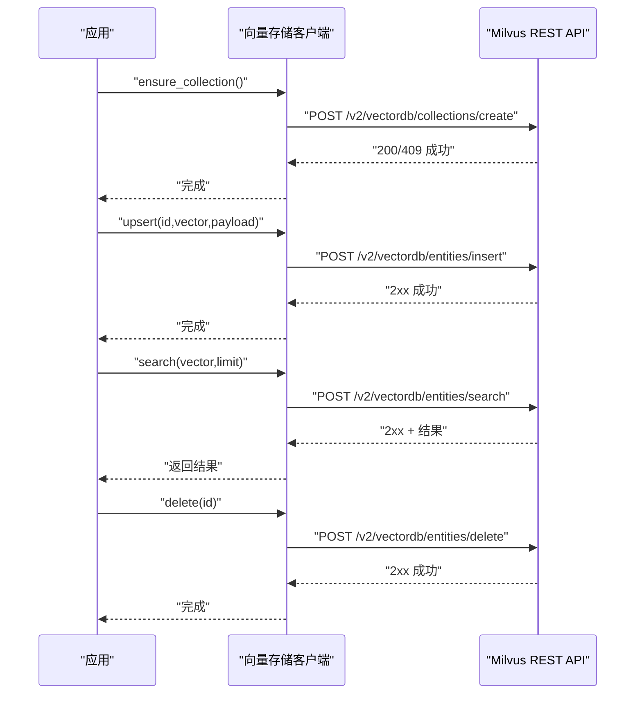

# 基础设施配置

<cite>
**本文档引用的文件**
- [docker-compose.yml](file://macaca/infra/milvus/docker-compose.yml)
- [default.toml](file://macaca/config/default.toml)
- [vector.rs](file://macaca/crates/macaca-memory/src/vector.rs)
- [config.rs](file://macaca/crates/macaca-proto/src/config.rs)
- [install-systemd.sh](file://macaca/deploy/install-systemd.sh)
- [macaca.service](file://macaca/deploy/macaca.service)
- [metrics.rs](file://macaca/crates/macaca-web/src/metrics.rs)
- [routes.rs](file://macaca/crates/macaca-web/src/routes.rs)
- [SYSTEM_AUDIT.md](file://macaca/docs/SYSTEM_AUDIT.md)
- [redb_store.rs](file://macaca/crates/macaca-persist/src/redb_store.rs)
- [store.rs](file://macaca/crates/macaca-persist/src/store.rs)
</cite>

## 目录
1. [简介](#简介)
2. [项目结构](#项目结构)
3. [核心组件](#核心组件)
4. [架构总览](#架构总览)
5. [详细组件分析](#详细组件分析)
6. [依赖关系分析](#依赖关系分析)
7. [性能考虑](#性能考虑)
8. [故障排除指南](#故障排除指南)
9. [结论](#结论)
10. [附录](#附录)

## 简介
本文件面向基础设施工程师与运维人员，系统化梳理并文档化 Milvus 向量数据库在本项目的部署配置，涵盖 etcd 集群、MinIO 对象存储与 Milvus 服务的配置参数、组件间依赖关系与通信协议、性能调优建议、数据持久化与备份策略、监控与告警设置，以及常见性能问题的诊断方法。文档同时结合项目中实际的配置文件与代码实现，确保内容可落地、可验证。

## 项目结构
本项目采用多模块架构，基础设施配置主要集中在以下位置：
- Milvus 基础设施编排：macaca/infra/milvus/docker-compose.yml
- 应用默认配置：macaca/config/default.toml
- 向量存储客户端实现：macaca/crates/macaca-memory/src/vector.rs
- 配置模型定义：macaca/crates/macaca-proto/src/config.rs
- 系统服务安装与资源限制：macaca/deploy/install-systemd.sh、macaca/deploy/macaca.service
- 监控指标导出：macaca/crates/macaca-web/src/metrics.rs
- 日志与审计：macaca/docs/SYSTEM_AUDIT.md
- 数据持久化：macaca/crates/macaca-persist/src/redb_store.rs、macaca/crates/macaca-persist/src/store.rs

**图表来源**
- [docker-compose.yml:1-69](file://macaca/infra/milvus/docker-compose.yml#L1-L69)
- [default.toml:62-72](file://macaca/config/default.toml#L62-L72)
- [vector.rs:60-104](file://macaca/crates/macaca-memory/src/vector.rs#L60-L104)
- [metrics.rs:131-141](file://macaca/crates/macaca-web/src/metrics.rs#L131-L141)
- [routes.rs:1-50](file://macaca/crates/macaca-web/src/routes.rs#L1-L50)

**章节来源**
- [docker-compose.yml:1-69](file://macaca/infra/milvus/docker-compose.yml#L1-L69)
- [default.toml:62-72](file://macaca/config/default.toml#L62-L72)

## 核心组件
- etcd：作为 Milvus 的元数据与租约存储，负责分布式一致性与配置中心功能。
- MinIO：作为对象存储后端，提供向量数据与二进制文件的持久化存储。
- Milvus Standalone：向量数据库服务，通过 REST API 与应用交互，依赖 etcd 和 MinIO。
- 应用配置：通过 default.toml 指定 Milvus 地址与集合名称，向量存储客户端基于该配置访问 Milvus。
- 监控与日志：通过 Prometheus 指标端点暴露运行时指标，结合文件日志与审计报告进行可观测性建设。

**章节来源**
- [docker-compose.yml:4-65](file://macaca/infra/milvus/docker-compose.yml#L4-L65)
- [default.toml:62-72](file://macaca/config/default.toml#L62-L72)
- [metrics.rs:131-141](file://macaca/crates/macaca-web/src/metrics.rs#L131-L141)

## 架构总览
下图展示了 Milvus 基础设施在本项目中的部署拓扑与数据流：

**图表来源**
- [docker-compose.yml:4-65](file://macaca/infra/milvus/docker-compose.yml#L4-L65)
- [default.toml:62-65](file://macaca/config/default.toml#L62-L65)
- [metrics.rs:131-141](file://macaca/crates/macaca-web/src/metrics.rs#L131-L141)

## 详细组件分析

### etcd 配置与参数
- 版本与镜像：v3.5.25
- 关键环境变量：
  - ETCD_AUTO_COMPACTION_MODE=revision
  - ETCD_AUTO_COMPACTION_RETENTION=1000
  - ETCD_QUOTA_BACKEND_BYTES=4294967296（4GiB）
  - ETCD_SNAPSHOT_COUNT=50000
- 数据卷：/etcd -> ${DOCKER_VOLUME_DIRECTORY:-.}/volumes/etcd
- 健康检查：通过 etcdctl endpoint health
- 通信端口：2379（容器内监听 0.0.0.0:2379）

调优要点
- 后端配额：根据数据规模调整 ETCD_QUOTA_BACKEND_BYTES，避免磁盘空间耗尽导致写入失败。
- 自动压缩：合理设置保留代数，平衡存储占用与查询性能。
- 快照频率：ETCD_SNAPSHOT_COUNT 控制快照触发阈值，结合写入压力调整。

**章节来源**
- [docker-compose.yml:6-19](file://macaca/infra/milvus/docker-compose.yml#L6-L19)

### MinIO 配置与参数
- 版本与镜像：RELEASE.2024-12-18T13-15-44Z
- 认证：MINIO_ACCESS_KEY / MINIO_SECRET_KEY（默认 admin 凭据）
- 数据卷：/minio_data -> ${DOCKER_VOLUME_DIRECTORY:-.}/volumes/minio
- 健康检查：curl http://localhost:9000/minio/health/live
- 控制台端口：9001（容器内映射）
- 服务端口：9000（容器内监听）

调优要点
- 凭据安全：生产环境务必修改默认凭据，并通过环境变量注入。
- 存储容量：根据向量数量与维度估算对象存储需求，预留 20%-30% 额外空间。
- 端口映射：确保宿主机端口未被占用，避免容器启动失败。

**章节来源**
- [docker-compose.yml:21-34](file://macaca/infra/milvus/docker-compose.yml#L21-L34)

### Milvus Standalone 配置与参数
- 镜像版本：v2.6.11
- 运行模式：standalone
- 环境变量：
  - ETCD_ENDPOINTS=etcd:2379
  - MINIO_ADDRESS=minio:9000
  - MQ_TYPE=woodpecker
  - no_proxy/NO_PROXY：跳过本地与 etcd/minio 的代理
  - http_proxy/https_proxy：清空以避免代理干扰
- 数据卷：/var/lib/milvus -> ${DOCKER_VOLUME_DIRECTORY:-.}/volumes/milvus
- 健康检查：curl http://localhost:9091/healthz
- 端口映射：19530:19530（向量服务）、19091:9091（健康检查服务）
- 依赖：depends_on etcd 与 minio

调优要点
- 端口与网络：确保宿主机端口未被占用；如需远程访问，谨慎开放 19530。
- 代理配置：清空 http_proxy/https_proxy，避免 Milvus 无法连接 etcd 或 MinIO。
- 健康检查：start_period 设置为 90s，给 Milvus 初始化留足时间。

**章节来源**
- [docker-compose.yml:36-65](file://macaca/infra/milvus/docker-compose.yml#L36-L65)

### 应用配置与 Milvus 集成
- 向量配置项：
  - backend=milvus
  - milvus_url=http://localhost:19530
  - collection_name=agent_memory
- 应用通过向量存储客户端访问 Milvus，自动创建集合并执行插入、搜索、删除操作。

调优要点
- 集合命名：确保 collection_name 与应用侧一致，避免数据隔离问题。
- 网络连通：milvus_url 必须可从应用容器访问；若容器网络隔离，需调整网络或使用服务名。

**章节来源**
- [default.toml:62-72](file://macaca/config/default.toml#L62-L72)
- [vector.rs:60-104](file://macaca/crates/macaca-memory/src/vector.rs#L60-L104)

### 监控与指标导出
- /metrics 端点：无需认证，Prometheus 可直接抓取。
- 指标类别：
  - LLM 请求总量与耗时
  - LLM Token 使用统计
  - 任务委派与工具执行次数
  - 运行追踪事件
- 指标标签：按模型、状态、工具名等维度标注，便于聚合分析。

调优要点
- 抓取间隔：根据数据量与查询频率设置合理的抓取周期。
- 标签设计：统一标签命名规范，避免维度爆炸。

**章节来源**
- [metrics.rs:131-141](file://macaca/crates/macaca-web/src/metrics.rs#L131-L141)

### 系统服务与资源限制
- systemd 服务：
  - ExecStart=/usr/local/bin/macaca web
  - MemoryMax=4G
  - LimitNOFILE=65536
  - WatchdogSec=30（超时自动重启）
- 环境文件：/etc/macaca/env 支持注入 RUST_LOG、API 密钥等。

调优要点
- 内存上限：根据并发与任务复杂度调整 MemoryMax。
- 文件句柄：大并发场景下适当提高 LimitNOFILE。
- Watchdog：确保应用具备心跳机制，避免误重启。

**章节来源**
- [install-systemd.sh:1-60](file://macaca/deploy/install-systemd.sh#L1-L60)
- [macaca.service:1-38](file://macaca/deploy/macaca.service#L1-L38)

## 依赖关系分析
组件间的依赖与通信如下：

**图表来源**
- [vector.rs:60-104](file://macaca/crates/macaca-memory/src/vector.rs#L60-L104)
- [docker-compose.yml:4-65](file://macaca/infra/milvus/docker-compose.yml#L4-L65)
- [metrics.rs:131-141](file://macaca/crates/macaca-web/src/metrics.rs#L131-L141)

**章节来源**
- [vector.rs:60-104](file://macaca/crates/macaca-memory/src/vector.rs#L60-L104)
- [routes.rs:1-50](file://macaca/crates/macaca-web/src/routes.rs#L1-L50)

## 性能考虑

### etcd 性能调优
- 后端配额：ETCD_QUOTA_BACKEND_BYTES 建议不低于 4GiB，按数据规模线性增长。
- 自动压缩：ETCD_AUTO_COMPACTION_RETENTION 设置为 1000 左右，兼顾存储与查询效率。
- 快照频率：ETCD_SNAPSHOT_COUNT 建议 50000，避免频繁快照影响写入。

**章节来源**
- [docker-compose.yml:8-11](file://macaca/infra/milvus/docker-compose.yml#L8-L11)

### MinIO 性能调优
- 凭据安全：生产环境必须修改默认凭据，避免被暴力破解。
- 存储容量：预留 20%-30% 额外空间，防止写放大导致的容量不足。
- 端口与网络：确保 9000/9001 映射正确且防火墙放行。

**章节来源**
- [docker-compose.yml:24-29](file://macaca/infra/milvus/docker-compose.yml#L24-L29)

### Milvus 性能调优
- 端口与网络：19530 为向量服务端口，19091 为健康检查端口；确保宿主机端口未被占用。
- 代理配置：清空 http_proxy/https_proxy，避免 Milvus 无法连接 etcd 或 MinIO。
- 健康检查：start_period 90s，给 Milvus 初始化留足时间。

**章节来源**
- [docker-compose.yml:42-59](file://macaca/infra/milvus/docker-compose.yml#L42-L59)

### 应用层性能调优
- 内存与文件句柄：MemoryMax=4G，LimitNOFILE=65536，按并发与任务复杂度调整。
- Watchdog：WatchdogSec=30，确保应用具备心跳机制。
- 指标抓取：/metrics 端点无需认证，Prometheus 可直接抓取。

**章节来源**
- [macaca.service:22-30](file://macaca/deploy/macaca.service#L22-L30)
- [metrics.rs:131-141](file://macaca/crates/macaca-web/src/metrics.rs#L131-L141)

## 故障排除指南

### Milvus 无法启动或健康检查失败
- 检查 etcd 与 MinIO 是否正常运行。
- 确认 ETCD_ENDPOINTS 与 MINIO_ADDRESS 配置正确。
- 清理 http_proxy/https_proxy，避免代理干扰。
- 查看 Milvus 健康检查端口 19091 是否可达。

**章节来源**
- [docker-compose.yml:42-59](file://macaca/infra/milvus/docker-compose.yml#L42-L59)

### 向量操作失败（创建集合/插入/搜索/删除）
- 确认 milvus_url 与 collection_name 配置一致。
- 检查 Milvus REST API 返回状态码与错误信息。
- 验证集合维度与向量维度匹配。

**章节来源**
- [default.toml:62-72](file://macaca/config/default.toml#L62-L72)
- [vector.rs:78-103](file://macaca/crates/macaca-memory/src/vector.rs#L78-L103)

### 监控指标缺失或抓取失败
- 确认 /metrics 端点未被代理或防火墙阻断。
- 检查应用进程是否正常，Watchdog 是否触发。
- 核对 Prometheus 抓取配置与标签。

**章节来源**
- [metrics.rs:131-141](file://macaca/crates/macaca-web/src/metrics.rs#L131-L141)
- [macaca.service:15-16](file://macaca/deploy/macaca.service#L15-L16)

### 数据持久化与备份
- redb 存储：应用使用 redb 作为事件日志与会话持久化存储，位于 data_dir。
- 备份策略：定期复制 data_dir 目录至安全位置；结合快照间隔进行增量备份。
- 备份验证：定期恢复测试，确保备份可用性。

**章节来源**
- [default.toml:88-91](file://macaca/config/default.toml#L88-L91)
- [redb_store.rs:1-35](file://macaca/crates/macaca-persist/src/redb_store.rs#L1-L35)
- [store.rs:1-11](file://macaca/crates/macaca-persist/src/store.rs#L1-L11)

## 结论
本项目通过 docker-compose 将 etcd、MinIO 与 Milvus Standalone 组织为完整的向量数据库基础设施，配合应用配置与监控指标，实现了可观察、可扩展的向量检索能力。建议在生产环境中强化安全配置（凭据、网络与代理）、优化 etcd 与 MinIO 的存储参数，并建立完善的备份与监控体系，以保障系统的稳定性与可靠性。

## 附录

### Milvus REST API 调用序列（创建集合/插入/搜索/删除）

**图表来源**
- [vector.rs:78-204](file://macaca/crates/macaca-memory/src/vector.rs#L78-L204)