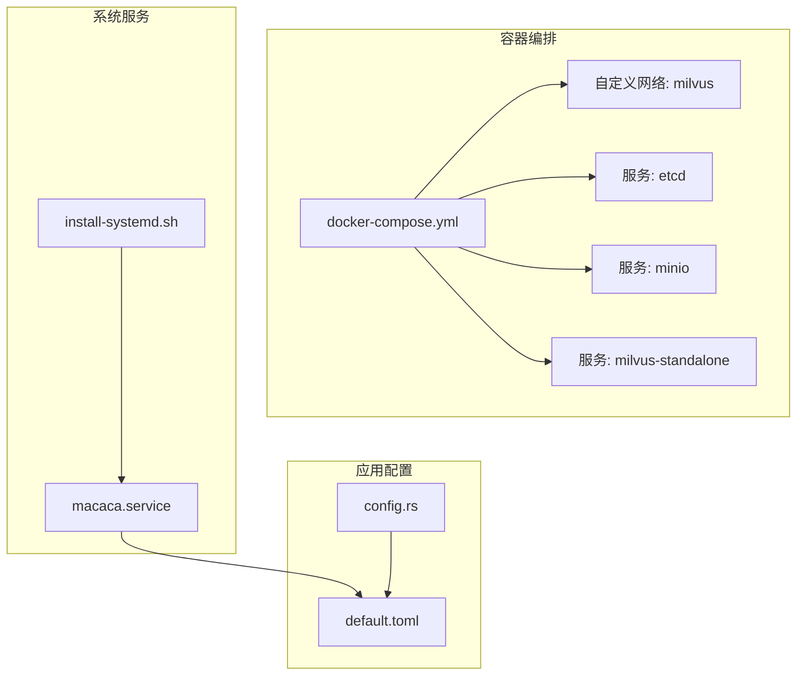
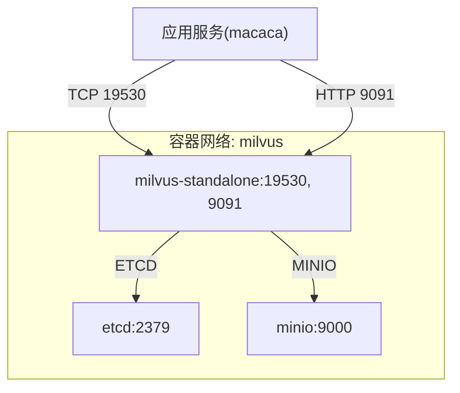
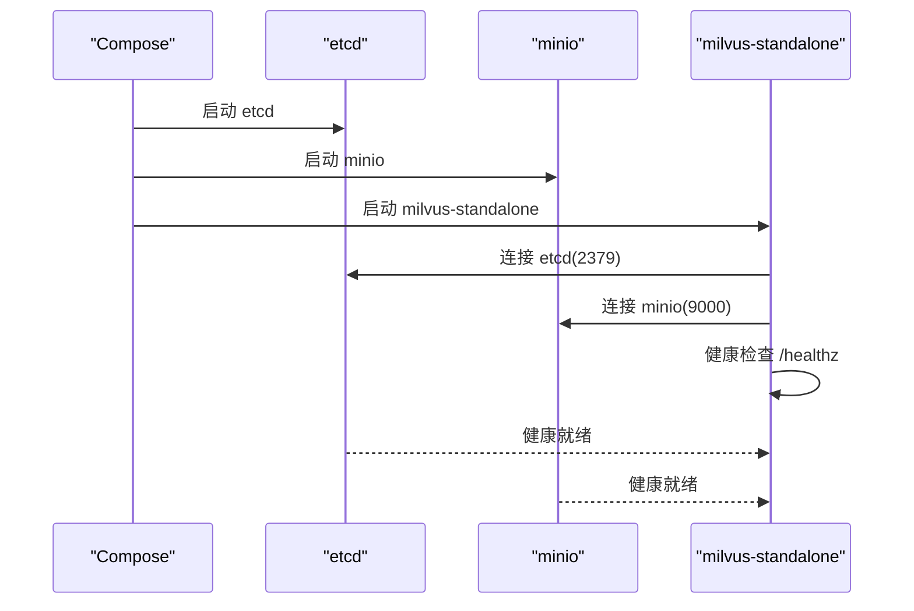
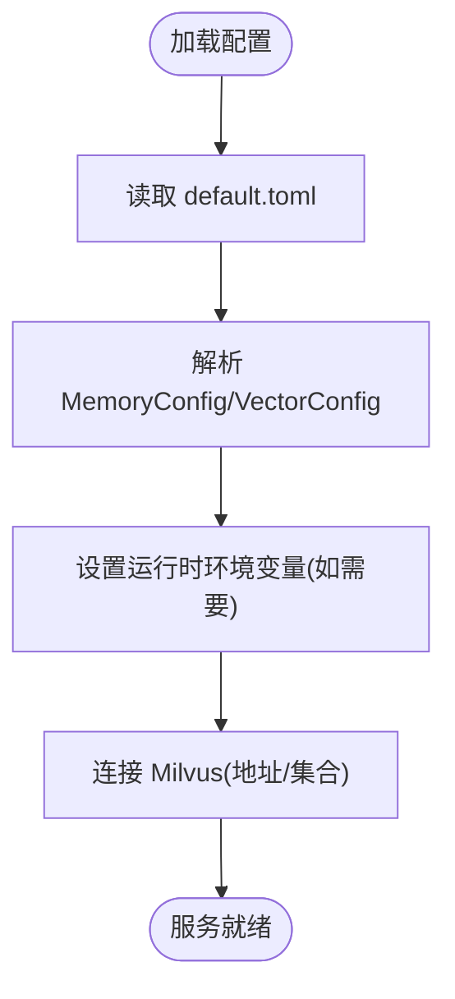
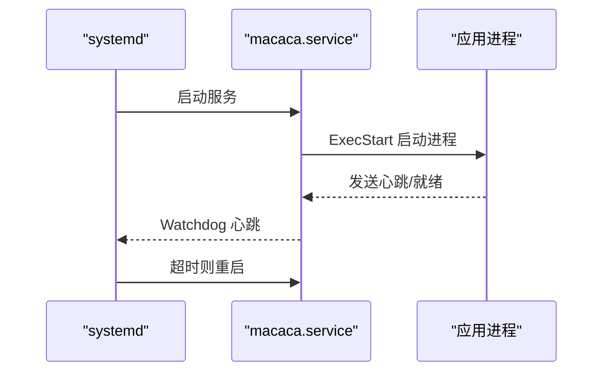

# 容器化部署

<cite>
**本文引用的文件**
- [docker-compose.yml](file://macaca/infra/milvus/docker-compose.yml)
- [default.toml](file://macaca/config/default.toml)
- [install-systemd.sh](file://macaca/deploy/install-systemd.sh)
- [macaca.service](file://macaca/deploy/macaca.service)
- [config.rs](file://macaca/crates/macaca-proto/src/config.rs)
- [app_executor.rs](file://macaca/crates/macaca-kernel/src/executor/app_executor.rs)
- [routes.rs](file://macaca/crates/macaca-web/src/routes.rs)
</cite>

## 目录
1. [简介](#简介)
2. [项目结构](#项目结构)
3. [核心组件](#核心组件)
4. [架构总览](#架构总览)
5. [详细组件分析](#详细组件分析)
6. [依赖分析](#依赖分析)
7. [性能考虑](#性能考虑)
8. [故障排查指南](#故障排查指南)
9. [结论](#结论)
10. [附录](#附录)

## 简介
本指南聚焦于在容器环境中部署与运行本项目，涵盖以下要点：
- Docker 镜像构建最佳实践：多阶段构建、镜像瘦身、安全加固与运行时隔离
- Docker Compose 编排：Milvus 向量数据库的容器配置、依赖关系与网络拓扑
- 容器网络、卷挂载与环境变量设置：确保 Milvus 与应用服务稳定互通
- 健康检查、资源限制与监控：提升生产可用性与可观测性
- 完整部署命令与配置示例路径、故障排查与日志查看方法

## 项目结构
本项目包含两套关键的容器化与系统集成配置：
- Milvus 向量数据库的 Docker Compose 编排，位于 [docker-compose.yml](file://macaca/infra/milvus/docker-compose.yml)
- 本地系统服务（非容器）的 systemd 部署脚本与服务单元，位于 [install-systemd.sh](file://macaca/deploy/install-systemd.sh) 与 [macaca.service](file://macaca/deploy/macaca.service)
- 应用侧默认配置模板，用于定义 Milvus 连接参数等，位于 [default.toml](file://macaca/config/default.toml)
- 配置模型定义（含内存与向量配置），位于 [config.rs](file://macaca/crates/macaca-proto/src/config.rs)

图表来源
- [docker-compose.yml:1-69](file://macaca/infra/milvus/docker-compose.yml#L1-L69)
- [macaca.service:1-38](file://macaca/deploy/macaca.service#L1-L38)
- [install-systemd.sh:1-60](file://macaca/deploy/install-systemd.sh#L1-L60)
- [default.toml:62-65](file://macaca/config/default.toml#L62-L65)
- [config.rs:126-141](file://macaca/crates/macaca-proto/src/config.rs#L126-L141)

章节来源
- [docker-compose.yml:1-69](file://macaca/infra/milvus/docker-compose.yml#L1-L69)
- [default.toml:62-65](file://macaca/config/default.toml#L62-L65)
- [config.rs:126-141](file://macaca/crates/macaca-proto/src/config.rs#L126-L141)
- [install-systemd.sh:1-60](file://macaca/deploy/install-systemd.sh#L1-L60)
- [macaca.service:1-38](file://macaca/deploy/macaca.service#L1-L38)

## 核心组件
- Milvus 服务（standalone）：提供向量检索能力，依赖 etcd 与 minio
- etcd：键值存储与分布式协调，作为 Milvus 的元数据与租约管理后端
- MinIO：对象存储，作为 Milvus 的数据持久化后端
- 应用服务（非容器）：通过 systemd 管理，读取配置文件连接 Milvus

章节来源
- [docker-compose.yml:36-65](file://macaca/infra/milvus/docker-compose.yml#L36-L65)
- [default.toml:62-65](file://macaca/config/default.toml#L62-L65)
- [config.rs:126-141](file://macaca/crates/macaca-proto/src/config.rs#L126-L141)
- [macaca.service:1-38](file://macaca/deploy/macaca.service#L1-L38)

## 架构总览
下图展示 Milvus 在容器中的运行架构与依赖关系，以及应用服务如何通过配置访问 Milvus。

图表来源
- [docker-compose.yml:36-65](file://macaca/infra/milvus/docker-compose.yml#L36-L65)
- [default.toml:62-65](file://macaca/config/default.toml#L62-L65)

## 详细组件分析

### Milvus 容器编排与配置
- 服务定义与端口映射
  - standalone 服务映射 19530（客户端连接）与 9091（健康检查/指标）
- 环境变量与代理
  - 设置 ETCD_ENDPOINTS、MINIO_ADDRESS、MQ_TYPE（woodpecker）
  - no_proxy/NO_PROXY 明确排除 etcd 与 minio，避免代理干扰
- 健康检查
  - etcd 使用 etcdctl endpoint health
  - minio 使用 curl 检查 /minio/health/live
  - milvus 使用 curl 检查 /healthz，初始延迟较长以等待启动完成
- 卷挂载
  - etcd 数据目录、minio 数据目录、milvus 数据目录均持久化至宿主机
- 依赖关系
  - standalone 依赖 etcd 与 minio 启动完成

图表来源
- [docker-compose.yml:3-65](file://macaca/infra/milvus/docker-compose.yml#L3-L65)

章节来源
- [docker-compose.yml:1-69](file://macaca/infra/milvus/docker-compose.yml#L1-L69)

### 应用配置与 Milvus 连接
- 默认配置中，向量后端为 milvus，集合名称与 Milvus 地址明确
- 配置模型中包含 MemoryConfig、VectorConfig 等字段，支撑运行时连接参数解析

图表来源
- [default.toml:62-65](file://macaca/config/default.toml#L62-L65)
- [config.rs:126-141](file://macaca/crates/macaca-proto/src/config.rs#L126-L141)

章节来源
- [default.toml:62-65](file://macaca/config/default.toml#L62-L65)
- [config.rs:126-141](file://macaca/crates/macaca-proto/src/config.rs#L126-L141)

### 系统服务（非容器）与健康检查
- systemd 服务单元
  - 使用 notify 类型，WatchdogSec=30 秒，超时将被重启
  - 限制文件描述符数量、内存上限，启用安全保护
  - 读取 /etc/macaca/env 环境文件，支持 RUST_LOG 等
- 应用侧健康检查
  - 工作器健康检查基于心跳时间窗口判断健康状态

图表来源
- [macaca.service:7-31](file://macaca/deploy/macaca.service#L7-L31)
- [app_executor.rs:547-578](file://macaca/crates/macaca-kernel/src/executor/app_executor.rs#L547-L578)

章节来源
- [macaca.service:1-38](file://macaca/deploy/macaca.service#L1-L38)
- [app_executor.rs:547-578](file://macaca/crates/macaca-kernel/src/executor/app_executor.rs#L547-L578)

## 依赖分析
- 组件耦合
  - milvus-standalone 强依赖 etcd 与 minio
  - 应用服务通过配置文件连接 milvus-standalone
- 外部依赖
  - etcd、minio、milvus 官方镜像版本固定，保证兼容性
- 网络依赖
  - 所有服务位于同一自定义网络，容器间通过服务名通信

图表来源
- [docker-compose.yml:3-65](file://macaca/infra/milvus/docker-compose.yml#L3-L65)

章节来源
- [docker-compose.yml:67-69](file://macaca/infra/milvus/docker-compose.yml#L67-L69)

## 性能考虑
- 存储与 I/O
  - 持久化卷挂载至宿主机，建议使用高性能磁盘与合适的文件系统
- 内存与文件句柄
  - systemd 服务限制 MemoryMax 与 LimitNOFILE，避免资源争用
- 网络与代理
  - 明确 no_proxy 列表，减少不必要的代理开销
- 健康检查间隔
  - 建议根据集群规模调整健康检查间隔与重试次数，避免过度探测

## 故障排查指南
- Milvus 无法启动或不健康
  - 检查 etcd 与 minio 是否健康，确认端口映射与网络连通
  - 查看 milvus 健康检查输出与容器日志
- 应用无法连接 Milvus
  - 核对 default.toml 中 milvus_url 与集合名是否正确
  - 确认容器网络与 DNS 解析正常
- systemd 服务异常重启
  - 使用 journalctl 跟踪服务日志，关注 Watchdog 超时与错误栈
  - 检查环境变量文件 /etc/macaca/env 是否存在且权限正确

章节来源
- [docker-compose.yml:15-19](file://macaca/infra/milvus/docker-compose.yml#L15-L19)
- [docker-compose.yml:30-34](file://macaca/infra/milvus/docker-compose.yml#L30-L34)
- [docker-compose.yml:54-59](file://macaca/infra/milvus/docker-compose.yml#L54-L59)
- [macaca.service:15-16](file://macaca/deploy/macaca.service#L15-L16)
- [install-systemd.sh:54-55](file://macaca/deploy/install-systemd.sh#L54-L55)

## 结论
本指南提供了从镜像构建到编排部署、从网络与卷配置到健康检查与资源限制的完整落地路径。Milvus 作为向量数据库的核心依赖，通过 Compose 实现一键拉起；应用侧通过配置文件与 systemd 保障长期稳定运行。建议在生产环境中结合监控与告警体系进一步完善可观测性与自动化运维。

## 附录

### Docker 镜像构建最佳实践（通用指导）
- 多阶段构建
  - 使用精简基础镜像进行最终运行时镜像，减少攻击面
  - 在构建阶段安装必要工具，构建完成后移除中间产物
- 镜像优化
  - 合理分层，避免频繁变更导致缓存失效
  - 清理包管理器缓存与临时文件
- 安全配置
  - 使用只读根文件系统、禁用不必要特权
  - 限制用户 UID/GID，最小权限原则
  - 启用 seccomp、AppArmor/SELinux 等内核安全特性

### Docker Compose 编排与 Milvus 配置要点
- 网络
  - 自定义网络确保服务间稳定通信
- 卷
  - etcd、minio、milvus 数据目录持久化
- 环境变量
  - 明确 ETCD_ENDPOINTS、MINIO_ADDRESS、MQ_TYPE
  - no_proxy/NO_PROXY 排除内部服务域名
- 健康检查
  - 使用 etcdctl、curl 等工具进行端点健康探测
- 端口映射
  - 19530（客户端）、9091（健康/指标）

章节来源
- [docker-compose.yml:3-65](file://macaca/infra/milvus/docker-compose.yml#L3-L65)

### 容器网络、卷挂载与环境变量设置
- 网络
  - 使用自定义网络名称，避免与其他项目冲突
- 卷
  - 指定宿主机目录映射，确保数据持久化与备份策略
- 环境变量
  - 通过 compose 的 environment 字段统一管理
  - 对敏感信息使用外部密钥管理或 secrets

章节来源
- [docker-compose.yml:7-51](file://macaca/infra/milvus/docker-compose.yml#L7-L51)

### 健康检查、资源限制与监控
- 健康检查
  - 为 etcd、minio、milvus 分别配置健康检查命令与周期
- 资源限制
  - 在 compose 中设置 CPU/内存限制，或在 systemd 中使用 MemoryMax/LimitNOFILE
- 监控
  - 集成 Prometheus/Grafana 或 OTLP 收集器，采集容器与应用指标

章节来源
- [docker-compose.yml:15-19](file://macaca/infra/milvus/docker-compose.yml#L15-L19)
- [docker-compose.yml:30-34](file://macaca/infra/milvus/docker-compose.yml#L30-L34)
- [docker-compose.yml:54-59](file://macaca/infra/milvus/docker-compose.yml#L54-L59)
- [macaca.service:22-24](file://macaca/deploy/macaca.service#L22-L24)

### 完整部署命令与配置示例路径
- 启动 Milvus 编排
  - docker compose -f macaca/infra/milvus/docker-compose.yml up -d
- 停止与清理
  - docker compose -f macaca/infra/milvus/docker-compose.yml down
- 应用服务安装与管理
  - ./macaca/deploy/install-systemd.sh
  - systemctl start/stop/status macaca
  - journalctl -u macaca -f
- 配置示例路径
  - Milvus 连接参数：macaca/config/default.toml
  - 配置模型定义：macaca/crates/macaca-proto/src/config.rs

章节来源
- [docker-compose.yml:1-69](file://macaca/infra/milvus/docker-compose.yml#L1-L69)
- [install-systemd.sh:1-60](file://macaca/deploy/install-systemd.sh#L1-L60)
- [macaca.service:1-38](file://macaca/deploy/macaca.service#L1-L38)
- [default.toml:62-65](file://macaca/config/default.toml#L62-L65)
- [config.rs:126-141](file://macaca/crates/macaca-proto/src/config.rs#L126-L141)

### 日志查看与故障定位
- Milvus 容器日志
  - docker compose -f macaca/infra/milvus/docker-compose.yml logs -f milvus-standalone
- 应用服务日志
  - journalctl -u macaca -f
- 健康检查失败排查
  - 检查 etcdctl、curl 健康检查返回码
  - 核对 no_proxy 列表与网络连通性

章节来源
- [docker-compose.yml:15-19](file://macaca/infra/milvus/docker-compose.yml#L15-L19)
- [docker-compose.yml:30-34](file://macaca/infra/milvus/docker-compose.yml#L30-L34)
- [docker-compose.yml:54-59](file://macaca/infra/milvus/docker-compose.yml#L54-L59)
- [install-systemd.sh:54-55](file://macaca/deploy/install-systemd.sh#L54-L55)