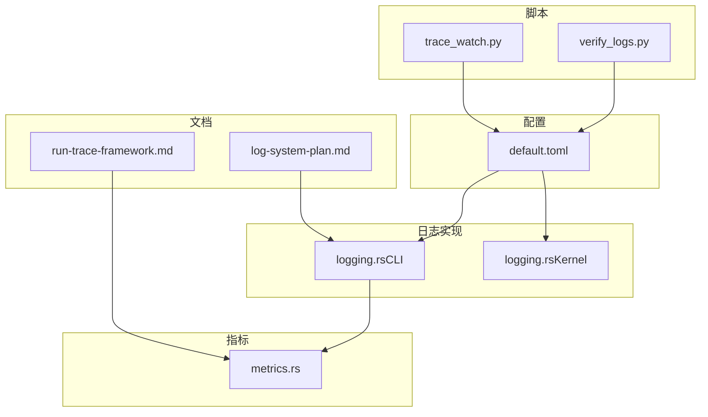
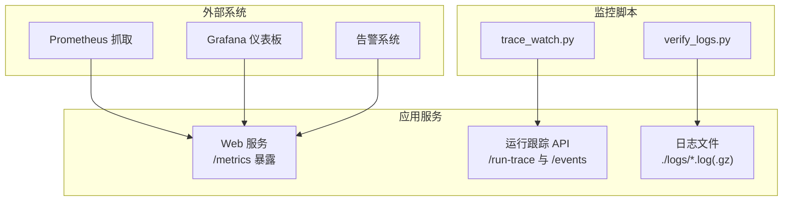
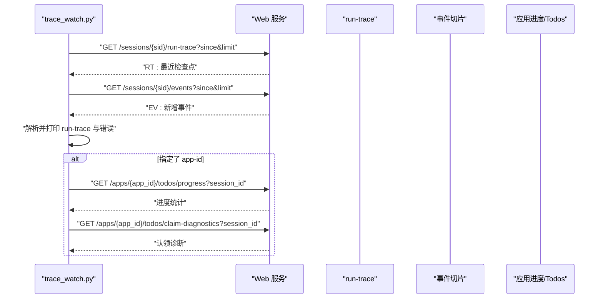
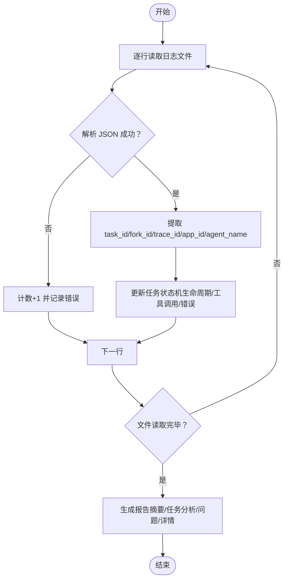
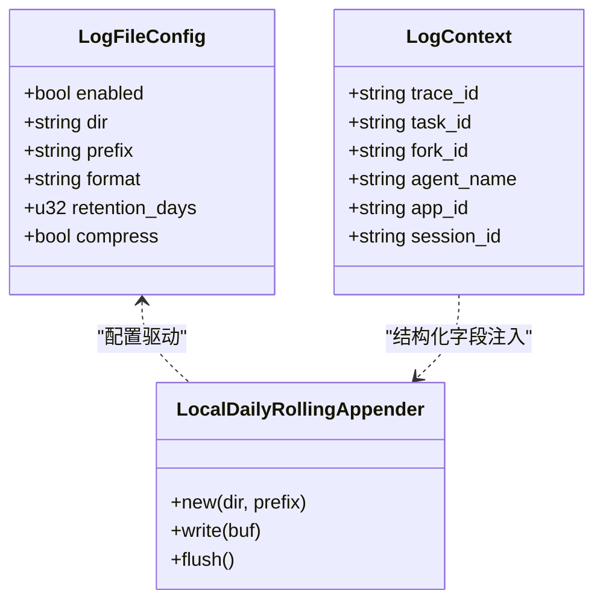
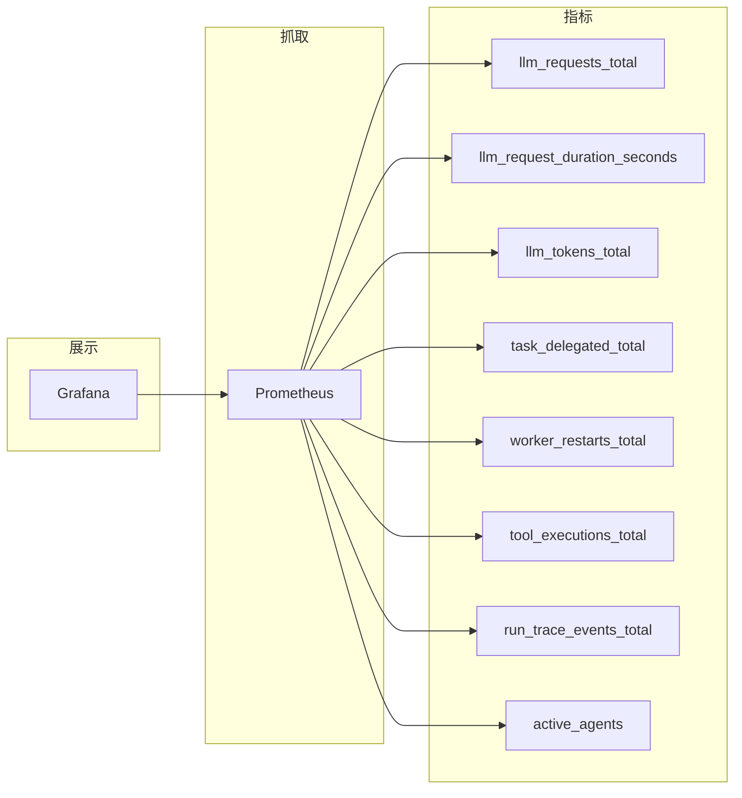
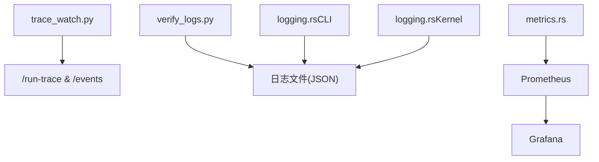

# 监控与日志

<cite>
**本文引用的文件**
- [trace_watch.py](file://macaca/scripts/trace_watch.py)
- [verify_logs.py](file://macaca/scripts/verify_logs.py)
- [log-system-plan.md](file://macaca/docs/log-system-plan.md)
- [run-trace-framework.md](file://macaca/docs/run-trace-framework.md)
- [default.toml](file://macaca/config/default.toml)
- [metrics.rs](file://macaca/crates/macaca-web/src/metrics.rs)
- [logging.rs（CLI）](file://macaca/crates/macaca-cli/src/logging.rs)
- [logging.rs（Kernel）](file://macaca/crates/macaca-kernel/src/logging.rs)
</cite>

## 目录
1. [简介](#简介)
2. [项目结构](#项目结构)
3. [核心组件](#核心组件)
4. [架构总览](#架构总览)
5. [组件详解](#组件详解)
6. [依赖关系分析](#依赖关系分析)
7. [性能考量](#性能考量)
8. [故障排查指南](#故障排查指南)
9. [结论](#结论)
10. [附录](#附录)

## 简介
本指南面向运维与开发团队，系统化地介绍本项目的监控与日志管理方案。内容覆盖：
- 监控指标采集与可视化配置（性能指标、业务指标、基础设施指标）
- 日志系统设计与落地（日志级别、文件轮转、集中化收集）
- 运行跟踪（run-trace）与 Playwright 测试记录的分析与利用
- 告警规则、通知渠道与故障自动恢复建议
- 监控仪表板搭建与维护

## 项目结构
围绕监控与日志的关键文件分布如下：
- 脚本层：trace_watch.py、verify_logs.py
- 文档层：log-system-plan.md、run-trace-framework.md
- 配置层：config/default.toml
- 指标层：crates/macaca-web/src/metrics.rs
- 日志实现层：crates/macaca-cli/src/logging.rs、crates/macaca-kernel/src/logging.rs

图表来源
- [trace_watch.py:1-199](file://macaca/scripts/trace_watch.py#L1-L199)
- [verify_logs.py:1-476](file://macaca/scripts/verify_logs.py#L1-L476)
- [log-system-plan.md:1-107](file://macaca/docs/log-system-plan.md#L1-L107)
- [run-trace-framework.md:1-65](file://macaca/docs/run-trace-framework.md#L1-L65)
- [default.toml:106-119](file://macaca/config/default.toml#L106-L119)
- [metrics.rs:1-142](file://macaca/crates/macaca-web/src/metrics.rs#L1-L142)
- [logging.rs（CLI）:1-334](file://macaca/crates/macaca-cli/src/logging.rs#L1-L334)
- [logging.rs（Kernel）:1-458](file://macaca/crates/macaca-kernel/src/logging.rs#L1-L458)

章节来源
- [default.toml:106-119](file://macaca/config/default.toml#L106-L119)
- [log-system-plan.md:1-107](file://macaca/docs/log-system-plan.md#L1-L107)
- [run-trace-framework.md:1-65](file://macaca/docs/run-trace-framework.md#L1-L65)
- [metrics.rs:1-142](file://macaca/crates/macaca-web/src/metrics.rs#L1-L142)
- [logging.rs（CLI）:1-334](file://macaca/crates/macaca-cli/src/logging.rs#L1-L334)
- [logging.rs（Kernel）:1-458](file://macaca/crates/macaca-kernel/src/logging.rs#L1-L458)

## 核心组件
- 运行跟踪（run-trace）与事件增量轮询：用于定位卡点、检测停滞与失败，支撑实时可观测性。
- 日志系统：支持文件输出、按日滚动、压缩与清理，以及统一追踪字段注入。
- 指标体系：Prometheus 指标暴露，涵盖 LLM 请求、工具执行、代理活跃度、运行跟踪检查点等。
- Playwright 测试记录：以 YAML 形式记录页面交互序列，可用于回归与稳定性分析。

章节来源
- [run-trace-framework.md:1-65](file://macaca/docs/run-trace-framework.md#L1-L65)
- [log-system-plan.md:1-107](file://macaca/docs/log-system-plan.md#L1-L107)
- [metrics.rs:1-142](file://macaca/crates/macaca-web/src/metrics.rs#L1-L142)
- [.playwright-mcp 目录](file://.playwright-mcp)

## 架构总览
下图展示监控与日志在系统中的角色与交互：

图表来源
- [metrics.rs:131-142](file://macaca/crates/macaca-web/src/metrics.rs#L131-L142)
- [run-trace-framework.md:52-56](file://macaca/docs/run-trace-framework.md#L52-L56)
- [logging.rs（CLI）:111-191](file://macaca/crates/macaca-cli/src/logging.rs#L111-L191)

## 组件详解

### 运行跟踪与监控脚本：trace_watch.py
- 功能要点
  - 轮询会话的 run-trace 与增量事件，打印最近检查点与错误片段
  - 支持截止时间、停滞检测、任务进度与“认领诊断”查询
  - 可选退出条件（如任务失败即退出），便于 CI/自动化流程集成
- 关键行为
  - 通过基础地址与会话 ID 获取 run-trace 与事件
  - 从事件切片中筛选工具错误、委派错误与错误事件
  - 可选查询应用级任务进度与“认领诊断”，帮助定位卡点
- 使用场景
  - 长流程观测、CI 集成、故障根因定位

图表来源
- [trace_watch.py:35-194](file://macaca/scripts/trace_watch.py#L35-L194)
- [run-trace-framework.md:52-60](file://macaca/docs/run-trace-framework.md#L52-L60)

章节来源
- [trace_watch.py:1-199](file://macaca/scripts/trace_watch.py#L1-L199)
- [run-trace-framework.md:52-60](file://macaca/docs/run-trace-framework.md#L52-L60)

### 日志完整性验证：verify_logs.py
- 功能要点
  - 验证委托任务生命周期完整性（创建、开始、Fork 生命周期、完成/失败）
  - 校验关键字段（trace_id、task_id、agent_name 等）是否存在
  - 统计工具调用次数与错误
- 核心流程
  - 解析 JSON 行日志，提取任务/Fork/Trace/应用/代理等标识
  - 构建任务生命周期状态机，识别缺失事件
  - 生成报告并可输出 JSON，便于自动化集成

图表来源
- [verify_logs.py:213-306](file://macaca/scripts/verify_logs.py#L213-L306)
- [verify_logs.py:328-407](file://macaca/scripts/verify_logs.py#L328-L407)

章节来源
- [verify_logs.py:1-476](file://macaca/scripts/verify_logs.py#L1-L476)

### 日志系统设计与实现
- 设计目标
  - 配置化日志级别与文件输出
  - 按日滚动、压缩与清理
  - 控制台与文件双通道输出，便于本地调试与生产归档
- 关键实现
  - CLI 日志模块负责：创建目录、每日滚动文件、非阻塞写入、压缩与清理
  - Kernel 日志模块负责：统一追踪字段（trace_id、task_id、fork_id、agent_name、app_id、session_id）、敏感信息脱敏、Hook/工具/状态转换等结构化日志
- 配置入口
  - 观测性配置段包含日志开关、目录、前缀、格式、保留天数、压缩等

图表来源
- [log-system-plan.md:14-38](file://macaca/docs/log-system-plan.md#L14-L38)
- [logging.rs（CLI）:31-88](file://macaca/crates/macaca-cli/src/logging.rs#L31-L88)
- [logging.rs（Kernel）:14-79](file://macaca/crates/macaca-kernel/src/logging.rs#L14-L79)

章节来源
- [log-system-plan.md:1-107](file://macaca/docs/log-system-plan.md#L1-L107)
- [logging.rs（CLI）:111-191](file://macaca/crates/macaca-cli/src/logging.rs#L111-L191)
- [logging.rs（Kernel）:14-79](file://macaca/crates/macaca-kernel/src/logging.rs#L14-L79)

### 指标体系与可视化
- 指标类型
  - LLM 请求总量、耗时直方图、令牌用量
  - 任务委派总数、Worker 重启次数
  - 工具执行总数（含成功/失败）
  - 运行跟踪检查点（按 phase/status）
  - 活跃代理数
- 暴露方式
  - /metrics 文本格式，供 Prometheus 抓取
- 可视化建议
  - Grafana 中创建面板：请求速率/错误率、令牌用量趋势、工具成功率、活跃代理数、run-trace phase 分布

图表来源
- [metrics.rs:16-80](file://macaca/crates/macaca-web/src/metrics.rs#L16-L80)
- [metrics.rs:131-142](file://macaca/crates/macaca-web/src/metrics.rs#L131-L142)

章节来源
- [metrics.rs:1-142](file://macaca/crates/macaca-web/src/metrics.rs#L1-L142)

### Playwright 测试记录的分析与利用
- 记录形式
  - .playwright-mcp 目录下的 page-*.yml 文件，记录页面交互序列
- 利用建议
  - 回归测试：基于历史记录快速验证界面变更
  - 稳定性分析：对比不同时间点的交互序列，识别异常波动
  - 自动化：结合 CI 在 PR 阶段执行 Playwright 测试

章节来源
- [.playwright-mcp 目录](file://.playwright-mcp)

## 依赖关系分析
- trace_watch.py 依赖 Web 服务提供的 run-trace 与事件 API
- verify_logs.py 依赖日志文件格式与字段结构
- 日志系统由 CLI 模块负责文件输出与清理，Kernel 模块负责结构化字段与脱敏
- 指标由 Web 服务统一暴露，供 Prometheus 抓取

图表来源
- [trace_watch.py:87-89](file://macaca/scripts/trace_watch.py#L87-L89)
- [verify_logs.py:219-235](file://macaca/scripts/verify_logs.py#L219-L235)
- [logging.rs（CLI）:111-191](file://macaca/crates/macaca-cli/src/logging.rs#L111-L191)
- [logging.rs（Kernel）:14-79](file://macaca/crates/macaca-kernel/src/logging.rs#L14-L79)
- [metrics.rs:131-142](file://macaca/crates/macaca-web/src/metrics.rs#L131-L142)

章节来源
- [trace_watch.py:1-199](file://macaca/scripts/trace_watch.py#L1-L199)
- [verify_logs.py:1-476](file://macaca/scripts/verify_logs.py#L1-L476)
- [logging.rs（CLI）:1-334](file://macaca/crates/macaca-cli/src/logging.rs#L1-L334)
- [logging.rs（Kernel）:1-458](file://macaca/crates/macaca-kernel/src/logging.rs#L1-L458)
- [metrics.rs:1-142](file://macaca/crates/macaca-web/src/metrics.rs#L1-L142)

## 性能考量
- 日志写入
  - 使用非阻塞写入与每日滚动，避免 IO 阻塞
  - 压缩旧日志减少磁盘占用
- 指标暴露
  - /metrics 无认证，抓取端需网络隔离或反向代理保护
- 运行跟踪
  - 轮询间隔与截止时间合理配置，避免过度拉取

章节来源
- [logging.rs（CLI）:128-191](file://macaca/crates/macaca-cli/src/logging.rs#L128-L191)
- [metrics.rs:131-142](file://macaca/crates/macaca-web/src/metrics.rs#L131-L142)
- [trace_watch.py:38-52](file://macaca/scripts/trace_watch.py#L38-L52)

## 故障排查指南
- 运行跟踪卡顿
  - 使用 trace_watch.py 设置停滞秒数与截止秒数，定位最新 run-trace 检查点与错误事件
  - 若指定 app-id，结合任务进度与“认领诊断”判断是否卡在待认领任务
- 日志完整性问题
  - 使用 verify_logs.py 对指定日志文件进行生命周期与字段校验，生成报告并导出 JSON
  - 关注 Fork 生命周期完整性（创建->挂起->恢复）
- 日志文件异常
  - 检查配置段 observability.log_file 的 enabled/dir/prefix/format/retention_days/compress
  - 查看 CLI 日志模块的滚动与清理逻辑是否生效

章节来源
- [trace_watch.py:77-108](file://macaca/scripts/trace_watch.py#L77-L108)
- [trace_watch.py:119-167](file://macaca/scripts/trace_watch.py#L119-L167)
- [verify_logs.py:213-306](file://macaca/scripts/verify_logs.py#L213-L306)
- [default.toml:111-119](file://macaca/config/default.toml#L111-L119)
- [logging.rs（CLI）:214-282](file://macaca/crates/macaca-cli/src/logging.rs#L214-L282)

## 结论
本项目提供了完善的监控与日志基础设施：以 run-trace 为核心的运行跟踪、以 Prometheus 为基础的指标体系、以结构化日志与文件轮转为核心的日志系统，并辅以 trace_watch.py 与 verify_logs.py 两大实用脚本。结合 Playwright 测试记录，可形成从指标、日志到测试的全链路可观测性闭环。

## 附录

### 配置参考
- 观测性配置段（日志与追踪）
  - 参考路径：config/default.toml
  - 关键键值：observability.log_level、tracing_enabled、otlp_endpoint、observability.log_file.*
- 日志文件配置结构
  - 参考路径：docs/log-system-plan.md
  - 关键字段：enabled、dir、prefix、format、retention_days、compress

章节来源
- [default.toml:106-119](file://macaca/config/default.toml#L106-L119)
- [log-system-plan.md:14-38](file://macaca/docs/log-system-plan.md#L14-L38)