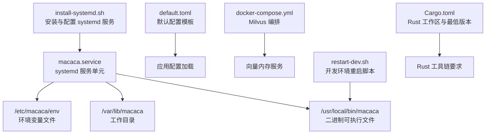
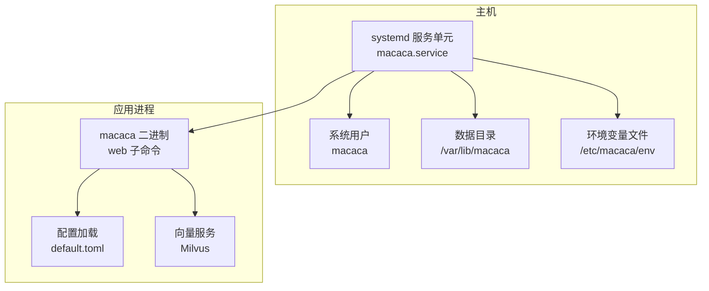
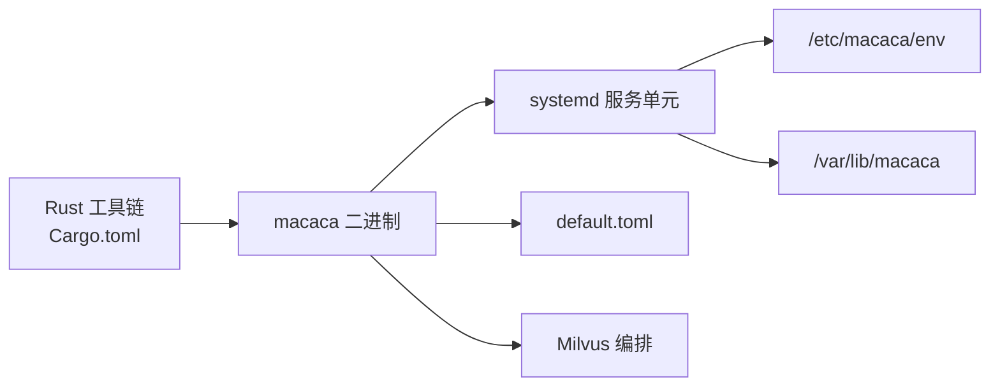

# 系统部署

<cite>
**本文引用的文件**
- [install-systemd.sh](file://macaca/deploy/install-systemd.sh)
- [macaca.service](file://macaca/deploy/macaca.service)
- [Cargo.toml](file://macaca/Cargo.toml)
- [default.toml](file://macaca/config/default.toml)
- [docker-compose.yml](file://macaca/infra/milvus/docker-compose.yml)
- [restart-dev.sh](file://scripts/restart-dev.sh)
- [README.md](file://macaca/README.md)
- [SYSTEM_AUDIT.md](file://macaca/docs/SYSTEM_AUDIT.md)
</cite>

## 目录
1. [简介](#简介)
2. [项目结构](#项目结构)
3. [核心组件](#核心组件)
4. [架构总览](#架构总览)
5. [详细组件分析](#详细组件分析)
6. [依赖分析](#依赖分析)
7. [性能考虑](#性能考虑)
8. [故障排查指南](#故障排查指南)
9. [结论](#结论)
10. [附录](#附录)

## 简介
本指南面向生产环境部署，覆盖系统要求与硬件配置、依赖安装、Rust 工具链与系统库准备、第三方组件（如 Milvus 向量库）部署、systemd 服务安装与配置、用户与目录权限、环境变量与配置文件、服务启停与日志查看，以及常见问题排查。文中所有步骤均基于仓库内现有脚本与配置文件进行整理与说明。

## 项目结构
与部署直接相关的核心文件位于以下位置：
- systemd 安装与服务文件：macaca/deploy/install-systemd.sh、macaca/deploy/macaca.service
- 默认配置模板：macaca/config/default.toml
- 向量数据库（Milvus）编排：macaca/infra/milvus/docker-compose.yml
- 开发环境一键重启脚本：scripts/restart-dev.sh
- 工作区与版本信息：macaca/Cargo.toml
- 项目说明：macaca/README.md
- 系统审计与模块关系：macaca/docs/SYSTEM_AUDIT.md

图表来源
- [install-systemd.sh:1-60](file://macaca/deploy/install-systemd.sh#L1-L60)
- [macaca.service:1-38](file://macaca/deploy/macaca.service#L1-L38)
- [default.toml:1-119](file://macaca/config/default.toml#L1-L119)
- [docker-compose.yml:1-69](file://macaca/infra/milvus/docker-compose.yml#L1-L69)
- [restart-dev.sh:1-80](file://scripts/restart-dev.sh#L1-L80)
- [Cargo.toml:1-90](file://macaca/Cargo.toml#L1-L90)

章节来源
- [README.md:1-29](file://macaca/README.md#L1-L29)
- [Cargo.toml:1-90](file://macaca/Cargo.toml#L1-L90)

## 核心组件
- systemd 服务单元：定义服务类型、执行命令、工作目录、资源限制、安全策略、重启行为与健康检查参数。
- 安装脚本：自动化创建系统用户、目录、复制服务文件、写入默认环境变量文件、更新 ExecStart 路径并启用服务。
- 默认配置模板：集中管理 LLM 提供商、内存与向量、持久化、网关、可观测性等关键参数。
- Milvus 编排：提供向量检索所需的 Milvus、Etcd、MinIO 服务，便于本地或测试环境快速部署。
- 开发重启脚本：演示如何以守护进程方式启动后端与前端，便于理解生产日志与端口管理。

章节来源
- [macaca.service:1-38](file://macaca/deploy/macaca.service#L1-L38)
- [install-systemd.sh:1-60](file://macaca/deploy/install-systemd.sh#L1-L60)
- [default.toml:1-119](file://macaca/config/default.toml#L1-L119)
- [docker-compose.yml:1-69](file://macaca/infra/milvus/docker-compose.yml#L1-L69)
- [restart-dev.sh:1-80](file://scripts/restart-dev.sh#L1-L80)

## 架构总览
下图展示生产部署中的关键组件与交互：systemd 管理服务生命周期，服务进程加载配置并连接 Milvus，同时对外提供 Web API。

图表来源
- [macaca.service:1-38](file://macaca/deploy/macaca.service#L1-L38)
- [install-systemd.sh:1-60](file://macaca/deploy/install-systemd.sh#L1-L60)
- [default.toml:1-119](file://macaca/config/default.toml#L1-L119)
- [docker-compose.yml:1-69](file://macaca/infra/milvus/docker-compose.yml#L1-L69)

## 详细组件分析

### systemd 服务配置与安装脚本
- 用户与目录
  - 自动创建系统用户与家目录，确保服务以非特权身份运行。
  - 创建工作目录与配置目录，设置属主为服务用户。
- 环境变量
  - 若不存在，写入默认环境文件，包含日志级别与示例 API Key 注释。
  - 文件权限严格控制，避免敏感信息泄露。
- 服务文件安装与路径替换
  - 复制服务单元至系统目录，动态替换可执行路径与工作目录。
  - 重载 systemd 并启用服务，使其随系统启动自启动。
- 常用命令
  - 启动、状态查询、停止、跟随日志输出。

章节来源
- [install-systemd.sh:1-60](file://macaca/deploy/install-systemd.sh#L1-L60)
- [macaca.service:1-38](file://macaca/deploy/macaca.service#L1-L38)

### 服务单元参数详解
- 执行与工作目录
  - Type=notify 支持 watchdog 心跳；ExecStart 指向 web 子命令；WorkingDirectory 指向数据目录。
- 重启策略
  - 常驻重启，带退避上限，保障异常退出后的恢复能力。
- 健康检查
  - WatchdogSec=30，若超过 30 秒无心跳，systemd 将强制重启。
- 环境变量
  - EnvironmentFile 引入外部 env 文件；Environment 设置默认日志级别。
- 资源限制
  - 文件句柄上限、内存上限，避免单进程占用过多资源。
- 安全加固
  - NoNewPrivileges、ProtectSystem、ProtectHome、Read/WritePaths 等，最小权限原则。
- 用户与组
  - 以服务用户运行，隔离系统其他用户。

章节来源
- [macaca.service:1-38](file://macaca/deploy/macaca.service#L1-L38)

### 配置文件与参数调整
- LLM 提供商与速率限制
  - 可配置多个提供商（如 OpenAI、Anthropic、DashScope、MiniMax、OpenRouter 等），设置默认模型与请求速率。
- 内存与向量
  - 会话 TTL、文件存储路径、向量后端（Milvus）、嵌入模型与密钥、压缩策略。
- IPC 与 NATS
  - NATS 地址、自动启动、重连策略。
- 持久化
  - 存储引擎（redb）、数据目录、快照间隔。
- 网关
  - Telegram、Discord 机器人开关与令牌环境变量。
- 可观测性
  - 日志级别、OTLP 上报、文件日志目录、前缀、格式、保留天数与压缩。

章节来源
- [default.toml:1-119](file://macaca/config/default.toml#L1-L119)

### Milvus 向量服务部署
- 组件
  - etcd：键值存储与分布式协调。
  - minio：对象存储，作为 Milvus 的存储后端。
  - milvus-standalone：向量检索服务。
- 端口映射
  - Milvus 默认监听 19530/TCP；健康检查端口 9091。
- 数据卷
  - etcd、minio、milvus 数据目录可挂载到宿主机，便于持久化与备份。
- 启动
  - 使用 docker-compose 启动，健康检查失败时可重试。

章节来源
- [docker-compose.yml:1-69](file://macaca/infra/milvus/docker-compose.yml#L1-L69)

### 开发环境重启脚本（参考）
- 功能
  - 停止占用指定端口的进程，清理残留进程，然后以后台方式启动后端与前端。
- 适用场景
  - 本地开发验证部署流程与日志输出方式，便于理解生产日志路径与端口管理。

章节来源
- [restart-dev.sh:1-80](file://scripts/restart-dev.sh#L1-L80)

## 依赖分析
- Rust 工具链
  - 工作区最低版本要求与常用依赖（Tokio、Serde、Tracing、Clap 等）在工作区层面统一声明。
- 系统库与第三方
  - systemd 服务单元与安装脚本表明系统需支持 systemd、用户管理与文件权限控制。
  - Milvus 编排依赖 Docker Compose，需在部署节点安装相应容器运行时与编排工具。
- 组件耦合
  - 服务单元与安装脚本耦合度低，便于独立维护；配置文件集中管理，减少散落配置带来的运维复杂度。

图表来源
- [Cargo.toml:1-90](file://macaca/Cargo.toml#L1-L90)
- [install-systemd.sh:1-60](file://macaca/deploy/install-systemd.sh#L1-L60)
- [macaca.service:1-38](file://macaca/deploy/macaca.service#L1-L38)
- [default.toml:1-119](file://macaca/config/default.toml#L1-L119)
- [docker-compose.yml:1-69](file://macaca/infra/milvus/docker-compose.yml#L1-L69)

章节来源
- [Cargo.toml:1-90](file://macaca/Cargo.toml#L1-L90)
- [install-systemd.sh:1-60](file://macaca/deploy/install-systemd.sh#L1-L60)
- [macaca.service:1-38](file://macaca/deploy/macaca.service#L1-L38)
- [default.toml:1-119](file://macaca/config/default.toml#L1-L119)
- [docker-compose.yml:1-69](file://macaca/infra/milvus/docker-compose.yml#L1-L69)

## 性能考虑
- 资源限制
  - MemoryMax 与 LimitNOFILE 有助于防止资源争用，建议根据并发任务量与内存占用调优。
- 重启策略
  - RestartSec 与 RestartMaxDelaySec 控制重启退避，避免雪崩效应。
- Watchdog
  - WatchdogSec=30 要求应用定期发送心跳，否则 systemd 将强制重启，确保服务可用性。
- 日志与可观测性
  - 配置文件中开启文件日志与 JSON 格式，便于生产日志收集与分析。
- 向量服务
  - Milvus 的 etcd 与 MinIO 需要合理容量与磁盘 IO，建议与应用服务分离部署以获得更好稳定性。

章节来源
- [macaca.service:1-38](file://macaca/deploy/macaca.service#L1-L38)
- [default.toml:106-119](file://macaca/config/default.toml#L106-L119)
- [docker-compose.yml:1-69](file://macaca/infra/milvus/docker-compose.yml#L1-L69)

## 故障排查指南
- 服务无法启动
  - 检查 ExecStart 路径是否正确（安装脚本会替换为实际二进制路径），确认二进制可执行且具备权限。
  - 查看服务状态与日志：使用 systemctl status 与 journalctl -u macaca -f。
- 权限与目录问题
  - 确认 /var/lib/macaca 属主为服务用户，/etc/macaca/env 权限为 600。
- 环境变量未生效
  - 检查 /etc/macaca/env 是否存在且包含所需键值；确认 EnvironmentFile 参数未被注释。
- 端口冲突
  - 默认 Web 端口为 3001（开发脚本示例），生产中请根据实际端口调整；使用 lsof 或 netstat 检查占用。
- Milvus 无法访问
  - 检查 Milvus 服务健康状态与端口映射；确认 Milvus URL 与 default.toml 中配置一致。
- 日志定位
  - systemd 日志：journalctl -u macaca -f
  - 文件日志：default.toml 中 log_file.dir 指定目录下的 JSON 日志

章节来源
- [install-systemd.sh:1-60](file://macaca/deploy/install-systemd.sh#L1-L60)
- [macaca.service:1-38](file://macaca/deploy/macaca.service#L1-L38)
- [default.toml:1-119](file://macaca/config/default.toml#L1-L119)
- [restart-dev.sh:1-80](file://scripts/restart-dev.sh#L1-L80)

## 结论
通过 systemd 服务单元与安装脚本，可将 Macaca 以标准方式部署于生产环境；配合默认配置模板与 Milvus 编排，可快速完成从二进制到向量服务的完整链路部署。建议在上线前完成资源限制与安全加固配置，并建立完善的日志与监控体系。

## 附录

### 生产环境系统要求与硬件配置
- CPU
  - 建议至少 2 核，根据并发任务与 LLM 请求量适当增加。
- 内存
  - 建议 4GB 以上，结合 MemoryMax 与实际负载调优。
- 存储
  - 二进制与日志目录建议独立分区；Milvus 数据卷按向量规模预留空间。
- 网络
  - 服务端口 3001（默认）与 Milvus 19530/9091 需开放；如使用网关（Telegram/Discord），需配置相应令牌与端口。

章节来源
- [macaca.service:22-24](file://macaca/deploy/macaca.service#L22-L24)
- [default.toml:93-105](file://macaca/config/default.toml#L93-L105)
- [docker-compose.yml:60-62](file://macaca/infra/milvus/docker-compose.yml#L60-L62)

### 依赖安装流程（Rust 工具链、系统库、第三方）
- Rust 工具链
  - 工作区最低版本要求与常用依赖在工作区层面声明，建议使用 rustup 安装与管理工具链。
- 系统库与包管理
  - systemd、用户与目录管理、文件权限控制由安装脚本自动处理。
- 第三方依赖
  - Milvus 通过 docker-compose 启动；NATS 由配置文件指定地址。

章节来源
- [Cargo.toml:1-90](file://macaca/Cargo.toml#L1-L90)
- [install-systemd.sh:1-60](file://macaca/deploy/install-systemd.sh#L1-L60)
- [docker-compose.yml:1-69](file://macaca/infra/milvus/docker-compose.yml#L1-L69)

### systemd 服务配置与安装脚本使用
- 安装步骤
  - 运行安装脚本，自动创建用户、目录、复制服务文件、写入默认环境变量、替换路径并启用服务。
- 关键参数
  - 可通过环境变量覆盖用户、数据目录与二进制路径。
- 常用操作
  - 启动、停止、重启、查看状态与日志。

章节来源
- [install-systemd.sh:1-60](file://macaca/deploy/install-systemd.sh#L1-L60)
- [macaca.service:1-38](file://macaca/deploy/macaca.service#L1-L38)

### 服务启动、停止、重启与日志查看
- 启动：systemctl start macaca
- 停止：systemctl stop macaca
- 重启：systemctl restart macaca
- 状态：systemctl status macaca
- 日志：journalctl -u macaca -f

章节来源
- [install-systemd.sh:50-55](file://macaca/deploy/install-systemd.sh#L50-L55)

### 配置文件与参数调整要点
- LLM 提供商与密钥
  - 在 /etc/macaca/env 或配置文件中设置 API Key；注意敏感信息权限。
- 向量服务
  - 确保 Milvus URL 与端口与编排一致。
- 日志与可观测性
  - 启用文件日志与 JSON 格式，便于采集与分析。

章节来源
- [default.toml:1-119](file://macaca/config/default.toml#L1-L119)
- [docker-compose.yml:1-69](file://macaca/infra/milvus/docker-compose.yml#L1-L69)

### 与系统审计的关系
- 模块职责与耦合现状
  - 审计报告指出前端路由文件过大、God Object 等问题，但不影响 systemd 部署流程。
- 部署侧关注点
  - 服务单元、配置文件与 Milvus 编排是当前部署的直接依据。

章节来源
- [SYSTEM_AUDIT.md:131-133](file://macaca/docs/SYSTEM_AUDIT.md#L131-L133)
- [SYSTEM_AUDIT.md:161-175](file://macaca/docs/SYSTEM_AUDIT.md#L161-L175)