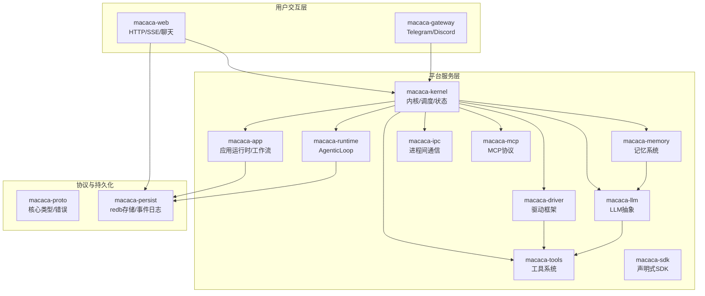
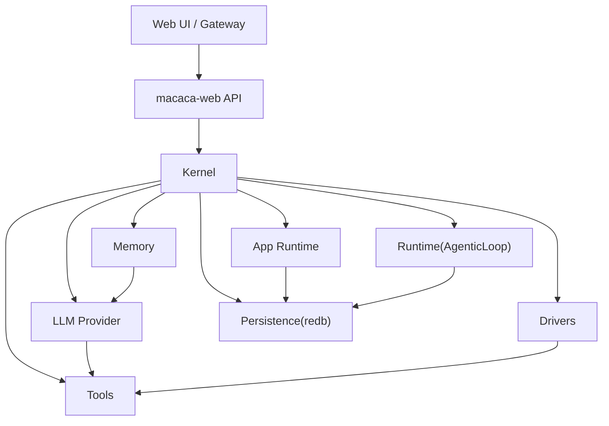
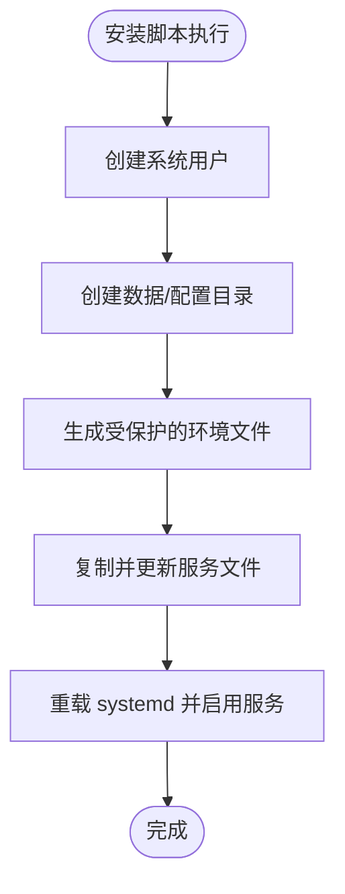
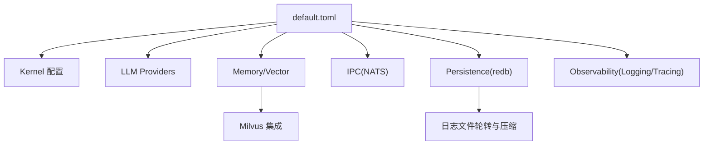
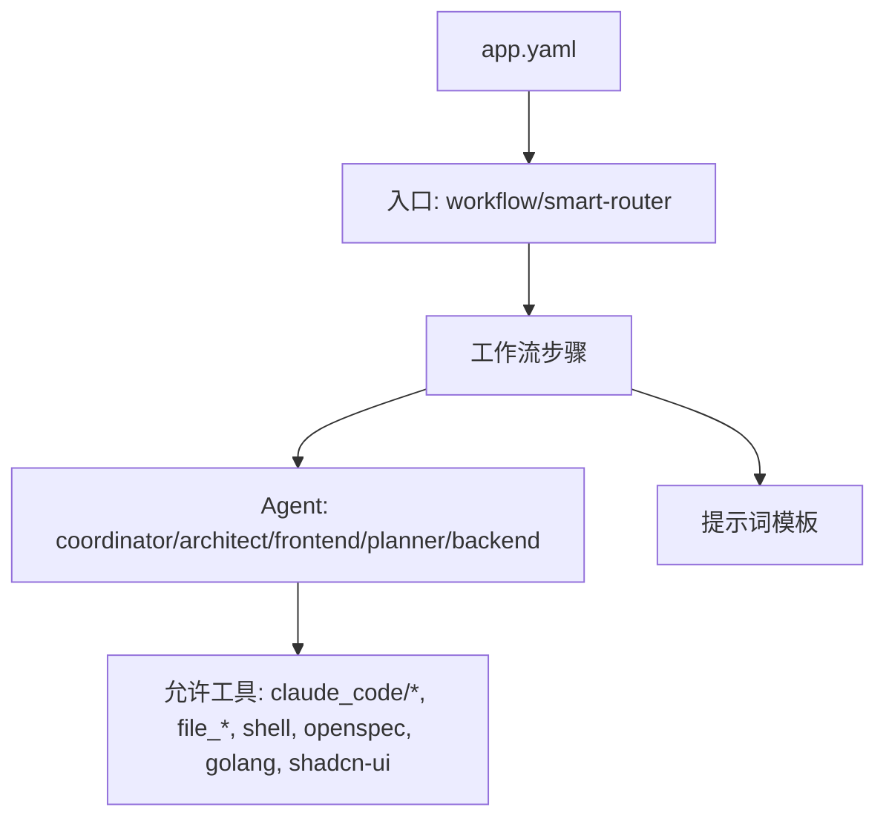
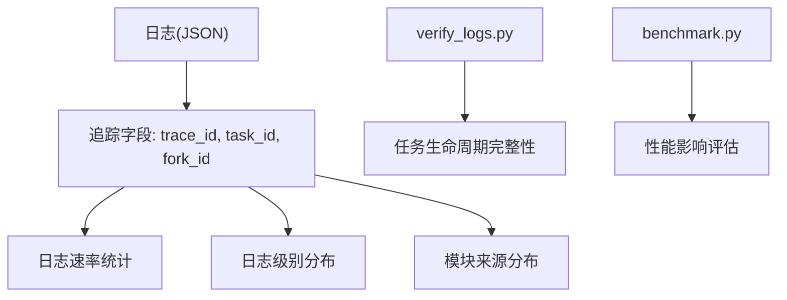
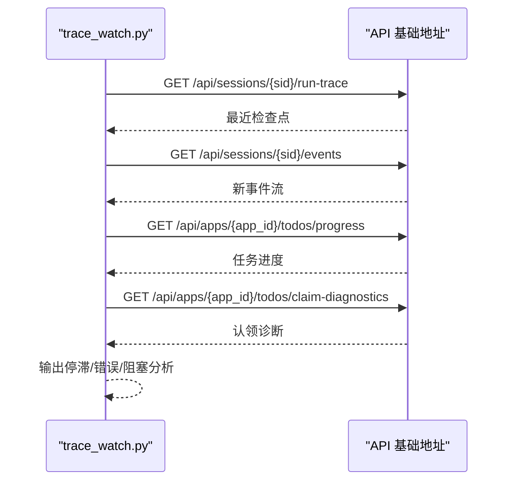
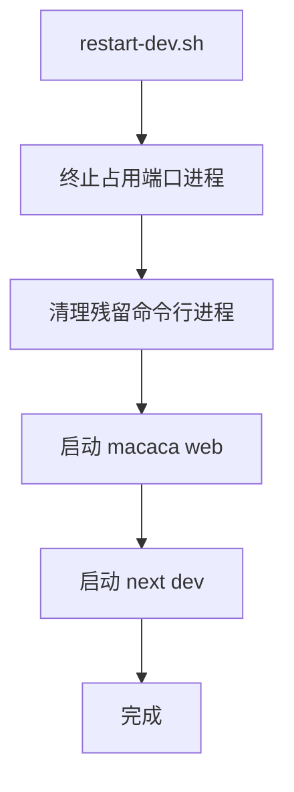
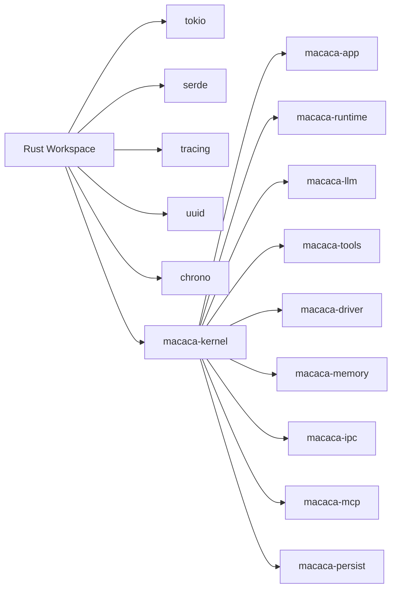
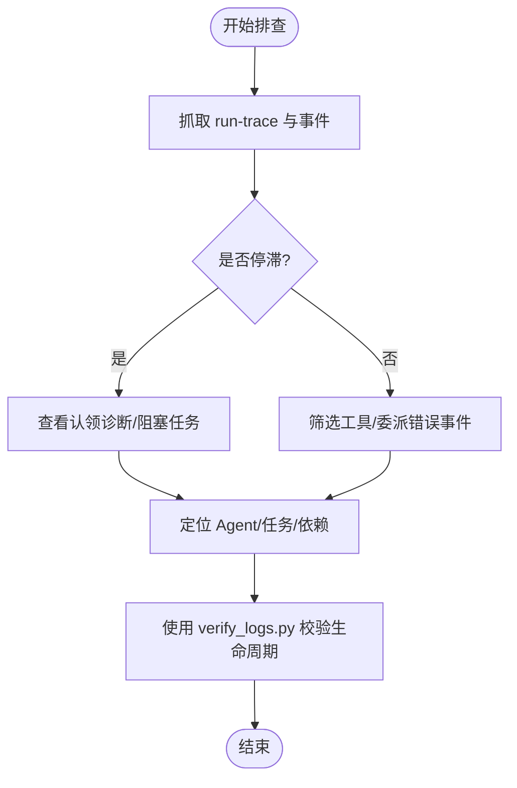

# 维护与升级

<cite>
**本文引用的文件**
- [README.md](file://macaca/README.md)
- [Cargo.toml](file://macaca/Cargo.toml)
- [ARCHITECTURE-v2.md](file://macaca/ARCHITECTURE-v2.md)
- [SYSTEM_AUDIT.md](file://macaca/docs/SYSTEM_AUDIT.md)
- [install-systemd.sh](file://macaca/deploy/install-systemd.sh)
- [macaca.service](file://macaca/deploy/macaca.service)
- [default.toml](file://macaca/config/default.toml)
- [docker-compose.yml](file://macaca/infra/milvus/docker-compose.yml)
- [benchmark.py](file://macaca/scripts/benchmark.py)
- [trace_watch.py](file://macaca/scripts/trace_watch.py)
- [verify_logs.py](file://macaca/scripts/verify_logs.py)
- [restart-dev.sh](file://scripts/restart-dev.sh)
- [app.yaml](file://macaca/examples/apps/fullstack-autodev/app.yaml)
</cite>

## 目录
1. [简介](#简介)
2. [项目结构](#项目结构)
3. [核心组件](#核心组件)
4. [架构总览](#架构总览)
5. [详细组件分析](#详细组件分析)
6. [依赖分析](#依赖分析)
7. [性能考量](#性能考量)
8. [故障排查指南](#故障排查指南)
9. [结论](#结论)
10. [附录](#附录)

## 简介
本指南面向系统运维与平台工程团队，提供基于仓库现有实现的系统维护与升级实践蓝图。内容涵盖日常维护（系统清理、缓存管理、数据库维护、性能优化）、升级策略（滚动升级、蓝绿部署、回滚机制）、备份与恢复（数据与配置）、安全加固（系统更新、漏洞修复、访问控制），以及维护窗口规划与业务连续性保障。

## 项目结构
仓库采用多 crate 的 Rust 工作区组织，核心模块围绕“协议层—内核层—平台服务层—用户交互层”分层设计，配合声明式应用与多平台网关，形成可插拔、可观测、可扩展的 Agent OS。

图表来源
- [ARCHITECTURE-v2.md:16-275](file://macaca/ARCHITECTURE-v2.md#L16-L275)
- [Cargo.toml:1-90](file://macaca/Cargo.toml#L1-L90)

章节来源
- [README.md:1-29](file://macaca/README.md#L1-L29)
- [Cargo.toml:1-90](file://macaca/Cargo.toml#L1-L90)
- [ARCHITECTURE-v2.md:16-275](file://macaca/ARCHITECTURE-v2.md#L16-L275)

## 核心组件
- 协议与类型：统一的任务、Agent、内存等核心类型与错误定义，确保跨模块契约一致。
- 内核与调度：集中式协调、Agent 注册与状态追踪、任务调度与负载均衡。
- 应用运行时：应用发现、加载、生命周期管理与工作流引擎。
- Agentic 循环：LLM 调用、工具执行、状态反馈的闭环执行。
- 工具与驱动：统一工具接口与多种驱动（Shell/Filesystem/Claude Code 等）。
- 记忆系统：会话级短期记忆、文件级长期存储、向量检索三层架构。
- LLM 抽象：多提供商路由、速率限制、成本估算与降级策略。
- IPC 与 MCP：事件总线、Agent 间通信与 MCP 工具桥接。
- 网关：Telegram/Discord 等 IM 平台接入。
- 持久化：redb KV 存储与事件日志，支持快照与审计。

章节来源
- [ARCHITECTURE-v2.md:567-639](file://macaca/ARCHITECTURE-v2.md#L567-L639)
- [SYSTEM_AUDIT.md:38-122](file://macaca/docs/SYSTEM_AUDIT.md#L38-L122)

## 架构总览
系统采用“声明式应用 + Agent 协作 + 多平台接入”的整体架构。Web 与 Gateway 作为入口，经由 Kernel 调度至 App/Runtime 执行，LLM/Tools/Memory/IPC/MCP 提供能力支撑，持久化层保障可观测与可恢复。

图表来源
- [ARCHITECTURE-v2.md:28-110](file://macaca/ARCHITECTURE-v2.md#L28-L110)

章节来源
- [ARCHITECTURE-v2.md:28-110](file://macaca/ARCHITECTURE-v2.md#L28-L110)

## 详细组件分析

### 系统守护与部署（systemd）
- 通过安装脚本创建专用用户与数据目录，复制服务文件并按需替换可执行路径与工作目录。
- systemd 服务配置包含重启策略、看门狗心跳、资源限制与安全加固选项。
- 环境变量文件用于集中配置日志级别与第三方 API 密钥。

图表来源
- [install-systemd.sh:1-60](file://macaca/deploy/install-systemd.sh#L1-L60)
- [macaca.service:1-38](file://macaca/deploy/macaca.service#L1-L38)

章节来源
- [install-systemd.sh:1-60](file://macaca/deploy/install-systemd.sh#L1-L60)
- [macaca.service:1-38](file://macaca/deploy/macaca.service#L1-L38)

### 配置与持久化
- 默认配置文件涵盖内核并发、LLM 提供商、内存与向量存储、IPC、工作空间、持久化与可观测性等。
- 持久化采用 redb，支持快照间隔；日志文件按天轮转与压缩，保留周期可配置。
- 向量存储使用 Milvus，配套 etcd 与 MinIO，便于本地快速搭建。

图表来源
- [default.toml:1-119](file://macaca/config/default.toml#L1-L119)
- [docker-compose.yml:1-69](file://macaca/infra/milvus/docker-compose.yml#L1-L69)

章节来源
- [default.toml:1-119](file://macaca/config/default.toml#L1-L119)
- [docker-compose.yml:1-69](file://macaca/infra/milvus/docker-compose.yml#L1-L69)

### 应用与工作流（声明式）
- 应用清单定义入口、工作流步骤、Agent 能力与权限、提示词模板与工具许可。
- 支持智能路由、SDD（规范驱动开发）、直接编码与聊天四种工作流模式。

图表来源
- [app.yaml:1-146](file://macaca/examples/apps/fullstack-autodev/app.yaml#L1-L146)

章节来源
- [app.yaml:1-146](file://macaca/examples/apps/fullstack-autodev/app.yaml#L1-L146)

### 日志与可观测性
- 日志系统支持 JSON 格式、带 trace_id/task_id/fork_id 等追踪字段，便于端到端链路分析。
- 提供性能测试脚本与日志完整性校验脚本，辅助评估日志开销与验证生命周期完整性。

图表来源
- [verify_logs.py:1-476](file://macaca/scripts/verify_logs.py#L1-L476)
- [benchmark.py:1-240](file://macaca/scripts/benchmark.py#L1-L240)

章节来源
- [verify_logs.py:1-476](file://macaca/scripts/verify_logs.py#L1-L476)
- [benchmark.py:1-240](file://macaca/scripts/benchmark.py#L1-L240)

### 会话与任务追踪
- 提供会话级 run-trace 与事件查询，支持检测停滞、超时与待认领任务诊断。
- 可结合应用 ID 查询任务进度与“认领诊断”，定位阻塞环节。

图表来源
- [trace_watch.py:1-199](file://macaca/scripts/trace_watch.py#L1-L199)

章节来源
- [trace_watch.py:1-199](file://macaca/scripts/trace_watch.py#L1-L199)

### 开发与本地重启
- 提供一键重启脚本，自动结束占用端口的进程并分别启动前端与后端服务，便于开发调试。

图表来源
- [restart-dev.sh:1-80](file://scripts/restart-dev.sh#L1-L80)

章节来源
- [restart-dev.sh:1-80](file://scripts/restart-dev.sh#L1-L80)

## 依赖分析
- 工作区统一依赖：Tokio 异步运行时、Serde 序列化、Tracing 日志链路、UUID/Chrono 等。
- 组件耦合：Web 与 Kernel 为关键耦合点；Kernel 与 App/Runtime/LLM/Tools/Memory/IPC/MCP 为松耦合的可插拔协作。
- 外部依赖：NATS（IPC）、Milvus（向量存储）、Redb（持久化）、LLM 提供商 API。

图表来源
- [Cargo.toml:33-90](file://macaca/Cargo.toml#L33-L90)

章节来源
- [Cargo.toml:1-90](file://macaca/Cargo.toml#L1-L90)

## 性能考量
- 日志开销评估：通过日志速率与结构完整性分析，确保日志系统对吞吐影响在可接受范围。
- 资源限制：systemd 服务配置了文件句柄上限与内存上限，避免资源泄漏导致的性能退化。
- 并发与超时：内核配置了心跳、Agent 超时与 LLM 速率限制，平衡吞吐与稳定性。
- 优化建议：优先保证日志字段完整性与 JSON 格式正确性；必要时调整日志级别与采样策略；监控 Milvus/IPC/NATS 健康状况。

章节来源
- [benchmark.py:1-240](file://macaca/scripts/benchmark.py#L1-L240)
- [default.toml:1-119](file://macaca/config/default.toml#L1-L119)
- [macaca.service:22-25](file://macaca/deploy/macaca.service#L22-L25)

## 故障排查指南
- 停滞检测：使用会话追踪脚本检测 run-trace 序列长时间不变，结合“认领诊断”定位阻塞 Agent 与待处理任务。
- 错误定位：从事件流中筛选工具错误、委派工具错误与错误事件，快速定位失败点。
- 生命周期验证：使用日志完整性脚本验证任务创建/开始/Fork 生命周期与完成/失败事件是否完整。
- 开发调试：使用一键重启脚本快速拉起前后端，核对端口占用与日志输出。

图表来源
- [trace_watch.py:77-194](file://macaca/scripts/trace_watch.py#L77-L194)
- [verify_logs.py:213-407](file://macaca/scripts/verify_logs.py#L213-L407)

章节来源
- [trace_watch.py:1-199](file://macaca/scripts/trace_watch.py#L1-L199)
- [verify_logs.py:1-476](file://macaca/scripts/verify_logs.py#L1-L476)

## 结论
本指南基于仓库现有实现，给出了可落地的维护与升级实践路径。通过 systemd 守护与配置管理、声明式应用与工作流、可观测性与日志体系、以及开发调试脚本，能够有效保障系统稳定性与可维护性。建议在生产环境中进一步完善蓝绿/滚动升级与回滚策略、灾备与备份恢复方案，并持续优化日志与性能指标。

## 附录

### 日常维护任务操作流程
- 系统清理
  - 清理过期日志：依据配置中的保留天数与压缩策略，定期清理旧日志文件。
  - 清理临时文件：检查 /tmp 与工作空间根目录，清理无用中间产物。
- 缓存管理
  - 记忆层缓存：关注会话 TTL 与文件存储路径，定期清理过期会话与大文件。
  - 向量存储：监控 Milvus 集群健康，按需执行 compaction 与备份。
- 数据库维护
  - redb 存储：根据快照间隔策略进行定期快照与校验，必要时重建索引。
  - 事件日志：定期巡检事件日志完整性，确保 trace_id/task_id 字段齐全。
- 性能优化
  - 调整日志级别与采样，评估对吞吐的影响。
  - 监控 LLM 调用速率与成本，优化模型选择与超时阈值。
  - 评估 IPC 与驱动调用延迟，优化工具执行超时与重试策略。

章节来源
- [default.toml:88-119](file://macaca/config/default.toml#L88-L119)
- [docker-compose.yml:1-69](file://macaca/infra/milvus/docker-compose.yml#L1-L69)

### 升级策略与版本管理
- 滚动升级
  - 通过 systemd 服务的重启策略与看门狗，实现平滑重启；升级前预热缓存与重建索引。
- 蓝绿部署
  - 使用双实例或多实例部署，切换流量至新实例，失败时回切；注意持久化与配置迁移。
- 回滚机制
  - 保持快照与配置备份，回滚时恢复 redb 快照与配置文件；验证日志完整性与会话恢复。

章节来源
- [install-systemd.sh:43-46](file://macaca/deploy/install-systemd.sh#L43-L46)
- [macaca.service:11-16](file://macaca/deploy/macaca.service#L11-L16)

### 备份与恢复
- 数据备份
  - redb 数据目录与事件日志目录定期打包备份；Milvus 数据卷与 etcd 快照纳入备份计划。
- 配置备份
  - default.toml 与各应用 app.yaml、personas/skills/prompts/workflows 等配置文件纳入版本管理。
- 灾难恢复
  - 制定恢复演练流程，验证从备份恢复到可用状态的时间与一致性；确保日志与追踪字段完整。

章节来源
- [default.toml:88-119](file://macaca/config/default.toml#L88-L119)
- [docker-compose.yml:52-66](file://macaca/infra/milvus/docker-compose.yml#L52-L66)
- [app.yaml:58-64](file://macaca/examples/apps/fullstack-autodev/app.yaml#L58-L64)

### 安全加固
- 系统更新与补丁
  - 定期更新操作系统与容器镜像，修补已知漏洞。
- 访问控制
  - 限制 systemd 服务用户权限，启用 NoNewPrivileges、ProtectSystem 等安全选项。
  - 网关侧配置机器人令牌与白名单，限制命令前缀与权限等级。
- 凭证管理
  - 使用环境变量注入 API 密钥，避免硬编码；定期轮换密钥并审计访问日志。

章节来源
- [macaca.service:26-30](file://macaca/deploy/macaca.service#L26-L30)
- [default.toml:93-105](file://macaca/config/default.toml#L93-L105)

### 维护窗口规划与业务连续性
- 维护窗口
  - 选择低峰时段进行滚动升级与快照备份；预留缓冲时间应对异常回滚。
- 停机时间最小化
  - 使用蓝绿部署与多实例；升级前预热与预检，减少切换时间。
- 业务连续性
  - 保持事件日志与状态追踪完整，确保回滚后会话与任务可恢复；建立演练与监控告警。

章节来源
- [trace_watch.py:77-108](file://macaca/scripts/trace_watch.py#L77-L108)
- [verify_logs.py:328-407](file://macaca/scripts/verify_logs.py#L328-L407)