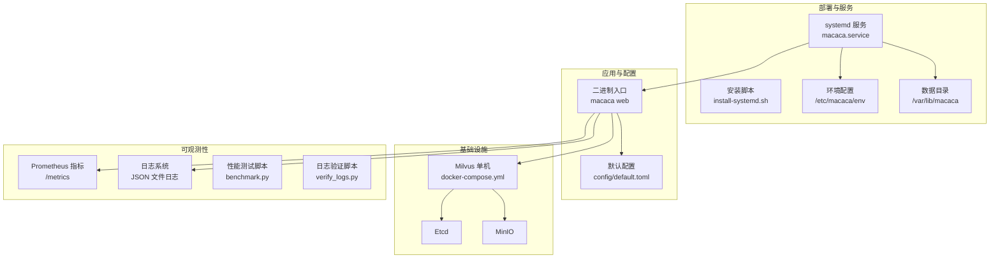
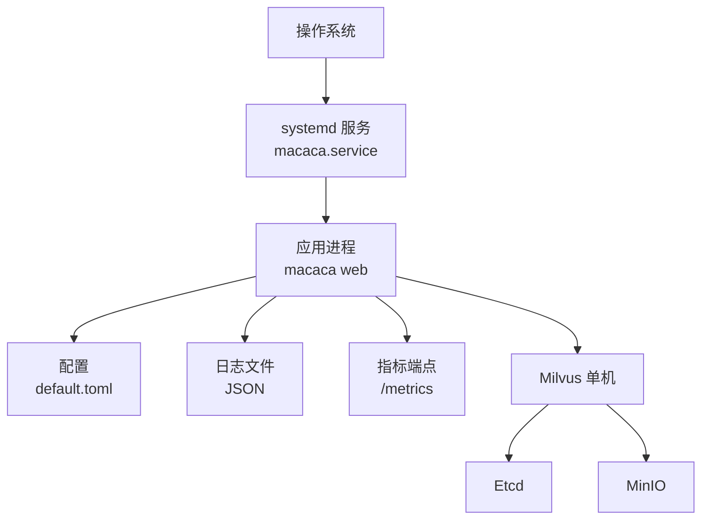
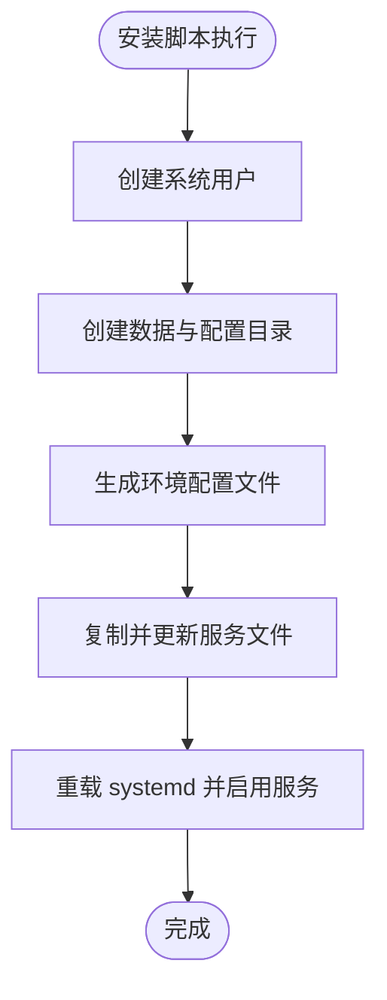
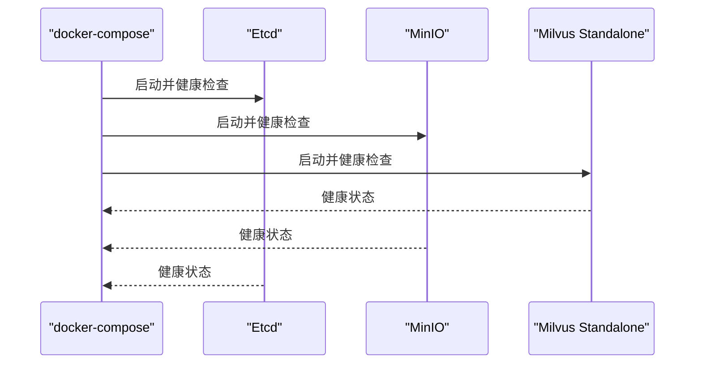
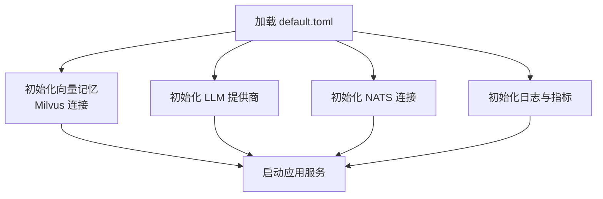
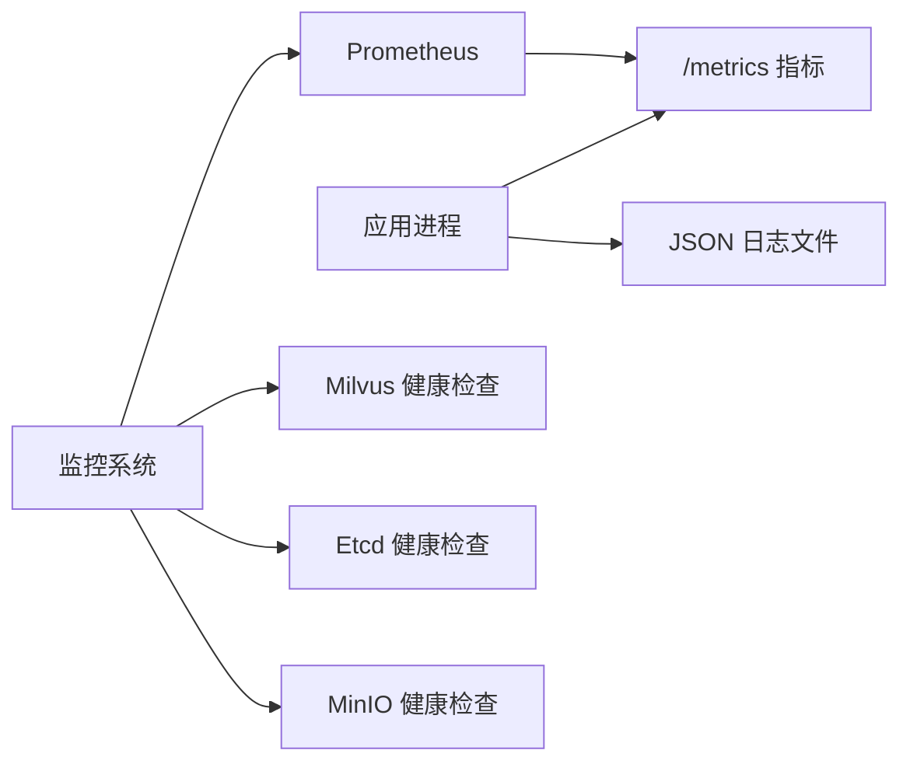
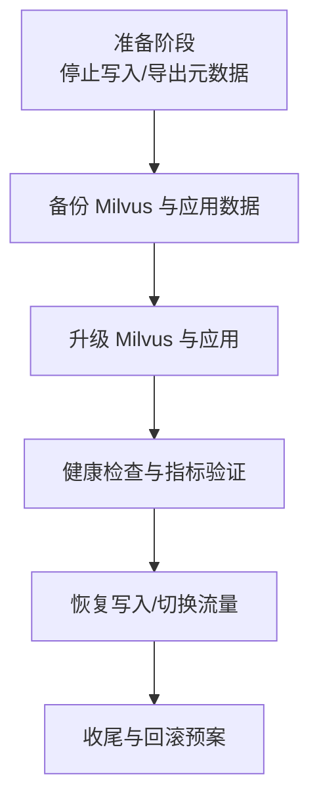
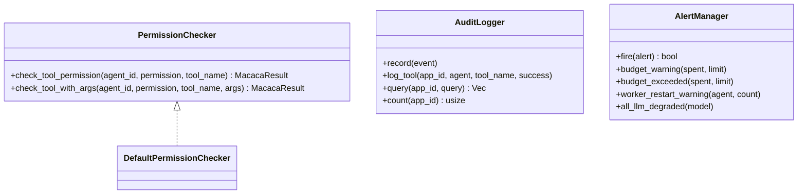
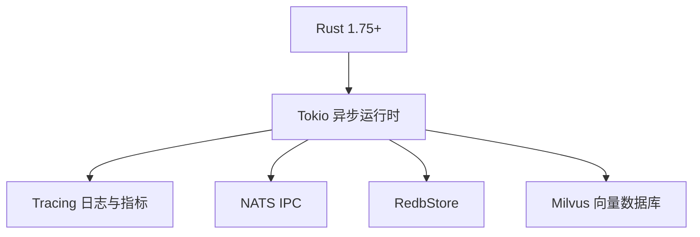
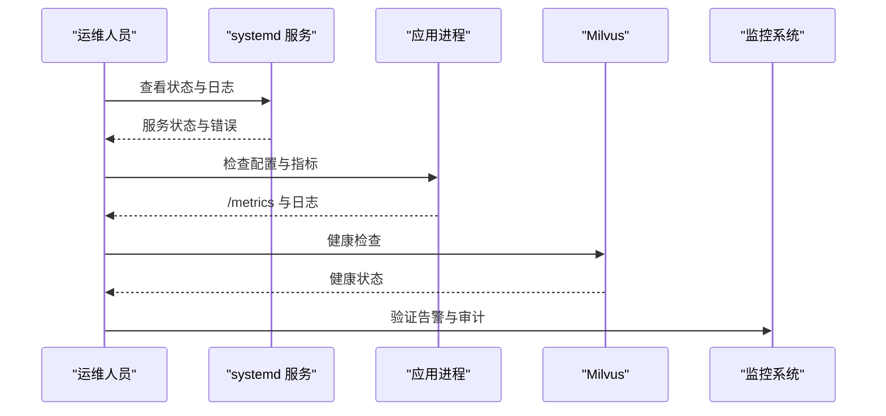

# 部署与运维

<cite>
**本文引用的文件**
- [install-systemd.sh](file://macaca/deploy/install-systemd.sh)
- [macaca.service](file://macaca/deploy/macaca.service)
- [docker-compose.yml](file://macaca/infra/milvus/docker-compose.yml)
- [default.toml](file://macaca/config/default.toml)
- [Cargo.toml](file://macaca/Cargo.toml)
- [README.md](file://macaca/README.md)
- [benchmark.py](file://macaca/scripts/benchmark.py)
- [verify_logs.py](file://macaca/scripts/verify_logs.py)
- [SYSTEM_AUDIT.md](file://macaca/docs/SYSTEM_AUDIT.md)
- [log-system-plan.md](file://macaca/docs/log-system-plan.md)
- [metrics.rs](file://macaca/crates/macaca-web/src/metrics.rs)
- [fork_manager.rs](file://macaca/crates/macaca-kernel/src/executor/fork_manager.rs)
- [permission.rs](file://macaca/crates/macaca-runtime/src/permission.rs)
- [alert.rs](file://macaca/crates/macaca-kernel/src/alert.rs)
- [audit.rs](file://macaca/crates/macaca-kernel/src/audit.rs)
</cite>

## 目录
1. [简介](#简介)
2. [项目结构](#项目结构)
3. [核心组件](#核心组件)
4. [架构总览](#架构总览)
5. [详细组件分析](#详细组件分析)
6. [依赖关系分析](#依赖关系分析)
7. [性能考量](#性能考量)
8. [故障排查指南](#故障排查指南)
9. [结论](#结论)
10. [附录](#附录)

## 简介
本指南面向生产环境部署与运维，覆盖系统要求、依赖安装、配置设置、启动流程、systemd 服务管理、Docker 容器化与 Milvus 向量数据库部署、监控与日志、备份恢复、升级迁移与安全加固等主题。文档基于仓库现有部署脚本、配置文件与可观测性实现进行整理，确保读者能够快速落地并长期稳定运行。

## 项目结构
- 部署与服务管理
  - systemd 服务与安装脚本位于 deploy 目录
  - 默认配置位于 config/default.toml
- 基础设施与向量数据库
  - Milvus 单机部署使用 docker-compose
- 可观测性与日志
  - 日志系统设计与实现计划文档
  - 日志性能与完整性验证脚本
  - Prometheus 指标端点
- 安全与审计
  - 权限控制、审计日志、告警通道

**图表来源**
- [macaca.service:1-38](file://macaca/deploy/macaca.service#L1-L38)
- [install-systemd.sh:1-60](file://macaca/deploy/install-systemd.sh#L1-L60)
- [default.toml:1-119](file://macaca/config/default.toml#L1-L119)
- [docker-compose.yml:1-69](file://macaca/infra/milvus/docker-compose.yml#L1-L69)
- [metrics.rs:131-141](file://macaca/crates/macaca-web/src/metrics.rs#L131-L141)
- [log-system-plan.md:1-107](file://macaca/docs/log-system-plan.md#L1-L107)

**章节来源**
- [README.md:1-29](file://macaca/README.md#L1-L29)
- [Cargo.toml:1-90](file://macaca/Cargo.toml#L1-L90)

## 核心组件
- systemd 服务与安装脚本
  - 自动创建系统用户、目录、环境文件，安装并启用服务
  - 支持资源限制、安全加固、看门狗重启
- Milvus 向量数据库
  - 单机模式，依赖 etcd 与 MinIO，健康检查与端口映射
- 日志系统
  - 配置化文件日志，支持 JSON 格式、滚动与保留策略
  - 提供性能与完整性验证脚本
- 指标与告警
  - Prometheus 指标端点、告警通道与审计日志

**章节来源**
- [install-systemd.sh:1-60](file://macaca/deploy/install-systemd.sh#L1-L60)
- [macaca.service:1-38](file://macaca/deploy/macaca.service#L1-L38)
- [docker-compose.yml:1-69](file://macaca/infra/milvus/docker-compose.yml#L1-L69)
- [default.toml:106-119](file://macaca/config/default.toml#L106-L119)
- [log-system-plan.md:1-107](file://macaca/docs/log-system-plan.md#L1-L107)
- [metrics.rs:131-141](file://macaca/crates/macaca-web/src/metrics.rs#L131-L141)
- [alert.rs:1-433](file://macaca/crates/macaca-kernel/src/alert.rs#L1-L433)

## 架构总览
下图展示生产环境关键组件及其交互：系统服务负责运行应用，应用连接 Milvus 进行向量检索，同时输出日志与指标，支持健康检查与告警。

**图表来源**
- [macaca.service:7-34](file://macaca/deploy/macaca.service#L7-L34)
- [default.toml:62-72](file://macaca/config/default.toml#L62-L72)
- [docker-compose.yml:36-65](file://macaca/infra/milvus/docker-compose.yml#L36-L65)
- [metrics.rs:131-141](file://macaca/crates/macaca-web/src/metrics.rs#L131-L141)

## 详细组件分析

### systemd 服务与进程管理
- 服务特性
  - 类型：notify，支持看门狗心跳
  - 重启策略：无限重启，间隔退避
  - 资源限制：最大文件句柄、内存上限
  - 安全加固：禁止提权、严格保护系统路径、只读 Home、限定读写路径
- 用户与目录
  - 系统用户与数据目录隔离，权限最小化
- 环境配置
  - 通过 /etc/macaca/env 注入环境变量，支持 API 密钥等敏感配置
- 常用命令
  - 启动、停止、重启、状态查询、跟随日志

**图表来源**
- [install-systemd.sh:10-45](file://macaca/deploy/install-systemd.sh#L10-L45)

**章节来源**
- [install-systemd.sh:1-60](file://macaca/deploy/install-systemd.sh#L1-L60)
- [macaca.service:1-38](file://macaca/deploy/macaca.service#L1-L38)

### Docker 容器化与 Milvus 部署
- 组件
  - etcd：键值存储与集群健康检查
  - minio：对象存储与控制台
  - milvus-standalone：向量数据库单机模式
- 网络与卷
  - 使用自定义网络，挂载本地卷至 etcd、minio、milvus 数据目录
- 端口映射
  - Milvus 客户端端口与健康检查端口映射
- 健康检查
  - etcd、minio、milvus 均配置健康检查，便于编排与监控

**图表来源**
- [docker-compose.yml:4-65](file://macaca/infra/milvus/docker-compose.yml#L4-L65)

**章节来源**
- [docker-compose.yml:1-69](file://macaca/infra/milvus/docker-compose.yml#L1-L69)

### 配置与启动流程
- 配置要点
  - LLM 提供商与速率限制
  - 向量记忆后端 Milvus 地址与集合名
  - IPC NATS 连接参数
  - 观测性：日志级别、文件日志开关、保留天数
- 启动顺序
  - 先启动 Milvus（如需），再启动 systemd 服务
  - systemd 服务启动应用进程，应用加载配置并初始化各子系统

**图表来源**
- [default.toml:62-72](file://macaca/config/default.toml#L62-L72)
- [default.toml:106-119](file://macaca/config/default.toml#L106-L119)
- [metrics.rs:131-141](file://macaca/crates/macaca-web/src/metrics.rs#L131-L141)

**章节来源**
- [default.toml:1-119](file://macaca/config/default.toml#L1-L119)

### 监控与日志管理
- 指标端点
  - /metrics 返回 Prometheus 文本格式指标，无需鉴权
- 日志系统
  - JSON 格式文件日志，按日期滚动，支持保留天数与压缩
  - 提供性能测试与完整性验证脚本，保障日志质量
- 健康检查
  - Milvus、Etcd、MinIO 健康检查，便于外部监控系统拉取

**图表来源**
- [metrics.rs:131-141](file://macaca/crates/macaca-web/src/metrics.rs#L131-L141)
- [log-system-plan.md:67-83](file://macaca/docs/log-system-plan.md#L67-L83)
- [docker-compose.yml:15-19](file://macaca/infra/milvus/docker-compose.yml#L15-L19)
- [docker-compose.yml:30-34](file://macaca/infra/milvus/docker-compose.yml#L30-L34)
- [docker-compose.yml:54-59](file://macaca/infra/milvus/docker-compose.yml#L54-L59)

**章节来源**
- [metrics.rs:131-141](file://macaca/crates/macaca-web/src/metrics.rs#L131-L141)
- [log-system-plan.md:1-107](file://macaca/docs/log-system-plan.md#L1-L107)
- [benchmark.py:1-240](file://macaca/scripts/benchmark.py#L1-L240)
- [verify_logs.py:1-476](file://macaca/scripts/verify_logs.py#L1-L476)
- [docker-compose.yml:1-69](file://macaca/infra/milvus/docker-compose.yml#L1-L69)

### 备份恢复与升级迁移
- 备份
  - Milvus：etcd 与 minio 卷备份，milvus 数据卷备份
  - 应用：配置文件与持久化存储（如 RedbStore）备份
- 恢复
  - Milvus：恢复 etcd 与 minio 数据，重启容器
  - 应用：恢复配置与数据目录，重启服务
- 升级迁移
  - 采用滚动升级策略，先升级 Milvus，再升级应用
  - 升级前后进行健康检查与指标对比

[本节为通用运维实践总结，不直接分析具体文件，故无“章节来源”]

### 安全加固
- systemd 服务安全
  - 禁止提权、严格保护系统路径、只读 Home、限定读写路径
  - 限制文件描述符与内存使用
- 应用安全
  - 权限控制：工具执行白名单、路径与网络访问控制
  - 审计日志：结构化事件记录，支持查询与统计
  - 告警通道：日志与 Webhook，去重与分级

**图表来源**
- [permission.rs:1-311](file://macaca/crates/macaca-runtime/src/permission.rs#L1-L311)
- [audit.rs:66-155](file://macaca/crates/macaca-kernel/src/audit.rs#L66-L155)
- [alert.rs:169-271](file://macaca/crates/macaca-kernel/src/alert.rs#L169-L271)

**章节来源**
- [macaca.service:22-34](file://macaca/deploy/macaca.service#L22-L34)
- [permission.rs:1-311](file://macaca/crates/macaca-runtime/src/permission.rs#L1-L311)
- [audit.rs:1-340](file://macaca/crates/macaca-kernel/src/audit.rs#L1-L340)
- [alert.rs:1-433](file://macaca/crates/macaca-kernel/src/alert.rs#L1-L433)

## 依赖关系分析
- 语言与运行时
  - Rust 1.75+，Tokio 异步运行时，Tracing 日志与指标
- 外部依赖
  - Milvus 向量数据库（Etcd、MinIO）
  - NATS IPC
- 配置与持久化
  - RedbStore 事件日志与审计
  - JSON 日志文件

**图表来源**
- [Cargo.toml:33-62](file://macaca/Cargo.toml#L33-L62)
- [Cargo.toml:64-90](file://macaca/Cargo.toml#L64-L90)
- [default.toml:79-83](file://macaca/config/default.toml#L79-L83)
- [default.toml:88-91](file://macaca/config/default.toml#L88-L91)

**章节来源**
- [Cargo.toml:1-90](file://macaca/Cargo.toml#L1-L90)
- [default.toml:1-119](file://macaca/config/default.toml#L1-L119)

## 性能考量
- 日志性能
  - JSON 格式与滚动策略，避免阻塞写入
  - 使用验证脚本评估日志结构完整性与生成速率
- 指标采集
  - /metrics 端点无需鉴权，便于 Prometheus 抓取
- 资源限制
  - systemd 限制文件描述符与内存，防止资源耗尽

**章节来源**
- [log-system-plan.md:67-83](file://macaca/docs/log-system-plan.md#L67-L83)
- [benchmark.py:1-240](file://macaca/scripts/benchmark.py#L1-L240)
- [metrics.rs:131-141](file://macaca/crates/macaca-web/src/metrics.rs#L131-L141)
- [macaca.service:22-24](file://macaca/deploy/macaca.service#L22-L24)

## 故障排查指南
- systemd 服务
  - 查看状态与日志：journalctl 跟随日志
  - 检查重启策略与看门狗是否生效
- Milvus
  - 健康检查失败：检查 etcd 与 minio 状态，确认端口映射
- 日志
  - 使用验证脚本检查任务生命周期与 Fork 事件完整性
  - 使用性能脚本评估日志生成速率与结构完整性
- 审计与告警
  - 审计事件查询与统计，定位异常行为
  - 告警通道有效性与去重策略验证

**图表来源**
- [install-systemd.sh:50-58](file://macaca/deploy/install-systemd.sh#L50-L58)
- [docker-compose.yml:15-19](file://macaca/infra/milvus/docker-compose.yml#L15-L19)
- [docker-compose.yml:30-34](file://macaca/infra/milvus/docker-compose.yml#L30-L34)
- [docker-compose.yml:54-59](file://macaca/infra/milvus/docker-compose.yml#L54-L59)
- [verify_logs.py:409-471](file://macaca/scripts/verify_logs.py#L409-L471)
- [audit.rs:115-148](file://macaca/crates/macaca-kernel/src/audit.rs#L115-L148)
- [alert.rs:196-229](file://macaca/crates/macaca-kernel/src/alert.rs#L196-L229)

**章节来源**
- [install-systemd.sh:50-58](file://macaca/deploy/install-systemd.sh#L50-L58)
- [verify_logs.py:1-476](file://macaca/scripts/verify_logs.py#L1-L476)
- [audit.rs:1-340](file://macaca/crates/macaca-kernel/src/audit.rs#L1-L340)
- [alert.rs:1-433](file://macaca/crates/macaca-kernel/src/alert.rs#L1-L433)

## 结论
本指南基于仓库现有部署脚本、配置与可观测性实现，提供了生产环境部署与运维的完整路径：从 systemd 服务与 Milvus 基础设施，到日志与指标体系，再到安全加固与故障排查。建议在生产环境中结合健康检查与告警通道，建立自动化巡检与回滚预案，确保系统稳定与可追溯。

## 附录
- 常用命令速查
  - 启动/停止/重启/状态：systemctl
  - 跟随日志：journalctl -u macaca -f
  - 指标查看：curl http://localhost:PORT/metrics
  - 日志完整性验证：python3 verify_logs.py --log-file logs/macaca.YYYY-MM-DD
  - 日志性能评估：python3 benchmark.py --log-file logs/macaca.YYYY-MM-DD

[本节为通用运维实践总结，不直接分析具体文件，故无“章节来源”]