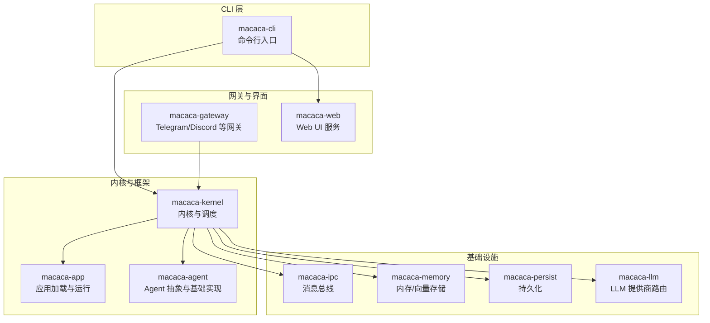
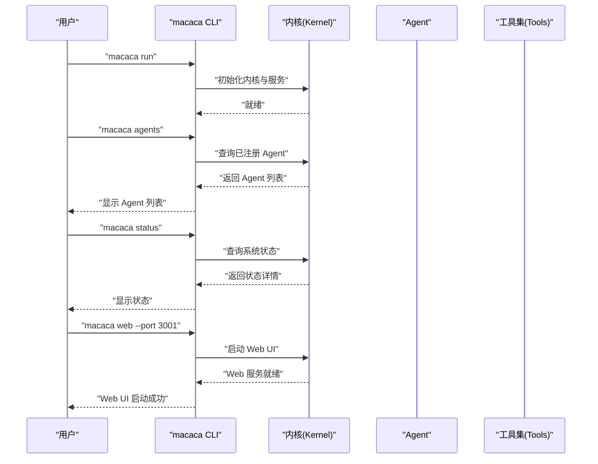

# 快速开始

<cite>
**本文引用的文件**
- [macaca/README.md](file://macaca/README.md)
- [macaca/Cargo.toml](file://macaca/Cargo.toml)
- [macaca/config/default.toml](file://macaca/config/default.toml)
- [macaca/crates/macaca-cli/src/main.rs](file://macaca/crates/macaca-cli/src/main.rs)
- [macaca/crates/macaca-cli/src/lib.rs](file://macaca/crates/macaca-cli/src/lib.rs)
- [macaca/crates/macaca-kernel/src/kernel.rs](file://macaca/crates/macaca-kernel/src/kernel.rs)
- [macaca/crates/macaca-agent/src/lib.rs](file://macaca/crates/macaca-agent/src/lib.rs)
- [macaca/crates/macaca-app/src/lib.rs](file://macaca/crates/macaca-app/src/lib.rs)
- [macaca/examples/todo-app-demo/app-manifest.yaml](file://macaca/examples/todo-app-demo/app-manifest.yaml)
- [macaca/examples/todo-app-demo/task-planner-agent.yaml](file://macaca/examples/todo-app-demo/task-planner-agent.yaml)
- [macaca/examples/todo-app-demo/code-gen-agent.yaml](file://macaca/examples/todo-app-demo/code-gen-agent.yaml)
- [macaca/deploy/install-systemd.sh](file://macaca/deploy/install-systemd.sh)
</cite>

## 目录
1. [简介](#简介)
2. [项目结构](#项目结构)
3. [系统要求与依赖](#系统要求与依赖)
4. [安装与配置](#安装与配置)
5. [启动第一个 Agent 应用](#启动第一个-agent-应用)
6. [常用 CLI 命令](#常用-cli-命令)
7. [Hello World 示例](#hello-world-示例)
8. [验证安装与检查状态](#验证安装与检查状态)
9. [性能与资源建议](#性能与资源建议)
10. [故障排查](#故障排查)
11. [结语](#结语)

## 简介
Macaca 是一个面向真实多 Agent 应用的 Agent OS：它负责发现与运行 Application、调度 Agent、聚合 Driver/Tool 能力，并通过 Web/Gateway/持久化层把任务执行链路、状态与审计证据暴露出来。其目标是构建一个 7×24 小时自动规划、自动执行、自我唤醒的主动执行系统，而非一次性对话式助手。

## 项目结构
该仓库采用 Rust Workspace 组织，核心模块分布在 crates 下，示例与配置位于 examples 与 config。CLI、内核、应用层、任务与工具等模块协同工作，形成完整的 Agent 执行闭环。

图表来源
- [macaca/Cargo.toml:1-90](file://macaca/Cargo.toml#L1-L90)
- [macaca/crates/macaca-cli/src/main.rs:1-79](file://macaca/crates/macaca-cli/src/main.rs#L1-L79)
- [macaca/crates/macaca-kernel/src/kernel.rs:1-200](file://macaca/crates/macaca-kernel/src/kernel.rs#L1-L200)
- [macaca/crates/macaca-agent/src/lib.rs:1-15](file://macaca/crates/macaca-agent/src/lib.rs#L1-L15)
- [macaca/crates/macaca-app/src/lib.rs:1-21](file://macaca/crates/macaca-app/src/lib.rs#L1-L21)

章节来源
- [macaca/README.md:1-29](file://macaca/README.md#L1-L29)
- [macaca/Cargo.toml:1-90](file://macaca/Cargo.toml#L1-L90)

## 系统要求与依赖
- 操作系统：Linux/macOS（仓库未提供 Windows 支持说明）
- 编译器与运行时：Rust 1.75 或以上版本
- 异步运行时：Tokio
- 包管理：Cargo（随 Rust 安装）
- 可选：NATS、Milvus 向量库、OpenTelemetry（用于消息总线与可观测性）

章节来源
- [macaca/Cargo.toml:27-32](file://macaca/Cargo.toml#L27-L32)

## 安装与配置
### 步骤 1：安装 Rust 工具链
- 使用 rustup 安装稳定版 Rust（满足最小版本要求）
- 确认 cargo 版本可用

### 步骤 2：克隆并编译项目
- 在项目根目录执行构建，生成 CLI 二进制
- CLI 二进制名称为 macaca（由 CLI crate 定义）

章节来源
- [macaca/Cargo.toml:1-90](file://macaca/Cargo.toml#L1-L90)
- [macaca/crates/macaca-cli/src/main.rs:1-79](file://macaca/crates/macaca-cli/src/main.rs#L1-L79)

### 步骤 3：准备默认配置
- 默认配置文件路径：config/default.toml
- 关键配置项（按需修改）：
  - llm.providers.*：设置 LLM 提供商与密钥
  - memory.vector.milvus_url：向量数据库地址
  - ipc.nats_url：消息总线地址
  - observability.log_level：日志级别
  - persist.data_dir：持久化数据目录
  - gateway.*：启用并配置网关参数

章节来源
- [macaca/config/default.toml:1-119](file://macaca/config/default.toml#L1-L119)

### 步骤 4：可选——systemd 安装（生产部署）
- 使用安装脚本创建系统用户与目录
- 复制并更新 systemd 服务文件
- 设置环境变量文件（如需要）
- 常用命令：
  - 启动：sudo systemctl start macaca
  - 查看状态：sudo systemctl status macaca
  - 查看日志：sudo journalctl -u macaca -f

章节来源
- [macaca/deploy/install-systemd.sh:1-60](file://macaca/deploy/install-systemd.sh#L1-L60)

## 启动第一个 Agent 应用
### 第一步：准备示例应用清单
- 使用示例应用清单文件，声明应用名称、版本与包含的 Agent 列表
- 示例清单路径：examples/todo-app-demo/app-manifest.yaml

章节来源
- [macaca/examples/todo-app-demo/app-manifest.yaml:1-7](file://macaca/examples/todo-app-demo/app-manifest.yaml#L1-L7)

### 第二步：准备 Agent 配置
- 任务规划 Agent：examples/todo-app-demo/task-planner-agent.yaml
- 代码生成 Agent：examples/todo-app-demo/code-gen-agent.yaml

章节来源
- [macaca/examples/todo-app-demo/task-planner-agent.yaml:1-22](file://macaca/examples/todo-app-demo/task-planner-agent.yaml#L1-L22)
- [macaca/examples/todo-app-demo/code-gen-agent.yaml:1-26](file://macaca/examples/todo-app-demo/code-gen-agent.yaml#L1-L26)

### 第三步：启动内核与网关
- 使用 CLI 启动内核与网关适配器
- 命令：macaca run

章节来源
- [macaca/crates/macaca-cli/src/main.rs:14-31](file://macaca/crates/macaca-cli/src/main.rs#L14-L31)

### 第四步：查看已注册的 Agent
- 使用 CLI 列出所有已注册 Agent
- 命令：macaca agents

章节来源
- [macaca/crates/macaca-cli/src/main.rs:14-31](file://macaca/crates/macaca-cli/src/main.rs#L14-L31)

### 第五步：查看系统状态
- 使用 CLI 查看系统状态
- 命令：macaca status

章节来源
- [macaca/crates/macaca-cli/src/main.rs:14-31](file://macaca/crates/macaca-cli/src/main.rs#L14-L31)

## 常用 CLI 命令
- macaca run：启动内核与网关适配器
- macaca agents：列出所有已注册 Agent
- macaca status：显示系统状态
- macaca version：打印版本信息
- macaca web [--port N]：启动 Web UI 服务器

章节来源
- [macaca/crates/macaca-cli/src/main.rs:14-31](file://macaca/crates/macaca-cli/src/main.rs#L14-L31)
- [macaca/crates/macaca-cli/src/lib.rs:1-10](file://macaca/crates/macaca-cli/src/lib.rs#L1-L10)

## Hello World 示例
以下流程帮助你在 30 分钟内体验系统核心能力：

- 步骤 1：启动内核
  - 执行：macaca run
  - 观察日志输出，确认内核初始化完成

- 步骤 2：查看 Agent 列表
  - 执行：macaca agents
  - 确认示例 Agent 已注册

- 步骤 3：查看系统状态
  - 执行：macaca status
  - 检查内核、IPC、内存、持久化等组件状态

- 步骤 4：启动 Web UI（可选）
  - 执行：macaca web --port 3001
  - 在浏览器访问 http://localhost:3001

- 步骤 5：在网关中发起任务（可选）
  - 通过 Telegram/Discord 等网关发送指令，触发 Agent 执行

图表来源
- [macaca/crates/macaca-cli/src/main.rs:14-31](file://macaca/crates/macaca-cli/src/main.rs#L14-L31)
- [macaca/crates/macaca-kernel/src/kernel.rs:1-200](file://macaca/crates/macaca-kernel/src/kernel.rs#L1-L200)

## 验证安装与检查状态
- 日志检查：根据配置中的日志级别与输出位置，查看 JSON 格式日志
- 状态命令：macaca status 显示内核、IPC、内存、持久化等组件状态
- Web UI：若启动 Web 服务，访问指定端口确认页面可用
- 网关连通性：配置 Telegram/Discord 等网关后，发送测试消息验证

章节来源
- [macaca/config/default.toml:106-119](file://macaca/config/default.toml#L106-L119)
- [macaca/crates/macaca-cli/src/main.rs:14-31](file://macaca/crates/macaca-cli/src/main.rs#L14-L31)

## 性能与资源建议
- LLM 速率限制：合理配置 llm.rate_limit_rpm 与模型最大上下文长度
- 内存与向量：Milvus 向量库与嵌入模型需稳定网络与充足磁盘空间
- 消息总线：NATS 需要低延迟网络与合理的重连策略
- 日志与观测：开启 JSON 文件日志与可选 OTLP 输出，便于问题定位

章节来源
- [macaca/config/default.toml:6-119](file://macaca/config/default.toml#L6-L119)

## 故障排查
- 无法启动内核
  - 检查 LLM 提供商密钥与网络连通性
  - 查看日志文件定位错误
- Agent 未注册或不可见
  - 确认示例清单与 Agent 配置正确
  - 使用 macaca agents 核对注册列表
- Web UI 无法访问
  - 确认端口未被占用
  - 检查防火墙与反向代理配置
- NATS/向量库连接失败
  - 检查地址与认证配置
  - 确保服务正常运行且网络可达

章节来源
- [macaca/config/default.toml:79-119](file://macaca/config/default.toml#L79-L119)
- [macaca/crates/macaca-cli/src/main.rs:33-78](file://macaca/crates/macaca-cli/src/main.rs#L33-L78)

## 结语
通过上述步骤，你可以在 30 分钟内完成 Macaca Agent OS 的安装、配置与首次体验。建议在开发环境中先行验证，再逐步引入真实任务与网关，以获得稳定的自动化执行体验。