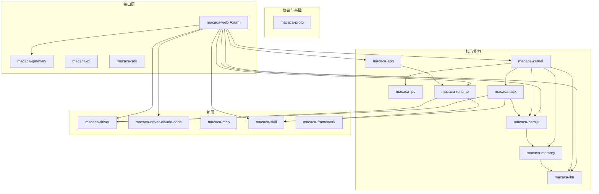
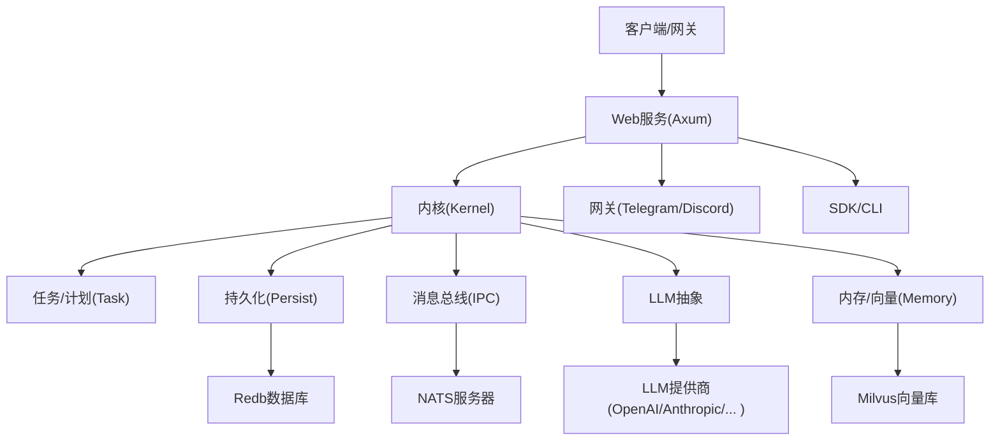
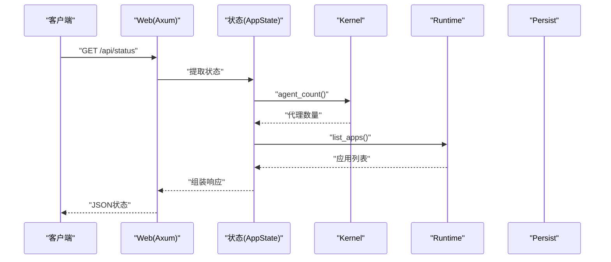
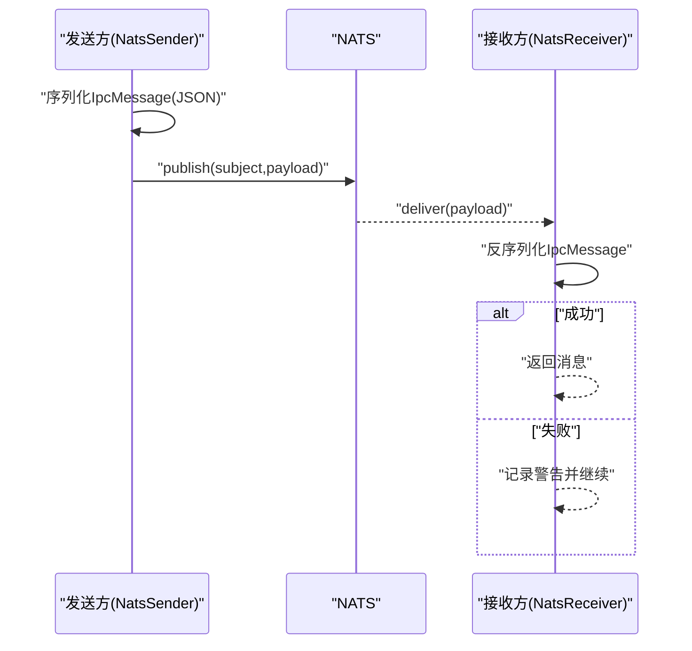
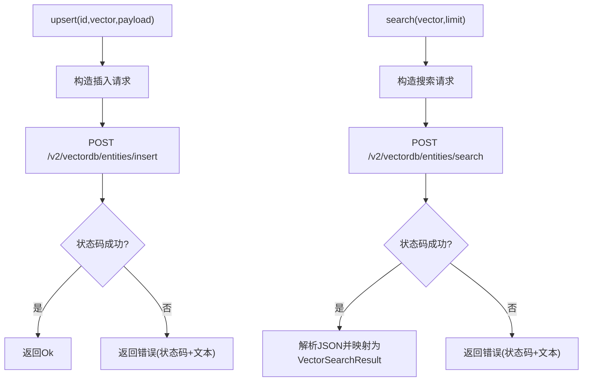
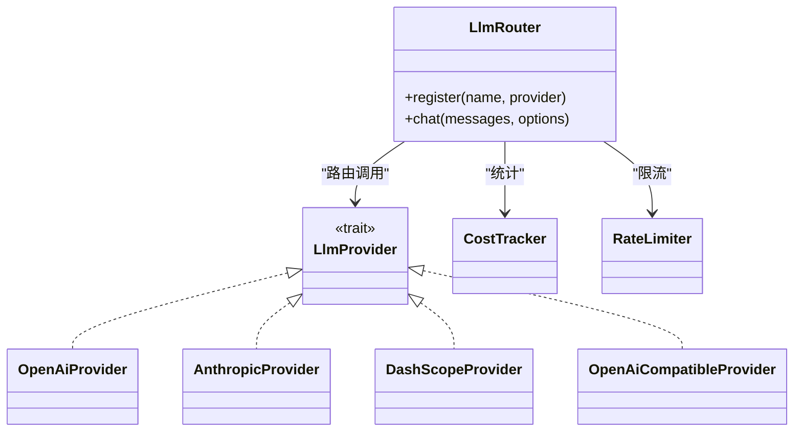
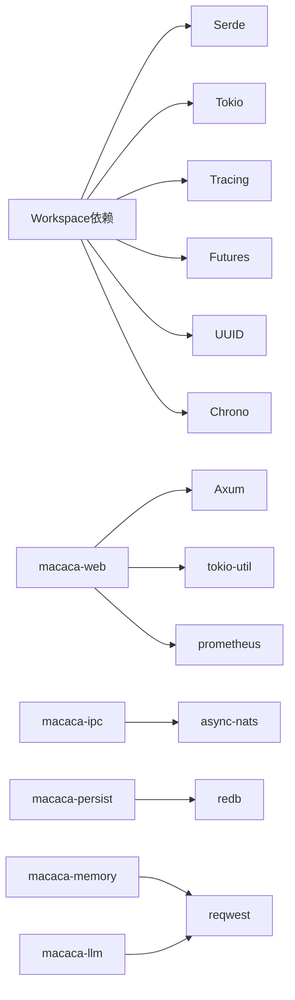

# 技术栈介绍

<cite>
**本文档引用的文件**
- [Cargo.toml](file://macaca/Cargo.toml)
- [Cargo.lock](file://macaca/Cargo.lock)
- [default.toml](file://macaca/config/default.toml)
- [lib.rs](file://macaca/crates/macaca-llm/src/lib.rs)
- [nats.rs](file://macaca/crates/macaca-ipc/src/nats.rs)
- [redb_store.rs](file://macaca/crates/macaca-persist/src/redb_store.rs)
- [vector.rs](file://macaca/crates/macaca-memory/src/vector.rs)
- [routes.rs](file://macaca/crates/macaca-web/src/routes.rs)
- [README.md](file://macaca/README.md)
</cite>

## 目录
1. [简介](#简介)
2. [项目结构](#项目结构)
3. [核心组件](#核心组件)
4. [架构总览](#架构总览)
5. [详细组件分析](#详细组件分析)
6. [依赖关系分析](#依赖关系分析)
7. [性能考虑](#性能考虑)
8. [故障排查指南](#故障排查指南)
9. [结论](#结论)
10. [附录](#附录)

## 简介
本文件面向Macaca Agent操作系统，系统性梳理其在Rust生态中的技术栈选型与实现要点，重点覆盖以下方面：
- 异步运行时与Web框架：Tokio + Axum
- 序列化与类型系统：Serde
- 观测性与日志：Tracing及配套生态
- 消息传递：NATS
- 事件存储：Redb
- 第三方服务集成：LLM提供商、向量数据库（Milvus）

同时给出版本兼容性与升级策略、开发工具链、基础设施需求、性能基准与资源消耗参考，以及第三方服务集成的最佳实践建议。

## 项目结构
仓库采用Rust工作区组织，核心模块按职责分层：
- 协议与类型：macaca-proto
- LLM抽象与路由：macaca-llm
- 内存与向量检索：macaca-memory
- 进程间通信：macaca-ipc（NATS）
- 工具与技能：macaca-tools、macaca-skill
- 任务与计划：macaca-task
- 应用与运行时：macaca-app、macaca-runtime
- 核心内核：macaca-kernel
- 网关与Web：macaca-web（Axum）
- SDK与CLI：macaca-sdk、macaca-cli
- 网关适配器：macaca-gateway（Telegram/Discord）
- MCP适配：macaca-mcp
- 驱动与代码助手：macaca-driver、macaca-driver-claude-code
- 持久化：macaca-persist（Redb）
- 原型与框架：macaca-framework、macaca-integration-tests

图表来源
- [Cargo.toml:1-25](file://macaca/Cargo.toml#L1-L25)
- [Cargo.toml:33-90](file://macaca/Cargo.toml#L33-L90)

章节来源
- [Cargo.toml:1-90](file://macaca/Cargo.toml#L1-L90)
- [README.md:1-29](file://macaca/README.md#L1-L29)

## 核心组件
本节聚焦本次文档关注的关键技术栈及其在系统中的角色与实现方式。

- Tokio异步运行时
  - 作用：提供高性能事件循环、任务调度与并发原语，贯穿IPC、LLM、Web、持久化等模块。
  - 版本：workspace统一锁定至1.x，启用full特性以支持多线程运行时与所有子模块。
  - 升级策略：遵循Rust 2021 edition与1.75最低版本要求，升级需同步验证各子crate的async接口兼容性。

- Axum Web框架
  - 作用：提供HTTP API路由、SSE流式输出、CORS支持，承载Web控制台与外部集成。
  - 特性：基于tower中间件栈，内置JSON序列化与错误处理，配合tokio-util与prometheus指标导出。
  - 实现参考：API路由集中于web crate，包含应用管理、任务看板、计划调度、事件日志查询等。

- Serde序列化库
  - 作用：统一跨进程/网络的消息与配置序列化，确保协议一致性与跨语言互通。
  - 特性：通过derive派生序列化实现，结合bincode用于二进制高效传输。
  - 使用：广泛用于IPC消息、事件日志、配置加载与响应体。

- Tracing日志系统
  - 作用：结构化日志与分布式追踪，支持JSON输出、文件落盘与可选OTLP导出。
  - 生态：tracing-subscriber（含json与env-filter）、tracing-appender、tracing-opentelemetry。
  - 实现参考：各模块普遍使用tracing进行关键路径打点与错误记录。

- NATS消息传递
  - 作用：进程内/跨节点事件总线，支持发布订阅与可靠投递。
  - 客户端：async-nats，封装发送/接收与主题命名空间（前缀aos.）。
  - 实现参考：IPC crate提供NatsSender/NatsReceiver/NatsBus，统一消息编解码与错误处理。

- Redb事件存储
  - 作用：嵌入式键值存储，用于事件日志、检查点与会话数据持久化。
  - 特性：ACID事务、只读/只写事务分离、表定义与并发安全。
  - 实现参考：persist crate的RedbStore实现KV接口，使用spawn_blocking访问数据库，保证非阻塞IO。

- 向量数据库（Milvus）
  - 作用：向量检索与相似度搜索，支撑记忆与上下文召回。
  - 客户端：reqwest REST调用，支持集合创建、实体插入/删除与搜索。
  - 实现参考：memory crate的MilvusStore封装REST API，提供upsert/search/delete。

章节来源
- [Cargo.toml:33-90](file://macaca/Cargo.toml#L33-L90)
- [Cargo.lock:110-143](file://macaca/Cargo.lock#L110-L143)
- [Cargo.lock:191-221](file://macaca/Cargo.lock#L191-L221)
- [Cargo.lock:261-267](file://macaca/Cargo.lock#L261-L267)
- [Cargo.lock:494-500](file://macaca/Cargo.lock#L494-L500)
- [Cargo.lock:694-701](file://macaca/Cargo.lock#L694-L701)
- [default.toml:57-119](file://macaca/config/default.toml#L57-L119)

## 架构总览
下图展示系统关键组件之间的交互关系与数据流：

图表来源
- [routes.rs:1-791](file://macaca/crates/macaca-web/src/routes.rs#L1-L791)
- [nats.rs:104-130](file://macaca/crates/macaca-ipc/src/nats.rs#L104-L130)
- [redb_store.rs:17-35](file://macaca/crates/macaca-persist/src/redb_store.rs#L17-L35)
- [vector.rs:61-104](file://macaca/crates/macaca-memory/src/vector.rs#L61-L104)
- [lib.rs:30-52](file://macaca/crates/macaca-llm/src/lib.rs#L30-L52)

## 详细组件分析

### 组件A：Web服务（Axum）与API路由
- 功能定位：提供系统状态、应用管理、任务看板、计划调度、事件日志查询等HTTP接口；通过SSE推送代理状态变更。
- 关键流程：请求进入Axum路由，经状态对象解析与参数校验后，调用内核/运行时/持久化模块完成业务逻辑，返回JSON或SSE流。
- 性能特征：基于Tokio事件循环，SSE长连接与定时轮询相结合，减少不必要的负载。

图表来源
- [routes.rs:55-65](file://macaca/crates/macaca-web/src/routes.rs#L55-L65)
- [routes.rs:81-110](file://macaca/crates/macaca-web/src/routes.rs#L81-L110)

章节来源
- [routes.rs:1-791](file://macaca/crates/macaca-web/src/routes.rs#L1-L791)

### 组件B：消息总线（NATS）与IPC
- 功能定位：提供跨组件事件广播与点对点通信，统一主题命名空间与消息编解码。
- 关键流程：发送方构造IpcMessage并序列化为JSON，通过NATS发布；接收方订阅主题并反序列化解析，处理异常消息并记录警告。
- 错误处理：连接失败、订阅关闭、反序列化失败均有明确错误分支与日志记录。

图表来源
- [nats.rs:20-46](file://macaca/crates/macaca-ipc/src/nats.rs#L20-L46)
- [nats.rs:56-100](file://macaca/crates/macaca-ipc/src/nats.rs#L56-L100)

章节来源
- [nats.rs:1-189](file://macaca/crates/macaca-ipc/src/nats.rs#L1-L189)

### 组件C：事件存储（Redb）
- 功能定位：提供键值存储能力，支持get/set/delete/list_keys等操作，事务隔离与并发安全。
- 关键流程：打开数据库并确保表存在；读写操作通过spawn_blocking切换到阻塞线程池，避免阻塞Tokio事件循环。
- 性能特征：适合小规模事件日志与会话数据，支持高并发读取与写入。

```mermaid
flowchart TD
Start(["入口"]) --> Open["打开数据库并确保表存在"]
Open --> Op{"操作类型"}
Op --> |get| Get["begin_read<br/>open_table<br/>table.get(key)"]
Op --> |set| Set["begin_write<br/>open_table<br/>table.insert(key,value)<br/>commit"]
Op --> |delete| Del["begin_write<br/>open_table<br/>table.remove(key)<br/>commit"]
Op --> |list_keys| List["begin_read<br/>open_table.iter()<br/>收集匹配前缀的key"]
Get --> End(["返回结果"])
Set --> End
Del --> End
List --> End
```

图表来源
- [redb_store.rs:17-35](file://macaca/crates/macaca-persist/src/redb_store.rs#L17-L35)
- [redb_store.rs:37-115](file://macaca/crates/macaca-persist/src/redb_store.rs#L37-L115)

章节来源
- [redb_store.rs:1-116](file://macaca/crates/macaca-persist/src/redb_store.rs#L1-L116)

### 组件D：向量检索（Milvus）
- 功能定位：提供向量插入、搜索与删除能力，支持集合自动创建与REST API交互。
- 关键流程：upsert将向量与payload组合后插入；search根据查询向量返回TopK结果；delete按条件删除实体。
- 性能特征：适合中等规模向量检索，建议合理设置维度与集合容量，结合缓存与批量写入优化吞吐。

图表来源
- [vector.rs:107-205](file://macaca/crates/macaca-memory/src/vector.rs#L107-L205)

章节来源
- [vector.rs:1-338](file://macaca/crates/macaca-memory/src/vector.rs#L1-L338)

### 组件E：LLM抽象与路由
- 功能定位：统一LLM提供商接入，支持OpenAI、Anthropic、DashScope及OpenAI兼容接口；提供成本跟踪与速率限制。
- 关键流程：注册多个Provider，根据模型名称自动路由；支持重试、降级与成本统计。
- 实现参考：lib.rs导出Provider、Router、CostTracker、RateLimiter等核心类型。

图表来源
- [lib.rs:30-52](file://macaca/crates/macaca-llm/src/lib.rs#L30-L52)

章节来源
- [lib.rs:1-52](file://macaca/crates/macaca-llm/src/lib.rs#L1-L52)

## 依赖关系分析
- 工作区统一依赖：Serde、Tokio、Tracing、Futures、UUID、Chrono等在workspace层面统一版本，确保跨crate一致性。
- 子crate依赖：各模块按需引入，避免重复与冲突；例如web依赖axum、tokio-util、prometheus；ipc依赖async-nats；persist依赖redb；memory依赖reqwest。
- 版本锁定：Cargo.lock记录了具体版本号与校验和，升级时应保持兼容并重新生成锁文件。

图表来源
- [Cargo.toml:33-90](file://macaca/Cargo.toml#L33-L90)
- [Cargo.lock:110-143](file://macaca/Cargo.lock#L110-L143)
- [Cargo.lock:191-221](file://macaca/Cargo.lock#L191-L221)
- [Cargo.lock:261-267](file://macaca/Cargo.lock#L261-L267)
- [Cargo.lock:494-500](file://macaca/Cargo.lock#L494-L500)
- [Cargo.lock:694-701](file://macaca/Cargo.lock#L694-L701)

章节来源
- [Cargo.toml:1-90](file://macaca/Cargo.toml#L1-L90)
- [Cargo.lock:1-800](file://macaca/Cargo.lock#L1-L800)

## 性能考虑
- 异步与并发
  - 使用Tokio多线程运行时，I/O密集场景下可充分利用CPU核心；避免在主线程执行阻塞操作，必要时使用spawn_blocking。
  - IPC与Web路由均采用异步处理，结合SSE与定时轮询平衡实时性与资源占用。

- 序列化与网络
  - Serde JSON用于通用消息与配置；对于高频事件日志可考虑bincode提升序列化效率。
  - NATS发布/订阅采用JSON载荷，注意消息大小与压缩策略；必要时对大消息进行分片或外部存储引用。

- 存储与索引
  - Redb适合小到中等规模事件日志；若事件量增长显著，建议评估外部数据库或分片策略。
  - Milvus向量检索受维度与集合规模影响较大，建议：
    - 合理选择维度与索引类型
    - 批量插入与定期compact
    - 查询时限制TopK与过滤条件

- LLM与成本
  - 通过LlmRouter与RateLimiter控制请求频率与成本预算；对长上下文采用摘要压缩策略。
  - 对OpenAI兼容接口（如vLLM/Ollama）进行路由与降级，避免单点故障。

- 观测性
  - 启用tracing-subscriber JSON输出与文件落盘，结合日志轮转与压缩；生产环境可配置OTLP导出至遥测平台。

[本节为通用指导，不直接分析具体文件]

## 故障排查指南
- NATS连接与订阅
  - 症状：连接失败、订阅关闭、反序列化错误。
  - 排查：确认nats_url配置、网络连通性与认证；检查主题命名空间（前缀aos.）是否一致；查看发送方是否设置了msg.to字段。
  - 参考实现：NATS Bus连接、Sender/Receiver生命周期与错误处理。

- Redb存储异常
  - 症状：事务提交失败、表不存在、读写冲突。
  - 排查：确认数据库路径可写、表已创建；检查并发事务隔离；必要时重建数据库或迁移schema。
  - 参考实现：spawn_blocking访问数据库、事务开启与提交流程。

- 向量检索失败
  - 症状：Milvus集合创建失败、插入/搜索/删除返回非2xx状态码。
  - 排查：确认Milvus服务可用、集合名称与维度正确；检查API端点与鉴权；查看返回文本定位问题。
  - 参考实现：REST请求构造与状态码判断。

- Web API错误
  - 症状：路由未找到、参数解析失败、内部错误。
  - 排查：检查请求路径与参数格式；查看状态码与错误响应体；核对应用ID/会话ID合法性。
  - 参考实现：路由处理器与错误包装函数。

章节来源
- [nats.rs:109-130](file://macaca/crates/macaca-ipc/src/nats.rs#L109-L130)
- [redb_store.rs:37-115](file://macaca/crates/macaca-persist/src/redb_store.rs#L37-L115)
- [vector.rs:78-104](file://macaca/crates/macaca-memory/src/vector.rs#L78-L104)
- [routes.rs:33-41](file://macaca/crates/macaca-web/src/routes.rs#L33-L41)

## 结论
本技术栈以Tokio为核心，Axum提供Web能力，Serde统一序列化，Tracing完善可观测性，NATS承担事件总线，Redb与Milvus分别满足事件存储与向量检索需求。通过LLM抽象与路由实现多提供商兼容与成本控制。整体架构清晰、模块解耦良好，具备良好的扩展性与运维友好性。建议在生产环境中强化监控告警、日志归档与容量规划，并制定严格的版本升级与回滚策略。

[本节为总结性内容，不直接分析具体文件]

## 附录

### 版本兼容性与升级策略
- Rust与工具链
  - 最低版本：1.75（workspace.rust-version）
  - 编译器：rustc 1.75+
  - 包管理：cargo（随rustup安装）
  - 调试工具：lldb/gdb（可选），RUST_LOG=trace进行日志调试
- 依赖版本
  - Tokio 1.x、Axum 0.8.x、Serde 1.x、Tracing 0.1.x、async-nats 0.38.x、redb 2.x、reqwest 0.12.x
  - 升级策略：逐个crate更新，先更新workspace依赖版本，再更新各crate版本，最后运行cargo update并修复编译错误

章节来源
- [Cargo.toml:27-32](file://macaca/Cargo.toml#L27-L32)
- [Cargo.toml:39-52](file://macaca/Cargo.toml#L39-L52)
- [Cargo.lock:110-143](file://macaca/Cargo.lock#L110-L143)
- [Cargo.lock:191-221](file://macaca/Cargo.lock#L191-L221)
- [Cargo.lock:261-267](file://macaca/Cargo.lock#L261-L267)
- [Cargo.lock:494-500](file://macaca/Cargo.lock#L494-L500)
- [Cargo.lock:694-701](file://macaca/Cargo.lock#L694-L701)

### 开发工具链
- 编译与运行
  - cargo build / cargo run
  - cargo test（部分集成测试需外部服务）
- 调试
  - RUST_LOG=debug 或 RUST_LOG=trace 设置日志级别
  - 使用tokio-console（可选）观察任务与通道
- 格式与检查
  - rustfmt、clippy（建议在CI启用）

[本节为通用指导，不直接分析具体文件]

### 基础设施需求（建议）
- CPU：4核以上（多Agent并发与LLM推理）
- 内存：8GB以上（含向量索引与缓存）
- 存储：SSD 100GB+（日志、事件、向量库数据）
- 网络：NATS与Milvus端口开放（默认4222、19530）
- 外部服务：NATS服务器、Milvus服务、LLM提供商API密钥

章节来源
- [default.toml:79-84](file://macaca/config/default.toml#L79-L84)
- [default.toml:62-72](file://macaca/config/default.toml#L62-L72)

### 性能基准与资源消耗参考
- Web API
  - QPS：取决于CPU与并发；SSE推送每500ms一次，建议前端按需拉取
  - 内存：每连接约数MB（取决于事件大小与缓冲）
- NATS
  - 延迟：<10ms（本地环回）；吞吐受消息大小与网络带宽限制
- Redb
  - 写入：顺序写入优于随机写；建议批量提交
  - 查询：小表扫描快；大表建议索引或分区
- Milvus
  - 插入：批量插入吞吐更高；建议控制批次大小
  - 搜索：TopK越小延迟越低；维度越高延迟越高
- LLM
  - 成本与速率：通过CostTracker与RateLimiter控制；长上下文建议摘要

[本节为通用指导，不直接分析具体文件]

### 第三方服务集成最佳实践
- LLM提供商
  - OpenAI/Anthropic/DashScope：按模型定价与RPM限制配置路由与限流
  - OpenAI兼容：统一通过OpenAiCompatibleProvider接入，便于替换与灰度
  - 环境变量：通过配置文件中的环境变量名注入API密钥
- 向量数据库
  - Milvus：提前创建集合与索引；控制维度与批量大小；定期compact与备份
  - 嵌入模型：选择合适维度与提供商，统一embedding服务接口
- 网关与通知
  - Telegram/Discord：配置bot token与命令前缀；限制用户权限与命令白名单

章节来源
- [default.toml:6-52](file://macaca/config/default.toml#L6-L52)
- [default.toml:93-105](file://macaca/config/default.toml#L93-L105)
- [lib.rs:30-52](file://macaca/crates/macaca-llm/src/lib.rs#L30-L52)
- [vector.rs:61-104](file://macaca/crates/macaca-memory/src/vector.rs#L61-L104)