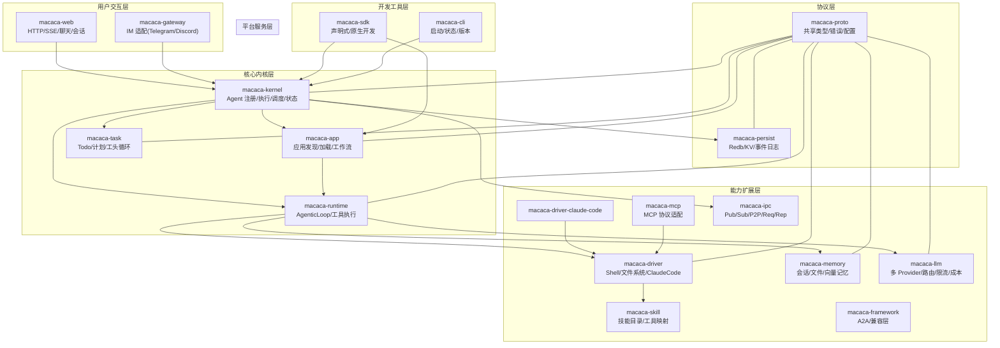
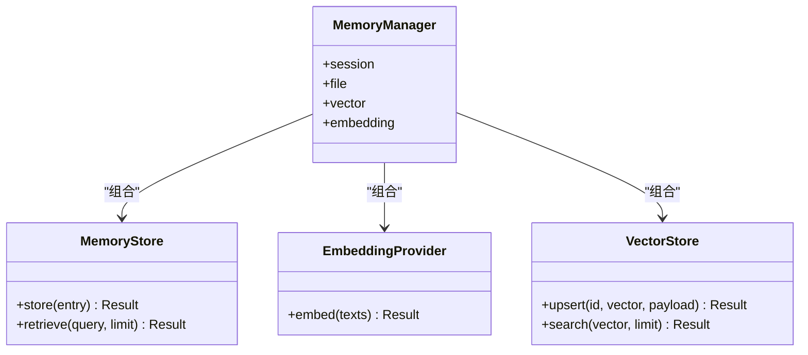
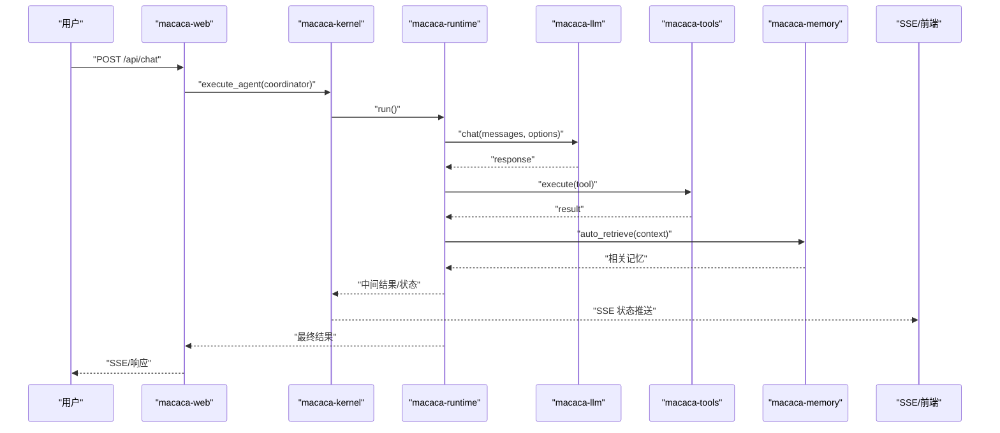
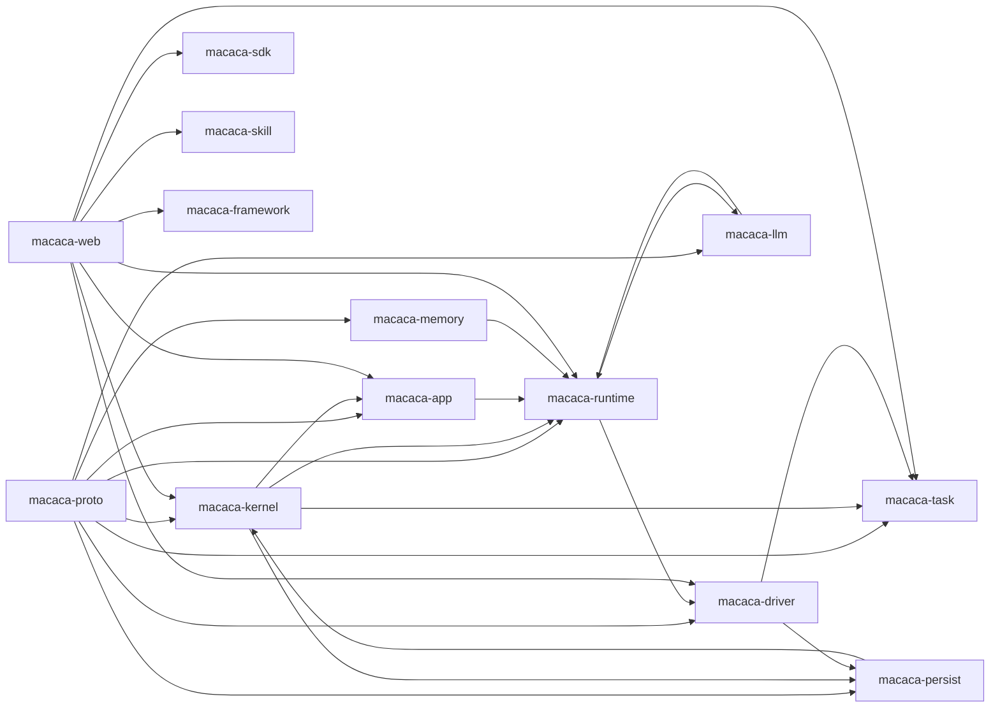

# 架构概览

<cite>
**本文档引用的文件**
- [Cargo.toml](file://macaca/Cargo.toml)
- [ARCHITECTURE-v2.md](file://macaca/ARCHITECTURE-v2.md)
- [SYSTEM_OVERVIEW.md](file://macaca/docs/SYSTEM_OVERVIEW.md)
- [README.md](file://macaca/README.md)
- [macaca-agent/Cargo.toml](file://macaca/crates/macaca-agent/Cargo.toml)
- [macaca-kernel/Cargo.toml](file://macaca/crates/macaca-kernel/Cargo.toml)
- [macaca-app/Cargo.toml](file://macaca/crates/macaca-app/Cargo.toml)
- [macaca-task/Cargo.toml](file://macaca/crates/macaca-task/Cargo.toml)
- [macaca-tools/Cargo.toml](file://macaca/crates/macaca-tools/Cargo.toml)
- [macaca-llm/Cargo.toml](file://macaca/crates/macaca-llm/Cargo.toml)
- [macaca-memory/Cargo.toml](file://macaca/crates/macaca-memory/Cargo.toml)
- [macaca-persist/Cargo.toml](file://macaca/crates/macaca-persist/Cargo.toml)
- [macaca-web/Cargo.toml](file://macaca/crates/macaca-web/Cargo.toml)
- [macaca-driver/Cargo.toml](file://macaca/crates/macaca-driver/Cargo.toml)
- [macaca-framework/Cargo.toml](file://macaca/crates/macaca-framework/Cargo.toml)
</cite>

## 目录
1. [简介](#简介)
2. [项目结构](#项目结构)
3. [核心组件](#核心组件)
4. [架构总览](#架构总览)
5. [详细组件分析](#详细组件分析)
6. [依赖分析](#依赖分析)
7. [性能考虑](#性能考虑)
8. [故障排查指南](#故障排查指南)
9. [结论](#结论)
10. [附录](#附录)

## 简介
本文件为 Macaca Agent 操作系统的架构概览，面向不同层次的读者提供渐进式理解深度。Macaca 是一个面向真实多 Agent 应用的 Agent OS，目标是构建一套可长期运行、可扩展、可观测、可审计的系统底座，支撑 7×24 小时的自动规划、执行与自我唤醒。系统采用分层架构与可插拔设计，围绕统一协议与任务原语，将 Driver/Tool 能力、记忆、持久化、网关等能力整合为闭环执行链路。

- 适合初学者：从系统定位、核心模块角色与任务执行链路入手，建立整体认知。
- 适合开发者：深入到各层职责、依赖关系、事件驱动与异步处理、数据流向与组件交互。
- 适合架构师：把握设计原则、技术约束、扩展点与系统边界，评估重构与演进方向。

章节来源
- [README.md:1-29](file://macaca/README.md#L1-L29)
- [SYSTEM_OVERVIEW.md:10-50](file://macaca/docs/SYSTEM_OVERVIEW.md#L10-L50)

## 项目结构
仓库采用 Rust Workspace 组织，核心模块集中在 crates/macaca-* 下，按功能域划分清晰。顶层 Cargo.toml 声明了工作区成员与公共依赖，确保版本与特性的一致性。

- 工作区成员（部分）：proto、llm、memory、ipc、tools、persist、agent、task、app、kernel、sdk、gateway、cli、driver、runtime、mcp、skill、web、framework、integration-tests。
- 公共依赖：serde、tokio、async-trait、futures、thiserror、anyhow、tracing、uuid、chrono、config、clap、axum、redb 等。
- 模块化边界：每个 crate 聚焦单一职责，通过共享协议（macaca-proto）与运行时（tokio/async）协同。

```mermaid
graph TB
subgraph "工作区"
WS["Cargo.toml<br/>workspace.members"]
end
subgraph "协议与基础"
PROTO["macaca-proto"]
PERSIST["macaca-persist"]
end
subgraph "平台与入口"
WEB["macaca-web"]
CLI["macaca-cli"]
GATEWAY["macaca-gateway"]
end
subgraph "核心内核"
KERNEL["macaca-kernel"]
APP["macaca-app"]
RUNTIME["macaca-runtime"]
TASK["macaca-task"]
end
subgraph "能力与扩展"
DRIVER["macaca-driver"]
DRIVER_CLAUDE["macaca-driver-claude-code"]
MCP["macaca-mcp"]
MEMORY["macaca-memory"]
LLM["macaca-llm"]
IPC["macaca-ipc"]
SDK["macaca-sdk"]
SKILL["macaca-skill"]
FRAMEWORK["macaca-framework"]
end
WS --> PROTO
WS --> PERSIST
WS --> WEB
WS --> CLI
WS --> GATEWAY
WS --> KERNEL
WS --> APP
WS --> RUNTIME
WS --> TASK
WS --> DRIVER
WS --> DRIVER_CLAUDE
WS --> MCP
WS --> MEMORY
WS --> LLM
WS --> IPC
WS --> SDK
WS --> SKILL
WS --> FRAMEWORK
```

图表来源
- [Cargo.toml:1-25](file://macaca/Cargo.toml#L1-L25)

章节来源
- [Cargo.toml:1-90](file://macaca/Cargo.toml#L1-L90)

## 核心组件
根据系统定义文档，核心模块及其角色如下：

- macaca-web：入口与运行承载层，提供 HTTP/SSE/聊天/目标 API，桥接会话、事件与执行生命周期。
- macaca-kernel：Agent 内核，负责注册、执行 Agent、fork/executor、审计与告警。
- macaca-runtime：Agentic 运行时，驱动 AgenticLoop、LLM 调用、工具执行与循环控制。
- macaca-task：任务系统，包含 TodoBoard、PlanLoop、WorkerLoop、目标拆解与 review 流程。
- macaca-app：Application 运行时，负责应用发现、加载 manifest/persona/workflow、启动应用。
- macaca-tools：工具系统，聚合内置工具、编排工具与任务工具。
- macaca-driver：驱动层，将 shell、文件系统、Claude Code 等能力暴露为可调用接口。
- macaca-llm：模型抽象层，对接多 provider、路由、降级、成本/速率控制。
- macaca-memory / macaca-ipc / macaca-mcp：可插拔能力层，分别承载记忆、进程间通信、MCP 协议支持。
- macaca-persist：持久化层，提供 Redb KV、会话存储、EventLog 等持久化能力。
- macaca-proto：协议与共享类型，统一配置、错误、共享类型与编排协议。
- macaca-gateway：外部入口扩展，提供 Telegram/Discord 等 IM 的适配入口。
- macaca-sdk：Agent SDK，支持声明式与原生开发，提供流畅的 Agent 构建 API。
- macaca-skill：技能系统，提供技能发现、注册、工具映射与技能目录。
- macaca-framework：受 AgentScope 启发的框架实现，提供 A2A 客户端/服务端、持久化、LLM/Tools 兼容特性。
- macaca-cli：命令行工具，提供启动、状态查询、版本等常用命令。

章节来源
- [SYSTEM_OVERVIEW.md:70-86](file://macaca/docs/SYSTEM_OVERVIEW.md#L70-L86)

## 架构总览
系统采用分层架构，从用户交互层到平台服务层、核心内核层、能力扩展层、开发工具层、协议层，逐层向上提供统一语义与可插拔能力。事件驱动与异步处理贯穿全链路，组件之间通过共享协议与 IPC 通信。

图表来源
- [ARCHITECTURE-v2.md:16-275](file://macaca/ARCHITECTURE-v2.md#L16-L275)
- [SYSTEM_OVERVIEW.md:70-86](file://macaca/docs/SYSTEM_OVERVIEW.md#L70-L86)

章节来源
- [ARCHITECTURE-v2.md:16-275](file://macaca/ARCHITECTURE-v2.md#L16-L275)
- [SYSTEM_OVERVIEW.md:88-118](file://macaca/docs/SYSTEM_OVERVIEW.md#L88-L118)

## 详细组件分析

### 分层架构与职责边界
- 用户交互层：macaca-web 提供 REST API、SSE 流、聊天与会话存储；macaca-gateway 提供 IM 适配与事件处理。
- 平台服务层：Web/Gateway 作为统一入口，负责会话、事件与执行生命周期的桥接。
- 核心内核层：macaca-kernel 负责 Agent 注册、执行、fork/executor、审计与告警；macaca-app 负责应用发现与工作流；macaca-runtime 驱动 AgenticLoop；macaca-task 提供任务板与工头循环。
- 能力扩展层：macaca-driver 将多种能力抽象为工具；macaca-memory 提供三层记忆；macaca-llm 提供多 Provider 抽象；macaca-ipc 支持多种通信模式；macaca-mcp/MCP 协议适配；macaca-skill 提供技能目录与工具映射；macaca-framework 提供 A2A/兼容特性。
- 开发工具层：macaca-sdk 支持声明式与原生开发；macaca-cli 提供常用命令。
- 协议层：macaca-proto 统一类型与错误；macaca-persist 提供持久化能力。

章节来源
- [SYSTEM_OVERVIEW.md:70-86](file://macaca/docs/SYSTEM_OVERVIEW.md#L70-L86)
- [ARCHITECTURE-v2.md:115-275](file://macaca/ARCHITECTURE-v2.md#L115-L275)

### 插件化设计与可替换组件机制
- 记忆系统可插拔：MemoryStore、EmbeddingProvider、VectorStore 三者均可替换，MemoryManager 通过泛型组合实现可插拔。
- LLM 提供商可插拔：LlmProvider Trait 抽象，支持 OpenAI、Anthropic、DashScope 等实现。
- Driver 可插拔：SoftwareDriver Trait 抽象，内置 Shell/Filesystem，支持 ClaudeCode 等扩展。
- Gateway 可插拔：ImAdapter 抽象，支持 Telegram/Discord 等适配器。
- Agent 上下文编排可插拔：通过 AgentServices 注入 MemoryService/IPcService/PersistService，允许自定义记忆、通信与持久化。

图表来源
- [ARCHITECTURE-v2.md:410-435](file://macaca/ARCHITECTURE-v2.md#L410-L435)

章节来源
- [ARCHITECTURE-v2.md:408-491](file://macaca/ARCHITECTURE-v2.md#L408-L491)

### 事件驱动与异步处理
- 异步运行时：Tokio 全功能特性贯穿各模块，支持并发任务、流式处理与背压。
- 事件与状态：StatusTracker 维护 Agent 活动状态，SSE 推送前端更新；事件日志与审计证据持久化。
- 通信模式：macaca-ipc 支持 Pub/Sub、P2P、Request/Reply，NATS 为默认后端。
- 数据流：用户请求经 Web/Gateway 进入内核，内核调度 Agent，Agent 通过 Runtime 执行 LLM 与工具，状态与事件通过持久化与 SSE 暴露。

图表来源
- [ARCHITECTURE-v2.md:319-386](file://macaca/ARCHITECTURE-v2.md#L319-L386)
- [SYSTEM_OVERVIEW.md:88-109](file://macaca/docs/SYSTEM_OVERVIEW.md#L88-L109)

章节来源
- [ARCHITECTURE-v2.md:319-404](file://macaca/ARCHITECTURE-v2.md#L319-L404)

### 数据流向与组件交互
- 输入：Web/Gateway 接收用户请求，生成任务/事件。
- 内核：Kernel 注册/执行 Agent，维护状态，触发调度。
- 运行时：Runtime 驱动 AgenticLoop，协调 LLM 与工具调用。
- 记忆：Memory 层提供会话/文件/向量三层记忆，支持自动检索。
- 工具：Tools 聚合来自 Driver 的能力，按需执行。
- 输出：SSE/前端展示状态与结果；持久化记录事件与审计证据。

章节来源
- [ARCHITECTURE-v2.md:155-213](file://macaca/ARCHITECTURE-v2.md#L155-L213)

### 设计原则、技术约束与扩展点
- 设计原则：模块边界清晰、配置驱动入口与编排、端到端可观测、共享协议与任务原语、可插拔能力与平台表面。
- 技术约束：统一异步运行时（Tokio）、共享序列化（Serde）、统一错误类型（thiserror/anyhow）、时间与日志（Chrono/Tracing）。
- 扩展点：Driver/LLM/Memory/Gateway/MCP/IPC 等均可替换；SDK 支持声明式与原生开发；Framework 提供 A2A 与兼容特性。

章节来源
- [SYSTEM_OVERVIEW.md:51-68](file://macaca/docs/SYSTEM_OVERVIEW.md#L51-L68)
- [ARCHITECTURE-v2.md:408-491](file://macaca/ARCHITECTURE-v2.md#L408-L491)

## 依赖分析
各模块之间的依赖关系体现了分层与职责边界。内核层依赖协议、Agent、LLM、Tools、Memory、IPC、Task、Persist；应用层依赖协议、Agent、SDK、LLM、Tools、Kernel；运行时依赖协议、LLM、Tools；工具层依赖协议、Task、Persist；记忆/LLM/IPC/Persist 依赖协议；Web 依赖 Kernel/App/SDK/Skill/Runtime/Driver/Task/Framework；Driver 依赖协议与 Tools；Framework 提供兼容特性。

图表来源
- [macaca-kernel/Cargo.toml:6-14](file://macaca/crates/macaca-kernel/Cargo.toml#L6-L14)
- [macaca-app/Cargo.toml:6-12](file://macaca/crates/macaca-app/Cargo.toml#L6-L12)
- [macaca-web/Cargo.toml:6-19](file://macaca/crates/macaca-web/Cargo.toml#L6-L19)
- [macaca-driver/Cargo.toml:6-8](file://macaca/crates/macaca-driver/Cargo.toml#L6-L8)
- [macaca-framework/Cargo.toml:37-40](file://macaca/crates/macaca-framework/Cargo.toml#L37-L40)

章节来源
- [macaca-kernel/Cargo.toml:1-32](file://macaca/crates/macaca-kernel/Cargo.toml#L1-L32)
- [macaca-app/Cargo.toml:1-22](file://macaca/crates/macaca-app/Cargo.toml#L1-L22)
- [macaca-web/Cargo.toml:1-34](file://macaca/crates/macaca-web/Cargo.toml#L1-L34)
- [macaca-driver/Cargo.toml:1-16](file://macaca/crates/macaca-driver/Cargo.toml#L1-L16)
- [macaca-framework/Cargo.toml:1-55](file://macaca/crates/macaca-framework/Cargo.toml#L1-L55)

## 性能考虑
- 异步与并发：Tokio 全功能特性支持高并发请求与流式处理，建议合理设置任务并发度与背压策略。
- 记忆检索：向量检索与嵌入计算成本较高，建议缓存热点查询、批量嵌入与分页检索。
- 工具执行：工具执行可能阻塞，建议设置超时与隔离策略，避免影响其他 Agent。
- 持久化：事件日志与审计证据写入应采用批处理与异步写入，减少对主流程影响。
- 网关与 SSE：SSE 推送应避免频繁小包，合并状态变更以降低带宽与 CPU 开销。

## 故障排查指南
- Chat 绕过 Agent 系统：当前实现中 post_chat 直接调用 LLM，导致状态始终为 Idle。修复方案包括：将 Chat 路由改为通过 Coordinator Agent 处理，使用 AgenticLoop 执行 Agent，并正确更新状态追踪。
- Agent 状态更新不完整：仅 execute_agent 会更新状态，Agent 内部活动缺乏细粒度状态。建议在 AgenticLoop 中增加状态更新钩子或通过回调报告状态变化。
- Workflow 引擎未集成：app.yaml 中定义了 workflow，但 chat 未使用。修复方案包括：实现 WorkflowEngine，使 Chat 触发 workflow 执行，每个步骤对应 Agent 执行。

章节来源
- [ARCHITECTURE-v2.md:567-600](file://macaca/ARCHITECTURE-v2.md#L567-L600)

## 结论
Macaca OS 通过清晰的分层架构与可插拔设计，将多 Agent、工具、驱动、工作流与状态追踪整合为可长期运行、可观测、可审计的系统底座。当前主要问题在于 Chat 流程未正确使用 Agent 系统，需修复以实现统一的执行语义与状态追踪。遵循设计原则与技术约束，结合模块化依赖关系，可进一步提升系统的可维护性、可扩展性与真实使用体验。

## 附录
- 关键文件索引：参见 ARCHITECTURE-v2.md 中的关键文件索引，涵盖 Proto、Kernel、Agent、App、Runtime、Web、SDK、Driver、Memory、Gateway、Tools、LLM 等。
- 示例与文档：examples/ 提供示例应用与 persona/workflow 配置；docs/ 包含系统定义、审计与专项分析。

章节来源
- [ARCHITECTURE-v2.md:603-622](file://macaca/ARCHITECTURE-v2.md#L603-L622)