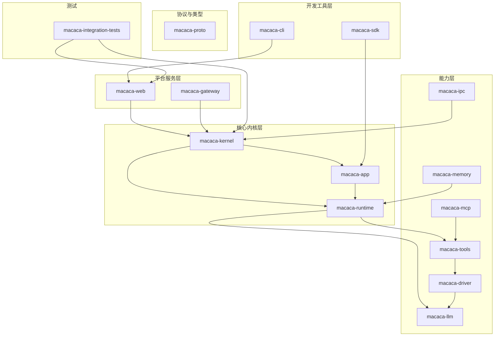
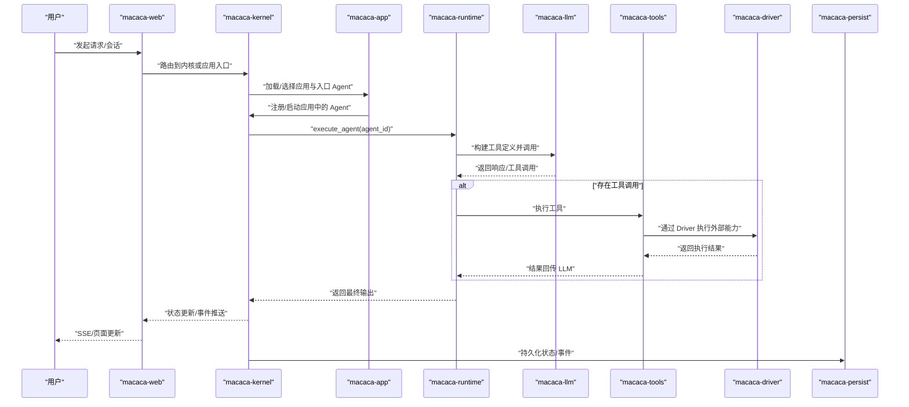
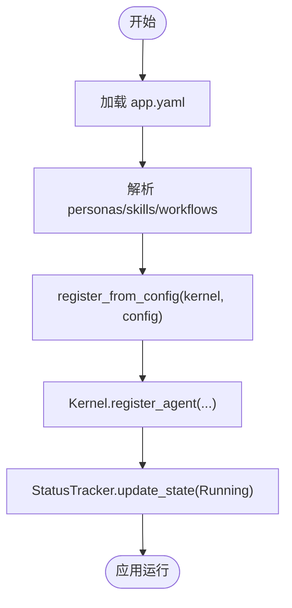
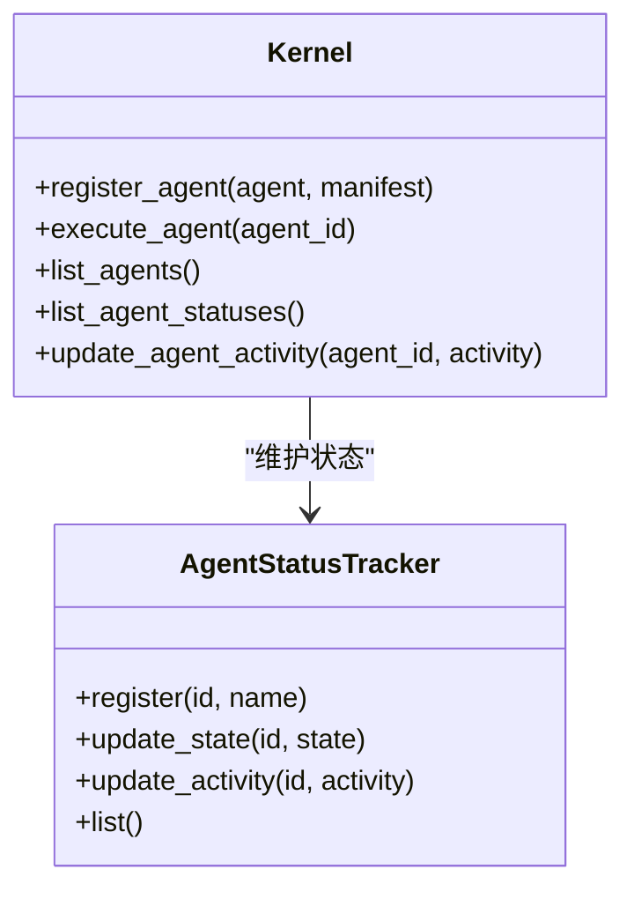
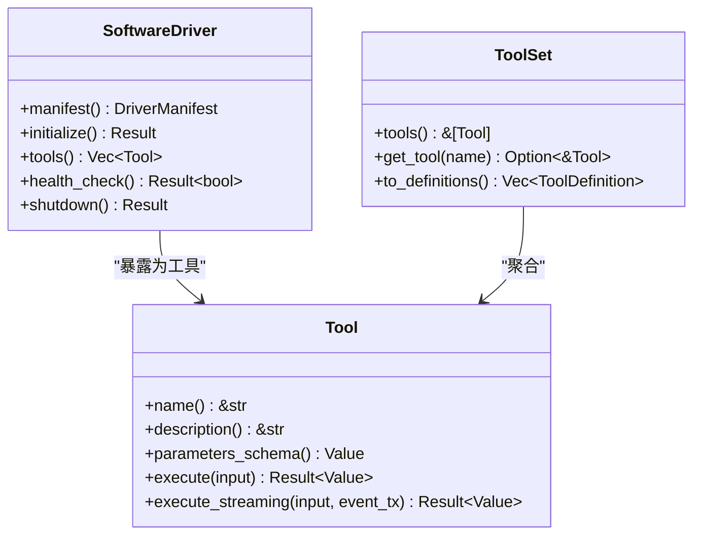
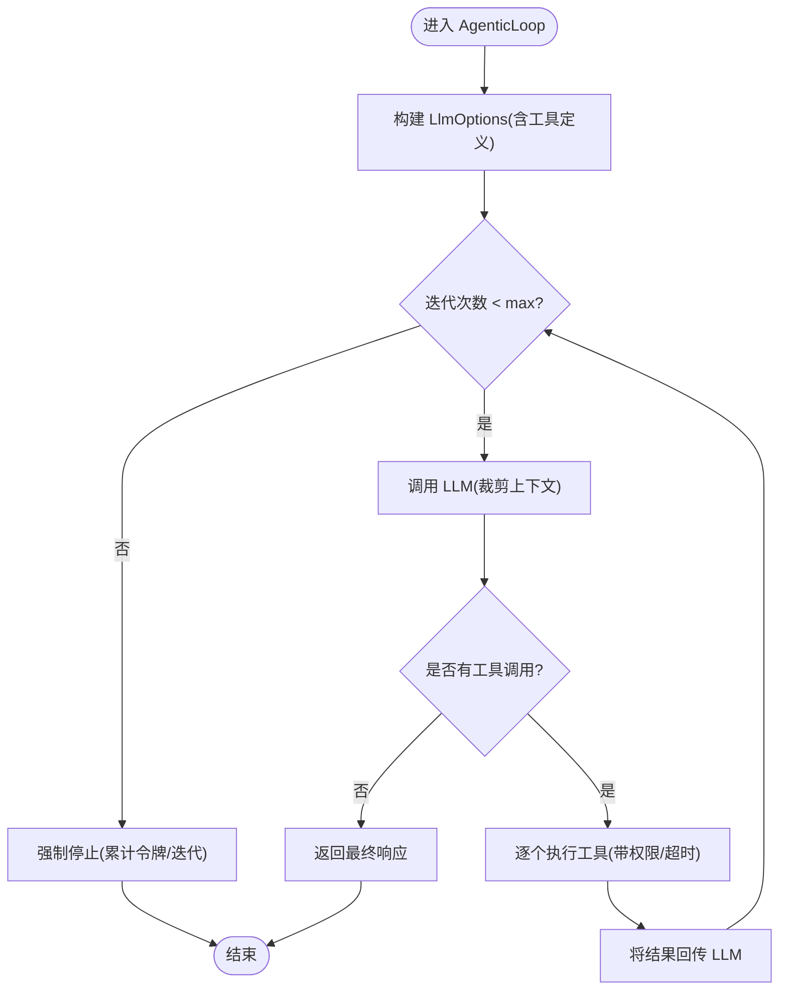
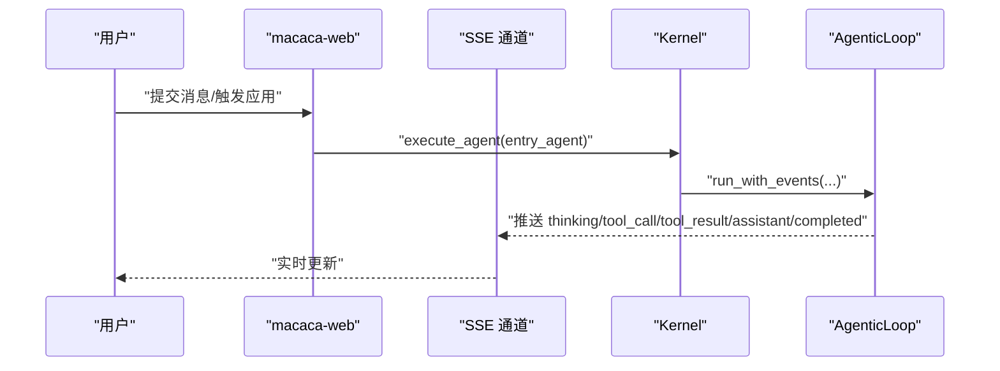
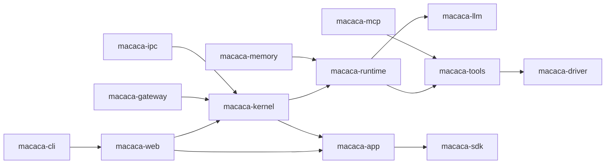

# 系统定义与目标

<cite>
**本文引用的文件**
- [README.md](file://macaca/README.md)
- [ARCHITECTURE-v2.md](file://macaca/ARCHITECTURE-v2.md)
- [SYSTEM_AUDIT.md](file://macaca/docs/SYSTEM_AUDIT.md)
- [Cargo.toml](file://macaca/Cargo.toml)
- [default.toml](file://macaca/config/default.toml)
- [types.rs](file://macaca/crates/macaca-proto/src/types.rs)
- [kernel.rs](file://macaca/crates/macaca-kernel/src/kernel.rs)
- [runtime.rs](file://macaca/crates/macaca-app/src/runtime.rs)
- [agentic_loop.rs](file://macaca/crates/macaca-runtime/src/agentic_loop.rs)
- [routes.rs](file://macaca/crates/macaca-web/src/routes.rs)
- [driver.rs](file://macaca/crates/macaca-driver/src/driver.rs)
- [tool.rs](file://macaca/crates/macaca-tools/src/tool.rs)
- [app-manifest.yaml](file://macaca/examples/todo-app-demo/app-manifest.yaml)
- [AGENTS.md](file://openspec/AGENTS.md)
</cite>

## 目录
1. [简介](#简介)
2. [项目结构](#项目结构)
3. [核心组件](#核心组件)
4. [架构总览](#架构总览)
5. [详细组件分析](#详细组件分析)
6. [依赖关系分析](#依赖关系分析)
7. [性能考量](#性能考量)
8. [故障排查指南](#故障排查指南)
9. [结论](#结论)
10. [附录](#附录)

## 简介
本文件为 Macaca Agent OS 的系统定义与目标文档，面向初学者与有经验的开发者，系统阐述以下要点：
- Macaca 的定位：面向真实多 Agent 应用的“Agent 操作系统”，负责 Application 发现与运行、Agent 调度、Driver/Tool 能力聚合，并通过 Web/Gateway/持久化层暴露任务执行链路、状态与审计证据。
- 核心价值主张：区别于传统被动 Agent 系统，Macaca 强调“7×24 小时自动规划、自动执行、自我唤醒、尽量少依赖人工干预”的主动执行理念，承载持续运行的 Agent 执行循环，而非一次性对话式助手。
- 设计边界与应用场景：通过声明式应用（L3）、原生 Rust（L1）与未来 WASM（L2）三种开发方式，支持从简单聊天到复杂工作流编排的多样化场景。
- 关键机制：Application 发现与运行、Agent 调度策略、Driver/Tool 能力聚合、状态追踪与可观测性、事件日志与审计。

**章节来源**
- [README.md:1-29](file://macaca/README.md#L1-L29)

## 项目结构
仓库采用 Rust Workspace 组织，核心模块按职责分层：
- 协议与类型：macaca-proto（统一标识、状态、消息、事件等）
- LLM 抽象：macaca-llm（多提供商路由、限流、成本追踪）
- 记忆系统：macaca-memory（会话/文件/向量三层）
- 工具系统：macaca-tools（内置工具与编排）
- 驱动框架：macaca-driver（抽象软件驱动，聚合为 Tool）
- 内核：macaca-kernel（Agent 注册、调度、状态追踪）
- 应用运行时：macaca-app（应用生命周期、工作流引擎）
- 运行时：macaca-runtime（AgenticLoop、上下文窗口、循环检测）
- 网关与 Web：macaca-web（HTTP/SSE、会话与事件持久化）
- 网关适配：macaca-gateway（IM 适配器）
- IPC：macaca-ipc（Pub/Sub/P2P/RPC）
- MCP：macaca-mcp（MCP 协议适配）
- SDK：macaca-sdk（声明式 Agent 构建）
- CLI：macaca-cli（命令行入口）
- 集成测试：macaca-integration-tests

**图表来源**
- [Cargo.toml:1-25](file://macaca/Cargo.toml#L1-L25)
- [ARCHITECTURE-v2.md:18-275](file://macaca/ARCHITECTURE-v2.md#L18-L275)

**章节来源**
- [Cargo.toml:1-90](file://macaca/Cargo.toml#L1-L90)
- [ARCHITECTURE-v2.md:16-275](file://macaca/ARCHITECTURE-v2.md#L16-L275)

## 核心组件
- Agent OS 定位与原则
  - Agent 操作系统：管理 Agent、运行 Application、提供 Agent 能力接口。
  - 设计原则：任何软件都可以通过 Driver 被 Agent 操控。
- Application 发现与运行
  - 通过 AppRuntime 加载 app.yaml，解析 personas/skills/workflows，注册 Agent 并启动。
- Agent 调度与执行
  - Kernel 负责注册、调度、状态追踪；AgenticLoop 驱动 LLM→工具→LLM 的循环。
- 能力聚合
  - Driver 将外部软件抽象为 Tool，ToolSet 聚合多 Driver 的能力，LLM 通过工具定义调用。
- 可观测性与审计
  - AgentStatusTracker、EventLog、SSE 流、持久化存储（redb）共同构成可观测性底座。

**章节来源**
- [ARCHITECTURE-v2.md:5-14](file://macaca/ARCHITECTURE-v2.md#L5-L14)
- [runtime.rs:29-88](file://macaca/crates/macaca-app/src/runtime.rs#L29-L88)
- [kernel.rs:40-136](file://macaca/crates/macaca-kernel/src/kernel.rs#L40-L136)
- [agentic_loop.rs:61-278](file://macaca/crates/macaca-runtime/src/agentic_loop.rs#L61-L278)
- [driver.rs:34-61](file://macaca/crates/macaca-driver/src/driver.rs#L34-L61)
- [tool.rs:22-65](file://macaca/crates/macaca-tools/src/tool.rs#L22-L65)

## 架构总览
下图展示从用户交互到 Agent 执行的端到端链路，强调“持续运行的 Agent 执行循环”与“工作流编排”的关系。

**图表来源**
- [ARCHITECTURE-v2.md:281-386](file://macaca/ARCHITECTURE-v2.md#L281-L386)
- [kernel.rs:62-84](file://macaca/crates/macaca-kernel/src/kernel.rs#L62-L84)
- [agentic_loop.rs:214-278](file://macaca/crates/macaca-runtime/src/agentic_loop.rs#L214-L278)
- [routes.rs:44-150](file://macaca/crates/macaca-web/src/routes.rs#L44-L150)

## 详细组件分析

### Agent OS 定位与核心理念
- 主动执行 vs 被动助手
  - 传统系统：一次性对话式助手，交互驱动。
  - Macaca：7×24 自动规划/执行/自我唤醒，承载持续运行的 Agent 执行循环。
- 设计边界
  - 任何软件均可通过 Driver 被 Agent 控制；可插拔的记忆、LLM、Driver、Gateway。
  - 多语言支持：L3 声明式、L1 原生、L2 WASM（计划中）。
  - 多平台接入：Web、Telegram、Discord 等 IM。

**章节来源**
- [README.md:3-5](file://macaca/README.md#L3-L5)
- [ARCHITECTURE-v2.md:5-14](file://macaca/ARCHITECTURE-v2.md#L5-L14)

### Application 发现与运行机制
- 发现与加载
  - AppRuntime 从 app.yaml 解析应用清单，加载 personas/skills/workflows。
  - 通过 SDK 的 register_from_config 将 Agent 注册到 Kernel。
- 生命周期
  - start_app → 注册 Agent → 状态 Running；stop_app → 取消注册；remove_app → 清理。
- 示例
  - 示例应用 todo-app-demo 包含两个 Agent 的声明。

**图表来源**
- [runtime.rs:29-88](file://macaca/crates/macaca-app/src/runtime.rs#L29-L88)
- [app-manifest.yaml:1-7](file://macaca/examples/todo-app-demo/app-manifest.yaml#L1-L7)

**章节来源**
- [runtime.rs:29-88](file://macaca/crates/macaca-app/src/runtime.rs#L29-L88)
- [app-manifest.yaml:1-7](file://macaca/examples/todo-app-demo/app-manifest.yaml#L1-L7)

### Agent 调度策略与状态追踪
- Kernel 职责
  - 注册/注销 Agent、执行 Agent、维护 Agent 状态与活动。
  - 通过 AgentStatusTracker 记录 AgentState 与 AgentActivity。
- 调度与负载
  - 提供调度器接口，当前实现为 SimpleScheduler；可扩展为优先级/负载均衡策略。
- 状态可视化
  - Web 通过 SSE 推送状态变更，前端 AgentPanel 实时刷新。

**图表来源**
- [kernel.rs:16-136](file://macaca/crates/macaca-kernel/src/kernel.rs#L16-L136)

**章节来源**
- [kernel.rs:40-136](file://macaca/crates/macaca-kernel/src/kernel.rs#L40-L136)
- [routes.rs:152-200](file://macaca/crates/macaca-web/src/routes.rs#L152-L200)

### Driver/Tool 能力聚合
- Driver 抽象
  - SoftwareDriver 定义驱动元数据、初始化、工具暴露、健康检查、优雅关闭。
  - DriverType 支持 CLI、REST、UI 自动化、文件/IPC、MCP 协议。
- Tool 聚合
  - Tool/ToolSet 提供统一工具接口；AgenticLoop 将 ToolSet 转换为 LLM 工具定义。
  - Driver 将外部软件能力映射为 Tool，实现“任何软件均可被 Agent 控制”。

**图表来源**
- [driver.rs:34-61](file://macaca/crates/macaca-driver/src/driver.rs#L34-L61)
- [tool.rs:22-65](file://macaca/crates/macaca-tools/src/tool.rs#L22-L65)

**章节来源**
- [driver.rs:34-61](file://macaca/crates/macaca-driver/src/driver.rs#L34-L61)
- [tool.rs:22-65](file://macaca/crates/macaca-tools/src/tool.rs#L22-L65)

### AgenticLoop 执行循环与事件流
- 核心循环
  - LLM 请求 → 工具调用 → 工具执行 → 结果回传 → 继续循环，直至无工具调用或达到最大迭代。
- 事件与可观测性
  - 支持事件通道（SSE）推送 thinking/tool_call/tool_result/assistant/completed 等事件。
  - 集成循环检测、上下文窗口管理、权限校验与超时控制。
- 可暂停/恢复
  - PausableAgenticLoop 支持暂停/恢复，配合 Fork-Join 工作流。

**图表来源**
- [agentic_loop.rs:214-278](file://macaca/crates/macaca-runtime/src/agentic_loop.rs#L214-L278)
- [agentic_loop.rs:350-461](file://macaca/crates/macaca-runtime/src/agentic_loop.rs#L350-L461)

**章节来源**
- [agentic_loop.rs:61-278](file://macaca/crates/macaca-runtime/src/agentic_loop.rs#L61-L278)
- [agentic_loop.rs:513-715](file://macaca/crates/macaca-runtime/src/agentic_loop.rs#L513-L715)

### Web/Gateway 与用户交互
- Web 服务器
  - 提供应用列表、Agent 状态查询、SSE 事件流、会话与事件持久化。
- Gateway
  - 支持 Telegram/Discord 等 IM，事件类型包括 TaskRequest、StatusQuery、UserReply、Command。
- 配置
  - default.toml 提供 LLM、内存、IPC、网关、可观测性等配置项。

**图表来源**
- [routes.rs:44-150](file://macaca/crates/macaca-web/src/routes.rs#L44-L150)
- [default.toml:1-119](file://macaca/config/default.toml#L1-L119)

**章节来源**
- [routes.rs:1-200](file://macaca/crates/macaca-web/src/routes.rs#L1-L200)
- [default.toml:1-119](file://macaca/config/default.toml#L1-L119)

### 核心类型与协议
- 标识与状态
  - AgentId、TaskId、ApplicationId、ForkId 等统一标识；AgentState、AgentActivity、ForkState 等运行时状态。
- 任务与工作板
  - Task、TodoItem、TodoGoal、TodoStatus 等支撑任务分解、执行与评审。
- 事件与消息
  - LlmMessage、LlmResponse、ToolCall、ToolDefinition、IpcMessage、GatewayEvent 等。
- 事件日志
  - EventEntry 记录执行阶段与来源，支持审计与回放。

**章节来源**
- [types.rs:7-131](file://macaca/crates/macaca-proto/src/types.rs#L7-L131)
- [types.rs:156-262](file://macaca/crates/macaca-proto/src/types.rs#L156-L262)
- [types.rs:300-528](file://macaca/crates/macaca-proto/src/types.rs#L300-L528)
- [types.rs:556-614](file://macaca/crates/macaca-proto/src/types.rs#L556-L614)
- [types.rs:779-800](file://macaca/crates/macaca-proto/src/types.rs#L779-L800)

## 依赖关系分析
- 模块耦合与内聚
  - Kernel 与 App/Runtime 紧密协作，Kernel 仅持有抽象接口（LlmProvider、ToolSet），便于替换。
  - Web 通过 AppState 聚合 Kernel/App/Runtime，但存在巨大 routes.rs 与 AppState God Object 的重构风险。
- 外部依赖与集成点
  - LLM 提供商（OpenAI、Anthropic、DashScope 等）通过 macaca-llm 抽象接入。
  - IPC 默认 NATS，可替换；MCP/Memory 等模块尚未完全接入主执行路径。
- 潜在循环依赖
  - 当前未见直接循环依赖；需关注 routes.rs 与业务逻辑耦合导致的隐式循环。

**图表来源**
- [Cargo.toml:1-25](file://macaca/Cargo.toml#L1-L25)
- [SYSTEM_AUDIT.md:16-21](file://macaca/docs/SYSTEM_AUDIT.md#L16-L21)

**章节来源**
- [Cargo.toml:1-90](file://macaca/Cargo.toml#L1-L90)
- [SYSTEM_AUDIT.md:38-61](file://macaca/docs/SYSTEM_AUDIT.md#L38-L61)

## 性能考量
- 循环与上下文
  - AgenticLoop 通过 ContextWindowManager 控制上下文长度，避免超出模型上下文窗口。
- 超时与安全
  - 工具执行超时（默认 60 秒）、循环检测（防止死循环）、权限校验（路径/网络访问）。
- 可观测性与成本
  - LLM 使用追踪、成本估算、事件日志持久化，便于性能与成本分析。
- 重构建议
  - 拆分 routes.rs、精简 AppState、消除重复类型（TaskId/DelegatedTask）、提取共享循环逻辑、接入未使用模块（memory/ipc/mcp/gateway）。

**章节来源**
- [agentic_loop.rs:22-38](file://macaca/crates/macaca-runtime/src/agentic_loop.rs#L22-L38)
- [agentic_loop.rs:423-440](file://macaca/crates/macaca-runtime/src/agentic_loop.rs#L423-L440)
- [SYSTEM_AUDIT.md:159-230](file://macaca/docs/SYSTEM_AUDIT.md#L159-L230)

## 故障排查指南
- 常见问题与修复
  - Chat 绕过 Agent 系统：post_chat 直接调用 llm.chat 导致状态始终 IDLE。修复方案：通过 Coordinator Agent 处理请求，使用 AgenticLoop 执行。
  - Agent 状态更新不完整：仅 execute_agent 会更新状态，Agent 内部活动未细粒度上报。修复：在 AgenticLoop 中添加状态更新钩子或回调。
  - Workflow 引擎未集成：app.yaml 中定义了 workflow，但 chat 未触发。修复：实现 WorkflowEngine 并在入口处触发。
- 审计与可观测性
  - 使用 EventLog 与 SSE 事件流定位问题；检查 Kernel 状态与 AgentStatusTracker。
  - 查看 default.toml 中的日志级别与 OTLP 配置，启用调试追踪。

**章节来源**
- [ARCHITECTURE-v2.md:569-600](file://macaca/ARCHITECTURE-v2.md#L569-L600)
- [SYSTEM_AUDIT.md:95-122](file://macaca/docs/SYSTEM_AUDIT.md#L95-L122)
- [default.toml:106-119](file://macaca/config/default.toml#L106-L119)

## 结论
Macaca Agent OS 以“主动执行、持续运行”为核心理念，通过分层架构与可插拔设计，将任意软件通过 Driver 聚合为 Agent 能力，实现从简单聊天到复杂工作流的全栈自动化。当前实现已具备坚实基础，但存在路由与状态管理的耦合风险与部分模块未完全接入的问题。建议优先拆分 routes.rs、消除重复类型、接入记忆/IPC/MCP/Gateway 等模块，以强化可观测性与可维护性，确保系统长期演进。

## 附录
- 开发规范与 OpenSpec
  - 使用 OpenSpec 进行变更提案、任务清单与设计文档的规范化管理，遵循严格验证与归档流程。

**章节来源**
- [AGENTS.md:143-347](file://openspec/AGENTS.md#L143-L347)