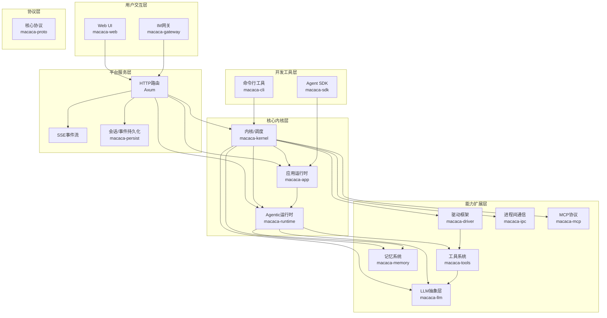
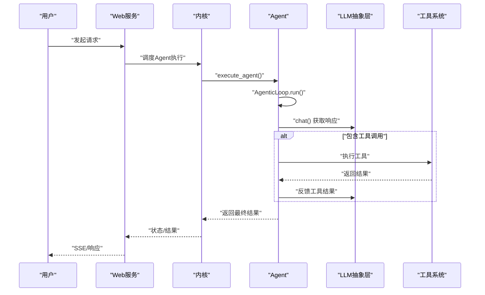
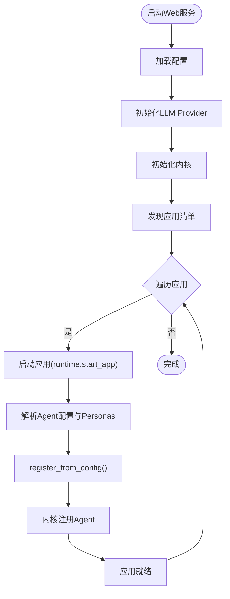
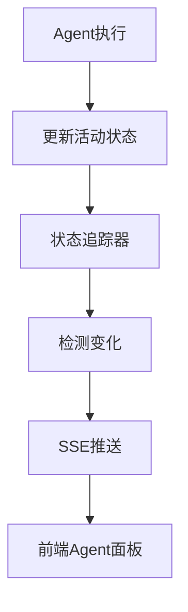
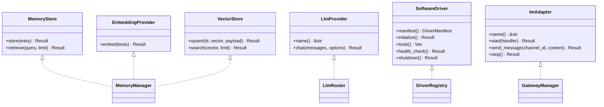
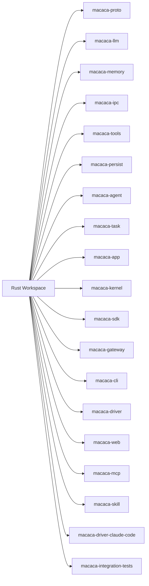

# 项目概述

<cite>
**本文档引用的文件**
- [README.md](file://macaca/README.md)
- [Cargo.toml](file://macaca/Cargo.toml)
- [ARCHITECTURE-v2.md](file://macaca/ARCHITECTURE-v2.md)
- [SYSTEM_OVERVIEW.md](file://macaca/docs/SYSTEM_OVERVIEW.md)
- [SYSTEM_AUDIT.md](file://macaca/docs/SYSTEM_AUDIT.md)
- [default.toml](file://macaca/config/default.toml)
- [lib.rs](file://macaca/crates/macaca-agent/src/lib.rs)
- [lib.rs](file://macaca/crates/macaca-kernel/src/lib.rs)
- [lib.rs](file://macaca/crates/macaca-runtime/src/lib.rs)
- [lib.rs](file://macaca/crates/macaca-app/src/lib.rs)
- [lib.rs](file://macaca/crates/macaca-web/src/lib.rs)
- [README.md](file://macaca/examples/todo-app-demo/README.md)
- [README.md](file://macaca/examples/custom-agent-yaml/README.md)
- [AGENTS.md](file://AGENTS.md)
</cite>

## 目录
1. [简介](#简介)
2. [项目结构](#项目结构)
3. [核心组件](#核心组件)
4. [架构总览](#架构总览)
5. [详细组件分析](#详细组件分析)
6. [依赖分析](#依赖分析)
7. [性能考虑](#性能考虑)
8. [故障排查指南](#故障排查指南)
9. [结论](#结论)
10. [附录](#附录)

## 简介
Macaca Agent操作系统是一个面向真实多Agent应用的“Agent OS”。它不是一次性对话助手，而是一个7×24小时持续运行、可自动规划与执行、具备自我唤醒能力的主动执行系统。其核心价值主张包括：
- 统一发现与运行Application，注册、调度与协调Agent，聚合Driver/Tool能力
- 通过Web/Gateway/持久化层将执行链路、状态与审计证据暴露出来
- 支持即时委派与目标级任务的闭环执行，具备可观测性与可审计性
- 采用可插拔架构，支持多Provider、多Gateway、多Driver与多记忆后端

与传统Agent相比，Macaca Agent OS强调：
- 主动性：围绕目标持续推进，而非等待人类触发
- 可扩展性：模块边界清晰，能力可插拔替换
- 可观测性：端到端执行链路、状态与审计事件可追踪
- 可配置性：入口Agent、编排与工作流尽量来自配置与清单

章节来源
- [README.md:1-29](file://macaca/README.md#L1-L29)
- [SYSTEM_OVERVIEW.md:10-24](file://macaca/docs/SYSTEM_OVERVIEW.md#L10-L24)

## 项目结构
仓库采用Rust工作区组织，核心模块按职责分层：
- 协议与共享类型：macaca-proto
- 模型抽象层：macaca-llm
- 记忆系统：macaca-memory
- 进程间通信：macaca-ipc
- 工具系统：macaca-tools
- 持久化层：macaca-persist
- Agent框架：macaca-agent
- 任务系统：macaca-task
- 应用运行时：macaca-app
- 内核与调度：macaca-kernel
- SDK与声明式开发：macaca-sdk
- 网关适配：macaca-gateway
- 命令行工具：macaca-cli
- 驱动框架：macaca-driver
- Web服务：macaca-web
- MCP协议支持：macaca-mcp
- 技能系统：macaca-skill
- 驱动扩展：macaca-driver-claude-code
- 集成测试：macaca-integration-tests

章节来源
- [Cargo.toml:1-25](file://macaca/Cargo.toml#L1-L25)
- [ARCHITECTURE-v2.md:16-275](file://macaca/ARCHITECTURE-v2.md#L16-L275)

## 核心组件
- Agent OS内核（macaca-kernel）：负责Agent注册、执行、状态追踪、调度与审计
- 应用运行时（macaca-app）：发现应用、加载清单/角色/工作流、启动应用
- Agentic运行时（macaca-runtime）：驱动AgenticLoop、LLM调用、工具执行与循环控制
- 工具系统（macaca-tools）：聚合内置工具与可执行技能工具
- 驱动框架（macaca-driver）：将Shell、文件系统、Claude Code等能力暴露为可调用接口
- 记忆系统（macaca-memory）：三层记忆架构（会话/文件/向量），支持可插拔嵌入与向量存储
- LLM抽象层（macaca-llm）：对接多Provider、路由、降级、成本/速率控制
- 网关（macaca-gateway）：Telegram/Discord等IM适配入口
- Web服务（macaca-web）：Axum HTTP服务、SSE流、聊天编排与会话管理
- 协议（macaca-proto）：统一配置、错误、共享类型与编排协议
- IPC/MCP/SDK：进程间通信、MCP协议支持、Agent SDK与声明式开发

章节来源
- [SYSTEM_OVERVIEW.md:70-86](file://macaca/docs/SYSTEM_OVERVIEW.md#L70-L86)
- [lib.rs:1-29](file://macaca/crates/macaca-kernel/src/lib.rs#L1-L29)
- [lib.rs:1-21](file://macaca/crates/macaca-app/src/lib.rs#L1-L21)
- [lib.rs:1-15](file://macaca/crates/macaca-runtime/src/lib.rs#L1-L15)
- [lib.rs](file://macaca/crates/macaca-tools/src/lib.rs)
- [lib.rs](file://macaca/crates/macaca-driver/src/lib.rs)
- [lib.rs](file://macaca/crates/macaca-memory/src/lib.rs)
- [lib.rs](file://macaca/crates/macaca-llm/src/lib.rs)
- [lib.rs](file://macaca/crates/macaca-gateway/src/lib.rs)
- [lib.rs:1-663](file://macaca/crates/macaca-web/src/lib.rs#L1-L663)
- [lib.rs](file://macaca/crates/macaca-proto/src/lib.rs)

## 架构总览
下图展示了Macaca OS的分层架构与关键组件交互：

图表来源
- [ARCHITECTURE-v2.md:16-275](file://macaca/ARCHITECTURE-v2.md#L16-L275)
- [lib.rs:608-647](file://macaca/crates/macaca-web/src/lib.rs#L608-L647)
- [lib.rs:1-29](file://macaca/crates/macaca-kernel/src/lib.rs#L1-L29)

章节来源
- [ARCHITECTURE-v2.md:16-275](file://macaca/ARCHITECTURE-v2.md#L16-L275)
- [SYSTEM_OVERVIEW.md:87-118](file://macaca/docs/SYSTEM_OVERVIEW.md#L87-L118)

## 详细组件分析

### Agent执行循环（AgenticLoop）
AgenticLoop是Agent执行的核心循环，负责：
- LLM对话与工具调用
- 工具执行与结果反馈
- 循环终止条件与最大迭代控制
- 状态更新与事件广播

图表来源
- [ARCHITECTURE-v2.md:361-386](file://macaca/ARCHITECTURE-v2.md#L361-L386)
- [lib.rs](file://macaca/crates/macaca-runtime/src/lib.rs#L11)

章节来源
- [ARCHITECTURE-v2.md:361-386](file://macaca/ARCHITECTURE-v2.md#L361-L386)
- [lib.rs:1-15](file://macaca/crates/macaca-runtime/src/lib.rs#L1-L15)

### 应用启动与注册流程
应用启动流程包括：
- 发现应用清单
- 解析Persona与Agent配置
- 从配置注册Agent
- 初始化应用执行器与工作空间
- 自动恢复任务与启动计划/工作循环

图表来源
- [ARCHITECTURE-v2.md:281-317](file://macaca/ARCHITECTURE-v2.md#L281-L317)
- [lib.rs:141-174](file://macaca/crates/macaca-web/src/lib.rs#L141-L174)

章节来源
- [ARCHITECTURE-v2.md:281-317](file://macaca/ARCHITECTURE-v2.md#L281-L317)
- [lib.rs:133-174](file://macaca/crates/macaca-web/src/lib.rs#L133-L174)

### 状态追踪与可观测性
状态追踪通过AgentStatusTracker与SSE事件流实现：
- Agent状态变更（思考/执行工具/空闲等）
- 会话事件与任务状态
- 前端实时更新

图表来源
- [ARCHITECTURE-v2.md:388-404](file://macaca/ARCHITECTURE-v2.md#L388-L404)

章节来源
- [ARCHITECTURE-v2.md:388-404](file://macaca/ARCHITECTURE-v2.md#L388-L404)

### 可插拔架构设计
- 记忆系统：MemoryStore、EmbeddingProvider、VectorStore可插拔
- LLM Provider：OpenAI、Anthropic、DashScope等
- Driver：Shell、文件系统、Claude Code等
- Gateway：Telegram、Discord等IM适配
- Agent上下文：MemoryService、IpcService、PersistService注入

图表来源
- [ARCHITECTURE-v2.md:408-491](file://macaca/ARCHITECTURE-v2.md#L408-L491)

章节来源
- [ARCHITECTURE-v2.md:408-491](file://macaca/ARCHITECTURE-v2.md#L408-L491)

## 依赖分析
- 工作区成员按功能域划分，避免交叉耦合
- 共享依赖集中在workspace.dependencies，统一版本与特性
- 核心类型与错误定义集中在macaca-proto，确保跨crate一致性
- Web服务依赖内核、应用运行时、工具系统与持久化层

图表来源
- [Cargo.toml:1-25](file://macaca/Cargo.toml#L1-L25)

章节来源
- [Cargo.toml:1-90](file://macaca/Cargo.toml#L1-L90)

## 性能考虑
- 异步运行时与并发：Tokio全栈异步，支持高并发请求与任务执行
- LLM调用优化：重试、速率限制、成本追踪与降级策略
- 工具执行超时与资源限制：防止阻塞与资源耗尽
- 状态与事件持久化：Redb存储与事件日志，平衡性能与可靠性
- SSE流与前端渲染：减少不必要的刷新，提升用户体验

## 故障排查指南
常见问题与修复建议：
- Chat绕过Agent系统：修复post_chat路由，使其通过Coordinator Agent与AgenticLoop执行
- Agent状态不更新：在AgenticLoop中增加状态更新钩子或回调
- Workflow引擎未集成：实现WorkflowEngine并与chat流程集成
- 硬编码与重复类型：消除coordinator硬编码，合并TaskId/DelegatedTask等重复类型
- 巨型文件与God Object：拆分routes.rs，精简AppState

章节来源
- [SYSTEM_AUDIT.md:124-230](file://macaca/docs/SYSTEM_AUDIT.md#L124-L230)
- [ARCHITECTURE-v2.md:567-601](file://macaca/ARCHITECTURE-v2.md#L567-L601)

## 结论
Macaca Agent OS通过清晰的分层架构与可插拔设计，构建了一个具备主动性、可观测性与可扩展性的Agent操作系统。当前实现已具备两条可见执行路径（即时委派与目标级任务），但仍需在Chat流程、状态追踪与Workflow集成方面进一步完善。遵循系统原则与审计建议，可逐步将“目标中的一致执行语义”落地为主执行路径。

## 附录

### 快速开始指南
- 基本概念
  - Agent：可执行的智能体，具备能力与状态
  - Application：由Agent与工作流组成的可运行单元
  - Task：最小执行单元，支持委派与合并
  - Session：用户交互会话，承载事件与状态
- 核心组件概览
  - Web服务：提供HTTP/SSE接口与聊天编排
  - 内核：注册与执行Agent，管理调度与状态
  - 应用运行时：加载应用清单与Agent配置
  - Agentic运行时：驱动LLM与工具执行的循环
  - 工具系统：内置与可执行技能工具
  - 驱动框架：将外部能力暴露为工具
  - 记忆系统：会话/文件/向量三层记忆
  - LLM抽象层：多Provider路由与降级
  - 网关：IM入口适配
  - 协议：共享类型与编排协议
- 应用场景
  - 多Agent协作（Todo应用Demo）
  - 代码审查Agent（声明式Agent示例）
  - 全栈自动开发（Fullstack AutoDev）

章节来源
- [SYSTEM_OVERVIEW.md:87-118](file://macaca/docs/SYSTEM_OVERVIEW.md#L87-L118)
- [README.md:7-29](file://macaca/README.md#L7-L29)
- [default.toml:1-119](file://macaca/config/default.toml#L1-L119)
- [README.md:1-22](file://macaca/examples/todo-app-demo/README.md#L1-L22)
- [README.md:1-16](file://macaca/examples/custom-agent-yaml/README.md#L1-L16)