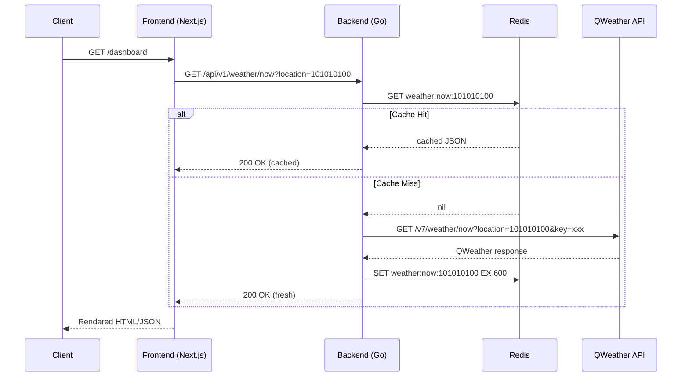

# Beijing Weather Application — Technical Specification

> Version: 1.0.0 | Date: 2026-04-10 | Status: Draft

---

## Table of Contents

1. [System Architecture Overview](#1-system-architecture-overview)
2. [Architecture Diagram](#2-architecture-diagram)
3. [API Endpoint Specifications](#3-api-endpoint-specifications)
4. [Data Models](#4-data-models)
5. [QWeather Integration](#5-qweather-integration)
6. [Technology Stack](#6-technology-stack)
7. [Security Considerations](#7-security-considerations)
8. [Error Handling Specifications](#8-error-handling-specifications)

---

## 1. System Architecture Overview

### 1.1 Design Goals

| Goal | Description |
|------|-------------|
| Low Latency | < 200ms P95 for cached responses, < 1s for upstream fetch |
| High Availability | Graceful degradation when QWeather API is unreachable |
| Cost Efficiency | Aggressive caching to minimize QWeather API quota usage |
| Extensibility | Support additional cities/data sources without code changes |

### 1.2 Core Components

- **Frontend (Next.js)** — SSR/CSR hybrid rendering weather dashboard
- **Backend (Go)** — API gateway with caching, rate limiting, and QWeather proxy
- **Cache Layer (Redis)** — TTL-based weather data caching
- **QWeather API** — Upstream weather data provider (和风天气)

### 1.3 Data Flow

```
User Request → Frontend (Next.js)
  → Backend API (Go, :8080)
    → Redis Cache (hit?) → return cached
    → Cache miss → QWeather API → store in Redis → return
```

### 1.4 Caching Strategy

| Data Type | Cache TTL | Rationale |
|-----------|-----------|-----------|
| Current Weather | 10 min | Balances freshness vs. API quota |
| 7-Day Forecast | 30 min | Forecast updates less frequently |
| Air Quality | 15 min | AQI can change rapidly |
| City Lookup | 24 hr | City metadata is static |

---

## 2. Architecture Diagram

```
┌─────────────────────────────────────────────────────────┐
│                        Client                           │
│                   (Browser / Mobile)                     │
└──────────────────────┬──────────────────────────────────┘
                       │ HTTPS
                       ▼
┌─────────────────────────────────────────────────────────┐
│                 Frontend (Next.js)                       │
│                   Port: 3000                             │
│                                                         │
│  ┌─────────────┐  ┌──────────────┐  ┌───────────────┐  │
│  │  Dashboard   │  │  Forecast    │  │  AQI Panel    │  │
│  │  Page (SSR)  │  │  Component   │  │  Component    │  │
│  └──────┬──────┘  └──────┬───────┘  └──────┬────────┘  │
│         │                │                  │           │
│         └────────────────┼──────────────────┘           │
│                          │                              │
│                ┌─────────▼──────────┐                   │
│                │  API Client Layer  │                    │
│                │  (lib/weather.ts)  │                    │
│                └─────────┬──────────┘                   │
└──────────────────────────┼──────────────────────────────┘
                           │ HTTP (internal)
                           ▼
┌─────────────────────────────────────────────────────────┐
│                  Backend (Go / Gin)                      │
│                    Port: 8080                            │
│                                                         │
│  ┌──────────────────────────────────────────────────┐   │
│  │                 Middleware Stack                   │   │
│  │  ┌──────────┐ ┌───────────┐ ┌─────────────────┐ │   │
│  │  │  CORS    │ │ Rate Limit│ │ Request Logger  │ │   │
│  │  └──────────┘ └───────────┘ └─────────────────┘ │   │
│  └──────────────────────┬───────────────────────────┘   │
│                         │                               │
│  ┌──────────────────────▼───────────────────────────┐   │
│  │                Route Handlers                     │   │
│  │  ┌──────────┐ ┌───────────┐ ┌─────────────────┐ │   │
│  │  │ /weather │ │ /forecast │ │ /air-quality    │ │   │
│  │  │ /now     │ │ /7d       │ │ /current        │ │   │
│  │  └────┬─────┘ └─────┬─────┘ └───────┬─────────┘ │   │
│  └───────┼──────────────┼───────────────┼───────────┘   │
│          │              │               │               │
│  ┌───────▼──────────────▼───────────────▼───────────┐   │
│  │              Weather Service                      │   │
│  │  ┌────────────────┐  ┌─────────────────────────┐ │   │
│  │  │  Cache Manager │  │  QWeather Client        │ │   │
│  │  │  (Redis)       │  │  (HTTP + retry)         │ │   │
│  │  └───────┬────────┘  └────────────┬────────────┘ │   │
│  └──────────┼────────────────────────┼──────────────┘   │
└─────────────┼────────────────────────┼──────────────────┘
              │                        │
              ▼                        ▼
┌─────────────────────┐  ┌────────────────────────────┐
│   Redis              │  │   QWeather API             │
│   Port: 6379         │  │   devapi.qweather.com      │
│                      │  │                            │
│  Keys:               │  │  Endpoints:                │
│  weather:now:{loc}   │  │  /v7/weather/now           │
│  weather:7d:{loc}    │  │  /v7/weather/7d            │
│  air:now:{loc}       │  │  /v7/air/now               │
│  geo:lookup:{q}      │  │  /v7/geo/lookup (GeoAPI)   │
└─────────────────────┘  └────────────────────────────┘
```

### Mermaid Sequence Diagram



---

## 3. API Endpoint Specifications

### 3.1 Base URL

```
Development: http://localhost:8080/api/v1
Production:  https://api.example.com/api/v1
```

### 3.2 Common Headers

| Header | Value | Required |
|--------|-------|----------|
| `Content-Type` | `application/json` | Yes |
| `X-Request-ID` | UUID v4 | Auto-generated by backend |
| `X-Cache-Status` | `HIT` / `MISS` | Response only |

### 3.3 Endpoints

#### `GET /api/v1/weather/now`

Real-time weather for a location.

**Query Parameters:**

| Param | Type | Required | Default | Description |
|-------|------|----------|---------|-------------|
| `location` | string | Yes | — | QWeather location ID or `lng,lat` |
| `lang` | string | No | `zh` | Response language (`zh`, `en`) |
| `unit` | string | No | `m` | Unit system: `m` (metric), `i` (imperial) |

**Response: `200 OK`**

```json
{
  "code": 0,
  "message": "ok",
  "data": {
    "location": {
      "id": "101010100",
      "name": "北京",
      "lat": 39.904,
      "lon": 116.405
    },
    "now": {
      "observedAt": "2026-04-10T14:30+08:00",
      "temp": 22,
      "feelsLike": 20,
      "icon": "100",
      "text": "晴",
      "wind360": 225,
      "windDir": "西南风",
      "windScale": "3",
      "windSpeed": 16,
      "humidity": 35,
      "precip": 0.0,
      "pressure": 1012,
      "visibility": 25,
      "cloud": 10,
      "dew": 6
    },
    "updatedAt": "2026-04-10T14:35+08:00",
    "source": "qweather"
  },
  "meta": {
    "requestId": "a1b2c3d4-e5f6-7890-abcd-ef1234567890",
    "cacheStatus": "MISS",
    "latencyMs": 230
  }
}
```

#### `GET /api/v1/weather/forecast`

7-day weather forecast.

**Query Parameters:**

| Param | Type | Required | Default | Description |
|-------|------|----------|---------|-------------|
| `location` | string | Yes | — | QWeather location ID |
| `lang` | string | No | `zh` | Response language |
| `unit` | string | No | `m` | Unit system |

**Response: `200 OK`**

```json
{
  "code": 0,
  "message": "ok",
  "data": {
    "location": {
      "id": "101010100",
      "name": "北京",
      "lat": 39.904,
      "lon": 116.405
    },
    "daily": [
      {
        "date": "2026-04-10",
        "sunrise": "05:48",
        "sunset": "18:45",
        "moonrise": "15:20",
        "moonset": "03:45",
        "moonPhase": "盈凸月",
        "tempMax": 24,
        "tempMin": 12,
        "iconDay": "100",
        "textDay": "晴",
        "iconNight": "150",
        "textNight": "晴",
        "wind360Day": 225,
        "windDirDay": "西南风",
        "windScaleDay": "3-4",
        "windSpeedDay": 20,
        "wind360Night": 180,
        "windDirNight": "南风",
        "windScaleNight": "1-2",
        "windSpeedNight": 8,
        "humidity": 40,
        "precip": 0.0,
        "pressure": 1010,
        "visibility": 25,
        "cloud": 15,
        "uvIndex": 6
      }
    ],
    "updatedAt": "2026-04-10T12:00+08:00",
    "source": "qweather"
  },
  "meta": {
    "requestId": "b2c3d4e5-f6a7-8901-bcde-f12345678901",
    "cacheStatus": "HIT",
    "latencyMs": 5
  }
}
```

#### `GET /api/v1/air-quality/now`

Current air quality index.

**Query Parameters:**

| Param | Type | Required | Default | Description |
|-------|------|----------|---------|-------------|
| `location` | string | Yes | — | QWeather location ID |
| `lang` | string | No | `zh` | Response language |

**Response: `200 OK`**

```json
{
  "code": 0,
  "message": "ok",
  "data": {
    "location": {
      "id": "101010100",
      "name": "北京",
      "lat": 39.904,
      "lon": 116.405
    },
    "aqi": {
      "publishedAt": "2026-04-10T14:00+08:00",
      "aqi": 75,
      "level": "2",
      "category": "良",
      "primary": "PM2.5",
      "pm10": 88,
      "pm2p5": 55,
      "no2": 32,
      "so2": 8,
      "co": 0.7,
      "o3": 120
    },
    "updatedAt": "2026-04-10T14:15+08:00",
    "source": "qweather"
  },
  "meta": {
    "requestId": "c3d4e5f6-a7b8-9012-cdef-123456789012",
    "cacheStatus": "MISS",
    "latencyMs": 310
  }
}
```

#### `GET /api/v1/health`

Backend health check.

**Response: `200 OK`**

```json
{
  "status": "healthy",
  "version": "1.0.0",
  "uptime": 86400,
  "dependencies": {
    "redis": "connected",
    "qweather": "reachable"
  }
}
```

---

## 4. Data Models

### 4.1 Go Backend Structs

```go
package model

import "time"

// --- API Response Envelope ---

type APIResponse[T any] struct {
    Code    int       `json:"code"`
    Message string    `json:"message"`
    Data    T         `json:"data,omitempty"`
    Meta    *MetaInfo `json:"meta,omitempty"`
}

type MetaInfo struct {
    RequestID   string `json:"requestId"`
    CacheStatus string `json:"cacheStatus"` // "HIT" | "MISS"
    LatencyMs   int64  `json:"latencyMs"`
}

type APIError struct {
    Code    int    `json:"code"`
    Message string `json:"message"`
    Detail  string `json:"detail,omitempty"`
}

// --- Location ---

type Location struct {
    ID   string  `json:"id"`
    Name string  `json:"name"`
    Lat  float64 `json:"lat"`
    Lon  float64 `json:"lon"`
}

// --- Current Weather ---

type WeatherNowResponse struct {
    Location  Location    `json:"location"`
    Now       WeatherNow  `json:"now"`
    UpdatedAt time.Time   `json:"updatedAt"`
    Source    string      `json:"source"`
}

type WeatherNow struct {
    ObservedAt string  `json:"observedAt"`
    Temp       int     `json:"temp"`
    FeelsLike  int     `json:"feelsLike"`
    Icon       string  `json:"icon"`
    Text       string  `json:"text"`
    Wind360    int     `json:"wind360"`
    WindDir    string  `json:"windDir"`
    WindScale  string  `json:"windScale"`
    WindSpeed  int     `json:"windSpeed"`
    Humidity   int     `json:"humidity"`
    Precip     float64 `json:"precip"`
    Pressure   int     `json:"pressure"`
    Visibility int     `json:"visibility"`
    Cloud      int     `json:"cloud"`
    Dew        int     `json:"dew"`
}

// --- 7-Day Forecast ---

type ForecastResponse struct {
    Location  Location      `json:"location"`
    Daily     []DailyForecast `json:"daily"`
    UpdatedAt time.Time     `json:"updatedAt"`
    Source    string        `json:"source"`
}

type DailyForecast struct {
    Date           string  `json:"date"`
    Sunrise        string  `json:"sunrise"`
    Sunset         string  `json:"sunset"`
    Moonrise       string  `json:"moonrise"`
    Moonset        string  `json:"moonset"`
    MoonPhase      string  `json:"moonPhase"`
    TempMax        int     `json:"tempMax"`
    TempMin        int     `json:"tempMin"`
    IconDay        string  `json:"iconDay"`
    TextDay        string  `json:"textDay"`
    IconNight      string  `json:"iconNight"`
    TextNight      string  `json:"textNight"`
    Wind360Day     int     `json:"wind360Day"`
    WindDirDay     string  `json:"windDirDay"`
    WindScaleDay   string  `json:"windScaleDay"`
    WindSpeedDay   int     `json:"windSpeedDay"`
    Wind360Night   int     `json:"wind360Night"`
    WindDirNight   string  `json:"windDirNight"`
    WindScaleNight string  `json:"windScaleNight"`
    WindSpeedNight int     `json:"windSpeedNight"`
    Humidity       int     `json:"humidity"`
    Precip         float64 `json:"precip"`
    Pressure       int     `json:"pressure"`
    Visibility     int     `json:"visibility"`
    Cloud          int     `json:"cloud"`
    UVIndex        int     `json:"uvIndex"`
}

// --- Air Quality ---

type AirQualityResponse struct {
    Location  Location     `json:"location"`
    AQI       AirQuality   `json:"aqi"`
    UpdatedAt time.Time    `json:"updatedAt"`
    Source    string       `json:"source"`
}

type AirQuality struct {
    PublishedAt string  `json:"publishedAt"`
    AQI         int     `json:"aqi"`
    Level       string  `json:"level"`
    Category    string  `json:"category"`
    Primary     string  `json:"primary"`
    PM10        int     `json:"pm10"`
    PM2P5       int     `json:"pm2p5"`
    NO2         int     `json:"no2"`
    SO2         int     `json:"so2"`
    CO          float64 `json:"co"`
    O3          int     `json:"o3"`
}
```

### 4.2 QWeather Upstream Mapping Structs

```go
package qweather

// Raw response from QWeather API — mapped to internal models in service layer.

type QWResponse struct {
    Code       string `json:"code"` // "200" = success
    UpdateTime string `json:"updateTime"`
    FxLink     string `json:"fxLink"`
}

type QWWeatherNowResp struct {
    QWResponse
    Now QWNow `json:"now"`
}

type QWNow struct {
    ObsTime    string `json:"obsTime"`
    Temp       string `json:"temp"`
    FeelsLike  string `json:"feelsLike"`
    Icon       string `json:"icon"`
    Text       string `json:"text"`
    Wind360    string `json:"wind360"`
    WindDir    string `json:"windDir"`
    WindScale  string `json:"windScale"`
    WindSpeed  string `json:"windSpeed"`
    Humidity   string `json:"humidity"`
    Precip     string `json:"precip"`
    Pressure   string `json:"pressure"`
    Vis        string `json:"vis"`
    Cloud      string `json:"cloud"`
    Dew        string `json:"dew"`
}

type QWForecast7dResp struct {
    QWResponse
    Daily []QWDailyForecast `json:"daily"`
}

type QWDailyForecast struct {
    FxDate         string `json:"fxDate"`
    Sunrise        string `json:"sunrise"`
    Sunset         string `json:"sunset"`
    Moonrise       string `json:"moonrise"`
    Moonset        string `json:"moonset"`
    MoonPhase      string `json:"moonPhase"`
    TempMax        string `json:"tempMax"`
    TempMin        string `json:"tempMin"`
    IconDay        string `json:"iconDay"`
    TextDay        string `json:"textDay"`
    IconNight      string `json:"iconNight"`
    TextNight      string `json:"textNight"`
    Wind360Day     string `json:"wind360Day"`
    WindDirDay     string `json:"windDirDay"`
    WindScaleDay   string `json:"windScaleDay"`
    WindSpeedDay   string `json:"windSpeedDay"`
    Wind360Night   string `json:"wind360Night"`
    WindDirNight   string `json:"windDirNight"`
    WindScaleNight string `json:"windScaleNight"`
    WindSpeedNight string `json:"windSpeedNight"`
    Humidity       string `json:"humidity"`
    Precip         string `json:"precip"`
    Pressure       string `json:"pressure"`
    Vis            string `json:"vis"`
    Cloud          string `json:"cloud"`
    UvIndex        string `json:"uvIndex"`
}

type QWAirNowResp struct {
    QWResponse
    Now QWAirNow `json:"now"`
}

type QWAirNow struct {
    PubTime  string `json:"pubTime"`
    Aqi      string `json:"aqi"`
    Level    string `json:"level"`
    Category string `json:"category"`
    Primary  string `json:"primary"`
    Pm10     string `json:"pm10"`
    Pm2p5    string `json:"pm2p5"`
    No2      string `json:"no2"`
    So2      string `json:"so2"`
    Co       string `json:"co"`
    O3       string `json:"o3"`
}
```

### 4.3 TypeScript Frontend Interfaces

```typescript
// lib/types/weather.ts

// --- API Response Envelope ---

interface APIResponse<T> {
  code: number;
  message: string;
  data: T;
  meta?: MetaInfo;
}

interface MetaInfo {
  requestId: string;
  cacheStatus: "HIT" | "MISS";
  latencyMs: number;
}

interface APIError {
  code: number;
  message: string;
  detail?: string;
}

// --- Location ---

interface Location {
  id: string;
  name: string;
  lat: number;
  lon: number;
}

// --- Current Weather ---

interface WeatherNowResponse {
  location: Location;
  now: WeatherNow;
  updatedAt: string; // ISO 8601
  source: string;
}

interface WeatherNow {
  observedAt: string;
  temp: number;
  feelsLike: number;
  icon: string;        // QWeather icon code
  text: string;        // "晴", "多云", etc.
  wind360: number;
  windDir: string;
  windScale: string;
  windSpeed: number;   // km/h
  humidity: number;    // percentage
  precip: number;      // mm
  pressure: number;    // hPa
  visibility: number;  // km
  cloud: number;       // percentage
  dew: number;         // celsius
}

// --- 7-Day Forecast ---

interface ForecastResponse {
  location: Location;
  daily: DailyForecast[];
  updatedAt: string;
  source: string;
}

interface DailyForecast {
  date: string;          // YYYY-MM-DD
  sunrise: string;       // HH:MM
  sunset: string;
  moonrise: string;
  moonset: string;
  moonPhase: string;
  tempMax: number;
  tempMin: number;
  iconDay: string;
  textDay: string;
  iconNight: string;
  textNight: string;
  wind360Day: number;
  windDirDay: string;
  windScaleDay: string;
  windSpeedDay: number;
  wind360Night: number;
  windDirNight: string;
  windScaleNight: string;
  windSpeedNight: number;
  humidity: number;
  precip: number;
  pressure: number;
  visibility: number;
  cloud: number;
  uvIndex: number;
}

// --- Air Quality ---

interface AirQualityResponse {
  location: Location;
  aqi: AirQuality;
  updatedAt: string;
  source: string;
}

interface AirQuality {
  publishedAt: string;
  aqi: number;
  level: string;       // "1" - "6"
  category: string;    // "优", "良", "轻度污染", ...
  primary: string;     // Primary pollutant
  pm10: number;        // ug/m3
  pm2p5: number;
  no2: number;
  so2: number;
  co: number;          // mg/m3
  o3: number;          // ug/m3
}

// --- AQI Category Mapping (China HJ 633-2012 Standard) ---

type AQILevel = 1 | 2 | 3 | 4 | 5 | 6;

const AQI_CATEGORIES: Record<AQILevel, { label: string; color: string; range: [number, number] }> = {
  1: { label: "优",     color: "#00e400", range: [0, 50] },
  2: { label: "良",     color: "#ffff00", range: [51, 100] },
  3: { label: "轻度污染", color: "#ff7e00", range: [101, 150] },
  4: { label: "中度污染", color: "#ff0000", range: [151, 200] },
  5: { label: "重度污染", color: "#8f3f97", range: [201, 300] },
  6: { label: "严重污染", color: "#7e0023", range: [301, 500] },
};
```

---

## 5. QWeather Integration

### 5.1 Provider Overview

| Item | Value |
|------|-------|
| Provider | QWeather (和风天气) |
| Base URL (Free/Dev) | `https://devapi.qweather.com` |
| Base URL (Commercial) | `https://api.qweather.com` |
| Auth Method | API Key via `key` query parameter or JWT (`Authorization: Bearer`) |
| Beijing Location ID | `101010100` |
| Rate Limit (Free) | 1000 calls/day |
| Rate Limit (Standard) | 16,700 calls/day |

### 5.2 Endpoints Used

| Internal Route | QWeather Endpoint | Purpose |
|----------------|-------------------|---------|
| `/weather/now` | `GET /v7/weather/now` | Real-time weather |
| `/weather/forecast` | `GET /v7/weather/7d` | 7-day forecast |
| `/air-quality/now` | `GET /v7/air/now` | Current AQI |
| (internal) | `GET /v7/geo/lookup` | City name → location ID |

### 5.3 Authentication

**Option A: API Key (simple, used for dev)**

```
GET /v7/weather/now?location=101010100&key=YOUR_API_KEY
```

**Option B: JWT Signature (recommended for production)**

```go
package qweather

import (
    "crypto/ed25519"
    "encoding/base64"
    "fmt"
    "time"
)

type Credentials struct {
    PublicID   string // Project public ID from QWeather console
    PrivateKey ed25519.PrivateKey
}

func (c *Credentials) SignRequest(params map[string]string) string {
    timestamp := fmt.Sprintf("%d", time.Now().Unix())
    params["t"] = timestamp
    params["publicid"] = c.PublicID

    // Sort params, concatenate, sign with Ed25519
    raw := sortAndConcat(params)
    sig := ed25519.Sign(c.PrivateKey, []byte(raw))
    return base64.StdEncoding.EncodeToString(sig)
}
```

### 5.4 QWeather Response Code Mapping

| QWeather Code | HTTP Status | Internal Code | Meaning |
|---------------|-------------|---------------|---------|
| `200` | 200 | 0 | Success |
| `204` | 200 | 1001 | No data for this location |
| `400` | 400 | 2001 | Bad request parameters |
| `401` | 502 | 3001 | Authentication failed |
| `402` | 502 | 3002 | Quota exceeded |
| `403` | 502 | 3003 | Access denied |
| `404` | 404 | 2002 | Location not found |
| `429` | 429 | 3004 | Rate limited |
| `500` | 502 | 5001 | QWeather server error |

### 5.5 Go Client Implementation

```go
package qweather

import (
    "context"
    "encoding/json"
    "fmt"
    "net/http"
    "net/url"
    "time"
)

type Client struct {
    baseURL    string
    apiKey     string
    httpClient *http.Client
}

type ClientConfig struct {
    BaseURL string // "https://devapi.qweather.com" or "https://api.qweather.com"
    APIKey  string
    Timeout time.Duration
}

func NewClient(cfg ClientConfig) *Client {
    if cfg.Timeout == 0 {
        cfg.Timeout = 10 * time.Second
    }
    return &Client{
        baseURL: cfg.BaseURL,
        apiKey:  cfg.APIKey,
        httpClient: &http.Client{
            Timeout: cfg.Timeout,
        },
    }
}

func (c *Client) GetWeatherNow(ctx context.Context, locationID string, lang string) (*QWWeatherNowResp, error) {
    params := url.Values{
        "location": {locationID},
        "key":      {c.apiKey},
        "lang":     {lang},
    }

    var resp QWWeatherNowResp
    if err := c.doGet(ctx, "/v7/weather/now", params, &resp); err != nil {
        return nil, fmt.Errorf("weather now: %w", err)
    }
    if resp.Code != "200" {
        return nil, fmt.Errorf("qweather error: code=%s", resp.Code)
    }
    return &resp, nil
}

func (c *Client) GetForecast7d(ctx context.Context, locationID string, lang string) (*QWForecast7dResp, error) {
    params := url.Values{
        "location": {locationID},
        "key":      {c.apiKey},
        "lang":     {lang},
    }

    var resp QWForecast7dResp
    if err := c.doGet(ctx, "/v7/weather/7d", params, &resp); err != nil {
        return nil, fmt.Errorf("forecast 7d: %w", err)
    }
    if resp.Code != "200" {
        return nil, fmt.Errorf("qweather error: code=%s", resp.Code)
    }
    return &resp, nil
}

func (c *Client) GetAirQualityNow(ctx context.Context, locationID string, lang string) (*QWAirNowResp, error) {
    params := url.Values{
        "location": {locationID},
        "key":      {c.apiKey},
        "lang":     {lang},
    }

    var resp QWAirNowResp
    if err := c.doGet(ctx, "/v7/air/now", params, &resp); err != nil {
        return nil, fmt.Errorf("air quality: %w", err)
    }
    if resp.Code != "200" {
        return nil, fmt.Errorf("qweather error: code=%s", resp.Code)
    }
    return &resp, nil
}

func (c *Client) doGet(ctx context.Context, path string, params url.Values, out any) error {
    reqURL := fmt.Sprintf("%s%s?%s", c.baseURL, path, params.Encode())

    req, err := http.NewRequestWithContext(ctx, http.MethodGet, reqURL, nil)
    if err != nil {
        return err
    }
    req.Header.Set("Accept", "application/json")

    resp, err := c.httpClient.Do(req)
    if err != nil {
        return fmt.Errorf("http request: %w", err)
    }
    defer resp.Body.Close()

    if resp.StatusCode != http.StatusOK {
        return fmt.Errorf("unexpected status: %d", resp.StatusCode)
    }

    return json.NewDecoder(resp.Body).Decode(out)
}
```

---

## 6. Technology Stack

### 6.1 Backend

| Component | Technology | Version | Purpose |
|-----------|------------|---------|---------|
| Language | Go | 1.22+ | Core backend |
| Web Framework | Gin | v1.10+ | HTTP routing, middleware |
| Cache | Redis | 7.x | Response caching |
| Redis Client | go-redis/redis | v9 | Redis driver |
| HTTP Client | net/http | stdlib | QWeather API calls |
| Config | Viper | v1.18+ | TOML/ENV config loading |
| Logging | zerolog | v1.32+ | Structured JSON logging |
| Validation | go-playground/validator | v10 | Request parameter validation |

### 6.2 Frontend

| Component | Technology | Version | Purpose |
|-----------|------------|---------|---------|
| Framework | Next.js | 15+ | SSR + App Router |
| Language | TypeScript | 5.x | Type safety |
| Styling | Tailwind CSS | 4.x | Utility-first CSS |
| Data Fetching | SWR | 2.x | Client-side caching + revalidation |
| Charts | Recharts | 2.x | Temperature/AQI visualizations |
| Icons | QWeather Icons | — | Official weather icon set |

### 6.3 Infrastructure

| Component | Technology | Purpose |
|-----------|------------|---------|
| Containerization | Docker + Compose | Local dev environment |
| Reverse Proxy | Caddy / Nginx | TLS termination, routing |
| CI/CD | GitHub Actions | Build, test, deploy |
| Monitoring | Prometheus + Grafana | Metrics and dashboards |

### 6.4 Directory Structure

```
beijing-weather/
├── backend/
│   ├── cmd/
│   │   └── server/
│   │       └── main.go             # Entry point
│   ├── internal/
│   │   ├── config/
│   │   │   └── config.go           # Viper config loading
│   │   ├── handler/
│   │   │   ├── weather.go          # /weather/now, /weather/forecast
│   │   │   ├── airquality.go       # /air-quality/now
│   │   │   └── health.go           # /health
│   │   ├── middleware/
│   │   │   ├── cors.go
│   │   │   ├── ratelimit.go
│   │   │   └── requestid.go
│   │   ├── model/
│   │   │   ├── weather.go          # Internal domain models
│   │   │   └── response.go         # API envelope
│   │   ├── qweather/
│   │   │   ├── client.go           # QWeather HTTP client
│   │   │   └── types.go            # QWeather response structs
│   │   └── service/
│   │       ├── weather.go          # Business logic + caching
│   │       └── cache.go            # Redis cache operations
│   ├── config.toml
│   ├── go.mod
│   └── go.sum
├── frontend/
│   ├── app/
│   │   ├── layout.tsx
│   │   └── page.tsx                # Dashboard
│   ├── components/
│   │   ├── CurrentWeather.tsx
│   │   ├── ForecastCard.tsx
│   │   ├── AirQualityGauge.tsx
│   │   └── WeatherIcon.tsx
│   ├── lib/
│   │   ├── api.ts                  # Backend API client
│   │   └── types/
│   │       └── weather.ts          # TypeScript interfaces
│   ├── package.json
│   └── tsconfig.json
├── docker-compose.yml
└── README.md
```

---

## 7. Security Considerations

### 7.1 API Key Protection

| Risk | Mitigation |
|------|------------|
| API key exposed in frontend | Backend proxies all QWeather calls; key never leaves server |
| API key in source code | Load from environment variable `QWEATHER_API_KEY` |
| API key in logs | Redact `key=` parameter from request logs |
| API key in git | `.env` in `.gitignore`; use secrets manager in production |

```go
// config.go — load from environment, fail fast if missing
type Config struct {
    QWeather struct {
        APIKey  string `mapstructure:"api_key" validate:"required"`
        BaseURL string `mapstructure:"base_url" validate:"required,url"`
    } `mapstructure:"qweather"`
}
```

### 7.2 Rate Limiting

```go
// middleware/ratelimit.go
import "github.com/ulule/limiter/v3"

// Per-IP rate limiting to prevent abuse
var rateLimitConfig = limiter.Rate{
    Period: 1 * time.Minute,
    Limit:  60, // 60 requests/minute per IP
}
```

### 7.3 Input Validation

```go
// handler/weather.go
type WeatherQuery struct {
    Location string `form:"location" binding:"required,max=64"`
    Lang     string `form:"lang" binding:"omitempty,oneof=zh en"`
    Unit     string `form:"unit" binding:"omitempty,oneof=m i"`
}

func GetWeatherNow(c *gin.Context) {
    var q WeatherQuery
    if err := c.ShouldBindQuery(&q); err != nil {
        c.JSON(http.StatusBadRequest, APIError{
            Code:    2001,
            Message: "Invalid parameters",
            Detail:  err.Error(),
        })
        return
    }
    // location must be numeric ID or lat,lon format
    if !isValidLocation(q.Location) {
        c.JSON(http.StatusBadRequest, APIError{
            Code:    2001,
            Message: "Invalid location format",
        })
        return
    }
    // ...
}

func isValidLocation(loc string) bool {
    // Accept: "101010100" (location ID) or "39.904,116.405" (lat,lon)
    return locationIDPattern.MatchString(loc) || latLonPattern.MatchString(loc)
}

var (
    locationIDPattern = regexp.MustCompile(`^\d{9,12}$`)
    latLonPattern     = regexp.MustCompile(`^-?\d{1,3}\.\d+,-?\d{1,3}\.\d+$`)
)
```

### 7.4 Transport Security

| Measure | Detail |
|---------|--------|
| HTTPS | TLS 1.2+ for all external traffic |
| CORS | Restrict `Access-Control-Allow-Origin` to frontend domain |
| Headers | `X-Content-Type-Options: nosniff`, `X-Frame-Options: DENY` |
| Redis | Bind to `127.0.0.1`, require password in production |

### 7.5 Dependency Security

- Run `govulncheck` in CI pipeline
- Pin dependency versions in `go.mod`
- Renovate/Dependabot for automated updates

---

## 8. Error Handling Specifications

### 8.1 Error Code Registry

| Code | HTTP | Description | User-Facing Message |
|------|------|-------------|---------------------|
| 0 | 200 | Success | — |
| 1001 | 200 | No data available | "暂无该地区天气数据" |
| 2001 | 400 | Invalid parameters | "请求参数无效" |
| 2002 | 404 | Location not found | "未找到该城市" |
| 3001 | 502 | Upstream auth failure | "天气服务暂时不可用" |
| 3002 | 502 | Upstream quota exceeded | "天气服务暂时不可用" |
| 3003 | 502 | Upstream access denied | "天气服务暂时不可用" |
| 3004 | 429 | Rate limited | "请求过于频繁，请稍后重试" |
| 4001 | 500 | Cache read failure | "服务内部错误" |
| 4002 | 500 | Cache write failure | (silent — log only) |
| 5001 | 502 | Upstream server error | "天气服务暂时不可用" |
| 5002 | 504 | Upstream timeout | "天气服务响应超时" |

### 8.2 Error Response Format

All error responses use the same envelope:

```json
{
  "code": 2001,
  "message": "Invalid parameters",
  "detail": "location: required field missing"
}
```

### 8.3 Retry Strategy

```go
package qweather

import (
    "math"
    "time"
)

type RetryConfig struct {
    MaxAttempts int           // 3
    BaseDelay   time.Duration // 500ms
    MaxDelay    time.Duration // 5s
}

func (rc *RetryConfig) Delay(attempt int) time.Duration {
    delay := time.Duration(float64(rc.BaseDelay) * math.Pow(2, float64(attempt)))
    if delay > rc.MaxDelay {
        delay = rc.MaxDelay
    }
    return delay
}

// Retry on: 5xx, timeout, connection reset
// Do NOT retry on: 4xx (client errors), 401/403 (auth)
func isRetryable(statusCode int) bool {
    return statusCode >= 500 || statusCode == 429
}
```

### 8.4 Graceful Degradation

When QWeather is unreachable and cache is expired:

1. **Serve stale cache** — return last cached value with `X-Cache-Status: STALE` header and `stale: true` in response
2. **Log warning** — structured log with `"event": "serving_stale_cache"`
3. **Frontend indication** — display "数据更新于 X 分钟前" with visual indicator

```go
func (s *WeatherService) GetWeatherNow(ctx context.Context, loc string) (*WeatherNowResponse, error) {
    // 1. Try fresh cache
    if cached, err := s.cache.Get(ctx, cacheKey(loc)); err == nil {
        return cached, nil // X-Cache-Status: HIT
    }

    // 2. Try upstream
    fresh, err := s.qweather.GetWeatherNow(ctx, loc, "zh")
    if err == nil {
        s.cache.Set(ctx, cacheKey(loc), fresh, 10*time.Minute)
        return fresh, nil // X-Cache-Status: MISS
    }

    // 3. Fallback: serve stale cache
    if stale, staleErr := s.cache.GetStale(ctx, cacheKey(loc)); staleErr == nil {
        s.logger.Warn().Str("location", loc).Msg("serving stale cache")
        stale.Meta.CacheStatus = "STALE"
        return stale, nil
    }

    // 4. No data at all
    return nil, fmt.Errorf("weather unavailable for %s: %w", loc, err)
}
```

### 8.5 Frontend Error Handling

```typescript
// lib/api.ts
async function fetchWeather(locationId: string): Promise<APIResponse<WeatherNowResponse>> {
  const res = await fetch(`/api/v1/weather/now?location=${locationId}`);

  if (!res.ok) {
    const err: APIError = await res.json();
    throw new WeatherAPIError(err.code, err.message, err.detail);
  }

  return res.json();
}

class WeatherAPIError extends Error {
  constructor(
    public code: number,
    message: string,
    public detail?: string,
  ) {
    super(message);
    this.name = "WeatherAPIError";
  }

  get isRetryable(): boolean {
    return this.code >= 3000 && this.code < 4000;
  }

  get userMessage(): string {
    const messages: Record<number, string> = {
      2001: "请求参数无效，请检查输入",
      2002: "未找到该城市",
      3004: "请求过于频繁，请稍后重试",
      5002: "天气服务响应超时，请稍后重试",
    };
    return messages[this.code] ?? "天气服务暂时不可用，请稍后重试";
  }
}
```

---

## Appendix A: Beijing Location Reference

| District | Location ID | Lat | Lon |
|----------|-------------|-----|-----|
| 北京 (city) | 101010100 | 39.904 | 116.405 |
| 海淀 | 101010200 | 39.956 | 116.310 |
| 朝阳 | 101010300 | 39.922 | 116.443 |
| 顺义 | 101010400 | 40.128 | 116.654 |
| 怀柔 | 101010500 | 40.316 | 116.632 |
| 通州 | 101010600 | 39.902 | 116.663 |
| 昌平 | 101010700 | 40.218 | 116.231 |
| 延庆 | 101010800 | 40.465 | 115.985 |
| 丰台 | 101010900 | 39.858 | 116.287 |
| 石景山 | 101011000 | 39.906 | 116.222 |
| 大兴 | 101011100 | 39.727 | 116.338 |
| 房山 | 101011200 | 39.735 | 116.143 |
| 密云 | 101011300 | 40.377 | 116.843 |
| 门头沟 | 101011400 | 39.940 | 116.101 |
| 平谷 | 101011500 | 40.141 | 117.112 |

## Appendix B: QWeather Icon Code Reference (Subset)

| Code | Day | Night | Description |
|------|-----|-------|-------------|
| 100 | 晴 | — | Sunny |
| 101 | 多云 | — | Cloudy |
| 102 | 少云 | — | Few Clouds |
| 104 | 阴 | — | Overcast |
| 150 | — | 晴 | Clear Night |
| 300 | 阵雨 | — | Shower |
| 301 | 强阵雨 | — | Heavy Shower |
| 302 | 雷阵雨 | — | Thundershower |
| 305 | 小雨 | — | Light Rain |
| 306 | 中雨 | — | Moderate Rain |
| 307 | 大雨 | — | Heavy Rain |
| 400 | 小雪 | — | Light Snow |
| 401 | 中雪 | — | Moderate Snow |
| 402 | 大雪 | — | Heavy Snow |
| 500 | 薄雾 | — | Mist |
| 501 | 雾 | — | Fog |
| 502 | 霾 | — | Haze |
| 503 | 扬沙 | — | Sand |
| 504 | 浮尘 | — | Dust |
| 507 | 沙尘暴 | — | Sandstorm |
